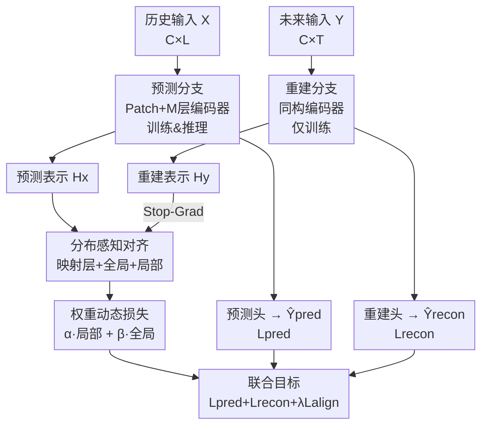

# Bridging Past and Future: Distribution-Aware Alignment for Time Series Forecasting

**会议**: ICLR2026  
**OpenReview**: [https://openreview.net/forum?id=pQzQfslqlD](https://openreview.net/forum?id=pQzQfslqlD)  
**代码**: https://github.com/TROUBADOUR000/TimeAlign  
**领域**: 时间序列预测 / 表示学习  
**关键词**: 时间序列预测、分布对齐、重建、表示学习、频域

## 一句话总结
针对时间序列预测里"用历史的统计规律去硬套未来分布"导致的分布失配，本文提出 TimeAlign——一个即插即用的双分支框架，用一个只在训练时存在的"重建未来"分支提供对齐的目标分布，再通过全局+局部对齐把预测分支的表示拉向未来真实分布，在 8 个基准上把 MSE/MAE 相对次优方法降低 3.27%/5.20%。

## 研究背景与动机

**领域现状**：表示学习（对比学习、各类自监督）在视觉和 NLP 里大放异彩，但搬到时间序列预测（TSF）上效果有限。当前主流的深度预测器几乎都是"编码器—预测头"范式：把历史窗口 $X$ 编码成隐表示，再直接映射到未来 $Y$。

**现有痛点**：作者把这个单向范式的失败拆成三条具体证据。其一，**低频捷径**——只用 MSE/MAE 误差驱动训练时，模型倾向于让预测围绕学到的均值震荡、复读历史里的低频周期信号，预测出来的各个 patch 之间余弦相似度高得离谱（说明就是在重复同一个低频模式），而真值里那些反映突变的高频分量被严重低估。其二，**过去与未来的分布失配**——学到的高维表示分布偏向历史的统计特性，和未来目标的分布对不上，直接把历史表示映射到目标分布很难。其三，**单向范式的结构缺陷**——历史信息逐层深编码的过程像个"频率平滑器"，把细粒度的高频结构（往往编码了外部事件触发的突变）一点点抹掉了，导致预测和真值在高频上的相关性一直很低。

**核心矛盾**：根本问题在于"只用历史推未来"这个单向结构本身——它既无法约束表示去贴合未来分布，也会在深层编码中丢掉对鲁棒预测至关重要的高频细节。

**本文目标**：能不能设计一个框架，在缓解分布漂移的同时，忠实地保留多频段动态，把过去和未来"桥接"起来？

**切入角度**：作者的关键观察是——**重建（reconstruction）天然能提供一个对齐未来分布的参照**。重建任务是"从 $Y$ 自身恢复 $Y$"，它的嵌入天生就落在目标分布上；而且为了忠实重建信号，重建会逼模型同时关注粗粒度周期结构和细粒度高频变化。于是只要让一个"重建未来"的分支去引导"预测"分支，就能把预测表示约束成既感知分布、又保留细节的样子。

**核心 idea**：用一个只在训练时存在的"重建未来"辅助分支当锚，把预测分支的中间表示对齐到这个锚上——即 prediction–reconstruction–alignment 三步范式替代原来的单向 prediction。

## 方法详解

### 整体框架

形式上，TSF 的目标是学一个 $F_\theta(\cdot)$，给定历史 $X \in \mathbb{R}^{C\times L}$（$C$ 个通道、回看长度 $L$）预测未来 $\hat{Y}_{pred} \in \mathbb{R}^{C\times T}$。问题在于 $X$ 与 $Y$ 存在分布漂移。TimeAlign 的做法是额外引入一个重建模型 $G_\phi(\cdot)$，它**直接把未来 $Y$ 映射回它自己的重建 $\hat{Y}_{recon}=G_\phi(Y)$**，从而学到一个不依赖历史、纯粹刻画目标分布的紧凑表示 $H_y$，再用 $H_y$ 当参照去对齐预测分支的隐表示 $H_x$。

整个框架由四个部件组成：**预测分支**（训练+推理都用，骨干可换成任意预测器）把历史编码后映射到 $\hat{Y}_{pred}$；**重建分支**（只在训练时存在，推理时丢弃）把未来编码后重建出 $\hat{Y}_{recon}$，提供贴合目标分布的 $H_y$；**分布感知对齐模块**在每一层用全局+局部两种机制把 $H_x$ 拉向 $H_y$；以及一个**轻量编码器**作为重建分支和默认预测分支的最小实现。两条分支共享同样的 patch 数 $N$ 和同一套 $M$ 层编码器结构，预测损失 + 重建损失 + 对齐损失联合优化。关键之处在于：推理时只剩预测分支，所以对齐带来的收益完全是"训练时被重建分支调教"的结果，不增加任何推理开销。

### 关键设计

**1. 重建未来分支：给预测一个落在目标分布上的"锚"**

这一招直接针对"过去与未来分布失配"这个痛点。与其让模型用历史的统计量去硬猜未来，作者干脆让重建分支 $G_\phi$ 把未来 $Y$ patch 化后编码、再重建回去：$Y_p=\text{Linear}(\text{Patching}(Y))$，经过 $M$ 层 `线性-激活-线性 + 残差` 的编码器（$H_y^l=H_y^{l-1}+\text{Linear}(\sigma(\text{Linear}(H_y^{l-1})))$）得到 $H_y$，最后 $\hat{Y}_{recon}=\text{Linear}(H_y^M)$。因为重建是"从 $Y$ 恢复 $Y$"，$H_y$ 天然贴合目标分布，且为了忠实恢复信号必须同时保留低频周期和高频细节——这恰好补上了单向范式丢失的两样东西。预测分支用的是结构完全相同的轻量编码器，作者故意把骨干做到最简，就是为了证明涨点来自对齐而非更复杂的网络。理论上（附录 B）他们还证明了：基于重建误差最小化得到的估计 $M_2$ 比纯经验估计 $M_1$ 更接近最优解 $M^*$，即 $\frac{|M_2-M^*|_F}{|M^*|_F}\ll\frac{|M_1-M^*|_F}{|M^*|_F}$，也就是重建能改善预测的泛化。

**2. 带额外映射的非对称对齐：让重建分支当稳定的"老师"**

预测和重建两条分支各编各的，隐空间仍会因为 $X$、$Y$ 的分布漂移而发散。直接拉齐两个原始隐状态太硬，作者在预测分支对齐前先加一层轻量线性映射 $\tilde{H}_x^i=\text{Linear}(H_x^i)$，把预测分支高度抽象的特征做时间重定位和归一化，使它更兼容重建分支的表示。更关键的是**梯度只通过这层 Linear 回流到预测分支，重建分支被 stop-gradient 挡住**——这种非对称梯度流借鉴自 SimSiam，保证重建分支始终提供一个稳定的监督信号、不会反过来被对齐过程带偏。换句话说，重建分支是固定的"老师"，预测分支是要被纠正的"学生"，只有学生动。

**3. 局部 + 全局互补对齐：同时管细节和管结构**

对齐分两个互补目标。**局部对齐**保证逐 patch 的细粒度一致性，捕捉尖锐转折和高频细节——它度量的其实是频谱能量投影，所以等于在利用多频段信息。设 $h_{x,j}^i$ 为第 $i$ 层第 $j$ 个 patch，$n=C\cdot N_L$：

$$L^i_{local}=\frac{1}{n^2}\sum_{j=1}^{n}\text{GELU}\Big(1-\tilde{h}^i_{x,j}\cdot h^i_{y,j}-\delta_{loc}\Big)$$

**全局对齐**则让两套特征的相对距离矩阵尽量一致，保证大尺度时间依赖和低频动态也对上：

$$L^i_{global}=\frac{1}{n^2}\sum_{j=1}^{n}\text{GELU}\Big(\tilde{h}^i_{x,j}(\tilde{h}^i_{x,j})^\top - h^i_{y,j}(h^i_{y,j})^\top - \delta_{glo}\Big)$$

两个 margin $\delta_{loc}$、$\delta_{glo}$ 是度量学习里常见的松弛技巧：制造一个"缓冲区"，两个表示已经够近时损失直接归零，避免在简单样本上过拟合，把优化力气集中在难对齐的样本上。实验里全局单独用比局部单独用更强（全局提供粗粒度的分布级牵引，更利于高层表示校准），但两者一起才最好。

**4. 权重动态损失：自适应防止某一目标主导**

局部和全局两个损失量级会随数据集波动，写死权重容易顾此失彼。作者用一个自适应方案动态算权重：

$$\alpha=\frac{L_{local}+L_{global}}{L_{local}},\quad \beta=\frac{L_{local}+L_{global}}{L_{global}}$$

直觉是谁的损失小、谁的权重就大（被乘上去后两项贡献被拉平），从而防止某一目标主导、在不同数据集和不同 regime 下稳定优化。最终对齐损失是逐层加权融合 $L_{align}=\frac{1}{M}\sum_{i=1}^{M}(\alpha L^i_{local}+\beta L^i_{global})$。整体目标为 $L=L_{pred}+L_{recon}+\lambda L_{align}$，其中 $L_{pred}$、$L_{recon}$ 都是 MAE 误差，$\lambda$ 是缩放权重。作者还从互信息最大化（MIM）角度给了第二条理论（附录 C）：常规预测损失只是 $I(Y;H_x)$ 的一个变分下界，而对齐损失借鉴 InfoNCE，用密度比 $f(y,h_x)=\exp(\text{proj}(h_x)^\top G_\phi(y))$ 显式地进一步抬高 $H_x$ 与 $Y$ 的互信息，所以 TimeAlign 本质是个隐式的互信息增强器。

### 损失函数 / 训练策略
联合目标 $L=L_{pred}+L_{recon}+\lambda L_{align}$，预测/重建用 MAE，对齐用上述全局+局部加权和。所有实验在单张 V100 32GB 上跑，回看长度在 $\{96,192,336,512,720\}$ 上网格搜索，每个设置用三个随机种子取平均。

## 实验关键数据

### 主实验

8 个真实数据集（ETTh1/h2/m1/m2、Weather、Electricity、Traffic、Solar），4 个预测长度 $T\in\{96,192,336,720\}$ 取平均。

| 数据集 | 指标 | TimeAlign | 次优(TVNet) | iTransformer | DLinear |
|--------|------|-----------|-------------|--------------|---------|
| ETTm1 | MSE/MAE | **0.340/0.367** | 0.348/0.379 | 0.362/0.391 | 0.356/0.378 |
| ETTm2 | MSE/MAE | **0.243/0.302** | 0.251/0.311 | 0.269/0.329 | 0.259/0.324 |
| Weather | MSE/MAE | **0.214/0.244** | 0.221/0.261 | 0.233/0.271 | 0.242/0.293 |
| Electricity | MSE/MAE | **0.154/0.244** | 0.165/0.254 | 0.164/0.261 | 0.166/0.264 |
| Traffic | MSE/MAE | **0.378/0.240** | 0.396/0.268 | 0.397/0.282 | 0.418/0.287 |
| Solar | MSE/MAE | **0.192/0.214** | 0.228/0.277 | 0.202/0.248 | 0.224/0.226 |

相对次优方法 TVNet，TimeAlign 平均把 MSE/MAE 降低 **3.27%/5.20%**，Wilcoxon 检验 p 值 $1.37\text{e}{-8}$，99% 置信度下显著。唯二打不过的是 ETTh1/h2，但也很接近；在以分布漂移严重著称的 ETTm1/m2 上优势最明显。

### 消融实验

| 配置 | ETTm1 MSE/MAE | Weather MSE/MAE | Electricity MSE/MAE | 说明 |
|------|---------------|-----------------|---------------------|------|
| ① 无对齐 | 0.349/0.370 | 0.225/0.254 | 0.159/0.248 | 仅预测分支（已是 SOTA 级 baseline） |
| ② 仅局部 | 0.344/0.372 | 0.220/0.249 | 0.157/0.247 | 加局部对齐 |
| ③ 仅全局 | 0.342/0.369 | 0.218/0.247 | 0.157/0.246 | 加全局对齐（单独比局部强） |
| ④ 局部+全局 | **0.340/0.367** | **0.214/0.244** | **0.154/0.244** | 完整模型 |

### 关键发现
- **全局对齐单独用 > 局部对齐单独用**：全局提供粗粒度的分布级牵引，更利于高层表示校准；局部聚焦逐点的细粒度修正。两者互补，合起来才最优。
- **即插即用真的有效**：把 TimeAlign 当插件接到 iTransformer 和 DLinear 上，多数基准 MSE/MAE 涨 1%–4%，且预测与真值的余弦相似度 SIM 同步提升（如 ETTm2 上 iTransformer+Align ∆IMP +3.44%）。Weather/Solar 上偶有掉点，原因是极端离群值和零填充扭曲了分布、放大了对齐损失。
- **收敛更快、推理零额外开销**：插件版几乎不改每步延迟、略增显存（iTransformer 6672MB→7320MB，142ms→158ms），但在 Traffic 上比原版提前 3000 个 iteration 达到同样验证损失。重建分支推理时丢弃。
- **频率纠偏是收益来源**：作者用频谱分析确认涨点主要来自修正了历史输入与未来输出之间的频率失配；t-SNE 可视化显示 TimeAlign 的预测几乎完美贴合真值流形，而原版 iTransformer/DLinear 有明显分布发散。

## 亮点与洞察
- **"重建未来"当锚是很聪明的角度**：常规思路是给预测分支加更强的归一化/去漂移模块，本文反过来——既然未来分布难猜，那就在训练时直接把未来喂进一个重建分支拿到目标分布的真身，再用它去校准预测。推理时这个分支整个丢掉，等于"训练时偷看答案、推理时不增加成本"。
- **非对称梯度（stop-grad）的复用很到位**：把 SimSiam 里防坍缩的 stop-gradient 借来当"稳定老师"，让对齐有一个不动的参照，避免两条分支互相带偏——这个 trick 可迁移到任何"用辅助分支引导主分支"的设定。
- **局部对齐 = 频谱能量投影**这个解释把"逐 patch 余弦相似"和"高频保真"联系起来，给了一个频域视角的合理化，不只是经验上的损失项堆叠。
- **权重动态损失**用"损失越小权重越大"自动平衡两个对齐目标，省掉了一个难调的超参，在跨数据集时尤其省心，可直接搬到其他多目标对齐场景。

## 局限与展望
- 作者承认在 Weather、Solar 上即插即用会掉点，原因是极端离群值和零填充破坏了分布、放大对齐损失，且过于复杂的骨干会妨碍对齐模块纠正层级抽象表示——说明该方法对"分布干净、骨干不太重"的设定更友好。
- ETTh1/h2 上略逊于若干 baseline，框架对小样本/强噪声长周期数据的优势没那么稳。
- 两条理论（重建改善泛化、对齐增大互信息）都依赖一些近似假设（如隐表示近似高斯、InfoNCE 下界），是定性指引而非紧界，实际收益仍以实验为准。
- 重建分支需要在训练时访问完整未来 $Y$，这在标准监督训练里没问题，但若想扩展到在线/流式或只有部分未来可见的场景，重建锚的构造方式需要重新设计。

## 相关工作与启发
- **vs 对比学习类表示学习（如 TS2Vec/对比自监督）**：它们靠正负样本对构造表示空间，本文明确说自己"区别于对比学习"——不用负样本，而是用重建分支提供的目标分布锚做对齐，把表示直接拉向未来分布，目的更聚焦于消除过去/未来的分布漂移。
- **vs 归一化去漂移方法（RevIN / 各类 normalization）**：那类方法在输入输出端做统计量对齐来缓解分布漂移，本文则在**表示层**做对齐，且引入了一个携带目标分布信息的重建锚，能同时保留高频细节而不只是对齐均值方差。
- **vs 纯骨干创新（iTransformer、PatchTST、TVNet、ModernTCN 等）**：这些在架构上做文章，TimeAlign 是正交的即插件——可以接在它们之上再涨 1%–4%，证明收益来自训练范式而非更强骨干。

## 评分
- 新颖性: ⭐⭐⭐⭐⭐ "重建未来当锚 + 表示层分布对齐"的范式切换角度新颖，区别于对比学习
- 实验充分度: ⭐⭐⭐⭐ 8 数据集 + 消融 + 即插件 + t-SNE/频谱分析 + 显著性检验，扎实；ETTh 系列略弱
- 写作质量: ⭐⭐⭐⭐ 三条失败模式分析清晰，图文对照充分，理论部分稍偏概览
- 价值: ⭐⭐⭐⭐⭐ 轻量、即插即用、推理零额外开销，落地友好

<!-- RELATED:START -->

## 相关论文

- [\[ICLR 2026\] DistDF: Time-series Forecasting Needs Joint-distribution Wasserstein Alignment](distdf_time-series_forecasting_needs_joint-distribution_wasserstein_alignment.md)
- [\[ICLR 2026\] COSA: Context-aware Output-Space Adapter for Test-Time Adaptation in Time Series Forecasting](cosa_context-aware_output-space_adapter_for_test-time_adaptation_in_time_series_.md)
- [\[ICLR 2026\] CoRA: Boosting Time Series Foundation Models for Multivariate Forecasting through Correlation-aware Adapter](cora_boosting_time_series_foundation_models_for_multivariate_forecasting_through.md)
- [\[ICLR 2026\] Aurora: Towards Universal Generative Multimodal Time Series Forecasting](aurora_towards_universal_generative_multimodal_time_series_forecasting.md)
- [\[ICLR 2026\] Characteristic Root Analysis and Regularization for Linear Time Series Forecasting](characteristic_root_analysis_and_regularization_for_linear_time_series_forecasti.md)

<!-- RELATED:END -->
