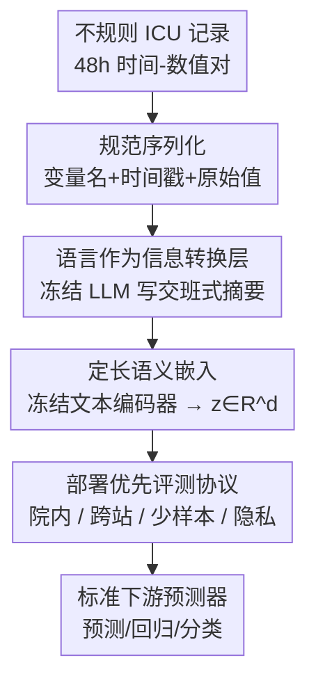

# Can we generate portable representations for clinical time series data using LLMs?

**会议**: ICLR2026  
**OpenReview**: [https://openreview.net/forum?id=pXw0uRTSKT](https://openreview.net/forum?id=pXw0uRTSKT)  
**代码**: https://github.com/Jerryji007/Record2Vec-ICLR2026  
**领域**: 临床时间序列 / 表示学习 / LLM 应用 / 跨医院迁移  
**关键词**: 可移植表示, ICU 时间序列, LLM 摘要, 文本嵌入, 分布偏移

## 一句话总结
本文提出 **Record2Vec**：用冻结的 LLM 把不规则的 ICU 时间序列记录写成简洁的临床交班式自然语言摘要，再用冻结的文本嵌入模型把摘要编码成定长向量，作为标准预测器的输入；在三个医院队列、五类任务上，它不仅院内（in-distribution）有竞争力，更关键的是跨医院迁移时性能掉得更少、少样本更省数据、且不增加人口学隐私泄露。

## 研究背景与动机
**领域现状**：临床机器学习模型的部署是「一家医院一家医院地做」。团队在 A 医院建好模型、跑静默试验、调阈值和特征，才敢上线；换到 B 医院又得从头来一遍。每换一家医院，数据分布、人群构成、疾病发生率都在变（化验政策、病例组合、患病率不同），模型性能会退化，部署周期被拉长。

**现有痛点**：现在的主流解法都把**模型**当成那个要跨机构搬运的对象。OMOP、FHIR 这类互操作标准只统一了数据**格式**，并不保证换个站点后输入表示仍然有判别力，而且统一格式时常常把临床上重要的上下文给抹掉了；领域自适应（domain adaptation）、不变风险最小化（IRM）这类方法则要把模型**适配**到目标医院，代价是额外的目标站数据、标签和校准；在 EHR 上预训练的基础模型虽然院内表现好、减少了任务工程量，但往往绑死在某种传感器 schema 或采样模式上，跨站迁移依旧要调参。

**核心矛盾**：大家都在「标准化数据格式（可能丢临床语义）」或「重新校准模型」两条路上打转，却忽略了一个互补的角度——**真正难搬运的不是模型，而是输入表示**。如果能把异构的电子病历映射进一个语义对齐、与站点无关的接口，常规预测器本就不需要那么多站点特定的适配。

**切入角度**：临床医生其实早就在解一个类似问题。接手新病人或换班时，医生会通过**结构化的叙述性交班（handoff）**来解读异构的测量值——把临床上关键的上下文凸显出来，同时把测量上的琐碎差异抽象掉。本文的假设是：LLM 能不能也把不规则的多变量病人历史，转写成一致的、交班风格的摘要，充当一个**可移植的中间表示**？

**核心 idea**：用「先摘要、再嵌入」（summarize-then-embed）的两步流水线，把语言当成一个**信息转换层**：冻结的 LLM 把不规则时间序列写成自然语言摘要（在语义空间归一化单位、消解同义词、抹平站点特定编码），冻结的文本嵌入模型再把摘要变成定长向量，喂给不改架构的标准预测器，从而实现可移植的输入表示 → 可移植的模型。

## 方法详解

### 整体框架
Record2Vec 解决的核心问题是：让一家医院训出来的下游预测器，几乎不用重训/微调就能搬到另一家医院用。它的做法是把「输入表示」这件事彻底换掉——不再喂数值网格，而是喂从摘要文本里编码出来的语义向量。

形式化地，站点 $s$ 上某次住院 $i$ 在 48 小时窗口内的不规则记录是 $R^{(s)}_i = \{(c, \{(t_k, v_k)\}_{k=1}^{K_c}) : c \in C^{(s)}\}$，即从临床概念 $c$ 到该窗口内观测到的「时间-数值」对的字典。整条流水线分两步：先用冻结 LLM $g_\phi$ 把记录连同提示 $\pi$ 转成摘要 $\text{text}_i = g_\phi(R^{(s)}_i, \pi)$；再用冻结文本编码器 $h_\psi$ 把摘要编码成定长向量 $z_i = h_\psi(\text{text}_i) \in \mathbb{R}^d$，供共享的下游解码器/预测头使用。两个模型都**冻结、不微调**，把「表示学习」和「下游优化」解耦，从而限制对站点特定伪影的过拟合，也提升可复现性。

### 关键设计

**1. 语言作为信息转换层：把数值网格换成临床交班式摘要**

本文针对的痛点是：数值插补（imputation）会丢掉临床语义、且对缺失模式和站点采样习惯极度敏感，搬到新医院就崩。Record2Vec 的做法是让冻结 LLM $g_\phi$ 把整个 48h 窗口写成一段简洁的、模仿医生交班的自然语言摘要——凸显生命体征、化验、治疗、趋势、关键事件和数据缺口。这一步的关键在于它**在语义空间而非受 schema 约束的数值空间里操作**：可以归一化单位、消解同义词、抹平站点特定的编码伪影，把异构的采样策略和缺失模式对齐到可比较的临床概念上。这正是它跨站迁移更稳的根因——异构的变量名、单位、文档风格在嵌入之前就被统一进了「共享的临床语言」，下游解码器不必再去重新学每个站点的约定。作者同时设了一个**无摘要对照** $z^{\text{direct}}_i = h_\psi(\text{serialize}(R^{(s)}_i))$，即直接把规范序列化文本嵌入，用来隔离「摘要」本身的贡献。

**2. 先摘要再嵌入：定长向量统一下游接口、顺带省 25× token**

承接上一步，摘要文本由冻结文本编码器 $h_\psi$（默认 Qwen3 text-embedding）映射成定长向量 $z_i \in \mathbb{R}^d$。定长这件事看似平淡却很关键：它**稳定了下游接口**，让预测器对缺失模式和局部测量习惯不再敏感（这正是网格输入在分布偏移下掉点的来源），并且简化了训练预算、天然支持零样本/少样本迁移。另一个被实验验证的实际收益是效率——不做摘要、直接把原始序列化喂给嵌入器，平均要多传 **$\sim$25 倍 token**；摘要把输入压短，等比例砍掉推理成本，同时还改善了迁移性。

**3. 摘要器的选择与提示设计：保真度 vs 标准化的权衡**

本文系统比较了三种代表不同部署场景的摘要器：大型通用模型 Gemini-2.0 Flash、临床调优模型 MedGemma、小型开源模型 Llama-3.1。结论是 Gemini-2.0 Flash 和 MedGemma 最强、Llama-3.1 较弱——背后机理是 MedGemma 的医学预训练带来跨机构稳定的、临床上忠实的措辞（利于迁移），Gemini 的指令跟随能力产出信息密度高的简洁摘要（院内略强、迁移也有竞争力），而 Llama 容量小、领域专精弱，摘要更短或更不标准化，院内和跨站都吃亏。提示设计上比较了结构化 slot 式 vs 自由叙述，以及 zero-shot / CoT / 趋势聚焦 / ICD 聚焦四种策略：**整体上对提示选择不敏感**（高层临床内容在四种提示下都能保留），只是在迁移时 ICD 风格的提示略占优——因为它把摘要往标准化术语上推，更「travel-friendly」。一个重要发现是：**结构化提示能显著降低预测模型的方差，却不改变平均精度**，对部署的稳定性很有价值。

**4. 部署优先的评测协议：把「可移植性」当成一等评测目标**

本文的一个方法论贡献是重新定义「该测什么」。它把可移植性、部署成本当成一等评测端点，设计了三种设定：**院内（in-distribution）**——在单一队列内训练验证、测其留出集；**跨站（cross-site）**——在源队列训练、在另一个队列上无目标标签地测，报告目标精度及相对院内的下降幅度；**少样本（few-shot）**——从源训练模型出发，在 16/64/512 个目标标注样本上微调再测。预算、早停、容量、正则在同一输入类型内对齐，保证比较公平。这套协议让「换医院后掉多少」「需要多少目标标签」这些真正决定能否落地的问题第一次被摆到台面上。

### 一个完整示例
以「在 MIMIC 训练、迁到 PPICU 预测院内死亡」为例走一遍：取某次住院的 48h 窗口 $R$（一堆不规则的生命体征/化验/给药记录）→ 先做规范序列化，列出每个出现变量的名称和完整的时间戳-原始值序列 → 冻结 LLM 用 ICD 风格提示把它写成一段交班摘要（如「血压持续偏低、乳酸上升、已用升压药、近 6h 尿量下降」），过程中自动把 MIMIC 和 PPICU 不同的变量命名/单位对齐到同一套临床表述 → 冻结 Qwen3 编码成定长向量 $z$ → 喂给在 MIMIC 上训好的下游死亡预测头。因为 $z$ 已经是跨医院语义对齐的，PPICU 的不同 schema、采样习惯、缺失模式对它影响很小，所以这个在 MIMIC 训的头直接用在 PPICU 上仍然有效（迁移表 RQ2 中死亡 AUROC 0.72，远高于插补类塌到 0.50 的随机水平）。

## 实验关键数据

数据：三个 ICU 队列 MIMIC-IV（57,212 次住院、60 变量）、HiRID（32,216 次、64 变量）、PPICU（39,000 次、75 变量，来自不同医院系统的外部数据集）。每次住院切成不重叠的 48h 窗口。五类任务：未来 24h 多变量预测、剩余住院时长（LoS）、院内死亡、两个治疗指示（升压药/抗生素）、十项常见血检是否会被开具的多标签预测；外加两个隐私探针（年龄、性别可恢复性）。除特别说明外，下游模型统一用 PatchTSMixer，结果为 4 个 seed 平均。

### 主实验（院内 RQ1）
15 个院内任务里 Record2Vec 拿下 **13 个最佳**、其余两个第二（下表节选 AUROC/Recall 指标，越高越好；Forecast 为 MSE、LoS 为 MAE，越低越好）：

| 数据集/任务 | 指标 | Record2Vec | TSDE | TimesFM | 最优插补 |
|---|---|---|---|---|---|
| MIMIC 死亡 | AUROC | **0.888** | 0.915* | 0.791 | 0.886 |
| MIMIC 预测 | MSE | **0.027** | 0.030 | 0.030 | 0.035 |
| PPICU 给药 | Recall | **0.937** | 0.899 | 0.923 | 0.834 |
| HiRID 化验 | Recall | **0.931** | 0.902 | 0.925 | 0.858 |
| Wins（总 15）| 计数 | **13** | 1 | 0 | 1 |

（*注：MIMIC 死亡这一列 TSDE 0.915 实为该列最佳，Record2Vec 在此列居后；整体 13 胜来自其余任务。以原文 Table 1 为准。）

### 跨站迁移（RQ2）+ 消融
迁移设定（HiRID→PPICU、MIMIC→PPICU 共 10 列）Record2Vec **10/10 全胜**（TimesFM 两处并列）；插补类在偏移下急剧退化、多个分类塌向随机（AUROC≈0.50）。下表兼作消融，关键对照是「无摘要直接嵌入」与「固定模板（Record2Vec Template）」：

| 配置 | 跨站表现 | 说明 |
|---|---|---|
| Record2Vec（完整） | 迁移 10/10 胜 | 摘要+嵌入，迁移最稳 |
| Record2Vec Template | 仅 2 列胜 | 换成固定模板而非自由摘要，迁移收益缩水 |
| 无摘要（直接嵌入）| 跨站集中在最差档 | 院内常最优，但站点细节害了可移植性 |
| 网格插补 | 多任务塌向 0.50 | 偏移下崩溃 |

### 关键发现
- **「无摘要」院内最强、跨站最弱**：直接嵌入原始序列化保留了全部数值细节，院内判别力强；但正是这些站点特定细节损害了可移植性，跨站集中在最差排名——这从反面印证了「摘要做的是抹平站点差异」。
- **摘要器排序 Gemini-2.0 Flash ≈ MedGemma > Llama-3.1**：医学预训练（MedGemma）带来跨机构稳定的临床措辞，迁移时与 Gemini 差距收窄。
- **提示设计影响小、但结构化提示降方差**：四种提示院内/迁移大体相当，ICD 风格在迁移略优；结构化提示在不改平均精度的前提下显著降低预测方差。
- **少样本极省数据**：在 PPICU 上只用 16 个标注样本微调，Record2Vec 就逼近用 36,019 个样本训的院内参考模型，说明极少监督即可找回分布偏移损失的大部分性能。
- **不增加隐私泄露**：性别预测对所有方法都塌成常数（近随机），Record2Vec 的年龄 MAE 与基线相当甚至更高；摘要里很少显式提到年龄/性别，编码阶段也没被优化去捕捉它们。

## 亮点与洞察
- **把「可移植性」从模型搬到了输入**：核心「啊哈」在于颠倒了搬运对象——不去适配模型，而是造一个站点无关的语义输入接口，这让任意轻量下游分类器都能跨院直接用，省掉了搬运整条端到端流水线的工程开销。
- **用自然语言当「对齐层」**：语言天然能归一化单位、消解同义词、抹平编码伪影，这个性质被巧妙地用来对齐异构 EHR——比强行把各医院 raw schema 塞进统一句法格式更保语义。
- **冻结即正则**：摘要器和编码器全程冻结，反而成了防止过拟合站点伪影的手段，并把表示学习与下游优化解耦，可迁移到任何「异构源 → 统一表示」的部署场景。
- **效率彩蛋**：摘要顺带把喂给嵌入器的 token 砍掉约 25×，可移植性和推理成本同时改善，这在生产级部署里是实打实的省钱。

## 局限与展望
- **依赖冻结 LLM 的摘要质量**：小模型（Llama-3.1）摘要不够标准化就明显掉点，方法上限被摘要器能力卡住；临床上「漏写关键事件」的风险需要更系统的保真度评估。
- **隐私结论范围有限**：作者明确说只测了人口学（年龄/性别）泄露，不排除成员推断（membership inference）、嵌入反演（embedding inversion）等其他隐私风险。
- **评测仍以单一下游模型为主**：正文主要用 PatchTSMixer（死亡任务用最佳模型），虽附录验证了 MLP/LSTM/TimeMixer 趋势一致，但不同下游头与摘要表示的交互仍值得更细的分析。
- **改进方向**：作者指出提示工程是有前景的未来方向（ICD 风格已显露迁移优势）；此外摘要的事实一致性校验、面向隐私的摘要约束都可深入。

## 相关工作与启发
- **vs 网格插补流水线（mean/right-shift/interpolation）**：它们把不规则记录离散成小时网格再补全，依赖站点统计做归一化；本文不补数值、改走语义摘要，分布偏移下不会像插补那样塌向随机。
- **vs 自监督时序表示（TSDE）**：TSDE 用掩码插补/插值/预测目标学通用嵌入，强调数值流里的相关性与趋势；本文额外注入临床语义上下文（状态、趋势、关键事件），分类端点上更有判别力、迁移更稳。
- **vs 时序基础模型（TimesFM）**：TimesFM 的预训练让它迁移好于 TSDE，但仍只绑在数值趋势上；Record2Vec 同时保留数值与临床含义，迁移整体更优。
- **vs TabLLM / DeLLiriuM 等 LLM-on-EHR**：这些方法微调 LLM 做直接预测、常需搬运站点调优过的 LLM；本文坚持「冻结、本地部署、只准备可移植输入表示 $X$」的部署哲学，让医院无需移植整条端到端流水线。

## 评分
- 新颖性: ⭐⭐⭐⭐⭐ 把「搬运对象」从模型换成输入表示，部署优先的视角和 summarize-then-embed 实例化都很清新
- 实验充分度: ⭐⭐⭐⭐⭐ 三队列、五任务、七个 RQ，院内/跨站/少样本/隐私/信息分析全覆盖
- 写作质量: ⭐⭐⭐⭐ 动机清晰、RQ 组织得当，部分结论需对照附录细读
- 价值: ⭐⭐⭐⭐⭐ 直击临床 ML「一家医院一家医院部署」的真实痛点，工程意义大

<!-- RELATED:START -->

## 相关论文

- [\[ICLR 2026\] CauKer: Classification Time Series Foundation Models Can Be Pretrained on Synthetic Data](cauker_classification_time_series_foundation_models_can_be_pretrained_on_synthet.md)
- [\[ICLR 2026\] A Unified Federated Framework for Trajectory Data Preparation via LLMs](a_unified_federated_framework_for_trajectory_data_preparation_via_llms.md)
- [\[AAAI 2026\] IdealTSF: Can Non-Ideal Data Contribute to Enhancing Time Series Forecasting?](../../AAAI2026/time_series/idealtsf_can_non-ideal_data_contribute_to_enhancing_the_performance_of_time_seri.md)
- [\[ICLR 2026\] SciTS: Scientific Time Series Understanding and Generation with LLMs](scits_scientific_time_series_understanding_and_generation_with_llms.md)
- [\[ICLR 2026\] AutoDA-Timeseries: Automated Data Augmentation for Time Series](autoda-timeseries_automated_data_augmentation_for_time_series.md)

<!-- RELATED:END -->
