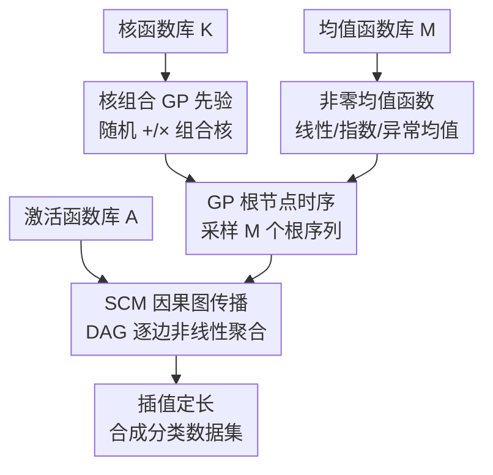

# CauKer: Classification Time Series Foundation Models Can Be Pretrained on Synthetic Data

**会议**: ICLR2026  
**OpenReview**: [https://openreview.net/forum?id=xBW2FIfswU](https://openreview.net/forum?id=xBW2FIfswU)  
**代码**: https://github.com/ShifengXIE/CauKer  
**领域**: 时序基础模型 / 合成数据预训练  
**关键词**: 时序基础模型, 合成数据, 高斯过程核, 结构因果模型, 缩放定律

## 一句话总结
CauKer 把高斯过程的核组合与结构因果模型（SCM）拼到一起，造出既有真实时序结构、又自带类别簇结构的纯合成时序，仅用这些数据预训练分类型时序基础模型（TSFM），就能在 128 个 UCR 数据集上几乎追平用大几十倍真实语料训练的原版模型，并首次展现出干净的数据/模型缩放定律。

## 研究背景与动机
**领域现状**：时序基础模型（TSFM）这两年很火，靠强 zero-shot 能力在预测和分类任务上都拿到了不错的成绩。主流做法是堆数据——从各个领域收集、清洗大规模真实时序语料做预训练，最夸张的工作用了 3000 亿个时间点。

**现有痛点**：这套"堆真实数据"的范式在分类任务上尤其难受。一是时序分类本身缺乏多样、丰富的预训练语料；二是真实分类语料（如 UEA）由一堆小的、异质的、样本量极不均衡的数据集拼凑而成，质量参差；三是用真实数据评测 OOD 泛化时还有数据泄漏风险。论文里更尖锐的观察是：在这种真实语料上，TSFM **几乎看不到缩放定律**——加数据、加参数，准确率不增反抖。

**核心矛盾**：分类任务对合成数据有两个看似冲突的要求。一方面，生成的序列要有季节性、周期、趋势这些真实时序"长相"；另一方面，分类要成立，样本之间必须有**有意义的簇结构**，模型才能学会把不同类别区分开。已有的合成管线各占一头：预测向的核方法（如 Chronos 的 KernelSynth）画零均值高斯过程，擅长平滑外推但没有类别可分性；表格分类向的 SCM 生成器（TabPFN）能造丰富的非线性因果依赖，却完全丢掉了时序结构。

**本文目标**：设计一条专为**时序分类** TSFM 服务的纯合成数据生成管线，让模型只看合成数据预训练，就能匹配甚至超过看真实数据的版本，同时把缩放定律找回来。

**切入角度**：既然两类现成管线各有一半优点，那就把它们**焊接**起来——用核组合的高斯过程负责"时序长相"，用 SCM 负责"因果可分性"。

**核心 idea**：用「核组合 GP 先验 + SCM 因果传播」生成既真实又可分的合成时序，把"造数据"而非"改架构"作为提升 TSFM 的主路径。

## 方法详解

### 整体框架
CauKer（Causal-Kernel）是一条五步合成数据生成管线，输入是三个预定义的函数库（核函数库 $\mathcal{K}$、均值函数库 $\mathcal{M}$、激活函数库 $\mathcal{A}$），输出是一批长度固定（实验里 $T=512$）的单变量合成时序，直接拿去做 TSFM 的自监督预训练。整条流程的骨架是：先用核库随机采样并组合出复合核，配上从均值库采的均值函数，组成若干个高斯过程先验；从这些 GP 先验里采样得到的时序充当一张有向无环图（DAG）的**根节点**；图的每条边挂一个激活函数，把根节点的信号沿因果图非线性地传播、聚合到下游节点；最后把各节点输出插值到统一长度，汇成合成数据集。

关键直觉是：GP 那一半保证了周期性、季节性等"真实时序母题"，SCM 那一半通过有向边注入非线性因果语义，让生成的序列天然带有簇结构。论文还指出，同一个 SCM 的不同节点可以理解为共享同一因果结构的多变量时序的不同通道——本文为对齐 TSFM 的单变量预训练，把每个节点轨迹当成一条独立的单变量序列用。

### 关键设计

**1. 核组合 GP 先验：把真实时序的"长相"写进数据**

分类合成数据的第一个要求是序列得像真的时序——有季节性、周期、趋势。CauKer 沿用 Chronos（Ansari 等）的核函数库，第 1 步从库里 i.i.d. 采出随机数量 $K\sim\mathcal{U}(1,n_\mathcal{K})$ 个候选核 $\{\kappa_i(t,t')\}_{i=1}^K$；第 2 步用 $K-1$ 个随机选的二元运算（加法 $+$ 与乘法 $\times$）把它们组合成一个复合核 $\kappa^* = \kappa_1 \star_1 \cdots \star_{K-1} \kappa_K$。加法核叠加不同频率/尺度的成分，乘法核制造调制与交互，组合之后单个复合核就能表达相当复杂的时序母题。这一步直接继承了预测向 KernelSynth 的优点，但它只是半成品——单靠零均值 GP，生成的序列没有类别区分度。

**2. 非零均值函数：把类别可分的"簇结构"写进数据**

这是 CauKer 区别于预测向核方法的第一个关键改动，也是被消融实验确认有效的设计。KernelSynth 为了平滑外推画的是**零均值** GP，但分类任务恰恰需要保留均值水平本身作为判别线索。第 3 步 CauKer 从均值函数库采 $M\sim\mathcal{U}(1,n_\mathcal{M})$ 个均值函数 $\{\mu_i(t)\}$，库里包含线性函数 $ax+b$、指数函数 $ae^{bx}$，以及一个"异常均值函数"——在随机位置插入来自 $\mathcal{U}(-5,5)$ 的随机值。把复合核与采样的均值拼成 $M$ 个 GP 先验 $\{\mathrm{GP}(\mu_i,\kappa^*_i)\}$ 并从中采样。直观上，不同的均值水平把序列推到嵌入空间的不同区域，于是同类内距离小、异类间距离大的簇就浮现出来；异常均值函数则模拟真实分类数据里常见的异常样本。论文用 200 条生成序列算两两 DTW 距离再层次聚类，画出的距离矩阵里能清楚看到块状的簇和异常，这正是分类所需的判别信号。

**3. SCM 因果图传播：注入非线性因果语义，并几乎零额外开销**

光有 GP 还不够，TabPFN 在表格分类上的成功说明**结构因果**能带来丰富的非线性类间依赖。CauKer 的第 4、5 步把 SCM 焊接进来：第 4 步采 $E\sim\mathcal{U}(1,n_\mathcal{A})$ 个激活函数 $\{\sigma_i\}$（库里有线性、ReLU、sigmoid、正弦、逐元素取模 $x \bmod c$、Leaky ReLU 等）；第 5 步随机生成一张有 $|E|$ 条边、$|V|$ 个节点、$M$ 个根节点（入度为零）的 DAG，并用双射 $\phi$ 给每个节点唯一绑定一个激活函数。$M$ 个根节点装上前面采的 GP 时序，每个非根节点 $v_j$ 的值由所有入边拼接后过一个随机初始化的线性层（权重偏置 $W,b\sim\mathcal{N}(0,1)$）再过激活得到：

$$t_{v_j} = \phi(v_j)\big(W \times [e_{\cdot j}] + b\big)$$

这样既保留了 GP 的周期结构，又通过有向边引入了非线性因果依赖。一个常被忽略的好处是**效率**：CauKer 只在根节点上采样 GP，再把这套根过程沿因果图传播，多个节点就能抽成多条单变量序列。实测生成 1000 条长度 512 的序列，CauKer 用 121.64 秒，比同样核库的 KernelSynth（182.25 秒）还略快；其中 99% 以上耗时在 GP 核采样上，构图与传播只占不到 1%（约 1.14 秒），相当于近乎免费地把数据量翻倍并加上了因果结构。

### 损失函数 / 训练策略
CauKer 只负责造数据，不绑定特定预训练目标，对两类 SSL 范式都通用。实验里同时覆盖：对比学习的 Mantis（8M，encoder-only）和掩码重建的 MOMENT（77M，encoder-decoder），两者损失与架构沿用各自原文，CauKer 仅替换其预训练语料。评测时冻结编码器 $F:\mathbb{R}^t\to\mathbb{R}^q$，在其 embedding 上训一个轻量分类器——Mantis 用随机森林、MOMENT 用 SVM——以 zero-shot 准确率衡量表示质量。为保证 OOD，CauKer 预训练模型只见合成序列，从不接触 UCR/UEA 等真实分类基准。

## 实验关键数据

### 主实验
在 128 个 UCR 数据集上报告平均 zero-shot 准确率，对比不同合成生成器（固定 10 万样本、长度 512）：

| 生成器 | Mantis (%) | MOMENT (%) |
|--------|-----------|-----------|
| SCM (仿 TabPFN) | 73.49 | 59.23 |
| FPFN | 77.52 | 70.85 |
| KernelSynth | 77.70 | 69.31 |
| Mean+KernelSynth | 78.20 | 72.56 |
| **CauKer (本文)** | **78.31** | **74.24** |

纯表格向 SCM 在时序上崩得最惨（MOMENT 仅 59.23%），说明时序依赖对时序分类不可或缺；纯预测向 KernelSynth/FPFN 居中。CauKer 在两个模型上都最优，对通用架构 MOMENT 的增益尤其明显（比 KernelSynth 高近 5 个点）。

样本效率对比（Q3，几乎追平用大语料训练的原版）：

| 模型 | 预训练集 | 规模 | UCR 含入? | UCR acc.(%) |
|------|---------|------|-----------|-------------|
| Mantis | **CauKer** | 100K | 否(OOD) | **78.55** |
| Mantis | 原 Mantis 语料 | 1.89M | 是(ID) | 78.66 |
| Mantis | UEA | 100K | 否 | 76.73 |
| Mantis | 预测数据集 | 100K | 否 | 75.81 |
| MOMENT | **CauKer** | 10M | 否(OOD) | **77.49** |
| MOMENT | Time Series Pile | 13M | 是(ID) | 78.85 |
| MOMENT | UEA | 100K | 否 | 73.55 |

Mantis 用约 20× 更小、且严格 OOD 的合成数据，准确率掉不到 0.1%；MOMENT 用约 1.3× 更小的数据，掉幅勉强超过 1%——而原版那两行本质是 in-distribution（语料含 UCR 训练集），可视作 zero-shot 的实践上限。

### 消融实验

| 配置 | Mantis (%) | MOMENT (%) | 说明 |
|------|-----------|-----------|------|
| KernelSynth | 77.70 | 69.31 | 零均值 GP，无 SCM |
| + 非零均值 | 78.20 | 72.56 | 加均值函数（设计 2） |
| + SCM 因果传播 (CauKer) | 78.31 | 74.24 | 再加因果结构（设计 3） |

两步增益清晰可拆：加非零均值在 MOMENT 上 +3.25 个点，再加 SCM 因果结构再 +1.68 个点。对带强分类先验的 Mantis 增益较小，对通用 MOMENT 增益最大，说明这两个设计正好补上了 MOMENT 缺失的时序分类归纳偏置。

### 关键发现
- **缩放定律是最大卖点**：CauKer 合成数据从 10K 到 10M、模型从 1M 到 783M，准确率单调上升；而真实 UEA 子集（0.1%→100%）和不同模型尺寸上准确率忽上忽下，缩放定律"断裂"。作者归因于 UEA 由异质、不均衡的小数据集拼成、多样性不足。
- **多样性证据互证**：CauKer 的 Mantis 嵌入在 PCA 空间里覆盖一大片、把 UEA 和 UCR 都包进去；非线性度与逐层 CKA 在数据量超 100K 后出现明显结构性变化，而 UEA 从 600K 到 12M 几乎不变——再次印证合成数据更"丰富"。
- **训练动态有趣**：合成数据训练 loss 更高（更难学），但测试准确率更平滑地持续爬升，最终反超快速记住真实语料的原版模型。
- **意外的预测迁移**：CauKer 不做任何任务专属改动，直接拿去预训练 Chronos（0.5B 时间点），zero-shot 预测精度与用 84B token 训练的原版统计上不可区分（Wilcoxon 检验 p=0.84）。

## 亮点与洞察
- **两条现成管线的"焊接"恰到好处**：GP 核组合给时序母题、SCM 给因果可分性，各取一半且互不冲突，省去了从零设计生成器；这种"组合既有工具补足彼此短板"的思路可迁移到其他模态的合成数据生成。
- **把非零均值当判别线索**是个很反直觉但有效的小改动：预测任务里大家习惯零均值 GP，分类却恰恰要保留均值水平——一句话点破了为什么预测向合成数据在分类上不灵。
- **缩放定律作为合成数据质量的"诊断仪"**：用"是否出现干净缩放定律"来判断预训练语料好不好，比单看终点准确率更有洞察力，也顺手把真实分类语料多样性不足的问题量化了出来。
- **几乎零成本加因果结构**：SCM 传播只占 <1% 时间却带来稳定增益，这种"廉价数据增殖"对算力受限的预训练很有吸引力。

## 局限与展望
- 作者承认只考察了 Mantis 与 MOMENT 两个模型（虽覆盖对比/掩码两种范式），因算力所限未扩展到更多架构；也未在 Time-300B 这类大规模预测基准上验证。
- 预训练实验限制在**单变量**输入，把每个节点轨迹当独立序列——而 SCM 的多节点本可天然支持多变量，这个"共享因果结构的多通道"潜力还没被真正利用。
- 函数库（核/均值/激活）是手工预定义的，库的设计本身可能限制覆盖的模式空间；自动搜索或学习这些库或许能进一步提升。
- 簇结构的"判别性"靠 DTW 聚类、SWD、CKNNA 等定性证据支撑，缺一个直接可控的类别数/类间距离旋钮，生成数据的难度难以精确调节。

## 相关工作与启发
- **vs KernelSynth (Chronos)**：两者都用核组合 GP，但 KernelSynth 为预测设计、画零均值、无类间结构；CauKer 加非零均值 + SCM 因果传播，把它从"平滑外推"改造成"判别可分"，在分类上稳定胜出。
- **vs SCM/TabPFN 生成器**：TabPFN 的 SCM 擅长非线性因果但丢掉时序结构，纯搬到时序上崩得最惨（MOMENT 59.23%）；CauKer 让 GP 先验充当 SCM 的根节点，补回季节/趋势母题。
- **vs ForecastPFN / TimePFN**：同样纯合成预训练，但都面向预测；CauKer 是（据作者所知）首个面向时序**分类** TSFM 的合成数据生成方法，并首次系统刻画了 zero-shot 时序分类的缩放定律。

## 评分
- 新颖性: ⭐⭐⭐⭐⭐ 首个分类向时序合成数据管线，GP+SCM 焊接 + 缩放定律分析角度新颖
- 实验充分度: ⭐⭐⭐⭐⭐ 128 UCR + 数据/模型/训练时间三类缩放 + 生成器对比 + 预测迁移，覆盖很全
- 写作质量: ⭐⭐⭐⭐ 动机与设计动机讲得清楚，五步管线公式完整；图表略依赖附录
- 价值: ⭐⭐⭐⭐⭐ 把"造好数据"确立为提升 TSFM 的主路径，且代码开源、可直接复用

<!-- RELATED:START -->

## 相关论文

- [\[ICLR 2026\] Can we generate portable representations for clinical time series data using LLMs?](can_we_generate_portable_representations_for_clinical_time_series_data_using_llm.md)
- [\[NeurIPS 2025\] Synthetic Series-Symbol Data Generation for Time Series Foundation Models](../../NeurIPS2025/time_series/synthetic_series-symbol_data_generation_for_time_series_foundation_models.md)
- [\[ICML 2026\] Mix, Don't Pick: Why Synthetic Corpus Composition Matters for Time Series Foundation Model Pretraining](../../ICML2026/time_series/mix_dont_pick_why_synthetic_corpus_composition_matters_for_time_series_foundatio.md)
- [\[ICLR 2026\] CoRA: Boosting Time Series Foundation Models for Multivariate Forecasting through Correlation-aware Adapter](cora_boosting_time_series_foundation_models_for_multivariate_forecasting_through.md)
- [\[ICLR 2026\] Context parroting: A simple but tough-to-beat baseline for foundation models in scientific machine learning](context_parroting_a_simple_but_tough-to-beat_baseline_for_foundation_models_in_s.md)

<!-- RELATED:END -->
