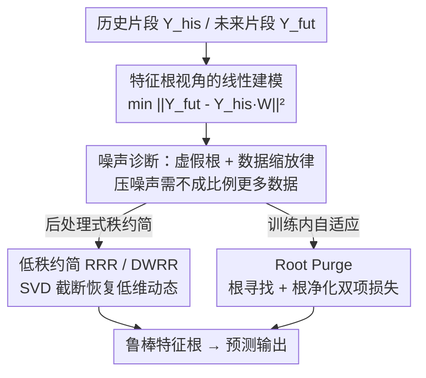

# Characteristic Root Analysis and Regularization for Linear Time Series Forecasting

**会议**: ICLR2026  
**OpenReview**: [https://openreview.net/forum?id=JTtwGRACte](https://openreview.net/forum?id=JTtwGRACte)  
**代码**: https://github.com/Wangzzzzzzzz/RootPurge  
**领域**: 时序预测 / 线性模型理论  
**关键词**: 时间序列预测, 特征根, 线性模型, 低秩正则化, 去噪

## 一句话总结
本文用经典线性差分方程的**特征根**理论重新审视线性时序预测模型，证明噪声会让模型学到"虚假根"且抑制噪声需要不成比例的更多数据，进而提出两类把权重矩阵"根重构"的正则化方法——低秩约简（RRR / DWRR）和自适应的 **Root Purge** 训练损失，在多个标准 benchmark 上把简单线性模型推到 SOTA。

## 研究背景与动机
**领域现状**：长程时序预测领域近年涌入大量复杂架构（Transformer、卷积、频域滤波等），但多篇工作（DLinear、FITS、SparseTSF）反复发现：极简的**线性模型**在很多数据集上能匹敌甚至超过这些重模型，而且更鲁棒、更可解释。

**现有痛点**：尽管线性模型表现亮眼，但**为什么有效、什么时候会失效**缺乏系统的理论解释。诸如 instance normalization、channel independence、长回看窗口这些工程上"约定俗成"的设计，到底在数学上起什么作用，一直说不清；在有噪声的真实数据上，线性模型也会过拟合噪声、泛化变差。

**核心矛盾**：线性模型的解由其**特征根**（characteristic roots）完全决定——干净信号对应少量"主导根"，而观测噪声会诱导模型学出一堆**虚假根**（spurious roots），这些虚假根扭曲了对真实动态的刻画。最小二乘训练在噪声下收敛极慢，要把噪声影响压下去得用不成比例的海量数据，数据效率很低。

**本文目标**：(1) 用特征根这把"尺子"把线性时序模型的能力、设计选择、噪声行为都解释清楚；(2) 在不堆数据的前提下，用结构化正则化把虚假根"洗掉"，恢复低维真实动态。

**切入角度**：把时序预测显式地写成线性差分方程 $y_t + a_1 y_{t-1} + \cdots + a_p y_{t-p} = 0$，其通解是特征根的幂次组合 $y_t = \sum_i C_i r_i^t$。于是"模型学得好不好"等价于"特征根识别得准不准"，预测、去噪、正则化都能在这个统一框架里推导。

**核心 idea**：把经典线性系统理论的**特征根/秩-零化度定理**接进现代学习的损失函数里，用低秩约束或自适应零空间学习"重构特征根"，在抑制噪声的同时保住信号主导根。

## 方法详解

### 整体框架
论文先建理论、后造算法。理论部分在**无噪声**和**有噪声**两种情形下分析特征根：无噪声时证明特征根决定长期行为、并自然推出 instance norm 与 channel independence 这些工程技巧为何合理；有噪声时揭示模型会学到虚假根，并导出一个"数据缩放律"——压噪声要的数据量远超直觉，因此**必须靠结构正则化而不是堆数据**。

把预测写成最小二乘 $\min_W \lVert Y_{fut} - Y_{his}W\rVert_F^2$，其中 $Y_{his}\in\mathbb{R}^{N\times L}$、$Y_{fut}\in\mathbb{R}^{N\times H}$、权重 $W\in\mathbb{R}^{L\times H}$。干净信号下 $Y_{his}$ 的秩只有 $\min(L,K)$（$K$ 是真实特征根数），但噪声一进来，数据矩阵几乎必然满秩——低秩结构被噪声掩盖。算法侧就围绕"把秩压回去 = 把虚假根洗掉"这一条主线展开两套方案。

### 关键设计

**1. 特征根作为统一标尺：解释线性模型为何有效**

本文把"线性模型能拟合什么"严格地用特征根刻画。**Fact 1** 说：一个线性模型能表示任何特征根是它自身根集子集的时间序列——也就是说泛化能力来自"选对根"而非复杂参数化。**Fact 2** 进一步说：把预测推到更远的 horizon、或把回看窗口 $L$ 拉长，得到的特征根集**始终把支配系统真实动态的那组根作为子集保留**。这两点直接为两个常见工程做法背书：独立建模每个预测步（$H$ 个回归问题）是合理的，因为高 horizon 模型仍与真实动态一致；增大回看窗口不会改变根集，只是引入多个等价表示、带来参数化的冗余灵活性。在此框架下，**instance normalization 等价于引入一个单位根** $r=1$，让模型对任意均值漂移都能泛化；**channel independence** 在模型自由度足够覆盖所有通道特征根并集时依然有效。这把一堆"经验技巧"变成了可推导的结论。

**2. 噪声下的数据缩放律：揭示为何必须正则化而非堆数据**

把损失在含噪情形展开，$\mathbb{E}\big[\lVert(y^*_{fut}-W^\top y^*_{his})+(\varepsilon_{fut}-W^\top\varepsilon_{his})\rVert_2^2\big]$，天然拆成"信号拟合误差 + 噪声诱导误差"两块。即便权重完美恢复了信号动态，噪声项 $\mathbb{E}[\lVert\varepsilon_{fut}-W^\top\varepsilon_{his}\rVert_2^2]$ 仍在。**Proposition 1** 给出关键结论：对零均值、有限二阶矩噪声做线性预测，学到的权重以 $O(1/\sqrt{T})$ 的速率收敛（$T$ 为序列长度）。这个**亚线性**速率意味着：最小二乘虽然无偏一致，但在高噪声下收敛极慢，要拿到低方差估计得喂进不成比例的更多数据——这就是"数据缩放律"。它的直接含义是：与其无止境堆数据，不如**给模型加结构约束**主动压噪声，这正是后面两套算法的立足点。

**3. 低秩约简（RRR / DWRR）：把虚假根用 SVD 截掉**

既然噪声让数据矩阵从低秩变满秩，那就反过来给权重 $W$ 强加低秩约束。**Proposition 2** 证明：约束 $W$ 低秩，等价于隐式地把 $Y_{his}$、$Y_{fut}$ 投影到低维子空间——低秩 $W$ 像个瓶颈，把输入输出对齐到共享的最大变化方向、滤掉噪声主导分量，因此不必直接对原始序列做 SVD。落地为两个算法：**RRR（Reduced-Rank Regression）** 先求 OLS 解 $W_{OLS}=(Y_{his}^\top Y_{his})^{-1}Y_{his}^\top Y_{fut}$，对预测 $\hat Y_{fut}=Y_{his}W_{OLS}$ 做截断 SVD 取秩 $\rho$，再把权重投影 $W_{RRR}=W_{OLS}V_\rho V_\rho^\top$，即在输出侧强制低维；**DWRR（Direct Weight Rank Reduction）** 更直接，对训练好的 $W_{OLS}$ 本身做 SVD 截断 $W_{DWRR}=U_\rho\Sigma_\rho V_\rho^\top$，当作后处理。两者都把秩当成"保留多少根"的旋钮，当真实生成过程本身低秩时显著改善泛化。

**4. Root Purge：训练内自适应学零空间洗噪声**

低秩约简是规则化、后处理的，依赖准确的秩估计这种事先假设，实践中不一定成立。Root Purge 改成一个**训练时一体化**的自适应损失（式 3）：

$$\min_W \underbrace{\lVert Y_{fut}-G_W(Y_{his})\rVert_F^2}_{\text{根寻找}} + \lambda\underbrace{\lVert G_W\circ P\,(Y_{fut}-G_W(Y_{his}))\rVert_F^2}_{\text{根净化}}$$

其中 $G_W$ 是权重 $W$ 定义的线性变换，$P$ 负责裁剪/零填充保持维度一致。**根寻找项**就是普通预测损失；**根净化项**是正则器，思想直白却有力——当输入是零均值纯噪声时，模型输出理应为零。它分两步：先用预测与真值的残差**估计噪声**，再把模型**重新作用到这个残差上**，看它是否落在变换的零空间里；若残差确为噪声且模型零空间学对了，输出就趋近零。虽然净化项不可能完全消失（噪声通常张满满秩空间），但最小化它会驱使模型区分信号与噪声、发现与真实时序动态对齐的低秩结构。

这套机制和低秩约简通过**秩-零化度定理**深层相通：扩大零空间必然降低秩。于是训练里有两股对抗力量自我调节——秩太低拟合不了信号时根寻找损失上升、逼模型升秩；秩足够后根净化项主导、逼模型扩零空间降秩压噪声。模型借此**自适应地调节自身容量**。Root Purge 还**与域无关**：只要变换是线性的，$G_W$ 既可在时域（$W_T$）也可在频域（$\mathcal{F}^{-1}\circ W_F\circ\mathcal{F}$，相当于频域线性滤波）定义，后者对强周期/振荡信号尤其合适。

### 损失函数 / 训练策略
核心训练目标即式 (3) 的"根寻找 + $\lambda\cdot$根净化"双项损失，$\lambda$ 在 $\{0.125, 0.25, 0.5\}$ 中选。维度处理：$H<L$ 时把输出零填充到长度 $L$ 并按 $L/H$ 缩放 $\lambda$；$H\ge L$ 时裁到前 $L$ 列、$\lambda$ 不变。为省显存，对 $P(\cdot)$ 施加 stop-gradient，实测对性能影响极小。RRR 的秩 $\rho$ 在验证集上调、取验证 MSE 最低的前三再报最佳测试结果。

## 实验关键数据

### 主实验
数据集涵盖 Traffic、Electricity、Weather、Exchange、ETT；因聚焦数据缩放性质，正文主推 ETT / Exchange / Weather 等较小规模数据集。Baseline 横跨三类：Transformer（FEDformer、PatchTST）、卷积（TimesNet、TSLANet、FilterNet）、线性（FITS、SparseTSF、DLinear）。回看窗口 $L=720$，horizon $H\in\{96,192,336,720\}$，重复 5 次取平均（Root Purge 跑间方差可忽略，除 Exchange 在 ±0.002 内）。下表为 MSE（越低越好）摘录：

| 数据集 | H | DLinear | PatchTST | FITS | SparseTSF | RRR | Root Purge |
|--------|-----|---------|----------|------|-----------|------|------------|
| ETTh1 | 96 | 0.384 | 0.385 | 0.379 | 0.362 | 0.367 | **0.359** |
| ETTh1 | 192 | 0.443 | 0.413 | 0.414 | 0.403 | 0.401 | **0.394** |
| ETTh1 | 336 | 0.446 | 0.440 | 0.435 | 0.434 | 0.430 | **0.423** |
| ETTh1 | 720 | 0.504 | 0.456 | 0.431 | 0.426 | 0.425 | **0.421** |
| ETTh2 | 96 | 0.282 | 0.274 | 0.272 | 0.294 | **0.268** | **0.268** |
| ETTh2 | 192 | 0.350 | 0.338 | 0.331 | 0.339 | 0.329 | **0.328** |

RRR 与 Root Purge 在各 horizon 上稳定优于所有 baseline：RRR 无需大量超参调优、不必重训就能简单调秩，已能超过需精调的方法；Root Purge 进一步把线性时序预测的性能上限往前推，同时保持简洁高效。两者在**小规模数据集上尤其有效**——这正印证了"纯靠数据缩放的模型在小数据上吃亏"的理论预测。

### 消融实验
论文以"奇异值收缩（数学机制）→ 数据缩放改善（实践挑战）→ 特征根重构（根本动机）"三段递进来验证理论性质：

| 验证维度 | 现象 | 说明 |
|----------|------|------|
| 奇异值收缩 | 正则化使 $W$ 的小奇异值被压低 | 印证 Prop. 2：低秩投影确在发生 |
| 数据缩放 | 同等精度所需数据量下降 | 缓解 Prop. 1 的 $O(1/\sqrt T)$ 慢收敛 |
| 特征根重构 | 虚假根被抑制、主导根保留 | 回到 Fact 1/2 的根集理论 |

### 关键发现
- **小数据收益最大**：在 ETT / Exchange / Weather 等较小数据集上，结构正则化的优势最明显，与数据缩放律的理论判断一致——大数据下纯最小二乘也能慢慢收敛，小数据下才更依赖正则化压噪声。
- **频域 Root Purge 适配周期信号**：把 $G_W$ 放到频域等价于频域线性滤波，对周期/振荡明显的序列更契合，主表用的就是频域版本。
- **秩-零化度提供自调节**：Root Purge 不需手工指定秩，靠根寻找/根净化两项的拉锯自动找到合适容量，这是它比规则化 RRR/DWRR 更稳的根源。

## 亮点与洞察
- **把"玄学技巧"理论化**：instance norm = 引入单位根、channel independence = 根集并集可覆盖——这种把工程惯例还原成特征根性质的视角，干净且可迁移到分析其它线性时序设计。
- **"虚假根 + 数据缩放律"诊断到位**：先指出噪声让模型学虚假根、再量化"压噪声要 $O(1/\sqrt T)$ 慢收敛"，把"为什么要正则化"讲成了可证明的结论，而非经验之谈。
- **Root Purge 的"自照镜子"正则**：把模型重新作用到自己的残差上、逼输出趋零来学零空间，思想极简却通过秩-零化度定理与低秩约简打通，且时域/频域通吃——这个"残差应落在零空间"的正则思路可借鉴到其它线性预测/滤波任务。

## 局限与展望
- **理论以单通道、distinct 根的齐次线性差分方程为主**：通解假设特征根两两不同，重根、非齐次、强非线性动态的情形需另行处理，多通道主要靠 channel independence 近似。
- **Root Purge 净化项无法真正清零**：噪声张满满秩空间，净化项只能被压小而非消除，效果依赖 $\lambda$ 选取与数据噪声结构。
- **主结果偏小规模数据**：正文聚焦 ETT/Exchange/Weather，Traffic/Electricity 等大规模数据放在附录，纯线性框架在超大规模、强非线性场景下的天花板仍是开放问题。

## 相关工作与启发
- **vs DLinear / SparseTSF / FITS**：这些工作经验性地证明简单线性模型可超 Transformer，本文则补上**为什么**——用特征根理论解释其有效性边界，并在其上加根重构正则化把性能再推一步，定位是"线性时序的理论 + 增强"而非又一个新架构。
- **vs Reduced-Rank Regression（经典统计）**：RRR 本是经典低秩回归方法，本文把它放进时序特征根框架重新诠释（低秩 = 滤虚假根），并提出 DWRR 这一更直接的权重截断变体与之对照。
- **vs PatchTST / FEDformer / TimesNet 等重模型**：在 ETT 等小数据上，本文的简单线性 + 正则化方法以更低复杂度取得相当或更优 MSE，呼应"No Free Lunch"——没有普适最优模型，理论驱动的结构先验在合适场景反而更划算。

## 评分
- 新颖性: ⭐⭐⭐⭐⭐ 用经典特征根/秩-零化度理论统一解释线性时序模型并导出新正则化，视角独到
- 实验充分度: ⭐⭐⭐⭐ 多数据集多 horizon 对比 + 三段式理论验证，但主推小数据、大规模偏附录
- 写作质量: ⭐⭐⭐⭐⭐ 理论与算法逻辑链清晰，Figure 1 路线图把命题串得井井有条
- 价值: ⭐⭐⭐⭐ 为简单线性预测提供可证明的解释与即插即用正则化，对追求可解释、数据高效预测有实用价值

<!-- RELATED:START -->

## 相关论文

- [\[ICLR 2026\] Reasoning on Time-Series for Financial Technical Analysis](reasoning_on_time-series_for_financial_technical_analysis.md)
- [\[AAAI 2026\] FreqCycle: A Multi-Scale Time-Frequency Analysis Method for Time Series Forecasting](../../AAAI2026/time_series/freqcycle_a_multi-scale_time-frequency_analysis_method_for_time_series_forecasti.md)
- [\[ICLR 2026\] TimeSliver: Symbolic-Linear Decomposition for Explainable Time Series Classification](timesliver_symbolic-linear_decomposition_for_explainable_time_series_classificat.md)
- [\[ICLR 2026\] Aurora: Towards Universal Generative Multimodal Time Series Forecasting](aurora_towards_universal_generative_multimodal_time_series_forecasting.md)
- [\[ACL 2026\] TSAQA: Time Series Analysis Question And Answering Benchmark](../../ACL2026/time_series/tsaqa_time_series_analysis_question_and_answering_benchmark.md)

<!-- RELATED:END -->
