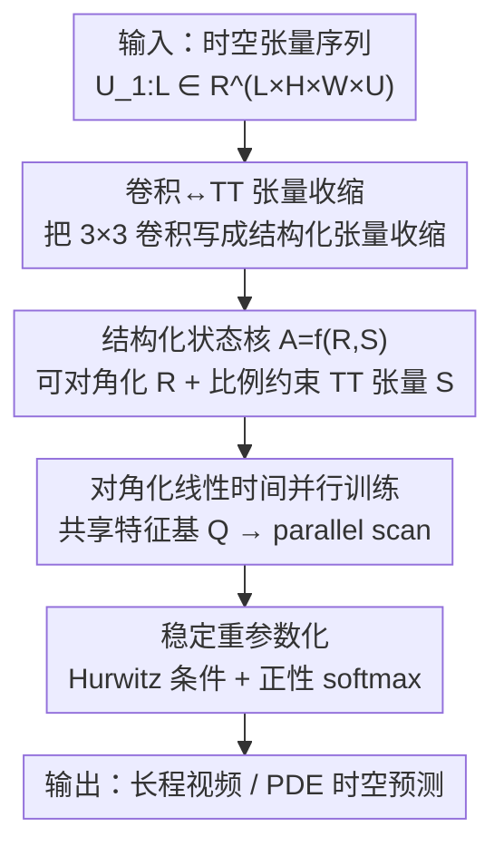

# ConvT3: Structured State Kernels for Convolutional State Space Models

**会议**: ICLR 2026  
**OpenReview**: [https://openreview.net/forum?id=w7csRoB5CO](https://openreview.net/forum?id=w7csRoB5CO)  
**代码**: https://github.com/voltwin-dev/ConvT3 （有）  
**领域**: 时间序列 / 动力系统 / 状态空间模型  
**关键词**: 卷积状态空间模型, 三对角 Toeplitz 张量, 3×3 状态核, 并行扫描, 时空建模

## 一句话总结
ConvT3 把卷积状态空间模型（ConvSSM）里被迫退化成 $1\times1$ 的状态核扩展成等价的 $3\times3$ 卷积，做法是用"可对角化 SSM 矩阵 + 比例约束三对角 Toeplitz 张量"来构造状态张量，使其在保持线性时间并行扫描可训练的同时拥有更强的空间建模能力，在长程视频生成（Moving-MNIST）和物理系统（PDEBench）建模上取得 SOTA，且训练比 ConvS5 更稳定。

## 研究背景与动机

**领域现状**：时空序列建模（视频预测、物理系统模拟、天气预报）需要同时刻画每一帧内部的空间相关性和跨时间的长程依赖。主流路线有三类：ConvRNN（如 ConvLSTM）用张量值隐状态 + 卷积更新来捕捉空间结构；Transformer 用注意力建模全局依赖；以及近年的状态空间模型（SSM，如 S4/S5），它把序列建模做成线性时间、长程记忆友好的递推。其中 ConvSSM（ConvS5）把 ConvRNN 的"张量值状态"和 SSM 的"线性时间扫描"结合起来，理论上既有空间表达力又有线性复杂度。

**现有痛点**：ConvSSM 在概念上允许状态、输入、输出、前馈四种卷积核取任意尺寸，但它的实际实现 ConvS5 只能把**状态核 $A$ 限制成逐点的 $1\times1$ 卷积**。原因是并行扫描（parallel scan）里二元结合算子 $\circ$ 会让卷积核在扫描中不断"长大"——更大的状态核会在长序列扫描时把计算量撑爆，所以只能退化成 $1\times1$。

**核心矛盾**：$1\times1$ 状态核意味着状态自身的演化里几乎不含空间交互，空间建模被甩给了 $B,C,D$ 核和更深的层堆叠，状态动力学的表达力被根本性地削弱。于是出现一个两难：**想要更大的状态核来增强空间动力学，就会破坏并行扫描所需的"核不增长 / 可对角化"结构**。

**本文目标**：在不牺牲线性时间并行训练的前提下，让 ConvSSM 真正用上 $3\times3$ 状态核；并保证训练数值稳定。

**切入角度**：作者注意到卷积本质上是线性、平移不变的算子，因此可以改写成与**结构化张量**的收缩：1D 对应 Toeplitz 矩阵，更高维对应 Toeplitz 张量；而 $3\times3$ 卷积恰好对应**三对角 Toeplitz（TT）张量**。三对角 Toeplitz 矩阵有著名的闭式特征分解——只要给定上/下/对角三个值就能写出特征值和特征向量，且同比例的 TT 矩阵共享同一组特征基。这给"既要大核、又要可对角化并行"留出了缝隙。

**核心 idea**：用"可对角化的 SSM 状态矩阵 $R$（管隐藏维）+ 满足比例约束的三对角 Toeplitz 张量 $S$（管空间维）"组合出状态张量 $A$，使它在数学上等价于一个 $3\times3$ 状态核的 ConvSSM，同时因为整体仍可对角化，照样能跑线性时间并行扫描——这就是 ConvT3（ConvSSM using **T**ridiagonal **T**oeplitz **T**ensors）。

## 方法详解

### 整体框架

ConvT3 要解决的事可以一句话概括：**把 ConvSSM 的状态核从 $1\times1$ 扩成 $3\times3$，但保留并行可训练性**。整条管线是这样转的：先在数学上确立"$3\times3$ 卷积 = 与 TT 张量的张量收缩"这个等价表示，把问题从"卷积"搬到"结构化张量"的语言里；然后用一条构造规则 $A:=f(R,S)$ 拼出状态张量——$R$ 是隐藏维上可对角化的 SSM 矩阵（沿用 S5 风格保证性能），$S$ 是空间维上的**比例约束三对角 Toeplitz（PTT）张量**；由于二者都可对角化且空间切片共享特征基，整个状态张量 $A$ 可以被一组统一的特征基 $Q=Q_P\otimes Q_H\otimes Q_W$ 对角化，于是离散化后能直接套用线性时间并行扫描；最后用一套重参数化把状态张量约束在数值稳定区。连续时间形式为

$$X'(t) = A\,X(t) + B\,U(t),\qquad Y(t) = C\,X(t) + D\,U(t),$$

其中状态张量 $X(t)\in\mathbb{C}^{H\times W\times P}$ 是张量值的（$H,W$ 是空间高宽，$P$ 是隐状态维），各卷积核以张量收缩的方式作用。

### 关键设计

**1. 卷积↔三对角 Toeplitz 张量收缩：把"大核卷积"翻译成"结构化张量收缩"**

直接用 $3\times3$ 卷积做并行扫描会让核不断增长、计算爆炸，这是 ConvS5 退化成 $1\times1$ 的根因。ConvT3 的第一步是换一种数学表示绕开它：因为卷积是线性、平移不变的，可以等价写成与 Toeplitz 结构张量的收缩。对一个 $3\times3$ 核 $K\in\mathbb{C}^{D_o\times D_i\times 3\times 3}$，二维卷积 $K * V$ 等于与一个三对角 Toeplitz 张量 $\mathcal{K}$ 的收缩 $\mathcal{K}V$（沿 $D_i,N_1,N_2$ 各维做类矩阵乘的收缩），其中"三对角"正好对应核尺寸 3——非零项只落在 $|i-j|\le1$ 的带状位置，其余为零。这一步把问题从"卷积核会在扫描中长大"搬进了"结构化张量是否可对角化"的语言，为后面用 TT 矩阵的闭式特征分解铺路：TT 矩阵 $T=\mathrm{tridiag}(l_T,d_T,u_T)$ 的第 $i$ 个特征值为 $\lambda_i = d_T + 2\sqrt{l_T u_T}\cos\!\big(\tfrac{i\pi}{N+1}\big)$，且**同一 off-diagonal 比例的 TT 矩阵共享同一组特征基**——这是后面"统一对角化"的关键支点。

**2. 结构化状态核 $A=f(R,S)$：可对角化 SSM 矩阵 ⊕ 比例约束 TT 张量**

目标是造一个比 $1\times1$ 大、却仍可对角化（从而保住线性时间并行扫描）的状态核。ConvT3 把状态张量 $A$ 拆成两块来构造：$A:=f(R,S)$，其中 $R\in\mathbb{C}^{P\times P}$ 是隐藏维上的**可对角化 SSM 矩阵**（沿用 S5 这类成熟状态矩阵以保证性能），$S\in\mathbb{C}^{P\times P\times H\times H\times W\times W}$ 是空间维上的**比例约束三对角 Toeplitz 张量（PTT）**。PTT 的"比例约束"指：对某对非零比例 $\alpha_H,\alpha_W$，下三角项与上三角项满足 $l_S=\alpha_H u_S$（沿高度）和 $l_S=\alpha_W u_S$（沿宽度），并额外要求 $S$ 沿隐藏 $P\times P$ 维是对角的。这两个约束的意义在于：由 TT 矩阵的共享特征基性质，$S$ 的空间切片共享由 $\alpha_H,\alpha_W$ 唯一决定的特征基 $Q_H,Q_W$；而 $R$ 可分解为 $R=Q_P\Lambda Q_P^{-1}$。于是组合规则

$$f\big(R_{(Q_P,\Lambda)},\,S_{(Q_H,Q_W,E)}\big)=(Q_P\otimes Q_H\otimes Q_W)\big[(\Lambda\otimes I_H\otimes I_W)\odot E\big](Q_P\otimes Q_H\otimes Q_W)^{-1}$$

拼出的 $A$ 仍保持 PTT 结构。论文进一步证明（Theorem 1）：这样构造的 $A$ 等价于一个 $3\times3$ 状态核的 ConvSSM——中间因子 $(\Lambda\otimes I_H\otimes I_W)\odot E$ 与 $Q_H,Q_W$ 收缩后本身就是 PTT 张量，再与只作用在通道维的 $Q_P$ 收缩也不破坏该结构，配合"$3\times3$ 卷积 ↔ TT 张量收缩"的等价性，就把"大核"和"可对角化"统一在了一个结构里。

**3. 对角化后的线性时间并行训练：用统一特征基把扫描拉回线性复杂度**

有了可对角化的状态张量还不够，要让它真的能跑并行扫描。Theorem 2 给出对角化形式：令 $Q:=Q_P\otimes Q_H\otimes Q_W$，做状态变换 $X_T(t)=Q^{-1}X(t)$ 后，系统变成

$$X_T'(t)=A_T X_T(t)+B_T U(t),\quad Y(t)=C_T X_T(t)+D\,U(t),$$

其中 $A_T=(\Lambda\otimes I_H\otimes I_W)\odot E$ 是**对角的**，$B_T=Q^{-1}B$，$C_T=CQ$。因为 $A_T$ 对角，离散化后就能套用 ConvS5 那套二元结合算子做并行扫描，复杂度随序列长度线性。一个重要的实现细节是：隐藏维的变换 $Q_P$ 在实践中被省略——状态沿 $P$ 维可假设已经训练成对角形式（类比 diagonal SSM），若对 $B,C$ 真去做 $Q_P$ 变换会把核运算变成低效的张量积；于是有效变换只剩空间部分 $Q_H\otimes Q_W$，在扫描前后对 $B,C$ 各做一次空间变换即可保持等价动力学。这一步是把"$3\times3$ 大核"落到"线性时间可训练"的临门一脚。

**4. 面向稳定性的重参数化：Hurwitz 条件 + 正性 softmax 双重约束**

ConvS5 在训练中常常突然 loss 爆掉，ConvT3 想从参数化上根除不稳定。连续 SSM 的稳定性由 Hurwitz 条件保证——对角化状态矩阵的实部为负就有收缩性的时间动力学。对 ConvT3 而言，稳定要求 $A_T$ 对角项实部严格为负，这通过两个条件保证：(1) $\Lambda$（$R$ 的特征值）实部为负；(2) $E$（$S$ 的特征值）严格为正。**Hurwitz 条件**用重参数化 $\mathrm{Re}\{\Lambda'\}=-\mathrm{softplus}(\mathrm{Re}\{\Lambda\})$ 强制实部恒负。**正性条件**则更巧：$E$ 由扩展的 Toeplitz 特征值公式给出 $\epsilon(\theta_H,\theta_W)=a+b\cos\theta_H+c\cos\theta_W+d\cos\theta_H\cos\theta_W$（其中 $a$ 对应核中心值、$b,c,d$ 对应边值），它在 $\cos\theta_H,\cos\theta_W\in(-1,1)$ 上是双线性的，所以只要在四个极值点 $\epsilon_1,\dots,\epsilon_4$ 处为正即可保证全域为正；固定中心 $a=1$ 使 $\sum_i\epsilon_i=4$，再用 $\epsilon_i'=4\cdot\mathrm{softmax}(\epsilon_1,\dots,\epsilon_4)_i$ 自动满足 $\epsilon_i'>0$ 且和为 4，最后用逆线性变换从 $\epsilon_i'$ 还原 $(b,c,d)$。两个条件叠加保证 $\mathrm{Re}\{A_T\}<0$ 逐元素成立，让状态张量在整个训练过程中始终稳定，同时温度、空间动力学仍完全可学。

> ConvT3 还给出了向 $N$ 维的自然推广：$N$ 维卷积同样诱导出沿 $N$ 个空间轴三对角的 TT 张量，比例约束结构与并行扫描机制只依赖每条轴上的 PTT 性质、与维数无关，因此 2D 的构造能直接搬到任意空间维。

### 损失函数 / 训练策略
实验中 off-diagonal 比例固定取 $\alpha_H=\alpha_W=-1$（即空间维上的状态核是斜对称的）；并把 $b_{q,r},c_{q,r},d_{q,r}$ 初始化为 0，使 ConvT3 在初始化时与 ConvS5 等价，便于公平对比与稳定起步。PDE 任务中，作者把 AViT 主干里的注意力层替换成 ConvT3 层，从而在相同 backbone 下直接比较时空建模能力。

## 实验关键数据

### 主实验

**长程视频生成（Moving-MNIST，条件 100 帧后生成 800/1200 帧）**：在 600 帧训练设置下，ConvT3 在所有指标、所有预测长度上都拿到最佳。

| 设置 | 指标 | ConvT3 | ConvS5（之前最强） | 说明 |
|------|------|--------|--------------------|------|
| 训练 600 帧，100→800 | FVD ↓ | **36** | 47 | 生成质量更高 |
| 训练 600 帧，100→800 | SSIM ↑ | **0.823** | 0.788 | 结构相似度更好 |
| 训练 600 帧，100→1200 | FVD ↓ | **56** | 71 | 更长程仍领先 |
| 训练 600 帧，100→1200 | SSIM ↑ | **0.795** | 0.763 | 长程一致性更强 |
| 训练 300 帧，100→1200 | FVD ↓ | **118** | 187 | 短训练也大幅领先 |

在 300 帧训练设置下，ConvT3 拿到 PSNR/SSIM/LPIPS 最佳、FVD 次佳；训练序列更长（600 帧）时优势进一步放大。

**物理系统建模（PDEBench：Shallow-Water + Diffusion-Reaction，NRMSE）**：

| 模型 | #Params | Shallow-Water NRMSE ↓ | Diffusion-Reaction NRMSE ↓ | 推理时间 |
|------|---------|-----------------------|----------------------------|----------|
| AViT-B | 116M | 0.00047 | 0.0110 | - |
| AViT-Ti | 7M | 0.00053 | 0.0090 | 2.74 (2.06×) |
| ConvS5 | 6M | 0.00035 | 0.0106 | 1.33 (1.00×) |
| ConvT3 | 6M | **0.00033** | **0.0087** | 1.51 (1.14×) |

ConvT3 在参数量远小于大型 baseline 的情况下取得两个数据集的最佳精度；Diffusion-Reaction 上相对 ConvS5 提升显著，且推理效率与 ConvS5 接近（1.14×）。此外训练稳定性实验显示：相同配置下 ConvS5 的 loss 曲线会突然尖峰发散，ConvT3 始终平滑，且该现象跨多个随机种子复现，说明不是初始化偶然。

### 消融实验

| 配置 | 关键指标 | 说明 |
|------|---------|------|
| ConvS5 | MSE 11.57 / MAE 23.25 | 基线（$1\times1$ 状态核） |
| MiniT3（+24 参数） | MSE 10.87 / MAE 21.64 | 共享 $P\times P$ 核切片，每层仅多 3 个参数 |
| $\alpha=1$ 对称 | MSE 10.97 | off-diagonal 比例对称 |
| $\alpha=-1$ 斜对称 | MSE 10.99 | 与对称几乎一致 |

### 关键发现
- **性能来自结构而非参数膨胀**：MiniT3 只比 ConvS5 多 24 个参数（每层 +3），却显著超过 ConvS5，证明 $3\times3$ 结构化状态核本身的空间建模才是增益来源，而非参数量增加。
- **off-diagonal 比例不敏感**：对称（$\alpha=1$）和斜对称（$\alpha=-1$）结果几乎相同，说明该比例可以固定成任意值、不必精调。
- **空间建模最缺时增益最大**：在 $B$ 或 $C$ 核退化为 $1\times1$、空间建模效应最弱的配置下，ConvT3 相对 ConvS5 的优势尤其明显——正好印证它补的是"状态自身缺空间动力学"这块短板。

## 亮点与洞察
- **用闭式谱分解把"大核"和"可并行"调和**：最巧的一招是借三对角 Toeplitz 矩阵"同比例共享特征基 + 闭式特征值"的性质，让 $3\times3$ 状态核仍然整体可对角化，从而绕过 ConvS5"核在扫描中增长 → 只能 $1\times1$"的死结。这是把经典线性代数结论用在现代序列模型上的漂亮案例。
- **稳定性做进参数化而非靠 trick**：Hurwitz（softplus 压实部为负）+ 正性（4 个极值点 softmax 保证 $E>0$）的组合是有理论保证的稳定构造，比起靠 clip / 调学习率压不稳定要干净得多，可迁移到其他需要保证谱稳定的 SSM 设计。
- **维度无关的推广性**：PTT 结构与并行扫描只依赖每条空间轴的三对角性质，天然推广到 $N$ 维卷积，对 3D 体数据 / 高维物理场建模有现成路径。
- **"结构 vs 参数"的干净消融**：MiniT3 用 +24 参数就跑赢 ConvS5，是一个非常有说服力的对照实验设计——把"是不是靠堆参数赢的"这个质疑直接堵死。

## 局限与展望
- **状态核尺寸仍受限于 $3\times3$**：整套构造围绕三对角 Toeplitz（对应核尺寸 3）展开，更大的核（如 $5\times5$）对应五对角 Toeplitz，是否还有同样优雅的闭式谱分解与并行化，论文未展开。
- **隐藏维 $Q_P$ 被省略是实现近似**：为效率把隐藏维变换省掉、假设状态已对角化，虽类比 diagonal SSM 合理，但严格等价性只在空间变换 $Q_H\otimes Q_W$ 下保证，这层近似对极端情形的影响缺乏分析。
- **benchmark 偏合成 / 规整网格**：主要在 Moving-MNIST 与规则网格 PDE 上验证，真实复杂视频、不规则网格 / 非结构化物理场上的表现仍待检验。
- **比例 $\alpha$ 固定带来的表达力上限**：实验把 $\alpha_H=\alpha_W=-1$ 固定，虽说对结果不敏感，但这也意味着空间核的某种对称性被预先锁定，是否在某些任务上限制了表达力值得进一步研究。

## 相关工作与启发
- **vs ConvS5（Smith et al. 2023）**：同属 ConvSSM，ConvS5 把状态核限制成 $1\times1$ 以维持并行扫描可行性，空间建模被甩给 $B,C,D$ 与深层堆叠；ConvT3 通过 PTT 张量构造出等价的 $3\times3$ 状态核，把空间动力学注入状态本身，且额外解决了 ConvS5 的训练发散问题——是对 ConvS5 的直接且实质的升级。
- **vs ConvLSTM / PredRNN（ConvRNN 系）**：ConvRNN 用卷积更新张量值隐状态来建模空间，但继承 RNN 的串行训练与长程依赖难题；ConvT3 保留"张量值状态"的空间表达力，却用 SSM 的线性时间并行扫描替掉串行递推。
- **vs Transformer / TECO / PredFormer（注意力系）**：注意力擅长全局依赖但随时空分辨率呈二次复杂度，长程时空上下文受限；ConvT3 走线性复杂度路线，在长程 Moving-MNIST 上以更低成本取得更好的长程一致性。
- **vs S4ND（Nguyen et al. 2022）**：同样把 SSM 推向多维信号，但 S4ND 更偏可分离的多维核构造；ConvT3 的差异在于用比例约束 TT 张量显式实现 $3\times3$ 空间状态核并给出稳定性保证。

## 评分
- 新颖性: ⭐⭐⭐⭐⭐ 用三对角 Toeplitz 张量的闭式谱分解把 ConvSSM 从 $1\times1$ 解放到 $3\times3$，构造干净且有理论保证，切口很新。
- 实验充分度: ⭐⭐⭐⭐ 覆盖长程视频生成与 PDE 两类任务、含 MiniT3 这种漂亮的"结构 vs 参数"消融与稳定性验证；但 benchmark 偏合成 / 规整网格，真实场景偏少。
- 写作质量: ⭐⭐⭐⭐ 推导清晰、定理-构造-实验链条完整；张量记号较重、对读者数学门槛要求高。
- 价值: ⭐⭐⭐⭐ 给 ConvSSM 一条"扩大状态核又不牺牲并行/稳定"的现成路径，对长程时空序列与物理场建模有直接实用价值与推广空间。

<!-- RELATED:START -->

## 相关论文

- [\[ICLR 2026\] Learning Linear State-Space Models with Sparse System Matrices](learning_linear_state-space_models_with_sparse_system_matrices.md)
- [\[NeurIPS 2025\] Structured Sparse Transition Matrices to Enable State Tracking in State-Space Models](../../NeurIPS2025/time_series/structured_sparse_transition_matrices_to_enable_state_tracking_in_state-space_mo.md)
- [\[ICML 2026\] HiPPO Zoo: Explicit Memory Mechanisms for Interpretable State Space Models](../../ICML2026/time_series/hippo_zoo_explicit_memory_mechanisms_for_interpretable_state_space_models.md)
- [\[ICML 2026\] Learning Long Range Spatio-Temporal Representations over Continuous Time Dynamic Graphs with State Space Models](../../ICML2026/time_series/learning_long_range_spatio-temporal_representations_over_continuous_time_dynamic.md)
- [\[NeurIPS 2025\] RiverMamba: A State Space Model for Global River Discharge and Flood Forecasting](../../NeurIPS2025/time_series/rivermamba_a_state_space_model_for_global_river_discharge_and_flood_forecasting.md)

<!-- RELATED:END -->
