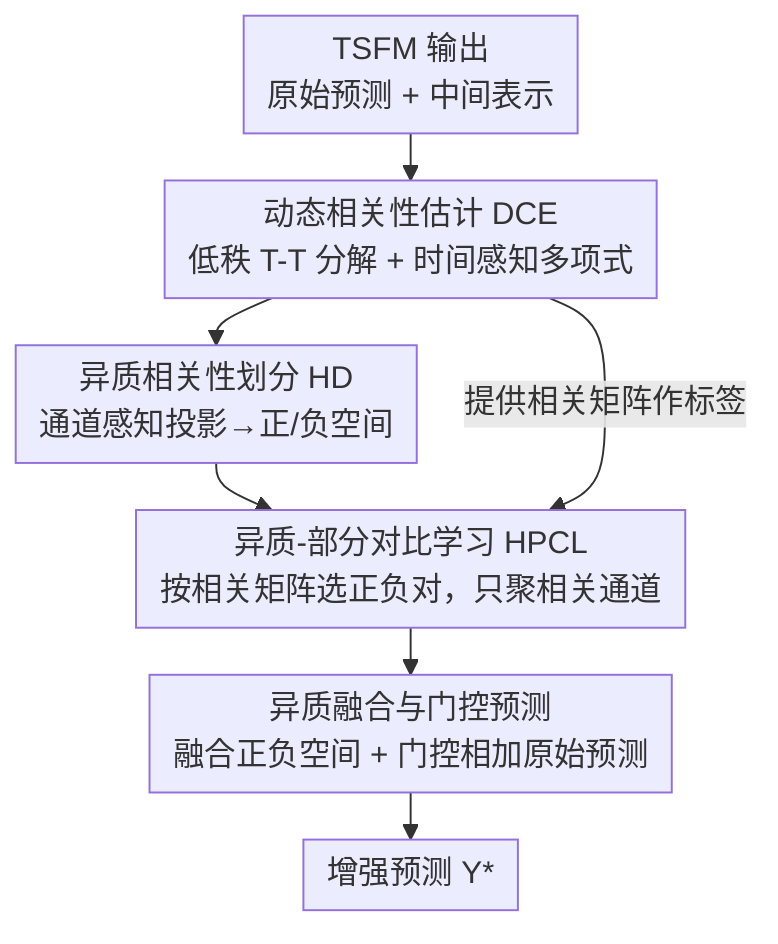

# CoRA: Boosting Time Series Foundation Models for Multivariate Forecasting through Correlation-aware Adapter

**会议**: ICLR2026  
**OpenReview**: [https://openreview.net/forum?id=JRlNrcTllN](https://openreview.net/forum?id=JRlNrcTllN)  
**代码**: https://github.com/decisionintelligence/CoRA  
**领域**: 时间序列 / 时序基础模型 / 多变量预测  
**关键词**: 时序基础模型, 通道相关性, 即插即用适配器, 对比学习, 低秩分解

## 一句话总结
CoRA 是一个轻量级即插即用适配器，让原本"通道独立"建模、忽略通道间相关性的时序基础模型（TSFM）在下游微调时同时学到动态、异质（正负）、部分（只在部分通道间存在）三类相关性，从而在仅用 5% 样本的少样本设置下显著提升 10 个真实数据集上的多变量预测精度，且推理阶段只引入线性复杂度开销。

## 研究背景与动机
**领域现状**：时序基础模型（Time Series Foundation Models, TSFM）近年快速兴起。它们要么直接复用大语言模型（如 GPT4TS、CALF、Time-LLM），要么在多域时序数据上大规模预训练（如 Moment、Chronos、Timer、TimesFM），都展现出很强的泛化与零/少样本预测能力。但绝大多数 TSFM 采用 **通道独立（channel-independent）** 建模——把每个变量（通道）单独当成一条序列处理，专注捕捉时间维度的依赖。

**现有痛点**：多变量预测里，通道之间的相关性其实至关重要，作者把它细分成三种互补的面向：① **动态相关性 DCorr**——通道关系随时间漂移（早上和晚上的耦合强度不同）；② **异质相关性 HCorr**——通道间既有正相关也有负相关，不能一视同仁地混合；③ **部分相关性 PCorr**——相关只存在于某些通道之间，把所有通道无差别地交互反而会引入噪声。现有 TSFM 要么彻底忽略通道关系，要么像 TTM 用固定权重的 MLP 混合所有通道（MLP 权重不随时间变，建模不了 DCorr；无差别混合所有通道，也表达不了 HCorr 和 PCorr）。

**核心矛盾**：要把三种相关性"完整建模"和"轻量化"同时做到很难。能单独搞定 DCorr 或 HCorr 或 PCorr 的方法不少，但同时覆盖三者就力不从心；而且常见的通道交互手段（MLP / Transformer / GNN）对通道数 $N$ 都是 $O(N^2)$ 复杂度。更糟的是，现有的相关性"插件"几乎都是为端到端模型设计的：Crossformer 要重构整个网络结构、CCM 必须和端到端模型一起额外预训练、C-LoRA 需要从头和骨干一起训练——没有一个是专门给 TSFM 下游微调用的即插即用插件。

**本文目标**：设计一个能在微调阶段和 TSFM 一起训练的插件，既绕开"不同数据集相关性差异大、预训练阶段学不到通用相关性"的问题，又能同时刻画三类相关性，还得足够轻量。

**切入角度**：作者注意到 TSFM 微调时本就会产出两样东西——原始预测 $\hat{Y}^{ft}_t$ 和中间层表示 $\tilde{X}^{ft}_t$。与其改动骨干，不如把这两样东西"接管"过来，在外侧补一个专门学相关性的小模块，再把增强后的预测和原始预测融合。

**核心 idea**：用一个轻量适配器，把相关性矩阵低秩分解成"随时间变 + 不随时间变"两部分来低成本表达 DCorr，再用双分支对比学习把 HCorr 与 PCorr 一并学出来——全程不重新预训练 TSFM，推理时只剩线性复杂度。

## 方法详解

### 整体框架
CoRA 接在 TSFM 外侧：输入是原始多变量序列 $X_t \in \mathbb{R}^{N\times L}$、TSFM 的原始预测 $\hat{Y}_t$、以及 TSFM 抽出的中间表示 $\tilde{X}_t$；输出是融合后的增强预测 $\hat{Y}^*_t$。整条流水线分四步：(i) **动态相关性估计（DCE）** 从表示和输入序列学出随时间变化的相关性矩阵 $M^{corr}_t$，作为后续对比学习的"标签"；(ii) **异质相关性划分（HD）** 用一个通道感知投影器把骨干表示分别映射到"正相关空间"和"负相关空间"；(iii) **异质-部分相关性对比学习（HPCL）** 在每个空间里只把真正相关的通道聚到一起，从而学到 PCorr；(iv) **异质融合与预测** 把两个空间的表示融合生成新预测，再和原始预测做门控相加。其中 DCE 和 HPCL 只在训练时跑（$O(N^2)$），推理时只保留 HD 模块，整体退化到 $O(N)$，这是"轻量"的关键。

### 关键设计

**1. 动态相关性估计（DCE）：用低秩"时变+时不变"分解 + 可学习时间感知多项式，低成本表达随时间漂移的相关性**

这一步针对的是"DCorr 随时间变、但显式建模它代价高"的痛点。最直接的做法是把相关矩阵写成"时变矩阵 + 时不变矩阵"相加（如 Cirstea 等的加性分解），但参数量大。CoRA 改成**低秩乘法分解**：把可学习部分写成 $Q_t V Q_t^\top$，其中时变分量 $Q_t \in \mathbb{R}^{N\times M}$、时不变分量 $V\in\mathbb{R}^{M\times M}$，秩 $M < N$，再叠加一个基于皮尔逊系数的规则相关矩阵 $R$ 作先验，最终

$$M^{corr}_t = R + Q_t V Q_t^\top .$$

时不变分量用全局可学习向量构造 $V = \mathrm{Sigmoid}(\mathrm{ReLU}(E_1 E_2^\top))$，刻画不随时间变的稳定依赖；时变分量则用**可学习时间感知多项式**来估计——共享一组全局基 $q$，用它的 Hadamard 幂的加权和来表达随时间的波动：

$$Q_t = \sum_{i=0}^{K} C_{i,t}\, q^i, \quad q^i = \underbrace{q\odot q\odot\cdots\odot q}_{i\ \text{次}} ,$$

系数 $C_t = f(\tilde{X}_t)$ 由一个简单 MLP 从当前表示算出，所以只需估计多项式系数、而非整个时变矩阵，非常省参数。作者用 Theorem 1 证明这种乘法低秩分解在局部平稳条件下与传统加性分解功能等价，用 Theorem 2 证明多项式阶数 $K$ 越高拟合误差上界越小——于是可以在效果与效率间调 $K$ 取平衡。

**2. 异质相关性划分（HD）：通道感知投影把表示拆进正/负两个相关空间，且按通道贡献自适应加权**

这一步解决"正负相关混在一起、且不同通道对正负的依赖比例不同"的问题。CoRA 借鉴 Squeeze-and-Excitation 思路设计了一个**通道感知投影层** $P$：先对输入表示做 LayerNorm + MLP 得 $\tilde{X}^{proj}_t$，沿通道维 softmax 得到 patch 级通道注意力 $A_t$，聚合出跨通道上下文 $\tilde{X}^{ctx}_t = A_t^\top \tilde{X}^{proj}_t$，再把上下文拼回去融合，最后池化算出自适应的通道权重 $W_t$，以残差方式 $\tilde{X}^{out}_t = \tilde{X}^{in}_t + \tilde{X}^{fuse}_t \odot \mathrm{expand}(W_t)$ 调整每个通道的投影强度。用两套独立参数的投影 $P_1, P_2$ 把表示分别送进正相关空间 $\tilde{X}^{pos}_t$ 和负相关空间 $\tilde{X}^{neg}_t$。注意：HD 本身并不能直接完成正负相关的解耦，真正的分离要靠下一步对比学习来引导——HD 只负责"提供两条可被塑形的投影分支"，且它是唯一在推理阶段保留的模块，复杂度 $O(N)$。

**3. 异质-部分相关性对比学习（HPCL）：用相关矩阵当监督，只把真正相关的通道聚到一起，从而学出 PCorr**

这一步针对"相关只在部分通道间存在、无差别交互会引噪声"的痛点。CoRA 用 DCE 算出的 $M^{corr}_t$ 当作对比学习的标签：以可学习阈值 $\epsilon$ 把相关矩阵切成正、负两张稀疏掩码

$$M^{pos}_t = \begin{cases} m^{corr}_t, & corr > \epsilon \\ 0, & \text{else}\end{cases}, \quad M^{neg}_t = \begin{cases} m^{corr}_t, & corr < -\epsilon \\ 0, & \text{else}\end{cases} .$$

在正相关空间里，若 $M^{pos}_t[i,j]\neq 0$ 就把通道 $i,j$ 当正样本对、否则当负样本对，用带温度 $\tau$ 的对比损失把"真正相关的通道"在表示空间里拉近、把"不相关的"推远：

$$\mathcal{L}_{pos} = -\frac{1}{N}\sum_{i=1}^{N}\log\frac{\sum_{j=1}^{N} M^{pos}_t[i,j]\exp(\mathrm{sim}(\tilde{X}^{pos}_t[i],\tilde{X}^{pos}_t[j])/\tau)}{\sum_{k=1}^{N}\exp(\mathrm{sim}(\tilde{X}^{pos}_t[i],\tilde{X}^{pos}_t[k])/\tau)} .$$

负相关空间同理得 $\mathcal{L}_{neg}$，辅助损失 $\mathcal{L}_{aux}=\mathcal{L}_{pos}+\mathcal{L}_{neg}$。由于阈值天然只挑出部分通道参与聚合，PCorr（部分相关）就被隐式学到了；而且对比学习只在训练时发生，推理时不增加任何负担——这正是它相对 CCM（要为每个聚类建独立预测头）等方法的优势。

**4. 异质融合与门控预测：融合正负空间表示，再用通道级门控决定"听 CoRA 的"还是"听原始 TSFM 的"**

最后把两个异质空间的表示各自再投影 $P_3, P_4$（仍是堆叠的通道感知投影层）到共享空间并相加，过线性预测头得到相关性增强预测；考虑到有些通道需要更多通道交互、有些则更适合保持独立，作者用一个可学习的通道级门控权重 $\beta\in[0,1]^N$ 做凸组合：

$$\hat{Y}^*_t = \beta\,\mathrm{Linear}(\tilde{X}^{pos}_t + \tilde{X}^{neg}_t) + (1-\beta)\hat{Y}_t .$$

这样既保留了 TSFM 原始预测的强泛化能力，又按通道自适应地注入相关性信息——对那些本就接近独立的通道，门控会让 $\beta$ 偏小、更多依赖原始预测，避免画蛇添足。

### 损失函数 / 训练策略
总损失 = 预测损失（MSE）+ 对比辅助损失 $\mathcal{L}_{aux}$。训练阶段 DCE 和 HPCL 都参与（$O(N^2)$），推理阶段只跑 HD（$O(N)$）。回看窗口 $L$ 对 Timer 设 576、其余骨干设 512；评测用 MSE 与 MAE，主实验在仅 5% 训练数据的少样本微调设置下进行。

## 实验关键数据

### 主实验
在 10 个真实数据集（ETT 四子集、Electricity、Traffic、Solar、Weather、AQShunyi、ZafNoo）、6 个骨干（LLM 类 GPT4TS / CALF / UniTime，预训练类 Moment / Chronos·Timer / TTM）上，5% 少样本设置、MSE 在 $H\in\{96,192,336,720\}$ 上取平均。挂上 CoRA（✓ 列）几乎在所有骨干 × 数据集组合上都优于不挂：

| 数据集 | GPT4TS | +CoRA | UniTime | +CoRA | Timer | +CoRA | TTM | +CoRA |
|--------|--------|-------|---------|-------|-------|-------|-----|-------|
| ETTh1 | 0.464 | **0.453** | 0.721 | **0.682** | 0.450 | **0.421** | 0.397 | **0.392** |
| ETTm1 | 0.387 | **0.369** | 0.405 | **0.381** | 0.443 | **0.426** | 0.358 | **0.352** |
| Electricity | 0.208 | **0.201** | 0.201 | **0.194** | 0.241 | **0.236** | 0.179 | **0.173** |
| Traffic | 0.441 | **0.431** | 0.456 | **0.446** | 0.456 | **0.447** | 0.485 | **0.436** |
| Solar | 0.256 | **0.245** | 0.253 | **0.248** | 0.217 | **0.213** | 0.219 | **0.197** |
| Weather | 0.254 | **0.245** | 0.255 | **0.244** | 0.241 | **0.237** | 0.226 | **0.222** |

作者还做了一个有意思的对照：TTM 的通道相关（CD）与通道独立（CI）版本共享同一预训练参数，只在下游微调时模块配置不同。把 CI 版 TTM 挂 CoRA 后，反而胜过原生 CD 版——说明"显式建模三类相关性"比"骨干内置一个朴素的通道混合"更能理解通道交互。

与其他相关性插件对比（GPT4TS / UniTime / Timer 骨干）：LIFT 和 C-LoRA 因为不是为 TSFM 设计的，少样本下训练样本太少反而拖累骨干（相对 MSE 变化常为正，即变差）；CoRA 专为 TSFM 设计、从表示里学相关性，能稳定带来负向（变好）的相对变化。

### 消融实验
在 ETTm2 / Electricity 上逐个加模块（DCE / HD / HPCL，✓=加入，空=移除，◐=替换成朴素实现），三模块缺一不可、组合最优：

| 配置 | DCE | HD | HPCL | GPT4TS(ETTm2) | UniTime | Timer |
|------|-----|----|------|---------------|---------|-------|
| 1（全无/朴素） | | | | 0.274 | 0.272 | 0.277 |
| 2 | | | ✓ | 0.273 | 0.270 | 0.275 |
| 3 | ✓ | | ✓ | 0.271 | 0.268 | 0.274 |
| 4 | | ✓ | ✓ | 0.270 | 0.269 | 0.273 |
| 5（完整） | ✓ | ✓ | ✓ | **0.268** | **0.262** | **0.257** |

### 关键发现
- **三模块协同才是王道**：单看 Row1→Row2，光有 HPCL 提升有限（因为无法捕捉多类相关性）；往 HPCL 上分别加 DCE（Row3）或 HD（Row4）都进一步涨点；三者齐备（Row5）最好，尤其在 Timer 上从 0.277 降到 0.257。DCE 负责"造标签"、HD 负责"拆空间"、HPCL 负责"按标签聚类"，彼此依赖、不能独立工作。
- **极低数据也有效**：在 3%/5%/10%/20% 数据量梯度下（TTM、CALF 骨干，ETTm2/Weather），即使只用 3% 数据，CoRA 仍带来稳定的小幅提升，低数据 régime 下依然鲁棒。
- **几乎零推理开销**：通道数从 7（ETTm2）→21（Weather）→321（Electricity）递增，CoRA 相对骨干的参数量和推理时间增幅都很小，推理阶段不随 $N$ 明显退化——因为推理时只剩 $O(N)$ 的 HD 模块。

## 亮点与洞察
- **"接管输出而非改造骨干"的插件范式**：CoRA 不动 TSFM 一根毫毛，只消费它的原始预测和中间表示，再门控融合。这让同一个适配器能即插即用地套在 6 种异构骨干（LLM 类 + 预训练类）上，可迁移性极强。
- **训练重、推理轻的复杂度切分很聪明**：把昂贵的相关性估计（DCE）和对比学习（HPCL）都关在训练阶段，推理时只留线性的 HD。这正面回应了"完整建模 vs 轻量化"的核心矛盾——不是折中，而是把成本挪到了无所谓的阶段。
- **用对比学习"顺手"学出部分相关性**：阈值化相关矩阵 → 选正负对 → 对比损失，天然只聚合相关通道，把 PCorr 的"稀疏交互"变成对比学习的样本选择问题，不需要像 CCM 那样建一堆聚类预测头，思路可迁移到任何"只想让部分实体交互"的图/集合建模任务。
- **低秩乘法分解替代加性分解**：$Q_t V Q_t^\top$ 在理论上等价于加性分解却更省参，是把"时变/时不变"这种结构先验落到轻量实现上的一个干净例子。

## 局限与展望
- **复杂度声明里的小瑕疵**：作者写 DCE 与 HPCL 训练复杂度为 $O(N^2)$、HD 为 $O(N)$，但 $Q_t V Q_t^\top$ 严格算应是 $O(N M)$ 量级（$M<N$），正文表述略粗，细节需以原文 Appendix B 为准（⚠️ 以原文为准）。
- **提升幅度偏温和**：多数数据集上 MSE 改善在小数点后两三位（如 0.274→0.268），虽全面但单点增益不大；论文主打"少样本 + 几乎零开销下的稳定提升"，对追求大幅 SOTA 的场景吸引力有限。
- **依赖中间表示的可得性**：CoRA 需要从骨干抽 $\tilde{X}_t$，对那些只暴露最终预测、不给中间表示的闭源/黑盒 TSFM 不一定适用。
- **三类相关性的定义边界**：DCorr/HCorr/PCorr 的划分依赖阈值 $\epsilon$ 与皮尔逊先验初始化，对非线性/非平稳极强的序列，皮尔逊先验可能反而误导，超参 $K,M,l_1,l_2$ 的敏感性结论放在附录、正文未充分展开。

## 相关工作与启发
- **vs TTM（MLP 通道混合）**：TTM 用固定权重 MLP 无差别混合所有通道，建模不了时变的 DCorr、也分不开正负与部分相关；CoRA 用时变多项式抓 DCorr、双分支投影 + 对比学习抓 HCorr/PCorr，且作者实测 CI-TTM+CoRA 胜过原生 CD-TTM。
- **vs CCM（端到端相关性插件）**：CCM 要对通道聚类并为每个簇建独立预测头，且需和端到端模型一起额外预训练；CoRA 专为 TSFM 下游微调设计、不重新预训练，且把"部分相关"用对比学习的样本选择隐式实现，推理零额外头。
- **vs C-LoRA / LIFT**：二者都是为端到端骨干从头训练或抽局部关系的插件，少样本下样本不足会拖累 TSFM；CoRA 直接从 TSFM 表示里学相关性，能借力骨干的强泛化，在 5% 少样本下稳定为正。
- **vs Crossformer（重构式跨通道）**：Crossformer 把通道当 token 用 Transformer 全交互，$O(N^2)$ 且要重设计整个结构、无法当插件；CoRA 推理只剩 $O(N)$，且即插即用。

## 评分
- 新颖性: ⭐⭐⭐⭐ 把三类相关性统一进一个轻量适配器、用低秩乘法分解 + 双对比学习的组合是新颖的，但每个组件（SE 投影、对比学习、低秩分解）单看都有出处。
- 实验充分度: ⭐⭐⭐⭐⭐ 10 数据集 × 6 骨干 × 多数据量梯度 + 插件对照 + 效率分析 + 消融，覆盖很全面。
- 写作质量: ⭐⭐⭐⭐ 结构清晰、动机层层递进，但复杂度表述和部分符号略粗糙。
- 价值: ⭐⭐⭐⭐ 给 TSFM 补通道相关性这一缺口、即插即用且推理几乎零开销，对实际多变量预测落地有用。

<!-- RELATED:START -->

## 相关论文

- [\[ICLR 2026\] COSA: Context-aware Output-Space Adapter for Test-Time Adaptation in Time Series Forecasting](cosa_context-aware_output-space_adapter_for_test-time_adaptation_in_time_series_.md)
- [\[ICLR 2026\] CauKer: Classification Time Series Foundation Models Can Be Pretrained on Synthetic Data](cauker_classification_time_series_foundation_models_can_be_pretrained_on_synthet.md)
- [\[ICML 2026\] Time-series Forecasting Through the Lens of Dynamics](../../ICML2026/time_series/time-series_forecasting_through_the_lens_of_dynamics.md)
- [\[ICLR 2026\] Bridging Past and Future: Distribution-Aware Alignment for Time Series Forecasting](bridging_past_and_future_distribution-aware_alignment_for_time_series_forecastin.md)
- [\[ICLR 2026\] Context parroting: A simple but tough-to-beat baseline for foundation models in scientific machine learning](context_parroting_a_simple_but_tough-to-beat_baseline_for_foundation_models_in_s.md)

<!-- RELATED:END -->
