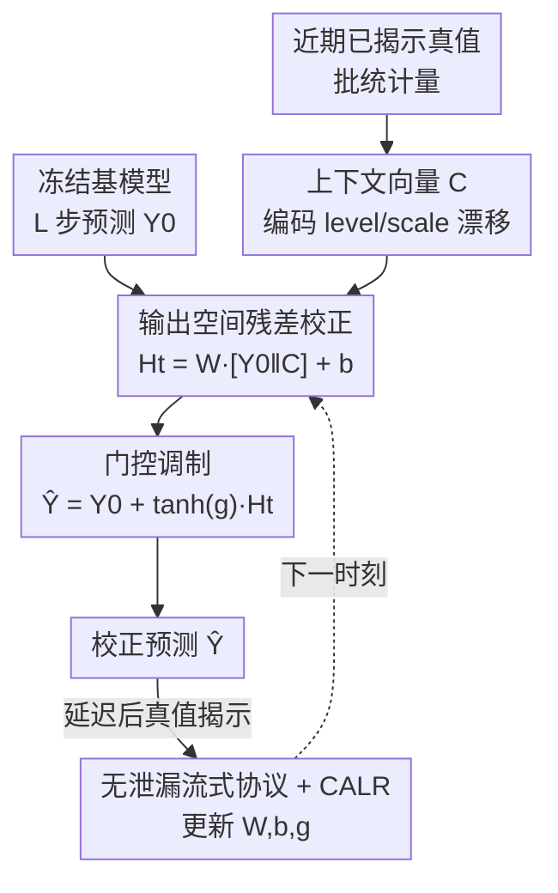

# COSA: Context-aware Output-Space Adapter for Test-Time Adaptation in Time Series Forecasting

**会议**: ICLR2026  
**OpenReview**: [https://openreview.net/forum?id=L7Z5wBMPrW](https://openreview.net/forum?id=L7Z5wBMPrW)  
**代码**: https://github.com/bigbases/COSA_ICLR2026  
**领域**: 时序预测 / 测试时适应 / 分布漂移  
**关键词**: 测试时适应、时序预测、输出空间残差、门控、自适应学习率

## 一句话总结
COSA 给冻结的时序预测模型挂一个**只在输出端工作**的轻量线性适配器：用「基模型预测 + 近期真值统计量」算一个残差，再用门控约束校正幅度，部署时只在延迟到来的真值上更新这几个参数，比现有「输入+输出」双适配器方案简单得多，却在 6 个数据集上把 MSE 相对无 TTA 基线降了 13.91～17.03%、相对 SOTA TTA 降了 10.48～13.05%，且推理快 88～90%。

## 研究背景与动机
**领域现状**：时序预测模型（iTransformer、PatchTST、DLinear 等）在训练分布上精度很高，但真实部署时数据是**非平稳**的——统计特性随时间漂移，部署后遇到的分布往往和训练时不同，精度因此退化。应对手段有在线学习、持续学习、域适应，但它们要么直接改基模型参数（带来额外算力、显存、灾难性遗忘问题），要么需要带标签数据或明确的任务边界，不适合「只有无标签流式数据」的部署场景。

**现有痛点**：测试时适应（TTA）是更轻的路线——部署后只用无标签测试流更新少量模块、基模型冻结。但 TTA 主要在视觉里发展（熵最小化、伪标签、单样本多增广）。时序预测有两个和视觉不同的特性：① 用的是保留周期性/水平信息的归一化方式；② **预测做完后，真值会在短延迟后陆续被观测到**，于是可以直接用 MSE 这类监督损失。专门做时序 TTA 的工作很少（TAFAS、PETSA、DynaTTA），而且它们**清一色采用「双适配器」结构**：在基模型的输入端和输出端各放一个校准模块，把输入映射到模型更好处理的域、再把输出还原回原域，用门控控制校准强度。

**核心矛盾**：双适配器是**间接**校准分布——它在输入端动手脚，可这种输入变换对基模型内部表示到底产生什么影响很难分析、也很难预测；加上两端模块带来的设计复杂度，整个适配行为变得不透明、不可控。

**本文目标**：能不能不碰输入、只在**输出空间直接修正预测**？这样既绕开「输入变换→内部表示」这条难以分析的链路，又能把适配器压到最简、几乎零额外推理开销。

**切入角度**：作者抓住时序 TTA 的关键便利——**真值会在短延迟后揭示**。既然能拿到真值，就能直接在输出端用 MSE 学一个「残差校正」，不需要绕到输入端去间接调分布。

**核心 idea**：用一个**单一的输出空间适配器**替代双适配器——拿基模型预测和一个总结近期真值统计的上下文向量，过一层线性算出残差，用门控约束幅度后加回原预测，部署时只在无泄漏协议下更新这几个参数。

## 方法详解

### 整体框架
COSA 的输入是冻结基模型在 $t$ 时刻给出的 $L$ 步预测 $Y^{(0)}_t \in \mathbb{R}^L$，输出是校正后的预测 $\hat{Y}_t \in \mathbb{R}^L$；中间只过一个轻量适配器，且适配器**只在输出空间工作**，不改基模型的任何参数与训练流程。整条链路是：把基模型预测和一个「上下文向量」拼在一起 → 过线性层得到残差 $H_t$ → 用门控 $\tanh(g)$ 缩放残差 → 加回原预测得到 $\hat{Y}_t$。等到这一段的真值在延迟后被观测，就把最近 $B$ 对「预测—真值」收集起来，只更新适配器的 $\{W, b, g\}$，基模型始终冻结。

适配器之所以选**单层线性**而非 MLP，作者给了两个实测理由：① 效率——线性运算延迟低、吞吐高，实测单层适配器比 2 层 MLP 适配器平均快 34.95%，适合快速适配；② 简洁—性能平衡——沿用 LTSF-Linear 的结论，线性层在时序预测里已经够强，实测单层适配器还比 2 层 MLP 平均**好** 5.71%。

### 关键设计

**1. 单一输出空间残差校正：直接在输出端改预测，绕开双适配器的间接链路**

这是 COSA 对「双适配器间接校准、影响不可控」痛点的正面回答：不在输入端动手脚，而是在输出空间学一个加性残差直接修正预测。具体地，把基模型预测 $Y^{(0)}_t$ 和上下文向量 $C_t$ 拼成适配器输入 $X^{(a)}_t = [Y^{(0)}_t \,\|\, C_t] \in \mathbb{R}^{L+K}$，过一层线性算残差

$$H_t = W X^{(a)}_t + b,$$

其中 $W \in \mathbb{R}^{L \times (L+K)}$、$b \in \mathbb{R}^L$。最终预测是原预测加上缩放后的残差。这样做的好处是适配行为**可预测**——残差直接作用在输出上，不存在「输入变换如何传导到内部表示」这种说不清的中间环节；而且因为只在输出端加一层线性，推理几乎零额外开销，计算复杂度仅 $O(L\cdot(L+K))$。它对任何基模型都即插即用，和归一化器（RevIN、DDN）也兼容，叠加后仍能稳定再降约 16.8～16.9% 的 MSE。

**2. 上下文向量：用最近揭示真值的统计量编码 level/scale 漂移**

光有基模型预测，适配器无从判断当前预测相对真实水平是偏高还是偏低。COSA 为此构造一个轻量上下文向量 $C_t$，专门总结**近期已观测真值**的统计信息，给线性层提供「现在数据的水平/尺度漂移到哪了」这条信号。构造方式是按批聚合：

$$\mu_t = \mathrm{agg}\big(\{y^{\text{true}}_{t-(kB)+i} : 1 \le i \le B\}\big),\quad 1 \le k \le K,$$

聚合函数 $\mathrm{agg}$ 默认用均值（也可中位数等），再把最近 $K$ 个聚合值堆成 $C_t = [\mu_1, \mu_2, \ldots, \mu_K]^\top \in \mathbb{R}^K$。这个向量概括了 level/scale 变化与缓慢漂移，帮助线性层解读基预测的相对幅度（当 $B=1$ 时退化为逐点真值）。关键是它**只用已揭示的真值**，从源头杜绝信息泄漏。消融显示 $K$ 越大精度越稳定提升，而由于 $X^{(a)}_t$ 维度 $L+K$ 里 $L$ 通常占主导，增大 $K$ 几乎不增加运行时间。

**3. 门控调制：用 $\tanh(g)$ 把校正幅度框在 $[-1,1]$**

直接把残差加回去有风险——非平稳流里偶发的扰动会让残差过大、反而放大误差。COSA 用一个**可学习标量门** $g$ 调制校正强度，组成最终输出

$$\hat{Y}_t = Y^{(0)}_t + \tanh(g)\, H_t,$$

其中 $\alpha = \tanh(g) \in [-1, 1]$。$\tanh$ 把缩放系数结构性地约束在 $[-1,1]$，既稳定了校正幅度、又让适配器能在「需要时强校正、不确定时弱校正」之间自适应。这也是后面稳定性分析里的一环：门控有界意味着单步校正幅度天然受限。

**4. 无泄漏流式协议 + CALR 自适应学习率：在延迟到来的真值上快而稳地适配**

利用「真值延迟揭示」这一便利的同时必须**防泄漏**——绝不能用当前或未来标签更新。COSA 定义了严格的流式协议：在 $t$ 时刻先用 $X_t$ 出预测 $Y^{(0)}_t$、再经 COSA 得 $\hat{Y}_t$；延迟 $\Delta \ge 0$ 后该段真值 $Y^{\text{true}}_t$ 才陆续被观测；随后收集最近 $B$ 对 $\{\hat{Y}, Y^{\text{true}}\}$ 才做适配，**每次只用已揭示的过去真值**。优化目标是带权重衰减的直接 MSE：

$$\mathcal{L} = \sum_{i=1}^{B} \big\|\hat{Y}_{t-i-1} - Y^{\text{true}}_{t-i-1}\big\|_2^2 + \lambda\big(\|W\|_F^2 + \|b\|_2^2 + \|g\|_2^2\big).$$

凑齐 $B$ 对后跑 $S$ 步梯度更新，学习率用 **CALR（cosine-adaptive learning rate）**：先在 $S$ 步内做余弦退火 $\eta^{(s+1)} = \eta_{\min} + \tfrac{1}{2}(\eta^{(s)} - \eta_{\min})(1 + \cos\tfrac{s\pi}{S})$，再根据短时损失趋势在线调整——损失上扬就降 $\eta \leftarrow \max(0.5\eta, \eta_{\min})$，稳定下降就缓增 $\eta \leftarrow \min(1.1\eta, \eta_{\max})$。每来新批都把学习率重置到 $\eta_{\max}$，给每批同等适配机会。由于非平稳环境里「收敛到固定最优点」本就没良好定义，CALR 转而保证**每个适配窗口内的稳定学习**，靠四重机制把单步更新一致地框住、防止误差放大：① 学习率上界 $\eta \le \eta_{\max}$；② 自适应梯度裁剪 $\|g_\phi\| \leftarrow \min(\|g_\phi\|, \max(c, \mathcal{L}))$；③ L2 正则约束参数幅度；④ 门控有界 $\tanh(g) \in [-1,1]$。配合早停与梯度裁剪，CALR 在有限的 $S$ 步内既快又稳。

### 损失函数 / 训练策略
唯一可学习参数是适配器的 $\{W, b, g\}$，基模型全程冻结。$W$ 用增益 0.1 的 Xavier 均匀初始化，$b$ 与 $g$ 初始化为 0，优化器为 Adam。默认超参 $K=10$、$S=3$、启用 CALR、$\mathrm{agg}$ 取均值。论文给两个变体：**COSA-F** 固定 $B=48$（look-back 的一半）；**COSA-P** 按 TAFAS 的 PAAS 在线确定 $B$。

## 实验关键数据

### 主实验
6 个数据集（ETTh1/2、ETTm1/2、Exchange Rate、Weather），look-back $W=96$，4 个预测长度 $L\in\{96,192,336,720\}$，6 个跨架构基模型（Transformer 类 iTransformer/PatchTST、线性类 DLinear/OLS、MLP 类 FreTS/MICN），以 MSE 为指标，对比无 TTA 基线、TAFAS、PETSA。COSA 在**所有场景**都取得最佳。

| 设置（iTransformer） | Baseline | TAFAS | PETSA | COSA-F | COSA-P |
|--------|------|------|------|------|------|
| ETTh2-720 | .4276 | .4023 | .4043 | **.3487** | .3591 |
| ETTm2-720 | .3451 | .3305 | .3332 | **.2477** | .2606 |
| Exchange-720 | .8540 | .8322 | .8004 | **.3421** | .4460 |
| Weather-720 | .3571 | .3458 | .3459 | **.2480** | .2730 |

总体上 COSA 相对无 TTA 基线降 MSE **13.91～17.03%**、相对 SOTA TTA 降 **10.48～13.05%**；在最长 horizon=720 处增益最大（COSA-F/COSA-P 相对基线提升 32.24%/26.33%，相对其他方法 28.21%/21.96%），说明长程预测最受益。

### 消融实验
论文围绕 4 个设计选择做敏感性分析（$S$、$K$、$B$、CALR），并报告计算开销。

| 配置变动 | 现象 | 说明 |
|------|---------|------|
| 增大 $S$（适配步数） | MSE 下降、墙钟时间上升 | 即便 $S=4$，耗时也仅与 PETSA 相当 |
| 增大 $K$（上下文长度） | MSE 稳定下降、耗时几乎不变 | $L$ 主导维度，增 $K$ 运行时开销可忽略 |
| 减小 $B$（适配频率↑） | MSE 改善、墙钟时间上升 | 解释了 ETTh1 上 COSA-P 优于 COSA-F |
| 去掉 CALR | 精度与效率双降 | CALR 带来最高 12.13% 精度提升、21.34% 墙钟时间下降 |

计算开销（Table 3，跨数据集/基模型/horizon 平均）：

| 方法 | 参数量 | 峰值显存(MB) | 吞吐(samples/s) | 适配时间/批(ms) | 推理时间/批(ms) |
|------|------|------|------|------|------|
| TAFAS | 1,252,958 | 17.59 | 1413.23 | 73.23 | 10.96 |
| PETSA | 58,334 | 36.09 | 987.91 | 88.46 | 12.63 |
| COSA | 1,211,287 | 27.07 | 1080.70 | 80.12 | **1.25** |

### 关键发现
- **长程预测增益最大**：horizon 越长，间接双适配器越吃力，而 COSA 的输出空间直接校正在 720 处把误差砍掉近三分之一——这是它最亮眼的场景。
- **推理快一个量级**：单适配器结构让推理时间 1.25ms，相对 SOTA TTA 快 88.59～90.10%；且推理时间**不随 $S$ 变**（适配才依赖 $S$），部署友好。
- **$B$ 决定适配频率，越小越好但越慢**：ETTh1 上 PAAS 给的平均 $B\approx24.55$（其他数据集 >80），更频繁的适配让 COSA-P 在该集上反超 COSA-F。
- **与归一化器互补**：COSA 单独用即可超过显式归一化，叠加 RevIN/DDN 后还能再降约 16.8～16.9% MSE，说明它学的是 level/scale 修正这条独立信号。

## 亮点与洞察
- **把「真值延迟揭示」这个时序 TTA 特性用到极致**：视觉 TTA 没有真值只能靠熵/伪标签，而时序能直接用 MSE 监督——COSA 干脆只在输出端学个有监督残差，方法因此异常简洁，这是抓住领域本质后的「减法」设计。
- **门控用标量而非逐维**：一个 $\tanh(g)$ 标量就承担了「适配强度自适应 + 稳定性边界」双重角色，参数极省又自然嵌进稳定性证明，很巧。
- **CALR 把「收敛」重新定义为「窗口内稳定」**：非平稳流里追求全局最优本无意义，转而用上界学习率+梯度裁剪+L2+有界门控四重机制保证每个适配窗口不放大误差——这套思路可迁移到其他在线/流式适配任务。
- **输出空间残差校正是可复用模式**：「冻结大模型 + 输出端挂轻量残差适配器 + 用揭示的真值在线学」这套范式不限于时序，任何「预测后能拿到反馈」的部署场景都能借鉴。

## 局限与展望
- **依赖完整真值**：当前适配需要预测区间的全部真值揭示后才更新，作者承认扩展到**部分观测**（masked updates）才能支持真正的实时部署。
- **$K$、$B$ 固定不自适应**：固定上下文长度 $K$ 未必适配所有时间模式，$B$ 也影响性能；作者展望根据检测到的周期性自适应选 $K$、$B$。
- **线性校正的表达上限**：线性残差对许多情形够用，但面对复杂非线性漂移可能不足，未来考虑线性/非线性混合适配器。
- **参数量并不算小**：COSA 参数量 1.21M，介于 TAFAS 与 PETSA 之间，比 PETSA（5.8 万）大得多——它赢在推理速度而非参数节省，这点笔记读者需注意（论文强调的是「moderate overhead + 最快推理」而非最省参）。

## 相关工作与启发
- **vs TAFAS / PETSA / DynaTTA（时序 TTA 双适配器）**：它们在输入+输出两端做间接分布校准（TAFAS 还配 PAAS 周期感知调度、PETSA 用低秩分解、DynaTTA 调动态学习率），设计复杂且输入变换对内部表示影响难分析；COSA 只留**单个输出适配器**直接改预测，更简单、行为更可预测，且推理快一个量级。
- **vs Tent / SHOT / AdaContrast / MEMO / CoTTA（视觉 TTA）**：这些靠 BN 仿射参数熵最小化、伪标签、单样本多增广等，因为视觉**拿不到真值**；COSA 利用时序真值延迟揭示的便利，直接 MSE 监督，路线本质不同。
- **vs 在线/持续学习/域适应（D3A、Adarnn、FSNet、CoDATS、DAF）**：它们在训练或在线阶段更新基模型、需标签或任务边界、易遗忘；COSA 冻结基模型、只在无标签测试流上更新轻量适配器，部署成本低得多。
- **承袭 LTSF-Linear**：用单层线性而非 MLP，正是借了「线性层在时序预测里已足够强」这一结论，把简洁性转化为 TTA 场景下的低延迟优势。

## 评分
- 新颖性: ⭐⭐⭐⭐ 「输出空间单适配器直接残差校正」相对双适配器是清晰且有动机的简化，但属于巧妙的减法而非全新机制
- 实验充分度: ⭐⭐⭐⭐⭐ 6 数据集×4 horizon×6 基模型，主结果+归一化对比+4 项消融+开销分析，覆盖全面且 10 次随机种子平均
- 写作质量: ⭐⭐⭐⭐ 方法清晰、符号规范、稳定性分析到位；个别表述（参数量优势）需读者自行甄别
- 价值: ⭐⭐⭐⭐ 简单、即插即用、推理快、长程增益大，部署友好，对工业时序 TTA 有实用价值

<!-- RELATED:START -->

## 相关论文

- [\[ICLR 2026\] CoRA: Boosting Time Series Foundation Models for Multivariate Forecasting through Correlation-aware Adapter](cora_boosting_time_series_foundation_models_for_multivariate_forecasting_through.md)
- [\[ICLR 2026\] Bridging Past and Future: Distribution-Aware Alignment for Time Series Forecasting](bridging_past_and_future_distribution-aware_alignment_for_time_series_forecastin.md)
- [\[CVPR 2026\] Towards Uncertainty-aware Unsupervised Domain Adaptation for Videos and Time-Series with Causal Optimal Transport](../../CVPR2026/time_series/towards_uncertainty-aware_unsupervised_domain_adaptation_for_videos_and_time-ser.md)
- [\[ICLR 2026\] DistDF: Time-series Forecasting Needs Joint-distribution Wasserstein Alignment](distdf_time-series_forecasting_needs_joint-distribution_wasserstein_alignment.md)
- [\[CVPR 2026\] SATTC: Structure-Aware Label-Free Test-Time Calibration for Cross-Subject EEG-to-Image Retrieval](../../CVPR2026/time_series/sattc_structure-aware_label-free_test-time_calibration_for_cross-subject_eeg-to-.md)

<!-- RELATED:END -->
