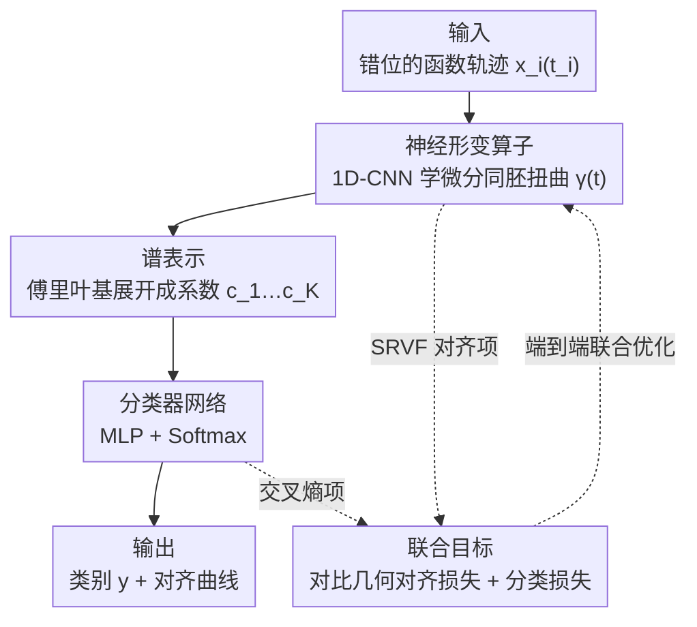

# DeepFRC: An End-to-End Deep Learning Model for Functional Registration and Classification

**会议**: ICLR2026  
**OpenReview**: [https://openreview.net/forum?id=5vdw8Qmrre](https://openreview.net/forum?id=5vdw8Qmrre)  
**代码**: https://github.com/Drivergo-93589/DeepFRC  
**领域**: 函数数据分析 / 时间序列分类  
**关键词**: 函数数据分析、曲线配准、微分同胚形变、傅里叶谱表示、对比对齐

## 一句话总结
DeepFRC 把"曲线配准（对齐）"和"曲线分类"这两件原本分开做的事塞进一个端到端深度网络里联合训练——用 1D-CNN 学微分同胚时间扭曲、用傅里叶基做平滑谱嵌入、用类感知对比损失把对齐和分类拧成一股劲，还首次给这种联合模型证了配准逼近能力和泛化界，在五个真实数据集上对齐质量和分类精度同时超过 SOTA。

## 研究背景与动机
**领域现状**：函数数据（functional data）指随时间/空间连续变化的曲线或轨迹，在生物医学、运动分析、脑电、空气污染等领域无处不在。函数数据分析（FDA）里有两个核心任务：**配准**（registration，把曲线对齐，消除相位变化）和**分类**。相位变化指的是时间轴上的错位——两条本质相同的曲线只是节奏快慢不同，看起来却对不上，直接拿去比较或分类就会被这种"假差异"带偏。

**现有痛点**：传统做法把这两件事拆成串行的两步——先做预配准，再把对齐后的曲线丢给分类器。这种解耦有两个毛病：一是**配准时完全无视标签信息**，而类别其实强烈影响曲线的演化节奏，对齐本可以从分类中获益；二是传统配准方法（基于地标、基于度量、基于模型）要么需要人工选地标，要么计算开销大（如动态时间规整 DTW 是 $O(Nn^2k)$ 的二次复杂度），要么对噪声敏感。已有的神经网络配准方法（如 SrvfRegNet）虽然快，但仍被当成与下游任务脱节的预处理步骤。

**核心矛盾**：配准和分类之间存在天然的相互增益关系，但"先配准后分类"的流水线把这条增益通路掐断了。少数尝试联合建模的工作（如 TTN、Tang et al. 2022 的两层模型）要么不为函数数据设计、忽略曲线的光滑性和无穷维本质，要么依赖参数化和分布假设、计算昂贵、难扩展到多类。

**本文目标**：设计一个端到端框架，让配准和分类**在同一个网络里互相强化**，同时保留函数数据的光滑性、给出理论保证、并能处理多类与多维输入。

**核心 idea**：用一个微分同胚神经算子学时间扭曲、用傅里叶谱表示做平滑嵌入、用类感知对比几何损失把对齐拉向"类内一致、类间分离"，让对齐天然服务于分类——三者联合优化，端到端。

## 方法详解

### 整体框架
DeepFRC 要解决的问题是：给定一批采样时间点可能错位的轨迹 $\{(x_i(t_i), y_i)\}_{i=1}^N$，同时学好"怎么对齐"和"怎么分类"。整体是一条三模块串行、再由联合损失统一拉动的流水线：原始轨迹先进**神经形变算子**（1D-CNN）学出微分同胚时间扭曲 $\gamma(t)$，把曲线扭正；扭正后的曲线用**傅里叶谱表示**展开成一组紧凑系数 $c_1,\dots,c_K$；这些系数喂给**分类器网络**（MLP+Softmax）出类别预测。训练时不是分步走，而是用一个"对比几何对齐损失 + 分类损失"的联合目标同时优化所有模块，让对齐学到"对分类有用的对齐"、分类学到"对相位不变的特征"。

### 关键设计

**1. 神经形变算子：用 1D-CNN 学一个保证有效的微分同胚扭曲**

针对"传统配准要么人工要么计算贵、且与下游脱节"的痛点，DeepFRC 不再手工构造对齐规则，而是用一个 4 层 1D 卷积网络（核大小 3，通道 $16\to32\to64$）从输入序列提取时间特征 $\tau(x_i(t_i))$，再把特征转成扭曲函数。难点在于：随便一个网络输出未必是合法的扭曲——合法的时间扭曲必须是**微分同胚**，即满足边界条件 $\gamma(0)=0,\gamma(1)=1$ 且严格单调递增 $\dot\gamma>0$。作者的巧法是把网络特征**平方后做单调累积和**：$\tilde\gamma_i(t_{ij}) = \frac{\sum_{\mu=0}^{j}\tau_{i\mu}^2}{\sum_{\nu=0}^{n}\tau_{i\nu}^2}$，平方保证增量非负、累积和保证单调、归一化保证边界，再做一次归一化 $\gamma_i(t_{ij})=\frac{\sum_{\mu=0}^{j}\tilde\gamma_{i\mu}}{\sum_{\nu=0}^{n}\tilde\gamma_{i\nu}}$ 进一步提升光滑性。这样无论网络权重怎么变，输出**天然落在合法扭曲集合 $\Gamma$ 里**，且复杂度只有 $O(Nn)$ 线性，远低于 DTW 的二次开销。

**2. 谱表示：用傅里叶基把对齐曲线压成平滑紧凑的嵌入**

对齐后得到的 $\tilde x_i(t)$ 如果直接向量化成高维网格，会丢掉光滑性又低效。这里针对"如何让对齐曲线既紧凑又保光滑"，作者先用数值稳定的 1D 线性插值在 $\{(\gamma_i(t_{ij}), x_i(t_{ij}))\}$ 上重建对齐函数，再把它在一组傅里叶基 $\{\phi_j(t)\}_{j=1}^K$ 上做最小二乘展开 $\tilde x_i(t)\approx\sum_{j=1}^K c_{ij}\phi_j(t)$，系数闭式解为 $\tilde c_i = G^{-1}d_i$（$G$ 是基函数 Gram 矩阵）。选傅里叶基的好处是**不引入额外正则超参**，得到的嵌入紧凑、光滑、自带规整，相当于一组"神经傅里叶特征"；且线性插值 + 傅里叶展开都满足后面理论分析（Theorem 3.3）要求的 Lipschitz 连续条件。基函数个数 $K$ 经验设为 100，实测对任务鲁棒。

**3. 类感知对比几何对齐损失：让对齐主动服务于分类**

这是把"配准"和"分类"拧成一股劲的关键。普通配准只追求曲线对齐、不管类别，DeepFRC 则在 SRVF（平方根速度函数）空间里设计了一个**类感知对比对齐损失**。SRVF 定义为 $q(t)=\mathrm{sign}(\dot x(t))\sqrt{|\dot x(t)|}$，扭曲后的 SRVF 为 $(q\star\gamma)(t)=q(\gamma(t))\sqrt{\dot\gamma(t)}$，在这个空间里度量曲线形状差异更几何、更稳定。损失为：

$$L_1(\Theta_1) = \sum_{j=1}^{C}\frac{\sum_{i:y_i=j}\|Q_i(\gamma_i)-\bar Q^{(j)}\|}{N^{(j)}} + \alpha\sum_{1\le u<v\le C}\|\bar Q^{(u)}-\bar Q^{(v)}\|^{-1}$$

第一项把每个样本的 SRVF 拉向**类内均值** $\bar Q^{(j)}$（类内一致），第二项是**对比分离项**——类间均值距离越小惩罚越大，把不同类的模板推开（类间分离）。这一项让对齐不再是中性的预处理，而是"为了好分类而对齐"。最终联合目标把它和分类交叉熵 $L_2$ 加权合起来：$L(\Theta)=L_1(\Theta_1)+\beta L_2(\Theta)$，其中 $\beta$ 平衡对齐与分类，整个网络（形变算子 $\Theta_1$ + 分类器 $\Theta_2$）用 AdamW 端到端一起更新。

**4. 理论保证：首次为联合模型证配准逼近与泛化界**

DeepFRC 是首个为"联合配准-分类"模型给出理论保证的工作，这也是它区别于纯经验方法的硬通货。**Theorem 3.1（低配准误差）**在网络容量充分、扭曲函数连续可微、SRVF 连续有界的假设下，证明对任意 $\epsilon>0$ 都存在模型估计的 $\hat\gamma$ 使配准误差 $\Delta Q_{\mathrm{reg}}(\gamma^*,\hat\gamma)<\epsilon$，即神经网络能在 SRVF 空间逼近最优扭曲，给"可学习微分同胚配准模块"提供了合法性。**Theorem 3.3（低泛化误差）**在类间分离 $|\bar Q^{(u)}-\bar Q^{(v)}|\ge\epsilon_0$、softmax 概率有下界 $\psi_{ij}\ge\epsilon_0$、权重落在紧致区域的假设下，证明泛化误差 $\Delta R_{\mathrm{gen}}(\hat\Theta)\lesssim \frac{T_0^{1-1/c_0}}{N}$，把**配准保真度正式连到分类性能**。这些假设并非空中楼阁：类间分离由不同 SRVF 均值支持（图 3、表 1），概率下界靠加性平滑 softmax 强制（保持所有概率 $>10^{-4}$），并反过来指导超参选择——$\alpha$ 选来最大化类间分离、$\beta$ 平衡两项损失。

### 损失函数 / 训练策略
联合目标 $L(\Theta)=L_1(\Theta_1)+\beta L_2(\Theta)$ 用 AdamW 做随机梯度下降优化，梯度按链式法则对每个参数求导。傅里叶基个数 $K=100$，对齐/分类权重 $\alpha,\beta$ 通过数据划分法选择。整体训练复杂度 $O(Nn)$ 线性，对长序列友好。框架还能直接扩展到 $d$ 维函数输入（$d\ge2$），只需把 $x_i(t_i)\in\mathbb{R}^{n\times d}$、假设各维共享同一扭曲过程即可，无需额外结构假设。

## 实验关键数据

### 主实验
在 Wave、Yoga、Symbol（2 类/3 类）、MotionSense 五个真实数据集上同时评估**配准质量**（ATV，越低越好）和**分类**（ACC、F1，越高越好）。基线含联合模型 TTN、纯配准 SrvfRegNet、以及 SrvfRegNet 串接各分类器（FCNN、FuncNN、ADAFNN、TSLANet）。

| 数据集 | 指标 | DeepFRC | TTN（联合基线） | 最强串行基线 |
|--------|------|---------|-----------------|--------------|
| Wave | ATV / ACC | **5.6** / **96.4%** | 6.3 / 94.7% | 7.3 / 96.4%（+TSLANet） |
| Yoga | ATV / ACC | **16.2** / **89.8%** | 57.7 / 89.4% | 136.0 / 89.3%（+TSLANet） |
| Symbol(2) | ATV / ACC | **4.8** / **96.0%** | 8.6 / 92.0% | 14.8 / 96.0%（+FCNNfourier） |
| Symbol(3) | ATV / ACC | **3.2** / 96.3% | 4.5 / 93.3% | 6.5 / 96.3%（+TSLANet） |
| MotionSense | ATV / ACC | **25.0** / **95.0%** | 35.1 / 85.0% | 37.7 / 95.0%（+TSLANet） |

DeepFRC 在**所有数据集上配准（ATV）都最好**，分类精度与最新 SOTA 时序模型 TSLANet 相当甚至更优，且对齐误差比串行流水线低一个量级（如 Yoga 16.2 vs 136.0）。

### 消融实验
拆解三大组件：神经形变算子（N.D.O.）、谱表示（S.R.）、分类器网络（C.N.）。

| 配置 | 影响 | 说明 |
|------|------|------|
| Full DeepFRC | — | 完整模型 |
| w/o N.D.O. | 分类显著下降 | 去掉配准，Yoga/Symbol(2)/MotionSense 掉点明显 |
| w/o C.N. | 配准变差 | 去掉分类器，对齐精度受损（反向印证两任务互益） |
| w/o S.R. | 两任务都变差 | 谱表示同时支撑配准与分类 |

跨 10 个随机种子的配对 t 检验确认：去掉任一核心组件都带来显著退化（绝大多数 $p<0.01$）。

### 关键发现
- **配准和分类确实互益**：去掉分类器会损害配准、去掉配准会损害分类，证明联合优化不是噱头而是真有协同。
- **谱表示是双任务的共同地基**：去掉它两个任务一起垮，说明傅里叶嵌入既保光滑又给分类提供了好特征。
- **对齐带来可解释性红利**：在 MotionSense 上 DeepFRC 的扭曲能同步"脚跟着地""摆动中段"等生物力学事件，在 Symbol 上能校正不同书写速度和笔顺，把噪声错位的观测蒸馏成干净的类别模板——这是纯分类器给不了的。
- **一个有趣的 trade-off**：强分类器（如 TSLANet）能仅从幅度特征学到相位不变性、精度也很高；但 DeepFRC 用显式类感知配准**主动强制**这种不变性，既简化了分类任务又产出可解释的对齐。

## 亮点与洞察
- **"平方累积和"构造微分同胚**：用网络特征平方→累积和→归一化，无需任何约束就保证输出是合法单调扭曲——一个极简又优雅的参数化技巧，可迁移到任何需要学单调/保序映射的场景。
- **把对齐损失做成"类感知对比"**：在 SRVF 空间同时拉类内、推类间，让配准从"中性预处理"变成"为分类而对齐"，这是端到端联合建模的灵魂。
- **理论与设计互相咬合**：Theorem 3.3 的假设（类间分离、概率下界）不是事后凑的，而是反过来指导 $\alpha,\beta$ 怎么选、softmax 怎么平滑——理论真正参与了模型设计。
- **线性复杂度**：$O(Nn)$ 让它在长序列上比 DTW（$O(Nn^2k)$）实用得多。

## 局限与展望
- **共享扭曲假设**：多维输入扩展假设各维共享同一扭曲过程，对于各通道相位差异大的数据（如多导联生理信号）可能不成立。
- **理论是非构造性的**：泛化界给出存在性和量级，但无法直接验证逼近误差（拿不到真实数据的全局最优扭曲 $\gamma^*$），只能靠受控仿真间接验证。
- **数据规模偏小**：评测集均为 UCR/Kaggle 上的中小规模时序数据，在大规模、长序列、高维场景下的可扩展性还需进一步检验。
- **改进方向**：放宽共享扭曲假设、把对比对齐损失扩展到层级/多粒度类别、探索更强的谱基（如可学习基或小波）替代固定傅里叶基。

## 相关工作与启发
- **vs TTN（Lohit et al. 2019）**: TTN 也做联合配准-分类，但不为函数数据设计，忽略曲线光滑性和无穷维本质，对齐不准（表 1 中 ATV 普遍更高，如 Yoga 57.7 vs 16.2）；DeepFRC 用弹性 FDA + 傅里叶谱保住了光滑性。
- **vs Tang et al. (2022) 两层模型**: 他们用参数化混合效应模型（B-spline + 高斯假设）做联合建模、需交替优化，受分布假设约束、计算贵、难扩展多类；DeepFRC 是非参数深度网络、端到端一次优化、天然支持多类多维。
- **vs SrvfRegNet（Chen & Srivastava 2021）+ 分类器流水线**: 串行方案配准时无视标签，对齐与下游脱节；DeepFRC 用类感知损失让对齐服务分类，ATV 低一个量级且分类更准。
- **vs TSLANet（Eldele et al. 2024）**: 作为强时序分类 SOTA，TSLANet 靠幅度特征隐式学相位不变性、分类精度与 DeepFRC 相当；但 DeepFRC 额外产出显式、可解释的对齐，对需要理解"数据被怎么对齐"的领域专家更有价值。

## 评分
- 新颖性: ⭐⭐⭐⭐⭐ 首个端到端联合配准-分类的函数数据深度模型，且首次给出理论保证
- 实验充分度: ⭐⭐⭐⭐ 五数据集 + 多基线 + 消融 + 配对 t 检验扎实，但数据规模偏小
- 写作质量: ⭐⭐⭐⭐⭐ 动机清晰、理论与方法咬合紧密、可解释性论证有说服力
- 价值: ⭐⭐⭐⭐ 对 FDA / 时序分类社区有方法论价值，可解释对齐有实际落地意义

<!-- RELATED:START -->

## 相关论文

- [\[ICLR 2026\] End-to-End Probabilistic Framework for Learning with Hard Constraints](end-to-end_probabilistic_framework_for_learning_with_hard_constraints.md)
- [\[ICLR 2026\] Brain-Semantoks: Learning Semantic Tokens of Brain Dynamics with a Self-Distilled Foundation Model](brain-semantoks_learning_semantic_tokens_of_brain_dynamics_with_a_self-distilled.md)
- [\[ICLR 2026\] Repurposing Foundation Model for Generalizable Medical Time Series Classification](repurposing_foundation_model_for_generalizable_medical_time_series_classificatio.md)
- [\[ICLR 2026\] CauKer: Classification Time Series Foundation Models Can Be Pretrained on Synthetic Data](cauker_classification_time_series_foundation_models_can_be_pretrained_on_synthet.md)
- [\[AAAI 2026\] Counterfactual Explainable AI (XAI) Method for Deep Learning-Based Multivariate Time Series Classification](../../AAAI2026/time_series/counterfactual_explainable_ai_xai_method_for_deep_learning-based_multivariate_ti.md)

<!-- RELATED:END -->
