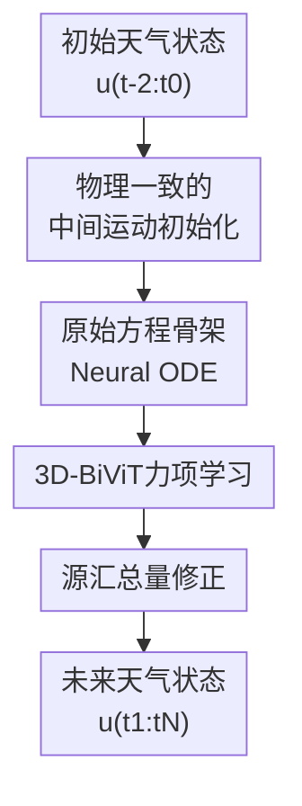

# DeepPrim: a Physics-Driven 3D Short-term Weather Forecaster via Primitive Equation Learning

**会议**: ICLR 2026  
**OpenReview**: [https://openreview.net/forum?id=EyyWd0hH0q](https://openreview.net/forum?id=EyyWd0hH0q)  
**代码**: https://github.com/DAMO-DI-ML/DeepPrim  
**领域**: 时间序列 / 天气预测 / 物理信息时空建模  
**关键词**: 物理驱动天气预报、原始方程、Neural ODE、3D大气动力学、短临预测  

## 一句话总结
DeepPrim 把大气原始方程中的平流、力项和源汇项显式写进 Neural ODE 预测框架，用 3D-BiViT 学习经纬度-气压层耦合动力学，在 6-24 小时全球和区域天气预报上显著优于多数数据驱动基线。

## 研究背景与动机
**领域现状**：天气预报长期依赖数值天气预报（NWP）系统，通过求解原始方程、连续性方程、水汽方程等偏微分方程来模拟大气演化。近几年，GraphCast、Pangu、ClimaX、FuXi、ClimODE 等深度学习天气模型把 ERA5 再分析数据当成大规模时空场来学习，通常能以更低推理成本给出很强的中短期预测。

**现有痛点**：传统 NWP 的解释性强，但对湍流、辐射加热、凝结蒸发等未解析物理过程需要经验参数化，不同参数化方案会带来明显误差。纯数据驱动模型虽然擅长拟合历史统计相关性，却常把大气状态当作 2D 图像序列或普通视频处理，没有充分利用气压坐标下的垂直耦合、平流和守恒约束。对于 24 小时以内的短临预测，这些物理细节尤其关键，因为局地对流、层间能量传递和近地面风温变化往往变化很快。

**核心矛盾**：短期天气预报既需要深度网络的表达能力来吸收海量 ERA5 观测，又需要大气动力学提供正确的归纳偏置。若只靠神经网络端到端拟合，模型可能学到相关性但不稳定；若完全沿用传统方程求解，又会重新遇到经验参数化和计算复杂度问题。

**本文目标**：作者希望构建一个连续时间的短期 3D 天气预报器：一方面显式学习气压坐标下的 Navier-Stokes / 原始方程结构，另一方面用神经网络近似传统 NWP 难以精确写出的力项与源汇过程，并在全球与区域预测中验证这种物理驱动设计是否真的带来收益。

**切入角度**：论文从一个很具体的物理观察出发：温度、水汽、位势高度等预报变量的演化很大程度由大气运动和平流驱动，而大气运动本身可由气压坐标下的动量方程描述。因此，与其直接让网络输出未来天气场，不如先学习一个中间运动场 $v^*$，再用平流方程和源汇修正把它转成未来的天气状态。

**核心 idea**：用可学习的 force network 和 source-sink network 替代传统方程中难以精确参数化的部分，同时保留平流、垂直速度、气压层耦合这些原始方程骨架，让深度模型“沿着物理结构”学习短期天气演化。

## 方法详解

### 整体框架
DeepPrim 的输入是连续三个时刻的天气状态 $u(t_{-2}:t_0)$，包括地表变量、多个气压层的高空变量和静态地理变量；输出是未来 $N$ 个时间步的天气状态。它不是一次性回归未来图像，而是在 Neural ODE 系统里反复更新天气状态 $u(t)$ 和中间运动场 $v^*(t)$，再用源汇网络校正 ODE 积分后的结果。

从整体流程看，DeepPrim 先用 initialization network 从当前风场、时间变化和 3D 空间梯度中估计初始中间运动场；随后在 ODE 求解过程中，用物理平流项推进天气变量，用 3D-BiViT force network 学习中间运动场的时间导数；最后，source-sink network 对积分结果做一次总量式修正，用来吸收辐射、相变、湍流混合等没有显式写进方程的增益或损耗。

这个框架的核心方程可概括为两条耦合动力学：中间运动场 $v^*$ 由平流项和可学习力项共同更新，天气状态 $u$ 由 $v^*$ 驱动的水平/垂直平流项和可学习源汇项共同更新。论文写成 $\dot{v}^*=-(v^*\cdot\nabla_p v^*+\omega\partial v^*/\partial p)+Force(u,v^*)$，以及 $\dot{u}=-(v^*\cdot\nabla_p u+\omega\partial u/\partial p)+Source\text{-}Sink(u,v^*)$，其中垂直速度 $\omega$ 由连续性方程从水平风散度积分得到。

### 关键设计
**1. 物理一致的中间运动初始化：先把风场变成可积分的动力学状态**

DeepPrim 没有直接把真实水平风 $[v_x,v_y]$ 当作 ODE 中唯一的运动状态，而是引入中间运动场 $v^*$。原因是模型要学习的不只是观测风速本身，还包括在神经 ODE 离散推进中最适合驱动平流和力项估计的有效运动。若初值估得不好，ODE 之后每一步都会把误差向前传播，短期预测也会很快偏离真实演化。

初始化网络采用残差形式 $v^*(t_0)=[v_x,v_y]_{t_0}+Conv(u(t_{-2}:t_0),\dot{u}(t_0),\nabla u(t_0),\psi_{ST})$。这里的 $\dot{u}(t_0)$ 提供近期变化趋势，$\nabla u(t_0)$ 同时包含经度、纬度和气压层方向的空间梯度，$\psi_{ST}$ 编码经纬度、日周期和季节周期。这样做的好处是，初始运动不再只看一个瞬时风场，而是能感知局地天气变量正在如何变化、上下气压层之间如何耦合，以及当前位置处在一天/一年中的什么阶段。

**2. 原始方程骨架 Neural ODE：让网络学习难写的项，而不是丢掉方程结构**

DeepPrim 的关键不是把物理方程当作一个额外 loss，而是把方程本身放进预测器的状态转移里。天气状态的更新显式包含 $v^*\cdot\nabla_p u$ 这种水平平流，以及 $\omega\partial u/\partial p$ 这种垂直气压层方向的传输；中间运动场的更新也保留了类似 Navier-Stokes 方程中的自平流结构。网络主要负责学习外力、摩擦、复杂参数化过程等难以精确建模的部分。

这种设计把传统 NWP 和深度学习各退一步又各进一步：它不需要手工选择某个固定的经验参数化方案，也不会让神经网络完全凭数据相关性自由发挥。ODE 求解器以 $\Delta t=1h$ 这样的离散步长推进连续时间系统，因此模型可以自然输出 6、12、18、24 小时等不同 lead time 的短期预测，并且在形式上保留了随时间积分的大气动力学含义。

**3. 3D-BiViT力项学习：把水平层内运动和垂直层间耦合拆开建模**

气压层是这篇论文最重要的结构信息。Pangu 一类方法会把 pressure level 当作高度坐标加入统一 attention，NeuralGCM 则更偏向单个垂直柱内的局地 tendency；DeepPrim 认为这两种做法都不够直接地区分“同一气压层内的水平平流”和“不同气压层之间的垂直耦合”。因此 force network 使用 3D bicomponent ViT：先对地表变量和高空变量分别 patchify，并用不同 embedding / projector 表达两类变量的异质性；再加入可学习 pressure-level embedding，让 token 明确知道自己属于哪个气压层。

在 attention 结构上，3D-BiViT 先做 intra-pressure self-attention，在同一气压层内建模经纬度方向的相互影响；随后做 cross-pressure self-attention，在同一水平位置或 patch 语义下建模跨气压层的垂直耦合。这个两阶段设计与原始方程里的黏性摩擦、高阶梯度和压力梯度力相呼应：大气并不是一摞互不相干的 2D 图像，也不是一个各向同性的 3D 体素，而是水平运动和垂直层间交换性质不同的物理系统。

**4. 源汇总量修正：用学习到的增益/损耗替代经验参数化**

即使平流和力项学得不错，天气变量还会受到辐射加热/冷却、凝结蒸发、湍流混合、昼夜循环等过程影响。传统 NWP 常用参数化方案近似这些 resolved / unresolved processes，但参数化不是唯一的，且对地区和观测条件敏感。DeepPrim 用 source-sink network 来学习这些变量增益或损耗，输入包括初始状态 $u(t_0)$、初始中间运动 $v^*(t_0)$、ODE 初步预测 $\{u'(t_i)\}_{i=1}^N$ 和时空 embedding。

一个细节很重要：论文没有在每个 ODE 离散步都预测瞬时源汇率，而是直接预测从起始时间到目标 lead time 的源汇总量，再把它残差加到 ODE 解上，即 $\hat{u}(t_i)=Conv(u(t_0),v^*(t_0),u'(t_i),\psi_{ST})+u'(t_i)$。这能减少 ODE 积分过程中的误差累积，也避免 source-sink 网络在每一步过度拟合局部噪声。消融结果显示，去掉这个网络会让 z500、t2m、风速等多个变量的 RMSE 明显恶化，说明短期天气变化并不能只靠平流解释。

### 一个完整示例
假设模型要从某个时刻的 ERA5 全球场预测未来 12 小时的温度和风场。输入首先包含最近三个时刻的地表温度、10 米风、高空位势高度、温度、湿度、不同气压层风速，以及 land-sea mask、地形、纬度等静态变量。初始化网络会把当前真实风场和过去两个时间步的变化趋势结合起来，得到更适合 ODE 推进的 $v^*(t_0)$。

随后 ODE 从 $t_0$ 开始逐小时积分。每一步中，天气变量先根据中间运动场发生水平和垂直平流；与此同时，force network 根据当前天气状态、3D 梯度和 pressure embedding 估计 $v^*$ 的时间变化。到了 12 小时后，ODE 会给出一个物理骨架下的初步天气场 $u'(t_{12})$。最后 source-sink network 看见这个初步结果、初始状态和时空位置后，补上昼夜温度变化、湿度相变等累计修正，输出最终 $\hat{u}(t_{12})$。因此，DeepPrim 的预测不是“输入图像到输出图像”的黑箱映射，而是“初始化运动场 → 沿原始方程积分 → 学习源汇修正”的连续演化过程。

### 损失函数 / 训练策略
训练目标是目标 lead time 上的 latitude-weighted MSE。纬度权重 $\alpha(h)$ 用来补偿球面网格在不同纬度面积不同的问题，避免高纬度密集网格在损失中被过度放大。论文中的损失为 $L=\frac{1}{KHW}\sum_k\sum_h\sum_w\alpha(h)(\hat{u}_{k,h,w}(t_N)-u_{k,h,w}(t_N))^2$。

数据使用 ERA5 / WeatherBench，训练集为 1979-2015 年，验证集为 2016 年，测试集为 2017-2018 年。模型支持 5.625°、1.40625° 和 0.25° 分辨率；初始化网络和 source-sink network 使用 ResNet 风格卷积骨干，force network 使用 ViT 风格 3D-BiViT。优化器为 AdamW，ODE 组件学习率为 $1e^{-5}$，其他部分为 $5e^{-4}$，前 20,000 step 线性 warmup 后接 cosine annealing；ODE 时间间隔设为 $\Delta t=1h$。论文主要使用 Euler 方法做短期积分，同时在局限部分指出 RK4 等更高阶求解器可能改善更长 lead time 的稳定性。

## 实验关键数据

### 主实验
论文在全球天气预报和区域天气预报上都报告了结果。主指标是 latitude-weighted RMSE，评估变量包括 z500、t850、t2m、u10、v10。下表摘取 5.625° 全球任务中 24 小时 lead time 的代表性结果；数值越低越好。

| 变量 / 24h RMSE | IFS | ClimaX | ClimODE | DeepPrim | 观察 |
|--------|------|--------|---------|----------|------|
| z500 | 51.0 | 96.2 | 193.4 | 121.0 | z500 上 IFS 仍强，DeepPrim 明显优于 ClimODE |
| t850 | 0.87 | 1.11 | 1.55 | 1.13 | DeepPrim 接近 ClimaX，明显压过 ClimODE |
| t2m | 1.02 | 1.10 | 1.40 | 1.19 | DeepPrim 在近地面温度上优于 ClimODE |
| u10 | 1.11 | 1.41 | 2.01 | 1.39 | 风速预测体现物理平流建模收益 |
| v10 | 1.33 | N/A | 2.48 | 1.43 | v10 上 DeepPrim 也显著优于 ClimODE |

在 1.40625° 全球任务中，DeepPrim 在 t850、t2m、u10 上超过 IFS，并且相比预训练 ClimaX 平均降低 36.11% RMSE；与 WeatherGFT 相比，DeepPrim 只有约 1/20 参数量，却在 t850 和 t2m 上表现更好。在 0.25° 全球任务中，DeepPrim 对风速预测尤其突出，例如 24 小时 u10 RMSE 为 0.76，优于 IFS 的 1.23、Pangu 的 0.91 和 GraphCast 的 0.81。

区域预报结果也支持同一结论。论文在 North America、South America、Australia 三个区域上比较 NODE、ClimaX、ClimODE 和 DeepPrim†，DeepPrim 在三地五个变量上多数取得最低 RMSE，相比最强基线平均降低 35.8%。例如 Australia 24 小时 z500 从 ClimODE 的 308.2 降到 117.3，South America 24 小时 u10 从 ClimaX / ClimODE 约 2.04 / 2.08 降到 1.33。

### 消融实验
| 配置 | z500 6h / 24h RMSE | t2m 6h / 24h RMSE | u10 6h / 24h RMSE | 说明 |
|------|---------|---------|---------|------|
| Full DeepPrim | 50.1 / 121.0 | 0.89 / 1.19 | 0.92 / 1.39 | 完整模型 |
| w/o Source-Sink | 136.3 / 258.5 | 2.43 / 2.58 | 1.68 / 2.30 | 去掉源汇修正后退化最大，说明未解析物理过程很关键 |
| w/o $\nabla u$ in Initialization | 68.3 / 155.7 | 1.03 / 1.34 | 1.04 / 1.60 | 不用 3D 空间梯度会削弱初始运动估计 |
| w/o $\dot{u}$ in Initialization | 52.4 / 127.7 | 0.90 / 1.20 | 0.95 / 1.42 | 时间变化项也有帮助，但影响小于空间梯度 |
| w/o 3D modules | 65.3 / 139.4 | 1.01 / 1.38 | 0.98 / 1.52 | 去掉 cross-pressure attention 和气压梯度后平均下降约 12.3% |

论文还做了 backbone 消融：把 force network 的 3D-BiViT 换成 GNN、vanilla ViT 或 CNN 都会退化。6 小时 z500 RMSE 从完整模型的 50.1 变为 GNN force 的 69.3、vanilla ViT force 的 64.4、CNN force 的 65.3，说明关键收益并不是普通大模型容量，而是显式区分水平层内交互和气压层间交互的结构。

### 关键发现
- 源汇网络是最重要的模块之一。去掉它后 t2m 6 小时 RMSE 从 0.89 增至 2.43，z500 24 小时 RMSE 从 121.0 增至 258.5，说明短期天气预报不能只靠平流项，昼夜循环、辐射和水汽过程必须被补偿。
- 3D 气压层建模确实有效。论文展示不同气压层变量的相关性图，相邻气压层温度和风场相关性更强；DeepPrim 的连续时间预测能更好追踪不同气压层温度随昼夜变化的同步趋势。
- DeepPrim 的强项集中在短期、连续时间和风温变量。0.25° 任务上 z500 仍不如 GraphCast，但 t850、u10、v10 等变量具有竞争力，符合论文“通过力项和平流建模改善大气运动”的定位。
- 轻量性不错。DeepPrim 在 5.625° / 1.40625° / 0.25° 下参数量约 22M / 23M / 45M，明显小于 Pangu 的 256M 和 WeatherGFT 的 470M；0.25° 单样本 24 小时推理约 9.48 秒。

## 亮点与洞察
- 把原始方程当成模型骨架，而不是只作为正则项，是这篇论文最清楚的贡献。它让模型预测过程本身具备“运动场驱动天气变量演化”的结构，而不是训练时才短暂看一眼物理约束。
- 中间运动场 $v^*$ 的设计很实用。真实风场不一定是最适合神经 ODE 积分的状态变量，作者用残差初始化网络在观测风和可学习动力学之间架桥，避免了硬套物理变量导致的表达不足。
- 3D-BiViT 的拆分 attention 有明确气象含义：水平层内平流和垂直气压层耦合不是同一种交互。这个思路可迁移到海洋环流、污染扩散、地下水流等同样具有“水平传播 + 垂直层间交换”的地球系统建模任务。
- 源汇网络的“总量修正”比逐步修正更稳。对 ODE 系统而言，每一步都让网络自由补源汇容易放大误差；直接学习从起点到目标时刻的累计修正，是一个兼顾表达能力和积分稳定性的折中。
- 实验没有只停留在 benchmark 分数，还专门验证了 3D 气压层建模的必要性，包括相关性图、连续时间曲线和全球误差图。这让方法设计和实证结果之间的闭环更完整。

## 局限与展望
- 当前 DeepPrim 主要是确定性预测，不能直接输出概率分布或不确定性。对真实业务天气系统而言，集合预报、极端事件风险和置信区间非常重要，作者也指出可让 source-sink network 输出分布参数来扩展到概率预测。
- 论文重点是 6-24 小时短期预测，长 lead time 不是当前强项。36、72、144 小时实验显示 DeepPrim 相比非预训练 ClimaX 和 ClimODE 仍有优势，但要追上专门为中长期滚动预测设计的系统，还需要 autoregressive refinement、ensemble、rolling initialization 和显式误差修正。
- ODE 求解主要采用 Euler 方法，简单高效但阶数较低。更高阶的 RK4 或自适应 ODE solver 可能改善中长期稳定性，不过会带来更多计算成本和训练复杂度。
- 数据划分沿用 ClimaX 的 1979-2015 / 2016 / 2017-2018 固定切分。对于气候变化背景下的非平稳数据，滚动 train/val/test 切分可能更公平，也更能检验模型对年代分布漂移的鲁棒性。
- 物理一致性仍是“结构引导 + 数据学习”，不是严格守恒求解器。论文没有系统证明质量、能量或水汽守恒误差，也没有给出极端天气场景下的稳定性边界，这是未来物理可信度评估的重要方向。

## 相关工作与启发
- **vs ClimODE**: ClimODE 首先把天气预报写成 physics-informed Neural ODE，并用连续性方程启发 neural advection；DeepPrim 进一步显式引入气压坐标下的原始方程、3D 气压层交互和 source-sink 修正，因此在同样短期预测设置下更擅长捕捉垂直耦合的大气动力学。
- **vs Pangu-Weather**: Pangu 使用 3D 神经网络和统一 attention / positional embedding 表达经纬度-高度信息，适合高分辨率中期预报；DeepPrim 的区别是把水平层内交互和跨气压层交互拆开，并让这些交互服务于 Navier-Stokes 力项学习，物理解释更直接。
- **vs NeuralGCM**: NeuralGCM 将机器学习嵌入一般环流模型，强调可解释物理 tendency 和气候尺度泛化；DeepPrim 更偏短期天气预报，使用局部/全局数据驱动模块学习原始方程中的难参数化项，推理轻量但守恒与长期气候一致性验证相对不足。
- **vs WeatherGFT**: WeatherGFT 把物理 PDE 和 ViT correction 并行结合，关注细粒度时间尺度泛化；DeepPrim 则把平流和力项写入一个耦合 ODE 动力系统，用 source-sink 网络做累计修正。两者都说明“物理 + AI”比纯端到端回归更适合天气任务。
- **启发**: 对其他科学机器学习问题，可以优先问“哪些项必须保留为方程骨架，哪些项适合交给神经网络学”。DeepPrim 的答案是保留平流、连续时间积分和气压层结构，把难以闭式建模的力项/源汇项交给网络，这种分工比简单堆大 backbone 更有迁移价值。

## 评分
- 新颖性: ⭐⭐⭐⭐☆ 把原始方程、3D 气压层建模和 Neural ODE 结合得比较完整，核心思路不是全新物理方程，但工程化整合有辨识度。
- 实验充分度: ⭐⭐⭐⭐☆ 覆盖多分辨率全球预测、区域预测、消融、参数量和速度分析；若能加入更多极端天气和概率预报评估会更强。
- 写作质量: ⭐⭐⭐⭐☆ 物理动机、公式和模块对应关系讲得清楚，附录复现信息较多；部分主表很大，读者需要在正文和附录之间来回对照。
- 价值: ⭐⭐⭐⭐⭐ 对短期天气预测和物理信息时空建模都有实际价值，也已经部署到 Baguan weather forecasting system 的短期预测部分。

<!-- RELATED:START -->

## 相关论文

- [\[ICLR 2026\] Towards Generalizable PDE Dynamics Forecasting via Physics-Guided Invariant Learning](towards_generalizable_pde_dynamics_forecasting_via_physics-guided_invariant_lear.md)
- [\[ICLR 2026\] Unlocking the Value of Text: Event-Driven Reasoning and Multi-Level Alignment for Time Series Forecasting](unlocking_the_value_of_text_event-driven_reasoning_and_multi-level_alignment_for.md)
- [\[ICLR 2026\] Extreme Weather Nowcasting via Local Precipitation Pattern Prediction](extreme_weather_nowcasting_via_local_precipitation_pattern_prediction.md)
- [\[ICML 2025\] A Generalizable Physics-Enhanced State Space Model for Long-Term Dynamics Forecasting in Complex Environments](../../ICML2025/time_series/a_generalizable_physics-enhanced_state_space_model_for_long-term_dynamics_foreca.md)
- [\[ICLR 2026\] PMDformer: Patch-Mean Decoupling Information Transformer for Long-term Forecasting](pmdformer_patch-mean_decoupling_information_transformer_for_long-term_forecastin.md)

<!-- RELATED:END -->
