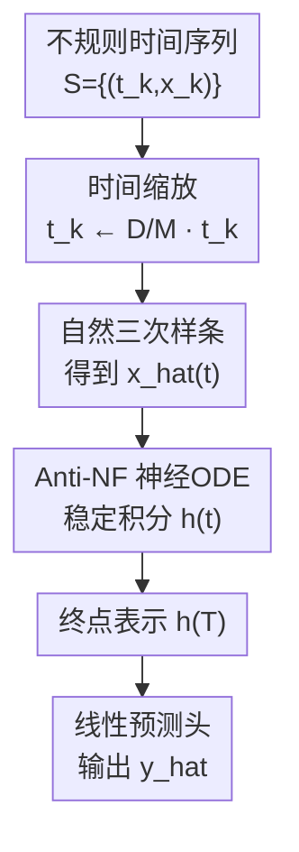

# DeNOTS: Stable Deep Neural ODEs for Time Series

**会议**: ICLR 2026  
**OpenReview**: [https://openreview.net/forum?id=SFoDJZ1sSk](https://openreview.net/forum?id=SFoDJZ1sSk)  
**论文**: [OpenReview](https://openreview.net/forum?id=SFoDJZ1sSk)  
**代码**: https://github.com/Ilykuleshov/denots_iclr2025  
**领域**: 时间序列 / 神经ODE / 连续时间建模  
**关键词**: 神经控制微分方程, 时间缩放, 负反馈, 不规则时间序列, 稳定性  

## 一句话总结
DeNOTS 把 Neural CDE 的“深度”从调低求解器 tolerance 转向显式拉长积分时间，并用反相负反馈稳定长时间积分，使模型在不规则时间序列分类、回归与预测任务上同时获得更强表达力、更稳轨迹和更低离散化误差累积。

## 研究背景与动机
**领域现状**：不规则时间序列常常既有非均匀采样，又有缺失观测。Neural CDE 为这类数据提供了一种自然的连续时间框架：先把离散观测插值成连续控制信号 $\hat{x}(t)$，再让隐藏状态 $h(t)$ 沿着一个由神经网络定义的微分方程演化，最后用终点 $h(T)$ 做序列级预测。相比普通 RNN，这类模型能显式处理观测时间；相比直接补齐再喂 Transformer 或 SSM，它保留了连续时间系统的结构。

**现有痛点**：Neural ODE/CDE 里常说 number of function evaluations, NFE 是离散网络“层数”的连续时间对应物。直觉上，NFE 越多，模型越“深”，表达力也应更强。但实际训练中，NFE 主要由 ODE solver 的 tolerance 间接控制：把 tolerance 调得更小，会让求解器走更多步，却主要是在提高数值精度，而不是稳定地增加模型可表示的函数族。论文的实验也显示，靠降低 tolerance 提升 NFE 与性能之间的相关性并不可靠。

**核心矛盾**：如果仍在固定时间区间上追求更强表达力，理论上往往需要更大的向量场 Lipschitz 常数，也就是更大的权重范数。权重范数变大后，tanh/sigmoid 容易饱和，ReLU 也可能出现 dying 或轨迹爆炸；而如果直接把积分区间拉长，NFE 会自然增加，但普通向量场在长时间积分中又容易产生不受控的隐藏状态增长。于是这篇论文面对的是一个很具体的矛盾：想把 Neural CDE 做深，但不能让长区间积分把训练稳定性一起拖垮。

**本文目标**：作者希望把 Neural CDE 的深度变成一个可控的建模超参数，而不是求解器误差容忍度的副作用。具体来说，模型需要同时做到三件事：用更长积分时间提升表达力；在长时间区间上保持隐藏轨迹稳定；面对输入插值误差和数值积分误差时，不让误差随序列长度持续累积。

**切入角度**：论文的关键观察是，时间本身不必只是数据给定的物理坐标，也可以被当成一个表达力控制旋钮。若把时间戳按 $t_k \leftarrow \frac{D}{M}t_k$ 缩放，积分区间被拉长，求解器需要更多函数评估，模型等价于获得更深的连续计算路径。问题是，拉长时间会放大不稳定性，所以作者把控制系统里的负反馈思想引入 Neural CDE 的向量场。

**核心 idea**：DeNOTS 用时间缩放显式增加 Neural CDE 的连续深度，再用反相负反馈 Anti-NF 让隐藏轨迹在长时间积分中既稳定又不容易遗忘早期信息。

## 方法详解

### 整体框架
DeNOTS 的输入是一条时间序列 $S=\{(t_k,x_k)\}_{k=1}^n$，输出是序列级预测 $\hat{y}$。它先把时间戳按数据集尺度归一化并乘上可调深度参数 $D$，再用自然三次样条把离散观测变成连续信号 $\hat{x}(t)$，随后用带 Anti-NF 的 GRU 型向量场积分得到最终隐藏状态 $h(T)$，最后通过线性 head 输出分类或回归结果。

这套流程的贡献不在于换了一个复杂 backbone，而在于把“连续深度”“稳定性”和“误差鲁棒性”捆在同一套 ODE 动力学里：时间缩放负责让模型更深，Anti-NF 负责让深度不会变成轨迹爆炸，同步的理论分析解释为什么离散化误差不会随 $T$ 线性或指数式失控。

### 关键设计
**1. 时间缩放：把 NFE 从数值精度旋钮改成表达力旋钮**

标准 Neural CDE 通常求解
$\frac{dh(t)}{dt}=g_\theta(\hat{x}(t),h(t))$，并把终点 $h(T)$ 当作整条序列的 embedding。若想让它更深，最直接的做法似乎是调低 solver tolerance，让自适应求解器多评估几次 $g_\theta$。但论文指出，这种做法混淆了两个概念：tolerance 控制的是数值误差，而表达力真正关心的是模型能在连续时间里组合多少非线性变换。

作者给出一个 Lipschitz 视角来说明这一点。对于向量场 $g$，若其对输入和隐藏状态的 Lipschitz 常数为 $M_x,M_h$，对应映射对轨迹和初始状态的有效 Lipschitz 上界随时间包含类似 $e^{M_h t}$ 的项。也就是说，在不增大权重范数的情况下，拉长积分区间本身就能扩大可表示映射族；而在固定区间里强行提高表达力，往往要通过增大 $M_h$，这会带来训练不稳定。于是 DeNOTS 设置 $t_k \leftarrow \frac{D}{M}t_k$，其中 $D$ 是可调时间尺度，$M$ 是数据集时间跨度的归一化常数。实验中，随着 $D$ 增大，权重 $l_2$ 范数反而下降，说明模型不是靠更大的权重硬撑表达力，而是把更长的连续计算路径用起来。

**2. Anti-NF：用反相负反馈稳定轨迹，同时保留长期记忆**

时间缩放会把积分区间拉长，普通向量场在长时间上很容易出现隐藏状态范数爆炸。最朴素的负反馈是从导数里减去当前状态，例如 GRU-ODE 的同步负反馈 Sync-NF：$GRU(\hat{x}(t),h(t))-h(t)$。它确实能把轨迹限制住，但代价是更新项和衰减项同时生效，旧状态的影响会持续衰减，模型容易像早期 RNN 一样遗忘序列开头的重要信息。

DeNOTS 的做法更微妙：它把 $-h(t)$ 而不是 $h(t)$ 传入 GRU 单元，使向量场变成近似
$g_\theta(\hat{x}(t),h(t))=(1-z)\odot n - z\odot h$。
这里 $z$ 不只是门控更新，还在调节负反馈强度；当模型需要稳定时，$z\odot h$ 提供把状态拉回的项，当模型需要保留历史时，门控又可以减弱这个约束。论文把这种机制称为 Anti-NF，因为更新项和负反馈项不是同步被同一模式激活，而是在门控里形成反相分工。

这种设计的理论形式可写成 $\frac{dh}{dt}=a f_\theta(\hat{x},h)-b h$。在 $aL_h<b$ 等条件下，该系统是 input-to-state stable：只要输入控制信号有界，隐藏状态就不会无限增长。更重要的是，Anti-NF 不像 Sync-NF 那样总是强制满足严格遗忘条件，它可以通过门控自适应地减弱负反馈，从而在稳定性和长期记忆之间留下可学习空间。

**3. 稳定误差界：让插值误差和积分误差不随序列长度失控**

Neural CDE 的一个经常被低估的问题是，它永远在近似连续系统。输入序列需要插值，ODE 需要数值积分，二者都会引入离散化误差。如果向量场不稳定，这些误差会沿时间传播并被放大，尤其在 DeNOTS 主动拉长时间区间后更危险。

论文把真实连续系统写作 $h^*(t)$，把受误差影响的系统写作在向量场中额外加入扰动 $\xi(t)$。在同样的负反馈条件下，最终隐藏状态误差满足类似
$E\|h(T)-h^*(T)\|_2^2 \le (\frac{a}{b-aL_h})^2\xi_{PW}^2$ 的界，区间平均误差也有对应的 $T$ 无关上界。这个结论的含义很直接：误差大小由负反馈余量 $b-aL_h$ 和瞬时误差控制，而不是随总积分时间 $T$ 不断累积。

对输入插值，作者进一步用 Gaussian Process 理论分析自然三次样条的区间误差，得到与最大观测间隔 $\delta_{max}^4$ 相关的紧上界。这样一来，DeNOTS 的稳定性不是只停留在“轨迹看起来没爆”的经验层面，而是连接到了 Neural CDE 实际使用时最核心的两个近似来源：插值和数值求解。

### 一个完整示例
假设有一条 ICU 患者的不规则时间序列，前 72 小时内有生命体征和化验指标，很多变量只在少数时间点被观测到。普通离散模型往往需要先补齐缺失值，再把序列按固定步长喂进去；标准 Neural CDE 则先用自然三次样条把这些观测变成 $\hat{x}(t)$，再沿 $[0,T]$ 积分。

DeNOTS 会先把每个时间戳变成 $\frac{D}{M}t_k$。如果验证集选择了更大的 $D$，同一条患者轨迹会被放到更长的积分区间里，求解器为了完成积分自然会调用更多次向量场，相当于模型对这条序列做了更多层连续变换。每一次变换都通过 Anti-NF GRU 读取当前插值得到的 $\hat{x}(t)$ 和隐藏状态 $h(t)$，同时用门控决定此刻是更应该写入新信息，还是更应该把不稳定增长的隐藏分量拉回。

如果早期某个异常化验值对败血症判断很关键，Sync-NF 的强负反馈可能在长区间后把它的影响衰减掉；Anti-NF 则可以在需要时减弱负反馈，让这类早期信号继续影响后续隐藏状态。若中间有一段观测缺失，样条插值和 ODE solver 的误差会进入系统，但在负反馈余量足够时，这些误差不会因为序列长就无限累加到最终表示里。

### 损失函数 / 训练策略
DeNOTS 本身是一个 backbone，训练目标随下游任务变化：回归任务使用 MSE 并报告 $R^2$，二分类任务使用 binary cross-entropy 并报告 AUROC，多分类任务使用 cross-entropy 并报告 Accuracy。所有模型端到端训练，优化器为 Adam，学习率固定为 $10^{-3}$，验证指标不再提升时早停。

实现上，论文使用 TorchODE 的自适应 DOPRI5 solver，tolerance 固定为 $10^{-3}$，并使用 AutoDiff 反向传播而非 adjoint。隐藏维度主要设为 32，以保证与 GRU、Neural CDE、Neural RDE、Mamba、RoFormer、TempFormer 等基线在参数量上大致可比。时间缩放中的归一化常数 $M$ 取数据集中时间跨度的中位数，$D$ 则根据验证集选择。

## 实验关键数据

### 主实验
论文在四个主 benchmark 上比较 DeNOTS 与 RNN/GRU、Transformer 变体、Mamba、GRU-ODE、Neural CDE 和 Neural RDE。UWGL 与 InsectSound 是多分类，指标为 Accuracy；Pendulum 是回归，指标为 $R^2$；Sepsis 是不平衡二分类，指标为 AUROC。完整结果显示 DeNOTS 在四个数据集上都处于第一梯队，并在平均 rank 上为 1.0。

| 数据集 | 指标 | DeNOTS | 最强/相近基线 | 结论 |
|--------|------|--------|---------------|------|
| UWGL | Accuracy | $0.82 \pm 0.03$ | Neural CDE $0.82 \pm 0.03$ / Sync-NF $0.811 \pm 0.002$ | 与最佳基线并列，但保持更统一的稳定机制 |
| InsectSound | Accuracy | $0.44 \pm 0.02$ | TempFormer $0.43 \pm 0.02$ / Mamba $0.41 \pm 0.03$ | 在该多分类任务上略优于序列基线 |
| Pendulum | $R^2$ | $0.79 \pm 0.02$ | Neural RDE $0.78 \pm 0.03$ / Sync-NF $0.77 \pm 0.01$ | 长不规则序列回归中优势更明显 |
| Sepsis | AUROC | $0.937 \pm 0.005$ | Sync-NF $0.932 \pm 0.003$ / GRU-ODE $0.925 \pm 0.003$ | 在高缺失医学时间序列上最好 |

另一个 rank 表从统计检验角度汇总四个任务：DeNOTS 在 UWGL、InsectSound、Pendulum、Sepsis 上 rank 都为 1，平均 rank 为 1.0；Sync-NF SNCDE 的平均 rank 为 1.25，是最接近的对照。这说明单纯“稳定”已经很有用，但 Anti-NF 在长期记忆和表达力上的额外自由度进一步带来收益。

### 消融实验
论文的消融不是只关掉一个模块，而是系统比较两种增加 NFE 的方式和多种向量场。核心结论是：调低 tolerance 带来的 NFE 增加与性能相关性弱；时间缩放只有和稳定向量场结合时才可靠；Anti-NF 在三个表达力测试数据集上相关性最稳定。

| 配置 / 对照 | 关键指标 | 说明 |
|-------------|----------|------|
| Bump, Tanh 默认 | AUROC $0.77 \pm 0.02$ | 不增加深度时表达力不足 |
| Bump, Tanh 降 tolerance | AUROC $0.90 \pm 0.01$ | 数值精度增加有帮助，但不充分 |
| Bump, Tanh 时间缩放 | AUROC $0.99 \pm 0.00$ | 直接拉长时间更有效 |
| Pendulum, D=20 No NF | $R^2 \approx -6\times 10^6$ | 长区间普通 GRU 向量场严重不稳定 |
| Pendulum, D=20 Sync-NF | $R^2=0.73$ | 轨迹稳定，但可能遗忘 |
| Pendulum, D=20 Anti-NF | $R^2=0.83$ | 稳定且更灵活，表现最好 |
| SineMix, Sync-NF | $R^2=0.3$ | 需要记住序列前半段频率时明显吃亏 |
| SineMix, Anti-NF | $R^2=1$ | 保留长期记忆，解决任务 |

对 NFE-metric 相关性，DeNOTS 的 Anti-NF + 时间缩放在 Pendulum、Sepsis、Sine-2 上 Pearson 相关分别为 $0.9,0.8,1.0$，Spearman 相关分别为 $0.9,0.7,1.0$。相比之下，降 tolerance 的 Anti-NF 相关性只有 $0.5,0.5,0.4$，说明“更多求解器步数”本身不是关键，关键是把时间尺度作为表达力参数来使用。

### 关键发现
- 时间缩放是这篇论文最核心的经验发现：在固定 tolerance 下增大 $D$，能让 NFE 与性能更稳定地正相关；在同等“更多 NFE”的表象下，降低 tolerance 并不能可靠提升表达力。
- 负反馈是时间缩放能够工作的前提。No-NF、ReLU、Tanh 等非稳定或弱稳定向量场在长时间积分时容易出现隐藏轨迹爆炸或训练失败；Sync-NF 和 Anti-NF 明显更稳。
- Anti-NF 相比 Sync-NF 的关键收益在长期记忆。SineMix 任务要求模型记住序列前半段频率，Sync-NF 只有 $R^2=0.3$，Anti-NF 则达到 $R^2=1$，这很好地支撑了“严格负反馈会遗忘”的论点。
- 鲁棒性实验显示，在 Pendulum 的 drop attack 和 change attack 下，带负反馈的 SNCDE 明显优于无负反馈版本；Anti-NF 在 change attack 中略高于 Sync-NF，说明灵活门控对随机扰动也有价值。
- 预测附录中，DeNOTS 在不规则 Pendulum-Angles 预测上达到 $0.994 \pm 0.001$，优于 Neural CDE 的 $0.985 \pm 0.003$；在规则采样上 Neural CDE 略高，说明 DeNOTS 的优势更集中在不规则连续时间场景。

## 亮点与洞察
- **把 depth 重新解释为时间尺度**：论文没有继续把 solver tolerance 当作调深模型的暗门，而是直接提出 $D$ 这个时间缩放超参数。这个想法很简单，但抓住了 Neural ODE/CDE 与离散深度网络之间最容易混淆的一点：数值求解更精确不等于函数族更丰富。
- **Anti-NF 是一个很干净的 GRU 改造**：只把 GRU 接收的隐藏状态从 $h$ 换成 $-h$，就得到既包含 $-z\odot h$ 负反馈、又保留门控适应性的向量场。它比额外加稳定性 loss 或复杂约束更轻量，也更容易接入现有 GRU 型连续时间模型。
- **理论与工程痛点对齐**：稳定性、误差界、插值误差并不是孤立数学包装，而是直接对应 DeNOTS 放大时间尺度后最可能出问题的地方。尤其是误差不随 $T$ 累积这一点，解释了为什么长积分区间不必天然带来更差数值可靠性。
- **对连续时间模型的启发**：很多 Neural ODE 工作默认把时间缩放到 $[0,1]$ 以避免麻烦，DeNOTS 反过来说时间区间本身可以是能力来源。这个思路可能迁移到事件序列、点过程、神经 SDE、甚至把文本或表格序列看作连续路径的任务上。

## 局限与展望
- DeNOTS 的主要代价是计算时间。Neural CDE 本来就是顺序积分结构，难以像 Transformer 或 SSM 那样充分并行；时间缩放又会进一步增加求解器步数，因此它用额外计算换表达力，适合性能优先或不规则性强的场景，不一定适合极低延迟任务。
- 实验模型规模较小，隐藏维度多为 32。这样有利于复现和公平比较，但还不能说明 DeNOTS 在更大模型、更高维多变量时间序列或工业级长序列上同样保持优势。
- $D$ 需要通过验证集选择，论文展示了时间缩放的收益，但没有给出特别自动化的选择规则。实际使用时，$D$ 与 tolerance、solver、序列长度和缺失率之间可能存在复杂交互。
- 理论稳定性依赖 Lipschitz 与 $aL_h<b$ 等条件，Anti-NF 在实践中可以自适应地减弱约束，这也是灵活性的来源。换句话说，理论给出了稳定区域，但真实训练轨迹并不总是严格落在最理想假设里。
- 未来方向可以集中在更可并行的连续时间求解、更高效的 solver 实现、对 $D$ 的自动调度，以及把“拉长时间增加表达力”的思想扩展到事件序列、图动态系统和多模态时间序列。

## 相关工作与启发
- **vs Neural CDE**: Neural CDE 用连续控制路径处理不规则时间序列，但通常不把积分时间尺度当作核心超参数。DeNOTS 仍沿用 CDE 的插值和连续积分框架，却明确利用时间缩放增加表达力，并加入 Anti-NF 解决长区间稳定性。
- **vs GRU-ODE / Sync-NF**: GRU-ODE 通过从导数中减去当前状态实现同步负反馈，能限制轨迹但容易造成长期信息衰减。DeNOTS 的 Anti-NF 用门控调节负反馈强度，使模型可以在需要时稳定，在需要记忆时放松约束。
- **vs Neural RDE**: Neural RDE 面向长时间序列引入 rough path 特征，能增强长序列建模能力，但在高维特征下参数和计算会变重，Sepsis 上甚至发散。DeNOTS 用 GRU 型向量场保持参数规模较小，同时在多个 benchmark 上取得更好的平均表现。
- **vs Transformer / Mamba 时间序列模型**: Transformer 和 Mamba 更擅长并行计算，但通常需要额外位置/时间编码或缺失值处理。DeNOTS 的优势是把不规则时间、连续动态和插值误差纳入同一个 ODE 框架；劣势则是积分顺序性带来的速度成本。
- **vs 稳定 Neural ODE 方法**: 许多稳定 Neural ODE 工作通过 Lyapunov loss、权重谱约束或特殊向量场形式保证稳定。DeNOTS 的不同点是它针对带外部控制信号的 Neural CDE，证明 input-to-state stability，并把稳定性直接服务于时间缩放后的深模型表达力。

## 评分
- 新颖性: ⭐⭐⭐⭐☆ 时间缩放增加表达力这个切入点简单但很有辨识度，Anti-NF 也是对 GRU-ODE 负反馈机制的有效改造。
- 实验充分度: ⭐⭐⭐⭐☆ 主实验、表达力相关性、稳定性轨迹、长期记忆和攻击鲁棒性都覆盖到了；如果能加入更大规模真实业务数据会更强。
- 写作质量: ⭐⭐⭐⭐☆ 论文逻辑从表达力到稳定性再到误差界较完整，但理论部分符号较密，对非 ODE 背景读者门槛偏高。
- 价值: ⭐⭐⭐⭐☆ 对连续时间时间序列建模很有参考价值，尤其适合思考 Neural CDE 如何在不牺牲稳定性的前提下变深。

<!-- RELATED:START -->

## 相关论文

- [\[CVPR 2026\] Stable Spike: Dual Consistency Optimization via Bitwise AND Operations for Spiking Neural Networks](../../CVPR2026/time_series/stable_spike_dual_consistency_optimization_via_bitwise_and_operations_for_spikin.md)
- [\[ICLR 2026\] STABLE: Shift-Tolerant Allocation via Black–Litterman Using Conditional Diffusion Estimates](stable_shift-tolerant_allocation_via_black-litterman_using_conditional_diffusion.md)
- [\[ICLR 2026\] Weight-Space Linear Recurrent Neural Networks](weight-space_linear_recurrent_neural_networks.md)
- [\[ICML 2026\] Interpretability in Deep Time Series Models Demands Semantic Alignment](../../ICML2026/time_series/interpretability_in_deep_time_series_models_demands_semantic_alignment.md)
- [\[ICLR 2026\] Tuning the burn-in phase in training recurrent neural networks improves their performance](tuning_the_burn-in_phase_in_training_recurrent_neural_networks_improves_their_pe.md)

<!-- RELATED:END -->
