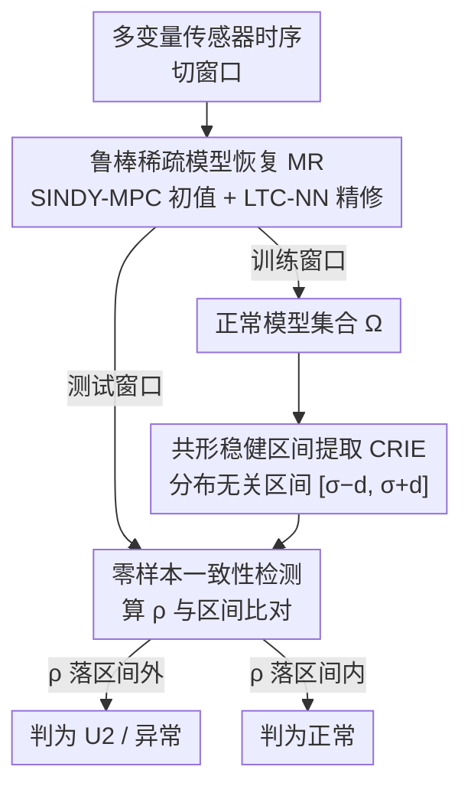

# Detection of Unknown Unknowns in Autonomous Systems

**会议**: ICLR2026  
**OpenReview**: [https://openreview.net/forum?id=GrsofC2FqF](https://openreview.net/forum?id=GrsofC2FqF)  
**代码**: https://github.com/ImpactLabASU/U2Recognition  
**领域**: 多变量时序异常检测 / 自主系统安全  
**关键词**: 未知未知(U2)、零样本异常检测、稀疏动力学建模、共形推断、自主系统

## 一句话总结
针对无人机/自动驾驶/自动给药等自主系统部署后才暴露的"未知未知"(unknown unknowns, U2)场景，本文指出这类风险**不会引起边缘分布漂移**、因此现有依赖"分布偏移"的多变量时序异常检测(MTAD)方法集体失效；作者提出 SPIE-AD，通过持续从信号中恢复底层稀疏动力学模型、再用共形推断判定模型是否偏离正常区间，实现真正零样本的 U2 检测，在 8 个 U2 基准与 6 个真实数据集上不靠任何作弊技巧就超过所有基线。

## 研究背景与动机
**领域现状**：无人机(UAV)、自动驾驶车(AC)、自动胰岛素给药(ADD)这类自主系统由感知、决策、执行多模块耦合而成，复杂到不可能在上线前穷举测试所有运行场景。那些被开发期忽略、却在部署期偶发的场景就是"未知未知"(U2)，是事故的主要诱因（如波音 MCAS 误触发、机翼升降舵卡死、传感器电磁攻击）。检测 U2 当前几乎只有图像域的零星方案，时序信号域几乎空白。

**现有痛点**：业界自然想到"直接复用现成的 MTAD 方法"。但本文揭示这条路走不通——主流 MTAD（ARIMA、Kalman、PCA、自编码器、LSTM、Anomaly Transformer、基础模型 OFA 等）都建立在一个隐含假设上：异常会带来**边缘分布的偏移**(out-of-distribution, OOD)，于是用训练数据学一个正常分布的高维隐空间表示，再用偏离程度打分。U2 偏偏不满足这个假设。

**核心矛盾**：U2 与传统异常有一个微妙但致命的区别。传统异常会让某个窗口的边缘分布 $P_t(x)$ 偏离全局 $P(x)$，但底层生成过程的动力学结构保持平稳；而 U2 恰好相反——它**不改变边缘分布**（KS 检验显示 U2 数据与正常数据无统计显著差异），但让变量之间的**函数依赖关系发生非平稳漂移**。换句话说，原始传感器读数里根本没有能区分正常/U2 的判别性特征，任何纯数据驱动的特征方法都无能为力。

更糟的是，本文还系统揭露 SOTA MTAD 报告的高分大量依赖两个不切实际的技巧：**点调整(point adjustment, PA)**——只要在一段连续异常里检对一个点，就把整段的漏报全部翻成命中，严重虚高精确率；**带数据泄露的阈值学习(threshold learning, TL)**——直接在测试集及其标签上调异常分阈值。本文证明：开了 PA+TL，连一个**完全不训练**的确定性算法都能打平甚至超过 SOTA；而一旦关掉 PA/TL，现有方法在 U2 基准上断崖式崩溃。

**本文目标**：在(i) U2 无分布偏移、(ii) 验证集没有任何异常/U2 样本（真零样本）、(iii) 不允许 PA 作弊 这三个现实约束下，做出可用的多变量 U2 检测。

**核心 idea**：既然 U2 藏在**变量间动力学关系**里而非数据分布里，那就别去建模数据分布，而是持续从信号反推底层的稀疏非线性动力学模型系数 $\omega$，再监测 $\omega$ 是否偏离"正常运行最可能模型"的稳健区间——用模型空间的偏移代替数据空间的偏移。

## 方法详解

### 整体框架
SPIE-AD（SParse model Identification Enhanced Anomaly Detection）把异常检测从"数据空间"搬到"模型空间"。系统假设传感器时序服从一个稀疏非线性动力学方程 $\dot{X}(t) = f(X(t), \omega, t)$，其中 $\omega$ 是定义该稀疏模型的少量系数。整个流程沿用经典异常检测的"训练/验证/评测"三段式，但每一段处理的对象都从原始信号换成了恢复出来的模型系数 $\omega$：

- **训练阶段**：把训练数据切成若干窗口，对每个窗口做鲁棒稀疏模型恢复(MR)，得到一组系数 $\omega_i$，汇成正常运行的模型集合 $\Omega$；
- **验证阶段**：用训练数据的另一部分（无需任何异常标注）跑共形稳健区间提取(CRIE)，得到正常运行的稳健度区间 $[\sigma-d, \sigma+d]$；
- **评测阶段**：对测试窗口持续做 MR 得到 $\omega$，算其相对 $\Omega$ 的稳健度 $\rho$，落在区间外即判 U2。

### 关键设计

**1. 把 U2 重新形式化为"动力学结构漂移"而非"分布偏移"**

这是全文的概念地基，决定了后面所有方法选择。作者给出两个并列定义：窗口 $W$ 是 **U2 事件**，当且仅当边缘分布不变 $P_t(x) \approx P(x)\ \forall t \in W$，但过程变得非平稳 $\omega(t) \neq \omega(t+\tau)$（系数随时间漂移）；而 $W$ 是**传统异常**，当且仅当出现局部边缘漂移 $P_t(x) \not\approx P(x)$，但底层过程保持平稳 $\omega(t) = \omega(t+\tau)$。这个定义把 U2 和异常在数学上彻底分开：前者是模型空间的事，后者是数据空间的事。作者用 KS 检验在 8 个数据集上实证——基准异常数据与正常数据的 CDF 差异高达 200+（$H=1$，统计显著），而 U2 数据与正常数据差异低到 0.4~2（$H=0$，不显著），但在 SINDY-MPC 挖出的**模型系数空间**里，U2 与正常的分布参数又出现了显著差异。正因为判别信号只活在模型空间，纯数据驱动的 MTAD 注定抓不到 U2。

**2. 鲁棒稀疏模型恢复（MR）：SINDY-MPC 打底、液态时间常数网络精修**

要在模型空间做文章，前提是能从**真实、带噪、低采样率**的信号里稳定恢复出 $\omega$。一个 $n$ 维、$M$ 阶非线性的系统总共有 $\binom{M+n}{n}$ 个候选非线性项，稀疏模型只保留极少数 $p \ll \binom{M+n}{n}$ 项。直接用 SINDY-MPC 这类 $L_2$ 稀疏回归在真实数据上会大幅退化：相邻两段窗口恢复出的 $\omega_i, \omega_j$ 方差很大，导致"噪声引起的系数波动"和"真 U2 引起的系数漂移"难以区分，假阳率失控。

作者的解法是用**液态时间常数神经网络(LTC-NN)** 做精修。流程是：先用 SINDY-MPC 给出初值 $\omega^{(0)}$；把窗口数据送进 $V$ 个 LTC-NN 单元组成的全连接网络，输出接一层 $\binom{M+n}{n}$ 节点、ReLU 激活的稠密层；关键技巧是**用 $\omega^{(0)}$ 的稀疏结构去 dropout 稠密层节点**（哪些项为 0 就丢哪些节点），并把第 $i$ 个节点输出**夹在 $[(1-\psi)\omega_i,\ (1+\psi)\omega_i]$ 区间内**（$\psi$ 是超参，把精修值锚定在 SINDY 初值附近不让它跑飞）。精修后的 $\omega_{est}$ 喂给 ODE45 求解器重构信号 $Y$，损失就是 $X$ 与 $Y$ 在所有维度/时间步上的均方误差 $\sum_t \|Y(t)-X(t)\|^2 < \epsilon$。LTC-NN 的连续时间隐变量节点天然适合刻画动力学，使恢复对噪声和低采样率更鲁棒——这正是 SPIE-ADL 在真实数据上明显胜过纯 SINDY 版 SPIE-ADS 的原因。

**3. 共形稳健区间提取（CRIE）：分布无关、零样本地刻画"正常模型"**

有了一组正常模型 $\Omega$，如何判定一个新模型 $\omega_v$ 算不算偏离？作者定义稳健度量 $\rho(\omega_v, \Omega) = \frac{1}{|\Omega|}\sum_{i=1}^{|\Omega|} \Omega_i^T \omega_v$，本质是新系数与正常模型集合的平均内积（投影一致性）。难点在于：U2 检测**没有任何异常/U2 验证样本**可用来定阈值，这就排除了 SOTA 普遍用的极值理论(EVT)+峰值过阈值——那需要假设底层分布、还往往偷偷拿测试集当验证集（数据泄露）。

CRIE 改用**共形推断**这一分布无关工具来定区间。把训练集划成互斥的两份 $I_T, I_V$：用 $I_T$ 的窗口恢复系数构成 $\Omega$，对每个 $\omega_i$ 算它对"留一后集合"的稳健度 $\rho(\omega_i, \Omega/\omega_i)$，取均值 $\sigma$；再从 $I_V$ 恢复 $\omega^v_j$，算残差 $\rho(\omega^v_j, \Omega) - \sigma$，升序排列，取第 $\lceil(|I_V|/2+1)(1-\alpha)\rceil$ 位作为半宽 $d$。论文借 Lei et al. 的定理证明：对任意新点，只要重构误差满足 $\|L(X_i,\omega_i)-X_i\|^2 \le \epsilon$，就有覆盖保证 $P(\rho(\omega_{m+1}^v, \Omega) \in [\sigma-d, \sigma+d]) \ge 1-\alpha$。$\alpha$ 是误覆盖率，直接控制区间宽度 $d$。整个过程只吃训练数据、不碰任何异常标签，从而绕开了数据泄露(违反 A2)和分布假设。

**4. 零样本一致性检测，以及揭露 PA/TL 的 AnomalySimpleton 评测**

检测算法本身很简洁：对测试数据滑窗，用 MR 恢复 $\omega_i$，按 $\rho$ 公式算稳健度，与 CRIE 区间 $[\sigma-d, \sigma+d]$ 比对，落区间外即判 U2。因为模型空间只保留了低维稀疏表示、熵更低，正常场景更易刻画，而 U2 让变量间关系失谐、$\rho$ 偏离被放大，所以**不开 PA 也能拿到高精确率**（直接回应 A3）。

为给评测立一面"照妖镜"，作者还提出 **AnomalySimpleton**——一个完全不训练的确定性算法：从训练数据选一个窗口 $W$，算其均值、标准差、偏度等统计量；对每个测试窗口算同样统计量，若偏离超过训练值的 $P\%$ 就判异常；$W$ 和 $P$ 通过在**测试集**上暴力搜索"两个最大可分簇"得到（即故意吃 PA+TL 的红利）。结果它能打平甚至超过 SOTA 学习方法——这就证明了 SOTA 的高分很大程度来自评测作弊，而非真本事，从而支撑本文"必须在 K=100（关 PA）、无异常验证集（关 TL）下重测"的主张。

### 损失函数 / 训练策略
MR 的训练目标是重构均方误差 $\sum_{t=1}^N \|Y(t)-X(t)\|^2 < \epsilon$，$Y$ 由精修系数 $\omega_{est}$ 经 ODE45 求解重构。超参（误覆盖率 $\alpha$、SMR 多项式阶数、稀疏度、窗口大小 $k$）全部**只在训练数据上**暴力搜索，目标是让稳健区间覆盖 $r > 80\%$ 的训练点同时最小化区间宽 $d$，逐应用单独调。实现上 SINDY-MPC 用原作者代码、LTC-NN 基于 Hasani 的开源版改写，CRIE 与检测算法用 Matlab 2022b。

## 实验关键数据

### 主实验
共 14 个数据集：6 个合成 U2（UAVEMA/UAVSimG/F8Stuck/F8Slow/AIDPhantom/AIDCartridge）、2 个真实 U2（Medtronic 给药管阻塞、EEG 癫痫发作）、3 个真实 MTAD（SMD/SMAP/MSL）、3 个大规模单变量（UCR/Yahoo/NAB）。所有方法都报告**带 PA(+)** 与 **不带 PA** 两种结果。

| 数据集 | 指标 | SPIE-ADL（无PA） | 最强基线（无PA） | 说明 |
|--------|------|------------------|------------------|------|
| F8Stuck (合成) | F1 | 92.0 | AT 80.3 | SPIE 精确率/召回双高，无需 PA |
| UAVSimG (合成) | F1 | 94.2 | GANF 64.3 | 基线关 PA 后崩到 60 多 |
| UAVEMA (合成) | F1 | 96.5 | GAT 36.0 | 差距最悬殊 |
| AIDCartridge (合成) | F1 | 91.5 | OFA 13.8 | 学习类方法几乎失效 |
| Medtronic (真实U2) | F1 | 70.0 | OFA 57.9 | 真实带噪数据上 LTC-NN 收益最大 |
| Epilepsy (真实U2) | F1 | 69.0 | iForest 33.1 | — |

关键对照：几乎所有基线在**去掉验证集标签**后精确率/召回直接掉到接近 0，说明它们根本无法做真零样本 MTAD；唯一的零样本基线 USAD 也严重依赖 PA+TL，关掉后远逊 SPIE-AD。

### 消融实验

| 配置 | 现象 | 说明 |
|------|------|------|
| SPIE-ADS（仅 SINDY-MPC） | 合成集上已接近 ADL | 合成数据噪声低，精修需求小 |
| SPIE-ADL（+LTC-NN 精修） | 真实集上明显领先 ADS | 真实带噪/低采样下鲁棒恢复才显价值 |
| 开 PA+TL 的 AnomalySimpleton | 打平/超过 SOTA 学习法 | 证明 SOTA 高分来自评测作弊 |
| 各基线去掉验证集标签 | 精确率/召回→近 0 | 现有 MTAD 无法真零样本化 |

### 关键发现
- **PA 是最大的"皇帝新衣"**：Anomaly Transformer 在带/不带 PA 之间 F1 落差最大；它在 F8Slow 上带 PA 拿到最高分，恰说明它"能检到 U2 但检得很晚"，靠 PA 把迟到的命中算成功。
- **LTC-NN 的价值随噪声涨**：合成数据上 ADS≈ADL，真实数据上 ADL 才拉开差距，印证鲁棒模型恢复是为真实低采样/高噪声场景设计的。
- **判别信号只在模型空间**：原始信号 KS 检验显示 U2 与正常无显著分布差异，但模型系数空间里差异显著——这是 SPIE-AD 能 work、而所有数据驱动 MTAD 不能 work 的根因。

## 亮点与洞察
- **问题再定义比方法更值钱**：把"U2 = 动力学结构漂移、边缘分布不变"讲清楚后，"为什么现有方法必然失效"和"为什么要建模而非建分布"一气呵成，是教科书级的问题切割。
- **戳破评测潜规则**：用一个不训练的 AnomalySimpleton + PA/TL 就能击败 SOTA，干净利落地证明了这个子领域的刷分泡沫，这种"反向 baseline"思路可迁移到任何怀疑评测注水的领域。
- **共形推断 + 稀疏动力学的组合**：用共形推断给"正常模型区间"上分布无关的覆盖保证，避免了 EVT 的分布假设和数据泄露，是把统计严谨性带进零样本异常检测的漂亮一招。
- **可迁移 trick**：用 SINDY 初值的稀疏掩码去 dropout 神经网络、再把输出夹在初值邻域内——这种"经典方法定结构、神经网络只做局部精修"的混合范式，可用于任何"想要神经网络但又怕它破坏可解释稀疏结构"的场景。

## 局限与展望
- **依赖系统可被稀疏动力学建模**：方法假设传感器时序服从稀疏非线性 ODE，对于没有清晰物理/生理动力学、或维度极高难以稀疏建模的系统，模型恢复可能失败。
- **超参逐应用暴力搜索**：$\alpha$、多项式阶数、稀疏度、窗口大小都要对每个应用从头暴力调，缺乏自适应机制，泛化到新系统时成本不低。
- **召回略逊于带 PA 的方法**：作者承认 SPIE-AD 会漏掉部分合法事件（recall 略低），对"宁可误报不可漏报"的安全攸关场景需要再权衡。
- **实现碎片化**：SINDY、LTC-NN、CRIE 分别用不同代码/Matlab 拼接，工程化与实时部署仍有距离；计算复杂度细节也被放到附录。

## 相关工作与启发
- **vs 传统/深度 MTAD（OmniAnomaly、Anomaly Transformer、GANF、GAT、OFA、LSTM、iForest 等）**：它们都在数据空间学正常分布、靠分布偏移打分，且普遍依赖 PA+TL；本文证明这套在无分布偏移的 U2 上系统失效，改在模型空间检测。
- **vs 零样本 MTAD（USAD）**：USAD 用自编码器做零样本，但仍报告带 PA/TL 的成绩、且依赖分布差异；SPIE-AD 不需要这些假设，真正零样本。
- **vs LLM/VLM 异常检测（Alnegheimish 的 LLM 单变量法、转图像走 VLM 的零样本法）**：前者局限单变量、难扩到多变量，后者需要信号转图像管线和大算力，在资源受限的自主/国防部署里不可用；SPIE-AD 直接在时序信号上工作。
- **vs 模型恢复方法（SINDY-MPC、PINN）**：它们解的是"恢复动力学模型"本身、在真实带噪数据上退化严重；本文用 LTC-NN 精修提升鲁棒性，并把模型恢复嵌进异常检测闭环。

## 评分
- 新颖性: ⭐⭐⭐⭐⭐ 把 U2 重定义为模型空间漂移、并把异常检测整体搬到模型空间，是范式级的重新切问题。
- 实验充分度: ⭐⭐⭐⭐ 14 个数据集、带/不带 PA 双报告、AnomalySimpleton 反向佐证，扎实；但部分对照与复杂度分析压在附录。
- 写作质量: ⭐⭐⭐⭐ 问题动机与失效分析(A0–A3)讲得极清晰；方法实现细节略碎、符号偏密。
- 价值: ⭐⭐⭐⭐⭐ 既给出可用的零样本 U2 检测器，又系统揭露了 MTAD 评测的刷分泡沫，对自主系统安全和领域评测规范都有实打实的推动。

<!-- RELATED:START -->

## 相关论文

- [\[ICLR 2026\] Learning Mixtures of Linear Dynamical Systems via Hybrid Tensor-EM Method](learning_mixtures_of_linear_dynamical_systems_via_hybrid_tensor-em_method.md)
- [\[ICML 2026\] Embedding Hybrid Systems into Continuous Latent Vector Fields](../../ICML2026/time_series/embedding_hybrid_systems_into_continuous_latent_vector_fields.md)
- [\[ICLR 2026\] Enabling Arbitrary Inference in Spatio-Temporal Dynamic Systems: A Physics-Inspired Perspective](enabling_arbitrary_inference_in_spatio-temporal_dynamic_systems_a_physics-inspir.md)
- [\[ICLR 2026\] Point-wise Anomaly Detection via Fold-bifurcation ODE](point-wise_anomaly_detection_via_fold-bifurcation_ode.md)
- [\[ICLR 2026\] EVEREST: A Transformer for Probabilistic Rare-Event Anomaly Detection with Evidential and Tail-Aware Uncertainty](everest_a_transformer_for_probabilistic_rare-event_anomaly_detection_with_eviden.md)

<!-- RELATED:END -->
