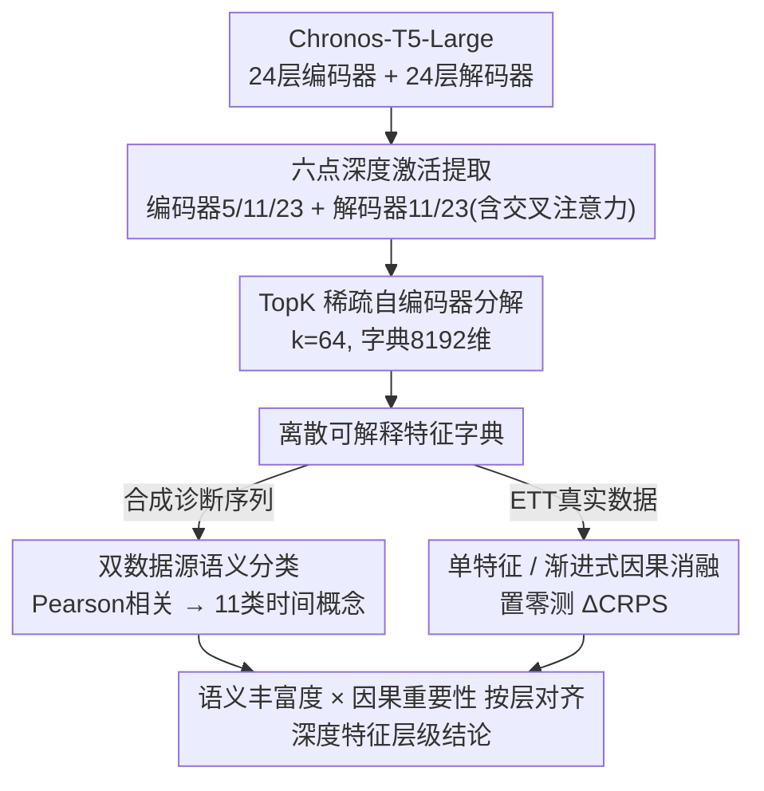

# Dissecting Chronos: Sparse Autoencoders Reveal Causal Feature Hierarchies in Time Series Foundation Models

**会议**: ICLR 2026  
**arXiv**: [2603.10071](https://arxiv.org/abs/2603.10071)  
**代码**: 未开源  
**领域**: 时间序列 / 可解释性  
**关键词**: Sparse Autoencoder, Time Series Foundation Model, mechanistic interpretability, Chronos-T5, Causal Ablation, Feature Hierarchy

## 一句话总结

首次将稀疏自编码器 (SAE) 应用于时间序列基础模型 Chronos-T5-Large，通过 392 次因果消融实验揭示了深度依赖的特征层级：中层编码器集中了因果关键的突变检测特征，而语义最丰富的末层编码器反而因果重要性最低。

## 研究背景与动机

**时间序列基础模型兴起但内部不透明**：Chronos-T5、TimesFM、MOMENT、Moirai 等模型在零样本预测中表现优异，但其内部表征完全未被从机制层面审视过。

**NLP 领域机制可解释性已成熟**：SAE 已成功分解语言模型的稠密叠加激活为可解释特征（Bricken et al., 2023; Templeton et al., 2024），电路分析识别了可解释的计算子图。

**时间序列可解释性仍停留在事后方法**：现有工作依赖显著性图、扰动解释、反事实方法和概念框架，仅有 Kalnāre et al. (2025) 对小型分类器做过初步机制分析，尚无人研究基础模型。

**Chronos-T5 架构适合 SAE 分析**：T5 架构成熟、SAE 训练协议完善、Chronos 的离散化 tokenization（4096 bins）提供了天然的分析单元。

**高风险领域部署需要可信解释**：时间序列模型越来越多地部署在金融、医疗等高风险场景，理解其内部机制对信任建设至关重要。

**核心假设待验证**：SAE 学到的特征是否具备因果相关性？不同层的特征是否存在层级结构？语义丰富度与因果重要性是否一致？

## 方法详解

### 整体框架

整套分析的目标是把 Chronos-T5-Large（710M 参数，24 层编码器 + 24 层解码器，$d_{\text{model}}=1024$）内部稠密、叠加的激活拆成可读懂的特征，再追问这些特征到底对预测有没有因果作用。流程分四步衔接：先在模型 6 个深度位置挂前向钩子收集激活，在每个位置各训一个 TopK 稀疏自编码器把激活分解成离散特征；随后兵分两路——一路用一批属性完全已知的合成诊断序列给每个特征贴上时间概念标签，量化"语义丰富度"；另一路回到 ETT 真实数据上逐个把特征置零、观测预测误差怎么变，量化"因果重要性"。最后把这两条线索按层对齐，得到深度依赖的特征层级。

### 关键设计

**1. 六点层级激活提取：覆盖从编码到生成的完整深度剖面**

要验证"不同深度的层是否承担不同功能"这个核心问题，就得在模型多个深度同时取样。作者用前向钩子在编码器第 5、11、23 层（早、中、后三个代表深度）以及解码器第 11 层（同时取残差流和交叉注意力输出）、第 23 层共 6 个位置抓取激活。这样从输入编码一路到预测生成的处理流水线都被覆盖，后续才能在同一套分析方法下比较浅层、中层、末层得到的特征分布与因果强度有何系统性差异——这正是"深度特征层级"这一核心结论能成立的前提。

**2. TopK 稀疏自编码器：把叠加的稠密激活拆成离散可读特征**

上一步取出的残差流激活是高度叠加的，单个神经元同时参与多种概念，无法直接解读。作者在每个提取点各训一个 SAE：给定激活 $\mathbf{x} \in \mathbb{R}^{d_{\text{model}}}$，编码端算出

$$\mathbf{z} = \text{TopK}(\mathbf{W}_{\text{enc}}(\mathbf{x} - \mathbf{b}_{\text{dec}}) + \mathbf{b}_{\text{enc}},\; k)$$

只保留 $k=64$ 个最大激活值、其余强制为零，再用 $\hat{\mathbf{x}} = \mathbf{W}_{\text{dec}}\mathbf{z} + \mathbf{b}_{\text{dec}}$ 重构。相比 L1 正则，TopK 能硬性、直接地控制每个 token 激活几个特征，避免稀疏度随正则权重漂移；字典维度放大到 $d_{\text{sae}} = 8 \times d_{\text{model}} = 8192$，给叠加特征留足分解容量，再配合对死特征的定期重采样保证字典被充分利用。

**3. 双数据源语义分类：用合成 ground-truth 给特征贴时间概念标签**

SAE 拆出的特征本身只是向量，需要可解释的语义才能讨论"语义丰富度"。真实数据上人工标注属性既模糊又昂贵，作者改用一批属性完全已知的合成诊断序列（含趋势、季节性、突变、频率扫描、异方差噪声等），对每个 SAE 特征计算其激活模式与各诊断类别真值属性之间的 Pearson 相关系数，取最大相关对应的类别作为标签，最大相关仍低于阈值的特征则标为 unknown。最终用一套覆盖趋势（trend_up/down）、季节性、突变（level_shift_up/down）、频率高低、波动率高低、噪声的 11 类时间概念来刻画每层学到了什么。

**4. 单特征与渐进式因果消融：把"语义相关"上升为"因果依赖"**

特征和某个概念相关，不等于模型预测真的依赖它，因果性必须靠干预来确认。单特征消融把某个特征 $j$ 的稀疏编码置零（$z_j \leftarrow 0$），解码回原激活并 patch 进前向传播，再测预测误差变化 $\Delta\text{CRPS}_j = \text{CRPS}_{\text{ablated}} - \text{CRPS}_{\text{original}}$，正值说明该特征确实携带了预测所需信息。渐进式消融则按解码器范数贡献从大到小排序，累积移除 $1, 2, 4, \ldots, 64$ 个特征，观察各层在"被逐步掏空"时误差上升的速度，从而区分某层的特征是彼此冗余还是不可替代——这一步正是后文中层编码器消融后灾难性退化、末层消融后误差反而下降这两个反直觉结论的来源。

### 损失函数 / 训练策略

SAE 以 MSE 重构损失训练 50,000 步，用 Adam 优化器（学习率 $3 \times 10^{-4}$、余弦衰减）。因果消融统一在 ETT 基准上做，采用 256 个上下文窗口、预测长度 64、每次 4 个预测采样的快速配置；针对结论最反直觉的末层编码器，额外用 1024 窗口、8 采样、200 特征的扩展配置复核，确认趋势不是采样噪声造成的。

## 实验关键数据

### 表1：单特征消融汇总

| 层 | 特征数 | 均值 $\Delta$CRPS | 中位数 | 最大值 | 正比例 | 最大/中位 |
|---|---|---|---|---|---|---|
| 编码器 Block 5 | 64 | 3.05 | 0.95 | 26.32 | 100% | 27.7× |
| 编码器 Block 11 | 64 | 5.15 | 1.26 | 38.61 | 100% | 30.5× |
| 编码器 Block 23 | 64 | 3.73 | 2.98 | 11.65 | 100% | 3.9× |
| 编码器 Block 23† | 200 | 2.37 | 2.37 | 2.44 | 100% | 1.03× |

所有 392 次消融均产生正 $\Delta$CRPS，证实每个特征都具有因果相关性。中层编码器（Block 11）因果影响最大（最大 $\Delta$CRPS=38.61），分布极度右偏。

### 表2：各层特征分类分布（部分）

| 概念 | Enc 5 | Enc 11 | Enc 23 |
|---|---|---|---|
| 季节性 | 12 | 45 | **1,439** |
| 突变↑ | 66 | **1,024** | 1,097 |
| 高频 | 97 | 91 | **668** |
| 噪声 | 32 | **413** | 315 |
| 标注率 | 4.9% | 25.8% | **59.8%** |

末层编码器语义最丰富（59.8% 标注率），但中层编码器集中了突变检测特征（1024 个 level_shift_up）。

### 渐进消融关键发现

- **Block 11**：CRPS 从 2.61 急剧升至 25.32（灾难性退化）
- **Block 5**：CRPS 从 7.05 升至 21.54
- **Block 23**：CRPS 从 3.62 **降至** 2.73（反而改善 0.89），扩展实验确认趋势稳定

## 亮点

1. **首创性**：首次将 SAE 应用于时间序列基础模型，成功从 NLP 迁移机制可解释性方法论
2. **揭示反直觉规律**：因果重要性与语义丰富度呈逆相关——中层编码器因果最关键但语义稀疏，末层语义最丰富但消融后反而改善
3. **100% 因果验证率**：392 次消融全部产生正 CRPS 退化，有力证明 SAE 特征的因果相关性
4. **发现突变检测为核心机制**：Chronos-T5 依赖突变动态检测而非周期模式识别，对模型理解和改进有指导意义
5. **末层消融悖论的解释合理**：末层可能编码了跨域泛化特征，在特定数据集上消融等价于隐式域适应

## 局限性

1. **数据集单一**：因果消融仅在 ETT 数据上进行，结论是否泛化到其他时间序列领域未知
2. **分类器覆盖率低**：82.8% 的特征未获标签，解码器端覆盖率不足 6%，特征分类法仍较粗糙
3. **仅分析一个模型**：只研究了 Chronos-T5-Large，未做跨架构（TimesFM、MOMENT）对比
4. **消融配置统计精度有限**：快速配置（256 窗口、4 采样）仅提供方向性结论，定量精度不够
5. **缺乏电路级分析**：仅做特征级消融，未深入特征间的连接关系和计算图结构

## 相关工作

- **时间序列基础模型**：Chronos-T5（Ansari et al., 2024）、TimesFM（Das et al., 2024）、MOMENT（Goswami et al., 2024）、Moirai（Woo et al., 2024）
- **SAE 与机制可解释性**：Bricken et al. (2023) 首次用 SAE 分解语言模型；Cunningham et al. (2024) 提出 TopK SAE；Templeton et al. (2024) 将 SAE 扩展到 Claude 3 Sonnet
- **时间序列可解释性**：显著性图（Zhao et al., 2023）、扰动解释（Enguehard, 2023; Liu et al., 2024）、反事实（Yan & Wang, 2023）、概念框架（van Sprang et al., 2024）
- **时间序列机制分析**：Kalnāre et al. (2025) 对小型分类器做了初步机制分析，本文首次拓展到基础模型

## 评分

- 新颖性: ⭐⭐⭐⭐ — 首次将 SAE 方法论从 NLP 迁移到时间序列基础模型，开创性工作
- 实验充分度: ⭐⭐⭐ — 392 次消融有力但仅限 ETT 数据、单一模型、分类覆盖率待提升
- 写作质量: ⭐⭐⭐⭐ — 结构清晰，反直觉发现阐述充分，图表设计合理
- 价值: ⭐⭐⭐⭐ — 为时间序列模型的机制可解释性开辟新方向，发现对模型设计和压缩有指导意义

<!-- RELATED:START -->

## 相关论文

- [\[ICLR 2026\] FeDaL: Federated Dataset Learning for General Time Series Foundation Models](fedal_federated_dataset_learning_for_general_time_series_foundation_models.md)
- [\[ICLR 2026\] Online Time Series Prediction Using Feature Adjustment](online_time_series_prediction_using_feature_adjustment.md)
- [\[ICLR 2026\] Adapt Data to Model: Adaptive Transformation Optimization for Domain-shared Time Series Foundation Models](adapt_data_to_model_adaptive_transformation_optimization_for_domain-shared_time_.md)
- [\[ICLR 2026\] Relational Feature Caching for Accelerating Diffusion Transformers](relational_feature_caching_for_accelerating_diffusion_transformers.md)
- [\[ICLR 2026\] Complexity- and Statistics-Guided Anomaly Detection in Time Series Foundation Models](complexity-_and_statistics-guided_anomaly_detection_in_time_series_foundation_mo.md)

<!-- RELATED:END -->
