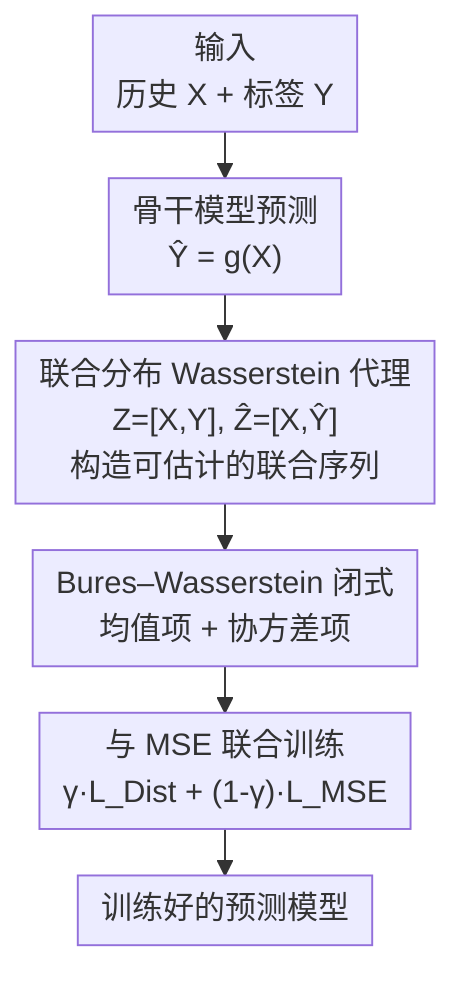

# DistDF: Time-series Forecasting Needs Joint-distribution Wasserstein Alignment

**会议**: ICLR2026  
**OpenReview**: [https://openreview.net/forum?id=VrdLwUmzBy](https://openreview.net/forum?id=VrdLwUmzBy)  
**代码**: https://github.com/Master-PLC/DistDF  
**领域**: 时序预测 / 学习目标设计  
**关键词**: 时序预测, 学习目标, 自相关偏差, Wasserstein 距离, 分布对齐

## 一句话总结
针对时序预测中 MSE 损失在标签序列存在自相关时会产生"自相关偏差"的根本问题，DistDF 不再去估计条件似然，而是把预测序列和标签序列的**条件分布**直接对齐——用可证明上界的"联合分布 Wasserstein 距离"作为代理目标，配合 Gaussian 假设下的 Bures–Wasserstein 闭式解，作为即插即用的正则项叠加在 MSE 上，在多个数据集和多个骨干模型上稳定刷出最优。

## 研究背景与动机

**领域现状**：深度时序预测的研究分两条腿——一条是设计网络结构（Transformer、线性模型、GNN 等）去建模历史序列里的自相关，另一条是设计训练用的学习目标。前者被研究得很透，后者长期被忽视：绝大多数模型直接用 MSE 当损失，把多步预测当成对每个未来时刻独立做点对点回归（即标准的 Direct Forecast，DF）。

**现有痛点**：MSE 本质上是在估计标签序列的条件负对数似然，但它隐含假设"未来各步相互独立"。真实标签序列 $y$ 存在强自相关——$y_t$ 依赖于 $y_{<t}$，于是 MSE 估出来的似然是**有偏的**。作者把这个偏差形式化为定理 3.1：

$$\text{Bias} = \|y_{|x}-\hat y_{|x}\|^2_{\Sigma^{-1}_{|x}} - \|y_{|x}-\hat y_{|x}\|^2_2$$

其中 $\Sigma_{|x}$ 是给定历史 $x$ 时标签的条件协方差。只有当 $\Sigma_{|x}$ 恰好是单位阵（即标签条件无关）时偏差才消失，而真实数据远非如此。

**核心矛盾**：已有的修补方案（FreDF 用傅里叶变换、Time-o1 用主成分分析）试图先把标签转换成"去相关分量"再做逐点 MSE。但它们只能保证**边缘去相关**（对角的 $\Sigma$），而消除偏差需要的是**条件去相关**（对角的 $\Sigma_{|x}$）——两者并不等价。作者在 Traffic 数据上实测：原始标签条件相关矩阵有超过 50.3% 的非对角元素绝对值超过 0.1，而 FreDF / Time-o1 转换后的分量虽然非对角值变小，残余相关依然显著。所以偏差被压低但没被消除，基于似然的路线被这个偏差从根上卡住。

**本文目标**：绕开"估计似然"这条注定有偏的路，换成"直接对齐两个条件分布" $P_{\hat y|x}$ 与 $P_{y|x}$。

**切入角度**：对齐两个分布不一定要算似然——只要最小化它们之间的某种分布距离即可。但条件分布的距离在有限时序观测下几乎无法估计：对任意一个 $x$，数据集通常只给一条标签 $y$，模型也只输出一条 $\hat y$，每个条件分布的经验样本只有一个点，距离退化为无意义。

**核心 idea**：用**联合分布** $W_p(P_{x,y}, P_{x,\hat y})$ 当代理——它可证明地**上界**了我们真正关心的期望条件分布距离（Lemma 3.3），却能从整个数据集采到足够多样本来稳定估计；再在 Gaussian 假设下把它化成 Bures–Wasserstein 闭式解，可微、可与梯度下降无缝结合。

## 方法详解

### 整体框架

DistDF 不改模型结构，只换训练目标，是一个 model-agnostic 的即插即用损失。给定一个 batch 的历史序列 $X\in\mathbb{R}^{B\times H}$ 和标签 $Y\in\mathbb{R}^{B\times T}$，先用任意骨干预测模型 $g$ 算出预测 $\hat Y=g(X)$。关键操作是把历史分别和"真标签 / 预测"在时间轴上拼接，得到两条**联合序列** $Z=[X,Y]$ 与 $\hat Z=[X,\hat Y]$；之所以要带上历史 $X$，正是因为单独的条件分布估不出来，而联合分布能从全数据集采样估计，且它上界了条件距离。接着计算两条联合序列的一阶、二阶统计量（均值向量与协方差矩阵），用 Bures–Wasserstein 度量算出分布距离 $L_{\text{Dist}}$。但纯矩匹配丢掉了"第 $i$ 条历史对应第 $i$ 条标签"的逐样本对应信息，而这对预测训练至关重要，所以 DistDF 把 $L_{\text{Dist}}$ 当正则项叠加到保留逐元素对应的 MSE 上，用权重 $\gamma$ 调和：$L_{\text{DistDF}}=\gamma\cdot L_{\text{Dist}}+(1-\gamma)\cdot L_{\text{MSE}}$。

### 关键设计

**1. 揭示并形式化"自相关偏差"：把痛点钉死在理论上**

DistDF 的出发点不是又造一个 loss，而是先证明现有 loss 错在哪。作者把训练目标重新定位为"对齐 $P_{\hat y|x}$ 与 $P_{y|x}$"，并指出 MSE 实质是在估计标签的条件负对数似然，但它把未来各步当独立处理，忽略了 $y_t$ 对 $y_{<t}$ 的依赖。定理 3.1 给出偏差的精确表达 $\text{Bias}=\|y_{|x}-\hat y_{|x}\|^2_{\Sigma^{-1}_{|x}}-\|y_{|x}-\hat y_{|x}\|^2_2$，并指出它只在 $\Sigma_{|x}=I$ 时才为零。更狠的是，作者顺手把 FreDF / Time-o1 这类"先去相关再 MSE"的方法也证伪了：傅里叶变换和 PCA 只能做到边缘去相关（对角 $\Sigma$），而真正需要的是条件去相关（对角 $\Sigma_{|x}$），两者不等价，所以这些方法的偏差只是被削弱、没被根除。这一节的价值在于把"为什么要换路线"讲成一个有定理支撑的硬结论，而不是经验上的"MSE 不够好"。

**2. 联合分布 Wasserstein 代理：用可估计的上界绕开条件分布估不出来的死结**

直接最小化条件分布距离 $W_p(P_{y|x},P_{\hat y|x})$ 是最理想的，但每个 $x$ 下只有单一样本，经验距离退化。作者引入联合分布 Wasserstein 距离 $W_p(P_{x,y},P_{x,\hat y})$ 作为代理，它有两个关键性质。其一是 Lemma 3.3 给出的上界关系：

$$\int W_p(P_{y|x},P_{\hat y|x})\,dP(x)\le W_p(P_{x,y},P_{x,\hat y})$$

即最小化联合距离会顺带压低我们真正关心的期望条件距离（$p=1$ 或条件项关于 $x$ 为常数时取等）。其二是 Theorem 3.4 的对齐保证：当联合距离被压到 0，则 $P_{y|x}=P_{\hat y|x}$ 严格成立——也就是无偏对齐。之所以选 Wasserstein 而非 KL / MMD，是因为它来自最优传输理论、度量"把一个分布搬成另一个的最小代价"，理论性质扎实且经验有效。这个代理的妙处在于：联合分布能从整个数据集构造经验集 $S_{x,y}, S_{x,\hat y}$，样本充足、估计可靠，把"条件分布只有一个样本"的困境一举化解。

**3. Bures–Wasserstein 闭式解：在 Gaussian 假设下把距离变成可微的矩匹配**

光有代理还不够，得能高效算、能反传。作者对联合分布作 Gaussian 假设 $P_{x,y}\sim\mathcal N(\mu_{x,y},\Sigma_{x,y})$，于是平方 $W_2$ 距离化为 Bures–Wasserstein 闭式（Lemma 3.5）：

$$\text{BW}=\|\mu_{x,y}-\mu_{x,\hat y}\|^2_2+\text{Tr}\!\Big(\Sigma_{x,y}+\Sigma_{x,\hat y}-2\big(\Sigma_{x,y}^{1/2}\Sigma_{x,\hat y}\Sigma_{x,y}^{1/2}\big)^{1/2}\Big)$$

它干净地拆成两块：**均值对齐项**（拉近两个联合分布的一阶矩）和**协方差对齐项** $B(\cdot)$（拉近二阶矩）。整个表达式只涉及均值、协方差和矩阵平方根，全程可微，直接接进梯度优化。这一步把"分布对齐"这种抽象目标落地成 batch 内统计量的匹配，是 DistDF 能真正跑起来的工程关键。和域适应里用 Wasserstein 对齐输入边缘分布不同，这里对齐的是模型输出与标签的条件分布，属于多任务监督学习里的一种新用法。

**4. 与 MSE 联合训练：用 $\gamma$ 找回被矩匹配丢掉的逐样本对应**

基于矩的 $L_{\text{Dist}}$ 只看分布层面的均值和协方差，会丢掉"第 $i$ 条历史配第 $i$ 条标签"的逐样本对应——而这对训练预测模型恰恰不可或缺（否则模型只需让输出分布在统计上像标签，不必让每条预测对上自己的真值）。所以 DistDF 不单独用分布距离，而是把它当正则项叠在 MSE 上：$L_{\text{DistDF}}=\gamma\cdot L_{\text{Dist}}+(1-\gamma)\cdot L_{\text{MSE}}$，$0\le\gamma\le1$。MSE 负责保住逐元素对应、提供强监督信号，$L_{\text{Dist}}$ 负责消除自相关偏差、对齐条件分布，两者互补。这也让 DistDF 保留了标准 DF 框架的推理高效、多任务能力等优点，并天然 model-agnostic、即插即用。

### 损失函数 / 训练策略
最终目标即 $L_{\text{DistDF}}=\gamma L_{\text{Dist}}+(1-\gamma)L_{\text{MSE}}$。集成到不同骨干时保留各自的基准超参，只调 $\gamma\in(0,1]$ 和学习率 $\eta\in[5\times10^{-5},10^{-3}]$（调学习率是因为分布距离项的尺度和梯度动态随数据集变化）。优化器 Adam，验证损失连续三个 epoch 不降则早停。

## 实验关键数据

### 主实验
以 TimeBridge 和 Fredformer 两个骨干为测试台，对比多种训练目标（averaged over T=96/192/336/720）：

| 模型/数据集 | 指标 | DistDF | Time-o1 | FreDF | Dilate | DF(MSE) |
|------|------|--------|---------|-------|--------|---------|
| TimeBridge·ETTh1 | MSE | **0.434** | 0.439 | 0.439 | 0.464 | 0.442 |
| TimeBridge·Weather | MSE | **0.248** | 0.250 | 0.254 | 0.252 | 0.252 |
| Fredformer·ECL | MSE | **0.173** | 0.178 | 0.179 | 0.187 | 0.191 |
| Fredformer·ETTh1 | MSE | **0.430** | 0.431 | 0.438 | 0.453 | 0.447 |

DistDF 在所有考察的骨干×数据集组合里都拿到最低 MSE。可以看出：朴素 MSE（DF）最差（在 Fredformer 的 ECL/Weather 上垫底）；形状对齐目标（Dilate / Soft-DTW）只靠启发式几何匹配、无无偏保证，改善有限；似然类目标（FreDF / Time-o1）因削弱了自相关偏差而是次优中的最强，但仍没根除偏差，被 DistDF 反超。

### 消融实验
拆解 Bures–Wasserstein 的两个分量——均值对齐 ($\mu$) 与协方差对齐 ($\Sigma$)，在 DF 上逐个加（averaged MSE）：

| 配置 | Align μ | Align Σ | ETTm1 | ETTh1 | ECL | Weather |
|------|---------|---------|-------|-------|-----|---------|
| DF | ✗ | ✗ | 0.387 | 0.447 | 0.176 | 0.252 |
| DistDF† | ✓ | ✗ | 0.381 | 0.435 | 0.175 | 0.251 |
| DistDF‡ | ✗ | ✓ | 0.386 | 0.439 | 0.174 | 0.251 |
| DistDF | ✓ | ✓ | **0.379** | **0.430** | **0.172** | **0.248** |

单独加均值对齐或协方差对齐都能稳定优于 DF，二者合并取得协同增益、效果最佳，验证了"一阶 + 二阶矩同时对齐"才是完整的条件分布匹配。

### 关键发现
- **距离度量选择**（Table 3）：把代理换成 EMD / MMD / KL 等都能优于 MSE，证明"训练时引入分布对齐"本身就有效；而联合分布 Wasserstein 在 16 个组合里有 14 个最优，说明它最可靠。
- **泛化性**：DistDF 套在 iTransformer、Fredformer、FreTS、TimeBridge 等多个骨干上均稳定提升，ECL 上 iTransformer 降 2.7%、Fredformer 降 4.3%，体现即插即用的通用性。
- **超参敏感性**：在很宽的 $\gamma$ 区间内性能稳定，不需精细调参。
- **定性**：可视化显示 DF 只抓住整体趋势、对 step 100~200 间的快速变化跟不住，DistDF 能更精确地刻画这些细粒度的剧烈变化。

## 亮点与洞察
- **先证伪再立论**：DistDF 最让人"啊哈"的是它不止提一个新 loss，而是用定理把 MSE 乃至 FreDF/Time-o1 这一整条"去相关 + MSE"路线的偏差讲死——边缘去相关 ≠ 条件去相关，这个区分是全文的理论支点，也解释了为什么前人方法只能改善不能根治。
- **上界换可估计**：直接对齐条件分布因单样本而不可行，转而对齐"可证明上界它"的联合分布，是典型的"把难估的量换成可估且单调相关的代理"的思路，可迁移到任何"条件分布对齐但样本稀疏"的任务（如条件生成、个性化预测）。
- **矩匹配 + 逐点损失互补**：意识到纯分布距离会丢逐样本对应、必须和 MSE 配着用，这个工程洞察避免了"分布对了但每条预测都没对上"的陷阱，是方法能真正 work 的细节。

## 局限与展望
- **Gaussian 假设**：Bures–Wasserstein 闭式依赖联合分布服从 Gaussian，对强非高斯、重尾或多峰的真实序列可能不够贴合，作者未深入讨论偏离高斯时的退化情况。
- **仍需 MSE 兜底**：分布距离不能单独用，必须叠在 MSE 上并调 $\gamma$，说明它本身不构成完整监督信号；$\gamma$ 与学习率仍需按数据集调。
- **batch 级统计量**：均值/协方差按 batch 估计，小 batch 下二阶矩估计噪声可能较大，协方差矩阵平方根的计算成本也随预测长度增长。
- **评测范围**：实验集中在 ETT/ECL/Weather 等标准基准，更长视野、更高维或非平稳极端场景下的稳健性有待进一步验证。

## 相关工作与启发
- **vs MSE / 标准 DF**：DF 逐点回归、忽略标签自相关导致似然估计有偏；DistDF 改为对齐条件分布，理论上无偏，是对"学习目标"而非"网络结构"的改进。
- **vs FreDF / Time-o1**：它们走"先去相关分量再 MSE"，但傅里叶 / PCA 只保证边缘去相关、条件偏差仍在；DistDF 直接在分布层面对齐，跳过似然估计，从而真正消除偏差。
- **vs Dilate / Soft-DTW**：形状对齐类目标靠启发式几何匹配，缺乏无偏性保证；DistDF 有 Theorem 3.4 的对齐保证。
- **vs 域适应中的 Wasserstein 对齐**：域适应对齐的是输入的边缘分布以提升跨域泛化；DistDF 对齐的是模型输出与标签的条件分布，属于多任务监督学习里的新用法。

## 评分
- 新颖性: ⭐⭐⭐⭐⭐ 把时序训练目标重构为条件分布对齐，并用"联合分布上界 + Bures–Wasserstein 闭式"破解单样本估计难题，理论与方法都新。
- 实验充分度: ⭐⭐⭐⭐ 覆盖多骨干、多数据集、多距离度量、消融与敏感性，但数据集仍以标准小基准为主。
- 写作质量: ⭐⭐⭐⭐⭐ 从定理证伪到方法构造逻辑链清晰，定理/引理层层递进。
- 价值: ⭐⭐⭐⭐⭐ model-agnostic 即插即用、稳定提升，对"该如何设计时序预测损失"给出有理论支撑的新答案。

<!-- RELATED:START -->

## 相关论文

- [\[ICLR 2026\] Bridging Past and Future: Distribution-Aware Alignment for Time Series Forecasting](bridging_past_and_future_distribution-aware_alignment_for_time_series_forecastin.md)
- [\[NeurIPS 2025\] Time-O1: Time-Series Forecasting Needs Transformed Label Alignment](../../NeurIPS2025/time_series/time-o1_time-series_forecasting_needs_transformed_label_alignment.md)
- [\[ICLR 2026\] Quadratic Direct Forecast for Training Multi-Step Time-Series Forecast Models](quadratic_direct_forecast_for_training_multi-step_time-series_forecast_models.md)
- [\[ICLR 2026\] JAPAN: Joint Adaptive Prediction Areas with Normalising-Flows](japan_joint_adaptive_prediction_areas_with_normalising_flow.md)
- [\[ICLR 2026\] COSA: Context-aware Output-Space Adapter for Test-Time Adaptation in Time Series Forecasting](cosa_context-aware_output-space_adapter_for_test-time_adaptation_in_time_series_.md)

<!-- RELATED:END -->
