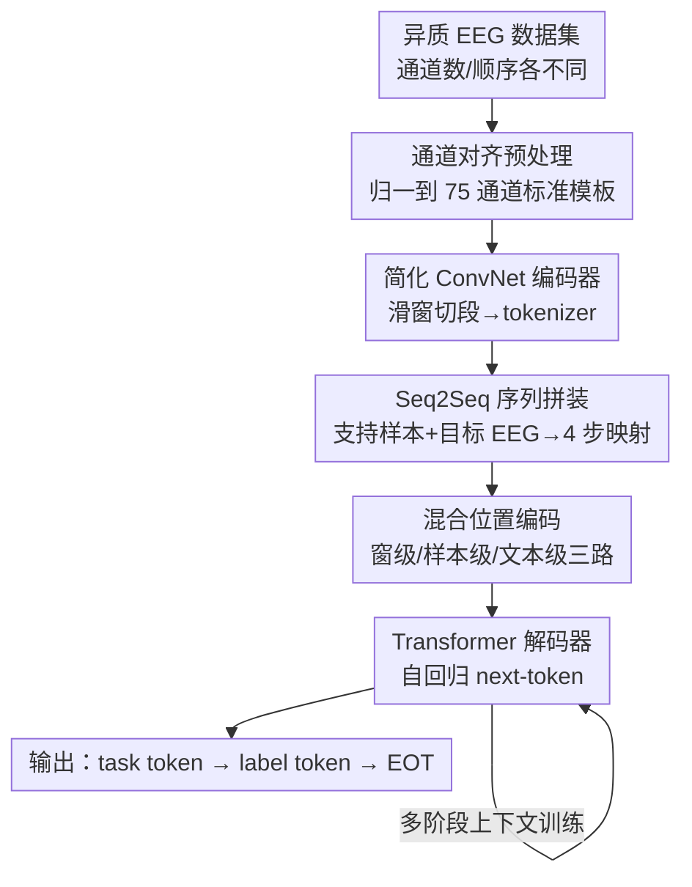

# ECHO: Toward Contextual Seq2Seq Paradigms in Large EEG Models

**会议**: ICLR2026  
**OpenReview**: [https://openreview.net/forum?id=ClLQ6cLkoR](https://openreview.net/forum?id=ClLQ6cLkoR)  
**代码**: 待确认  
**领域**: 时间序列 / 脑电大模型 / 上下文学习  
**关键词**: 大型 EEG 模型, decoder-centric, seq2seq, in-context learning, 多任务泛化

## 一句话总结
ECHO 把脑电（EEG）建模从"编码器学表征 + 轻量分类头打标签"翻转为"以解码器为中心的序列到序列生成"，用一串支持样本充当上下文示例，让一个统一模型在不微调的情况下，自动判别任务类型并预测标签，从而在多任务设定下超过各自专精的单任务大型 EEG 模型。

## 研究背景与动机
**领域现状**：脑电因为便携、便宜，是最常用的神经记录手段，被广泛用于情绪识别、运动想象、认知负荷评估等异质任务。顺着大模型潮流，研究者提出了一系列大型 EEG 模型（Large EEG Models, LEMs），它们的共同套路是：用大规模无标注 EEG 做自监督预训练（掩码重建、对比预测），训练一个强大的**编码器**，得到可迁移的通用表征。

**现有痛点**：这些模型只把劲使在了编码器上，**没有配一个能力匹配的解码器**。下游用的往往是一个比编码器小好几个数量级的轻量分类头，再加一轮微调。这意味着模型能不能做对下游任务，取决于编码器肯不肯在微调时"扭曲"自己的表征去迁就这个孱弱的解码头。这种向小规模下游数据的适配天然高风险：一方面编码器可能为迁就解码器而牺牲预训练学到的通用知识，发生知识遗忘、泛化退化；另一方面解码器本身信息抽取能力不足时，对有限标注的依赖会放大训练不确定性，让模型对噪声敏感。

**核心矛盾**：当前范式被**解码器瓶颈**卡住了，编码器学到的泛化潜力释放不出来。一条折中路线是把 LLM 当解码器，但它并没有跳出"EEG→标签"这个映射，只是把映射搬进了文本嵌入空间——需要把 EEG token 和标签都投影到共享文本空间，在文本提示约束下做映射。问题是语言模型的归纳偏置无法可靠迁移到 EEG：EEG 依赖关键时间动态的精确定位，与文本/图像那种静态语义模式根本对不齐，硬投进文本空间往往让模型去钻浅层相关（把噪声模式映到语义标签），真正的任务相关信息反而被稀释甚至污染。文本最终只是个"替身标签空间"，并没有把 LLM 的推理和上下文学习（ICL）能力带给 LEM。

**本文目标**：提出一个**以解码器为中心**的范式，让 LEM 在一个统一框架里同时建模多任务 EEG，并把离散样本当作上下文支持，从而既保住任务判别力、又获得 ICL 能力。

**切入角度**：把 EEG 建模重新表述成**序列到序列（Seq2Seq）**学习——输入是一条由"目标 EEG 样本 + 若干支持 EEG 样本及其任务/标签 token"拼成的序列，模型做下一个 token 预测，从支持样本里建立的映射关系出发，推断目标样本的任务与标签。

**核心 idea**：用"序列空间里的多重映射建模"代替"EEG→标签"的单一映射——让解码器（而非编码器）成为主角，用支持样本搭出上下文线索，在一次解码里完成多任务学习与 in-context 适应。

## 方法详解

### 整体框架
ECHO 的输入是一条结构化序列：起始符 `<|SOT|>` 之后跟着若干**支持样本**（每个支持样本 = 一段 EEG token + 它的任务 token + 标签 token），再接**目标 EEG** token；模型自回归地生成输出序列——先吐出目标样本的任务 token `<|task|>`（如 `<|MI|>`、`<|EMO|>`），再在任务条件下吐出标签 token `<|y|>`，最后用结束符 `<|EOT|>` 收尾。整条流水线只用现成、简单的组件（一个简化版 deep ConvNet 编码器 + 标准 Transformer 解码器），目的是把功劳归给**范式转变本身**而非架构花活。

把异质数据集统一记为 $D=(X,Y,t)$：$X\in\mathbb{R}^{N\times T\times C}$ 是 $N$ 个样本、各 $T$ 个时间步、$C$ 个通道的 EEG；$Y$ 是数据集特定标签；$t$ 是标识实验范式的任务符。三种范式的差别一目了然：编码器中心是 $f(X\mid t)=C(E(X;\theta_d);\phi_d)\to Y$（编码器+分类头，跨数据集不泛化）；LLM 中心是 $f(X\mid t)=D_{\text{LLM}}(E(X),\langle\text{text}\rangle)\to\langle y\rangle$（把映射搬进文本空间）；而 ECHO 把输入输出都表示成序列 $S_{in}=\{\langle\text{special}\rangle,\{E(X_s)\}_{s=1}^S,E(X),\langle\text{support}\rangle\}$、$S_{out}=\{\langle\text{support}\rangle,\langle\text{task}\rangle,\langle y\rangle,\langle\text{special}\rangle\}$，用 $f(X\mid t)=D(S_{in})\to S_{out}$ 在统一解码框架里做多任务与上下文建模。

作者明确点出实现 decoder-centric LEM 的三个技术挑战，方法的三个贡献逐一对应：**C1 通道不一致**（不同数据集通道数和顺序不统一，推理时遇到没见过的通道排布就崩）→ 通道对齐预处理；**C2 序列成分异质**（连续的 EEG token 与离散的任务/标签符号混在一起难建模，且同形态的 EEG 样本还要区分"上下文 vs 预测目标"的不同角色）→ 混合位置编码；**C3 EEG 缺乏符号结构**（不像语言有离散符号让 next-token 预测天然学到 ICL，EEG 是要求严格时间连贯的连续动态，ICL 学不出来）→ Seq2Seq 上下文训练。

### 关键设计

**1. Decoder-centric Seq2Seq 范式：把"打标签"升级成"序列里建映射"**

这是整篇论文的根。痛点是编码器中心范式被孱弱解码头卡死、LLM 中心范式只是把同一个映射搬进文本空间。ECHO 的做法是把一次预测拆成序列里的**四步渐进映射**（论文 Figure 2b）：① 支持样本及其 token 充当"做过的例题"，让模型学会 EEG↔任务↔标签之间的映射；② 模型把这些从例题里学到的映射**泛化到目标样本**；③ 对目标样本做分步推理——先预测任务 token，再在"任务 + EEG"条件下导出标签 token；④ 预测 EOT token，学会识别任务终止。一条固定序列就对应一种固定的"解题策略"，于是同一个解码器在一次前向里同时获得了上下文学习和多任务能力，能从所有已知标签里自主挑出最匹配的那个，**不需要显式告诉它现在是什么任务**。这跟旧范式的本质区别在于：解码器要学的不再只是"标签预测"，而是 EEG、任务、标签三者在序列空间里的层次关系。

**2. 通道对齐预处理：把五花八门的电极系统抹平成统一模板（解 C1）**

不同数据集的通道数 $C$ 和顺序 $\pi(C)$ 不统一，而现有 LEM 即便用位置编码缓解了训练时的顺序敏感，推理时仍要求通道配置与训练完全一致，跨数据集一遇到没见过的电极排布就性能暴跌。ECHO 基于神经科学先验定义一套**标准模板通道集**（通道数与顺序预先固定，论文用 75 通道）。对每个标准通道 $c$ 维护一个映射集 $M_c$，囊括它在不同电极系统下的所有别名和邻近变体；给定一批 EEG，按顺序 $\pi(C)$ 把每个通道名映射到对应的 $M_c$，得到匹配子集 $X_c$，再做对齐：

$$\bar X=\left\{\frac{1}{|X_c|+1}\sum_{x\in X_c}x \;\middle|\; c\in\pi(C)\right\}\in\mathbb{R}^{N\times T\times|C|}$$

归一项 $|X_c|+1$ 保证平均稳定；若 $|X_c|=0$（标准模板里有、但这批数据没有的通道）就用零填充。作者特意把这一步做得简单通用，强调它是可替换的脚手架（可以换成 GNN-EEG 里更强的边学习策略），避免把功劳和核心范式混淆。

**3. 混合位置编码：在一条序列里同时安顿"连续 EEG"和"离散符号"（解 C2）**

输入输出序列里混着两类异质 token——EEG 要捕捉细粒度时间演化，离散符号要编码语义/任务控制逻辑；更麻烦的是同样形态的 EEG 样本还承担不同功能角色（上下文 vs 预测目标）。ECHO 用**三路位置编码**各管一摊：(i) **窗级**编码 $PE^{enc}_{(n,k)}$ 建模单个 EEG 样本内部的时间结构——编码器先把 EEG 按长 $L$、步长 $S$ 的滑窗切成 $K=(T-L)/S+1$ 段，每段过卷积头 $F_{conv}$ 再 tokenize 成窗级 token $\{h_1,\dots,h_K\}$，给第 $k$ 段加可学习的窗级位置编码 $h_{(n,k)}+PE^{enc}_{(n,k)}$；(ii) **样本级**编码 $PE^{dec}_n$ 区分支持样本与目标样本，对第 $n$ 个 EEG 样本内的所有 token 统一加同一个 $PE^{dec}_n$，把它们的功能角色讲清楚；(iii) **文本级**编码 $PE^{txt}_m$ 给任务 token、标签 token、EOT 这些文本标记编码语义。三路位置线索合在一起，让模型在单一序列化空间里同时处理 EEG 的连续动态和任务的离散逻辑。消融显示：去掉样本级编码后模型分不清样本边界、退化到随机水平；去掉解码器文本级编码则结构彻底崩溃、吐出乱序符号——两者缺一不可。

**4. 多阶段上下文训练：用显式课程把 ICL "喂"出来（解 C3）**

LLM 的 ICL 是隐式涌现的，但 EEG 缺符号结构、训练在要求严格时间连贯的连续动态上，ICL 学不出来，必须显式引导。ECHO 用自回归 next-token 预测配一套**两阶段课程**：**热身阶段**先把编码器和一个跨所有数据集共享的统一分类头配对训练，拿到稳定可用的 EEG 表征、加速收敛（90 epoch）；**上下文训练阶段**再分两轮训练解码器（40 epoch）——第一轮用**固定数量**支持样本（8-shot）稳住解码器训练，第二轮**随机化**支持数量（0–12）把模型暴露在多样上下文里、提升 ICL 鲁棒性；两轮都从冻结编码器开始、之后再与解码器联合优化，并对编解码器用差分学习率（解码器 $5\times10^{-5}$、编码器 $5\times10^{-6}$）。训练目标是预测分布与真值 token 之间的交叉熵：第 $i$ 个输出 token 的条件概率 $p(s_i\mid s_{<i},\{T_n\},\{E(X_\cup)\})=D(s_{<i},\{T_n\},\{E(X_\cup)\})$。

### 损失函数 / 训练策略
统一用自回归 next-token 预测的交叉熵。两阶段：热身阶段编码器 + 共享分类头（90 epoch，batch 64，Adam，初始 lr $5\times10^{-5}$ 余弦退火到 $1\times10^{-6}$，dropout 0.2）；上下文阶段全模型（40 epoch，batch 48，dropout 0.1，差分学习率），先 10 epoch 固定 8-shot、再随机 0–12 shot。整训在 8×A100(40GB) 上完成。

## 实验关键数据

### 主实验
在 12 个公开 EEG 数据集（6 类任务、26 个类别）上训练，统一预处理（带通滤波、降采样到 250 Hz、按任务切段、补到 10s）、对齐到 75 通道标准系统、跨被试划分。关键区别：所有 baseline 都在**单任务**设定下逐数据集分别微调、各自测试；ECHO 是**严格多任务**——一次训练跨所有数据集、不做任务特定微调，直接一遍过测全部测试集，且只给 8 个支持样本、不给任务 token，必须自己推断任务范式和子类别。

| 数据集 | 指标(ACC-B) | ECHO | 最强 baseline | 说明 |
|--------|------|------|----------|------|
| SEED | 0.8193 | 0.7836 (CodeBrain) | 情绪效价 | 多任务反超单任务专精模型 |
| Stieger2021-LR | 0.8534 | 0.8424 (CBraMod) | 光标控制 | |
| Mental Arithmetic | 0.6851 | 0.6318 (CodeBrain) | 认知负荷 | |
| Attention | 0.8194 | 0.6785 (LaBraM) | 注意力辨别 | 大幅领先 |
| High-Gamma | 0.8552 | 0.8320 (EEGNet) | 运动想象 | |

作者汇总：认知类任务（SEED / Stieger2021-LR / Mental Arithmetic / Attention）平均 Balanced Accuracy +0.0602、ROC AUC +0.0566、PR AUC +0.0316；临床诊断类（Mumtaz2016 / High-Gamma）平均 +0.0409 / +0.0225 / +0.0142。ECHO 还有个独特能力：**完全不给外部提示，也能仅凭 EEG 样本本身自主识别任务及其具体范式**。

### 消融实验

| 配置 | 关键现象 | 说明 |
|------|---------|------|
| ECHO (完整) | SEED ACC-B 0.8193 | 完整 Seq2Seq + 支持样本 |
| ECHOE（去 Seq2Seq，只用编码器） | SEED 0.8193→0.6548 | 去掉序列结构常大幅掉点 |
| ECHO (No Support)（去支持样本/ICL） | SEED 0.8193→0.7407 | 所有 benchmark 都掉，证实 ICL 有效 |
| w/o 样本级位置编码 | 掉到随机水平 | 分不清 EEG 样本边界 |
| w/o 解码器文本级位置编码 | 结构彻底崩溃 | 输出乱序符号、无有效预测 |

### 关键发现
- **Seq2Seq 范式是涨点主力**：ECHO 在多数数据集上压过 ECHOE，去掉序列结构常导致大幅下降（SEED 0.8193→0.6548）。例外是 Mumtaz2016（单标签场景），ECHOE 反而最好。
- **ICL 确有额外增益，但依赖支持样本的分布稳定性**：在 High-Gamma、SEED 这类结构清晰的数据集上 ICL 有效；但多数 EEG 数据跨被试差异大、噪声重，支持样本太少信号不足、太多又会累积噪声和分布漂移反而掉点。
- **性能天花板被编码器质量卡住**：当编码器无法建模某数据集结构时（如 TUEV、PhysioNet），ICL 能补一点但补不平，也追不上专精的编码器中心 SOTA。
- **泛化-专精权衡的局限**：在 Stieger2021-UD、BCIC-IV-2a、SEED-IV 上，ECHO 明显落后于针对这些域专门优化的编码器中心模型——轻量编码器设计不足以建模某些专精任务所需的域特定结构。

## 亮点与洞察
- **范式翻转而非堆架构**：核心贡献是把 EEG 建模从"编码器中心打标签"翻成"解码器中心序列生成"，并刻意用最朴素的现成组件，把涨点干净地归因到范式本身——这种"控制变量式"的论证比换个更大编码器更有说服力。
- **支持样本即上下文**：用离散 EEG 样本当 worked example，让一个统一模型在不更新参数的情况下适应异质任务，把 LLM 的 ICL 思路第一次真正落到 EEG 这种连续生物信号上（而不是借文本空间转手）。
- **可迁移的 trick——三路位置编码**：把"内部时间结构 / 样本功能角色 / 文本语义"用三套独立位置编码分管，是任何"连续信号 + 离散符号"混合序列建模都能借鉴的解耦思路。消融显示去掉任一路就崩，说明这种角色解耦不是锦上添花而是必需。
- **诚实的失败分析**：论文大方承认编码器才是天花板、ICL 受支持样本分布稳定性制约，给后续"换更强编码器 + 稳定 support 选择"指明了方向。

## 局限与展望
- **编码器是天花板**：刻意用简化 ConvNet 是为了论证范式，但也意味着在 TUEV、PhysioNet、Stieger2021-UD、BCIC-IV-2a、SEED-IV 等专精任务上追不上域内 SOTA，泛化-专精权衡尚未解决。换更强编码器（如 GNN-EEG 边学习）应能直接抬高天花板。
- **ICL 不稳定**：跨被试差异和噪声让支持样本质量难保证，support 数量存在"太少没信号、太多引入漂移"的两难，缺乏自适应选择/加权机制。
- **依赖标准化通道模板**：通道对齐靠人工定义的标准模板和别名映射集，对超出模板覆盖的新电极系统或非常规导联的鲁棒性有待验证；零填充缺失通道是否引入偏差也值得分析。
- **未给出推理开销分析**：拼接多个支持样本会拉长序列，多任务一遍过测试虽方便，但 support 规模对延迟/显存的影响、以及随机化 support 训练的方差，论文正文着墨不多。

## 相关工作与启发
- **vs 编码器中心 LEM（BIOT / LaBraM / EEGPT / CBraMod / CodeBrain）**：它们学 EEG→标签的直接映射、解码端是轻量分类头、需逐数据集微调，跨数据集不泛化；ECHO 把解码器做成主角、用序列空间里的多重映射 + 支持样本上下文，一次训练多任务通吃。区别在"谁是主角 + 是否需要任务特定微调"。
- **vs LLM 中心 LEM（如把 EEG 投进文本嵌入空间的方案）**：它们没跳出 EEG→标签，只是搬进文本空间，受文本提示约束、还把 EEG 的时间动态硬塞进静态语义、易钻浅层相关；ECHO 不借文本空间，直接在 EEG/任务/标签的序列空间里建映射，把 ICL 真正落到生物信号上。
- **vs 时序基础模型借用 LLM 归纳偏置的路线**：论文呼应 Tan et al. (2024) 的观察——语言模型的归纳偏置无法可靠迁移到时序 EEG，因为 EEG 依赖关键时间动态的精确定位，与文本/图像静态语义本质错配；这为"该不该用 LLM 做时序解码器"提供了一个反例视角。

## 评分
- 新颖性: ⭐⭐⭐⭐⭐ 把 EEG 建模从编码器中心翻转为 decoder-centric Seq2Seq + 支持样本 ICL，是范式级而非增量创新
- 实验充分度: ⭐⭐⭐⭐ 12 数据集 6 类任务、严格多任务对比 + 三组消融，但部分专精任务落后且未给开销分析
- 写作质量: ⭐⭐⭐⭐ 三挑战↔三贡献结构清晰、失败分析诚实，公式与符号略密集
- 价值: ⭐⭐⭐⭐⭐ 为大型 EEG 模型释放泛化潜力提供新范式，三路位置编码与上下文训练课程可迁移

<!-- RELATED:START -->

## 相关论文

- [\[ICML 2026\] Building Social World Models with Large Language Models](../../ICML2026/time_series/building_social_world_models_with_large_language_models.md)
- [\[ICLR 2026\] Semantic-Enhanced Time-Series Forecasting via Large Language Models](semantic-enhanced_time-series_forecasting_via_large_language_models.md)
- [\[ICLR 2026\] TimeOmni-1: Incentivizing Complex Reasoning with Time Series in Large Language Models](timeomni-1_incentivizing_complex_reasoning_with_time_series_in_large_language_mo.md)
- [\[ICLR 2026\] Uni-NTFM: A Unified Foundation Model for EEG Signal Representation Learning](uni-ntfm_a_unified_foundation_model_for_eeg_signal_representation_learning.md)
- [\[ICLR 2026\] Multi-Scale Hypergraph Meets LLMs: Aligning Large Language Models for Time Series Analysis](multi-scale_hypergraph_meets_llms_aligning_large_language_models_for_time_series.md)

<!-- RELATED:END -->
