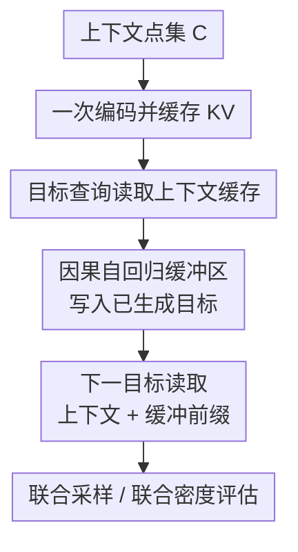

# Efficient Autoregressive Inference for Transformer Probabilistic Models

**会议**: ICLR 2026  
**论文**: [OpenReview 5bfUqlOhAH](https://openreview.net/forum?id=5bfUqlOhAH)  
**代码**: https://github.com/acerbilab/transformer-ar-buffer (有)  
**领域**: time_series / probabilistic methods / amortized inference  
**关键词**: 自回归缓冲区, Transformer Neural Processes, 联合预测密度, 高效推断, 表格基础模型  

## 一句话总结
论文提出一种因果自回归缓冲区（Causal AR Buffer），把“静态上下文一次编码”与“目标间依赖的自回归建模”解耦，在基本不损失预测质量的前提下，将联合采样与联合密度评估从反复重编码的高开销流程改造成可缓存、可并行的高效流程，在多任务上实现最高约 20x 推断加速和约 7x 显存节省。

## 研究背景与动机
**领域现状**：以 TNP、PFN、TabICL 为代表的 set-based Transformer 概率模型，在“给定上下文点集后做边缘预测”这件事上很强。它们通过 permutation-invariant 的上下文编码器一次性读入可变大小样本集，然后对每个 target 做条件预测，单次前向就能得到一批边缘分布。

**现有痛点**：很多真实任务并不满足“只要边缘分布”这一假设，而是需要多个目标之间一致的联合分布。例如时间序列插值/预测、神经科学行为数据建模、多列表格联合补全，都依赖 target-target 相关性。实践中常用做法是把 set-based 模型“部署时自回归化”：第 $k$ 步把前 $k-1$ 个预测追加进条件集，再预测第 $k$ 个目标。

**核心矛盾**：set-based 编码器内部是双向自注意力，条件集一旦新增一个点，旧的上下文表示就失效，必须整体重编码。于是复杂度从一次编码变成每步重算，累计为 $O(K(N+K)^2)$（$N$ 为上下文点数，$K$ 为目标长度）。这在大上下文、长序列、批量采样场景下成本非常高，且显存压力大。

**本文目标**：作者希望同时满足四个条件：
1. 保留 set-based 模型对初始上下文的置换不变建模优势。
2. 建模目标之间的自回归依赖，支持联合采样与联合密度评估。
3. 不要每一步都重编码上下文。
4. 在训练时尽量复用原有模型范式，避免像全自回归架构那样训练代价陡增。

**切入角度**：关键观察是“初始上下文”和“后续生成目标”在计算角色上并不相同。初始上下文是静态任务定义信息，适合一次编码后缓存；目标历史是动态依赖信息，适合用因果机制逐步写入。把两者放在同一个可交换集合里做统一重编码，其实是计算上最贵的方案。

**核心 idea**：用一个单独的因果 buffer 承担目标间依赖，把上下文缓存视为只读记忆；每个新目标只需同时读取“冻结上下文 cache + 可见 buffer 前缀”，从而把“重复全量重编码”改为“增量更新小 buffer”。

## 方法详解

### 整体框架
方法把 token 分成三类：上下文 $C$、缓冲区 $B$、目标查询 $T$。其中 $C$ 只编码一次并缓存 Key/Value；$B$ 采用严格因果注意力维护已生成历史；$T$ 在解码时读取 $C$ 与 $B$ 的可见前缀。整体上，模型计算的是：

$$
p_\theta(y^*_{1:K}\mid x^*_{1:K}, C)=\prod_{k=1}^{K} p_\theta\big(y^*_k \mid r_{tgt}(x^*_k,[r_C(C), b_{1:k-1}])\big),
$$

其中 $b_k=r_B((x^*_k,y^*_k),[r_C(C),b_{1:k-1}])$。当 buffer 为空（$K=1$）时，模型退化回标准的 set-based 对角预测模式。

论文还明确了四条注意力约束（R1-R4）：上下文只读、buffer 严格因果、信息只从上下文流出不回写、目标只读上下文与可见 buffer 前缀且目标间不互看。这四条规则保证了“缓存可复用”和“依赖可表达”同时成立。

**复杂度对比**：

- 传统 AR 重编码：$O(K(N+K)^2)$。
- 本文 buffer 机制：$O(N^2+NK+K^2)$。

前者的瓶颈是每一步都重新做大集合自注意力；后者把高代价 $N^2$ 固定成一次性 prefill，再用较小增量项处理目标序列。

### 关键设计
**1. 上下文冻结缓存：把“任务定义信息”从循环体中移出**

传统部署的浪费在于把“基本不变”的上下文放进每一步重算。本文先把上下文 token 通过双向 MHSA 编码为 $\{KV_C^\ell\}_{\ell=1}^L$，之后作为只读缓存复用，不允许任何路径回写上下文。这个设计直接砍掉了 AR 循环中的主耗时项，同时保留了 set encoder 的置换不变归纳偏置。

这不是简单的 engineering cache，而是建模假设的明确分工：上下文表达“已观测证据”，目标历史表达“生成轨迹依赖”。两类信息通过读操作汇合，而不是通过反复合并再重编码汇合。

**2. 因果缓冲区：用小状态承载目标依赖，而非重算大状态**

每个新预测 $(x_k^*,y_k^*)$ 会被写成 buffer token，并赋予顺序位置编码。buffer 内部仅允许因果自注意力（第 $j$ 个位置只能看 $<j$），同时可读上下文缓存。这等于在 set-based 主干外侧增加了一个“轻量 AR 记忆体”，让 inter-target dependency 通过 $b_{1:k-1}$ 显式建模。

关键点在于“依赖被表示在 buffer，不再隐式要求上下文重编码去吸收历史”。因此每一步只增量更新 buffer KV，计算图规模随 $k$ 温和增长，对批量采样尤其友好。

**3. 统一训练掩码：单模型兼容边缘预测与 AR 条件化**

作者没有把训练拆成两套模型，而是用结构化 attention mask 在一次前向里同时覆盖两种模式。训练时将目标分两半：50% 只看上下文（$v_m=0$），50% 看上下文加随机长度 buffer 前缀（$v_m\sim U\{1,\dots,K\}$）。对应目标函数：

$$
\mathcal{L}(\theta)=\mathbb{E}_{D\sim P}\,\mathbb{E}_{(C,B,T)\sim\pi(\cdot|D)}\left[-\sum_{m=1}^{M}\log p_\theta(y_m\mid x_m,C,B_{1:v_m})\right].
$$

这相当于一个“buffer 长度课程学习”：模型既学会无 buffer 时的高质量边缘预测，又学会在可变历史长度下稳定利用额外条件信息，从而推断阶段可在“快模式（较大 K）”和“精细模式（K=1 等效标准 AR）”之间切换。

**4. 一次前向联合密度评估：把顺序求和改成并行打包**

标准 AR 评估联合对数似然需要逐步前向 $K$ 次：

$$
\log p(y^*_{1:K}\mid x^*_{1:K},C)=\sum_{k=1}^{K}\log p(y^*_k\mid x^*_k,C,\{(x_j^*,y_j^*)\}_{j<k}).
$$

本文把“观测目标值 token”作为 buffer 整体打包，再放入同输入对应的 query token，通过掩码限制第 $k$ 个 query 只能看 $B_{1:k-1}$，从而单次前向得到与顺序 AR 等价的各项条件概率。对需要大量密度评估的模型比较任务（文中多感官模型）非常关键。

### 一个完整示例
以 EEG forecasting 为例，设上下文长度 $N=256$，未来需要预测 $K=16$ 个点。

第一步，模型对已有 256 个观测点做一次上下文编码并缓存。第二步开始逐点生成：第 1 个目标只读上下文缓存；得到 $y_1^*$ 后，将 $(x_1^*,y_1^*)$ 写入 buffer。第 2 个目标读取“上下文缓存 + 第 1 个 buffer token”；第 3 个目标读取“上下文缓存 + 前 2 个 buffer token”……直到第 16 个目标。整个过程中上下文 KV 不变，只有 buffer 递增。

如果我们要做并行采样（比如同一患者同一上下文下采 256 条未来轨迹），标准做法要维护 256 条不断膨胀并反复重编码的条件集；本文做法是共享一份上下文缓存，每条轨迹只维护自己的小 buffer，因此批量扩展更自然。

### 损失函数 / 训练策略
- 训练目标：负对数似然（NLL），并在不同 buffer 可见长度上取期望。
- 数据分割：每个训练任务把样本拆为 context / buffer / target 三组，buffer 顺序随机。
- 推断模式：
	- 自回归采样：prefill 一次上下文，然后逐步生成并写入 buffer。
	- 联合密度评估：把 buffer/query 一次打包，单前向得到整段对数似然。
- 顺序敏感性处理：由于 AR 分解对顺序敏感，文中对多种 buffer 顺序做平均以近似恢复置换不变估计。

## 实验关键数据

### 主实验
论文主结论可概括为“速度/显存显著赢，精度接近最强 AR 基线”。下面摘取文中最关键结果（$M=16$）：

| 任务 | 指标 | TNP-D-AR | Ours (K=16, fast) | Ours (K=1, slow) | 结论 |
|---|---|---:|---:|---:|---|
| GP 合成函数 | Avg. LL ↑ | 2.57 | 2.51 | 2.56 | 快模式轻微下降，K=1 几乎重合 |
| Sawtooth | Avg. LL ↑ | 1.05 | 1.00 | 1.09 | 保持高质量，优于 TNP-A |
| EEG 插值 | Avg. LL ↑ | 0.51 | 0.58 | 0.52 | K=16 反而更好 |
| EEG 预测 | Avg. LL ↑ | 1.07 | 0.85 | 1.21 | 长序列预测下 K=16 有退化，K=1 可补回 |

从效率侧，文中在统一优化后的实现上报告：

| 维度 | 与强表达基线对比（TNP-A / TNP-D-AR） | 结果 |
|---|---|---|
| 联合采样耗时 | Ours vs AR baseline | 约 3x-20x 加速 |
| 联合密度评估 | Ours vs TNP-D-AR | 约 K 倍加速（K=16 时量级优势明显） |
| 训练步耗时 | Ours vs TNP-A | 约 4x-12x 更快 |
| 峰值显存 | Ours vs TNP-A / TNP-D-AR | 大上下文下约 6x-7x 更省 |

### 消融实验
论文做了多种附录消融，这里保留最影响决策的三类：

| 配置 | 关键观察 | 说明 |
|---|---|---|
| Buffer 大小 K 从小到大 | K 增大可换取更快推断，但超长 buffer 会带来 $O(K^2)$ 成本与质量漂移风险 | 速度-质量可调旋钮 |
| 位置编码策略 | 固定可学习 buffer 位置编码有效，但长度外推受限 | 作者讨论 RoPE / ALiBi 作为未来方向 |
| 顺序平均次数 | 评估联合密度时，多顺序平均可提升稳定性 | 用计算量换置换近似不变性 |

### 关键发现
- 最大收益点不是“单步算得更快”，而是“避免每步重编码上下文”后，批量联合采样与密度评估都从不可扩展变为可扩展。
- K=16 快模式在大多数任务上与标准 AR 很接近，但在 EEG forecasting 这种更依赖长历史一致性的设置中会出现可见差距，说明 buffer 近似并非总是无损。
- K=1（空 buffer 等效标准 AR）能基本回到最强精度，表明性能下降主要来自“近似推断模式选择”，不是训练目标本身破坏了模型能力。

## 亮点与洞察
- 把“上下文静态信息”和“目标动态依赖”拆层建模是这篇最实用的思想。它不是发明全新 backbone，而是把计算图中的职责重新布置，兼容已有 TNP/PFN/TabICL 生态。
- 训练掩码设计非常工程友好。很多论文把高效推断当部署技巧单独做，训练和推断割裂；这篇通过统一掩码把两种模式联训，避免了双模型维护。
- 对联合密度评估的单次前向化很有价值。大量概率建模场景（模型比较、贝叶斯证据近似）并不只关心采样，这一点让方法不仅是“生成加速器”，也是“统计评估加速器”。
- 在 TabICL 上的可插拔验证说明该方法有“中间件”属性：只要是 set-conditioned Transformer 概率模型，理论上都可接入，迁移门槛低。

## 局限与展望
- **复杂度仍含 $O(K^2)$**：buffer 内部因果注意力决定了长预测地平线下成本仍会上升，且固定位置嵌入的长度外推有限。
- **长 buffer 质量漂移**：相较于“每步全量重编码”的精确 AR，buffer 近似在某些任务（如 EEG forecasting）会积累误差。
- **顺序敏感性仍在**：AR 分解对目标顺序依赖，虽然可做多顺序平均，但会增加评估成本，且顺序策略本身可能影响结论。
- **当前验证仍以中小规模任务为主**：尽管有 tabular foundation model 集成，超长序列、多模态超大上下文、在线流式更新等场景仍需更系统评估。

可行的改进方向：
1. 采用 RoPE/ALiBi 等外推友好位置机制，降低长序列退化。
2. 引入 speculative draft-verify 机制，在质量与速度间做自适应切换。
3. 探索 latent bottleneck + buffer 的组合，把 $N$ 维度进一步压缩，同时保留目标历史显式记忆。
4. 尝试参数高效微调（如 LoRA/Adapter）把该机制迁移到已有预训练 PFN/TNP，而非从头联训。

## 相关工作与启发
- **vs TNP-D-AR（部署时自回归）**：两者都能建模 target 依赖，但 TNP-D-AR 每步要把新点并回上下文再重编码；本文把历史放进独立 buffer，避免最昂贵的重复计算。精度上通常接近，效率上本文优势明显。
- **vs TNP-A（全自回归 Transformer NP）**：TNP-A 可并行做联合密度评估，但训练/推断都因目标双份 token 与结构开销偏大；本文在保留并行评估能力的同时，大幅降低训练和显存成本。
- **vs TNP-ND（多元高斯头）**：TNP-ND 一次前向即可得到联合密度，但联合分布形状受参数化限制；本文通过 AR 因式分解获得更灵活表达，代价是顺序敏感与近似误差管理。
- **vs 纯 AR 生成模型（LLM 风格 KV cache）**：本文借鉴 KV cache 的推断效率思想，但并未放弃 set-based 上下文建模；可理解为“set encoder + AR memory”的混合范式。

对我自己的启发：在很多“看似必须全量重算”的概率模型里，先区分“静态证据”与“动态轨迹”再设计双通路缓存，往往比直接换大模型更高 ROI。

## 评分
- 新颖性: ⭐⭐⭐⭐☆ 将 KV cache 思想系统化迁移到 set-based 概率模型并给出统一训练机制，思路新但仍属架构改造而非范式颠覆。
- 实验充分度: ⭐⭐⭐⭐⭐ 覆盖合成函数、EEG、神经科学模型比较、TabICL，且同时报告速度/显存/精度与多种基线。
- 写作质量: ⭐⭐⭐⭐☆ 问题定义和复杂度分析清楚，图示直观；部分附录细节较多、初读门槛略高。
- 价值: ⭐⭐⭐⭐⭐ 对需要联合预测与密度评估的概率推断任务非常实用，且具备较好的模型可插拔性和工程落地价值。

<!-- RELATED:START -->

## 相关论文

- [\[ICLR 2026\] Relational Transformer: Toward Zero-Shot Foundation Models for Relational Data](relational_transformer_toward_zero-shot_foundation_models_for_relational_data.md)
- [\[NeurIPS 2025\] Transformer Embeddings for Fast Microlensing Inference](../../NeurIPS2025/time_series/transformer_embeddings_for_fast_microlensing_inference.md)
- [\[ICLR 2026\] EVEREST: A Transformer for Probabilistic Rare-Event Anomaly Detection with Evidential and Tail-Aware Uncertainty](everest_a_transformer_for_probabilistic_rare-event_anomaly_detection_with_eviden.md)
- [\[ICML 2026\] U-Cast: A Surprisingly Simple and Efficient Frontier Probabilistic AI Weather Forecasting](../../ICML2026/time_series/u-cast_a_surprisingly_simple_and_efficient_frontier_probabilistic_ai_weather_for.md)
- [\[ICLR 2026\] From Samples to Scenarios: A New Paradigm for Probabilistic Forecasting](from_samples_to_scenarios_a_new_paradigm_for_probabilistic_forecasting.md)

<!-- RELATED:END -->
