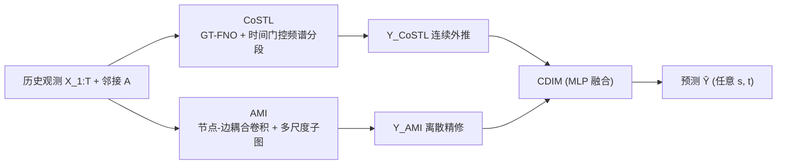

# Enabling Arbitrary Inference in Spatio-Temporal Dynamic Systems: A Physics-Inspired Perspective

**会议**: ICLR 2026  
**OpenReview**: [https://openreview.net/forum?id=b6Py2zy0fK](https://openreview.net/forum?id=b6Py2zy0fK)  
**代码**: 待确认  
**领域**: 时空预测 / 图神经算子 / 动力系统建模  
**关键词**: 神经算子, 图傅里叶变换, 时空预测, 任意推断, 多尺度图卷积, 磁拉普拉斯  

## 一句话总结
PhySTA 把神经算子（连续）与图神经网络（离散交互）拼在一起：用基于磁拉普拉斯的图-时联合傅里叶算子 GT-FNO 学连续动力学，再用多尺度节点-边耦合卷积 AMI 修正离散交互误差，从而在图结构时空系统上实现对**未观测区域和任意时空点**的高效、可泛化推断。

## 研究背景与动机
- **领域现状**：现实时空系统（交通、气候、空气质量）本质是在时间和空间上连续演化的，但传感器部署稀疏、采样有限，我们拿到的永远是离散观测，于是"离散观测 ↔ 连续动力学"之间存在天然鸿沟。
- **现有痛点**：神经算子（DeepONet、FNO）能在函数空间上学连续映射、跨分辨率泛化，但只适用于欧式网格，搬不到图结构上；而图神经网络（STGCN、DCRNN、AGCRN 等）是非欧域的主流，却只建模节点级离散传播，**不显式建模节点-边耦合**，还得靠堆深度来抓多尺度交互，既低效又精度受限。
- **核心矛盾**：连续演化建模（神经算子擅长）与离散交互学习（GNN 擅长）一直是两条平行线，没人能在图上同时把两件事做好，导致对未见区域的泛化和长程预测精度都上不去。
- **本文目标**：在图结构域上学一个连续算子 $\Phi$，给定历史观测 $X_{1:T}$ 和邻接 $A$，能预测任意空间位置 $s\in\mathcal{M}$（含未观测点）与未来时刻 $t$ 的信号 $\hat{x}(s,t)=\Phi(X_{1:T},A;s,t)$。
- **核心 idea**：**「连续算子打底 + 离散交互纠偏」**——把非欧系统实例化为时空图，用算子理论做连续外推、用多体引力启发的图交互做离散精修，二者通过一个 MLP 融合模块统一成"由粗到细"的推理路径。

## 方法详解

### 整体框架
PhySTA 以历史节点观测 $X_{1:T}$ 和邻接矩阵 $A$ 为输入，由三块协同组成：(1) **CoSTL**（连续频谱-时间学习，核心是 GT-FNO + 时间门控频谱分段感知）在谱域逼近目标系统的解算子，产出连续外推 $Y_{\text{CoSTL}}$；(2) **AMI**（自适应多尺度交互），受多体动力学启发，用节点-边耦合卷积在多尺度子图上捕捉离散交互、修正连续预测的累积误差，产出 $Y_{\text{AMI}}$；(3) **CDIM**（连续-离散交互模块）用一个 MLP 把两路输出非线性融合成最终预测 $\hat{Y}$。前者负责"跨任意目标节点的连续泛化"，后者负责"在层级图上的多尺度精修"。

### 关键设计

**1. GT-FNO：把神经算子搬到有向图上的图-时联合谱分解。** 这是连续建模的根基。传统 FNO 靠欧式空间上的傅里叶变换实现连续算子逼近，PhySTA 则先在图域做图傅里叶变换（GFT），用**磁拉普拉斯**的复特征向量 $\{\phi_q\}$ 把节点域信号映到图谱域以编码有向依赖（无向图退化为普通拉普拉斯）：$X_{\text{gft}}(q,t)=\sum_{n=1}^N \phi_q(n)X(n,t)$；再沿时间轴做 1D FFT 得到联合谱表示 $X_{\text{gtft}}(q,\omega)=\sum_{t=1}^T X_{\text{gft}}(q,t)e^{-i\omega t}$。处理完后通过逆变换 $Y_{\text{CoSTL}}(n,t)=\sum_{k}\sum_{\omega}X_{\text{tgssp}}(k,\omega)\phi_k(n)e^{i\omega t}$ 映回时空域。由于傅里叶基在 $L^2$ 空间的完备性，GT-FNO 学的是连续算子逼近而非离散函数映射，误差主要来自谱截断和有限参数化。

**2. 时间门控频谱分段感知（TGSSP）：按频段差异化参数 + 时间门控对抗非平稳。** 谱模过多会把参数撑爆，TGSSP 的思路是"重要频段多花参数、次要频段共享省参"。先把谱模按特征值正负分成 $I_{\text{neg}},I_{\text{pos}}$，再在正频段按累积能量阈值 $s=(0.1,0.95)$ 切成低/中/高三段：低频每个模独享核 $W_k^{\text{low}}$ 以保表达力，负/中/高频共享频段核并配一个可学习的逐模缩放因子 $\alpha_k$，即 $X_{\text{ssp}}(k,\omega)=W_k^{\text{low}}X_{\text{gtft}}$（低频）或 $\alpha_k(W^{\text{band}(k)}X_{\text{gtft}})$（其余）。这种低秩分段近似保住了长期低频趋势的表达力又压住了中高频参数量。为对付非平稳，再加时间门控：从绝对时间嵌入的频域表示 $\tilde{h}(\omega)$ 生成门控 $g(\omega)=\sigma(W_g\tilde{h}(\omega)+b_g)$，并统一作用到各谱段 $X_{\text{tgssp}}(k,\omega)=g(\omega)\cdot X_{\text{ssp}}(k,\omega)$，沿时间频率自适应地重加权各频段，像一个谱域注意力。

**3. 自适应多尺度交互（AMI）：节点-边耦合卷积 + 单层多尺度子图纠偏。** 算子学习的连续外推会有累积误差，AMI 用图网络的离散交互来补。受引力多体作用启发，**节点-边耦合卷积**把边属性和邻居节点特征联合编码出 FiLM 调制系数：$\tilde{e}_{ij}=\text{MLP}_e(e_{ij})$，$[\gamma_{ij},\beta_{ij}]=\text{MLP}_\phi([\tilde{e}_{ij};v_j])$，消息传递时 $m_{ij}=\gamma_{ij}\odot v_j+\beta_{ij}$，节点更新 $v_i'=\sigma(\sum_{j\in N(i)}m_{ij})$；由于 $v_j$ 编码了局部/历史上下文，调制系数随时空动态变化，实现异质、各向异性、上下文敏感的消息调制。为在**单层内**抓长程依赖，借鉴多重网格求解器构造三级子图：用 Louvain 最大化模块度 $Q=\frac{1}{2m}\sum_{i,j}(A_{ij}-\frac{k_ik_j}{2m})\delta(c_i,c_j)$ 做社区划分，**coarse** 图取社区代表节点抓跨社区全局趋势、**mid** 图保留原邻接抓局部交互、**fine** 图把粗粒度边权 Top-K 稀疏化后叠回原图做整合精修，最后拼接 $Y_{\text{AMI}}=\text{Concat}(X_{1:T},X_{\text{coarse}},X_{\text{mid}},X_{\text{fine}})$，一次前向就完成全局-区域-局部的跨尺度建模。

**4. CDIM：连续外推与离散纠偏的非线性融合。** 最后把 $Y_{\text{CoSTL}}$（无约束外推）与 $Y_{\text{AMI}}$（基于观测的自适应修正）拼接，过一个 MLP $\hat{Y}=\text{CDIM}([Y_{\text{CoSTL}},Y_{\text{AMI}}])=W_2(\text{Dropout}(\phi(W_1 z+b_1)))+b_2$。比起简单门控，MLP 能学非线性纠偏函数，避免连续外推与离散修正之间预测断裂，把两路统一成连贯的由粗到细推理。

## 实验关键数据

### 主实验表格
三个真实数据集（PEMS-BAY 交通、SD 大规模交通、KnowAir 空气质量），训练/验证/测试按 6:2:2 时序切分，通过随机 mask 节点特征模拟未观测区域，报告 12 个预测步的平均 MAE/MAPE/RMSE。

| 数据集 | 指标 | 强基线（次优代表） | PhySTA |
|---|---|---|---|
| KnowAir (Mask=0.7) | MAE | STGCN 29.75 / GWNET 30.87 | **27.19** |
| PEMS-BAY (Mask=0.3) | MAE / RMSE | STTN 2.80 / 6.08 | **2.75 / 5.85** |
| PEMS-BAY (Mask=0.5) | MAE | STTN 3.69 | **3.52** |
| SD (Mask=0.3) | RMSE | STTN 92.03 | **91.65** |
| SD (Mask=0.7) | MAE | GWNET 106.50 | **96.09** |

PhySTA 在各数据集、各缺失率下几乎都拿最优或次优，且在高稀疏（Mask=0.7）下优势更明显——传统 LSTM/STGCN 在高缺失下退化严重，先进 GNN（DGCRN、STGODE）则表现波动。

### 效率对比表格

| 模型 | 参数量 | GPU 显存 (MB) |
|---|---|---|
| ASTGCN | 2,153,034 | 11,028 |
| STGODE | 729,228 | 18,864 |
| AGCRN | 760,580 | 11,140 |
| STTN | 113,740 | 18,864 |
| **PhySTA** | **123,474** | **6,042** |

复杂度 $O(d^2nL)$（$L<n$），参数仅 12.3 万、显存 6GB，是同精度档里最省的之一；intro 中称相比基线最多减少 74.6% FLOPs。

### 消融实验表格（PEMS-BAY，Mask=0 / Mask=0.5）

| 变体 | MAE (Mask=0) | MAE (Mask=0.5) |
|---|---|---|
| 完整模型 | **1.66** | **3.52** |
| w/o TGSSP | 1.80 | 4.12 |
| w/o GT-FNO | 2.05 | 5.03 |
| w/o ENCC | 1.73 | 3.87 |
| w/o MSGCN | 1.79 | 3.96 |
| w/o AMI | 1.88 | 4.13 |

### 关键发现
- **GT-FNO 最关键**：去掉后 MAE 从 1.66 涨到 2.05（Mask=0 提升 23%）、Mask=0.5 涨到 5.03，说明连续谱算子是建模时空动力学的核心。
- **AMI 整体贡献最大**：完全去掉 AMI 在两种 mask 下都是最大跌幅（1.88 / 4.13），验证多尺度离散纠偏对稀疏数据下的鲁棒预测不可或缺。
- **Case study**：训练中高频段 $\alpha_k$ 出现"谱选择"竞争——有信息的高频模被放大、无关模衰减；评估时低频门控近乎全通保全局趋势、高频门控高方差选择性响应局部突变，门控随瞬态谱爆发同步激活，类似谱域注意力。

## 亮点与洞察
- **真正把神经算子搬上图**：用磁拉普拉斯做 GFT 处理有向图，让 FNO 范式跨出欧式网格，是连接"算子学习"与"图时空预测"两大流派的实在桥梁。
- **连续 + 离散的分工很清晰**：CoSTL 管连续外推与任意点泛化，AMI 管离散交互纠偏，CDIM 做非线性融合，避免了两路预测断裂。
- **单层多尺度**：借多重网格思想用 coarse-mid-fine 三级子图在一层内抓全局-局部，绕开了 GNN 靠堆深度抓多尺度的低效老路，参数和显存都压得很低。
- **频段差异化参数化**很务实：低频独享核保表达、中高频共享核省参，是个简单但有效的"精度-效率"折中。

## 局限与展望
- 误差分析停留在"谱截断 + 有限参数化"的定性层面，连续性证明和算法细节都放进了附录，正文缺乏对逼近误差界的量化刻画。
- 评测仅限交通 + 空气质量三个数据集，对真正的欧式连续场（如流体速度场）只在 related work 提及未做实验，"统一欧式/非欧"的卖点验证不够。
- "任意推断"主要通过节点 mask 模拟未观测，对完全连续空间任意坐标 $s$ 的插值/外推能力缺乏专门的定量评测。
- Louvain 社区划分是预处理步骤，社区结构对最终精度的敏感性、动态图上社区随时间变化的处理都没充分讨论。

## 相关工作与启发
- **神经算子谱系**：DeepONet（branch-trunk）、FNO（谱域全局卷积核）、ST-FNO 提供时空基函数——PhySTA 的 GT-FNO 是 FNO 在图域的有向扩展。
- **图时空预测谱系**：静态图（STGCN、GWNet、ASTGCN）、动态图（DGCRN、DSTAGNN、D2STGNN）、ODE/注意力（AGCRN、STTN、STG-ODE）——PhySTA 的对比对象，主要痛点是只建模节点传播、忽视节点-边耦合、靠堆深度抓多尺度。
- **物理启发**：算子理论（连续动力学建模）+ 多体引力交互（节点-边耦合）+ 多重网格求解器（多尺度子图），是方法论的三个灵感来源。
- **启发**：对任何"离散观测 vs 连续真值"的建模问题，"谱域连续算子 + 显式离散交互纠偏"是个可迁移的范式；FiLM 式边调制把边属性变成动态消息调制系数，也值得在异质图任务里复用。

## 评分
- **新颖性**: ⭐⭐⭐⭐ — 把神经算子用磁拉普拉斯扩展到有向图、并与多尺度节点-边耦合 GNN 缝合做连续+离散联合建模，组合扎实且填补了两流派之间的空白。
- **实验充分度**: ⭐⭐⭐ — 三数据集 × 多缺失率 + 效率 + 消融 + case study 较完整，但只覆盖交通/空气质量、未验证欧式连续场，"任意空间点推断"缺专门评测。
- **写作质量**: ⭐⭐⭐⭐ — 动机清晰、公式与模块对应、由粗到细的叙事连贯，命名（CoSTL/AMI/CDIM/TGSSP）稍多需对照记忆。
- **价值**: ⭐⭐⭐⭐ — 在稀疏传感场景下兼顾精度、参数与显存，对交通/环境监测等实际部署有直接价值，物理启发的建模范式有一定通用性。

<!-- RELATED:START -->

## 相关论文

- [\[ICML 2026\] Learning Long Range Spatio-Temporal Representations over Continuous Time Dynamic Graphs with State Space Models](../../ICML2026/time_series/learning_long_range_spatio-temporal_representations_over_continuous_time_dynamic.md)
- [\[ICLR 2026\] Towards Generalizable PDE Dynamics Forecasting via Physics-Guided Invariant Learning](towards_generalizable_pde_dynamics_forecasting_via_physics-guided_invariant_lear.md)
- [\[ICML 2026\] Nested Spatio-Temporal Time Series Forecasting](../../ICML2026/time_series/nested_spatio-temporal_time_series_forecasting.md)
- [\[ICLR 2026\] ST-HHOL: Spatio-Temporal Hierarchical Hypergraph Online Learning for Crime Prediction](st-hhol_spatio-temporal_hierarchical_hypergraph_online_learning_for_crime_predic.md)
- [\[ICLR 2026\] TRIDENT: Cross-Domain Trajectory Spatio-Temporal Representation via Distance-Preserving Triplet Learning](trident_cross-domain_trajectory_spatio-temporal_representation_via_distance-pres.md)

<!-- RELATED:END -->
