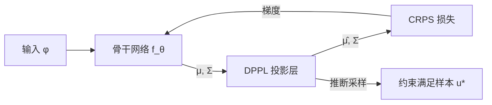

# End-to-End Probabilistic Framework for Learning with Hard Constraints

**会议**: ICLR 2026  
**OpenReview**: [https://openreview.net/forum?id=RPowYXiRmW](https://openreview.net/forum?id=RPowYXiRmW)  
**代码**: [amazon-science/probharde2e](https://github.com/amazon-science/probharde2e)  
**领域**: 时间序列 / 科学机器学习  
**关键词**: 硬约束、概率预测、可微投影层、CRPS、不确定性量化

## 一句话总结

ProbHardE2E 提出可微概率投影层（DPPL），将硬约束直接作用于分布参数，实现端到端训练，在概率时间序列预测和 PDE 求解两个领域同时支持严格约束满足与不确定性量化。

## 研究背景与动机

**领域现状**：机器学习在工程和科学任务中广泛应用，但物理/运营约束（守恒律、层级相干性、非负性）往往需要被"硬"满足——任何违反都不可接受。  
**现有痛点**：现有方法要么将约束作为软惩罚（不保证满足），要么仅在推断阶段做后处理投影（训练时目标函数与约束脱钩，无法端到端优化），要么只支持线性约束。此外几乎所有带约束的方法都只给出点估计，缺乏不确定性量化（UQ）。  
**核心矛盾**：硬约束满足 + 端到端训练 + 概率分布输出三者难以同时兼顾：对样本投影会引入高昂的采样开销，而直接对分布参数投影则需要可微的闭式推导。  
**本文目标**：构建一个同时支持线性/非线性/凸不等式约束、能以端到端方式优化、并输出校准概率分布的统一框架。  
**核心 idea**：在神经网络输出层之后插入一个 DPPL，将无约束分布参数（均值 $\mu$、协方差 $\Sigma$）通过约束最小二乘投影映射到满足约束的参数 $(\hat\mu, \hat\Sigma)$，利用 Multivariate Delta Method 传播协方差，并以无采样的闭式 CRPS 作为训练目标。

## 方法详解

### 整体框架

ProbHardE2E 采用预测-校正（Predictor-Corrector）双步结构：骨干网络 $f_\theta$ 预测无约束分布参数 $(\mu_\theta, \Sigma_\theta)$，DPPL 将其投影到约束流形上得到 $(\hat\mu_\theta, \hat\Sigma_\theta)$，最后以闭式 CRPS 损失端到端更新所有参数。推断时对每个样本单独做精确投影以严格满足约束。

### 关键设计

**1. 可微概率投影层（DPPL）：把约束作用到分布参数上**

DPPL 的核心是将约束满足问题转化为加权约束最小二乘：

$$u^*(z) := \arg\min_{\hat u:\, g(\hat u)\le 0,\, h(\hat u)=0} \|\hat u - z\|_Q^2$$

对骨干网络输出的均值 $\mu$ 和协方差 $\Sigma$，利用 Multivariate Delta Method（Theorem 3.1），若 $T(z)=u^*(z)$，则投影后的分布参数近似为：

$$\hat\mu = T(\mu), \quad \hat\Sigma = J_T(\mu)\,\Sigma\,J_T(\mu)^\top$$

其中 $J_T(\mu)$ 是投影映射在 $\mu$ 处的 Jacobian。这样协方差得到正确传播，而无需对样本逐一投影——**训练期间完全无需采样**，计算开销仅约为无约束基线的 2 倍，相比采样方案节省 3–5×。

**2. 多类型约束的统一处理**

DPPL 对三种约束类型分别给出不同的求解策略（见 Table 1）：
- **线性等式约束** $A\hat u = b$：斜投影 $P_{Q^{-1}}z + (I-P_{Q^{-1}})A^\dagger b$，完全闭式，训练推断等价。  
- **非线性等式约束** $h(\hat u)=0$：训练时用 Newton 迭代近似求均值投影，Jacobian 通过隐函数定理（implicit differentiation）计算；推断时对每个样本精确求解，保证严格可行性。  
- **凸不等式约束** $g(\hat u)\le 0$：训练时调用凸优化求解器，通过灵敏度分析或 argmin 微分获取梯度；推断时逐样本求解凸规划。

斜投影（$Q=\Sigma^{-1}$）在协方差方向校正，更好地保留异方差数据（如时序中的尖峰）的不确定性结构；正交投影（$Q=I$）在平滑问题上更有利于 CRPS。

**3. 以 CRPS 代替 NLL 作为训练目标**

现有 SciML 工作普遍使用负对数似然（NLL）做概率训练，NLL 的问题是对分布假设敏感。本文改用连续排名概率分数（CRPS）——一种严格真实性评分规则，对模型误设定更鲁棒。对单变量高斯分布 CRPS 有闭式表达式，从而在投影层之上直接对分布参数计算损失，彻底消除采样需求：

$$\mathrm{CRPS}_\mathcal{N}(z) = z(2\Phi(z)-1) + 2\phi(z) - \frac{1}{\sqrt{\pi}}$$

在 PDE 实验中，使用 CRPS 训练相比 NLL 在约 75% 的数据集-模型组合上同时改善了 MSE 和 CRPS，尤其对非线性/尖锐解效果显著。

## 实验关键数据

### 主实验（PDE — 线性约束）

| 数据集 | 指标 | ProbHardE2E-Ob | ProbConserv | SoftC | VarianceNO |
|--------|------|---------------|-------------|-------|------------|
| Heat（易） | CRPS×10⁻³ | **0.304** | 0.392 | 0.354 | 0.396 |
| Advection（中） | CRPS×10⁻³ | **4.19** | 3.88 | 3.96 | 3.98 |
| Stefan（难） | CRPS×10⁻³ | **7.52** | 7.85 | 9.88 | 9.51 |
| Advection | MSE×10⁻⁵ | **131** | 134 | 148 | 149 |

所有 ProbHardE2E 变体约束误差（CE）= 0；SoftC 和 VarianceNO 的 CE 高达 18–182×10⁻³。

### 主实验（时间序列层级预测 — CRPS×10⁻³）

| 数据集 | ProbHardE2E-Or | ProbConserv | HierE2E | DeepVAR（无约束） |
|--------|---------------|-------------|---------|----------------|
| LABOUR | **28.6** | 45.8 | 50.5 | 38.2 |
| TOURISM | **82.4** | 100.7 | 103.1 | 92.5 |
| WIKI | **212.1** | 264.7 | 216.5 | 229.4 |

所有带约束方法 CE=0，DeepVAR CE 高达 8398.6（WIKI）。

### 消融实验（非线性约束，PDE）

| 配置 | MSE 提升（vs 推断时约束） | CRPS 提升 |
|------|--------------------------|-----------|
| ProbHardE2E vs ProbHardInf（m=2,3） | 最高 ~15-17× | 最高 ~2.5× |
| CRPS 训练 vs NLL 训练 | +75% 情况改善 MSE | 全面优于 NLL |
| 无采样 vs 100 样本/步 | 训练速度 3.3–4.6× 加速 | 相当 |

### 关键发现

- 端到端训练（训练时即施加约束）相比推断时后处理，显著改善了概率预测精度，尤其在非线性约束下效果更明显。
- 斜投影（oblique, $Q=\Sigma^{-1}$）在含尖峰/间断的异方差问题上优于正交投影；正交投影在平滑问题上更快收敛。
- CRPS 作为训练损失在 UQ 性能上系统性优于 NLL，尤其在 SciML 任务（此前 NLL 是主流）。

## 亮点与洞察

- 将时间序列层级预测与 PDE 求解统一到同一框架，揭示了两者在约束形式和投影方法上的深层同构性。
- DPPL 的"参数级投影 + Delta Method 传播协方差"设计巧妙规避了概率投影中采样的瓶颈，兼顾效率与严格可行性。
- 以 CRPS 代替 NLL 作为科学机器学习中 UQ 的训练目标，对该领域是一个重要的实践建议。

## 局限与展望

- 非线性约束训练时仅做一阶近似（Delta Method），对高度非线性的约束投影可能引入偏差。
- 凸不等式约束仍需外部凸优化求解器，在大批量/高维场景下计算开销仍然可观。
- 目前协方差使用对角结构（scalability 考量），低秩/全协方差结构在 Appendix E 中有初步讨论，但未作系统评估。
- 时间序列应用目前主要针对层级线性约束，更复杂的时序非线性约束场景有待验证。

## 相关工作与启发

- **vs ProbConserv (Hansen et al., 2023)**：同样用斜投影，但只在推断时施加约束，且只支持线性约束；ProbHardE2E 将其泛化为端到端 + 非线性约束。
- **vs HierE2E (Rangapuram et al., 2021)**：端到端但用正交投影 + 采样量化损失；ProbHardE2E 引入无采样 CRPS 和斜投影，支持非线性约束。
- **vs SoftC / PINNs**：软约束不保证满足；DPPL 的硬约束在运营/物理场景更可靠。
- **vs DC3 / OptNet (Amos & Kolter, 2017)**：这类可微优化层只给点估计；ProbHardE2E 将其扩展到概率分布，提供 UQ。

## 评分

- 新颖性: ⭐⭐⭐⭐ DPPL 将约束投影直接作用于分布参数、并以 Delta Method 传播协方差的设计思路新颖，跨领域统一框架有价值
- 实验充分度: ⭐⭐⭐⭐ 覆盖 4 类 PDE + 5 类时序数据集，消融实验（端到端/斜投影/CRPS/采样效率）完整
- 写作质量: ⭐⭐⭐⭐ 理论推导清晰，Algorithm 1 和 Table 1 对框架的说明直观
- 价值: ⭐⭐⭐⭐ 对需要严格满足约束的概率预测场景（供应链、物理仿真、层级报告）有直接实用价值

<!-- RELATED:START -->

## 相关论文

- [\[ICLR 2026\] DeepFRC: An End-to-End Deep Learning Model for Functional Registration and Classification](deepfrc_an_end-to-end_deep_learning_model_for_functional_registration_and_classi.md)
- [\[ICLR 2026\] Perturbed Dynamic Time Warping: A Probabilistic Framework and Generalized Variants](perturbed_dynamic_time_warping_a_probabilistic_framework_and_generalized_variant.md)
- [\[ICLR 2026\] Efficient Autoregressive Inference for Transformer Probabilistic Models](efficient_autoregressive_inference_for_transformer_probabilistic_models.md)
- [\[ICLR 2026\] From Samples to Scenarios: A New Paradigm for Probabilistic Forecasting](from_samples_to_scenarios_a_new_paradigm_for_probabilistic_forecasting.md)
- [\[ICLR 2026\] SwiftTS: A Swift Selection Framework for Time Series Pre-trained Models via Multi-task Meta-Learning](swiftts_a_swift_selection_framework_for_time_series_pre-trained_models_via_multi.md)

<!-- RELATED:END -->
