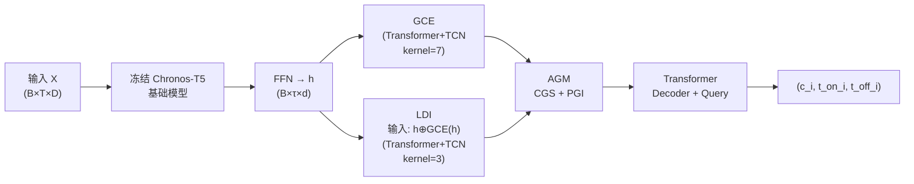

# Enhancing Sparse Event Detection in Healthcare Time-Series via Adaptive Gate of Context–Detail Interaction

**会议**: ICLR 2026  
**OpenReview**: [https://openreview.net/forum?id=DulnZ7Dv82](https://openreview.net/forum?id=DulnZ7Dv82)  
**代码**: 待确认  
**领域**: 医疗时序 / 事件检测  
**关键词**: 稀疏事件检测、时序、DETR、自适应门控、医疗生物信号

## 一句话总结

提出 GCE-LDI-AGM 三模块粗到细框架，通过自适应门控融合全局上下文与局部细节，配合条件门控缩放（CGS）和位置高斯注入（PGI）两项辅助监督，大幅提升医疗时序极稀疏事件的类别与边界联合检测能力。

## 研究背景与动机

**领域现状**：医疗生物信号（心电图 ECG、情感识别、活动监测）事件检测要求同时预测事件类别与精确时间边界，而非仅判断异常或分类固定窗口。DETR 系列方法凭借端到端集合预测在图像检测领域取得突破，并被引入时序检测任务。

**现有痛点**：时序数据中事件极度稀疏（某些类别占比低至 0.03%），绝大多数时间步对应正常状态，导致 DETR 类方法在预测稀疏事件时准确率偏低、训练不稳定；同时，时序事件的模糊边界使传统 anchor 对齐策略失效。

**核心矛盾**：全局上下文（长程依赖）与局部细节（精确边界）在稀疏事件下难以兼顾——对全局特征过度依赖会淹没稀疏事件信号；对局部特征偏重则缺乏足够语义区分力。

**本文目标**：设计一种粗到细的检测框架，在现有 DETR 架构基础上同时解决稀疏事件类别不平衡与边界定位不精准两大问题。

**核心 idea**：以冻结的 Chronos-T5 时序基础模型为骨干，引入 GCE（粗粒度全局探索）和 LDI（细粒度局部检测）双路提取，再由 AGM 自适应门控动态融合两路特征；AGM 内嵌 CGS（利用二值标签缓解类别不平衡）和 PGI（将 Gaussian 形状标签对齐到特征空间以强化边界定位），实现"检测到哪就精细化到哪"的门控学习策略。

## 方法详解

### 整体框架

输入多变量或单变量时序 $X \in \mathbb{R}^{B \times T \times D}$，经冻结 Chronos-T5 基础模型编码后，依次通过 FFN 映射、GCE 粗粒度全局探索、LDI 细粒度局部检测，再送入 AGM 自适应融合，最终由 Transformer 解码器配合可学习 object query 输出 $N$ 个事件的类别 $c_i$、起始时间 $t^{on}_i$ 与终止时间 $t^{off}_i$。

### 关键设计

**1. 粗到细双路特征提取（GCE & LDI）：捕获互补时序视角**

GCE 和 LDI 均由 Transformer 编码器 + 带扩张率 [1, 2, 4, 8] 的 TCN-attention 组成，但在两个维度上形成粗到细层级：其一，核大小不同——GCE 使用 kernel=7 感受更长时程模式，LDI 使用 kernel=3 专注短程边界细节；其二，LDI 的输入不仅含初始特征 $h_{align}$，还叠加了 GCE 的输出，即 $x_{LDI} = h_{align} \oplus f_{GCE}(h_{align})$，使局部模块在全局语义引导下工作，避免对细节特征的盲目提取。两路输出通过线性对齐层映射到公共表示空间，保证后续融合一致性。

**2. 条件门控缩放（CGS）：自适应缓解稀疏事件类别不平衡**

CGS 从 GCE 特征出发，用 FFN 预测每个时步的二值事件标签（事件/非事件），并用逆频率加权交叉熵损失 $L_{BCE}$ 强化稀疏类学习：

$$w_0 = \frac{1/r_0}{1/r_0 + 1/r_1},\quad w_1 = \frac{1/r_1}{1/r_0 + 1/r_1}$$

其中 $r_0, r_1$ 为非事件/事件比率，$w_1 > w_0$。FFN 输出即为条件缩放权重 $w_c$，对 AGM 输入做逐元素加权 $\tilde{x}_{AGM} = w_c \odot x_{AGM}$，在前向传播中动态放大事件相关特征、压制冗余的正常段特征，无需额外采样策略。

**3. 位置高斯注入（PGI）：软化边界监督增强时序定位**

PGI 为每个标注事件生成以事件中心 $c = (t_s + t_e - 1)/2$ 为均值的 Gaussian 分布标签，端点强制置零以明确边界：

$$y_{gaussian}(t) = \begin{cases} \frac{\mathcal{N}(t; c, \sigma^2)}{\max_{u \in [t_s, t_e]} \mathcal{N}(u; c, \sigma^2)}, & t_s < t < t_e \\ 0, & t \in \{t_s, t_e\} \end{cases}$$

这一软标签通过余弦相似度损失对齐到 AGM 特征空间（经 Conv1D 投影）与冻结 FM 编码的 Gaussian 嵌入：

$$L_{cos} = 1 - \frac{1}{B\tau}\sum_{b,t} \frac{\text{Conv}(\tilde{x}_{AGM})_{b,t} \cdot f_{FM}(y_{gaussian})_{b,t}}{\|\cdots\|_2\|\cdots\|_2}$$

相比离散的 0/1 标签，Gaussian 软标签显式标记事件中心、拉开相邻事件区分度，并消除固定长度窗口切分造成的边界歧义。

**4. 自适应门控融合与多目标训练：动态平衡全局/局部贡献**

AGM 经 CrossAttention 融合 GCE 与 LDI 特征后，依次通过 CGS 加权和 PGI 位置注入，再经 Conv1D + Sigmoid 产生时步级门控张量 $g \in \mathbb{R}^{B \times \tau \times 1}$：

$$h_{gated} = g \odot f_{LDI} + (1 - g) \odot f_{GCE}$$

当模型判定某时步可能包含事件时（$g$ 较大），局部细节特征权重增大；否则依赖全局上下文。整体训练目标为三项加权之和：

$$L_{total} = 0.2 \cdot L_{cos} + 0.1 \cdot L_{BCE} + 0.7 \cdot L_{Detection}$$

$L_{Detection}$ 采用 Hungarian 匹配，匹配代价按 $\lambda_{cls}:\lambda_{ctr}:\lambda_{len} = 1:5:1$ 组合事件中心 L1 损失与长度 L1 损失，最终检测损失为 $5.0 \cdot L_{loc} + 2.0 \cdot L_{cls}$。

## 实验关键数据

### 主实验

| 数据集 | 指标 | 本文 | 最强基线（Deformable-DINO） | Δ |
|--------|------|------|------|---|
| MIT-BIH Class 3 | PW-F1 | **90.63** | 86.41 | +4.22 |
| MIT-BIH Class 3 | AF-F1 | **85.96** | 83.22 | +2.74 |
| MIT-BIH Class 6 | PW-F1 | **83.37** | 74.11 | +9.26 |
| MIT-BIH Class 15 | PW-F1 | **74.86** | 63.49 | +11.37 |
| SHDB-AF Class 3 | PW-F1 | **96.23** | 90.86 | +5.37 |
| SHDB-AF Class 5 | AF-F1 | **83.78** | 65.98 | +17.80 |
| WESAD Class 8 | PW-F1 | **73.59** | 69.22 | +4.37 |
| OPP Class 5 | PW-F1 | **64.98** | 58.05 | +6.93 |

### 消融实验（基于核心稀疏事件类别）

| 配置 | 极稀疏类 PW-F1 | 说明 |
|------|------|------|
| 基础 DETR | ~29–44 | 无 AGM |
| + GCE/LDI 双路 | 提升约 10–15pp | 粗到细结构有效 |
| + CGS | 进一步提升 | 缓解类别不平衡 |
| + PGI（完整 AGM） | 最优 | 边界定位增益显著 |

### 关键发现

- 极稀疏事件（SHDB-AF PAT&NOD，占比仅 0.03%）PW-F1 达 66.41，优于最强基线 43.84（+22.57 pp），验证 AGM 在极端不平衡下的有效性。
- 对非稀疏类别（OPP "Stand"，占比 42.36%）PW-F1 仍达 55.61，说明框架不以牺牲常见类为代价换取稀疏类提升。
- "Ventricular arrhythmia"出现高 PW-F1 但低 AF-F1 的分裂现象，说明模型能可靠检测事件发生、但对边界对齐的精度还有改进空间。
- 三指标（PW-F1 / AF-F1 / mAP）整体领先，说明提升非单一维度调优所致。

## 亮点与洞察

- **门控思想的时序化迁移**：将 object detection 中的 attention gate 思想迁移到时序领域，并与稀疏事件监督直接绑定，架构干净、动机清晰。
- **双重软监督**：CGS 处理类别维度的稀疏不平衡，PGI 处理时间维度的边界模糊，两者正交互补，是本文超越其他 DETR 变体的核心差异。
- **冻结基础模型骨干**：利用 Chronos-T5 提供强时序表示而不微调，既减少训练数据需求，也确保在小规模医疗数据集上的稳定性。
- **临床实用价值**：同时输出类别+起止时间，比单纯异常检测更具操作指导意义（临床医生可直接跳至可疑片段）。

## 局限与展望

- 实验均在单个或少数通道的生物信号数据集上，对高维度、非稳态时序（如 ICU 多模态传感器）泛化能力未充分验证。
- "Ventricular arrhythmia"类别在 AF-F1 上表现弱，提示对长边界事件的时序对齐仍有瓶颈，未来可引入更精细的边界回归机制。
- 基础模型依赖 Chronos-T5，不同医疗时序基础模型（如 MOMENT、UniTS）对结果影响值得探索。
- 当前 PGI 的 Gaussian 宽度 $\sigma$ 与事件长度线性绑定，对持续时间高度可变的事件（如癫痫发作）可能需要自适应 $\sigma$。

## 相关工作与启发

- **vs DETR/Deformable-DETR/DAB-DETR/DN-DETR/DINO**：均为图像检测经典方法的 1D 时序改编版本，缺乏针对稀疏事件的专项设计；本文在所有数据集上全面超越这六种基线。
- **vs 异常检测方法（如 GANF, TranAD）**：只输出异常段标记，无类别与边界信息，不满足临床需求。
- **vs 窗口分类方法**：无法定位精确起止时间，无法区分窗口内多个事件。
- **启发**：CGS+PGI 的双路辅助监督策略可推广到其他稀疏标注场景（如医学图像罕见病灶检测、工业异常检测）；Gaussian 软标签思路与目标检测中的高斯热图监督（如 CenterNet）异曲同工，在时序领域的应用尚未充分挖掘。

## 评分

- 新颖性: ⭐⭐⭐⭐ 将 AGM 门控与 CGS/PGI 双重软监督结合用于时序稀疏事件检测，在 DETR 框架下的专项设计有一定新意，但整体属于已有技术组合创新
- 实验充分度: ⭐⭐⭐⭐ 四个数据集多类别多指标全面对比六种 DETR 基线，附带消融与长短事件分析，覆盖度较好
- 写作质量: ⭐⭐⭐⭐ 动机链条清晰，图表说明充分，公式表述规范
- 价值: ⭐⭐⭐⭐ 医疗时序稀疏事件检测有实际临床需求，框架设计可推广，工程落地门槛不高

<!-- RELATED:START -->

## 相关论文

- [\[ICLR 2026\] Towards Multimodal Time Series Anomaly Detection with Semantic Alignment and Condensed Interaction](towards_multimodal_time_series_anomaly_detection_with_semantic_alignment_and_con.md)
- [\[ICLR 2026\] CPiRi: Channel Permutation-Invariant Relational Interaction for Multivariate Time Series Forecasting](cpiri_channel_permutation-invariant_relational_interaction_for_multivariate_time_se.md)
- [\[ICLR 2026\] EVEREST: A Transformer for Probabilistic Rare-Event Anomaly Detection with Evidential and Tail-Aware Uncertainty](everest_a_transformer_for_probabilistic_rare-event_anomaly_detection_with_eviden.md)
- [\[ICLR 2026\] ICDiffAD: Implicit Conditioning Diffusion Model for Time Series Anomaly Detection](icdiffad_implicit_conditioning_diffusion_model_for_time_series_anomaly_detection.md)
- [\[NeurIPS 2025\] MAESTRO: Adaptive Sparse Attention and Robust Learning for Multimodal Dynamic Time Series](../../NeurIPS2025/time_series/maestro_adaptive_sparse_attention_and_robust_learning_for_multimodal_dynamic_tim.md)

<!-- RELATED:END -->
