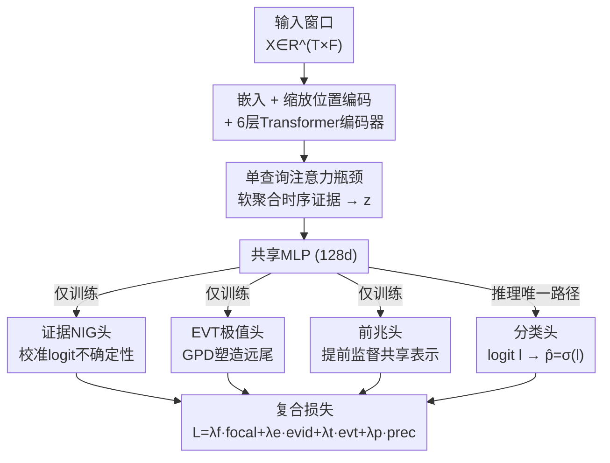

# EVEREST: A Transformer for Probabilistic Rare-Event Anomaly Detection with Evidential and Tail-Aware Uncertainty

**会议**: ICLR2026  
**OpenReview**: [https://openreview.net/forum?id=ScpCaOVGw1](https://openreview.net/forum?id=ScpCaOVGw1)  
**代码**: 待确认  
**领域**: 时间序列 / 稀有事件预测 / 不确定性估计  
**关键词**: 稀有事件预测, 证据深度学习, 极值理论, 校准, 太阳耀斑

## 一句话总结
EVEREST 用一个紧凑的 Transformer 做多变量时间序列的稀有事件预测：在共享主干上挂三个**只在训练时生效**的辅助头（证据 NIG 头管校准、极值 EVT 头管尾部风险、前兆头管提前监督），推理时只留一个分类头、零额外开销；在十年太阳耀斑数据上把 C 级耀斑 24/48/72 小时的 TSS 做到 0.973/0.970/0.966，并能不改架构迁移到工业异常数据集 SKAB（F1=98.16%）。

## 研究背景与动机
**领域现状**：多变量时间序列里预测"稀有但高代价"的事件（太阳耀斑、工业故障、电网/卫星异常）是个老大难。主流做法分两条线：一条是把序列编码器做强——频域分解（FEDformer）、patch token 化（PatchTST）、纯卷积长序列模型；另一条是针对耀斑设计专用结构（LSTM、CNN–Transformer 混合、SolarFlareNet）。它们在"区分性"（discrimination）上确实越做越好。

**现有痛点**：但高风险运营场景要的不只是"分得开"。第一，类别极度不平衡 + 长上下文，正样本稀疏、早期前兆被长序列稀释，标准交叉熵在极端区几乎不给梯度；第二，决策要靠**校准过的概率**配阈值来发警报，模型一旦 miscalibrated，运营价值就垮，而且要能分解**偶然不确定性（aleatoric）**和**认知不确定性（epistemic）**；第三，真正灾难性的后果落在分布的**远尾**，平均损失对尾部基本无能为力。现有方法很少把"校准"和"尾部敏感"这两件事在一个紧凑架构里同时解决。

**核心矛盾**：区分性、校准、尾部风险三个目标各自有成熟工具（focal loss / 证据学习 / 极值理论 EVT），但它们分散在不同社区，且强行堆在一起往往要么增大推理开销、要么互相打架。

**本文目标**：在**单个紧凑 Transformer、且推理零额外开销**的前提下，同时拿下区分、校准、尾部三件事。

**切入角度**：作者的关键观察是——校准头、尾部头、前兆头其实可以只当**训练期的正则器**：它们正则化共享表示 $z$，部署时直接丢掉，推理仍只走一个分类头。于是"多任务好处"留下、"多任务开销"消失。

**核心 idea**：用三个"训练时辅助头 + 一个复合损失"去**正则化**一个共享 Transformer 主干的稀有事件 logit，推理时退化成普通分类器。

## 方法详解

### 整体框架
输入是一个窗口 $X \in \mathbb{R}^{T\times F}$（$T$ 个时间步、$F$ 个特征），标签 $y\in\{0,1\}$ 表示固定预测窗内是否发生事件；输出一个 logit $l$ 与概率 $\hat p=\sigma(l)$，与阈值 $\tau$ 比较产生警报。整条网络分四段：① 输入嵌入 + 可学习缩放的位置编码；② 6 层标准 Transformer 编码器；③ **单查询注意力瓶颈**把整段序列压成一个隐向量 $z$；④ 一个浅层共享 MLP（128 维）之后分出**四个并行头**——主分类头（推理用）、证据 NIG 头、EVT 极值头、前兆头（后三个只在训练时生效）。四个头共享主干和 MLP 参数，通过一个复合损失联合优化；部署时只保留分类头，单次前向，开销与同规模普通 Transformer 完全相同（约 0.81M 参数）。

### 关键设计

**1. 单查询注意力瓶颈：用一个全局软注意力聚合分散的弱前兆**

痛点直接：稀有事件的前兆往往是分散、微弱的信号，全局平均池化会把它们稀释掉。作者在编码器输出 $H=[h_1,\dots,h_T]\in\mathbb{R}^{d\times T}$ 上只放**一个**可学习的打分向量 $w\in\mathbb{R}^d$，算出一条软注意力分布并加权汇聚：

$$\alpha_t=\mathrm{softmax}_t\big(w^\top h_t\big),\qquad z=\sum_{t=1}^{T}\alpha_t\,h_t.$$

这个瓶颈只增加 $+d$ 个参数、$O(Td)$ flops，却能把容量集中到那些被平均池化抹平的弱前兆上。它在设计空间里更接近 attention pooling / 全局 token，而不是对所有时间步做完整自注意力。消融里把它换成 mean pooling，最难的 M5–72h 任务掉了 $\Delta\text{TSS}=0.427$，是所有模块里贡献最大的——说明"怎么把时序证据聚成一个向量"才是稀有事件预测的命门。

**2. 证据 NIG 头：用闭式分布参数把校准当正则项，无需采样**

针对"高风险场景需要可靠概率、还要能分解不确定性"的痛点。这个头不直接预测概率，而是预测 logit $l$ 上一个 **Normal–Inverse–Gamma 分布**的参数 $(\mu,v,\alpha,\beta)$，再最小化闭式的证据 NLL 目标，从而**不用蒙特卡洛采样**就得到预测均值和方差，同时把偶然/认知不确定性显式建模在 logit 层。它的角色是一个贝叶斯代理（Bayesian surrogate），正则化 logit 级的不确定性。和事后温度缩放（temperature scaling）的区别在于：温度缩放只能调整边缘可靠性，恢复不了输入条件下的认知不确定性，而证据头是在训练中直接学分布参数。消融显示它对 ECE 影响不大、但在最不平衡任务上稳定提升 TSS（M5–72h 上 $+0.064$）。

**3. EVT 极值头：把广义 Pareto 拟到 logit 超额上，给远尾灌梯度**

针对"灾难性后果在远尾、标准损失给不出梯度"的痛点。作者借**极值理论的峰值超阈（peaks-over-threshold）**框架：对一个 mini-batch 的 logits $\{l_i\}$，取一个高分位 $u$（默认 90%），构造超额量 $\{l_i-u : l_i>u\}$，让 EVT 头预测**广义 Pareto 分布（GPD）**参数 $(\xi,\sigma)$ 并最大化其对数似然（加一个对 $(\xi,\sigma)$ 的小稳定正则避免退化尾）：

$$\Pr(L>u+x\mid L>u)\approx\Big(1+\tfrac{\xi x}{\sigma}\Big)^{-1/\xi}.$$

关键巧思是 GPD 拟的是 **logit 的超额**，而不是事后残差，于是 EVT 变成一个**训练时的尾部塑形正则器**——把梯度信号重新分配到稀有、高风险的预测上。消融里它带来 $+0.285$ TSS 和显著的 extreme-Brier 改善，是第二大贡献模块。

**4. 前兆头：复用同一标签做提前监督，逼主干编码早期线索**

针对"早期前兆被长序列稀释"的痛点。前兆头**复用同一个二分类标签 $y$**，用普通二元交叉熵作为辅助目标，推理时丢弃。它的作用是鼓励潜表示 $z$ 去编码**早期判别线索**而非只盯近端特征——从信息瓶颈视角看，它丰富了 $I(Z;Y)$ 中"对早期和晚期结果都可预测"的成分。看起来最不起眼，但消融里去掉它 M5–72h TSS 暴跌 $-0.650$，是掉点最狠的一处，说明提前监督实质性地塑造了共享主干。

### 损失函数 / 训练策略
四个头通过一个复合损失联合优化，对应"区分 / 校准 / 尾部 / 提前监督"四个互补侧面：

$$\mathcal{L}=\lambda_f\mathcal{L}_{\text{focal}}+\lambda_e\mathcal{L}_{\text{evid}}+\lambda_t\mathcal{L}_{\text{evt}}+\lambda_p\mathcal{L}_{\text{prec}}.$$

只有 $(\lambda_f,\lambda_e,\lambda_t,\lambda_p)$ 的相对值有意义（同比例缩放对优化器不变），参考设置取 $(0.8,0.1,0.1,0.05)$。其中 focal 项处理类别不平衡、按难度重加权错分样本，focusing 参数 $\gamma$ 在前 50 个 epoch 从 $0$ 线性退火到 $2$（先广探索后再聚焦难样本）。作者从信息瓶颈原理（Tishby 2000）解释这套递减权重：编码器把 $X$ 压成潜变量 $Z$ 同时最大化 $I(Z;Y)$，四个损失各管这个平衡的一个侧面。训练用 AMP 混合精度 + AdamW + 余弦退火 + 梯度裁剪；消融指出 AMP 不可或缺（FP32 会发散或欠拟合）。所有四个损失只在训练时作用，部署只走 $\hat p=\sigma(l)$。

## 实验关键数据

### 主实验
在 SHARP–GOES 太阳耀斑基准（2010–2023，九个任务 = 三阈值 × 三时长）上，对比 LSTM（Liu 2019）、3D-CNN（Sun 2022）、SolarFlareNet（Abduallah 2023，最强公开基线），TSS（True Skill Statistic）全面领先：

| 方法 | Horizon | ≥C | ≥M | ≥M5.0 |
|------|---------|-----|-----|-------|
| Liu et al. (2019) | 24h | 0.612 | 0.792 | 0.881 |
| Sun et al. (2022) | 24h | 0.756 | 0.826 | – |
| Abduallah et al. (2023) | 24h | 0.835 | 0.839 | 0.818 |
| Abduallah et al. (2023) | 48h | 0.719 | 0.728 | 0.736 |
| Abduallah et al. (2023) | 72h | 0.702 | 0.714 | 0.729 |
| **EVEREST** | 24h | **0.973** | **0.898** | **0.907** |
| **EVEREST** | 48h | **0.970** | **0.920** | **0.936** |
| **EVEREST** | 72h | **0.966** | **0.906** | **0.966** |

校准方面，最不平衡的 M5–72h 任务 ECE=0.016、可靠性曲线近对角线。相比公开基线，≥C–48h 提升 +0.251 TSS、≥M5–72h 提升 +0.237 TSS。模型仅 814k 参数、16.6M FLOPs，A6000 上单 epoch ~24s、M2 Pro 上 ~69s。

### 消融实验
在最难的 M5–72h 任务上做 leave-one-component-out（各 5 个 seed）：

| 配置 | ΔTSS（相对完整模型） | 说明 |
|------|------|------|
| Full model | — | 四头复合损失 |
| w/o 注意力瓶颈（换 mean pooling） | −0.427 | 贡献最大，弱前兆被稀释 |
| w/o 前兆头 | −0.650 | 掉点最狠，提前监督塑造主干 |
| w/o EVT 头 | −0.285 | 远尾敏感性 + extreme-Brier 显著退化 |
| w/o 证据 NIG 头 | −0.064 | 影响最小，但降低 ECE |
| w/o 复合调度（γ 退火等） | −0.045 | 联合训练稳定性 |

### 关键发现
- **前兆头（−0.650）和注意力瓶颈（−0.427）是两根支柱**：一个负责"把分散弱前兆聚起来"，一个负责"逼主干提前编码早期线索"，二者都作用在表示层而非输出层，印证了"稀有事件的难点在表示聚合，不在分类边界"。
- **辅助头是正则器而非脆弱旋钮**：在 $(\lambda_{\text{evid}},\lambda_{\text{evt}})$ 的 5×5 对数网格、以及 EVT 分位 $u\in\{0.85,0.90,0.95\}$ 上，TSS 落在 [0.903, 0.932]、ECE 落在 [0.0119, 0.0164]，对超参不敏感。
- **跨域迁移**：架构不变直接用到工业异常基准 SKAB，TSS=0.964、F1=98.16%，超过 TranAD 等公开基线，说明这套"训练时正则 + 单头推理"的配方不是耀斑专用。
- **可解释性 + 前瞻案例**：显著性分析显示真阳性在预测前数小时 USFLUX 与 MEANGAM 协同上升（物理上对应磁通涌现与场倾角变陡）；对 2017-09-06 X9.3 大耀斑（训练时排除该时段）做前瞻测试也能给出提前、校准良好的警报。

## 亮点与洞察
- **"训练时辅助、推理时丢弃"是核心范式**：把校准（证据）、尾部（EVT）、提前监督（前兆）都当成只正则化共享 $z$ 的训练期任务，部署退化成单头普通 Transformer——多任务的好处全要、开销全不要，这个思路可直接迁移到任何"既要性能又要校准/尾部、但部署受限"的场景。
- **把 EVT 拟到 logit 超额而非残差**很巧妙：传统 EVT 多是事后或基于残差估尾，这里让 GPD 直接塑形 logit 的远尾、变成可微正则项，把极值理论"焊"进了神经网络的训练梯度里。
- **单查询注意力瓶颈**是个低成本高回报的聚合器：仅 $+d$ 参数却比 mean pooling 强 0.427 TSS，提示在长序列稀有事件里"如何池化"被严重低估。
- **超参鲁棒性当卖点**：用大范围网格扫描证明辅助权重和 EVT 分位都不敏感，把"会不会调参炼丹"这个常见质疑提前堵死。

## 局限与展望
- **作者承认的局限**：固定长度上下文窗口，可能漏掉很慢的前兆动态；数据缺口和质量过滤降低有效覆盖；训练/部署期之间可能存在太阳活动周相关漂移；最高级别事件（X 级）极稀，限制尾部拟合与评估；仅用单模态输入，未纳入图像/射电模态。
- **自己发现的局限**：主结果几乎全靠太阳耀斑一个领域 + SKAB 一个迁移点支撑，"domain-agnostic"的主张证据偏薄；表格中 EVEREST 与基线的对比是不同 horizon 行混排，部分基线（Sun 2022 的 M5、以及 LSTM/3D-CNN 的 48/72h）缺值，横向比较需谨慎；ECE 主要在 M5–72h 一个任务上展示，其余任务校准细节进了附录。
- **改进思路**：作者提的流式/状态空间记忆做无限上下文、SHARP+EUV/射电多模态融合、联邦/持续训练缓解跨周漂移、量化蒸馏做边缘部署、以及更丰富的时序 XAI（反事实、TS-IG）都顺理成章；可补的还有在更多非耀斑稀有事件基准上验证通用性。

## 相关工作与启发
- **vs 时序 Transformer（PatchTST / FEDformer / iTransformer）**：它们主攻序列编码器结构、降低 $O(T^2)$ 自注意力开销，但不直接管稀有性下的校准；EVEREST 用一个轻量单查询瓶颈做全局聚合，把重心放在校准与尾部，二者互补而非竞争。
- **vs 证据学习 / 温度缩放（Amini 2020 / Guo 2017）**：温度缩放是事后校准、恢复不了输入条件认知不确定性；EVEREST 把证据 NIG 头直接挂在 logit 上做训练期正则，且推理零开销。
- **vs EVT 用于极值预测（Kozerawski 2022）**：以往多对信号或残差建尾、常是事后/基于残差；本文把 GPD 拟到 logit 超额，让 EVT 当训练时尾部塑形正则器。
- **vs 耀斑专用模型（SolarFlareNet, Abduallah 2023）**：同一 SHARP–GOES 协议下九个任务全面超越，且不是耀斑专用架构——同主干能迁移到 SKAB 工业异常，强调通用性。

## 评分
- 新颖性: ⭐⭐⭐⭐ 把证据学习 + EVT + 前兆监督统一成"训练时正则、推理零开销"的复合损失，组合与定位都干净
- 实验充分度: ⭐⭐⭐⭐ 九任务主结果 + 细致消融 + 超参鲁棒性 + 跨域迁移 + 前瞻案例，较全面；但领域集中在太阳耀斑
- 写作质量: ⭐⭐⭐⭐ 动机三难题→三辅助头映射清晰，信息瓶颈视角串联自洽
- 价值: ⭐⭐⭐⭐ 紧凑、可部署、校准好、尾部敏感，对空间天气/工业监测等高风险运营场景实用性强

<!-- RELATED:START -->

## 相关论文

- [\[ICLR 2026\] Efficient Autoregressive Inference for Transformer Probabilistic Models](efficient_autoregressive_inference_for_transformer_probabilistic_models.md)
- [\[ICLR 2026\] Point-wise Anomaly Detection via Fold-bifurcation ODE](point-wise_anomaly_detection_via_fold-bifurcation_ode.md)
- [\[ICLR 2026\] Towards Multimodal Time Series Anomaly Detection with Semantic Alignment and Condensed Interaction](towards_multimodal_time_series_anomaly_detection_with_semantic_alignment_and_con.md)
- [\[ICLR 2026\] ICDiffAD: Implicit Conditioning Diffusion Model for Time Series Anomaly Detection](icdiffad_implicit_conditioning_diffusion_model_for_time_series_anomaly_detection.md)
- [\[AAAI 2026\] ProbFM: Probabilistic Time Series Foundation Model with Uncertainty Decomposition](../../AAAI2026/time_series/probfm_probabilistic_time_series_foundation_model_with_uncertainty_decomposition.md)

<!-- RELATED:END -->
