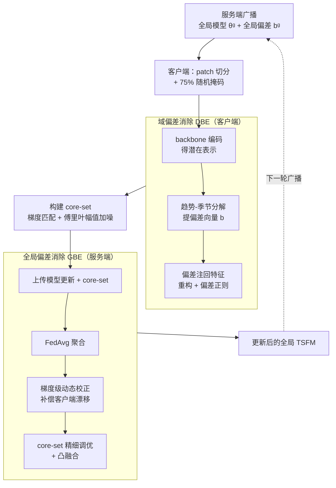

# FeDaL: Federated Dataset Learning for General Time Series Foundation Models

**会议**: ICLR 2026  
**arXiv**: [2508.04045](https://arxiv.org/abs/2508.04045)  
**代码**: [GitHub](https://github.com/shengchaochen82/FeDaL)  
**领域**: 时间序列 / 联邦学习  
**关键词**: Time Series Foundation Model, Federated Learning, Dataset Heterogeneity, Domain Bias Elimination, Cross-domain Generalization

## 一句话总结

提出 FeDaL 联邦框架，通过客户端域偏差消除（DBE）和服务器全局偏差消除（GBE）从头训练通用时序基础模型，在8类下游任务上以远少于集中式TSFM的参数达到竞争甚至超越的性能。

## 研究背景与动机

**领域现状**：时序基础模型（TSFM）如 Moirai、Chronos、Time-MoE 通过大规模多域预训练获得可迁移表示，但仍依赖集中式数据访问且通常只适用于特定任务（如预测）。时序模式机器（TSPM）追求架构级通用性但逐数据集训练，零样本泛化能力受限。**现有痛点**：联邦基础模型（FFM）方向的先驱 FFTS 仅处理粗粒度的域级异质性（如气候 vs 医疗），忽略了数据集内部的结构性偏差，且不支持零样本推断，无法称为真正的基础模型。**核心矛盾**：时序数据天然孤岛化和异质化，但联邦聚合假设客户端更新是全局梯度的无偏估计——当数据集异质性严重时该假设失效，聚合后的全局模型被偏差主导。论文系统识别了三类数据集级偏差：时间分辨率偏差（相同窗口不同采样率导致信息密度不同）、物理约束偏差（不同物理规律降低跨域迁移性）、模式转变偏差（外生事件导致初始相似的趋势分歧，在聚合时被放大）。**本文目标** 在联邦学习约束下从头训练一个通用 TSFM，既能支持多种下游任务的零样本推断，又能处理数据集级的异质性。**切入角度**：联邦学习的分布式架构本身就是分解异质性的天然方案——在客户端用 DBE 消除局部偏差，在服务端用 GBE 对齐全局表示。**核心 idea**：将联邦学习从"隐私保护工具"重新定位为"异质性分解范式"，通过 DBE+GBE 双机制生产域不变的时序表示。

## 方法详解

### 整体框架

FeDaL 采用标准的"客户端训练-服务端聚合"联邦学习范式，每轮通信经历三个阶段。**客户端**侧，每个客户端持有一个时序数据集，对输入序列分 patch 并随机掩码（75%），经 backbone 编码后用域偏差消除（Domain Bias Elimination, DBE）模块把数据集特有的偏差从表示里剥出来、再做带偏差正则的重构，同时构建一个浓缩本地知识的 core-set。**服务端**侧，收到各客户端的模型更新和 core-set 后，用全局偏差消除（Global Bias Elimination, GBE）依次做 FedAvg 聚合、梯度级动态校正、core-set 精细调优三步，产出修正后的全局模型。每轮结束后服务端同时广播更新后的全局模型 $\theta^g$ 和全局偏差参考 $\mathbf{b}^g$，进入下一轮，DBE 与 GBE 一内一外协同把数据集级偏差逐步磨掉。

### 关键设计

**1. 域偏差消除（Domain Bias Elimination, DBE）：在客户端把数据集特有的非迁移偏差从表示里剥出来**

每个数据集都有自己的时间分辨率、物理约束和模式转变特征，这些偏差如果留在 backbone 里，聚合时就会污染全局模型。DBE 的做法是把它们显式分离出来：对掩码输入的潜在表示先做趋势-季节分解 $\mathbf{h}_t, \mathbf{h}_s = \text{TimeDecomp}(f_{\theta^b}(\tilde{X}), \tau)$，各分量取平均并乘以可学习缩放因子，凑成一个偏差向量 $\mathbf{b} = \text{Mean}(\mathbf{h}_t) \odot \gamma_t + \text{Mean}(\mathbf{h}_s) \odot \gamma_s$。重构时把这个偏差注回潜在特征再还原序列，目标函数为

$$\mathcal{L} = \mathbb{E}[\|f_{\theta_h}(f_{\theta_b}(\tilde{X}) + \mathbf{b}) - X\|^2] + \lambda\|\mathbf{b} - \mathbf{b}^g\|^2$$

其中 $\mathbf{b}^g$ 是服务端聚合的全局偏差参考，正则项把各客户端偏差往全局拉、防止漂移过远；mini-batch 下的偏差估计用 EMA 稳定。这里之所以用趋势-季节分解而不是简单取平均，是因为它引入了归纳偏置——$\mathbf{b}_t$ 专门吸收低频漂移、$\mathbf{b}_s$ 吸收高频周期性。一旦数据集偏移被这个偏差向量吸走，backbone 就被逼着只去学可迁移的时序结构。DBE 是即插即用模块，不改变主架构，能挂到任意 Transformer 时序模型上。

**2. 全局偏差消除（Global Bias Elimination, GBE）：在服务端清理 DBE 之后残留的跨客户端偏差**

各客户端去偏的力度并不一致，FedAvg 聚合后仍会留下残余偏差，GBE 通过两个子步骤把它磨掉。其一是**梯度级动态校正**：服务端维护一个状态向量 $\mathbf{s}^r = \mathbf{s}^{r-1} - \beta\sum_i(\theta_i^r - \theta_g^{r-1})$ 记录累积的客户端-服务端漂移，再用它修正 FedAvg 的结果 $\hat{\theta}_g^r = \tilde{\theta}_g^r - (1/\beta)\cdot\mathbf{s}^r$，把客户端各自跑偏的部分补偿回来。其二是 **core-set 调优**：每个客户端从本地数据采样小批次，通过梯度匹配 $\mathcal{L}_{\text{match}} = \sum_{x}\|\nabla_\theta f_\theta(\mathcal{C}) - \nabla_\theta f_\theta(x)\|_2^2$ 学出一组浓缩了本地知识的 core-set 向量；上传前在傅里叶域只对幅值加噪、保留相位（相位编码了周期性等语义信息，扰动它会破坏知识），既保护隐私又留住有用信号。服务端拿聚合后的 core-set 对校正过的模型再做一遍精细调优，最后凸融合两条路径 $\theta^{g,r} = \alpha\hat{\theta}^{g,r} + (1-\alpha)\theta^{gt,r}$。一句话说，梯度校正负责补漂移、core-set 调优负责用隐私安全的知识摘要把全局表示进一步对齐。

### 损失函数 / 训练策略

客户端损失由 masked patch reconstruction 和偏差正则化两部分组成。服务端执行三步：加权平均聚合、梯度校正、core-set 调优+凸融合。预训练在 LOTSA 数据集（231B 时间点，174 个数据集作为 174 个客户端）上进行。非零样本下游任务仅需一个 epoch 微调即可适配。

## 实验关键数据

### 主实验

**联邦表示学习**（Table 1，5种掩码率平均 Reconstruction MSE，越低越好）：

| 方法 | UTSD-H1 | UTSD-H2 | CTSD | 通信参数量 |
|------|---------|---------|------|-----------|
| FedAvg | 0.586 | 0.592 | 0.455 | 108.41 MB |
| FedProx | 0.583 | 0.586 | 0.444 | 108.41 MB |
| FFTS | 0.562 | 0.531 | 0.416 | 118.94 MB |
| Standalone | 0.571 | 0.567 | 0.447 | — |
| **FeDaL** | **0.551** | **0.511** | **0.387** | 110.41 MB |

相比 FFTS，FeDaL 在 UTSD 上降低 4.16% MSE，在 CTSD 上降低 8.86% MSE。

**零样本预测**（Table 4，ETT系列+Weather 平均）：

| 方法 | 类型 | Avg MSE | Avg MAE | 第一名次数 |
|------|------|---------|---------|-----------|
| **FeDaL** | FL | **0.335** | **0.365** | 3 |
| FFTS | FL | 0.348 | 0.379 | 1 |
| Moirai-base | 集中式 | 0.357 | 0.361 | 4 |
| Chronos-large | 集中式 | 0.434 | 0.400 | 1 |
| Time-MoE-ultra | 集中式 | 0.337 | 0.370 | 2 |

### 消融实验

| 配置 | UTSD MSE | CTSD MSE | 平均变化 |
|------|----------|----------|---------|
| FeDaL (完整) | 0.573 | 0.405 | — |
| w/o 偏差对齐 | 0.602 | 0.434 | ↓6.11% |
| w/o DBE | 0.637 | 0.452 | ↓9.17% |
| w/o Core-set 调优 | 0.590 | 0.430 | ↓4.57% |
| w/o 梯度校正 | 0.600 | 0.431 | ↓5.57% |
| w/o GBE | 0.610 | 0.444 | ↓8.05% |

### 关键发现

- DBE 贡献最大（去掉后平均下降 9.17%），说明局部偏差是首要问题
- GBE 中梯度校正和 core-set 调优均有独立贡献，去掉整个 GBE 下降 8.05%
- 在 full-shot 长期预测上（Table 3），FeDaL 在 ETTh1/ETTm1/Weather/ILI 上均取得最佳 MSE，12项指标中 9次第一
- 联邦缩放行为分析（首次）：更多客户端+适度参与率效果最佳，数据量增加带来稳定提升

## 亮点与洞察

- 联邦学习不仅是隐私保护手段，更是处理异质性的天然计算范式——将"数据分散"的劣势转为"偏差分解"的优势
- DBE 是即插即用模块，可加到任意 Transformer 时序模型中，不改变主架构
- Core-set 的傅里叶域加噪策略巧妙——仅扰动幅值而保留相位，因为相位编码周期性等语义信息
- 首次系统研究 TSFM 在联邦设置下的 scaling behavior，为去中心化大模型训练提供经验指导

## 局限与展望

- Core-set 调优每轮增加约 2MB 通信开销，在大规模场景下可能累积
- 仅基于 Transformer 架构验证，未测试 SSM（如 Mamba）等新型时序架构
- 超参数（$\lambda$、$\alpha$、$\beta$、core-set 大小 $K$）需仔细调优，敏感性分析显示极端值显著降低性能
- 缺乏与个性化联邦方法（如 Per-FedAvg）的深入对比

## 相关工作与启发

- **vs FFTS**：FFTS 仅处理粗粒度域级异质性、不支持零样本推断。FeDaL 处理数据集级偏差，支持8种任务零样本/单 epoch 适配
- **vs Moirai/Chronos/Time-MoE**：这些集中式 TSFM 需要汇集所有数据且参数量更大。FeDaL 在隐私保护约束下以更少参数达到竞争性能（零样本 Avg MSE 0.335 vs Time-MoE-ultra 0.337）

## 评分
- 新颖性: ⭐⭐⭐⭐ 联邦学习+时序基础模型的交叉点新颖，DBE/GBE 设计有原创性
- 实验充分度: ⭐⭐⭐⭐⭐ 8种任务、54个baseline、联邦缩放行为分析，覆盖全面
- 写作质量: ⭐⭐⭐⭐ 三类偏差的图示清晰，整体结构合理
- 价值: ⭐⭐⭐⭐ 为隐私保护场景下的通用时序建模提供了实用方案

<!-- RELATED:START -->

## 相关论文

- [\[ICLR 2026\] GTM: A General Time-series Model for Enhanced Representation Learning](gtm_a_general_time-series_model_for_enhanced_representation_learning_of_time-series.md)
- [\[ICML 2026\] FactoryNet: A Large-Scale Dataset toward Industrial Time-Series Foundation Models](../../ICML2026/time_series/factorynet_a_large-scale_dataset_toward_industrial_time-series_foundation_models.md)
- [\[ICLR 2026\] A Unified Federated Framework for Trajectory Data Preparation via LLMs](a_unified_federated_framework_for_trajectory_data_preparation_via_llms.md)
- [\[AAAI 2026\] Optimal Look-back Horizon for Time Series Forecasting in Federated Learning](../../AAAI2026/time_series/optimal_look-back_horizon_for_time_series_forecasting_in_federated_learning.md)
- [\[ICLR 2026\] Beyond Accuracy: Are Time Series Foundation Models Well-Calibrated?](beyond_accuracy_are_time_series_foundation_models_well-calibrated.md)

<!-- RELATED:END -->
