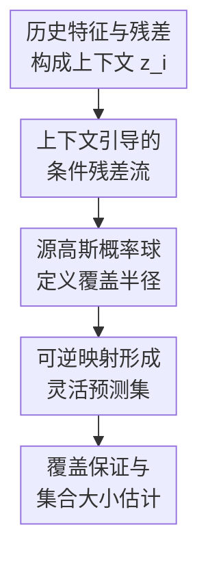

# Flow-based Conformal Prediction for Multi-dimensional Time Series

**会议**: ICLR 2026  
**OpenReview**: [https://openreview.net/forum?id=Uv3efQiPBZ](https://openreview.net/forum?id=Uv3efQiPBZ)  
**论文**: [OpenReview](https://openreview.net/forum?id=Uv3efQiPBZ)  
**代码**: https://github.com/Jayaos/flow_cp  
**领域**: 时间序列  
**关键词**: 多维时间序列、保形预测、不确定性量化、guided flow、classifier-free guidance

## 一句话总结
这篇论文提出 FCP，用带 classifier-free guidance 的 flow 学习由历史上下文条件化的多维预测残差分布，并把高斯源空间中的概率球映射成灵活形状的预测集，在风电、交通和太阳辐射数据上维持目标覆盖率的同时显著缩小集合体积。

## 研究背景与动机
**领域现状**：时间序列预测已经越来越多地依赖黑盒机器学习模型，从 LSTM 到更复杂的 Transformer / foundation model 都能给出点预测，但真实应用里只知道一个点预测往往不够。电力、交通、气象这类系统更关心“未来结果大概会落在哪个集合里”，因此保形预测（conformal prediction, CP）因为分布无关覆盖保证而成为一个自然选择。

**现有痛点**：经典 CP 最舒服的设定是样本可交换，校准集上的 non-conformity score 可以直接拿来定分位数；时间序列却天然有时间依赖，观测和残差都可能相关，直接套独立同分布式校准会让覆盖率或集合大小不稳定。另一个痛点是多维输出：很多时间序列任务同时预测多个站点、多个传感器或多个变量，简单地给每个维度单独做区间会丢掉维度间相关性，copula、椭球或矩形集合又会被固定几何形状束缚。

**核心矛盾**：这篇论文面对的是两个要求同时成立的难题：一方面，预测集要根据过去上下文自适应变化，不能把所有时间点都看成同分布；另一方面，多维预测集又要足够灵活，不能只能长成超矩形或椭球。已有方法往往只能解决其中一边：时间序列 CP 多半停留在单变量区间，多维 CP 又常默认样本可交换或依赖固定形状。

**本文目标**：作者希望构造一个适用于单条多维时间序列的保形预测方法。它需要输入任意黑盒基预测器的点预测，利用历史特征和历史残差捕获时间依赖，在每个时间点输出一个多维预测集，并同时给出边际覆盖保证以及有限样本条件覆盖误差界。

**切入角度**：作者观察到，flow 天然是可逆映射，可以在任意维空间里把一个简单源分布变成复杂目标分布；如果把源空间里的一个高斯概率球映射到残差空间，就能得到不受固定几何模板限制的预测集。再用 Transformer 编码历史上下文作为 guidance，flow 就不只是学习一个全局残差分布，而是在每个时间点学习条件残差分布。

**核心 idea**：用 guided flow 学习“历史上下文 $z_i$ 条件下的预测残差分布”，再将源高斯空间中覆盖 $1-\alpha$ 概率质量的球通过可逆 flow 映射为当前时间点的多维保形预测集。

## 方法详解

### 整体框架
FCP 的输入不是替代原来的时间序列预测器，而是接在任意点预测器 $\hat f$ 后面做不确定性量化。基预测器先给出 $\hat y_i=\hat f(x_{(i-k):i})$，FCP 计算残差 $\hat\epsilon_i=y_i-\hat y_i$，再把过去窗口内的特征与残差拼成上下文 $z_i$，由 Transformer 编码成 guidance $h_i=\mathrm{Enc}(z_i)$。

训练时，guided flow 学习从源高斯 $p_0=\mathcal N(0,\gamma I_{d_y})$ 到条件残差分布的可逆变换；预测时，先在源空间取包含 $1-\alpha$ 概率质量的球，再用同一个由 $h_i$ 条件化的 flow 把这个球推到残差空间，最后平移到点预测 $\hat y_i$ 附近形成预测集。

这个框架的关键在于，保形分数不再是原始空间里某个手工距离，而是把候选残差反向送回源空间后的半径。对于一个候选 $y$，残差为 $\hat\epsilon=y-\hat y_i$，FCP 计算 $\hat e_i(y)=\|\psi^{-1}_{1|h}(\hat\epsilon\mid h_i)\|$；只要这个半径不超过源高斯中 $1-\alpha$ 概率球的半径，$y$ 就属于预测集。

### 关键设计
**1. 上下文引导的条件残差流：把时间依赖放进残差分布本身**

时间序列里，残差的尺度、方向和维度间相关性常常会随最近历史变化。例如风电数据在某些天气状态下多个风场残差会一起偏移，交通数据在高峰期和低峰期的误差形态也不同。FCP 不是把历史依赖压成一个校准权重，而是把过去 $w$ 步的特征和残差拼成 $z_i$，再用 Transformer encoder 得到 $h_i$，让 flow 直接学习 $q(\hat\epsilon_i\mid h_i)$。

在这个视角下，flow 的目标不只是拟合训练集残差的边际分布，而是拟合每个上下文下的条件分布。guided vector field 写作 $u_{t|h}(x\mid h)$，ODE 解 $\psi_{t|h}$ 把源高斯中的样本连续推向残差空间。这样做的好处是，时间依赖被注入到集合形状里：如果当前上下文提示某些维度误差会共同放大，预测集会沿相应方向变宽；如果残差集中，集合就可以收缩，而不是所有时间点共用一个保守的全局形状。

**2. 源空间概率球定阈值：用 flow 的概率质量保持替代固定几何模板**

多维保形预测最麻烦的地方不是“覆盖率”这个目标，而是“集合应该长什么样”。矩形集合容易过大，椭球集合只能表达二阶相关，optimal transport 或 normalizing flow 方法虽然更灵活，但通常还要额外校准或依赖可交换样本。FCP 利用 flow 的可逆性：在源空间里，$p_0=\mathcal N(0,\gamma I_{d_y})$ 的球 $B_{1-\alpha}$ 有明确概率质量，半径为 $r_{1-\alpha}=\sqrt{\gamma}\,\chi^{-1}_{d_y}(1-\alpha)$，其中 $\chi^{-1}_{d_y}$ 是 $d_y$ 自由度卡方根分布的逆 CDF。

预测集定义为 $\hat C_i(z_i,\alpha)=\{y:\|\psi^{-1}_{1|h}(y-\hat y_i\mid h_i)\|\le r_{1-\alpha}\}$。这等价于先在简单高斯空间画一个概率球，再通过条件 flow 映射到残差空间。因为可微同胚会保持概率质量，作者据此给出精确非渐近边际覆盖；同时，映射后的集合可以弯曲、拉伸、偏斜，不被矩形、椭球或凸模板限制。论文还证明在相应正则条件下，这些集合是闭且连通的，避免了完全不可解释的碎片化区域。

**3. Classifier-free guidance 训练：在条件拟合与集合效率之间调节强度**

FCP 借用了生成模型中的 classifier-free guidance（CFG）思想。训练时，encoder 输出的 $h_i$ 会以概率 $p_\emptyset$ 被替换成空条件 $h_\emptyset$，同一个 vector field 同时学有条件和无条件两种状态；推理时用 $\tilde u_{t|h}=(1-w)u_{t|h}(x\mid h_\emptyset)+w u_{t|h}(x\mid h)$ 调节 guidance scale $w$。这比另训一个 classifier 更简单，也让 flow 在没有强上下文信号时仍有稳定的边际残差建模能力。

这个设计对于预测集效率很关键。$w$ 越大，模型越相信当前上下文，集合通常会更贴合局部残差分布、体积更小；但过强 guidance 可能带来轻微欠覆盖。实验中作者观察到 $w$ 通常在 $1$ 到 $1.5$ 之间有效，交通数据的 LSTM 基预测器在高维时甚至使用到 $w=1.5$。这说明 CFG 在这里不是装饰性技巧，而是一个覆盖率和集合大小之间的实际调节旋钮。

**4. Jacobian ODE 与 Sobol 采样：让不规则预测集也能被量化比较**

FCP 的预测集没有固定几何形状，因此实验中不能像矩形那样直接乘边长，也不能像椭球那样用闭式体积公式。作者把集合大小写成源空间球上 Jacobian determinant 的积分：$\int_{B_\alpha}|\det J_{\psi_{1|h}}(x\mid h)|dx$。直观地说，flow 在某个源空间区域把体积拉伸多少，映射后的预测集就有多大。

直接计算完整 Jacobian 很贵，所以论文使用 log-determinant Jacobian ODE：$\frac{d}{dt}\log|\det J_{\psi_{t|h}}|=\mathrm{div}(u_{t|h}(\psi_{t|h}(x\mid h)\mid h))$。再用 Sobol quasi-Monte Carlo 从球内更均匀地取样，估计平均体积伸缩。这个设计没有改变预测集本身，但让“灵活形状是否真的更小”可以被公平评估，也避免随机 Monte Carlo 在高维球内采样不均带来的方差。

### 一个完整示例
假设一个交通流预测任务同时预测 $d_y=4$ 个传感器位置的下一时刻流量。基预测器先给出四维点预测 $\hat y_i$，FCP 查看过去 50 个时间步的特征与历史残差，Transformer encoder 得到 $h_i$。如果当前上下文类似早高峰切换期，历史残差可能显示几个相邻传感器会一起偏高，那么 flow 在这个 $h_i$ 下会把源高斯球沿“多个位置共同变化”的方向拉长。

对于候选真实值 $y$，FCP 不逐维检查它是否落在四个独立区间里，而是先算残差 $y-\hat y_i$，再反向通过 $\psi^{-1}_{1|h}$ 回到源空间。如果回去以后距离原点不超过 $r_{0.95}$，说明它对应源高斯球内的高概率区域，候选 $y$ 被接受；否则被排除。这样得到的集合可以是一个倾斜、弯曲但连通的区域，比“每个维度各取 95% 区间再拼成盒子”更贴合多传感器误差相关性。

### 损失函数 / 训练策略
训练采用 flow matching。对每个训练样本，先计算残差 $\hat\epsilon_i=y_i-\hat y_i$ 和 guidance $h_i=\mathrm{Enc}_\theta(z_i)$，然后从源高斯采样 $x_0\sim p_0$，从 $t\sim\mathrm{Unif}(0,1)$ 采样连续时间。论文使用线性 scheduler $\alpha_t=t$、$\sigma_t=1-t$，中间点为 $x_t=\alpha_t\hat\epsilon_i+\sigma_t x_0$，目标速度为 $u_{t|\hat\epsilon}=\dot\alpha_t\hat\epsilon_i+\dot\sigma_t x_0$。

带 CFG 的训练损失为 $\mathbb E\|u^\theta_{t|h}(x_t\mid (1-\eta)h_i+\eta h_\emptyset)-u_{t|\hat\epsilon}\|^2$，其中 $\eta\sim\mathrm{Bernoulli}(p_\emptyset)$。实验中 vector field 用 Softplus MLP，ODE solver 使用 dopri5，绝对和相对容差均为 $10^{-5}$；encoder 为 Transformer，context window size 为 50，训练最多 50 epoch，并在验证集上选择模型。集合大小估计时，$d_y=2,4,8$ 分别使用 $4096,8192,16384$ 个 Sobol 样本。

## 实验关键数据

### 主实验
论文在 wind、traffic、solar 三个真实多维时间序列数据集上评估，目标覆盖率设为 0.95。每个数据集随机构造 5 条多维序列，使用 LOO bootstrap 线性回归和 LSTM 两类基预测器，并比较 MultiDimSPCI、OT-CP、CONTRA、local ellipsoid、copula 类 CP、TFT、DeepAR 等方法。下表选取最能体现结论的代表性结果，均为平均值。

| 数据集 / 基预测器 | 输出维度 | 指标 | FCP | 强基线 | 结果解读 |
|--------|------|------|------|----------|------|
| Wind / LOO Bootstrap | $d_y=2$ | 覆盖率 / 集合大小 | 0.951 / 0.88 | MultiDimSPCI 0.953 / 1.31 | 覆盖相当，FCP 集合更小 |
| Wind / LOO Bootstrap | $d_y=8$ | 覆盖率 / 集合大小 | 0.956 / 19.4 | MultiDimSPCI 0.951 / 205.5 | 高维下体积优势非常明显 |
| Traffic / LOO Bootstrap | $d_y=8$ | 覆盖率 / 集合大小 | 0.965 / 1.53 | Local Ellipsoid 0.980 / 3.82 | FCP 覆盖达标且集合更紧 |
| Solar / LSTM | $d_y=4$ | 覆盖率 / 集合大小 | 0.961 / 2.09 | MultiDimSPCI 0.976 / 6.46 | FCP 在 solar 上也保持较小体积 |

一个明显趋势是，许多 baseline 在低维时还能接近 FCP，但维度升高后体积迅速膨胀。例如 Wind + LOO 的 $d_y=8$ 下，copula 类方法集合大小达到 $77.4$ 或更大，CopulaCPTS 甚至膨胀到 $3.50\times10^5$；而 FCP 仍保持在 $19.4$。这说明固定几何或逐维组合方法在多维相关残差上会变得保守。

### 消融实验
作者做了两类消融：一是去掉 encoder，只用当前特征和上一时刻残差替代上下文编码；二是把 MLP vector field 换成 iResNet，以满足理论中 bi-Lipschitz flow 假设。下表列出核心消融结果。

| 配置 | 数据 / 维度 | 覆盖率 | 集合大小 | 说明 |
|------|---------|------|------|------|
| FCP with Encoder | Wind + LOO, $d_y=2$ | 0.951 | 0.88 | 完整模型，使用 Transformer 历史上下文 |
| FCP w/o Encoder | Wind + LOO, $d_y=2$ | 0.948 | 1.13 | 覆盖略低且集合更大 |
| FCP with Encoder | Wind + LSTM, $d_y=8$ | 0.953 | $2.48\times10^3$ | 高维 LSTM 场景仍达标 |
| FCP w/o Encoder | Wind + LSTM, $d_y=8$ | 0.935 | $5.55\times10^3$ | 去掉 encoder 后欠覆盖且体积翻倍以上 |
| FCP (MLP) | Traffic + LSTM, $d_y=8$ | 0.950 | 1.82 | 原始实现 |
| FCP (iResNet) | Traffic + LSTM, $d_y=8$ | 0.956 | 2.50 | 满足 bi-Lipschitz 假设后性能未崩 |

### 关键发现
- Encoder 是 FCP 在时间序列上有效的核心组件之一。它不是简单提升模型容量，而是把历史依赖转化为条件残差分布；去掉后，Wind 数据的高维 LSTM 场景从 0.953 覆盖降到 0.935，集合大小从 $2.48\times10^3$ 增至 $5.55\times10^3$。
- FCP 的优势随输出维度增大更明显。固定形状方法在 $d_y=8$ 时往往体积膨胀，或者为了变小牺牲覆盖；flow 映射出的不规则集合能更好贴合残差相关结构。
- CFG guidance scale 会影响覆盖率和效率。作者观察到增大 $w$ 常能缩小预测集，但会带来轻微覆盖下降，实践中 $w\in[1,1.5]$ 较稳定。
- 在 0.9 目标覆盖率下，整体趋势与 0.95 一致，但 FCP 与强基线的体积差距在部分低维 traffic / solar 场景会缩小，说明当目标覆盖较低、集合本身较小时，固定几何模板的劣势没那么极端。

## 亮点与洞察
- 把 flow 的源空间概率球用于保形预测，是这篇论文最漂亮的连接点。它把“覆盖率阈值”放在一个简单、可精确控制概率质量的空间里，再用可逆映射处理复杂多维形状。
- 这篇论文没有把时间依赖当成 CP 的外部修正项，而是直接条件化残差分布。对于时间序列不确定性量化来说，这比事后重加权更自然，因为不同历史上下文下的误差几何形状确实可能完全不同。
- CFG 在这里的角色很实用：它给了模型一个从全局残差分布到强条件残差分布的连续调节方式。这个思路可以迁移到其他条件保形预测问题，比如多机器人轨迹预测、天气场预测或多资产风险预测。
- 实验设计覆盖了两类基预测器和多种输出维度，能较清楚地区分“点预测器好坏”和“不确定性集合构造方式”的影响。FCP 不要求基预测器是可微或特定结构，这让它更像一个可插拔的后处理模块。

## 局限与展望
- FCP 的预测集虽然灵活，但训练和推理需要解 ODE，集合大小估计还要计算 divergence 与 quasi-Monte Carlo 采样；相比矩形区间或椭球集合，工程复杂度和计算成本更高。
- 理论条件仍然较强。边际覆盖依赖 flow 对目标分布有足够准确的近似，条件覆盖界还涉及 bi-Lipschitz、CDF Lipschitz、基预测误差收敛等假设；实际神经网络训练未必总能满足这些条件。
- 实验数据集主要是低到中等维度的真实传感器时间序列，最高展示到 $d_y=8$。对于更高维空间，如几十到上百个节点的电网、交通网络或气象网格，flow 体积估计和 ODE 求解成本是否仍可接受还需要验证。
- 当前方法以一步预测为主，多步预测时残差分布会受预测误差递推影响，如何将 FCP 扩展到多步 horizon、并保持不爆炸的集合大小，是一个很自然的后续方向。
- 作者也提到未来可以研究 optimal transport coupling 与 flow 的结合，进一步构造更高效的预测集。另一个值得探索的方向是用更结构化的 encoder 捕捉空间图关系，而不只是把多维序列作为一般序列输入 Transformer。

## 相关工作与启发
- **vs MultiDimSPCI**: MultiDimSPCI 也同时关注多维时间序列和保形预测，但它通过椭球集合和条件 non-conformity score 建模来处理问题。FCP 的区别是直接学习条件残差分布的可逆变换，因此预测集形状不必是椭球，在高维 wind / traffic 场景下集合体积明显更小。
- **vs Copula-based CP**: Copula 方法用经验或高斯 copula 建模多维相关性，输出多为超矩形或由边际区间组合出的区域。FCP 保留了多维相关结构，但不需要把集合限制成逐维区间的组合，因此在相关残差较强时更不保守。
- **vs OT-CP / Monge-Kantorovich ranks**: OT-CP 类方法也会把多维分数搬运到参考分布，但通常需要解 optimal transport 问题并依赖校准样本。FCP 用神经 ODE flow 学条件映射，强调时间上下文自适应；代价是训练和 ODE 推理更复杂。
- **vs CONTRA / conditional normalizing flow**: CONTRA 同样使用 flow 处理多维保形区域，但本文更明确地面向时间序列依赖，用 encoder guidance 学习 $q(\hat\epsilon_i\mid h_i)$，并通过 CFG 调节条件强度。这说明多维 CP 的 flow 思路与时间序列上下文建模可以自然融合。
- **启发**: 对很多“输出是向量、误差有结构、但又需要覆盖保证”的问题，可以先找一个概率质量可控的简单源空间，再学习到任务空间的条件可逆映射。关键不是把 CP 做成更复杂的校准规则，而是把预测集几何形状学出来。

## 评分
- 新颖性: ⭐⭐⭐⭐⭐ 用 guided flow + CFG 同时处理时间依赖和多维预测集形状，组合自然且抓住了现有 CP 方法的痛点。
- 实验充分度: ⭐⭐⭐⭐ 覆盖多个真实数据集、两类基预测器、多种维度和大量 baseline，但更高维与多步预测还缺少验证。
- 写作质量: ⭐⭐⭐⭐ 方法、理论和实验结构清楚，图 2 对不同预测集形状的直观展示很有帮助；理论部分假设较多，读者需要一定 flow 和 CP 背景。
- 价值: ⭐⭐⭐⭐⭐ 对时间序列不确定性量化很有实用价值，尤其适合多传感器、多站点预测中需要紧而可靠的多维预测集的场景。

<!-- RELATED:START -->

## 相关论文

- [\[ICLR 2026\] ResCP: Reservoir Conformal Prediction for Time Series Forecasting](rescp_reservoir_conformal_prediction_for_time_series_forecasting.md)
- [\[ICML 2026\] Simulation-Augmented Multi-Step Split Conformal Prediction for Aggregated Forecasts](../../ICML2026/time_series/simulation-augmented_multi-step_split_conformal_prediction_for_aggregated_foreca.md)
- [\[ICLR 2026\] Time-Gated Multi-Scale Flow Matching for Time-Series Imputation](time-gated_multi-scale_flow_matching_for_time-series_imputation.md)
- [\[ICLR 2026\] Online Time Series Prediction Using Feature Adjustment](online_time_series_prediction_using_feature_adjustment.md)
- [\[ICLR 2026\] Understanding Transformers for Time Series: Rank Structure, Flow-of-ranks, and Compressibility](understanding_transformers_for_time_series_rank_structure_flow-of-ranks_and_comp.md)

<!-- RELATED:END -->
