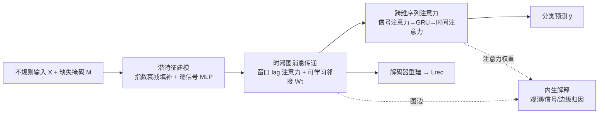

# GARLIC: Graph Attention-based Relational Learning of Multivariate Time Series in Intensive Care

**会议**: ICLR 2026  
**OpenReview**: [https://openreview.net/forum?id=4ZAwmIaA9y](https://openreview.net/forum?id=4ZAwmIaA9y)  
**代码**: 待确认  
**领域**: 不规则多元时间序列 / 可解释医疗 AI  
**关键词**: ICU 监护, 不规则采样, 缺失值填补, 图注意力, 自解释模型, 时间序列分类  

## 一句话总结
GARLIC 把"指数衰减填补 + 时滞信号图消息传递 + 跨维序列注意力"串成一条端到端管线，在 ICU 不规则多元时间序列上既刷新预后预测 SOTA，又用学到的注意力权重和图边直接给出观测级/信号级/边级的内生解释。

## 研究背景与动机
**领域现状**：ICU 持续监护会产生大量多元时间序列（生命体征、化验、用药），它们采样间隔不规则、信号异质、缺失普遍；临床落地又要求模型既准又可解释。

**现有痛点**：标准序列模型（RNN/Transformer）对不规则采样并不友好——朴素填补会污染下游任务；GRU-D、Latent-ODE、mTAND 这类专门方法虽处理了时间不规则，却普遍忽略**信号间依赖**；号称学图的 RAINDROP 实测最佳表现反而来自固定图，说明其图学习收益有限。可解释一侧，事后解释器（Integrated Gradients、SHAP）要额外算力且对相似输入给出不一致归因，而内生可解释架构（RETAIN、shapelet）要么牺牲精度，要么在不规则采样上失效。

**核心矛盾**：缺失建模、信号间关系建模、内生可解释这三件事此前被割裂处理，没人在"处理缺失"的同时既利用信号间依赖、又把解释直接焊进前向计算。

**本文目标**：用一个统一框架同时解决不规则采样、缺失、以及透明决策，且不牺牲精度与效率。

**核心idea**：**关系即解释**——所有注意力权重与图边都端到端学习，前向计算本身就是解释的来源，沿前向路径反向追踪即可得到观测级归因，无需外挂解释器。

## 方法详解

### 整体框架
GARLIC 把"局部重建"和"全局推理"拼成一条模块化管线：先在信号特异的潜空间里做时间感知填补与编码，再用可学习的时滞图做消息传递、从局部时间与信号上下文重建缺失值，最后用跨维序列注意力在时间×信号两个维度上抽全局依赖做分类。重建是辅助任务、分类是主任务，二者用交替解耦优化分开训练以避免梯度冲突。

### 关键设计
**1. 衰减填补 + 信号特异编码：让缺失不再污染动态。** 针对最近一次观测距今的间隔 $\Delta t$，用可学习衰减把陈旧观测往经验均值上拉：$\hat{x}_{k,t} = \gamma_t x_{k,t'} + (1-\gamma_t)\bar{x}_k$，其中 $\gamma_t = \exp\{-\max(0, w_k\Delta t + b_k)\}$，$w_k,b_k$ 逐信号可学。填补值与缺失指示拼成增广输入 $\tilde{x}_{k,t} = [x_{k,t}m_{k,t} + \hat{x}_{k,t}(1-m_{k,t}),\, m_{k,t}]^\top$，再交给**每个信号专属**的两层 MLP 得到嵌入 $z_{k,t}$。逐信号编码是为了保住每路信号各异的量纲、动态与语义——共享编码器会把这些差异抹平。

**2. 时滞图消息传递：在短窗口里把"时间局部性"和"信号间依赖"解耦。** 生理信号的当前值主要受近期历史和相关信号影响，于是只在长度 $\tau+1$ 的窗口内推理。先加正弦位置编码做逐信号的窗口内 lag 注意力 $\bar{e}_{k,t} = \sum_{j=t-\tau}^{t}\beta_{k,j,t}v_{k,j}$，把每路信号的短程时间上下文汇成 $\bar{E}_t$；再用一张可学习邻接矩阵 $W_\tau \in \mathbb{R}^{K\times K}$ 定义的时滞汇总图 $G_\tau$ 做消息传递 $H_t = W_\tau \bar{E}_t$，让相关信号互相传信息。把时间编码（注意力）与图传播（邻接矩阵）拆开，既能灵活抓短程动态又能建模信号关系；调节 lag $\tau$ 还能做多尺度生理依赖建模。

**3. 跨维序列注意力：先信号后时间的两级级联，先定位再融合。** 在每个时刻 $t$ 先对 $K$ 路信号做 SignalAttn 得加权汇聚 $\bar{u}_t = \sum_k \alpha^{sig}_{k,t}u_{k,t}$，再把序列 $\{\bar{u}_t\}$ 喂给 GRU 建模临床状态的渐变，最后用时间自注意力 $Y = \text{TemporalAttn}(\{g_{t'}+PE(t')\})$ 补足 GRU 的局部偏置、直接抓长程依赖，平均池化后过分类头出 $\hat{y}$。和 RETAIN（信号贡献跨时间均匀聚合）、IMV-LSTM（先聚合时间再算重要性）不同，GARLIC 在任何循环建模之前就在每个时刻算信号级注意力，从而保住瞬时信号显著性。

**4. 前向即解释的归因链 + 交替解耦优化。** 解释不是外挂而是沿前向路径反向追踪：先把时间注意力与信号注意力逐元素相乘得联合显著性 $s_{k,t'} = \sum_t \alpha^{time}_{t',t}\cdot\alpha^{sig}_{k,t}$，再用转置图 $W_\tau^\top$ 与窗口注意力 $\beta$ 把显著性在信号间传播、在时间上重分配得 $a_{k,t} = \sum_j [(W_\tau^\top S)_{k,t+j}\cdot\beta_{k,t+j,\tau-j}]$，最后用掩码把填补位的贡献均匀重分配到同信号的观测位上得 $a^{final}_{k,t}$，确保归因与前向计算完全一致。训练上，重建（要忠实还原）与分类（要判别特征）目标冲突，于是采用受 DeFRCN 启发的交替解耦优化：阶段一冻结分类头、用 $L_{rec}+\lambda_g L_{graph}+\lambda_c L_{cls}$ 更新共享模块 $\theta_{a,b}$，阶段二冻结 $\theta_{a,b}$、只用分类损失更新分类器 $\theta_c$，以此压住梯度干扰、稳住训练。总损失为 $L = \sum_{k,t}m_{k,t}(x_{k,t}-\hat{x}_{k,t})^2 + \lambda_g\|W_\tau\|_1 - \lambda_c\log\hat{y}_y$，其中 $\ell_1$ 项稀疏化图以提升可解释性并抑制过拟合。

## 实验关键数据

### 主实验表格
三个 ICU 基准（P12 院内死亡、P19 脓毒症发作、MIMIC-III 死亡），AUROC/AUPRC（%，5 seed 均值±std）：

| 模型 | P12 AUROC | P12 AUPRC | P19 AUROC | P19 AUPRC | MIMIC-III AUROC | MIMIC-III AUPRC |
|------|-----------|-----------|-----------|-----------|-----------------|-----------------|
| GRU-D | 84.45 | 50.74 | 88.73 | 47.81 | 86.36 | 56.14 |
| ODE-RNN | 83.02 | 48.64 | 89.97 | 54.29 | 88.07 | 61.03 |
| mTAND | 84.30 | 50.05 | 81.73 | 37.27 | 88.00 | 57.73 |
| RAINDROP | 83.03 | 45.91 | 87.41 | 46.33 | 87.18 | 57.06 |
| Warpformer | 84.88 | 50.62 | 89.95 | 54.10 | 89.17 | 61.52 |
| MTSFormer | 83.65 | 50.31 | 87.88 | 48.80 | 88.14 | 61.09 |
| RETAIN | 83.08 | 49.27 | 78.09 | 26.04 | 82.40 | 46.55 |
| IMV-LSTM | 84.02 | 49.08 | 84.80 | 42.87 | 86.85 | 54.96 |
| **GARLIC** | **86.40** | **56.89** | **90.96** | **55.29** | **90.09** | **64.85** |

GARLIC 在全部 6 个指标上居首。增益在缺失最严重的 P12 上尤为突出（AUPRC 比次优高约 6 个点），印证其对稀疏不规则序列的鲁棒性。

### 消融实验表格
逐模块消融（P12/P19，详见原文 Appendix D.1）证实潜特征建模、时滞图消息传递、跨维序列注意力三大模块各自都对整体表现有实质贡献，去掉任一模块都会掉点。

解释保真度（输入移除，IMV-LSTM 作对照，P12，AUROC/AUPRC %）：

| 设置 | IMV-LSTM P12 AUROC | IMV-LSTM P12 AUPRC | IMV-LSTM P19 AUROC | IMV-LSTM P19 AUPRC |
|------|--------------------|--------------------|--------------------|--------------------|
| All | 84.02 | 49.08 | 84.80 | 42.87 |
| Top 50% | 76.23 | 34.46 | 82.07 | 36.05 |
| Random 50% | 75.23 | 37.03 | 76.28 | 23.31 |
| Bottom 50% | 70.12 | 26.83 | 79.61 | 28.59 |

性能随"保留最重要 → 随机 → 保留最不重要"单调下滑，证明归因排序与真实预测力一致。

### 关键发现
- **解释保真度（ROAR 式输入移除）**：按归因保留 Top-50% 与全输入表现统计等价（TOST），且性能严格满足 Full > Top-50% > Random-50% > Bottom-50% 的单调下降（Page's L 检验），说明归因分数确实抓到了最有预测力的特征。
- **效率**：在 P12 上 GARLIC 在取得最佳精度的同时，训练时间/显存与 15 个强基线相当，没有用精度换算力。
- **泛化性**：在 ICU 之外的数据填补与人体活动识别任务上同样占优，方法不局限于医疗场景。
- **图的可信度**：学到的时滞汇总图结构经 AI 代理初步评估与临床直觉吻合，但作者坦言尚需医学专家严格验证。

## 亮点与洞察
- **"解释焊进前向"而非事后外挂**：注意力权重与图边端到端学，归因只是把前向路径反向追踪，从根上规避了 SHAP/IG 的额外算力与归因不一致问题。
- **缺失建模阶段就用信号间依赖**：多数方法只在分类时用图，GARLIC 在重建缺失时就让相关信号互传信息，这是它比 RAINDROP/MTGNN 等静态图方法更稳的关键。
- **交替解耦优化**是一个可迁移的小技巧：把"忠实重建"与"判别分类"两个互相打架的目标分阶段更新，用很低成本换来训练稳定与精度提升。

## 局限与展望
- 学到的时滞图目前只用 AI 代理粗评，**缺乏医学专家的严格临床验证**，图的临床可信度仍是未决问题。
- 衰减填补对未观测位的归因本质上是"近似重分配"（均匀摊到同信号观测位），这种近似在极端稀疏信号上可能引入解释偏差。
- 三个数据集任务都被框成二分类，对多分类/连续风险预测、以及跨医院分布漂移下的稳健性尚未充分检验。
- lag $\tau$ 作为超参需网格搜索，自适应选窗或多尺度自动融合是自然的下一步。

## 相关工作与启发
- **不规则时间序列分类**：从 GRU-D/Latent-ODE/mTAND（建时间动态）到 RAINDROP/MTGNN（引图），GARLIC 的差异化在于"重建阶段即用信号间依赖"。
- **时间序列可解释**：事后派（IG、SHAP、LIME）vs 自解释派（RETAIN、shapelet、IMV-LSTM、DARNN）；GARLIC 属自解释派，但通过在循环建模前就算信号级注意力、并把图传播纳入归因链，解决了前人"先聚合后归因丢失瞬时显著性"的问题。
- **启发**：当任务对可解释性是硬约束时，与其训练后再找解释，不如把解释结构设计成前向计算的一部分——既省算力又天然自洽，这条思路可迁移到其他高风险决策场景。

## 评分
- **新颖性**: ⭐⭐⭐⭐ — 单个组件（衰减填补、图消息传递、注意力）非首创，但"重建阶段用图依赖 + 前向即归因 + 交替解耦优化"的组合在不规则医疗时序上是有意义的新拼装。
- **实验充分度**: ⭐⭐⭐⭐ — 三大 ICU 基准 + 15 基线 + 逐模块消融 + ROAR 式解释保真度（含 TOST/Page's L 统计检验）+ 效率与跨域泛化，覆盖很全；唯独图的临床验证缺位。
- **写作质量**: ⭐⭐⭐⭐ — 动机—方法—解释链条清晰，公式与图配合到位，归因推导讲得明白。
- **价值**: ⭐⭐⭐⭐ — 在临床高风险场景同时拿下精度与内生可解释，且效率不退步，落地价值明确。

<!-- RELATED:START -->

## 相关论文

- [\[ICLR 2026\] CPiRi: Channel Permutation-Invariant Relational Interaction for Multivariate Time Series Forecasting](cpiri_channel_permutation-invariant_relational_interaction_for_multivariate_time_se.md)
- [\[ICLR 2026\] Relational Transformer: Toward Zero-Shot Foundation Models for Relational Data](relational_transformer_toward_zero-shot_foundation_models_for_relational_data.md)
- [\[ICLR 2026\] ASTGI: Adaptive Spatio-Temporal Graph Interactions for Irregular Multivariate Time Series Forecasting](astgi_adaptive_spatio-temporal_graph_interactions_for_irregular_multivariate_tim.md)
- [\[ICLR 2026\] Learning Recursive Multi-Scale Representations for Irregular Multivariate Time Series Forecasting](learning_recursive_multi-scale_representations_for_irregular_multivariate_time_s.md)
- [\[ICLR 2026\] Local Geometry Attention for Time Series Forecasting under Realistic Corruptions](local_geometry_attention_for_time_series_forecasting_under_realistic_corruptions.md)

<!-- RELATED:END -->
