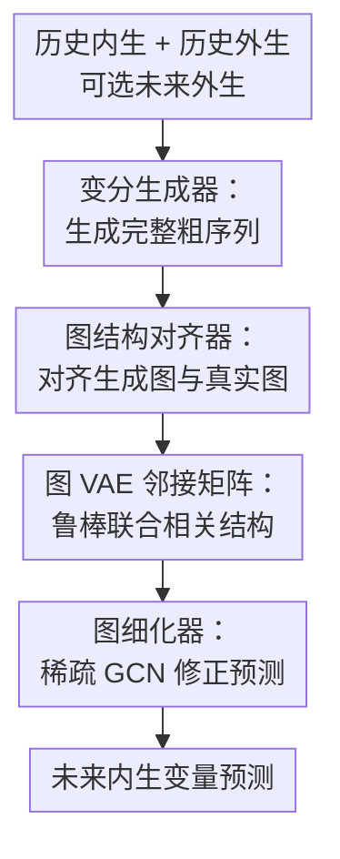

# GCGNet: Graph-Consistent Generative Network for Time Series Forecasting with Exogenous Variables

**会议**: ICLR 2026  
**OpenReview**: [https://openreview.net/forum?id=EO5jwQ5NCw](https://openreview.net/forum?id=EO5jwQ5NCw)  
**论文**: OpenReview  
**代码**: https://github.com/decisionintelligence/GCGNet  
**领域**: 时间序列预测  
**关键词**: 外生变量预测, 图一致性, 生成式时间序列, Graph VAE, 鲁棒预测  

## 一句话总结
GCGNet 面向带外生变量的时间序列预测，把生成的完整序列和真实完整序列都转成 patch 级图结构，用图一致性约束生成器，再用稀疏图卷积细化预测，在 12 个真实数据集上取得了多数指标第一，并且在未来外生变量缺失和外生变量被遮蔽时仍保持较强鲁棒性。

## 研究背景与动机
**领域现状**：带外生变量的时间序列预测不是只看目标变量自己的历史，而是同时利用内生变量 $X^{endo}$、历史外生变量 $X^{exo}$，以及很多场景下可提前获得的未来外生变量 $Y^{exo}$。例如电价预测里，目标是未来电价，外生变量可以是未来负载、风电、气象或水文信息；这些信号并不等同于目标序列，但会直接影响目标的未来走势。

**现有痛点**：主流深度模型通常把“时间相关性”和“通道相关性”分开建模。有些方法先沿时间维度编码，再通过 cross-attention 或 MLP 融入外生变量；另一些方法先聚合通道，再做时间预测。这种两步策略看起来清晰，但它把一个本来耦合的问题切成两个顺序子问题：第二步可能覆盖第一步已经学到的关系，第一步也可能在没有充分外生信息的情况下形成偏差。

**核心矛盾**：外生变量真正有价值的地方恰恰在于“某个外生通道在某个未来时间段影响某个内生目标”。这不是单纯的时间依赖，也不是单纯的通道依赖，而是跨时间片、跨变量的联合相关性。同时，真实数据里常有传感器故障、传输错误、人工记录错误或缺失值，直接从观测序列里估计相关性容易被噪声牵着走。

**本文目标**：作者希望构建一个能同时处理历史外生变量和未来外生变量的预测框架；在未来外生变量不可用时，也能用模型生成的外生未来补位；更关键的是，模型要学习鲁棒的联合相关结构，而不是只依赖点对点预测误差。

**切入角度**：论文把“相关性”显式表示成图。每个时间 patch 是图节点，边表示 patch 之间的关系。这样一来，时间依赖和通道影响可以通过同一张图里的边共同表达。再引入 VAE，是为了让图结构和未来序列都不是从带噪观测里做硬匹配，而是在潜变量空间中学习更稳定的分布与结构。

**核心 idea**：先用 VAE 生成粗预测，再把“生成序列的图结构”和“真实序列的图结构”对齐，最后用这张生成图反过来细化预测，从而让模型既预测数值，也预测数值背后的联合相关结构。

## 方法详解

### 整体框架
GCGNet 的输入包括历史内生序列 $X^{endo} \in \mathbb{R}^{N \times T}$、历史外生序列 $X^{exo} \in \mathbb{R}^{D \times T}$，以及可选的未来外生序列 $Y^{exo} \in \mathbb{R}^{D \times F}$；输出是未来内生序列 $\hat{Y}^{endo} \in \mathbb{R}^{N \times F}$。整个模型分三步：Variational Generator 先生成未来的粗预测，Graph Structure Aligner 把生成序列和真实序列都转成图并做结构对齐，Graph Refiner 使用生成图的邻接矩阵做消息传播，把粗预测修成最终预测。

这套流程的关键不是“先预测再加一个图模块”这么简单。Graph Structure Aligner 产生的图结构既是训练时的约束，也是 Graph Refiner 的实际输入；如果图学得无意义，最终预测损失会直接变差。因此，图结构不是辅助可视化，而是被迫参与预测闭环。

### 关键设计
**1. 变分生成器：先补出完整未来，再让后续模块有结构可对齐**

带外生变量预测的难点之一是输入是否完整并不固定：训练时有真实未来内生变量 $Y^{endo}$ 可监督，推理时没有；未来外生变量 $Y^{exo}$ 在某些业务中可提前获得，在另一些业务中又不可用。GCGNet 用 Variational Generator 先生成粗预测 $\tilde{Y}^{endo}$，并在需要时生成 $\tilde{Y}^{exo}$。如果真实未来外生变量可用，就直接使用 $Y^{exo}$；如果不可用，就用生成的 $\tilde{Y}^{exo}$ 代替。

形式上，生成器产生 $\tilde{Y}^{endo}=VAE(X^{endo})$、$\tilde{Y}^{exo}=VAE(X^{exo})$，再把历史外生、未来外生或其生成替代、历史内生、未来内生粗预测拼成一条完整序列 $\tilde{S}$。这一点很重要：图对齐器不只看历史，也不只看预测段，而是看由历史和未来共同构成的完整序列。这样它能学习“过去某种外生形态如何延伸到未来目标”的结构，而不是把未来段当成一个孤立回归目标。

**2. 图结构对齐器：用图级一致性约束生成器，而不是只看点级误差**

如果只用 $\|Y^{endo}-\hat{Y}^{endo}\|$ 这样的点级损失，模型可能预测到数值接近，却没有学到正确的相关结构。GCGNet 因此把真实完整序列 $S$ 和生成完整序列 $\tilde{S}$ 都切成非重叠 patch，再映射成 patch embedding，得到 $S_p, \tilde{S}_p \in \mathbb{R}^{(N+D) \times L \times d}$。其中 $L=\lceil (T+F)/p \rceil$，$p$ 是 patch size。

随后，Graph VAE 先通过两个投影矩阵计算 patch 之间的关系：$A'=GELU((W_1X_p)(W_2X_p)^\top)$，再用 $\tilde{A}=\frac{1}{2}(A'+A'^\top)$ 做对称化，使图成为无向关系图。这个原始图还可能带有噪声，所以论文继续用 VAE 生成更平滑的邻接矩阵 $A=VAE(\tilde{A})$。真实序列得到 $A$，生成序列得到 $\hat{A}$，训练时最小化 $L_{align}=\|A-\hat{A}\|_1$。

这个设计把“预测值像不像”推进到“预测值之间的关系像不像”。对于带外生变量的预测，这比单点误差更贴近问题本质：比如未来负载和电价之间的联动、历史风电和未来价格波动之间的耦合，都可以在 patch 图结构里体现。Graph VAE 的作用则是避免把每一次观测噪声都当成真实边，从而让结构对齐更稳。

**3. 图细化器：让学到的图必须服务最终预测，避免结构模块退化**

Graph Structure Aligner 里真实图和生成图来自共享 Graph VAE，这带来一个潜在退化风险：Graph VAE 可能无论输入什么都输出相似邻接矩阵，结构对齐损失看似很小，但图本身没有携带有效信息。论文用 Graph Refiner 来打破这个漏洞：生成图 $\hat{A}$ 不能只用于算一个辅助 loss，还必须参与最终预测。

具体做法是，Graph Refiner 把生成序列 patch embedding $\tilde{S}_p$ 当作节点特征，把 $\hat{A}$ 当作边权。由于完整邻接矩阵可能过密，里面有不少弱相关或噪声边，模型先对每个节点保留 top-$k$ 边，得到稀疏邻接矩阵 $A_s$。然后多层 GCN 在 $A_s$ 上传播信息，得到 refined representation $H=GCN(\tilde{S}_p,A_s)$，最后 flatten 并线性投影成 $\hat{Y}^{endo}$。

这一步的逻辑很漂亮：如果 Graph VAE 学到的是无意义图，GCN 聚合就会把错误信息传进预测头，预测损失会惩罚它；如果图能捕获关键时间 patch 和变量 patch 之间的依赖，Graph Refiner 就能用这些依赖修正粗预测。于是图结构不再只是“看起来合理”的中间产物，而是被最终任务检验的可用结构。

### 一个完整示例
以电价预测为例，假设模型要用过去 168 小时的电价、负载、风电，以及未来 24 小时的负载和风电预测未来 24 小时电价。Variational Generator 先根据历史电价生成一个粗略的未来电价轨迹；如果未来外生变量已经有预测值，就把真实的未来负载和风电接进完整序列；如果没有，就生成未来外生变量的替代版本。

接着，模型把“历史负载 + 未来负载 + 历史风电 + 未来风电 + 历史电价 + 粗未来电价”切成 patch。某些 patch 可能对应夜间低负载，另一些 patch 对应白天高负载或风电波动。Graph VAE 会估计这些 patch 之间的边，例如未来高负载 patch 和未来电价上升 patch 之间应有较强联系，历史周期相似的电价 patch 之间也应有联系。Graph Structure Aligner 要求生成序列形成的这张图接近真实序列的图。

最后 Graph Refiner 只保留每个 patch 最重要的若干邻居，让 GCN 在这些强连接上聚合信息。这样，一个粗略电价曲线如果只复刻历史周期，却没有响应未来负载变化，就会在图传播阶段被外生变量相关 patch 修正；如果某个外生通道含噪，top-$k$ 稀疏化和 Graph VAE 的平滑潜变量也能降低弱噪声边的影响。

### 损失函数 / 训练策略
GCGNet 的总损失由四部分组成。第一部分是预测损失 $L_f=\|Y^{endo}-\hat{Y}^{endo}\|_1$，直接监督最终输出。第二部分是图结构对齐损失 $L_{align}=\|A-\hat{A}\|_1$，要求生成序列和真实序列的图结构一致。第三和第四部分分别是 Variational Generator 的 KL 正则 $L^V_{KL}$ 与 Graph VAE 的 KL 正则 $L^G_{KL}$，用于约束两个 VAE 的潜变量分布。

总目标为 $L_{total}=L_f+L_{align}+L^V_{KL}+L^G_{KL}$。这里没有复杂的分阶段训练描述，核心是多目标端到端优化：预测损失保证最终数值准确，结构对齐损失让粗预测学到联合相关结构，KL 项让生成器和图生成器保持分布式、鲁棒的表示。

实验设置上，除 Colbun 和 Rapel 外，短期预测使用 lookback 168、horizon 24，长期预测使用 lookback 720、horizon 360；Colbun 和 Rapel 使用 lookback 60/180 与 horizon 10/30。指标为 MSE 和 MAE，所有模型都在相同输入设置下比较。

## 实验关键数据

### 主实验
论文在 12 个真实带外生变量数据集上比较了 10 个 baseline，包括 TimeXer、TFT、TiDE 这类原生支持未来外生变量的方法，也包括 DUET、CrossLinear、Amplifier、TimeKAN、xPatch、PatchTST 等经 MLP fusion 扩展后可接入未来外生变量的方法。整体上，GCGNet 在 MSE 上拿到 30 个第一，在 MAE 上拿到 32 个第一，是表 1 中最稳定的模型。

| 数据集 | 指标 | GCGNet Avg | 最强对比模型 Avg | 说明 |
|--------|------|------------|------------------|------|
| NP | MSE / MAE | 0.346 / 0.337 | xPatch 0.378 / 0.370 | 电价预测，GCGNet 在长短期平均上明显领先 |
| PJM | MSE / MAE | 0.093 / 0.186 | xPatch 0.104 / 0.194 | GCGNet 同时优于 TimeXer、TFT 与 xPatch |
| DE | MSE / MAE | 0.387 / 0.387 | Amplifier/TimeKAN 0.473 / 0.441 | 德国电价场景提升较明显 |
| Energy | MSE / MAE | 0.122 / 0.262 | TFT 0.130 / 0.283 | 外生能源结构变量下仍保持第一 |
| Sdwpfm1 | MSE / MAE | 0.416 / 0.449 | CrossLinear 0.417 / 0.478 | 风电数据上 MSE 接近但 MAE 更好 |
| Colbun | MSE / MAE | 0.098 / 0.154 | TimeKAN 0.128 / 0.175 | 水文日尺度预测优势明显 |
| Rapel | MSE / MAE | 0.212 / 0.259 | TimeKAN 0.249 / 0.311 | 两个 horizon 平均均领先 |

### 消融实验
消融实验选取 NP、PJM、DE、Energy 四个数据集，比较替换/移除关键组件后的平均表现。最直观的结论是：Graph Refiner 不能删，Graph VAE 也不能简单替换成确定性 Graph Learner；否则结构对齐要么失去作用，要么容易退化。

| 配置 | 平均 MSE | 平均 MAE | 说明 |
|------|---------|---------|------|
| GCGNet | 0.323 | 0.360 | 完整模型 |
| Replace Variational Generator | 0.363 | 0.386 | 用 MLP 替代生成器 VAE 后变差，说明变分生成有用 |
| Remove $L_{align}$ | 0.474 | 0.446 | 去掉结构对齐后退化明显，图一致性是核心监督 |
| Replace Graph VAE | 0.449 | 0.433 | 确定性 Graph Learner 不如 Graph VAE 鲁棒 |
| Remove Graph Refiner | 0.605 | 0.513 | 最大幅度退化，说明图必须进入预测闭环 |

### 关键发现
- 在未来外生变量不可用时，GCGNet 仍能用 Variational Generator 生成 $\tilde{Y}^{exo}$ 补位。表 3 的平均结果显示，它在 12 个数据集上取得 8 个 MSE 第一和 7 个 MAE 第一；例如 NP 为 0.425 / 0.377，优于 TimeXer 的 0.440 / 0.383，也优于 PatchTST 的 0.457 / 0.401。
- 缺失/噪声外生变量实验采用 Zero 和 Random 两种遮蔽方式，并测试 10%、30%、50% 三个缺失率。表 4 的平均结果中，GCGNet 在 Energy 的 Zero mask 下为 0.070 / 0.203，明显好于 TimeXer 的 0.122 / 0.273；在 NP 的 Zero mask 下为 0.204 / 0.235，也优于 TimeXer 的 0.289 / 0.296。
- 生成式设计对鲁棒性贡献很明确。表 5 比较 GCGNet 和 w/o VAE，在外生变量部分缺失时，GCGNet 在所有列出的数据集上都优于去 VAE 版本；例如 DE Zero mask 下从 w/o VAE 的 0.453 / 0.430 改善到 0.292 / 0.336。
- 可视化分析说明两步融合容易被未来外生变量“带偏”。PatchTST 加 MLP fusion 后，预测曲线过度跟随未来 grid load；CrossLinear 先做通道相关再做时间相关，也会破坏原本的周期模式。GCGNet 的预测更接近 ground truth，支持“联合建模”这一动机。
- 参数敏感性显示，patch dimension 和 VAE latent dimension 并非越大越好，64 到 256 往往更稳；GCN 一到两层更合适，过深会有 over-smoothing；稀疏率约 50% 时能在去噪和保留关键边之间取得较好平衡。

## 亮点与洞察
- 最核心的亮点是把预测结果背后的相关结构纳入监督。很多预测论文只关心最后数值误差，但 GCGNet 要求生成序列形成的图结构接近真实序列形成的图结构，这让模型学习“为什么这样预测”。
- Graph Refiner 是一个很有效的防退化设计。结构对齐模块如果只产生辅助 loss，很容易学到投机解；把邻接矩阵接入 GCN 并影响最终预测，相当于让图结构接受任务损失的检查。
- Variational Generator 的价值不只是“生成一个粗预测”，还在于处理未来外生变量不可用的情形。它让同一个框架能覆盖 $Y^{exo}$ available 和 unavailable 两种场景，工程适用范围更宽。
- 图结构用 patch 而不是单个时间点作为节点，是一个务实选择。patch 降低了序列长度，也让边表示更稳定的局部片段关系，而不是被每个时刻的瞬时噪声牵动。
- 这套思路可以迁移到其他带 covariate 的预测任务，例如负荷预测、销量预测、交通速度预测和工业过程监控。凡是外生变量对目标变量存在滞后或同步影响，都可以考虑用结构一致性约束替代单纯拼接融合。

## 局限与展望
- 模型结构比常见 MLP/Transformer 预测器更复杂，同时包含两个 VAE、图构建、稀疏化和 GCN，训练和调参成本更高。论文虽然给了灵敏度分析，但在大规模高维工业数据上，图构建开销仍值得进一步评估。
- 论文主要在外生变量可提前获得或可近似估计的数据集上验证。现实业务里未来外生变量的预测误差可能具有系统偏差，而不仅是随机缺失或 $N(0,1)$ 噪声；GCGNet 对这种偏差的鲁棒性还需要更贴近业务的实验。
- Graph VAE 生成的是 patch 级邻接矩阵，可解释性比黑箱预测强，但论文没有深入分析具体边是否对应真实领域规律。例如电价数据里哪些负载/风电 patch 与价格 patch 形成强边，如果能结合领域知识验证，会更有说服力。
- 消融证明 Graph Refiner 很关键，但也暗示模型强依赖图质量。若数据中外生变量与目标关系很弱，或关系随 regime 快速切换，固定训练出的图生成机制可能仍会误导预测。
- 后续可以探索动态稀疏率、自适应 GCN 深度，或把结构对齐从 $L_1$ 邻接矩阵距离扩展到更稳的图分布距离。另一个有价值方向是把 Graph VAE 的边解释输出给用户，作为预测系统的诊断信号。

## 相关工作与启发
- **vs TimeXer / ExoTST**: 这类方法通常先建模时间依赖，再通过 cross-attention 或类似机制引入外生变量。GCGNet 的区别在于不把外生变量作为后处理信息，而是把时间和通道相关性统一放进图结构中对齐和传播，因此更适合捕获“未来外生变量影响未来内生变量”的联合关系。
- **vs TFT / CrossLinear**: TFT 先做变量选择再建模时间，CrossLinear 先聚合通道再预测时间；它们都属于顺序两步策略。GCGNet 用 patch 图把通道与时间片的关系同时表示，减少第二步覆盖第一步的风险。
- **vs PatchTST / xPatch**: PatchTST 的 patch 思想强调长序列时间建模，但原始形式偏 channel-independent，不擅长外生变量影响目标变量的建模。GCGNet 同样使用 patch，但 patch 进入的是图结构对齐与 GCN 传播，目标是联合相关性而非纯时间表征。
- **vs 图神经网络时间序列方法**: 很多图时序方法依赖预定义空间图或直接学习确定性邻接矩阵。GCGNet 的图不是物理拓扑，而是从完整序列 patch 里生成的相关图，并用 Graph VAE 做去噪与不确定性建模，这更适合外生变量场景中变化且带噪的关系。
- **vs D3VAE / TimeVAE 等生成式时间序列方法**: 这些方法证明了生成模型能捕获潜在时间结构。GCGNet 的扩展点在于，生成器不只服务未来序列生成，还要通过图结构对齐与图细化器共同服务预测任务。

## 评分
- 新颖性: ⭐⭐⭐⭐☆ 将生成式预测、Graph VAE 结构对齐和图卷积细化组合到外生变量预测中，问题定义贴得很紧，但各组件本身并非全新。
- 实验充分度: ⭐⭐⭐⭐⭐ 12 个数据集、两种未来外生变量设置、缺失/噪声实验、消融、可视化和超参灵敏度都覆盖到了。
- 写作质量: ⭐⭐⭐⭐☆ 主线清楚，动机和模块闭环讲得比较完整；不足是部分符号和表格很密，Graph VAE 的实现细节还可以更透明。
- 价值: ⭐⭐⭐⭐⭐ 对需要利用天气、负载、风电、水文等外部信号的真实预测系统很有参考价值，尤其是“让结构必须参与预测”的防退化思路可迁移性强。

<!-- RELATED:START -->

## 相关论文

- [\[ICML 2026\] DAG: A Dual Correlation Network for Time Series Forecasting with Exogenous Variables](../../ICML2026/time_series/dag_a_dual_correlation_network_for_time_series_forecasting_with_exogenous_variab.md)
- [\[ICLR 2026\] Aurora: Towards Universal Generative Multimodal Time Series Forecasting](aurora_towards_universal_generative_multimodal_time_series_forecasting.md)
- [\[ICLR 2026\] Routing Channel-Patch Dependencies in Time Series Forecasting with Graph Spectral Decomposition](routing_channel-patch_dependencies_in_time_series_forecasting_with_graph_spectra.md)
- [\[ICLR 2026\] GARLIC: Graph Attention-based Relational Learning of Multivariate Time Series in Intensive Care](garlic_graph_attention-based_relational_learning_of_multivariate_time_series_in_.md)
- [\[ICLR 2026\] ASTGI: Adaptive Spatio-Temporal Graph Interactions for Irregular Multivariate Time Series Forecasting](astgi_adaptive_spatio-temporal_graph_interactions_for_irregular_multivariate_tim.md)

<!-- RELATED:END -->
