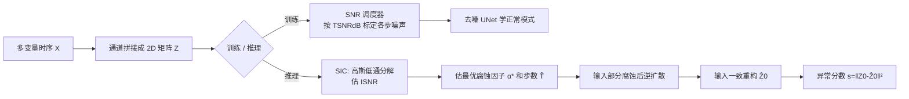

# ICDiffAD: Implicit Conditioning Diffusion Model for Time Series Anomaly Detection

**会议**: ICLR 2026  
**OpenReview**: [https://openreview.net/forum?id=HIkuWAikXC](https://openreview.net/forum?id=HIkuWAikXC)  
**代码**: 待确认  
**领域**: 时间序列异常检测 / 扩散模型  
**关键词**: 时间序列异常检测, 扩散模型, SNR 噪声调度, 隐式条件生成, 输入一致重构  

## 一句话总结
针对扩散模型用于时间序列异常检测时"从高斯噪声里随机重构、把正弦重建成余弦"的固有随机性问题，ICDiffAD 用一个基于信噪比（SNR）的噪声调度器和一个按样本估计最优腐蚀强度的隐式条件机制，让逆扩散从"部分腐蚀的输入"而非纯噪声出发，在保持生成灵活性的同时实现输入一致重构，把误报率砍掉 60%。

## 研究背景与动机
**领域现状**：时间序列异常检测（TSAD）的主流是重构式方法——用自编码器、VAE、Transformer 等在无异常数据上学正常模式，把重构误差当异常分数。近年来生成式模型（GAN、扩散模型）因为能通过迭代去噪逼近复杂数据流形而被寄予厚望，扩散模型尤其擅长刻画复杂时序动态。

**现有痛点**：时间序列有两个天生的麻烦——(i) **内在噪声**，异常信号被随机抖动、传感器伪影、测量误差淹没，模型容易"记噪声"而非学到因果时序依赖；(ii) **时序异质性**，非平稳分布和 regime shift 让训练动态不稳定。这两点直接压低了重构保真度、推高误报。而扩散模型虽然理论占优，却带来一个被忽视的致命矛盾：**生成式模型本质上会从高斯噪声里生成多个"看起来都合理"的重构**（论文 Figure 1 里把正弦波在低 SNR 下重建成余弦波），这与重构式 TSAD"必须输入一致重构"的需求直接冲突，随机性在高方差区域尤其会爆炸式增加误报。

**核心矛盾**：已有缓解办法（self-conditioning、部分插值、mask-then-impute 的填补式框架）试图引入部分原始信息作条件，但**会把异常点本身当成条件输入**，导致误差在重构过程中持续累积、局部异常被错误地"保留"下来——既要生成灵活性，又要重构确定性，这个 realism-fidelity 权衡是 vanilla diffusion 在 TSAD 上的死结。

**本文目标**：在不牺牲扩散模型生成能力的前提下，实现**输入一致重构**，并把扩散过程那三个相互纠缠又各自难调的超参（βmin、βmax、T）替换成一个直观、物理可解释的 SNR 量。

**核心 idea**：**用 SNR 统一并量化"加多少噪声"**——训练侧用 SNR 调度器在可量化的腐蚀谱上学正常模式；推理侧用 SNR 隐式条件机制按每个输入估计"恰好够引导"的最优噪声强度和去噪步数，让逆扩散从部分腐蚀的输入出发，既冲掉异常成分又留住正常趋势。

## 方法详解

### 整体框架
ICDiffAD 把多变量时间序列 $X \in \mathbb{R}^{L\times K}$ 沿特征维拼成 2D 矩阵 $Z$（借鉴 DiffAD，让卷积核能学跨变量相关性），然后跑两件事：训练阶段由 **SNR 调度器**决定每一步注入的噪声尺度，让模型在 SNR 标定的多种腐蚀强度下学正常模式；推理阶段由 **SNR 隐式条件（SIC）机制**对每个测试样本估计两个关键量——最优腐蚀因子 $\bar\alpha_{\hat T}$ 和去噪步数 $\hat T$，用它们把输入"部分腐蚀"后启动逆扩散，得到输入一致的重构 $\hat Z_0$。异常分数就是原序列与重构的 L2 距离 $s=\lVert Z_0-\hat Z_0\rVert_2^2$，越大越异常。

### 关键设计

**1. SNR 调度器：把三个纠缠超参换成一个物理量。** 传统噪声调度由 $\beta_{min}, \beta_{max}, T$ 共同决定，三者定义着不同却相关的物理动态——$T$ 大、$\beta_{max}-\beta_{min}$ 小会得到更细的去噪过程，但 $T$ 大推理慢、谱宽太小又会腐蚀不足训不好。ICDiffAD 把它们统一重参数化为一个目标信噪比 $\text{TSNR}_{dB}=10\log_{10}\frac{M_T}{M_0-M_T}$，其中 $M_0=\mathbb{E}[\lVert Z_0\rVert_F^2]$ 是初始信号能量、$M_T$ 是终态能量。由 $M_t=\alpha_t M_{t-1}$ 的递归关系，每步衰减因子被显式解出：

$$\alpha_t=\exp\!\Big(\frac{\log(M_T/M_0)}{\sum_{s=1}^{T} g(s)}\cdot g(t)\Big)$$

这里 $g(t)$（如线性 $g(t)=t$）只负责注入噪声的整体趋势走向，而 SNR 调度器保证**全过程能量耗散正好等于用户设定的 TSNR**，终态噪声水平精确命中目标。好处有二：一是从可解释的 TSNRdB 反推 $\beta$ 系列，免去启发式调参；二是每步的瞬时信噪比 $\text{SNR}(t)=\frac{\bar\alpha_t}{1-\bar\alpha_t}$ 都可量化（$\bar\alpha_t=\prod_{s=1}^t\alpha_s$ 是累计信号保留量），让"这一步保留了多少信号能量"变得可读可控。消融里 TSNR 越低（注噪越狠）模型在多尺度异常数据集上越好（MSL/SMD/PSM 从 30dB 到 -20dB 分别涨 10.3/7.5/16.2 个点），正是因为它逼着模型在不同噪声尺度上都学会重构。

**2. SNR 隐式条件（SIC）：按样本估"恰好够"的腐蚀强度。** 这是解决随机性的关键。vanilla 扩散从单个噪声 $Z_T$ 出发会有多条轨迹 $\{Z_t^{(i)}\}$，导致异常分数方差不可约。SIC 的思路是：每个输入需要的"原始信息保留量"不同，干脆按样本估出来。对测试实例 $Z_{test}$ 先做零相位高斯低通分解 $Z_{test}=Z_{con}+N$，其中 $Z_{con}=G_\sigma(Z_{test})$ 是低频（正常趋势）、$N$ 是残差（含高频噪声与异常），据此算推理信噪比：

$$\text{ISNR}=\frac{\lVert G_\sigma(Z_{test})\rVert_F^2}{\lVert Z_{test}-G_\sigma(Z_{test})\rVert_F^2+\delta}$$

然后两阶段定参：**Phase 1** 由 ISNR 和样本统计量推最优腐蚀因子 $\alpha^*=\frac{\text{ISNR}}{\text{ISNR}+\mu^2(Z_{test})+\sigma^2(Z_{test})}$；**Phase 2** 因为 $\alpha^*$ 未必落在预训练调度 $\{\bar\alpha_t\}$ 上，投影到最近的可行步 $\hat T=\arg\min_{t\le T}\lvert\bar\alpha_t-\alpha^*\rvert$。最终把输入腐蚀成 $Z_{\hat T}=\sqrt{\bar\alpha_{\hat T}}Z_{test}+\sqrt{1-\bar\alpha_{\hat T}}\epsilon$ 再逆扩散——这一步噪声**恰好够冲掉异常高频成分、又不抹掉正常相关性**，从而避开了"既不能腐蚀不足保留异常、也不能过度腐蚀丢失趋势"的两难。

**3. 隐式条件 vs 显式条件：不把异常喂进去当条件。** 已有填补式扩散（DiffAD、ImDiffusion）走 mask-then-impute，把一部分输入当作可见条件序列去填补另一部分——问题是被当条件的那部分可能本身含异常，误差会沿重构过程累积。ICDiffAD 的"隐式"在于：它**不显式地把某段原始数据作为条件喂进网络**，而是通过 SNR 估出的 $\bar\alpha_{\hat T}$ 控制"从多腐蚀的输入起步"这一隐含状态来引导生成，逆过程 $p_\theta(Z_{0:\hat T}\mid Z_{test}^{con})=p_\theta(Z_{\hat T})\prod_{k=1}^{\hat T}p_\theta(Z_{k-1}\mid Z_k)$ 不再依赖任何可能被污染的条件段，从根上杜绝了异常信息被"保留并放大"的风险，同时保证训练-推理 SNR 一致。

## 实验关键数据

### 主实验
五个真实多变量基准（MSL / SMAP / SMD / PSM / SWaT），五随机种子均值，采用**严格的逐点精确匹配**评估协议（刻意避开 point-adjustment 带来的高估）。下表为各方法平均 F1（%）：

| 类别 | 方法 | 平均 F1 |
|------|------|---------|
| 经典 | IF | 37.65 |
| 经典 | CBLOF | 38.98 |
| 重构式 | SARAD（前 SOTA） | 38.71 |
| 重构式 | TimesNet | 26.72 |
| 扩散式 | DiffAD | 24.24 |
| 扩散式 | ImDiffusion | 9.75 |
| — | **ICDiffAD（本文）** | **43.81** |

逐数据集看，ICDiffAD 在 MSL（33.17）、SMAP（28.01）、SMD（23.68）、PSM（56.87）上均为最佳或并列最佳，SWaT 上 77.34 略逊于经典方法（因 SWaT 异常太简单，朴素方法即可拿下）。

### 消融实验
组件逐步叠加（平均 F1）：

| IC | SNR | SIC | 平均 F1 |
|----|-----|-----|---------|
| × | × | × | 36.52 |
| ✓ | × | × | 40.27 |
| ✓ | ✓ | × | 42.74 |
| ✓ | ✓ | ✓ | **43.81** |

隐式条件（IC）单独加就涨 3.75 个点，再叠 SNR 调度器涨 2.47 点，最后 SIC 估最优腐蚀因子与步数补到峰值。$g(t)$ 选线性/二次/余弦差别很小，说明 SNR 调度器对趋势函数鲁棒——它按异常检测需求调噪声，独立于 $g(t)$ 定的总体走向。

### 关键发现
- 相比 DiffAD，**误报率降低 60.23%**，同时维持有竞争力的召回，precision-recall 平衡更好。
- ImDiffusion 灾难性失败（比 DiffAD 还低 14.49% F1），反衬出"把异常当条件喂进去"的填补范式有多脆弱，也印证 SNR 隐式条件的必要性。
- 高斯带宽 $\sigma$ 是关键旋钮：复杂时序（PSM）在最小 $\sigma=1$ 时最优（轻腐蚀、保留复杂信息、输入一致重构主导）；简单模式（MSL/SMAP/SMD）增大 $\sigma$ 提精度但降召回，体现"保粗趋势 vs 抓细微异常"的权衡。

## 亮点与洞察
- **把不可解释的超参换成物理量**：用 SNR 统一 $\beta_{min},\beta_{max},T$，是这篇最优雅的地方——既减少调参负担，又让"每步保留多少信号"变得可读，对扩散模型在时序上的工程落地很有价值。
- **诊断准、对症下药**：明确指出 vanilla diffusion 的随机性与"输入一致重构"是 TSAD 死结，并用 Figure 1 的"正弦→余弦"直观例子说清，再用隐式条件（不喂异常）+ 按样本估腐蚀强度两招精确解决。
- **按样本自适应**：ISNR 按每个测试实例估"恰好够"的噪声强度，而非全局固定，这是它能同时兼顾保真和保正常趋势的核心。

## 局限与展望
- **仍依赖高斯低通分解的带宽 $\sigma$**：$\sigma$ 对不同数据集敏感（精度-召回此消彼长），需按数据集调，论文未给自动选 $\sigma$ 的方案。
- **绝对 F1 仍偏低**：严格逐点评估下平均 F1 仅 43.81%，TSAD 整体离实用还有距离；在 SMD（-0.42%）、SWaT（-1.58%）上未超过 SARAD，说明对某些异质性/简单模式数据并非全面占优。
- **计算开销**：扩散模型推理需多步去噪，虽然 SIC 通过估 $\hat T\le T$ 缩短了轨迹，但相对一次前向的重构式方法仍偏重，论文把复杂度细节放在附录。
- **未来方向**：把 $\sigma$、TSNR 等做成可学习/自适应；扩展到更长程依赖与流式在线检测。

## 相关工作与启发
- **扩散式 TSAD**：DiffusionAE（在 AE 输出上做扩散重构）、DiffADT（用状态空间模型当去噪网络抓长程依赖）、MODEM（多分辨率粗到细精修轨迹）、填补式的 DiffAD / ImDiffusion / Tashiro 等。本文的差异是用 SNR 显式控制噪声 + 隐式条件，避免填补式把异常当条件的通病。
- **重构式 / 表示式**：Anomaly Transformer、TimesNet、D3R、SARAD、Deep SVDD、DCDetector 等。
- **启发**：对任何"生成式模型用于重构式检测"的任务，本文给的范式很通用——用一个物理可解释的量（这里是 SNR）去**量化并控制生成的随机性起点**，让生成的灵活性服务于而非破坏检测的确定性需求。这个"按样本估最优噪声起点"的思路也可迁移到图像/视频异常检测。

## 评分
- **新颖性**: ⭐⭐⭐⭐ — 用 SNR 重参数化扩散噪声调度、并用按样本 ISNR 估计驱动隐式条件，是对扩散 TSAD 随机性问题切中要害的新组合，思路清晰且通用。
- **实验充分度**: ⭐⭐⭐⭐ — 五个标准基准、覆盖经典/表示/重构/扩散四类强基线、严格逐点评估、组件与超参（g(t)/TSNR/σ）消融齐全；但绝对性能偏低、个别数据集未超 SOTA。
- **写作质量**: ⭐⭐⭐⭐ — 问题诊断（Figure 1 正弦→余弦）和方法动机讲得很透，公式推导完整，SNR/SIC 两条线索清楚。
- **价值**: ⭐⭐⭐⭐ — 把扩散模型用于 TSAD 的核心矛盾给出了可落地的解法，误报降 60% 对实际监控/运维场景有现实意义，SNR 控噪范式有迁移价值。

<!-- RELATED:START -->

## 相关论文

- [\[ICLR 2026\] Towards Multimodal Time Series Anomaly Detection with Semantic Alignment and Condensed Interaction](towards_multimodal_time_series_anomaly_detection_with_semantic_alignment_and_con.md)
- [\[ICLR 2026\] Point-wise Anomaly Detection via Fold-bifurcation ODE](point-wise_anomaly_detection_via_fold-bifurcation_ode.md)
- [\[ICLR 2026\] When Foundation Models Are One-Liners: Limitations and Future Directions for Time Series Anomaly Detection](when_foundation_models_are_one-liners_limitations_and_future_directions_for_time.md)
- [\[ICML 2026\] AnomSeer: Reinforcing Multimodal LLMs to Reason for Time-Series Anomaly Detection](../../ICML2026/time_series/anomseer_reinforcing_multimodal_llms_to_reason_for_time-series_anomaly_detection.md)
- [\[ICLR 2026\] Understanding the Implicit Biases of Design Choices for Time Series Foundation Models](understanding_the_implicit_biases_of_design_choices_for_time_series_foundation_m.md)

<!-- RELATED:END -->
