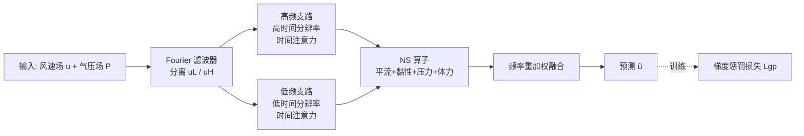

# Improving Extreme Wind Prediction with Frequency-Informed Learning

**会议**: ICLR 2026  
**OpenReview**: [https://openreview.net/forum?id=IJAPVmxQYU](https://openreview.net/forum?id=IJAPVmxQYU)  
**代码**: 待确认  
**领域**: 时间序列 / 气象预测 / 物理信息机器学习  
**关键词**: 极端风速预测, 频域分析, 梯度惩罚损失, Navier-Stokes 物理嵌入, 频率分离重加权, ERA5  

## 一句话总结
本文从频域角度证明了"MSE 训练 + 模式偏移 → 高频振幅收缩"是数据驱动模型系统性低估极端风速的根因，并据此提出**梯度惩罚损失 + NS 物理嵌入结构 + 频率分离重加权**三件套，在不牺牲整体精度的前提下显著提升极端风速预测准确率。

## 研究背景与动机
- **领域现状**：FourCastNet、Pangu-Weather 等深度学习模型已在整体气象预报上大幅超越传统数值天气预报（NWP），擅长产出平滑、整体准确的风场预测。
- **现有痛点**：用 MSE + 常规风速数据训练的模型在**极端风速**上系统性低估振幅、抹平短时剧烈变化（ramp）。这一偏差即便整体精度很高时依旧存在，导致风电运营中风险被低估、快速爬坡被漏报（风电输出功率约正比于风速三次方 $v^3$，极端风又会使风机停机，误差代价极大）。
- **核心矛盾**：已有极端天气模型存在四个缺口——(i) 几乎不解释误差为何在极端处放大；(ii) 隐式依赖含极端样本的大量数据，而极端样本天然稀缺；(iii) 为捕捉剧变模式往往堆叠更复杂结构；(iv) 纯数据驱动难以抓住内在动力学、区域误差不可控。
- **本文目标**：先从理论上解释极端风被低估的机理，再设计可直接落地、数据高效的改进，使极端预测变准同时整体性能稳健。
- **核心 idea**：**【频域归因】** 将 MSE 分解为振幅收缩误差、模式平移误差、噪声三项，证明模式偏移会让高频分量振幅被压缩；**【对症下药】** 用梯度惩罚损失上调振幅收缩项权重、用 NS 物理结构压低平移误差、用频率分离重加权对抗高频衰减。

## 方法详解

### 整体框架
方法由"一个理论 + 三个组件"构成：理论部分把预测误差建模为 $\tilde u(x)=a\,u(x+\Delta)+\varepsilon(x)$（缩放 $a$、平移 $\Delta$、噪声 $\varepsilon$），经 Fourier 变换与 Rayleigh 能量定理推出 MSE 的三项分解，指出高频处振幅收缩最严重；工程部分据此设计**梯度惩罚损失**（治振幅收缩）、**NS 物理嵌入结构**（治平移误差）、**频率分离与重加权**（治高频衰减）。输入风速场 $u$ 与气压场 $P$ 依次经过频率滤波器、时间注意力、NS 算子，分别预测高/低频分量后融合得到最终结果。

### 关键设计

**1. 频域误差分解：把"为什么会收缩"算清楚。** 作者假设预测与真值满足 $\tilde u(x)=a\,u(x+\Delta)+\varepsilon(x)$，在频域记相位 $\theta_k=2\pi(k_x\Delta_x/N+k_y\Delta_y/M)$，借 Rayleigh 能量定理把空间 MSE 等价到频域，期望误差分解为 $E[\text{MSE}]=C_1\sum_k\{a-E[\cos\theta_k]\}^2\|\hat u(k)\|^2+\{1-E^2[\cos\theta_k]\}\|\hat u(k)\|^2+\sigma^2$，即**缩放(收缩)误差 + 平移误差 + 噪声**三项。关键推论：最优缩放 $a_{\text{opt}}=E[\cos\theta_k]=1-\tfrac{C_2(k\cdot\Delta)^2}{2}+o(\|k\|^2)<1$ 随频率 $k$ 升高而减小——这从数学上解释了**当优化卡在平移误差时，模型会靠"压低整体振幅"来降 loss，且高频分量收缩得最厉害**，正是极端风被低估的根因。

**2. 梯度惩罚损失：让"压振幅"不再划算。** 既然收缩源于模式偏移，就加一项对偏移不敏感、却能反映空间变化强度的修正——匹配预测与真值的梯度范数：$L_{gp}(\tilde u,u)=\text{MSE}(\tilde u,u)+\lambda\big|\|\nabla\tilde u\|^2-\|\nabla u\|^2\big|$。由于实践中 $\|\nabla\tilde u\|^2$ 通常偏小，等价于 $\text{MSE}-\lambda\|\nabla\tilde u\|^2$，而 $\|\nabla\tilde u\|^2\propto\sum_k\|k\|^2\|\hat{\tilde u}(k)\|^2$ 恰好上调了高频残差权重。物理上作者进一步给出**能量-enstrophy 解释**：MSE 项做"能量匹配"，梯度项做"enstrophy（涡量 L2 范数）匹配"，由 2D 不可压 NS 的能量平衡 $\tfrac12\tfrac{d}{dt}\|u\|^2+\nu\|\nabla u\|^2=\langle F,u\rangle$ 可知 enstrophy 控制动能耗散率、且在频谱上以 $k^2$ 加权偏向高频。于是损失迫使网络保住小尺度结构的振幅，使"均匀压缩"成为降 loss 的低效手段。

**3. NS 物理嵌入结构：用第一性原理压低平移误差。** 平移误差主要来自下一时刻风场移动方向/幅度的不确定性，纯神经网络只能隐式学。作者把 NS 方程 $\partial_t u=-u\cdot\nabla u-\tfrac1\rho\nabla P+\nu\nabla^2 u+F$ 拆成四个算子嵌入网络（NS Operator）：**平流算子**（非线性输运 $u\cdot\nabla u$）、**黏性算子**（扩散 $\nu\nabla^2u$）、**压力算子**（压力梯度力 $\tfrac1\rho\nabla P$，用气压数据，缺失时并入体力项）、**体力算子**（用可学习神经网络捕捉前三者无法解释的动力学）。前三个算子给出物理上合理的粗预测、约束平移幅度与方向，体力算子在此基础上精修——既直接约束平移误差，又减轻可学习部分负担，从而降低参数量与训练成本。

**4. 频率分离与重加权：高低频各管各的尺度。** 用 Fourier 滤波器把风场拆成低频 $u_L$ 与高频 $u_H$（变换→频率掩码 $\hat u_f(k)=\hat u(k)\cdot M(k)$→逆变换），再对两支分别做受 SENet 启发的**时间注意力**（Squeeze 压缩每个时隙、Excitation 产出反映各时隙重要性的权重）。关键差异在于**分辨率分工**：高频对短时动态更关键，用更高时间分辨率（更短时间间隔）处理；低频对应长期趋势，用更低分辨率处理，从而同时抓住短时剧变与大尺度连贯性。

## 实验关键数据

### 主实验表格
数据集为 ERA5 再分析（10 米东向/北向风 + 地表气压，1 小时时间分辨率、0.25° 空间分辨率，取 24 小时为预测单元、前 23 小时预测第 24 小时）。指标为整体 RMSE 与聚焦极端区域的 Ex-RMSE（Extreme Attentive RMSE）。

| 模型 | 1h RMSE | 1h Ex-RMSE | 3h RMSE | 3h Ex-RMSE | 5h RMSE | 5h Ex-RMSE |
|------|---------|------------|---------|------------|---------|------------|
| CNN | 0.4639 | 0.3183 | 1.0442 | 0.7355 | 2.0757 | 1.0693 |
| ConvLSTM | 0.3471 | 0.2294 | 0.7834 | 0.5357 | 1.0644 | 0.8097 |
| PINN | 0.3946 | 0.2541 | 0.8283 | 0.5646 | 1.1434 | 0.7347 |
| **Ours** | **0.3287** | **0.1868** | **0.6622** | **0.4329** | **0.9076** | **0.6158** |

次帧（1h）预测中，整体 RMSE 相比 CNN/ConvLSTM/PINN 分别降低 29.1%/5.3%/16.7%，极端 Ex-RMSE 分别降低 41.3%/18.6%/26.5%；在 3h、5h 更长 lead time 上同样全面领先。

### 消融实验表格

| 变体 | RMSE | Ex-RMSE |
|------|------|---------|
| 仅 NS 算子 (NS op) | 0.7061 | 0.4577 |
| 去梯度损失 (W/O grad-loss) | 0.3351 | 0.2632 |
| 去 NS 结构 (W/O NS) | 0.3754 | 0.2363 |
| 去频率分离 (W/O freq-sep) | 0.4199 | 0.2703 |
| **完整模型 (Ours)** | **0.3287** | **0.1868** |

### 关键发现
- **梯度损失专治极端**：去掉梯度惩罚项后整体 RMSE 几乎不变（0.3287→0.3351），但 Ex-RMSE 明显恶化（0.1868→0.2632），印证梯度项是针对性地重建高影响区的尖锐梯度与涡量。
- **λ 呈 U 形曲线**：小正值（最优 $\lambda^\star=0.02$）显著降低极端误差且不伤整体精度；$\lambda\ge0.15$ 时优化失稳、模型无法收敛——因为梯度项不含位置对齐信息，过大会让预测出现与位置无关的大幅波动。
- **三组件互补**：仅留 NS 算子误差最大（说明纯学神经 NS 算子不够），去频率分离时 RMSE/Ex-RMSE 均显著上升，证明高低频显式解耦对同时捕捉大小尺度结构至关重要。

## 亮点与洞察
- **从"现象"到"机理"**：用一行频域分解把"模型为什么低估极端风"算成可证明的 $a_{\text{opt}}<1$ 且随频率递减，给出了少见的理论归因而非仅靠经验调参。
- **损失改进可即插即用**：梯度惩罚损失只在 MSE 上加一项梯度范数差，实现简单、可挂在任意 backbone 上，且有能量-enstrophy 的 PDE 解释背书。
- **物理先验降本增效**：NS 算子把"风往哪移动多少"交给物理算子粗算，神经网络只补差，既约束平移误差又减少参数和数据需求，契合极端样本稀缺的现实。

## 局限与展望
- 误差建模依赖"缩放+平移+噪声"的简化假设，更复杂的误差成因尚未刻画。
- 当前验证集中在区域、短 lead time（1–5h）、2D 风场；向更长 lead time、3D 场景及其他气象变量的推广仍待检验。
- 梯度惩罚项不含位置对齐信息，$\lambda$ 需谨慎调（过大失稳），缺乏自适应机制。

## 相关工作与启发
- **数据驱动气象**：FourCastNet、Pangu-Weather 代表的大模型擅长整体预报，但对极端事件存在系统性平滑偏差——本文正是补这块短板。
- **极端天气专用模型**：RNN/CNN/LSTM 抓时空依赖，VAE/扩散做数据增强缓解稀缺，但少有理论解释；本文提供了频域可解释的替代路径。
- **物理信息机器学习**：与 PINN 把 NS/RANS 作为软约束不同，本文把 NS 拆成显式算子作为结构归纳偏置，并配合能量-enstrophy 视角解释损失。对"如何在数据稀缺场景注入物理先验、并用频域分析定位深度模型的系统性偏差"有借鉴价值。

## 评分
- **新颖性**: ⭐⭐⭐⭐ —— 频域误差三项分解 + 能量-enstrophy 解释梯度损失，给极端低估问题提供了少见的理论归因，组件本身偏组合式但视角新颖。
- **实验充分度**: ⭐⭐⭐ —— ERA5 多 lead time、消融、λ 扫描齐全且自洽，但 baseline 较经典（CNN/ConvLSTM/PINN），缺与 FourCastNet/Pangu 等大模型的对比，且限于区域 2D 短时。
- **写作质量**: ⭐⭐⭐⭐ —— 理论推导到工程设计逻辑清晰，频域 insight → 损失 → 结构 → 频率分离层层呼应，公式与图示充分。
- **价值**: ⭐⭐⭐⭐ —— 极端风预测对风电运营有直接经济价值，梯度惩罚损失可即插即用、迁移性强，频域归因方法论对其他极端事件预测亦有启发。

<!-- RELATED:START -->

## 相关论文

- [\[ICLR 2026\] Extreme Weather Nowcasting via Local Precipitation Pattern Prediction](extreme_weather_nowcasting_via_local_precipitation_pattern_prediction.md)
- [\[ICLR 2026\] ST-HHOL: Spatio-Temporal Hierarchical Hypergraph Online Learning for Crime Prediction](st-hhol_spatio-temporal_hierarchical_hypergraph_online_learning_for_crime_predic.md)
- [\[ICLR 2026\] SONATA: Synergistic Coreset Informed Adaptive Temporal Tensor Factorization](sonata_synergistic_coreset_informed_adaptive_temporal_tensor_factorization.md)
- [\[AAAI 2026\] M2FMoE: Multi-Resolution Multi-View Frequency Mixture-of-Experts for Extreme-Adaptive Time Series Forecasting](../../AAAI2026/time_series/m2fmoe_multi-resolution_multi-view_frequency_mixture-of-experts_for_extreme-adap.md)
- [\[ICLR 2026\] MixLinear: Extreme Low Resource Multivariate Time Series Forecasting with 0.1K Parameters](mixlinear_extreme_low_resource_multivariate_time_series_forecasting_with_01k_par.md)

<!-- RELATED:END -->
