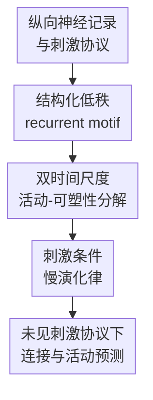

# Inferring brain plasticity rule under long-term stimulation with structured recurrent dynamics

**会议**: ICLR2026  
**OpenReview**: [https://openreview.net/forum?id=kc5jbYHedw](https://openreview.net/forum?id=kc5jbYHedw)  
**代码**: https://github.com/ncclab-sustech/STEER.git  
**领域**: 时间序列 / 神经动力学  
**关键词**: 脑可塑性, 长期刺激, recurrent dynamics, 低秩动力系统, 深脑刺激  

## 一句话总结

这篇论文提出 STEER，把长期神经刺激下的脑网络重构建模为一个刺激条件的慢时间尺度动力学规律，同时用结构化低秩 RNN 解释会话内快速神经活动，从而能从纵向神经记录中推断可解释的可塑性规则，并在 Lorenz、BCM、刺激诱导任务学习和帕金森大鼠 DBS 数据上预测未见刺激方案下的网络演化。

## 研究背景与动机

**领域现状**：神经系统在学习、记忆和治疗性刺激中会持续重组。短时间尺度上，Hebbian learning、STDP、BCM 等规则已经能描述局部突触如何随活动改变；机器学习方向也有很多 RNN、状态空间模型和低秩神经动力学模型，可以从群体神经记录中重建会话内的非线性活动轨迹。

**现有痛点**：这些工具放到长期刺激场景里会遇到一个更难的问题：一天内记录到的是快速神经活动，跨天或跨周变化的却是连接结构和可塑性状态。传统生物物理规则足够可解释，但大多只覆盖毫秒到分钟尺度的局部突触更新；灵活的神经系统识别模型虽然能拟合数据，却常把跨 session 的慢变化吸收到高维参数漂移里。结果是模型可能预测眼前活动，却说不清刺激究竟怎样累积改变网络。

**核心矛盾**：真正需要识别的不是“第 $k$ 次记录有一套参数、第 $k+1$ 次记录又有另一套参数”，而是这些参数为什么这样变。也就是说，长期刺激带来的脑可塑性应该被当成一个可测试的慢动力学对象，而不是 fast dynamics 的噪声、confound 或黑箱 session embedding。

**本文目标**：作者希望从纵向神经记录中同时解决三个子问题：第一，分离会话内快速神经活动和跨会话慢速网络重构；第二，用低维变量表达可塑性状态，使其能读出到 recurrent connectivity 的 motif 变化；第三，在给定新刺激协议时，外推未来 session 的连接和神经活动，而不仅仅重放训练集中见过的轨迹。

**切入角度**：论文的关键观察是，长期神经刺激通常不是随机扰动，而是有协议、强度、时间安排和反馈控制的外部输入。因此跨 session 的变化可以写成刺激条件的演化律 $z_{k+1}=g_\theta(z_k,\bar{u}_k)$。如果 $z_k$ 是低维可塑性 embedding，$g_\theta$ 就可以被解释为要推断的脑可塑性规则。

**核心 idea**：用“结构化低秩 recurrent motif + 刺激条件慢变量更新”替代无结构的 session 参数漂移，把长期刺激下的脑可塑性从黑箱拟合问题变成可预测、可解释、可做反事实刺激设计的动力学建模问题。

## 方法详解

### 整体框架

STEER 的输入是一组按时间排序的长期神经记录 $\{y^k_{1:T}\}_{k=1}^D$ 以及每个 session 中对应的刺激输入 $u^k_{1:T}$。模型假设每个 session 内 recurrent connectivity 近似稳定，因此可以用一个快速 RNN 描述该 session 的神经活动；但 session 与 session 之间连接会慢慢变化，这部分由低维可塑性 embedding $z_k$ 和刺激条件更新规则 $g_\theta$ 控制。

整体上，STEER 先把跨 session 的连接矩阵 $W_k$ 写成共享低秩 motif 的加权和，再从神经记录中编码出 $z_k$，由 $z_k$ 读出 motif scale $c_k$，最后用 $c_k$ 组装当前 session 的 recurrent connectivity。慢时间尺度上，$z_k$ 还必须满足 $z_{k+1}=g_\theta(z_k,\bar{u}_k)$，这样模型不能只为每个 session 独立找一个 embedding，而要学会“刺激协议如何推动可塑性状态前进”。

在这个框架里，图中的“结构化低秩 recurrent motif”对应连接参数化；“双时间尺度活动-可塑性分解”对应 fast RNN 与 plasticity embedding 的分工；“刺激条件慢演化律”对应 $g_\theta$ 的可塑性规则。三者合起来保证模型既能拟合神经活动，又能把跨 session 的变化解释成有结构的网络重构。

### 关键设计

**1. 结构化低秩 recurrent motif：把跨 session 连接变化压到可解释的 motif scale 上**

长期记录里最容易失控的是连接矩阵维度：如果每个 session 都自由学习一个 $N\times N$ 的 $W_k$，模型会有足够自由度拟合数据，却很难判断哪些变化是真正的可塑性规律。STEER 把所有 session 的连接堆成张量 $W\in\mathbb{R}^{N\times N\times D}$，再用 CP 分解表示为 $W=\sum_{r=1}^R a_r\circ b_r\circ c_r$。对第 $k$ 个 session 来说，连接矩阵是 $W_k=\sum_{r=1}^R c_r^k a_r b_r^\top$。

这个写法的直觉是：$a_r b_r^\top$ 是跨 session 共享的 recurrent motif，$c_r^k$ 是第 $k$ 个 session 对第 $r$ 个 motif 的表达强度。于是跨天或跨周的脑可塑性不再表现为整张连接矩阵任意漂移，而表现为少数 motif scale 的连续改变。论文还通过约束 $\|a_r\|_2=\|b_r\|_2=1$、正交惩罚，以及可选的 Dale's principle 符号 mask 来减少分解的不确定性，使 motif 更接近神经回路层面的解释对象。

**2. 双时间尺度活动-可塑性分解：用 fast RNN 拟合会话内活动，用 $z_k$ 承载跨会话重构**

STEER 的 fast dynamics 用一个低秩 RNN 表示。第 $k$ 个 session 的隐状态 $h^k(t)$ 按 $\tau \frac{d}{dt}h^k(t)=-h^k(t)+(\sum_r c_r^k a_r b_r^\top)\phi(h^k(t))+W_{in}u^k(t)$ 演化，再由线性 decoder 还原到观测神经信号。这样，会话内毫秒到秒级的非线性响应由 $h^k(t)$ 负责，跨 session 的连接差异只通过 $c_k$ 改变 recurrent term。

慢变量 $z_k$ 则由 PlasticityEncoder 从整段 session 数据和输入中提取，并通过 $c_k=Mz_k+b_c$ 读出 motif scale。这个设计的关键不是单纯加一个 embedding，而是规定 embedding 的语义：$z_k$ 只能通过少数 motif scale 调制连接，因此它必须解释网络结构如何变化，而不是随意吸收观测噪声。稀疏的 $M$ 还能让少数可塑性维度对应少数 motif，方便后续把 $c$ 和功能连接、BCM threshold 或干预效果对齐。

**3. 刺激条件慢演化律：让可塑性规则成为模型必须预测的对象**

仅有 $z_k$ 和 $c_k$ 还不够，因为模型仍可能逐个 session 编码，而不真正学习可塑性规则。STEER 进一步要求 $z_k$ 满足刺激条件的 residual dynamics：$z_{k+1}=z_k+\tau_z(W_z\phi(z_k)-z_k+B_u\bar{u}_k+b_z)$，其中 $\bar{u}_k$ 是第 $k$ 个 session 刺激协议的摘要。这个式子把外部刺激从普通输入提升为慢变量演化的条件，使模型可以回答“如果换一套刺激 schedule，未来连接会怎么变”。

训练时的 $L_{slow}$ 会惩罚真实编码的 $z_{k+1}$ 与 $g_\theta(z_k,\bar{u}_k)$ 不一致，$L_{smooth}$ 会鼓励 motif scale 在相邻 session 间平滑变化。二者合起来限制了模型不能只追求当前 session 的 reconstruction，而要保持跨 session 的可解释连续性。论文还用 forward-in-time holdout，也就是前 60% session 训练、后 40% session 测试，专门检验这种慢演化律能否外推到未来数据。

### 一个完整示例

可以把 BCM 实验想成一个受控的“显微镜”例子。数据生成时，神经群体在每个 session 内接受两通道交替刺激，活动均值 $\bar{h}^k$ 决定 BCM sliding threshold $\theta^k$，随后 recurrent weights 按 $W_{hh}^{k+1}=Proj_{E/I}(W_{hh}^k+\eta_W(\bar{h}^k\odot(\bar{h}^k-\theta^k))(\bar{h}^k)^\top)$ 更新。这里真实的可塑性规则是已知的，因此可以检查 STEER 是否真的恢复慢变化，而不只是拟合每段活动。

STEER 看到的不是 ground-truth $\theta^k$ 和 $W_{hh}^k$，而是每个 session 的神经活动和刺激输入。模型先从第 $k$ 个 session 编码出 $z_k$，读出 $c_k$，组装 $W_k$ 并预测该 session 内的活动；然后再用 $g_\theta(z_k,\bar{u}_k)$ 预测接下来若干 session 的可塑性 embedding。实验中，$c_1$、$c_2$ 与真实 sliding threshold 的主成分显著相关，$\|W\|_2$ 的跨 session 轨迹也贴近 ground truth，这说明 STEER 学到的慢变量确实对应 BCM 的 homeostatic plasticity，而不只是任意 latent code。

在真实 PD-DBS 数据中，例子变成四周纵向记录。模型从每周行走状态下的 M1 神经信号中推断 $c$ 的轨迹，再和功能连接 FC 的周间变化比较。DBS 干预后的 $\Delta c_{mag}=\|\Delta c\|_2$ 在 PD-DBS 组明显更大，且 $\Delta c$ 与 $\Delta FC$ 的方向相似性高于 week-shuffle baseline，说明慢变量捕捉到的不是随机周差异，而是刺激相关的网络重构信号。

### 损失函数 / 训练策略

STEER 的总目标由三部分组成：$L=L_{fast}+\lambda_{slow}L_{slow}+\lambda_{smooth}L_{smooth}$。其中 $L_{fast}=\sum_k\sum_t\|y_t^k-\hat{y}_t^k\|_2^2$ 负责会话内多步预测；论文采用 H-step rollout，第一步 teacher forcing，后面自回归滚动，避免模型只在 one-step prediction 上看起来好。

$L_{slow}=\sum_k\|z_{k+1}-g_\theta(z_k,\bar{u}_k)\|_2^2$ 约束慢时间尺度可塑性规则，$L_{smooth}=\sum_k\|c_{k+1}-c_k\|_2^2$ 则反映长期可塑性通常是渐进变化而非无序跳变。训练时，模型联合优化 state encoder/decoder、plasticity encoder、motif factors、weight inference 和 plasticity predictor；也测试了先训练 fast 再训练 slow 的 staged 版本，BCM 上两者趋势接近，joint training 略好。

反事实预测时，模型不需要未来 session 的真实 embedding。给定新刺激序列 $\{\tilde{u}^k\}$ 后，它迭代 $\tilde{z}_{k+1}=g_\theta(\tilde{z}_k,\tilde{\bar{u}}_k)$，再读出 $\tilde{c}_k$、组装 $\tilde{W}_k$ 并模拟 fast RNN。这个流程是论文区别于普通 session-conditioned RNN 的关键：慢规则可以被用于未见刺激协议下的预测和设计。

## 实验关键数据

### 主实验

| 实验设置 | 评估对象 | 本文结果 | 对比方法 / 参照 | 结论 |
|--------|---------|---------|----------------|------|
| Lorenz 参数演化 | 未见系统轨迹 EV | system 61: 0.961；system 100: 0.974 | MD-SSM、Hierarchical PLRNN | STEER 对未见参数状态仍能高质量预测轨迹 |
| Lorenz 参数演化 | plasticity rule 相似性 | DSA = 0.169 | shuffle 后 DSA = 0.302，baseline DSA 更高 | 低 DSA 表明推断出的 latent trajectory 更贴近真实参数演化 |
| BCM 可塑性 | 会话内预测 EV | 各模型 EV 均 > 0.9，STEER 保持竞争力 | MD-SSM、Hierarchical PLRNN | STEER 没牺牲 fast-timescale 预测精度 |
| BCM 可塑性 | $\|W\|_2$ 跨 session 对齐 | 原始顺序 $0.9606\pm0.0036$ | shuffled 顺序 $-0.0025\pm0.0132$ | 慢变化依赖真实 session 顺序，不是架构自带平滑幻觉 |
| PD-DBS 纵向大鼠数据 | $\Delta c$ 与 $\Delta FC$ 对齐 | real data 明显高于 week-shuffle baseline | within-subject week shuffle | inferred plasticity 与功能连接变化有一致方向 |

### 消融实验

| 配置 | 关键指标 | 说明 |
|------|---------|------|
| STEER 原始 session 顺序 | $\|W\|_2$ alignment $0.9606\pm0.0036$；EV $0.9397\pm0.0008$ | 正确利用跨 session 时间结构，慢变量和 fast prediction 都稳定 |
| STEER shuffled session 顺序 | $\|W\|_2$ alignment $-0.0025\pm0.0132$；EV $0.9450\pm0.0007$ | fast prediction 仍高，但慢可塑性轨迹消失，说明慢规则需要真实时间顺序 |
| Joint training | $\|W\|_2$ alignment $0.9606\pm0.0036$；EV $0.9397\pm0.0008$；$corr(c,c_{pred})=0.9934\pm0.0016$ | fast/slow 联合优化，早晚 session 误差略小 |
| Staged training | $\|W\|_2$ alignment $0.9602\pm0.0076$；EV $0.9310\pm0.0022$；$corr(c,c_{pred})=0.9866\pm0.0094$ | 先 fast 后 slow 也能学到相近趋势，但预测略弱 |
| STEER with 5-session forecasting | BCM 和 task-learning 中仍能追踪 $W$ 变化 | 更难的慢时间尺度外推设置 | 证明模型不是只靠短步 teacher forcing |
| 低秩 MD-SSM / full-rank MD-SSM | 会话内 EV 可高，但 $\|W\|_2$ 或 motif 结构更差 | session-specific 低秩或 full-rank 参数更自由 | 说明共享 motif 与刺激条件慢规则对识别可塑性很关键 |

### 关键发现

- 在 Lorenz benchmark 中，rank-3 足以覆盖三个独立变化参数，STEER 对未见系统仍能达到 0.96 以上 EV，并用较低 DSA 捕捉真实参数演化的时间结构。
- 在 BCM benchmark 中，STEER 的 motif scale 与真实 sliding threshold 的主成分显著相关，例如文中报告 $r=0.711$ 和 $r=0.395$，说明 $c$ 可以作为 homeostatic plasticity 的低维 order parameter。
- 在刺激诱导 task-learning benchmark 中，rank-7 STEER 更适合恢复从随机连接逐渐走向 ring-attractor 的复杂结构变化，并在 cycle-wise weight similarity 上优于 baseline。
- 在 PD-DBS 数据中，PD-DBS 组在 w4 到 w5 干预区间的 $\Delta c_{mag}$ 高于 PD 和 Sham，支持 DBS 与更强的可塑性相关网络重构相关。
- Shuffle control 是论文很重要的可信度检查：打乱评估顺序或训练顺序后，fast prediction 可能不崩，但慢可塑性指标会显著下降，说明 STEER 捕捉的慢轨迹不是静态 session heterogeneity。

## 亮点与洞察

- **把长期可塑性显式建成规则而非参数漂移**：很多神经动力学模型都能允许 session 参数变化，但本文把 $z_{k+1}=g_\theta(z_k,\bar{u}_k)$ 作为核心对象，直接让模型学习刺激如何推动慢状态演化。这一点让后续反事实刺激设计成为自然延伸。
- **低秩 motif 是解释性和泛化性的共同约束**：$W_k=\sum_r c_r^k a_rb_r^\top$ 既减少了高维连接矩阵的自由度，又把跨 session 变化压缩成 motif scale 轨迹。对神经科学读者来说，motif scale 比黑箱 RNN 参数更容易和功能连接、E/I 结构或 neuromodulatory gain 对齐。
- **实验设计覆盖了从可控 ground truth 到真实疾病数据的梯度**：Lorenz 检验参数演化，BCM 检验已知生物可塑性，task-learning 检验 adaptive stimulation，PD-DBS 检验真实纵向数据。这种由简到难的验证链条比只在一个真实数据集上展示可视化更有说服力。
- **shuffle control 抓住了慢动力学建模的关键风险**：如果不打乱 session 顺序，很难排除模型只是对不同 session 做静态编码。论文同时做 evaluation-stage shuffle 和 training-stage shuffle，分别检验指标可靠性和模型是否“幻觉”出平滑漂移。
- **对其他长期干预任务有迁移价值**：这套“fast response + slow law”的分解可以迁移到 TMS、TES、optogenetics、康复训练、长期药物干预等场景，只要数据具有多 session 记录和可摘要的干预协议。

## 局限与展望

- 真实 PD-DBS 数据只有有限周数和群体规模，且论文主要展示 $c$ 与 FC 的对齐、$\Delta c_{mag}$ 的组间差异；它还没有把 latent plasticity 直接连接到更细的个体行为改善、运动评分或临床结局。
- $g_\theta$ 虽然比无结构参数漂移更可解释，但仍是一个 learnable recurrence。若要成为更强的神经科学机制模型，未来可以嵌入 cell-type-specific gain、homeostatic set point、neuromodulator gating 或区域连接先验。
- 低秩 motif 假设适合捕捉共享结构，但当长期刺激造成局部稀疏重接线、非低秩病灶效应或强非平稳噪声时，rank 选择和 motif 稳定性可能成为瓶颈。
- 反事实刺激设计目前更多是框架能力展示，真正用于闭环治疗还需要加入安全约束，例如 $z$ 和 $c$ 的 reachable set、Lyapunov margin、刺激强度限制以及不良状态规避。
- 论文中的真实数据来自 PD rat DBS，外推到人类 DBS、TMS 或其他疾病状态仍需跨物种、跨模态、跨协议的验证。

## 相关工作与启发

- **vs Hebbian / STDP / BCM 等经典规则**: 经典规则强调局部突触如何根据 pre/post 活动变化，解释性很强，但覆盖的时间尺度和空间尺度通常较短。STEER 不试图替代这些机制，而是把长期刺激下的 circuit-level 变化建模成低维慢动力学，适合跨天或跨周的纵向干预数据。
- **vs 神经系统识别中的 RNN / PLRNN**: RNN 和 PLRNN 可以拟合非线性神经轨迹，但慢变化往往是 session-specific 参数或高维漂移。STEER 的优势在于显式分离 fast activity 和 slow plasticity，并把 slow plasticity 绑定到共享 motif 与刺激条件演化律上。
- **vs MD-SSM**: MD-SSM 也使用低秩和 meta-dynamical 思路，但本文认为如果缺少 session-invariant motif 和明确的慢规则约束，模型容易有高 fast prediction、低 plasticity identifiability 的问题。BCM 和 task-learning 结果支持了这一点。
- **vs SINDy / governing equation discovery**: SINDy 更偏向从时间序列中发现稀疏显式方程，适合可观测状态和候选库明确的系统。STEER 面对的是隐含连接与神经记录，先通过低秩 RNN 建立可塑性 embedding，再学习刺激条件更新，牺牲了一部分闭式公式的简洁性，换来对神经纵向数据的适配性。
- **启发**: 如果要做下一步研究，可以把 STEER 的 slow law 与优化器结合，让模型不只预测“给定刺激会怎样”，还反过来搜索“怎样的刺激 protocol 能把 $c$ 推到目标区域”，这会直接连接到自适应神经调控和闭环治疗设计。

## 评分

- 新颖性: ⭐⭐⭐⭐⭐ 把长期刺激下的脑可塑性明确建成 stimulus-conditioned latent law，并与结构化 recurrent motif 结合，问题定义和建模角度都很有辨识度。
- 实验充分度: ⭐⭐⭐⭐☆ 四类 benchmark 覆盖面很广，shuffle 和超参数分析也扎实；不足是 PD-DBS 的行为层面验证还偏初步。
- 写作质量: ⭐⭐⭐⭐☆ 整体叙事清楚，方法公式和实验链条完整；个别图表数值在正文中没有表格化展开，读者需要在图和附录间来回对照。
- 价值: ⭐⭐⭐⭐⭐ 对神经动力学、长期干预建模和闭环 DBS 设计都有潜在价值，也给“慢变量可解释动力学”提供了可复用框架。

<!-- RELATED:START -->

## 相关论文

- [\[ICLR 2026\] Brain-Semantoks: Learning Semantic Tokens of Brain Dynamics with a Self-Distilled Foundation Model](brain-semantoks_learning_semantic_tokens_of_brain_dynamics_with_a_self-distilled.md)
- [\[ICLR 2026\] PMDformer: Patch-Mean Decoupling Information Transformer for Long-term Forecasting](pmdformer_patch-mean_decoupling_information_transformer_for_long-term_forecastin.md)
- [\[ICML 2025\] A Generalizable Physics-Enhanced State Space Model for Long-Term Dynamics Forecasting in Complex Environments](../../ICML2025/time_series/a_generalizable_physics-enhanced_state_space_model_for_long-term_dynamics_foreca.md)
- [\[AAAI 2026\] CometNet: Contextual Motif-guided Long-term Time Series Forecasting](../../AAAI2026/time_series/cometnet_contextual_motif-guided_long-term_time_series_forecasting.md)
- [\[ICML 2026\] FRACTAL: State Space Model with Fractional Recurrent Architecture for Computational Temporal Analysis of Long Sequences](../../ICML2026/time_series/fractal_ssm_with_fractional_recurrent_architecture_for_computational_temporal_an.md)

<!-- RELATED:END -->
