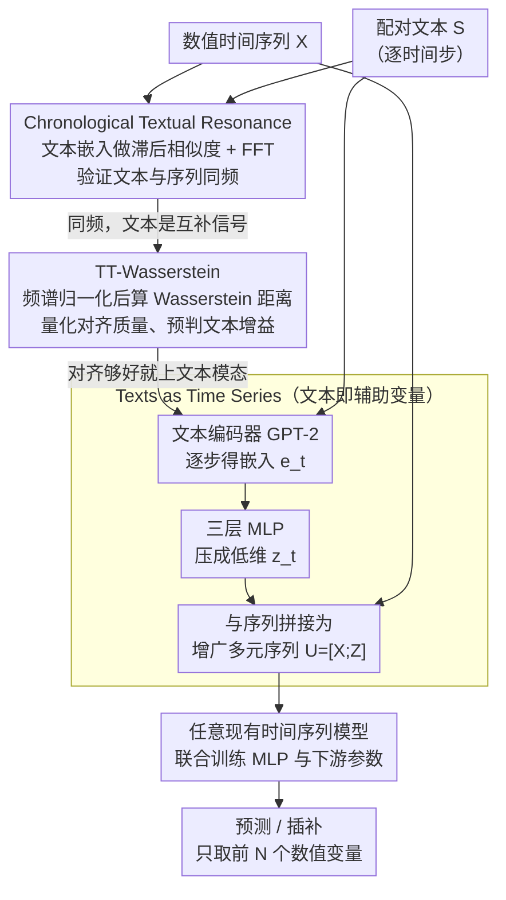

# Language in the Flow of Time: Time-Series-Paired Texts Weaved into a Unified Temporal Narrative

**会议**: ICLR2026  
**arXiv**: [2502.08942](https://arxiv.org/abs/2502.08942)  
**代码**: [iDEA-iSAIL-Lab-UIUC/TaTS](https://github.com/iDEA-iSAIL-Lab-UIUC/TaTS)  
**领域**: 时间序列  
**关键词**: multimodal time series, text-augmented forecasting, Chronological Textual Resonance, plug-and-play framework  

## 一句话总结
发现时间序列配对文本具有与时间序列相似的周期性（Chronological Textual Resonance），提出 TaTS 框架将文本表征转化为辅助变量，以即插即用方式增强任意现有时间序列模型的预测和插补性能。

## 背景与动机

**领域现状**：现实中时间序列数据常伴随逐时间步的文本信息（如疫情期间感染率 + 政府公告、经济指标 + 新闻报道），但现有模型大多只吃数值数据，白白浪费了文本里的互补信息。

**核心矛盾**：当前最强的多模态方法（MM-TSFLib）虽然用上了文本，却忽略了时间序列配对文本特有的位置特性和周期性——文本只是被简单拼接，没有被当成与序列同步演化的信号来对待。

**切入点**：作者受 Platonic Representation Hypothesis（PRH，柏拉图表征假说）启发——不同模态在描述同一事物时，其表征会收敛到共享空间。若时间序列和配对文本描述的是同一个变化事件，那两者就应当展现出相似的周期性。这把「文本到底值不值得用」从经验判断变成了可验证、可度量的问题。

**本文目标**：系统回答两件事——时间序列配对文本究竟具有哪些独特属性？以及如何在不改动下游模型的前提下，把这些文本信息整合进来提升预测与插补。

## 方法详解

### 整体框架

本文要解决的问题是：时间序列常伴随逐时间步的配对文本，但主流模型只吃数值、白白浪费了文本里的互补信息。TaTS 的整体思路分三步走，前两步是「立地基 + 量地基」，第三步才是真正的融合机制。第一步先用一个观察立住地基——时间序列配对文本的周期性竟与序列本身高度同频（作者称之为 Chronological Textual Resonance，CTR），说明文本不是噪声而是互补信号；第二步用一把尺子（TT-Wasserstein）量化「这份文本和序列对齐得多好」，对齐越好、上文本的收益越大；第三步落到极轻量的融合——把每个时间步的文本编码、压成低维向量，当作一组「辅助变量」与原始数值序列拼在一起，整体喂给任意现成的时间序列模型联合训练。文本信息因此被无缝注入预测/插补流程，而下游模型架构一行都不用改。

### 关键设计

**1. Chronological Textual Resonance：先证明文本里藏着和序列同频的周期**

如果文本和时间序列在描述同一件事，那么按 Platonic Representation Hypothesis（PRH），两者的表征应当收敛到共享空间，进而展现相似的周期性——但这只是假设，作者要先把它坐实。做法是用文本编码器把每个时间步的文本 $s_t$ 编成嵌入 $e_t$，计算滞后相似度 $d_l = \sum_t \cos(e_t, e_{t+L})$，再对 $d_l$ 序列做 FFT 看主频率。在经济、社会公益、交通三类真实数据上，文本嵌入的 lag-similarity 主频率与时间序列高度吻合，CTR 现象由此被形式化。作者进一步给出三条成因：文本与序列共享同一外部驱动（季节、经济周期等）、文本本身在叙述序列的趋势、以及文本携带了带对齐周期性的额外变量。这一发现是整个方法的立足点——正因为文本和序列同频，把文本拼进来才不是噪声而是互补信号。

**2. TT-Wasserstein：用一个标量预判文本到底有没有用**

CTR 强弱在不同数据集上并不相同，作者需要一把尺子来量化「这份文本和序列对齐得多好」。TT-Wasserstein 的做法是把时间序列与文本各自的频谱归一化成分布，再计算两者之间的 Wasserstein 距离，值越低代表对齐越好、文本增益潜力越大。为验证它真的在度量对齐而非别的，作者对 Time-MMD 做时间戳打乱（人为破坏对齐），TT-Wasserstein 随之显著增大；而实验也显示该比值越低，TaTS 的提升越大（如 Economy 上原始/打乱比值低至 22.3%，对应提升 64.8%）。于是这个指标既解释了为什么有的数据集涨得多、有的涨得少，也能在落地前帮人判断该不该上文本模态。

**3. Texts as Time Series：把文本当辅助变量，即插即用零侵入**

有了「文本与序列同频」的依据，融合方式就可以做得极轻。先用预训练语言模型（默认 GPT-2）逐时间步编码文本 $e_t = \mathcal{H}_{\text{text}}(s_t) \in \mathbb{R}^{d_{\text{text}}}$；由于文本嵌入维度过高，再用一个三层 MLP 压到低维 $z_t = \text{MLP}(e_t) \in \mathbb{R}^{d_{\text{mapped}}}$，既降噪又省参；最后把映射后的文本表征作为辅助变量与原始序列在变量维拼接 $U = [X; Z^\top] \in \mathbb{R}^{T \times (N + d_{\text{mapped}})}$，整体送进任意现有时间序列模型，联合训练 MLP 与下游模型参数。预测时只取前 $N$ 个变量作输出、丢弃辅助维度。这种「文本即辅助变量」的设计不动下游架构，因此能直接套在 9 种主流模型上；代价也极小——MLP 仅增约 1% 参数、训练时间增约 8%，换来平均约 14% 的性能提升。

## 实验关键数据

### 预测任务（9 个 Time-MMD 数据集 × 9 个模型）
- TaTS 在所有数据集上均优于 uni-modal 和 MM-TSFLib
- 6/9 数据集平均提升超过 5%，最大数据集 Environment 提升超过 30%
- Economy 数据集提升最显著：iTransformer MSE 从 0.014 降至 0.008（↓ 42.9%），Transformer MSE 从 0.584 降至 0.079（↓ 86.5%）

### 插补任务（Climate/Economy/Traffic）
- 最高提升 67.2%（Economy 数据集 PatchTST MAE）

### 与其他基线对比（Table 4）
- 显著优于 N-BEATS、N-HiTS、TCN 等协变量/卷积方法
- 优于 ChatTime（零样本多模态基础模型）和 GPT4MTS

### TT-Wasserstein 与性能提升的关系
- TT-Wasserstein 原始/打乱比越低，TaTS 提升越大（如 Economy 比值 22.3%，提升 64.8%）

### 效率
- MLP 仅增加约 1% 参数量，训练时间增加约 8%，但性能平均提升约 14%

## 亮点与洞察
- **洞察新颖**：首次发现并形式化 CTR 现象，为多模态时间序列提供了理论视角
- **简洁有效**：不修改任何下游模型架构，仅添加轻量 MLP 即可即插即用
- **通用性强**：兼容 9 种主流时间序列模型（Transformer/Linear/Frequency-based），支持预测和插补两类任务
- **度量实用**：TT-Wasserstein 可预判文本对建模的潜在增益，指导实际应用决策

## 局限与展望
- 文本编码器固定为预训练 LM（GPT-2），未探索端到端微调文本编码器的效果
- MLP 映射维度 $d_{\text{mapped}}$ 需手动设定，虽然实验表明不太敏感，但缺乏自动选择机制
- 当文本质量极低（如随机打乱）时，TaTS 可能略差于纯数值模型，虽然论文提供了丢弃低质量文本的缓解策略，但未实现自动检测
- 仅考虑时间戳级配对文本，未处理不规则或异步文本-时间序列配对场景
- 融合方式仅测试了 MLP/门控残差/交叉注意力，更复杂的融合策略可能进一步提升

## 相关工作与启发

| 方法 | 特点 | 不足 |
|------|------|------|
| MM-TSFLib | 首个多模态时间序列库 | 忽略文本位置特性 |
| ChatTime | 零样本多模态推理 | 性能不及有监督 TaTS |
| N-BEATS/N-HiTS | 协变量建模 | 非针对文本设计，效果差 |
| StockNet/Dandelion | 金融领域文本融合 | 非时间戳对齐，通用性差 |
| **TaTS（本文）** | 即插即用，将文本视为辅助变量 | 需要时间戳对齐的配对文本 |

## 相关工作与启发
- CTR 现象本质上是 PRH 在时序多模态场景的具体实例，为探索其他模态（如图像、音频）与时间序列的对齐提供了思路
- TT-Wasserstein 作为数据质量度量，可推广到其他多模态场景中评估模态间对齐程度
- "文本即辅助变量" 的思路可能适用于其他异构数据融合场景（如将知识图谱嵌入作为时间序列的辅助变量）
- 随着 LM 规模增大（BERT → GPT-2 → LLaMA2）性能略有提升，暗示更强的文本编码器可进一步释放多模态潜力

## 评分
- 新颖性: ⭐⭐⭐⭐ — CTR 现象和 TT-Wasserstein 度量具有原创性
- 实验充分度: ⭐⭐⭐⭐⭐ — 18 个数据集、9 个模型、完善的消融实验
- 写作质量: ⭐⭐⭐⭐ — 逻辑清晰，图表丰富
- 价值: ⭐⭐⭐⭐ — 即插即用设计实用性强，但适用场景受限于配对文本可用性

<!-- RELATED:START -->

## 相关论文

- [\[ICLR 2026\] SRT: Super-Resolution for Time Series via Disentangled Rectified Flow](srt_super-resolution_for_time_series_via_disentangled_rectified_flow.md)
- [\[ICLR 2026\] Time-Gated Multi-Scale Flow Matching for Time-Series Imputation](time-gated_multi-scale_flow_matching_for_time-series_imputation.md)
- [\[ICLR 2026\] pyrregular: A Unified Framework for Irregular Time Series, with Classification Benchmarks](pyrregular_a_unified_framework_for_irregular_time_series_with_classification_ben.md)
- [\[ICLR 2026\] Understanding Transformers for Time Series: Rank Structure, Flow-of-ranks, and Compressibility](understanding_transformers_for_time_series_rank_structure_flow-of-ranks_and_comp.md)
- [\[ICLR 2026\] Semantic-Enhanced Time-Series Forecasting via Large Language Models](semantic-enhanced_time-series_forecasting_via_large_language_models.md)

<!-- RELATED:END -->
