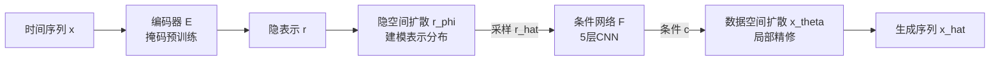

# Latent-to-Data Cascaded Diffusion Models for Unconditional Time Series Generation

**会议**: ICLR 2026  
**OpenReview**: [https://openreview.net/forum?id=nAyeE7cAS0](https://openreview.net/forum?id=nAyeE7cAS0)  
**代码**: 待确认  
**领域**: 时间序列生成 / 扩散模型  
**关键词**: 无条件时间序列生成, 级联扩散, 隐空间扩散, 数据空间扩散, 表示学习  

## 一句话总结
提出 L2D-Diff——把无条件时间序列生成拆成"隐空间扩散先建模高层表示分布、再用该表示作为条件引导数据空间扩散精修局部细节"的级联（latent-to-data）双空间框架，从而同时兼顾表示一致性与局部保真度。

## 研究背景与动机
**领域现状**：合成时间序列生成（TSG）对隐私保护、数据增强、异常检测都很关键。GAN 曾是主流但有训练不稳、模式坍塌的毛病；近年扩散模型（DDPM）凭借更优的生成质量和稳定训练接管了这一方向。

**现有痛点**：现有扩散方法被"单一空间"束缚——**隐空间扩散**（TimeLDM、LDT）在压缩表示上建模，擅长抓高层语义结构，但编码器的信息瓶颈会丢掉细粒度时序细节，损失保真度；**数据空间扩散**（Diffusion-TS、FourierDiffusion）直接在原始序列上去噪，局部细节精确，却难以全面建模高层表示分布。

**核心矛盾**：真实时间序列往往是**多模态分布**（如带类别标注的数据集，跨类存在显著差异），既需要捕捉多样的高层表示分布，又要保留局部时序保真——单空间模型只能顾一头。

**本文目标**：在不依赖任何外部条件（如文本）的前提下，做无条件 TSG，同时实现表示一致性（global）与局部保真（local）。

**核心 idea**：**从"数据空间无条件扩散"转为"latent-to-data 条件扩散"**——先让隐空间扩散学出表示分布，把采样得到的隐码当作条件喂给数据空间扩散，于是无条件生成被改写成一个条件生成问题，用分而治之的方式让两个分支各司其职。

## 方法详解

### 整体框架
L2D-Diff 由两条协作的扩散/去噪分支级联而成：隐空间分支建模高层表示分布，数据空间分支在隐码条件下重建全分辨率序列，中间用一个 latent-to-data 条件机制把隐码注入数据空间去噪。训练时三件套（编码器-解码器掩码预训练 → 隐空间扩散 → 数据空间条件扩散）各自优化；推理时先在隐空间从噪声采样出表示 $\hat{r}_0$，再用它作为条件驱动数据空间从噪声采样出最终序列 $\hat{x}_0$。

### 关键设计

**1. 掩码预训练构建隐空间：让表示既紧凑又信息充分。** 给定输入 $x \in \mathbb{R}^{D\times L}$，先做一个基于掩码建模的预训练任务把它压成定长低维表示 $r \in \mathbb{R}^d$（$d \ll L\times D$）。按二值掩码 $m$ 随机遮住一部分 token 得到 $x_{\text{masked}}$，编码器 $E$ 产出 $r_{\text{masked}}=E(x_{\text{masked}})$，解码器 $D$ 重建原序列，损失只在被遮位置上计算 $L_{\text{pretraining}}=\|m\odot(x-D(E(x_{\text{masked}})))\|_2^2$。实现上直接复用 TS2Vec 的 CNN 作编码器、默认隐维 8、掩码率 50%，这样得到的 $r$ 才能稳定承载高层时序语义、为后续隐空间扩散提供有意义的建模对象。

**2. 隐空间扩散建模表示分布：把"多模态"这件难事交给低维空间解决。** 编码得到 $r_0=E(x)$ 后，对它跑标准 DDPM 前向加噪 $r_s=\sqrt{\bar\alpha_s}r_0+\sqrt{1-\bar\alpha_s}\epsilon$，并训练去噪网络 $r_\phi$ 直接预测干净表示，损失为 $L_{\text{latent}}=\mathbb{E}_{r_0,\epsilon,s}\|r_0-r_\phi(r_s,s)\|^2$。因为是在低维隐空间操作，多模态分布的捕捉变得高效且鲁棒，避免了在高维数据空间直接硬啃多模态的复杂度。

**3. latent-to-data 条件注入：把无条件生成改写成条件生成。** 这是全文的枢纽设计——从学到的隐分布采样出 $\hat{r}$，把它当作条件 $c=r$ 喂进数据空间扩散，于是"无条件 TSG"被重表述为"以表示为条件的生成"。条件网络 $F$（默认 5 层 CNN）把隐码投影成与数据空间去噪兼容的引导信号，调制每一步去噪轨迹，使数据空间的局部细化与隐空间学到的全局结构保持一致。

**4. 数据空间条件扩散精修局部：在隐码引导下补全细粒度时序。** 数据空间去噪网络 $x_\theta$ 在每一步 $k$ 同时接收噪声输入 $x_k$、时间步 $k$ 和条件信号 $F(c)$，用数据预测策略优化 $L_{\text{data}}=\mathbb{E}_{x_0,\epsilon,k}\|x_0-x_\theta(x_k,k,F(c))\|^2$。全局结构由隐码托底后，数据分支得以专注于局部细节和残差不确定性，从而在保证整体一致性的同时把局部保真度做高——作者还从信息瓶颈（IB）视角给出了这种分而治之结构的理论解读。

### 推理流程
推理是"先隐后数"的两级采样：先在隐空间从 $\hat{r}_S\sim\mathcal{N}(0,I)$ 出发，按数据预测的反向步迭代

$$\hat{r}_{s-1}=\frac{\sqrt{\alpha_s}(1-\bar\alpha_{s-1})}{1-\bar\alpha_s}r_s+\frac{\sqrt{\bar\alpha_{s-1}}(1-\alpha_s)}{1-\bar\alpha_s}r_\phi(r_s,s)+\sigma_s\epsilon$$

直到 $s=1$ 得到采样表示 $\hat{r}_0$；随后令条件 $c=\hat{r}_0$，在数据空间从 $\hat{x}_K\sim\mathcal{N}(0,I)$ 出发，按对称的反向步 $\hat{x}_{k-1}=\frac{\sqrt{\alpha_k}(1-\bar\alpha_{k-1})}{1-\bar\alpha_k}x_k+\frac{\sqrt{\bar\alpha_{k-1}}(1-\alpha_k)}{1-\bar\alpha_k}x_\theta(x_k,k,F(c))+\sigma_k\epsilon$ 迭代到 $k=1$，输出最终序列 $\hat{x}_0$。两轮扩散步数均设为 $K=100$，线性方差调度。

## 实验关键数据

### 主实验（Contextual-FID，越低越好，11 个数据集）
覆盖单模态（Stock/Energy/ETTh/Riverflow）与多模态（带类别标注的 7 个分类数据集）。下表节选代表性结果：

| 方法 | Stock | Energy | ECG5000 | Arabic Digits | Character Traj. | 平均排名 |
|---|---|---|---|---|---|---|
| **L2D-Diff** | **0.31** | **0.53** | **0.11** | **1.29** | **0.28** | **1.45** |
| FourierDiffusion | 0.21 | 0.48 | 0.32 | 1.26 | 3.58 | 3.55 |
| FourierFlow | 1.15 | 0.38 | 0.98 | 2.84 | 5.07 | 5.36 |
| Diffusion-TS | 0.49 | 0.82 | 1.95 | 1.66 | 3.57 | — |
| TimeGAN | 0.88 | 0.87 | 3.88 | 4.73 | 3.97 | — |

L2D-Diff 平均排名 1.45，经 Friedman + Conover 检验显著优于全部基线；第二名 FourierDiffusion 仅 3.55。多模态数据集上优势尤其明显。

### 消融实验（Stock / Character Trajectories）

| 变体 | Stock C-FID | Stock DS | CharTraj C-FID | CharTraj DS |
|---|---|---|---|---|
| **L2D-Diff (full)** | **0.310** | **0.048** | **0.284** | **0.179** |
| Latent-space only | 3.682 | 0.204 | 1.829 | 0.355 |
| Data-space only | 0.385 | 0.049 | 2.368 | 0.380 |

### 关键发现
- **双空间缺一不可**：去掉任一分支都会大幅退化，且两分支的相对重要性随数据而变——短序列（Stock，L=24）上数据空间分支更关键，多模态长序列（Character Trajectories，20 类）上隐空间分支更关键，正好印证"全局表示 + 局部保真"互补。
- **t-SNE 可视化**：在 20 类的 Character Trajectories 上，L2D-Diff 能复现各模态的多样性，而 FourierDiffusion/Diffusion-TS/TimeGAN 等基线往往只抓住分布中心、丢失多样性。
- 作者把 DS/PS 视为次要指标（对模型设置与数据规模敏感），以 C-FID 为主。

## 亮点与洞察
- **重表述的巧思**：把"无条件生成"通过隐码条件化转成"条件生成"，让两个扩散过程各管一摊，是典型的分而治之，且首次把 latent↔data 级联用于无条件 TSG。
- **不靠外部条件**：相比 T2S 等需要文本辅助的方案，本方法纯靠自学的表示分布做引导，更简单高效。
- **IB 理论支撑**：用信息瓶颈视角解释为何隐空间托底全局语义、数据空间专注局部，让经验设计有了理论落点。

## 局限与展望
- 级联结构意味着两个扩散模型 + 编码器-解码器，推理需先后跑两轮采样，开销与延迟高于单空间模型。
- 隐维（默认 8）、掩码率（50%）等关键超参对不同数据集的敏感性需逐一调，缺乏自适应机制。
- DS/PS 指标作者自己也承认不稳定，主结论主要依赖 C-FID 单一主指标，跨指标的鲁棒性论证可再强化。
- 编码器直接沿用 TS2Vec 预训练 CNN，隐空间质量与上限受制于该预训练表示，端到端联合优化的空间未充分探索。

## 相关工作与启发
- **图像/图领域的表示条件生成**：RCG（用预训练图像编码器先得表示分布再条件化图像生成）、其图数据扩展、以及统一空间编解码的 EDDPM，是本文 latent-to-data 思路的近亲，但时间序列的时序一致性与多通道相关性带来了它们未覆盖的新挑战。
- **无条件 TSG 两大流派**：数据空间（Diffusion-TS、FourierDiffusion、ImagenTime、TransFusion）与隐空间（TimeLDM、LDT）——本文正是想把两派优点合一。
- **启发**：当一类生成问题同时要"全局结构"和"局部细节"且二者在单一空间难以兼得时，"低维空间建分布 + 高维空间做条件精修"的级联范式值得迁移到音频、轨迹、传感器等其他序列模态。

## 评分
- 新颖性: ⭐⭐⭐⭐ 首次把 latent-to-data 级联扩散系统性地用于无条件时间序列生成，重表述思路清晰
- 实验充分度: ⭐⭐⭐⭐ 11 数据集 + 多类基线 + 显著性检验 + 消融与可视化，覆盖单/多模态；但主指标偏依赖 C-FID
- 写作质量: ⭐⭐⭐⭐ 动机、对比表（Table 1）、框架图与 IB 解读层层递进，易读
- 价值: ⭐⭐⭐⭐ 双空间互补范式简单有效，对隐私/增强等下游 TSG 应用与跨模态迁移都有借鉴意义

<!-- RELATED:START -->

## 相关论文

- [\[ICLR 2026\] A Study of Posterior Stability in Time-Series Latent Diffusion](a_study_of_posterior_stability_in_time-series_latent_diffusion.md)
- [\[ICML 2026\] Latent Laplace Diffusion for Irregular Multivariate Time Series](../../ICML2026/time_series/latent_laplace_diffusion_for_irregular_multivariate_time_series.md)
- [\[NeurIPS 2025\] Synthetic Series-Symbol Data Generation for Time Series Foundation Models](../../NeurIPS2025/time_series/synthetic_series-symbol_data_generation_for_time_series_foundation_models.md)
- [\[ICLR 2026\] TrajFlow: Nationwide Pseudo GPS Trajectory Generation with Flow Matching Models](trajflow_nation-wide_pseudo_gps_trajectory_generation_with_flow_matching_models.md)
- [\[ICLR 2026\] Adapt Data to Model: Adaptive Transformation Optimization for Domain-shared Time Series Foundation Models](adapt_data_to_model_adaptive_transformation_optimization_for_domain-shared_time_.md)

<!-- RELATED:END -->
