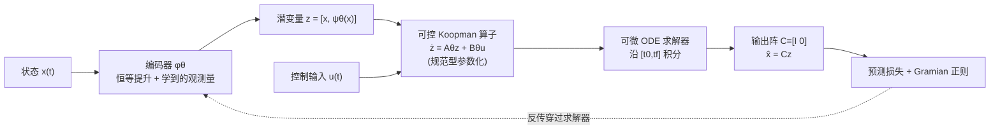

# Learning Koopman Representations with Controllability Guarantees

**会议**: ICLR 2026  
**OpenReview**: [https://openreview.net/forum?id=jITPFROpWN](https://openreview.net/forum?id=jITPFROpWN)  
**代码**: [https://github.com/KYMiao/Controllable-Koopman](https://github.com/KYMiao/Controllable-Koopman)  
**领域**: 时间序列 / 动力系统学习 (系统辨识与控制)  
**关键词**: Koopman 算子, 可控性, Neural ODE, 系统辨识, 模型预测控制 (MPC), 数据效率  

## 一句话总结
把"可控性"作为**结构先验**直接编进 Koopman 表示学习里——用一个新的可控规范型 (canonical form) 参数化潜空间线性算子，使学到的 Neural ODE 模型**天生可控**，从而在数据稀缺时仍能拟合准确、并直接用于 MPC 控制。

## 研究背景与动机
- **领域现状**：从数据学非线性动力学模型是控制设计的核心。深度方法 (神经状态空间模型、RNN、Neural ODE) 表达力强、能拟合复杂轨迹；Koopman 方法则把非线性动力学在"提升空间 (lifted space)"近似成线性，让 MPC 等线性控制工具能直接套用。
- **现有痛点**：纯预测导向的模型虽然轨迹拟合好，却**不适合控制**——非线性结构挡住了 MPC，且对闭环性质 (稳定性、安全性) 没有保证;而几乎所有辨识方法都**只盯着轨迹拟合**，把结构性质留到训练后再事后检查。
- **核心矛盾**：控制最关键的先验之一是**可控性 (controllability)**——它保证存在能把系统从任意初态驱到任意目标态的控制策略。但在训练中编码可控性极难：验证非线性系统可控性要在无穷多 Lie bracket 上查复杂秩条件。已有工作要么只把 Kalman 秩条件当 loss 加上去 (既不保证也不反映可控性)，要么只停在纯理论分析没给出可计算方法。
- **本文目标**：让学到的模型**既能准预测，又由构造 (by construction) 保证可控**，把可控性当成缩小搜索空间的归纳偏置，而非事后补丁。
- **核心 idea**：**[可控性即先验]** 不在原状态空间直接学动力学，而是在 Koopman 潜空间学线性表示;证明"潜空间线性模型可控 ⟹ 原非线性系统可控"，再用一个**可控规范型参数化**把这条性质硬编码进网络权重，配合 Gramian 正则塑形"可控程度"，最终以端到端 Neural ODE 训练。

## 方法详解

### 整体框架
把待学系统写成 Koopman 形式的 Neural ODE：编码器 $\phi_\theta$ 把状态 $x$ 提升到潜变量 $z=[x,\ \psi_\theta(x)]$ (前 $n$ 维用恒等提升保留原状态)，潜空间服从线性动力学 $\dot z = A_\theta z + B_\theta u$，再用固定输出阵 $C=[I_n\ \ 0]$ 解码回 $\hat x = Cz$。整条管线 (编码器 + 可控 Koopman 算子 + 可微 ODE 求解器) 端到端联合训练，关键在于 $A_\theta,B_\theta$ 不是自由学的，而是经规范型构造确保整个模型由构造可控。

### 关键设计

**1. 把"输出可控"等价转成"可查的状态-输出可控"：让可控性变得可验证。** 论文先区分两类可控性：状态-输出可控 (SOC，能从任意潜初态驱动输出到任意目标，可用 Kalman 秩条件查) 与输出-输出可控 (OOC，能从任意输出态驱到任意输出态，OOC 才真正对应原非线性系统的可控)。关键的 Lemma 1 证明：在恒等提升下，限制潜集合 $Z:=\phi(\mathbb R^n)$ 后，**OOC 与 SOC 等价**——于是难验证的 OOC 可以通过易查的 SOC 来判定。Theorem 1 进一步给出可查判据：系统 OOC 当且仅当可控性矩阵 $\mathcal C = C[B_\theta\ \ A_\theta B_\theta\ \cdots\ A_\theta^{N-1}B_\theta]$ 满秩。这一步把"模型可控"从理论概念落成一个可在网络里施加的代数条件。

**2. 可控规范型参数化：让可控性"由构造成立"而非靠损失约束。** 直接把 $-\min\mathrm{eig}(\mathcal C)$ 加进 loss 只是软约束、没有保证。Theorem 2 给出硬构造：先写出一个规范可控对 $(A^c_\theta, B^c_\theta)$——其中 $A^c_\theta$ 前 $n-1$ 行只含 0/1 且 1 都落在超对角线上、其余元素自由学，$B^c_\theta$ 前 $n-1$ 行为 0、第 $n$ 行为 1、其余自由学;再经一个**可学的相似变换** $P_\theta=\mathrm{diag}(P_1,P_2)$ 得到实际算子

$$A_\theta = P_\theta A^c_\theta P_\theta^{-1}, \qquad B_\theta = P_\theta B^c_\theta.$$

相似变换不改变可控性，所以无论 $P_\theta$ 和那些自由元素怎么训练，$(A_\theta,B_\theta)$ 始终 OOC——可控性被永久"焊死"在参数化里。同时 $P_\theta$ 提供表达力：没有它，输入对恒等坐标的影响会被严重限制。单输入 ($m=1$) 直接适用，多输入则经 Brunovský 分解扩展。

**3. Gramian 正则塑形"可控程度"：从二值可控走向良条件可控。** 仅可控还不够——把系统从某些方向驱动可能需要极大输入能量。论文用有限时域输出 Gramian $W^y_T=\int_0^T (Ce^{A_\theta\tau}B_\theta)(Ce^{A_\theta\tau}B_\theta)^\top d\tau$ 度量输入对物理状态的激励：$\lambda_{\min}$ 太小意味着存在"难驱动"方向，条件数 $\kappa$ 太大意味着可控性不均衡、优化病态。于是加正则

$$R_{\mathrm{gram}}(A_\theta,B_\theta)=\frac{1}{\lambda_{\min}(W^y_T)+\gamma}\ \kappa(W^y_T),$$

鼓励抬高最小特征值、压低条件数，得到各方向均衡、良条件的模型，降低下游控制能耗。

**4. 端到端损失与 MPC 部署：长时域预测损失 + 凸 QP 控制。** 训练目标为 $\min_\theta L_{\mathrm{pred}}(\theta)+\lambda_{\mathrm{gram}}R_{\mathrm{gram}}$，其中预测损失 $L_{\mathrm{pred}}=\frac{1}{t_f-t_0}\int_{t_0}^{t_f} w(t)\|\hat x(t)-x(t)\|_2^2 dt$ 在**整段 rollout** 上评估 (而非只看单步)，权重 $w(t)$ 带衰减以强调早期误差又兼顾全程;梯度穿过 ODE 求解器实现端到端训练。由于连续时间形式，模型支持不规则/多采样率数据，且能在与训练不同的控制频率下直接使用、无需重训。部署时把连续模型零阶保持离散化为 $(A^d_\theta,B^d_\theta)$，MPC 完全建在线性 surrogate 上，成为**凸二次规划**，求解快且有收敛保证。

## 实验关键数据

### 主实验 (预测精度 vs 数据量)
在 Mountain Car / Pendulum / Cartpole 三个非线性基准上，用不同数据比例 (1%~100%) 训练，比较 MLP、DKO (Deep Koopman Operator) 与本文方法的预测 MSE：

| 环境 | 方法 | 1% | 5% | 10% | 30% |
|------|------|------|------|------|------|
| Mountain Car | DKO | 0.0200 | 0.00022 | 0.00016 | — |
| Mountain Car | **Ours** | **0.0032** | **0.00019** | **0.00011** | — |
| Pendulum | DKO | 1.5347 | 0.1079 | 0.0390 | 0.0086 |
| Pendulum | **Ours** | **0.3747** | **0.0318** | **0.0114** | **0.0061** |
| Cartpole | DKO | 0.1306 | 0.01452 | 0.007585 | 0.00064 |
| Cartpole | **Ours** | **0.0095** | **0.0024** | **0.001153** | **0.000571** |

数据 <30% 时本文显著领先;数据充足时与 DKO 相当 (说明二者表达力都够)，但关键区别是本文**由构造保证可控**而 DKO 只能事后评估且无保证。训练曲线显示本文收敛更快、稳定在更低 loss。

### 控制性能 (嵌入 MPC 的输入能耗)

| 环境 | 任务 | 数据 | DKO 代价 | 本文代价 | 相对↓ |
|------|------|------|----------|----------|-------|
| Mountain Car | 上山 | 1% | Fail | 186.59 | — |
| Mountain Car | 上山 | 5% | 297.51 | 165.21 | 44.5% |
| Pendulum | 摆起保持 | 5% | Fail | 100.25 | — |
| Pendulum | 摆起保持 | 10% | 239.2 | 43.50 | 81.8% |
| Cartpole | 平衡 | 30% | Fail | 19.61 | — |

数据稀缺时 DKO 因模型不准/不可控常使 MPC 不可行 (Fail)，本文则能完成任务且输入能耗显著更低。

### 多输入扩展
扩到 Reacher (MuJoCo)、7-DoF Franka 机械臂及六维基因调控网络 (GRN，3 控制输入)：GRN 上本文测试 MSE $1.0\times10^{-4}$ vs DKO $3.0\times10^{-4}$;控制任务输入代价 80.96 vs DKO 89.98，验证规范型与训练流程可超越单输入设定。

### 关键发现
- 可控性不仅是下游保证，更是强归纳偏置：**提升数据效率、加速收敛、稳定预测**。
- 离散 MLP 难以捕捉连续动力学，rollout 误差快速累积。
- 多输入设定优化更难稳定、数据稀缺时性能退化更快——是规范型扩展的主要挑战。

## 亮点与洞察
- **"先验即剪枝"的清晰叙事**：把可控性当作约束搜索空间的结构先验 (Figure 1 直观展示限制到可控模型集大幅缩小参数空间)，把一个看似只服务下游控制的性质，转化成提升数据效率的训练杠杆。
- **理论闭环漂亮**：OOC↔SOC 等价 (Lemma 1) → 可查秩判据 (Theorem 1) → 可控规范型硬构造 (Theorem 2)，一条链把"难验证的非线性可控性"落成"可微参数化"，而非软 loss 妥协。
- **相似变换是点睛之笔**：用 $P_\theta$ 在保证可控不变的同时恢复表达力，解决了规范型"够可控但不够灵活"的张力。
- **连续时间带来工程红利**：天然支持不规则/多采样率数据，且训练频率与控制频率解耦、无需重训——这是很多离散 Koopman 方法做不到的。

## 局限与展望
- **多输入仍是软肋**：作者自陈多输入可控性在初始化与参数化上更复杂，实践中"如何把控制输入分配给状态变量"往往不清楚，数据稀缺时性能退化更快。
- **实验规模偏经典控制基准**：以 Pendulum/Cartpole/Mountain Car 为主，机械臂/GRN 放在附录，缺少高维真实世界系统的大规模验证。
- **可控性 ≠ 稳定性/安全性**：本文只硬编码可控性，稳定性、安全约束等其他关键闭环性质仍需另行处理 (相关工作 Fan et al. 2024 走的是稳定性 LMI 路线)。
- **Gramian 正则需调参**：$\lambda_{\mathrm{gram}}$、$\gamma$、Gramian 时域 $T$ 等引入额外超参，其对不同系统的敏感度未充分讨论。

## 相关工作与启发
- **Koopman 表示学习**：DMD 及其扩展依赖预设基函数;近年用自编码器/神经网络学观测量 (Lusch 2018, Yeung 2019)，但多数只盯多步预测、少有结构性质。本文是少数把可控性"由构造"嵌入的工作。
- **可控性先例**：Han et al. 2020 把 Kalman 秩条件当 loss (无保证)，Choi et al. 2024 只在精确表示假设下做理论分析 (无可计算方法)——本文补上了可计算的硬约束。
- **其他结构先验**：Fan et al. 2024 用 LMI 参数化嵌入可稳定性，Guo et al. 2025 用神经网络非线性嵌入控制输入但需事后 Lie bracket 检查。本文展示了"规范型参数化"这条更干净的硬编码路线。
- **启发**：把领域内"难验证但重要"的结构性质 (可控/可观/稳定/守恒) 转写成等价的可微参数化、焊进网络权重，是把控制理论先验注入深度模型的通用范式，值得迁移到稳定性、无源性等其他性质。

## 评分
- **新颖性**: ⭐⭐⭐⭐⭐ 首次给出可用于 Koopman 表示的 OOC 可控规范型并把可控性"由构造"嵌入端到端学习，理论与方法都新。
- **实验充分度**: ⭐⭐⭐⭐ 在多基准 + 数据效率 + MPC 控制 + 多输入扩展上系统验证，但仍以经典控制环境为主、缺大规模真实系统。
- **写作质量**: ⭐⭐⭐⭐⭐ 动机—理论—方法—实验逻辑清晰，定义/定理层层递进，图示 (先验剪枝、可控性关系图、pipeline) 到位。
- **价值**: ⭐⭐⭐⭐⭐ 在数据稀缺下同时保证预测精度与可控性、直接接入凸 MPC，对学习型控制 (learning for control) 有实打实的工程与理论价值。

<!-- RELATED:START -->

## 相关论文

- [\[ICLR 2026\] Learning Recursive Multi-Scale Representations for Irregular Multivariate Time Series Forecasting](learning_recursive_multi-scale_representations_for_irregular_multivariate_time_s.md)
- [\[ICLR 2026\] TSPulse: Tiny Pre-Trained Models with Disentangled Representations for Rapid Time Series](tspulse_tiny_pre-trained_models_with_disentangled_representations_for_rapid_time.md)
- [\[NeurIPS 2025\] Learning Time-Scale Invariant Population-Level Neural Representations](../../NeurIPS2025/time_series/learning_time-scale_invariant_population-level_neural_representations.md)
- [\[ICML 2026\] Learning Long Range Spatio-Temporal Representations over Continuous Time Dynamic Graphs with State Space Models](../../ICML2026/time_series/learning_long_range_spatio-temporal_representations_over_continuous_time_dynamic.md)
- [\[ICLR 2026\] Can we generate portable representations for clinical time series data using LLMs?](can_we_generate_portable_representations_for_clinical_time_series_data_using_llm.md)

<!-- RELATED:END -->
