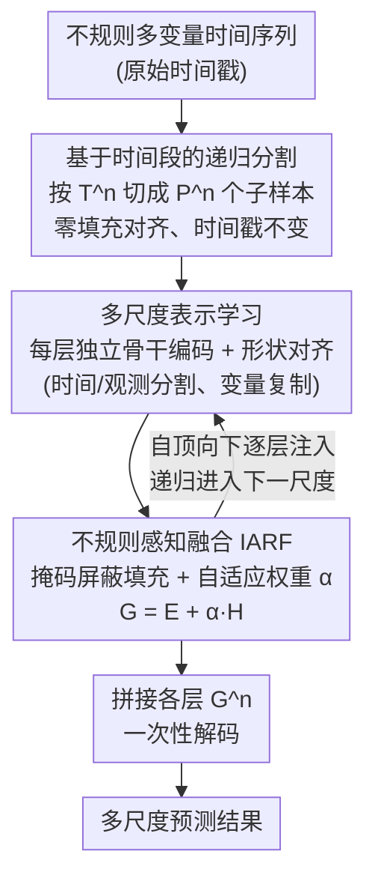

# Learning Recursive Multi-Scale Representations for Irregular Multivariate Time Series Forecasting

**会议**: ICLR 2026  
**arXiv**: [2602.21498](https://arxiv.org/abs/2602.21498)  
**代码**: [有](https://github.com/Ladbaby/PyOmniTS)  
**领域**: 时间序列  
**关键词**: 不规则时间序列, 多尺度建模, 递归分割, 采样模式保留, 预测

## 一句话总结

提出 ReIMTS，通过基于时间段的递归分割（而非重采样）来保留不规则多变量时间序列的原始采样模式，结合不规则感知的表示融合机制实现多尺度建模，作为插件在六种 IMTS 骨干上平均提升 27.1%。

## 研究背景与动机

不规则多变量时间序列（IMTS）在医疗、气象等场景中广泛存在，其观测时间间隔不均匀，且不同变量的观测时刻可能不对齐。这种采样模式本身包含重要信息，例如 ICU 中密集监测→稀疏监测反映病情从危急到平稳的变化。

现有多尺度方法的核心问题：

- **规则时间序列方法**（Scaleformer、TimeMixer、Pathformer）假设输入均匀采样，不适用于 IMTS
- **IMTS 多尺度方法**（Warpformer、Hi-Patch、HD-TTS）依赖 **重采样** 获取粗粒度序列，这会破坏原始采样模式——如 PhysioNet'12 中 Bilirubin 从密到疏的采样模式在下采样后被打乱
- 采样模式信息（如紧急→常规监测转变）对临床决策至关重要，不应被破坏

## 方法详解

### 整体框架

ReIMTS 是一个即插即用的多尺度框架，兼容大多数编码器-解码器结构的 IMTS 模型。它在每个尺度层级按时间段把样本递归切成更短周期的子样本、但保持所有观测的原始时间戳不变，再用逐层级的骨干编码器和一个不规则感知融合模块把全局与局部表示自顶向下逐层注入，从而在不破坏采样模式的前提下获得多尺度视角。整体数据流是「递归分割 → 逐层编码与形状对齐 → IARF 融合（并递归注入下一层）→ 拼接解码」一条自顶向下的链路。

### 关键设计

**1. 基于时间段的递归分割：保留采样模式而非重采样**

现有 IMTS 多尺度方法靠重采样（下采样）得到粗粒度序列，这会抹掉"密集监测→稀疏监测"这类本身就携带语义的采样模式。ReIMTS 改用按时间段切分：在尺度层级 $n$ 上，把样本按时间段 $T^n$ 分成 $P^n = T^1/T^n$ 个子样本。这里的关键是切分依据是**现实时间段**（如 12 小时、24 小时）而非观测数量——若按观测数量切，不同子样本会对应不等长的真实时间跨度，时间语义就乱了；而按时间段切则原始时间戳完全保留，仅用零填充对齐。以 PhysioNet'12 为例，层级 1 是完整 48 小时，层级 2 按 24 小时分成 2 个子样本，层级 3 按 12 小时分成 4 个子样本，由此形成从全局到局部的多尺度视角，而每个观测的真实采样时刻始终不变。

**2. 多尺度表示学习：每层独立编码并向下对齐形状**

每个尺度层级用一个独立的骨干编码器 $\mathcal{F}^n_{\text{enc}}$ 编码该层级的子样本，得到 $\mathbf{E}^n = \mathcal{F}^n_{\text{enc}}(\mathbf{S}^n)$。编码后的潜在表示按 IMTS 的三个维度拆成三类：时间表示 $\mathbf{E}^n_{\text{time}} \in \mathbb{R}^{P^n \times L^n \times D}$、变量表示 $\mathbf{E}^n_{\text{var}} \in \mathbb{R}^{P^n \times V \times D}$、以及观测表示 $\mathbf{E}^n_{\text{obs}} \in \mathbb{R}^{P^n \times L^n \times V \times D}$。要把上一层的全局表示 $\mathbf{H}^n$ 注入下一层，需先让形状匹配：对时间表示和观测表示用分割操作，对变量表示用复制操作，把 $\mathbf{H}^n$ 变换为与下层局部表示 $\mathbf{E}^{n+1}$ 对齐的形状，为后续融合做准备。

**3. 不规则感知表示融合（IARF）：用掩码区分真实观测与填充**

形状对齐后，时间/观测表示里仍混着零填充位置，若直接相加会把填充噪声当成信号。IARF 先用二值掩码 $\mathbf{M}^{n+1}$ 标出下层尺度的真实观测与填充：对时间/观测表示按 $\mathbf{H}^n_{\text{IMTS}} = \mathbf{H}^n \cdot \mathbf{M}^{n+1}$ 屏蔽填充位，而变量表示的不规则信息已由 IMTS 骨干编码进去，故直接取 $\mathbf{H}^n_{\text{IMTS}} = \mathbf{H}^n$。随后用一个轻量评分层算自适应权重 $\alpha = \text{ReLU}(\text{FF}(\mathbf{H}^n_{\text{IMTS}}))$，把全局信息按需融进局部表示：$\mathbf{G}^{n+1} = \mathbf{E}^{n+1} + \alpha \mathbf{H}^n_{\text{IMTS}}$。这样全局上下文只在真实观测处生效，避免填充值污染下层表示。

### 损失函数 / 训练策略

在最低尺度层级 $N$，解码器把所有层级的融合表示拼接后一次性解码，$\hat{\mathbf{Z}} = \mathcal{F}_{\text{dec}}(\text{Concat}(\{\mathbf{G}^n\}_{n=1}^N))$，让最终预测同时利用全局到局部各尺度的信息。训练用 MSE 损失，且只对预测窗口内的 $Y_Q$ 个预测查询计算 $\mathcal{L} = \frac{1}{Y_Q} \sum_{j=1}^{Y_Q} (\hat{z_j} - z_j)^2$。优化最多跑 300 个 epoch，early stopping 耐心设为 10。

## 实验关键数据

### 主实验

在5个 IMTS 数据集（MIMIC-III/IV、PhysioNet'12、Human Activity、USHCN）和26个基线方法上评估。

| 骨干模型 | 原始 MSE(×10⁻¹) | +ReIMTS MSE(×10⁻¹) | 平均提升 |
|---------|-----------------|-------------------|---------|
| PrimeNet | 9.04/6.25/7.93/26.84/4.57 | 4.76/3.58/3.01/0.82/1.71 | **↑62.3%** |
| mTAN | 8.51/5.09/3.75/0.89/5.65 | 6.37/4.04/3.51/0.89/1.70 | ↑24.3% |
| TimeCHEAT | 4.41/2.50/3.27/0.68/1.73 | 4.40/2.02/2.90/0.52/1.62 | ↑12.1% |
| GRU-D | 4.75/5.97/3.25/1.76/2.42 | 4.67/3.91/3.25/0.51/1.89 | ↑25.8% |
| GraFITi | 4.08/2.39/2.85/0.43/1.71 | 4.07/1.79/2.83/0.42/1.66 | ↑6.3% |

与其他多尺度 IMTS 方法对比（以 GraFITi 为骨干）：

| 方法 | MIMIC-III | MIMIC-IV | PhysioNet'12 | Human Activity | USHCN |
|-----|----------|---------|-------------|---------------|-------|
| Warpformer | 4.09 | 2.42 | 2.88 | 0.54 | 1.77 |
| HD-TTS | 4.17 | 2.36 | 2.83 | 0.50 | 1.66 |
| Hi-Patch | 4.35 | 2.36 | 3.11 | 0.48 | 2.34 |
| **ReIMTS** | **4.07** | **1.79** | **2.83** | **0.42** | **1.66** |

### 消融实验

| 变体 | MIMIC-III | MIMIC-IV | PhysioNet'12 | Human Activity | USHCN |
|-----|----------|---------|-------------|---------------|-------|
| ReIMTS (完整) | **4.07** | **1.79** | **2.83** | **0.42** | **1.66** |
| rp sample (不分割) | 4.99 | 1.92 | 2.83 | 0.45 | 1.69 |
| rp split (按观测数分割) | 5.02 | 2.36 | 3.20 | 0.61 | 2.31 |
| rp IARF (融合→加法) | 4.20 | 1.84 | 2.79 | 0.47 | 1.89 |
| w/o IARF (去掉融合) | 4.77 | 2.07 | 3.06 | 0.54 | 1.69 |

### 关键发现

- 按时间段分割（ReIMTS）远优于按观测数分割（rp split），在 USHCN 上差距高达 0.65
- 老模型（mTAN、GRU-D）加上 ReIMTS 后可超越更新的模型
- 效率分析：ReIMTS 使用 GraFITi 骨干时，训练速度最快、GPU 内存最小，优于 Warpformer、HD-TTS、Hi-Patch

## 亮点与洞察

1. **保留采样模式的多尺度设计**：不用重采样，而是基于时间段递归分割，简洁且有效
2. **即插即用兼容性**：适配大多数编码器-解码器 IMTS 模型，通用性强
3. **老方法焕新生**：PrimeNet 提升 62.3%、GRU-D 提升 25.8%，说明多尺度补充是关键缺失环节
4. **效率优势**：利用轻量骨干（如 GraFITi）可同时实现最优精度和最优效率

## 局限与展望

- ODE-based 模型与 ReIMTS 结合时缺乏理论解释
- 扩散模型的噪声潜在表示与 ReIMTS 的融合机制不直接兼容
- 时间段长度的选择需人工指定（附录给出了各数据集设置），自适应选择是可探索方向
- 仅验证了预测任务，分类等其他下游任务未探索

## 相关工作与启发

- 与 tPatchGNN、PrimeNet 的关系：它们可看作 ReIMTS 的单尺度特例
- Scaleformer 等规则时序多尺度方法因重采样而破坏采样信息
- 启发：对于其他处理不规则数据的任务（如事件序列、点过程），保留原始时间信息的多尺度方法可能同样有益

## 评分

- 新颖性: ⭐⭐⭐⭐ （基于时间段分割的思路简洁有效，IARF 融合机制设计合理）
- 实验充分度: ⭐⭐⭐⭐⭐ （5个数据集、26个基线、6个骨干、完整消融和效率分析）
- 写作质量: ⭐⭐⭐⭐ （动机清晰，图示直观，与现有方法的对比详尽）
- 价值: ⭐⭐⭐⭐ （即插即用设计实用性强，已开源于 PyOmniTS）

<!-- RELATED:START -->

## 相关论文

- [\[ICLR 2026\] Time-Gated Multi-Scale Flow Matching for Time-Series Imputation](time-gated_multi-scale_flow_matching_for_time-series_imputation.md)
- [\[ICML 2026\] Latent Laplace Diffusion for Irregular Multivariate Time Series](../../ICML2026/time_series/latent_laplace_diffusion_for_irregular_multivariate_time_series.md)
- [\[ICLR 2026\] pyrregular: A Unified Framework for Irregular Time Series, with Classification Benchmarks](pyrregular_a_unified_framework_for_irregular_time_series_with_classification_ben.md)
- [\[ICLR 2026\] Learning Koopman Representations with Controllability Guarantees](learning_koopman_representations_with_controllability_guarantees.md)
- [\[ICLR 2026\] ASTGI: Adaptive Spatio-Temporal Graph Interactions for Irregular Multivariate Time Series Forecasting](astgi_adaptive_spatio-temporal_graph_interactions_for_irregular_multivariate_tim.md)

<!-- RELATED:END -->
