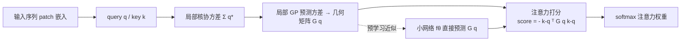

# Local Geometry Attention for Time Series Forecasting under Realistic Corruptions

**会议**: ICLR 2026  
**OpenReview**: [https://openreview.net/forum?id=NCQPCxN7ds](https://openreview.net/forum?id=NCQPCxN7ds)  
**代码**: [https://github.com/dongbeank/LGA](https://github.com/dongbeank/LGA)  
**领域**: 时间序列预测 / 鲁棒注意力 / 高斯过程  
**关键词**: Local Geometry Attention, Gaussian Process, Mahalanobis 距离, 鲁棒性基准, PatchTST  

## 一句话总结
用局部高斯过程把注意力打分从欧氏点积换成「查询自适应的负马氏距离」，让 Transformer 在 spike / level-shift 等真实污染下不被异常点带偏，并配套提出首个统计学接地的时序鲁棒性基准 TSRBench。

## 研究背景与动机
**领域现状**：Transformer 在时序预测上靠 PatchTST 等模型刷出强性能，但标准注意力用全局统一的点积相似度，对所有输入「一视同仁」。然而时序数据有独特的**局部几何结构**——周期模式在 key-query 嵌入空间里天然成簇，局部数据分布非均匀，这种「注意力几何」是图像/文本里没有的关键特征。

**现有痛点**：(1) 标准点积注意力无法适应局部统计变化，遇到传感器尖峰、电平漂移这类真实污染时，异常点会被分到很高的注意力分数，把预测带偏；(2) 已有的「鲁棒注意力」(MoM、Elliptical) 是为视觉/语言设计的，依赖全局核假设，搬到时序上反而比标准注意力更差；(3) 评测层面更尴尬——视觉有 ImageNet-C，时序却没有标准鲁棒性基准，现有研究多用合成对抗攻击，不反映真实数据退化。

**核心矛盾**：时序污染破坏的恰恰是「局部几何」，而标准注意力既没有建模局部几何的能力，也缺乏一个能干净评测这种鲁棒性的基准——评测真实异常数据时还面临「测试集 ground truth 必须干净、但真实数据缺精确异常标签」的两难。

**本文目标**：同时补上两个缺口——一个能感知局部几何、对污染有韧性的注意力机制，和一个统计学接地、可复现的鲁棒性评测框架。

**核心 idea**：**用局部高斯过程的预测方差当作数据密度的代理**。在 query 处估计一个局部几何矩阵 $G(q)$，把注意力打分定义成负马氏距离 $-(k-q)^\top G(q)(k-q)$——密集区域方差小得分高、稀疏区域(异常点)方差大得分低，从而天然抑制异常。

## 方法详解

### 整体框架
LGA 的理论链条分三步搭起来：先用**局部核协方差**捕捉数据流形的局部几何，再把它接到**局部高斯过程**上得到能反映数据密度的预测方差，最后用负方差导出**几何感知的注意力打分**。由于直接对每个 query 求几何矩阵需要遍历全部 key、计算上不可行，LGA 用一个小网络 $f_\theta$ 预先学会从 query 直接预测几何矩阵，把昂贵的几何估计与训练/推理解耦。

### 关键设计

**1. 局部核协方差：把流形几何编码进矩阵**——LGA 不像传统全局高斯过程那样用一个统一核，而是为每个目标点 $x_*$（对应 query $q_*$）建一个局部协方差矩阵。它先把 key 相对 query 做差当特征 $\phi(k_i)=k_i-q_*$，再用高斯核权重 $\omega_i(x_*)=K(k_i,q_*)/\sum_j K(k_j,q_*)$ 加权求外积：$\Sigma(x_*)=\sum_i \omega_i(x_*)(k_i-q_*)(k_i-q_*)^\top$。离 query 越近的 key 权重越大，于是这个衰减加权的协方差矩阵实际逼近了数据流形上的逆度量张量，把「query 附近长什么样」编码进了 $\Sigma$。

**2. 局部高斯过程把方差变成密度代理**——这是全文的理论支点。在 $x_*$ 处建一个所有观测输出都为零的局部 GP，其对新点 $k$ 的预测方差为 $\sigma^2_{q_*}(k)=(k-q_*)^\top G(x_*)(k-q_*)$，其中 $G(x_*)=\sigma^2[\Sigma(x_*)+\sigma^2 I]^{-1}$。GP 的性质决定了**数据密集处预测方差小、稀疏处方差大**，所以负预测方差 $-\sigma^2_{q_*}(k)$ 恰好可以当作「在 $q_*$ 视角下 $k$ 周围的数据密度」。异常点位于稀疏区，方差大、密度低，自然被压低。

**3. 几何感知打分 = 负马氏距离 = 测地距离近似**——基于上一步，LGA 把相似度直接定义为 $\mathrm{score}(q,k)=-(k-q)^\top G(q)(k-q)$，即一个度量随局部几何自适应的负平方马氏距离，再过 softmax 得权重。作者进一步给出黎曼几何解释：在带度量张量 $G$ 的数据流形上，邻域内测地距离的一阶泰勒展开就是 $(k-q)^\top G(q)(k-q)$，因此该打分可解读为「负平方测地距离近似」，$G(q)$ 是查询点处局部黎曼度量张量的经验估计，让注意力顺着流形曲率分配，而非粗暴的欧氏相似度。

**4. 预学习近似让 LGA 实际可跑**——按公式 4 为每个 query 实算 $G(q)$ 要访问全部 key，大模型上代价过高。LGA 训练一个小网络 $G(q)\approx f_\theta(q)$ 直接从 query 预测几何矩阵（每个注意力头一个独立网络），并把目标矩阵近似成对角阵以保证可处理性。训练数据混合两部分：从训练中真实出现的 query 采样的 $S_{real}$，加上随机生成、用于覆盖更广表示空间的 $S_{gen}$，损失是各层各头上预测与真值 $G_{true}$ 的 MSE。这个预学习策略把昂贵的几何估计从主模型训练/推理里剥离，使 LGA 训练速度与标准注意力相当。

**5. TSRBench：统计学接地的污染基准**——为补上评测缺口，作者构造了两类规范污染：**spike**（非对称指数尖峰）和 **level shift**（持续电平漂移），污染事件的出现时刻由速率 $\lambda$ 的泊松过程控制，持续时间从几何分布采样。关键在于污染幅度不是随意设的——用 DSPOT 极值算法按显著性水平 $q$ 标定阈值，保证注入的是「统计显著但真实」的偏离。通过三元组 $(\lambda,p,q)$ 设五个递增的严重度等级，且**输入被污染、预测 horizon 的 ground truth 保持干净**，从而干净地隔离输入污染对预测的影响。

## 实验关键数据

数据集：Weather / Electricity / ETT(h1/h2/m1/m2)，输入长度 512，把 LGA 嵌入 PatchTST 得 **PatchLGA**，对比 PatchTST、TimeMixer、CATS、iTransformer。

### 主实验：组合污染下的 MSE（部分，跨 horizon {96,192,336,720} 平均）

| 数据集 | 严重度 | PatchLGA | PatchTST | TimeMixer |
|---|---|---|---|---|
| ETTm1 | 0(干净) | **0.351** | 0.352 | 0.360 |
| ETTm1 | 3 | **0.519** | 0.614 | 0.594 |
| ETTm1 | 5 | **0.734** | 0.839 | 0.837 |
| Weather | 5 | **0.454** | 0.491 | 0.576 |
| ETTh2 | 5 | **0.404** | 0.427 | 0.459 |

干净数据(severity 0)上 PatchLGA 与 PatchTST 持平，说明加 LGA **不损害原始预测能力**；污染越重优势越大，level 5 在 ETTm1 上 MSE 降 12.3%，在 Weather 上比 TimeMixer 低 21.2%。

### 消融/对比：与其他鲁棒注意力比较（ETTm1 平均 MSE）

| 严重度 | SDP(标准) | MoM | Elliptical | LGA |
|---|---|---|---|---|
| 3 | 0.614 | 0.670 | 0.722 | **0.519** |
| 4 | 0.695 | 0.871 | 0.755 | **0.617** |
| 5 | 0.839 | 1.016 | 0.880 | **0.734** |

视觉/语言里成功的鲁棒注意力(MoM、Elliptical)搬到污染时序上**反而比标准注意力更差**，只有为时序局部结构专门设计的 LGA 退化最小；效率上 LGA 训练速度接近 SDP，显存(4.6 GiB)远低于 MoM(16 GiB)。

### 跨注意力架构（ETTm1 组合污染，LGA vs SDP，level 5 MSE）

| 架构 | 注意力类型 | LGA | SDP |
|---|---|---|---|
| PatchTST | 时序自注意力 | **0.734** | 0.839 |
| CATS | 交叉注意力 | **1.037** | 1.102 |
| iTransformer | 通道注意力 | **1.266** | 1.309 |

### 关键发现
- LGA 对时序自注意力收益最大、最稳定；CATS 峰值提升达 17.1% 但不稳定（其交叉注意力作用在被线性嵌入的噪声输入上）；iTransformer 因整段线性嵌入破坏了周期局部几何，提升温和但稳定。
- PatchLGA 能更好利用更长历史上下文在噪声下做准预测（输入长度实验）。

## 亮点与洞察
- **把「方差=密度」这条 GP 性质用成异常抑制器**：负预测方差天然给稀疏区(异常)低分，无需显式异常检测模块，鲁棒性是几何打分的副产品。
- **理论三连**：局部核协方差 → 局部 GP 预测方差 → 黎曼测地距离近似，把一个工程上的注意力改动接到了流形几何上，$G(q)$ 有明确的「局部度量张量经验估计」身份。
- **预学习解耦**让「每 query 求逆」这种 $O$ 爆炸的操作降级成一次小网络前向，是把理论方法落地的关键工程取舍。
- **TSRBench 解决评测两难**：污染输入、保持预测目标干净，配合 DSPOT 统计接地，比单纯 jitter/对抗攻击更贴近真实传感器故障。

## 局限与展望
- 目标几何矩阵被近似成**对角阵**（假设局部特征维度独立），丢掉了维度间相关性，可能在强耦合的多变量序列上欠表达。
- 几何矩阵靠预学习网络近似，$f_\theta$ 的泛化（尤其对训练时未见的 query 分布）依赖 $S_{gen}$ 采样质量，分布漂移大时近似误差未知。
- TSRBench 只覆盖 spike 与 level shift 两类规范污染，真实世界还有缺失值、漂移趋势、多源叠加等更复杂退化未纳入。
- 主要在 PatchTST 类 patch 化架构上验证；对非 patch、纯线性或频域模型的适配性还需更多证据。

## 相关工作与启发
- **注意力的理论解释**：把注意力看成相关高斯过程的互协方差(Bui 2024)、对称核 GP 后验做贝叶斯推断(SGPA, Chen & Li 2023)、用 RKDE+MoM 抑制离群 key(Han 2023)、超椭球邻域(Elliptical, Nielsen 2024)——LGA 的区别在于显式建模**局部**几何而非依赖全局核假设。
- **鲁棒性基准**：ImageNet-C 树立了多严重度通用污染评测范式，NLP 也有类似工作，而时序长期停在合成对抗攻击；TSRBench 把「真实退化 + 统计接地」补进时序。
- **启发**：当某领域数据有独特的几何/结构先验（如时序的局部周期成簇）时，与其套用他领域的鲁棒方法，不如把该结构直接编码进相似度度量；GP 预测方差作为密度/置信度代理是个可迁移的轻量工具。

## 评分
- **新颖性**: ⭐⭐⭐⭐ 把局部高斯过程预测方差接成黎曼测地距离近似的注意力打分，视角新颖且自洽；TSRBench 填补时序鲁棒评测空白。
- **实验充分度**: ⭐⭐⭐⭐ 六数据集、五严重度、三类注意力架构、与多种鲁棒注意力及效率权衡都有覆盖，干净数据不退化也有验证。
- **写作质量**: ⭐⭐⭐⭐ 理论从核协方差到测地距离层层递进，图示(toy 数据、注意力权重对比)直观，工程落地交代清楚。
- **价值**: ⭐⭐⭐⭐ 真实污染鲁棒性是部署时序模型的痛点，方法即插即用(替换 SDP)、基准可复现，对社区实用价值高。

<!-- RELATED:START -->

## 相关论文

- [\[ICLR 2026\] Are Global Dependencies Necessary? Scalable Time Series Forecasting via Local Cross-Variate Modeling](are_global_dependencies_necessary_scalable_time_series_forecasting_via_local_cro.md)
- [\[ICLR 2026\] GARLIC: Graph Attention-based Relational Learning of Multivariate Time Series in Intensive Care](garlic_graph_attention-based_relational_learning_of_multivariate_time_series_in_.md)
- [\[ICLR 2026\] Extreme Weather Nowcasting via Local Precipitation Pattern Prediction](extreme_weather_nowcasting_via_local_precipitation_pattern_prediction.md)
- [\[ICLR 2026\] Decentralized Attention Fails Centralized Signals: Rethinking Transformers for Medical Time Series](decentralized_attention_fails_centralized_signals_rethinking_transformers_for_me.md)
- [\[CVPR 2025\] L2GTX: From Local to Global Time Series Explanations](../../CVPR2025/time_series/l2gtx_from_local_to_global_time_series_explanations.md)

<!-- RELATED:END -->
