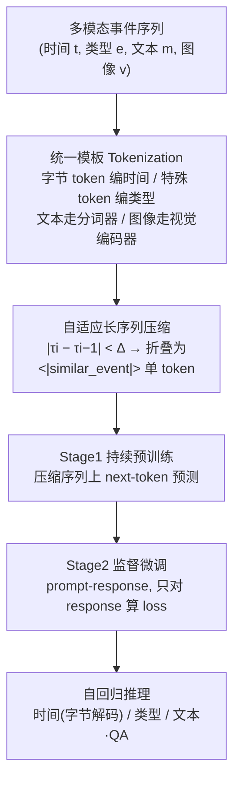

# Long-range Modeling and Processing of Multimodal Event Sequences

**会议**: ICLR 2026  
**OpenReview**: [https://openreview.net/forum?id=Krxt7wCnig](https://openreview.net/forum?id=Krxt7wCnig)  
**代码**: [https://github.com/JichuLi/MM-TPP](https://github.com/JichuLi/MM-TPP)  
**领域**: 时间序列 / 时序点过程 / 多模态事件建模  
**关键词**: Temporal Point Process, Multimodal LLM, Long-context, Sequence Compression, Qwen2.5-VL  

## 一句话总结
MM-TPP 把时序点过程（TPP）从"时间+类型+文本"扩展到"时间+类型+文本+图像"的全多模态生成框架，并用一种基于时间间隔相似度的自适应序列压缩，把动辄上千事件、上万 token 的长序列塞进固定上下文窗口，从而在预测精度和长文分析报告生成两方面都超过 SOTA TPP 基线。

## 研究背景与动机
**领域现状**：时序点过程（TPP）是建模连续时间上异步事件序列的经典工具，从早期 RNN-based 的 RMTPP、NHP 到 Transformer-based 的 THP、SAHP，再到近期把 LLM 引入 TPP 的 TPP-LLM、Language-TPP，能力不断增强。其中 Language-TPP 首次把"文本描述"作为事件的一部分纳入建模，用字节级 token 编码时间戳、用模板把每个事件结构化，实现了时间/类型/文本的联合预测。

**现有痛点**：真实世界的事件序列正变得越来越**多模态**——视频弹幕（Danmaku）不仅有时间戳和评论文本，还关联视频帧画面；交通事故记录还带音频和监控图像。但现有 TPP（含 Language-TPP）局限于单一文本模态，**既不能编码图像，也无法生成以图像为条件的文本**，更谈不上对事件动态做有深度的多模态推理。

**核心矛盾**：要把图像引入事件序列，就绕不开**序列长度爆炸**。一张图被 ViT 切成几百个 patch token，每个事件都带图像时总长 $N$ 急剧膨胀，Transformer 自注意力的 $O(N^2)$ 复杂度成为致命瓶颈——模型根本看不到完整历史，也就写不出需要长程依赖的连贯分析报告（如对一整段弹幕流的总结性问答）。

**本文目标**：构建统一框架，让 TPP 同时吃下时间、类型、文本、图像四种模态并生成丰富文本，且在固定上下文窗口下也能建模超长事件历史。

**核心 idea**：**[统一多模态模板 + 时间相似度压缩]** —— 用 Qwen2.5-VL 作为骨干把四模态事件 tokenize 成统一序列，再把"时间间隔相近"的密集事件折叠成单个 `<|similar_event|>` 特殊 token，以"事件级（inter-event）压缩"换取更长的有效历史。

## 方法详解

### 整体框架
MM-TPP 建立在多模态大模型 Qwen2.5-VL 之上，采用序列到序列范式：输入一段多模态事件历史 $(t_i, e_i, m_i, v_i)_{i=1}^N$（时间、类型、文本、图像），自回归地预测未来事件的时间、类型与文本内容。流水线分三步：先把每个事件按统一模板 tokenize（图像走视觉编码器、其余走特殊 token），再用时间相似度把密集事件压缩进固定窗口，最后两阶段训练（压缩序列上持续预训练 + 下游任务监督微调）。

### 关键设计

**1. 四模态统一 token 化模板：让一个 VLM 同时读懂时间、类型、文本和图像。** MM-TPP 为每种模态设计了对应的编码方式，并用结构化模板把它们拼成一条语言模型可直接处理的序列。时间戳沿用 Language-TPP 的字节级策略——把 32 位时间间隔按内存布局拆成 4 个字节，映射到 256 个特殊 token `<|byte_0|>`…`<|byte_255|>`，做到紧凑且精确；事件类型用专门的 `<|type_0|>`…`<|type_5|>` 等离散 token 表示；文本描述直接用 Qwen2.5-VL 的内置分词器。**图像的处理最关键**：不把像素硬转成 token，而是在序列对应位置插一个占位符 `<|image_pad|>`，运行时让图像过视觉编码器得到视觉 embedding 再与占位符对齐——这样既实现了视觉/文本/时间的深度融合，又把 token 序列保持得短而干净。每个事件被 `<|start_of_event|>` 和 `<|end_of_event|>` 包裹，内部各模态由 `<|time_start|>`、`<|type_start|>`、`<|text_start|>`、`<|vision_start|>` 前缀标记，保证格式一致可解释。

**2. 基于时间相似度的自适应序列压缩：用"事件级"折叠对抗长度爆炸。** 这是本文的核心创新。作者观察到真实事件流（如视频评论）常以"突发/周期"形式到来，相邻事件的时间间隔高度相似。于是定义间隔 $\tau_i = t_i - t_{i-1}$，比较当前事件与前一事件的间隔差：若 $|\tau_i - \tau_{i-1}| < \Delta$，就判定事件 $i$ 与 $i-1$ 时序相似，**用单个 `<|similar_event|>` token 取代它完整的多模态模板**；否则保留完整编码。这样一簇本需数百 token 的密集事件被压成几个特殊 token，同时保留住那些时序特征独特的关键事件。作者特意强调这与 MLLM 里常见的 token pruning/merging（**intra-event、表示级**压缩，利用图像 patch 空间冗余）本质不同：TPP 里的时间戳、类型、文本每一项都是密集语义、删一个就丢逻辑，所以只能在**inter-event 序列级**做文章。效果上，4096 token 预算从平均只能装 113 个事件提升到平均 292 个（最多 2008 个），有效历史翻倍以上。

**3. 两阶段训练 + LoRA 轻量微调：先学新格式，再学下游任务。** 训练分两阶段。Stage 1 是持续预训练，在由多模态模板（含完整与压缩两种表示）构造的大规模 token 序列上做标准 next-token 预测，目标 $L_{\text{stage1}}(\theta) = -\frac{1}{L}\sum_{i=1}^{L}\log p_\theta(x_i \mid x_{<i})$，让模型适应新事件格式并理解 `<|similar_event|>`、`<|type_X|>` 等特殊 token 的语义。Stage 2 是监督微调，把样本整理成 prompt-response 对——prompt 含压缩后的历史片段加任务指令 token（如 `<|time_prediction|>`、`<|type_prediction|>` 或自然语言问句），response 是 ground-truth token，**损失只施加在 response 上**：$L_{\text{stage2}}(\theta) = -\frac{1}{R}\sum_{j=1}^{R}\log p_\theta(r_j \mid \text{Prompt}, r_{<j})$。整个训练用 LoRA 在单张 RTX 4090 上完成，骨干为 Qwen2.5-VL-3B。推理时自回归解码：字节 token 还原成浮点时间间隔、类别 token 给出类型、语言 token 用于文本生成或 QA；因 Qwen2.5-VL 不支持图像生成，当前只输出时间/类型/文本。

## 实验关键数据

### 主实验表格
两个多模态 TPP 数据集（DanmakuTPP 弹幕、TAXI-PRO 作者新构建的 NYC 出租车多模态版）上，时间预测看 RMSE↓、类型预测看 ACC↑：

| Model | Danmaku RMSE↓ | Danmaku ACC%↑ | TAXI-PRO RMSE↓ | TAXI-PRO ACC%↑ |
|---|---|---|---|---|
| NHP | 5.4540 | 30.74 | 0.4494 | 75.93 |
| THP | 5.4001 | 24.64 | 0.3736 | 75.31 |
| TPP-LLM | 5.3035 | 24.59 | 0.3336 | 71.09 |
| Language-TPP | 5.3845 | 22.62 | 0.3376 | 75.27 |
| **MM-TPP** | **5.2987** | 27.62 | **0.3310** | **77.56** |

MM-TPP 在两个数据集的 RMSE 都最低，TAXI-PRO 两项指标全面领先；DanmakuTPP 上类型 ACC 大幅超过 Language-TPP（27.62 vs 22.62）。在 DanmakuTPP-QA 8 个封闭式任务上，MM-TPP 一致优于同底座的 Finetuned Qwen2.5-VL-3B；2 个开放式报告生成任务的叙述质量也明显超过现有 MLLM，甚至在未微调过生成任务的 TAXI-PRO 上仍能 zero-shot 写出有洞见的时空模式分析。

### 消融实验表格

| 变体 | Danmaku RMSE↓ | Danmaku ACC%↑ | TAXI-PRO RMSE↓ | TAXI-PRO ACC%↑ |
|---|---|---|---|---|
| **MM-TPP (3B, 全模态)** | 5.2987 | **27.62** | 0.3310 | **77.56** |
| MM-TPP (text only) | 5.4654 | 23.64 | 0.3388 | 76.70 |
| MM-TPP (7B) | **5.0533** | 26.98 | 0.3337 | 76.16 |
| 无压缩 (uncompressed) | 5.5551 | 25.87 | — | — |

压缩超参 $\Delta$：默认 0.2 最优；$\Delta=0.05$ 压缩不足、$\Delta=0.5$ 过度压缩合并掉异质事件，RMSE/ACC 均下降。上下文从 4096 砍到 2048 也明显掉点。

### 关键发现
- **压缩是真长程而非简单丢弃**：压缩版把可容纳事件从 113 提到 292（最多 2008），RMSE 5.2987 vs 无压缩 5.5551、ACC 27.62 vs 25.87；且 PPL 在所有序列长度段都低于无压缩版，序列越长差距越大。对照"随机丢事件"基线性能大幅退化，说明**保留时间因果性和扩展上下文同等重要**。
- **视觉信息确有增益**：在固定事件数的受控条件下，全模态 MM-TPP 全面优于 text-only 变体，图像对时间和类型预测都有互补价值。
- **更大模型并非全面更好**：7B 仅在复杂 DanmakuTPP 的时间 RMSE 上明显更优，其余指标 3B 反而更好，作者归因于简单任务上的过拟合。

## 亮点与洞察
- **把"文本生成"提升为 TPP 的一等公民**：传统 TPP 只预测"下一个事件何时、何类型"，MM-TPP 把"生成以视觉为条件的长文分析/报告"放到与时间、类型预测同等地位，让 TPP 从纯预测器走向能"讲清楚事件流在发生什么"的推理器。
- **压缩动机抓得很准**：识别出 TPP 与图像在冗余结构上的本质差异——图像有空间冗余可做 intra-event 剪枝，而 TPP 的时间/类型/文本是密集语义不可删，于是另辟"inter-event 时序相似度折叠"，又便宜又贴合事件流的突发性。
- **轻量且可复现**：3B 底座 + LoRA + 单张 4090，门槛低；并贡献了 TAXI-PRO 这个带地图图块和自然语言描述的多模态 TPP 新基准。

## 局限与展望
- **不能生成图像**：受限于 Qwen2.5-VL 不支持图像生成，"未来事件"只能输出时间/类型/文本，无法补出对应视觉内容；作者指向 Chameleon 这类 omni-modal 模型作为后续。
- **压缩策略偏单一**：仅用"时间间隔相似度"一个判据做硬折叠，对内容差异大但间隔相近的事件可能误并；更复杂场景下的混合/自适应压缩留作未来工作。
- **类型预测并非全场最优**：DanmakuTPP 上时间 RMSE 第一，但类型 ACC（27.62）仍低于 NHP（30.74）、S2P2（31.48）等部分基线，多模态融合对离散类型的帮助有上限。
- **阈值与窗口需调**：$\Delta$ 和上下文长度对结果敏感，跨数据集时需要重新搜索。

## 相关工作与启发
- **TPP 谱系**：从 RNN-based（RMTPP、NHP）到 Transformer-based（THP、SAHP），再到 LLM-based（TPP-LLM、Language-TPP）。本文是 Language-TPP 的直接多模态延伸，把"文本扩展"推进到"视觉+文本+时间"。
- **协变量 TPP**：早期用结构化协变量（人口、地理），后用词频/BERT embedding 引入非结构化文本；MM-TPP 把图像、文本两类非结构化协变量统一进生成式 TPP。
- **高效 MLLM**：ToMe、token pruning/merging 等 intra-event 表示级压缩为对照，反衬出本文 inter-event 序列级压缩对 TPP 结构的适配性。
- **启发**：对任何"每个事件都带重模态附件"的长序列建模（多模态日志、监控、医疗时序），"按业务相似度折叠同质片段、只保留转折点"是一条比通用 token 剪枝更对口的省上下文思路。

## 评分
- **新颖性**: ⭐⭐⭐⭐ — 首个把图像纳入生成式 TPP 的统一框架，"时间相似度 inter-event 压缩"这一动机与设计的契合度高，区别于通用 token 剪枝。
- **实验充分度**: ⭐⭐⭐⭐ — 两数据集 + 8 个封闭 QA + 开放报告生成，压缩/视觉/模型尺寸/窗口/阈值消融齐全，并贡献新基准 TAXI-PRO；类型预测未全面夺冠稍有保留。
- **写作质量**: ⭐⭐⭐⭐ — 动机—挑战—方法链条清晰，图 1 框架与压缩示意到位，公式与模板交代充分。
- **价值**: ⭐⭐⭐⭐ — 为多模态长事件序列建模提供了实用、低门槛（3B+LoRA+单卡）的范式，压缩思路可迁移到其他重模态时序场景。

<!-- RELATED:START -->

## 相关论文

- [\[NeurIPS 2025\] WaLRUS: Wavelets for Long-range Representation Using SSMs](../../NeurIPS2025/time_series/walrus_wavelets_for_long-range_representation_using_ssms.md)
- [\[ICML 2026\] FRACTAL: State Space Model with Fractional Recurrent Architecture for Computational Temporal Analysis of Long Sequences](../../ICML2026/time_series/fractal_ssm_with_fractional_recurrent_architecture_for_computational_temporal_an.md)
- [\[ICML 2026\] Learning Long Range Spatio-Temporal Representations over Continuous Time Dynamic Graphs with State Space Models](../../ICML2026/time_series/learning_long_range_spatio-temporal_representations_over_continuous_time_dynamic.md)
- [\[ICLR 2026\] PHAT: Modeling Period Heterogeneity for Multivariate Time Series Forecasting](phat_modeling_period_heterogeneity_for_multivariate_time_series_forecasting.md)
- [\[ICLR 2026\] Towards Multimodal Time Series Anomaly Detection with Semantic Alignment and Condensed Interaction](towards_multimodal_time_series_anomaly_detection_with_semantic_alignment_and_con.md)

<!-- RELATED:END -->
