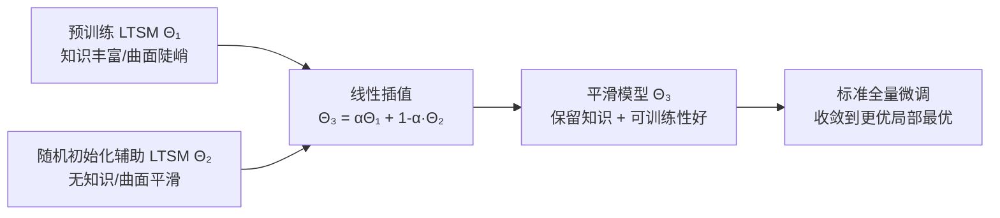

# Lost in the Non-convex Loss Landscape: How to Fine-tune the Large Time Series Model?

**会议**: ICLR 2026  
**OpenReview**: [https://openreview.net/forum?id=8o4t5DHaE1](https://openreview.net/forum?id=8o4t5DHaE1)  
**代码**: [https://github.com/Meteor-Stars/SFF](https://github.com/Meteor-Stars/SFF)  
**领域**: 时间序列 / 大时序模型微调  
**关键词**: 大时序模型(LTSM), 损失曲面平滑, 权重插值, 微调, 锐利极小值  

## 一句话总结
把一个随机初始化的"陪练"模型权重和预训练大时序模型线性插值，用前者平滑的损失曲面去"抹平"后者陡峭非凸的损失曲面，从而在不增加任何显存/算力开销的前提下让全量微调真正吃到预训练红利。

## 研究背景与动机
**领域现状**：大时序模型(Large Time Series Model, LTSM)沿着大语言模型的思路发展——灵活上下文长度、跨域泛化、任务通用、规模可扩展，Timer、TimesFM、MOMENT 等在预测、插补、异常检测上已超过专用模型，零样本表现也很强。

**现有痛点**：理论与实证都指向一个尴尬现象——大规模预训练会把模型推向高度非凸损失曲面里的**锐利极小值(sharp minima)**。作者可视化 Timer 在 exchange rate 上的损失曲面，能看到明显的局部"凸起"，可训练性很差。后果是：直接全量微调(FF)虽然能拿到最低的训练损失，测试损失却比从头训练(TFS)还高，严重过拟合，甚至随着可用数据变多性能不升反降，预训练的好处被白白浪费。

**核心矛盾**：预训练模型有"知识"但"难训"(曲面陡峭)，随机初始化模型"好训"(曲面平滑)但"没知识"(最低损失远高于预训练模型)。常规的 FF / LP / LP-FF 都没法平滑这个非凸曲面，因而都无法稳定收敛到更好的局部最优。

**本文目标**：在不破坏预训练知识、不引入额外开销的前提下，把预训练模型陡峭的损失曲面"重塑"得更平滑，恢复其可训练性。

**核心 idea（加粗标签）**：**用随机初始化模型平滑的损失曲面去"借平滑"** —— 把随机初始化的辅助 LTSM 与预训练 LTSM 做线性权重插值，得到一个既保留预训练知识、又继承良好可训练性的"平滑模型"，再在它上面做全量微调。

## 方法详解

### 整体框架
SFF(Smoothed Full Fine-tuning) 只有两步：(1) 用 Kaiming/Xavier 随机初始化构造一个与预训练 LTSM 同结构的辅助模型 $\Theta_2$，它天然处在平滑、凸性更好的损失区域；(2) 用插值系数 $\alpha$ 把预训练权重 $\Theta_1$ 和辅助权重 $\Theta_2$ 线性混合得到 $\Theta_3=\alpha\Theta_1+(1-\alpha)\Theta_2$，然后在 $\Theta_3$ 上正常做下游微调。整个"平滑"只是微调前的几行 PyTorch 权重插值，零额外显存/算力。

### 关键设计

**1. 锐利极小值被"抹平"、平坦区被"保住"：插值的双向作用机理**
作者用 Hessian 最大特征值 $\lambda_{\max}(\nabla^2 L)$ 刻画曲面陡峭程度——大特征值即锐利极小值(对扰动敏感)，小特征值即平坦极小值(泛化好)。在插值路径上做局部二次近似，插值点的 Hessian 可写成两端 Hessian 的凸组合 $\nabla^2 L(\Theta_3)\approx\alpha\nabla^2 L(\Theta_1)+(1-\alpha)\nabla^2 L(\Theta_2)$。对应到特征值，由于辅助模型 $\lambda_{\max}(\nabla^2 L(\Theta_2))$ 远小于预训练模型，于是对锐利极小值有 $\lambda_{\max}(\nabla^2 L(\Theta_3))<\lambda_{\max}(\nabla^2 L(\Theta_1))$，曲面被抹平、参数得以逃离坏盆地；而当预训练权重本身落在平坦区($\le\tau$)时，凸组合 $\le\alpha\tau+(1-\alpha)\tau=\tau$ 仍然不超阈值，平坦区被原样保留。这正是 SFF 的核心——只"动"该动的陡峭处，不"伤"已经好的平坦处。作者还把这种对锐利区的扰动类比为 Adam 里的动量机制：随机权重插值相当于给陷在锐利盆地的参数一个"推力"，帮它滑向更平滑的盆地。

**2. 为什么随机初始化天然平滑：用 Hessian 迹/范数比给出理论依据**
SFF 之所以敢用随机初始化当"平滑源"，是因为 Kaiming/Xavier 初始化本身就产出平滑曲面。作者借助 Hessian 迹与 Frobenius 范数之比来量化平滑度：$\frac{\mathrm{Tr}(H)}{\|H\|_F}=\frac{\sum\lambda_i}{\sqrt{\sum\lambda_i^2}}\gg 1$。这个比值远大于 1 意味着特征值大多为正且分布均匀、没有被极端离群值主导，也即大部分满足 $\lambda\le\tau$，对应一个由正曲率主导的"山谷状"平滑几何，绝大多数下降方向都低曲率、优化稳定。反之若该比值接近 1，则正负特征值混杂、曲面陡峭不规则，优化易陷入次优。这条分析把"随机初始化曲面更平滑"从经验观察上升为可解释的判据，从而支撑了把它作为辅助初始化方案的选择。

**3. 插值系数 $\alpha$：在"够平滑"和"留知识"之间找平衡**
插值公式对 backbone 和线性头分别作用：$f(X,\Theta_3)=G(X,\alpha\Phi_1+(1-\alpha)\Phi_2)^T(\alpha W_{head1}+(1-\alpha)W_{head2})$，优化目标是在 $\alpha\Theta_1+(1-\alpha)\Theta_2$ 上最小化 MSE 损失 $\arg\min\sum_{(X_i,Y_i)\in D} L(f(X_i,\alpha\Theta_1+(1-\alpha)\Theta_2),Y_i)$。$\alpha$ 直接控制保留多少预训练知识——$\alpha$ 越大保留越多。实验发现 $\alpha\approx 0.85$ 时零样本性能最好：既给了足够的平滑扰动，又没把预训练知识冲淡。这个偏大的最优值也印证了方法定位——SFF 是"轻微扰动陡峭处"，而非"大幅重置"。

## 实验关键数据

### 主实验表格（Timer 上 TSF，预测长度 96，MSE，部分数据比例）

| 数据集 | SFF(25%) | FF(25%) | TFS(25%) | SFF(100%) | FF(100%) | TFS(100%) |
|---|---|---|---|---|---|---|
| Exchange | **0.0805** | 0.0865 | 0.1441 | **0.0800** | 0.0910 | 0.0981 |
| ETTh1 | **0.3506** | 0.3550 | 0.3788 | **0.3547** | 0.3709 | 0.3600 |
| ETTm1 | **0.2980** | 0.3049 | 0.3330 | **0.2954** | 0.3128 | 0.3093 |
| Weather | **0.1440** | 0.1472 | 0.1627 | **0.1443** | 0.1612 | 0.1526 |
| Traffic | **0.3488** | 0.3582 | 0.3688 | **0.3551** | 0.3599 | 0.3609 |

跨 9 个公开数据集，SFF 相比 FF 平均降 MSE 约 3%、最高 6.5%；且随数据增多性能稳定提升，而 FF 常常停滞甚至退化。

### 消融/拓展实验表格（其它 LTSM，TSF 预测长度 96，MSE）

| 数据集 | TimesFM-SFF | TimesFM-FF | MOMENT-SFF | MOMENT-FF | MOIRAI-SFF | MOIRAI-FF |
|---|---|---|---|---|---|---|
| ETTh1 | **0.3955** | 0.4382 | **0.4287** | 0.4454 | **0.448** | 0.501 |
| Weather | **0.0865** | 0.0885 | **0.1673** | 0.1682 | **0.166** | 0.173 |
| Traffic | — | — | — | — | **0.476** | 0.497 |

SFF 在 TimesFM / MOMENT 上相比 FF 平均提升 11.45% / 8.31%；在 UniTS、MOIRAI、Chronos、TTMs、Sundial 上一致超过 FF，覆盖 encoder-only / decoder-only / encoder-decoder / MLP-only 全架构与 3.8GB→3MB 全尺度。对比 LP/LPFF 平均 MSE 降低 7.17%~41.57%。

### 关键发现
- **预训练确有过拟合**：TimesFM/MOMENT 多处 FF 比 TFS 还差，直接证实"难训"假说；SFF 同时超过两者。
- **预训练样本效率高但被浪费**：预训练 LTSM 仅用 10%~25% 数据就能追平甚至超过 TFS 的满数据性能，但 FF 无法把这种潜力转成微调收益，SFF 则随数据增多持续受益。
- **知识被保住**：SFF 与 FF 都在第一个 epoch 内收敛，说明插值没破坏预训练知识，且 SFF 收敛到更低 MSE。
- **零样本也涨**：平滑后的模型零样本预测在 7 个数据集上 Timer 平均涨 6.13%、TimesFM 涨 35.75%，$\alpha\approx0.85$ 最优；并在 MOIRAI/Chronos/TTMs/Sundial 上同样普遍提升。
- **对初始化种子不敏感**：主流初始化(Kaiming/Xavier)一致带来稳定增益，SFF 对初始化随机种子无明显敏感性。
- **异常检测同样有效**：在 250 个数据集上，SFF 在异常段上的预测 MSE 显著高于 FF 和 TFS(越高越好)，6 组里 Wins 数大幅领先。

## 亮点与洞察
- **把"微调难"归因到损失曲面几何，再用一个反直觉的工具(随机模型)去治**：不是改优化器、不是加正则，而是借随机初始化天然的平滑曲面来重塑预训练曲面，视角新颖。
- **几乎零成本**：核心操作只是微调前几行权重插值，不加任何显存/算力，落地极其简单。
- **理论-动机-实验闭环完整**：Hessian 特征值/迹范数比给出"为何平滑""为何随机初始化平滑""平坦区为何不受损"的三段论证，并被损失曲面可视化和八个 LTSM 实验印证。
- **普适性强**：跨 8 个代表性 LTSM、四类架构、三个数量级模型尺度、TSF/异常检测/插补/零样本多任务都涨。

## 局限与展望
- $\alpha$ 是关键超参，论文给出 $\alpha\approx0.85$ 的经验最优，但缺乏对不同模型/任务下 $\alpha$ 自适应选择的机制，仍需调参。
- 理论建立在"插值路径上局部二次近似 + Hessian 凸组合"这一近似上，对真实高维非凸曲面的成立范围有多广未充分讨论。
- "随机初始化模型一定处于平坦区"在所有结构/初始化下是否稳健，文中主要靠 Kaiming/Xavier 的迹范数比论证，对更广初始化方案的覆盖有限。
- 实验集中于预测与异常检测，对更复杂的下游任务(如长程依赖建模、多模态时序)效果待验证。

## 相关工作与启发
- **微调策略**：FF / LP / LP-FF(Kumar et al.) 是直接对比对象；SFF 通过先平滑再微调超过它们。
- **优化平坦极小值**：SAM、SWA 等追求平坦极小值的方法是动机同源的旁支，附录中 SFF 一致胜出。
- **权重平均/插值**：与 Model Soups(Wortsman et al.)、持续学习里的权重插值本质不同——后者是在多个"训好"的模型间插值做集成/抗遗忘，本文是用一个随机模型平滑单一预训练模型的曲面再训练，目标、流程、理论三方面都不同。
- **启发**：当"预训练越强反而越难微调"时，可考虑从损失曲面几何入手，用低成本的权重操作恢复可训练性——这一思路或可迁移到 LLM/视觉基础模型的高效微调。

## 评分
- **新颖性**: ⭐⭐⭐⭐ 把大时序模型微调难归因到损失曲面锐利极小值，并首创用随机模型权重插值来平滑曲面，视角和工具都新。
- **实验充分度**: ⭐⭐⭐⭐ 覆盖 8 个 LTSM、四类架构、TSF+异常检测+插补+零样本，多种子多数据比例，并有曲面可视化与收敛/零样本分析支撑。
- **写作质量**: ⭐⭐⭐⭐ 动机-理论-方法-实验闭环清晰，Hessian 论证与图示配合到位。
- **价值**: ⭐⭐⭐⭐ 零开销、即插即用、普适性强，对大时序模型落地微调有实用价值。

<!-- RELATED:START -->

## 相关论文

- [\[ICLR 2026\] MMPD: Diverse Time Series Forecasting via Multi-Mode Patch Diffusion Loss](mmpd_diverse_time_series_forecasting_via_multi-mode_patch_diffusion_loss.md)
- [\[AAAI 2026\] A Theoretical Analysis of Detecting Large Model-Generated Time Series](../../AAAI2026/time_series/a_theoretical_analysis_of_detecting_large_model-generated_time_series.md)
- [\[ICLR 2026\] Semantic-Enhanced Time-Series Forecasting via Large Language Models](semantic-enhanced_time-series_forecasting_via_large_language_models.md)
- [\[NeurIPS 2025\] How Foundational are Foundation Models for Time Series Forecasting?](../../NeurIPS2025/time_series/how_foundational_are_foundation_models_for_time_series_forecasting.md)
- [\[ICLR 2026\] TimeOmni-1: Incentivizing Complex Reasoning with Time Series in Large Language Models](timeomni-1_incentivizing_complex_reasoning_with_time_series_in_large_language_mo.md)

<!-- RELATED:END -->
