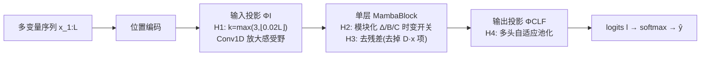

# MambaSL: Exploring Single-Layer Mamba for Time Series Classification

**会议**: ICLR 2026  
**OpenReview**: [https://openreview.net/forum?id=YDl4vqQqGP](https://openreview.net/forum?id=YDl4vqQqGP)  
**代码**: 待确认（论文承诺公开全部 checkpoint）  
**领域**: 时间序列分类 / 状态空间模型  
**关键词**: Mamba, 选择性 SSM, 时间序列分类, UEA, 单层架构  

## 一句话总结
只用**单层 Mamba**、靠四个针对 TSC 的假设（H1–H4）对选择性 SSM 与投影层做最小改动，再在全部 30 个 UEA 数据集上重新公平评测 20 个强基线，结果取得统计显著的 SOTA。

## 研究背景与动机
- **领域现状**：SSM（尤其 Mamba）在语言、视频、时间序列预测（TSF）里已证明能替代 Transformer，但在**时间序列分类（TSC）**里几乎没人单独研究它的本征能力，主流仍是 CNN 和 Transformer。
- **现有痛点**：(1) 唯一一篇把 Mamba 用于 TSC 的工作 TSCMamba 把 ROCKET、CWT 等特征工程混进来，**掩盖了 Mamba 自身的贡献**；(2) 此前有人把 vanilla Mamba 评为最弱的 TSC backbone，但只是因为没人调过它，而非架构本身差。
- **核心矛盾**：TSC 基准测试本身也不可靠——评测常只用 UEA 子集（漏掉长序列/高维难数据）、把 TSF 模型不重新调参就拿来当基线（低估它们）、复现性差（TS2Vec/GPT4TS 复测掉了 >9%p）。这让"Mamba 到底行不行"无从判断。
- **本文目标**：从**架构**和**评测协议**两条线还 Mamba 一个公道——既证明单层 Mamba 能做强 TSC backbone，也建立一套覆盖全 30 个 UEA、统一搜参、公开 checkpoint 的可复现基准。
- **核心 idea**：**不堆深度、不加特征工程**，而是把 Mamba 选择性 SSM 的时变性拆成可调旋钮，并配合放大感受野、去残差、自适应池化四处针对性改动，让单层 Mamba 自己把 TSC 做到 SOTA。

## 方法详解

### 整体框架
MambaSL 保留 TSC 经典三段式管线——输入投影 $\Phi_I$、特征提取器 $\Phi_{FE}$、输出投影 $\Phi_{CLF}$——但对每一段都按假设做最小改动：输入投影按序列长度放大卷积感受野（H1），特征提取器用**模块化的选择性 SSM**（H2）且去掉残差（H3），输出投影换成**多头自适应池化**（H4）。整套结构只有一层 Mamba block。

### 关键设计
**1. H1 — 按序列长度自适应放大输入投影感受野**：常见时间序列模型把 $\Phi_I$ 实现成固定核 $k=3$ 的 1-D 卷积，但 Mamba 的门控单元会用这个投影来调制 SSM 输出，输入上下文太少就会成为瓶颈。作者据此让卷积核随序列长度成比例增大：$k = \max(k_{\min}, \lfloor \lambda L \rfloor)$，取 $k_{\min}=3$、$\lambda=0.02$、stride=1（固定步长以隔离核尺寸的单一效应）。这样密集采样的长序列能拿到正比于其长度的局部上下文，喂给后面的门控更充分。

**2. H2 — 把时变性拆成可调开关的模块化选择性 SSM**：这是全文最核心的洞察。原始选择性 SSM 让 $\Delta_t, B_t, C_t$ 全部输入相关（时变 TV），但作者先厘清三者角色不同——$\Delta$ 控制**时间更新速率**（类似 DTW 对齐不同局部速度）、$B$ 是**输入到状态的通道路由**、$C$ 是**状态到输出的读出**，其中 $B/C$ 时变会引入跨通道混合，而很多时间序列其实接近线性时不变（LTI）。于是用三个二元开关 $\theta_\Delta,\theta_B,\theta_C \in \{0,1\}$ 决定每个参数走 TI 还是 TV：$\Delta_t^{(j)\star}=(1-\theta_\Delta)\Delta^{(j)}+\theta_\Delta\,\phi_\Delta(\tilde x_t)^{(j)}$，$B/C$ 同理。这给出 $2^3=8$ 种配置，从全 LTI 到完整选择性 SSM 任选，让"时变 vs 时不变"成为按数据集可调的超参——实验里发现简单（偏 LTI）配置反而常常更好，这与 Gu & Dao 在语言建模里"全时变最优"的结论恰好相反。

**3. H3 — 去掉残差连接，强迫模型只靠状态演化**：残差在深网络里帮优化，但在浅网络里收益微乎其微（InceptionTime 在 85 个 UCR 数据集上证明残差几乎没差别）。在单层设定下，残差/skip 反而可能绕过 SSM、削弱 Mamba 的表征学习。作者把特征输出里的跳接项 $D^{(j)}\tilde x_t^{(j)}$ 去掉，变成 $f_t^{(j)} = C_t s_t^{(j)}$，让 logits 完全建立在隐状态之上——等于把"学好状态向量 $s_t^{(j)}$"摆到 TSC 的核心位置。（注意 Mamba 官方实现默认是开 $D$ 的，作者把它改成可调。）

**4. H4 — 多头自适应池化，按时刻自适应加权**：平均/最大池化要么对所有时刻一视同仁、要么只信单个最强时刻，忽略了数据特定的时间重要性——这对递归模型尤其致命（如手写序列标签 g 早期可能先像 a 后期才对齐 g）。作者用 $N_h$ 个独立门控头，每头对每个时刻打分 $g_{t,h}=w_h^\top f_t + b_h$，取跨头最大值 $g_t=\max_h g_{t,h}$，再 softmax 归一化得权重 $\alpha_t = \exp(g_t)/\sum_i \exp(g_i)$，最后加权聚合 per-time logit：$l=\sum_{t=1}^L \alpha_t l_t$。该式是池化的泛化——$\alpha_t$ 均匀就退化为平均、尖锐就近似最大池化；相比注意力池化更轻量，多头探索多样模式、自适应最大池化挑最自信信号。

## 实验关键数据
评测覆盖**全部 30 个 UEA 多变量数据集**（序列长 8–17,984，维度 2–1,345，样本 12–25,000），对每个模型搜约 200 组超参选最优，共比较 20 个基线。

### 主实验

| 模型类别 | 代表方法 | 全 30 数据集平均准确率 (%) |
|---|---|---|
| Mamba-based | **MambaSL（本文）** | **79.82** |
| Mamba-based | TSCMamba | 78.40 |
| Shape-based | InterpGN | 77.70 |
| 非 DL | HC2 | 76.87 |
| CNN-based | ModernTCN | 76.94 |
| Transformer | iTransformer | 74.80 |
| 基线 vanilla Mamba | — | 74.24 |

MambaSL 在 10 数据集子集和全 30 数据集上都拿下最佳平均准确率和平均 rank，**比第二名 TSCMamba 高 1.41%p**；Wilcoxon 符号秩检验确认对除 HC2（p=0.56，但 HC2 总排名仅第 8）外所有模型统计显著（p<0.05）。

### 消融实验（四假设逐一移除，全 30 平均准确率 / 平均 rank）

| 配置 | avg.acc | avg.rank | 显著性 p |
|---|---|---|---|
| **MambaSL（全开）** | 79.80 | 2.43 | — |
| w/o H1（k=3） | 80.22 | 2.53 | 0.217 |
| w/o H2（仅 TV） | 77.08 | 5.93 | 0.000 |
| w/o H3（用残差 D） | 79.16 | 3.50 | 0.071 |
| w/o H4（全连接） | 77.72 | 4.87 | 0.003 |
| only H2 | 77.94 | — | 0.011 |
| vanilla Mamba | 74.24 | — | 0.000 |

时变性细化消融（Table 2）：8 种 $\theta_\Delta/\theta_B/\theta_C$ 配置里**没有一种压倒性最优，但全 LTI（全 ✗）整体优于全 TV（全 ✓）**。

### 关键发现
- **H2 是收益主力**：去掉模块化时变（只保留全时变）准确率从 79.8 掉到 77.08，rank 从 2.43 暴跌到 5.93，是四个假设里影响最大的。
- **"少即是多"**：偏 LTI 的简单配置反而更好，直接挑战了 Mamba 原论文"全时变最优"的语言建模结论——TSC 任务的时不变性需要被显式建模。
- **协议的价值**：仅靠重新调参，TSF-origin 模型（DLinear/PatchTST/iTransformer 等）平均涨 3.04%p，说明此前 TSC 文献严重低估了这些基线。
- UMAP 可视化显示 MambaSL 落在 DL 与非 DL 簇之间，兼具两类方法的优势。

## 亮点与洞察
- **"做减法"的范本**：不加任何特征工程、不堆深度，单层 Mamba 靠四处针对性微调就拿 SOTA，干净地剥离出 Mamba 在 TSC 的本征能力。
- **把"时变性"变成可解释旋钮**：明确拆开 $\Delta$（时间步速）vs $B/C$（空间路由）的角色，并用开关让时变/时不变按数据集可调，这一概念框架本身就有诊断价值。
- **顺手修了基准**：全 30 UEA + 统一搜参 + 公开 checkpoint，附带揭示了 TSC 文献长期低估 TSF-origin 基线的系统性问题，可复现性贡献独立成立。

## 局限与展望
- **单数据集仍需调超参**：8 种时变配置、卷积核、池化都要按数据集搜，没有一个普适最优配置，部署时搜参成本不低。
- **只在 UEA 上验证**：未触及更大规模或单变量 UCR 全集、长程预测等其他时间序列任务，单层结论能否外推存疑。
- **"全 LTI 更好"的边界未明**：作者承认 ZOH 离散化让 $\Delta$ 与 $B/C$ 仍有耦合，时变/时不变的真实分界还需更细的理论分析。
- 在 AF/ER/PEMS 等固定长度小测试集上，全连接读出反而更优，说明自适应池化的优势依赖数据规模与多样性。

## 相关工作与启发
- **vs TSCMamba**：同样用 Mamba 做 TSC，但 TSCMamba 混入 ROCKET/CWT 特征工程，MambaSL 刻意纯化以隔离 Mamba 本征贡献，并反超 1.41%p。
- **vs TSF 里的 Mamba（TimeMachine/S-Mamba）**：这些工作沿通道轴做双向扫描以缓解扫描顺序敏感，MambaSL 则坚持沿时间轴更新状态、单层单向，路线相反。
- **启发**：把大模型组件（这里是选择性 SSM 的时变性）拆成可解释、可按任务开关的模块，再配合公平基准，是"小改动 + 强评测"打法的好范例——对其他想把 SSM 迁到新领域的工作很有借鉴意义。

## 评分
- **新颖性**: ⭐⭐⭐⭐ — 不在于发明新模块，而在于"模块化时变性 + 单层做减法"这一反直觉视角，并实证推翻 Mamba 原论文的全时变结论。
- **实验充分度**: ⭐⭐⭐⭐⭐ — 全 30 UEA、20 基线、每模型约 200 组搜参、Wilcoxon 检验 + 逐假设消融 + 时变性细化 + UMAP 可视化 + 公开 checkpoint，扎实且可复现。
- **写作质量**: ⭐⭐⭐⭐ — 假设驱动（H1–H4）的叙事清晰，$\Delta/B/C$ 角色厘清部分尤其有教学价值；公式与图配合到位。
- **价值**: ⭐⭐⭐⭐ — 既给出强 TSC backbone，又顺手修了基准可复现性，对 TSC 社区有双重实用价值。

<!-- RELATED:START -->

## 相关论文

- [\[ICLR 2026\] TimeSliver: Symbolic-Linear Decomposition for Explainable Time Series Classification](timesliver_symbolic-linear_decomposition_for_explainable_time_series_classificat.md)
- [\[ICLR 2026\] pyrregular: A Unified Framework for Irregular Time Series, with Classification Benchmarks](pyrregular_a_unified_framework_for_irregular_time_series_with_classification_ben.md)
- [\[ICLR 2026\] Repurposing Foundation Model for Generalizable Medical Time Series Classification](repurposing_foundation_model_for_generalizable_medical_time_series_classificatio.md)
- [\[ICML 2026\] Generalizing Multi-scale Time-Series Modeling with a Single Operator](../../ICML2026/time_series/generalizing_multi-scale_time-series_modeling_with_a_single_operator.md)
- [\[AAAI 2026\] A Unified Shape-Aware Foundation Model for Time Series Classification](../../AAAI2026/time_series/a_unified_shape-aware_foundation_model_for_time_series_class.md)

<!-- RELATED:END -->
