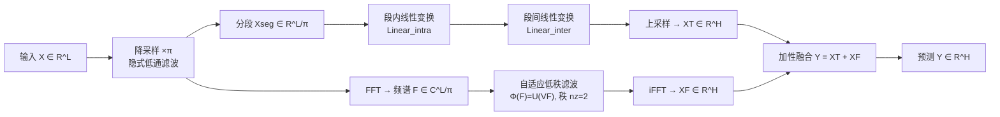

# MixLinear: Extreme Low Resource Multivariate Time Series Forecasting with 0.1K Parameters

**会议**: ICLR 2026  
**OpenReview**: [https://openreview.net/forum?id=QUj0KuCumD](https://openreview.net/forum?id=QUj0KuCumD)  
**代码**: 待确认  
**领域**: 时间序列预测 / 轻量化模型  
**关键词**: 长期时序预测, 参数高效, 频域滤波, 低秩分解, 边缘部署  

## 一句话总结
MixLinear 用「时域分段提取局部趋势 + 频域自适应低秩滤波提取全局趋势」的双通道线性架构，把长期时序预测模型压到仅 **0.1K（45–176）个参数**，在 8 个基准上做到与主流轻量模型相当甚至更好的精度。

## 研究背景与动机
- **领域现状**：长期时序预测（LTSF）近年被 Transformer 类模型（PatchTST、TimesNet）主导，精度高但动辄百万级参数、巨大算力，无法部署到嵌入式设备、边缘传感器等资源受限场景。
- **现有痛点**：作者认为参数爆炸不是性能的"必要代价"，而是**表示策略上的结构性低效**——主流架构用同一套机制去同时刻画高频局部波动和低频全局趋势，而这两类信号的统计特性完全不同。
- **核心矛盾**：局部特征（短期波动）本质适合在**时域**用时间局部性刻画；全局结构（长期趋势、季节性）则在**频域**呈现稀疏性。强行用统一架构建模二者，必然带来参数冗余。现有"分而治之"的尝试也不彻底：DeepGate 先分解但两路仍用重型模块；FITS 纯频域高效，却用全局频率分量去拟合局部尖锐变化，需要不成比例的系数，反而抵消了频谱压缩的收益。
- **本文目标**：设计一个既能有效建模全局+局部模式、又极致参数高效的框架。
- **核心 idea**：**「在每类模式最自然的域里处理它」**——局部趋势用时域分段提取，全局趋势用频域自适应低秩滤波，两路加性融合。

## 方法详解

### 整体框架
MixLinear 是一个**双通道（dual-pathway）线性架构**，把输入 $X\in\mathbb{R}^{L\times C}$ 同时送入两条互补路径，最终加性融合：$Y=F_{\text{segment}}(X;\Theta_s)+F_{\text{frequency}}(X;\Theta_f)$。时域通道负责局部趋势的分段线性分解，频域通道负责全局趋势的低秩频谱压缩。加性（而非乘性）融合保持两域表示的独立性，同时让反向传播联合优化、避免梯度不稳定。

### 关键设计

**1. 时域分段趋势提取：用因子化线性分解把 $O(n^2)$ 降到 $O(n)$。** 输入先以因子 $\pi$ 降采样得到 $X_{\text{down}}\in\mathbb{R}^{(L/\pi)\times C}$，这一步本身就是隐式低通滤波，衰减高频噪声、保留趋势。降采样序列被切成 $M$ 个长度 $r=L/(\pi M)$ 的非重叠分段。核心是**两个互补的线性变换分离两种相关结构**：段内变换 $h^{(s)}_{\text{intra}}=\text{Linear}_{\text{intra}}(x^{(s)})$ 把每段 $r$ 个采样压成 $d$ 维摘要，捕获局部斜率、短周期、形态等波形信息；段间变换 $H_{\text{inter}}=\text{Linear}_{\text{inter}}(H_{\text{intra}})$ 在堆叠后的段嵌入上建模跨段依赖，捕获缓慢漂移和段级周期。这种 intra/inter 解耦让该路只需 $dr+dM+d+M$ 个参数，复杂度从二次降到线性，同时保留层次化时间结构。

**2. 频域自适应低秩谱滤波：秩约束 $n_z=2$ 实现极致压缩。** 对降采样序列做 FFT 得到频谱 $F=\text{FFT}(X_{\text{down}})\in\mathbb{C}^{(L/\pi)\times C}$。传统做法要学一个 $(L/\pi)\times(L/\pi)$ 的全尺寸复数滤波器，参数巨大且易过拟合。MixLinear 改用**低秩因子化**把频率变换参数化成秩-$n_z$ 算子：$\Phi(F)=U(VF)$，其中 $U\in\mathbb{C}^{(L/\pi)\times n_z}$、$V\in\mathbb{C}^{n_z\times(L/\pi)}$ 且 $n_z\ll L/\pi$。它先把每段频谱投影进共享的超低维潜空间，再经自适应基 $U$ 重建。取 $n_z=2$ 把表示能力强制集中到主导频率模式上，利用自然信号在频域的低秩结构。该路只需 $4rn_z$ 个实参数，再经 $\text{iFFT}$ 和上采样回到时域 $X_F\in\mathbb{R}^{H\times C}$。

**3. 双域加性融合 + 复杂度分析。** 两路输出直接相加得到最终预测，保持各自域表示独立、联合可微优化。整体时间复杂度由频域 FFT 主导为 $O(n\log n)$（$n=L/\pi$），空间复杂度线性 $O(n)$——相比自注意力的 $O(L^2)$ 时间与内存是数量级的改进，使模型能在边缘设备上处理远更长的序列而不会算力线性膨胀。

## 实验关键数据

### 主实验（8 个 LTSF 基准，回看窗 720，4 个预测步长，对比 MACs 与 MSE，RPD 为相对 SparseTSF 的 MSE 提升）

| 模型 | 参数量 | 典型表现 |
|------|--------|----------|
| **MixLinear (本文)** | **0.1K（45–176）** | Exchange 最高 +16.2% RPD，ETTh1 +5.3%，ETTh2 +3.7%；MACs 最低 |
| SparseTSF (2024) | 1K | 基准（RPD=0） |
| FITS (2024) | 10K（最长配置 10,512） | 多数步长劣于 MixLinear |
| DLinear (2023) | M 级 | 多数为负 RPD |
| PatchTST (2023) | G 级 MACs | 精度相近但算力高数量级 |
| TimesNet (2023) | TG 级 MACs | RPD 普遍大幅为负 |

- **参数量**：相比 SparseTSF 减少 **11–81%**，相比 FITS 减少 **94–98%**；最长配置（回看/步长均 720）仅 176 参数，FITS 需 10,512 参数。
- **算力**：ETTh1 步长 720 下 MACs 196.56K，比 SparseTSF（277.20K，+41.32%）、FITS（292.32K，+48.98%）都低；高维 Traffic（862 通道）步长 720 下 24.2M MACs，同样最低。

### 消融实验（步长 720，去掉单条通道）

| 变体 | ETTh1 MSE | ETTh2 MSE | Electricity MSE | Traffic MSE |
|------|-----------|-----------|------------------|--------------|
| w/o Filtering（只时域分段） | 0.425 | 0.389 | 0.245 | 0.528 |
| w/o Segment（只频域滤波） | 0.474 | 0.411 | 0.245 | 0.478 |
| **MixLinear（双通道）** | **0.423** | **0.380** | **0.209** | **0.452** |

### 关键发现
- **两条通道互补**：低维数据集（ETTh1/ETTh2）上时域分段更关键（w/o Filtering 优于 w/o Segment）；高维数据集（Electricity/Traffic）上频域低秩滤波更关键（w/o Segment 优于 w/o Filtering）；完整 MixLinear 在所有场景都最好。
- **推理提速**：低维场景下最高 **3.2×**（Exchange 0.25ms vs SparseTSF 0.80ms）；高维场景下最高 **2.58×**（Electricity 2.05ms vs FITS 4.77ms）。
- 双通道仅带来边际开销（Exchange 224.64K vs 单通道 207.36K MACs），主要来自 FFT/iFFT。

## 亮点与洞察
- **「按域分工」的清晰认知**：把"局部=时域、全局=频域稀疏"这一信号处理常识，落实成一个极简的双线性架构，理念清楚、可解释。
- **0.1K 参数的极端点**：在效率-精度曲线上推到一个前所未有的工作点，几十到一百多个参数就能与 K 级、M 级模型掰手腕，对边缘部署很有说服力。
- **低秩频域滤波**：用 $n_z=2$ 的秩约束逼模型只学主导频率模式，是参数能压到极致的关键杠杆。

## 局限与展望
- **绝对精度天花板**：作为极简线性模型，在需要复杂非线性建模的场景下，精度可能仍不及大模型；论文主打的是"同等或更省下的可比精度"而非全面 SOTA。
- **超参敏感性**：降采样因子 $\pi$、分段数 $M$、秩 $n_z$ 等需按数据集调，论文对其鲁棒性讨论有限。
- **加性融合的简化假设**：两域简单相加是否在所有数据上都最优、是否存在更优的轻量融合方式，值得进一步探索。
- **仅 LTSF 任务**：尚未验证在异常检测、插补、分类等其他时序任务上的迁移性。

## 相关工作与启发
- **线性时序模型谱系**：DLinear 证明简单线性层可超 Transformer；FITS 走纯频域路线极致压缩；SparseTSF 用稀疏化降参数。MixLinear 把"时域分段"与"频域低秩"显式拆成两路，吸收各自优势。
- **启发**：在追求 SOTA 之外，"参数效率/可部署性"是一个被低估但实用的研究维度；把不同统计特性的信号放进各自最自然的表示域，可能比堆叠统一的大模块更优雅、更省。

## 评分
- **新颖性**: ⭐⭐⭐⭐ —— 双域分工思想不算全新（DLinear/FITS 已铺路），但"时域分段 + 频域低秩"的具体组合 + 0.1K 参数极端点有清晰增量贡献。
- **实验充分度**: ⭐⭐⭐⭐ —— 8 个基准、5 个强基线、参数/MACs/推理时间/消融多维度对比，覆盖低维与高维场景，扎实。
- **写作质量**: ⭐⭐⭐ —— 方法叙述偶有堆砌的"宣传性"措辞（unprecedented、sophisticated 等），部分理论命名略显华丽，但整体结构清晰、图表到位。
- **价值**: ⭐⭐⭐⭐ —— 对边缘/嵌入式时序预测有直接落地价值，参数效率结果有说服力。

<!-- RELATED:START -->

## 相关论文

- [\[ICLR 2026\] PHAT: Modeling Period Heterogeneity for Multivariate Time Series Forecasting](phat_modeling_period_heterogeneity_for_multivariate_time_series_forecasting.md)
- [\[ICLR 2026\] Towards Robust Real-World Multivariate Time Series Forecasting: A Unified Framework](towards_robust_real-world_multivariate_time_series_forecasting_a_unified_framewo.md)
- [\[ICLR 2026\] CPiRi: Channel Permutation-Invariant Relational Interaction for Multivariate Time Series Forecasting](cpiri_channel_permutation-invariant_relational_interaction_for_multivariate_time_se.md)
- [\[ICLR 2026\] Learning Recursive Multi-Scale Representations for Irregular Multivariate Time Series Forecasting](learning_recursive_multi-scale_representations_for_irregular_multivariate_time_s.md)
- [\[ICLR 2026\] Extreme Weather Nowcasting via Local Precipitation Pattern Prediction](extreme_weather_nowcasting_via_local_precipitation_pattern_prediction.md)

<!-- RELATED:END -->
