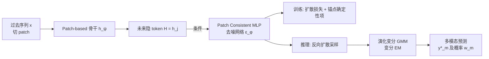

# MMPD: Diverse Time Series Forecasting via Multi-Mode Patch Diffusion Loss

**会议**: ICLR 2026  
**OpenReview**: [https://openreview.net/forum?id=NEUgHT8dvH](https://openreview.net/forum?id=NEUgHT8dvH)  
**代码**: [https://github.com/Thinklab-SJTU/MMPD](https://github.com/Thinklab-SJTU/MMPD)  
**领域**: 时间序列预测 / 扩散模型 / 损失函数设计  
**关键词**: 时序预测, 扩散损失, 多模态预测, Patch-based Backbone, 变分高斯混合, 概率预测  

## 一句话总结
把训练损失从「假设未来服从单峰高斯」的 MSE 升级成一个由扩散过程参数化的 **MMPD 损失**——它即插即用地挂在任意 patch-based 时序骨干网络后面，让同一段历史能预测出多个带概率的、形状各异的未来。

## 研究背景与动机
**领域现状**：时序预测这些年在骨干网络上百花齐放——稀疏注意力、趋势-季节分解、频域增强、patch 化、跨通道建模层出不穷，但绝大多数模型训练时仍然死守 MSE（或 MAE）这类回归损失。

**现有痛点**：论文从概率视角点破了 MSE 的本质局限。当假设 $p_\theta(y|x)=\mathcal{N}(y; f_\theta(x), \sigma^2 I)$、最大化对数似然时，目标恰好退化为 MSE。也就是说**用 MSE 训练，等价于隐式假设未来服从一个均值可预测、方差固定的独立高斯**。这带来四重限制：① 单峰高斯无法描述"同一历史导向多个可能未来"的场景；② 假设各预测步独立，但真实序列步间高度相关；③ 方差恒定，但真实不确定度往往随时间演化；④ 高斯对称，但真实分布常不对称（如降雨非负）。

**核心矛盾**：再精巧的骨干网络，只要损失函数把未来分布钉死成一个简单参数形式，模型表达力就被天花板锁死。先前改损失的尝试（DTW 难扩展到长程；负二项/Student-T/参数混合分布）都仍是**人工预定义的分布族**，建模复杂分布的能力受限。

**本文目标**：设计一个 backbone-agnostic、能捕捉任意复杂未来分布、并天然支持"多模态多未来"预测的可学习损失。

**核心 idea**：**把投影头并入损失** —— 将预测网络拆成骨干 $h_\psi$ 和投影器 $g_\phi$，把轻量投影器视为"可训练损失"的一部分 $\min_{\phi,\psi}\text{Loss}_\phi(H, y)$，这一视角和对抗损失中"可学习判别器引导生成器"如出一辙。在此框架下，**用扩散过程来参数化这个损失**，就能逃出高斯的牢笼。

## 方法详解

### 整体框架
任意 patch-based 骨干把过去序列切 patch、输出对应未来各 patch 的隐 token $H=\{h_j\}_{j=1}^l$。MMPD 不改骨干，只把这些 token 当作条件喂给一个扩散过程：训练时用扩散去噪目标（外加一个锚点项兼顾确定性预测）来优化骨干；推理时跑反向扩散采样，并在采样过程中实时拟合一个演化的变分 GMM，最终吐出若干带概率的多模态预测。

### 关键设计

**1. 把投影头改写成扩散损失：从概率视角重定义 loss。** 这是全文的地基。作者先证明 MSE 等价于假设未来是固定方差独立高斯，再把网络解耦成 $f_\theta(x)=g_\phi(h_\psi(x))$，指出骨干占了绝大多数参数、是优化的核心，而轻量投影器 $g_\phi$ 完全可以"算进损失里"，形成一个复合可训练损失 $\min_{\phi,\psi}\text{Loss}_\phi(H,y)$。MSE 在此框架下只是特例 $\text{MSE}_\phi(H,y)=\frac{1}{\tau}\|y-g_\phi(H)\|_2^2$。一旦把投影器看成"引导骨干优化的辅助模块"，就能把它换成一个**条件扩散过程**——用未来 token 当条件、用扩散去噪目标当损失，从而隐式建模任意复杂的 $p_\theta(y|x)$，彻底摆脱手工预定义分布族。

**2. Patch Consistent MLP：让轻量去噪器保持 patch 间一致。** 直接的做法是把噪声序列 $y_k$ 切成 patch、用一个 MLP 在 token $h_j$ 条件下独立去噪每个 patch（如视觉 token 的做法）。但独立 MLP 只建模了每个 patch 的**边缘分布** $p(p_j|x)$ 而非所有未来 patch 的**联合分布**，导致采样时 patch 之间出现不连续跳变。作者在 AdaLN-MLP（DiT 块的去噪 MLP）基础上扩展出 Patch Consistent MLP：去噪第 $j$ 个 patch 时，条件向量融合四部分——
$$c^k_j = \text{token}_j + \text{step}_k + \text{prev}^k_j + \text{next}^k_j$$
其中 $\text{prev}^k_j, \text{next}^k_j$ 是对当前 patch 左右各 $r$ 个**相邻噪声 patch** 的线性投影。正是这个"看邻居"的设计（外加极少的新增参数 $W^{(\text{prev})}, W^{(\text{next})}$）保证了去噪后各 patch 的连续性。消融显示 $r=0$（退化为独立 MLP）的 Top-3 MSE 甚至比 MSE 还差，$r=1$ 就显著改善。

**3. 锚点技巧：把确定性预测无缝塞进扩散框架。** 很多场景仍需要一个确定性预测（MSE 的传统角色），但反复跑扩散采样再取均值/中位数太贵。作者观察到扩散目标 $y_k=\sqrt{\bar\alpha_k}y_0+\sqrt{1-\bar\alpha_k}\epsilon$ 中，若在某步 $k^*$ 让 $y_{k^*}=0$，则噪声恰好退化为缩放的负真值 $\epsilon=-\frac{\sqrt{\bar\alpha_{k^*}}}{\sqrt{1-\bar\alpha_{k^*}}}y_0$。于是把 $(0,\{h_j\},k^*)$ 当作"确定性预测的锚点输入"，写出联合目标：
$$L=\lambda\|\epsilon-\epsilon_\phi(y_k,\{h_j\},k)\|_2^2+(1-\lambda)\Big\|\tfrac{\sqrt{\bar\alpha_{k^*}}}{\sqrt{1-\bar\alpha_{k^*}}}y_0+\epsilon_\phi(0,\{h_j\},k^*)\Big\|_2^2$$
默认 $\lambda=0.99$，$k^*$ 取使 $\bar\alpha_{k^*}\approx0.5$。训练后确定性预测直接由 $-\frac{\sqrt{1-\bar\alpha_{k^*}}}{\sqrt{\bar\alpha_{k^*}}}\epsilon_\phi(0,\{h_j\},k^*)$ 一步得到，**绕过昂贵的扩散迭代**，且不引入任何新结构（复用去噪器）。这一项本质上只是扩散目标在锚点处的特例，与扩散项不冲突。

**4. 演化变分 GMM：从隐式分布里抽出可解释的多模态。** 扩散得到的 $p_\theta(y|x)$ 是没有解析形式的隐式分布，传统做法只能采样后算中位数和置信区间，但样本本身呈现多峰，简单统计量描述不了。作者假设真分布是多模态形式 $q(y_0|x)=\sum_{m=1}^M w_m\delta(y_0-y^*_m)$，把它代入前向扩散，则第 $k$ 步的分布是一个高斯混合 $q(y_k|x)=\sum_m w_m\mathcal{N}(y_k;\sqrt{\bar\alpha_k}y^*_m,(1-\bar\alpha_k)I)$。据此设计一个**沿反向扩散同步演化的变分 GMM**：每一步 $k$ 用新生成的样本 $\{y^k_n\}$ 做变分 EM（E 步更新指派后验 $p(Z_k)$，M 步更新各模估计 $\mu^k_m$ 与权重/精度后验 $p(w_k),p(\Lambda_k)$），并用前向过程的先验注入引导更新。反向扩散结束时，GMM 直接给出 $M$ 个模态预测及其概率——模态的数量和结构都是从数据自适应推断的，而非像参数混合分布那样预定义。

## 实验关键数据

数据集：ETTh1/ETTm1/ETTh2/ETTm2、WTH、ECL、Traffic，外加新构造的 Dynamic（17 路无明显周期的复杂动力系统信号）。评估用 Top-K MSE/MAE（$K=3$，取 Top-3 概率最高模态里的最小误差）衡量多模态预测，并用 MSE / CRPS 衡量确定性与概率预测。

### 主实验（不同损失对比，表 1）
主骨干为 patch-based decoder-only Transformer，只换损失。

| 损失类型 | 代表方法 | 能否多模态 | 概要表现 |
|---|---|---|---|
| 确定性 | MSE / MAE | 否 | 确定性强，无多模态 |
| 参数分布 | Gaussian / Student-T | 否 | Student-T 是 CRPS 最强基线 |
| 参数混合 | Mix | 部分 | 能多模态但模数/形式预定义 |
| **本文** | **MMPD** | **是** | **Top-3 MSE/MAE 全面领先** |

- 仅 Mix 和 MMPD 能捕捉多模态，而 MMPD 的 Top-3 MSE/MAE 持续优于 Mix（Mix 的混合成分数量与形式是预定义的，MMPD 直接从数据学）。
- 确定性预测（MSE 指标）上 MMPD 与最强对手 MSE 损失相当、个别数据集更优；概率预测（CRPS）上与最强基线 Student-T 持平。

### 跨骨干泛化（表 2）
在 Crossformer（跨通道 Transformer）、SegRNN（patch-based RNN）、MaskAE（纯 Transformer 掩码自编码）三种骨干上对比 MSE / Mix / MMPD：MMPD 的多模态能力在三种骨干上都显著超过 MSE 和 Mix，确定性 MSE 与 MSE 损失相当。值得注意的是 Mix 因含 log-normal 分量易产生离群值，导致 CRPS 出现无穷大问题（在 RNN 类 SegRNN 上尤其严重），而 MMPD 的 CRPS 无论上游是 RNN 还是 Transformer 都保持稳定。

### 消融与关键发现
- **相邻范围 $r$**（Patch Consistent MLP）：$r=0$（独立 MLP）多模态预测很差、Top-3 MSE 甚至超过 MSE；$r=1$ 即显著降低 Top-3 MSE/MAE，再增大 $r$ 仅小幅提升——验证"看邻居保一致"是关键。
- **平衡权重 $\lambda$**：确定性项 $\lambda$ 在很宽范围内表现稳健，默认 0.99。
- **多模态推理 vs 后处理**：演化变分 GMM 的 Top-3 MSE/MAE（0.301/0.207）优于 Random、Post-KMeans、Post-Spectral、Post-GMM 等后处理方案——边采样边演化的 GMM 比"先采样后聚类"更准。
- **锚点 $k^*$**：预测精度对 $k^*$ 在较宽区间内鲁棒。

## 亮点与洞察
- **重新定义"损失"的视角很提神**：把投影头并入损失、把损失看成"可学习的、引导骨干优化的辅助模块"，从而能用扩散这种强分布建模器当损失，逻辑链条干净，且把 MSE/MAE/对抗损失都统一进同一框架。
- **即插即用、骨干无关**：不改任何骨干结构，patch-based 模型直接换损失即可获得多模态能力，对监督模型和基础模型都适用，工程落地成本低。
- **锚点技巧很巧**：用扩散目标在 $y_{k^*}=0$ 处的特例一步拿到确定性预测，既不另加网络、又不与扩散冲突、还省掉采样开销。
- **多模态是"推断"出来而非"预设"出来的**：模数和结构由变分 GMM 自适应推断，比 Mix 这类预定义混合分布更灵活，也更贴合"同一历史多个未来"的真实诉求（如交易场景的风险感知决策）。

## 局限与展望
- **推理成本**：尽管确定性预测被锚点技巧加速，但要拿到多模态预测仍需跑反向扩散采样 + 逐步变分 EM，相比一次前向的 MSE 推理开销明显更高。
- **超参与先验**：最大模数 $M$、相邻范围 $r$、先验超参 $\rho,u$、$\lambda$、$k^*$ 等需要设定，虽展示了鲁棒性，但跨域迁移时的默认值是否普适仍待观察。
- **聚焦单变量**：损失按通道独立计算再平均，跨通道的联合多模态依赖未被显式建模。
- **评估范式**：Top-K MSE 这类多模态指标尚不如 MSE 标准化，与下游真实收益（如交易决策）的对齐仍需更多验证。

## 相关工作与启发
- **概率/分布预测**：DeepAR（负二项）、Student-T、Mix（参数混合）都试图超越 MSE，但停留在预定义参数族；MMPD 用扩散把分布做成非参隐式形式，是这条线的自然延伸。
- **时序扩散**：CSDI 等独立时序扩散模型依赖专门架构，MMPD 反其道而行——不做独立模型，而把扩散当成可挂载任意骨干的**损失**。
- **视觉 token 扩散**：去噪 token 的思路（MAR 等）启发了用 token 当条件做 patch 扩散，但 MMPD 补上了"patch 间联合一致性"这一时序特有的缺口。
- **可学习损失**：与 GAN 中可学习判别器引导生成器的精神一致，提示"损失也可以是个被一起训练的网络"这一范式在更多任务上的潜力。

## 评分
- **新颖性**: ⭐⭐⭐⭐⭐ 「把投影头并入损失 + 用扩散参数化损失」的视角重构很漂亮，多模态自适应推断 + 锚点确定性技巧都有原创性。
- **实验充分度**: ⭐⭐⭐⭐ 8 数据集 + 4 骨干 + 多类损失基线 + 完整消融，覆盖确定性/概率/多模态三类指标；唯多变量联合与推理开销分析可再充实。
- **写作质量**: ⭐⭐⭐⭐⭐ 从概率视角推导 MSE 局限、层层引出扩散损失，叙事清晰、图示直观、动机与方法衔接自然。
- **价值**: ⭐⭐⭐⭐ 即插即用、骨干无关，对需要多未来/风险感知预测的场景（交易、动力系统）有直接价值，且为"损失即可学习模块"提供了可复用范式。

<!-- RELATED:START -->

## 相关论文

- [\[ICLR 2026\] Routing Channel-Patch Dependencies in Time Series Forecasting with Graph Spectral Decomposition](routing_channel-patch_dependencies_in_time_series_forecasting_with_graph_spectra.md)
- [\[ICLR 2026\] PMDformer: Patch-Mean Decoupling Information Transformer for Long-term Forecasting](pmdformer_patch-mean_decoupling_information_transformer_for_long-term_forecastin.md)
- [\[ICLR 2026\] Lost in the Non-convex Loss Landscape: How to Fine-tune the Large Time Series Model?](lost_in_the_non-convex_loss_landscape_how_to_fine-tune_the_large_time_series_mod.md)
- [\[ICLR 2026\] Rating Quality of Diverse Time Series Data by Meta-learning from LLM Judgment](rating_quality_of_diverse_time_series_data_by_meta-learning_from_llm_judgment.md)
- [\[ICLR 2026\] A Study of Posterior Stability in Time-Series Latent Diffusion](a_study_of_posterior_stability_in_time-series_latent_diffusion.md)

<!-- RELATED:END -->
