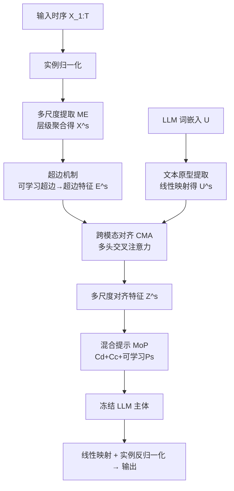

# Multi-Scale Hypergraph Meets LLMs: Aligning Large Language Models for Time Series Analysis

**会议**: ICLR 2026  
**OpenReview**: [https://openreview.net/forum?id=SbBX2dCw3y](https://openreview.net/forum?id=SbBX2dCw3y)  
**代码**: 待确认  
**领域**: 时间序列分析 / LLM 跨模态对齐  
**关键词**: LLM4TS, 多尺度对齐, 超图, 混合提示, 时序预测  

## 一句话总结
MSH-LLM 用「可学习超边」给时间序列补语义、用跨模态注意力在多个尺度上把时序特征对齐到 LLM 词原型、再用「混合提示」激活 LLM 的时序推理能力，在 27 个数据集 5 类任务上拿下 SOTA。

## 研究背景与动机
- **领域现状**：把冻结的 LLM（LLaMA、GPT-2）当作时序分析骨干已成主流，核心是把「自然语言」与「时间序列」两个模态对齐——要么 reprogram 输入时序（Time-LLM），要么用提示注入上下文（AutoTimes）。
- **现有痛点一（语义空间错位）**：自然语言的多尺度语义空间（词→短语→句子）天然丰富且有区分度，而单个时间点携带的语义极稀疏。现有方法靠 patch 切分来补语义，但**简单分块会引入噪声、且只能在单一尺度上用预定义规则建模 group-wise 交互**，发现不了隐式交互。
- **现有痛点二（推理能力缺失）**：预训练 LLM 并不天然具备解读时序模式的知识与推理能力。已有 prefix prompt / self-prompt 只给单一类型提示，且没利用多尺度时序特征，**难以真正理解时序模式**。
- **核心矛盾**：语言和时序**都**有多尺度结构（语言的词/短语/句子 vs 时序的日/周等周期模式），但现有 LLM4TS 工作几乎都只做单尺度对齐，没把这种多尺度结构对齐起来，浪费了 LLM 的能力。
- **本文目标**：做时序分析里**第一个多尺度对齐**工作——既补齐时序的多尺度语义、又在多尺度上完成跨模态对齐、还要激活 LLM 对多尺度时序模式的推理。
- **核心 idea**：**【可学习超图补语义】**用可学习超边以数据驱动方式捕获多尺度 group-wise 交互（替代预定义规则），**【多尺度跨模态对齐】**让超边特征与多尺度文本原型在每个尺度上做交叉注意力，**【混合提示激活推理】**用三类互补提示（可学习/数据相关/能力增强）一起喂给 LLM。

## 方法详解

### 整体框架
MSH-LLM 重用**冻结**的 LLM 做通用时序分析。先把输入时序与 LLM 词嵌入分别映射成「多尺度时序特征」和「多尺度文本原型」；再用超边机制给时序补充 group-wise 语义，得到多尺度超边特征；接着跨模态对齐模块（CMA）在每个尺度上把超边特征对齐到文本原型；最后混合提示机制（MoP）拼上三类提示一起送进冻结 LLM，输出经线性映射 + 实例反归一化得到结果。

### 关键设计

**1. 多尺度提取（ME）：给两个模态都造出层级结构。** 对时序侧，先做可逆实例归一化，再用聚合函数（1D 卷积或平均池化）逐尺度下采样得到 $X^s = \text{Agg}(X^{s-1}; \theta^{s-1}) \in \mathbb{R}^{N^s \times D}$，其中尺度 $s$ 的序列长度 $N^s = \lfloor N^{s-1}/l^{s-1} \rfloor$ 由聚合窗口 $l^{s-1}$ 决定。对语言侧，先把巨大的词嵌入 $U \in \mathbb{R}^{V \times P}$ 线性压成一小撮文本原型 $U^1 \in \mathbb{R}^{V' \times P}$（$V' \ll V$，过滤噪声、抓时序相关的语言信号），再逐尺度线性映射 $U^s = \text{Linear}(U^{s-1}; \lambda^{s-1})$，让不同尺度的原型对应词/短语/句子级语义，为后续多尺度对齐铺好两侧的层级表示。

**2. 超边机制：以可学习方式补齐时序的多尺度语义。** 把多尺度时序特征当作节点，在每个尺度初始化两组可学习嵌入——超边嵌入 $E^s_{hyper} \in \mathbb{R}^{M^s \times D}$ 和节点嵌入 $E^s_{node} \in \mathbb{R}^{N^s \times D}$（$M^s$ 是该尺度超边数量的超参）。通过相似度计算构造尺度专属关联矩阵：$U^s_1 = \tanh(E^s_{node}\beta)$、$U^s_2 = \tanh(E^s_{hyper}\phi)$、$H^s = \text{Linear}(\text{ReLU}(U^s_1 (U^s_2)^\top))$，其中 ReLU 砍掉弱连接。再用 TopK 稀疏化 $H^s$（每个节点最多连 $\eta$ 个超边）以抗噪、降算力。最终每条超边特征由其邻接节点平均得到：$e^s_i = \text{Avg}(\sum_{x^s_j \in N(e^s_i)} x^s_j)$。这套机制的两点新意是：**用可学习参数 + 非线性变换数据驱动地发现隐式 group-wise 交互**（而非预定义规则、单一尺度），且**直接学超图结构**（而非靠约束或聚类），更灵活、能表达更复杂的结构。

**3. 跨模态对齐（CMA）：在每个尺度把时序对齐到语言。** 在尺度 $s$ 上做多头交叉注意力，关键是**让超边特征当 query、文本原型当 key/value**：$Q^s_j = E^s W^s_{q,j}$、$K^s_j = U^s W^s_{k,j}$、$V^s_j = U^s W^s_{v,j}$，然后 $Z^s_j = \text{softmax}(Q^s_j (K^s_j)^\top / \sqrt{d}) V^s_j$，各头拼回得到该尺度的对齐特征 $Z^s$。由此跳出「只在单一尺度对齐」的局限，在多个尺度上都用语言原型重新表达时序，拿到更丰富的跨模态表示 $\{Z^1, \dots, Z^S\}$。

**4. 混合提示（MoP）：三类互补提示一起激活 LLM 推理。** 单一提示无法充分激活 LLM 的多面推理能力，MoP 同时注入三类：**可学习提示** $C_l = \{P^1, \dots, P^S\}$（每尺度一组 soft prompt，从任务监督损失中学时序动态）；**数据相关提示** $C_d = \text{LLMs}(\text{tokenizer}(\pi, \tau, \mu))$（数据描述 $\pi$ + 任务说明 $\tau$ + 多尺度数据统计 $\mu$，给背景与子序列统计）；**能力增强提示** $C_c = \text{LLMs}(\text{tokenizer}(\phi, \varphi, \psi))$（逻辑链式思考 $\phi$ + 情感操纵 $\varphi$ 让模型更专注 + 时序推理方法论 $\psi$）。最后把可学习提示与各尺度对齐特征拼接、再接上 $C_d$、$C_c$ 一起送进 LLM：$O = \text{LLMs}([C_d, C_c, [P^1, Z^1], \dots, [P^S, Z^S]])$。

## 实验关键数据
在 27 个真实数据集、5 类任务（长/短期预测、分类、少样本、零样本）上对比 19 个先进 baseline。

### 主实验表格（长期预测，MSE/MAE，全 horizon 平均）

| 数据集 | MSH-LLM | S2IP-LLM | Time-LLM | FPT | iTransformer | DLinear |
|---|---|---|---|---|---|---|
| Weather | **0.217/0.254** | 0.223/0.259 | 0.231/0.269 | 0.237/0.271 | 0.305/0.335 | 0.249/0.300 |
| Electricity | **0.159/0.253** | 0.163/0.258 | 0.165/0.261 | 0.167/0.263 | 0.203/0.298 | 0.166/0.264 |
| Traffic | **0.381/0.283** | 0.406/0.287 | 0.408/0.291 | 0.414/0.295 | 0.384/0.295 | 0.434/0.295 |
| ETTh1 | **0.402/0.420** | 0.405/0.426 | 0.414/0.435 | 0.418/0.431 | 0.451/0.462 | 0.419/0.439 |
| ETTm2 | **0.252/0.311** | 0.257/0.319 | 0.272/0.332 | 0.264/0.328 | 0.272/0.331 | 0.276/0.341 |

相比 LLM4TS 方法平均降误差 4.10%/3.72%（MSE/MAE），相比最新 Transformer 类降 8.54%/6.45%，相比线性类降 7.48%/5.58%。

### 消融实验表格（Traffic，MSE/MAE）

| 变体 | H=96 | H=192 | H=336 |
|---|---|---|---|
| 完整 MSH-LLM | **0.365/0.270** | **0.372/0.281** | **0.385/0.279** |
| -w/o $C_l$（去可学习提示） | 0.373/0.272 | 0.379/0.289 | 0.400/0.293 |
| -w/o $C_d$（去数据相关提示） | 0.368/0.273 | 0.383/0.286 | 0.405/0.292 |
| -w/o $C_c$（去能力增强提示） | 0.375/0.272 | 0.392/0.282 | 0.391/0.284 |
| -w/o MoP（全去） | 0.399/0.283 | 0.403/0.290 | 0.409/0.295 |
| G.6（换成 GPT-2 前 6 层） | 0.393/0.295 | 0.404/0.297 | 0.411/0.316 |

### 关键发现
- **多尺度对齐确有增益**：全任务全数据集几乎都 SOTA；短期 M4 上 SMAPE 11.659（优于 AutoTimes 11.831），分类 10 个 UEA 子集均值 75.38%（超 FPT 74%）。
- **少样本/零样本最受益**：5% 训练数据下相比 S2IP-LLM/Time-LLM 平均降 MSE 10.47%；零样本 M4→M3、M3→M4 平均降 SMAPE 10.23%——印证多尺度结构 + MoP 在数据稀缺时更能调动 LLM 知识。
- **MoP 缺一不可**：去任一提示都掉点，全去（-w/o MoP）最差；t-SNE 显示带 MoP 的 LLM 输出聚类更清晰。
- **scaling law 成立**：LLaMA-7B（32 层）> 前 12 层 > GPT-2 Small > GPT-2 前 6 层，说明骨干越大跨模态对齐越好。

## 亮点与洞察
- **「语言和时序都是多尺度」这个观察很扎实**：把对齐从单尺度提到多尺度，思路自然且首次系统化。
- **可学习超边替代预定义 patch/规则**：用 TopK 稀疏化 + 数据驱动的超图结构学习，既补语义又抗噪，比固定分块更能抓隐式 group-wise 交互。
- **CMA 的方向选择有讲究**：让时序超边当 query 去「查询」语言原型，本质是用语言语义重新表达时序，契合「补语义」的动机。
- **MoP 把提示工程系统化**：三类提示分工明确（学动态 / 给背景 / 激活推理），消融证明互补。

## 局限与展望
- **超参偏多**：尺度数 $S$、每尺度超边数 $M^s$、TopK 阈值 $\eta$、聚合窗口 $l^s$ 等需调，迁移到新数据集的调参成本未充分讨论。
- **可学习超边可解释性有限**：超图结构是黑箱学出来的，论文用可视化佐证但缺乏定量解释「学到了什么尺度的什么模式」。
- **冻结 LLM 仍有推理开销**：虽然冻结骨干，但 32 层 LLaMA-7B + 多尺度多提示拼接的推理/显存成本未与轻量 baseline 系统对比。
- **「情感操纵提示」略 hacky**：用「emotional blackmail」提示提升专注度的机理不清，泛化性存疑。

## 相关工作与启发
- **同模态学习**（BERT/GPT-3/BEiT、时序自监督）受限于缺大规模预训练数据与统一无监督目标，难训通用时序基础模型——这是转向 LLM4TS 的动机。
- **跨模态学习**：FPT 微调 LLM 关键参数、aLLM4TS 两阶段预训练、Time-LLM reprogram、AutoTimes 自回归提示——MSH-LLM 指出它们都忽略了多尺度结构。
- **多尺度时序分析**：TAMS-RNNs、Pyraformer、Pathformer、MSHyper（本文作者前作，Transformer+多尺度超图）——但都用固定分段/预定义规则，本文改为可学习超边。
- **启发**：在任意「补语义 + 跨模态对齐」场景，「先造层级结构 → 数据驱动建 group-wise 交互 → 多尺度对齐」是可复用范式；MoP 的「多类提示互补」也可迁移到其他冻结 LLM 应用。

## 评分
- **新颖性**: ⭐⭐⭐⭐ 首个时序多尺度对齐工作，可学习超边 + 多尺度 CMA + MoP 三件套组合新颖，虽各组件（超图、reprogram、prompt）皆有前作。
- **实验充分度**: ⭐⭐⭐⭐⭐ 27 数据集 5 任务 19 baseline，长/短期、分类、少样本、零样本全覆盖，消融与可视化扎实。
- **写作质量**: ⭐⭐⭐⭐ 动机—问题—方法逻辑清晰，公式与图示完整；个别提示设计（情感操纵）解释偏弱。
- **价值**: ⭐⭐⭐⭐ 在数据稀缺场景增益明显，多尺度对齐范式对 LLM4TS 社区有借鉴意义。

<!-- RELATED:START -->

## 相关论文

- [\[ICLR 2026\] Semantic-Enhanced Time-Series Forecasting via Large Language Models](semantic-enhanced_time-series_forecasting_via_large_language_models.md)
- [\[ICLR 2026\] TimeOmni-1: Incentivizing Complex Reasoning with Time Series in Large Language Models](timeomni-1_incentivizing_complex_reasoning_with_time_series_in_large_language_mo.md)
- [\[AAAI 2026\] FreqCycle: A Multi-Scale Time-Frequency Analysis Method for Time Series Forecasting](../../AAAI2026/time_series/freqcycle_a_multi-scale_time-frequency_analysis_method_for_time_series_forecasti.md)
- [\[ICLR 2026\] Time-Gated Multi-Scale Flow Matching for Time-Series Imputation](time-gated_multi-scale_flow_matching_for_time-series_imputation.md)
- [\[ICML 2026\] Building Social World Models with Large Language Models](../../ICML2026/time_series/building_social_world_models_with_large_language_models.md)

<!-- RELATED:END -->
