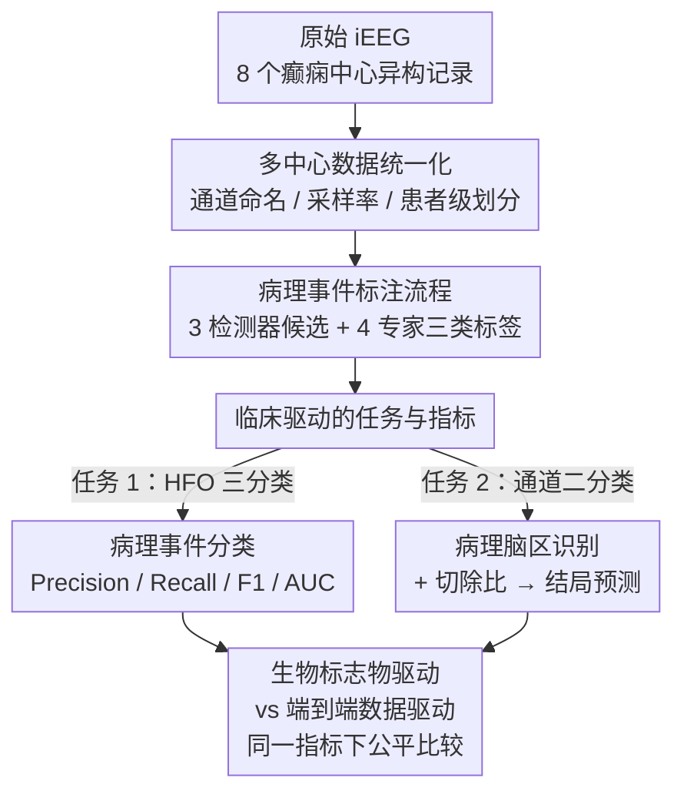

# Omni-iEEG: A Large-Scale, Comprehensive iEEG Dataset and Benchmark for Epilepsy Research

**会议**: ICLR 2026  
**arXiv**: [2602.16072](https://arxiv.org/abs/2602.16072)  
**代码**: [omni-ieeg.github.io/omni-ieeg](https://omni-ieeg.github.io/omni-ieeg/)  
**领域**: 时间序列 / 神经科学  
**关键词**: intracranial EEG, epilepsy, high-frequency oscillations, benchmark, dataset

## 一句话总结

本文构建了 Omni-iEEG 数据集（302 名患者、178 小时高分辨率颅内脑电记录），定义了基于临床先验的标准化基准任务和评估指标，并展示端到端建模在癫痫手术规划中可匹配或超越传统生物标志物方法。

## 研究背景与动机

**领域现状**：癫痫影响全球超过 5000 万人，约 30% 的患者为药物难治性癫痫，手术切除致痫区（Epileptogenic Zone, EZ）是获得无发作自由的最佳方案。颅内脑电（iEEG）是定位 EZ 的金标准。

**现有痛点**：现有公开 iEEG 数据集（Open iEEG、Zurich、HUP、SourceSink）存在三大问题：(1) 格式异构——采样率、通道命名、元数据不一致；(2) 缺乏标准化基准——各研究使用不同的评估方案，结果不可比较；(3) 病理事件标注稀缺——HFO 等关键生物标志物的专家标注极少公开。

**核心矛盾**：机器学习方法通常在单中心小数据集上验证，泛化性存疑。同时，神经科学领域缺乏统一的评估平台来公正衡量不同方法的临床价值。

**本文方案**：整合 8 个癫痫中心的数据，经过 board-certified 癫痫专家验证和元数据统一，构建 Omni-iEEG 数据集与基准。发布 36K+ 专家标注的病理事件，定义两项主要任务和三项探索性任务，并提供从生物标志物驱动到端到端数据驱动的全面 baseline。

## 方法详解

### 整体框架

Omni-iEEG 不是一个模型，而是一套从原始信号到临床决策的基准基础设施，可拆成三层：数据层把 8 个癫痫中心的异构 iEEG 统一成可比对的格式，任务层用临床先验把"定位致痫区"翻译成可量化的分类任务，模型层则同时容纳生物标志物驱动和端到端数据驱动两类 baseline。一段原始 iEEG 进来后，既能走"HFO 检测 + 事件分类"的传统管线，也能直接喂给端到端模型逐通道判别病理性，两条路在同一评估指标下公平比较。

### 关键设计

**1. 多中心数据统一化：消除"格式异构"这个隐形门槛**

现有公开 iEEG 数据集各自为政，采样率、通道命名、元数据全都不一致，导致跨中心训练几乎不可能。本文整合 UCLA（50 名患者）、底特律儿童医院（135 名）、苏黎世大学医院（20 名）、宾州大学医院（58 名）以及 NIH/JHH/UMF（39 名）等 8 个中心共 302 名患者、178 小时记录，由 board-certified 临床专家统一通道命名、SOZ/切除带标注和手术结局报告，过滤掉参考电极、EKG、刺激通道这类非标准通道以及平坦或过噪信号，并按各数据源推荐流程（如双极蒙太奇）预处理后统一重采样到 1000 Hz。数据集按患者级做 60%/40% 划分，并在切分时刻意平衡来源、手术结局、通道数和记录模态，避免某一中心的特性泄漏成捷径。正因为统一化做在最底层，上层任何模型的跨中心泛化结果才第一次变得可信。

**2. 病理事件标注流程：把"专家共识"沉淀成可训练标签**

高频振荡（HFO，80–500 Hz）是定位致痫区的关键生物标志物，但区分病理性和生理性 HFO 极依赖人工，公开标注几乎空白。本文用 STE、MNI、Hilbert 三种主流检测器各自生成候选事件，再让 4 位 board-certified 癫痫专家对每个候选打三类标签——伪影、与棘波共现的病理性 HFO（spkHFO）、非病理性 HFO。最终标注 36,177 个事件（伪影 9,288、非 spkHFO 7,709、spkHFO 19,180），3 名主要标注者的 Fleiss' $\kappa = 0.925$、成对 Cohen's $\kappa$ 落在 0.88–0.94，说明这套标签虽带主观性但共识度很高，足以作为监督信号支撑事件级分类任务。

**3. 临床驱动的任务与指标：让评估贴合"少漏病灶、少切健康"的手术现实**

基准定义两项主要任务。任务 1 是病理事件分类，对单个 HFO 候选做 spkHFO / 非 spkHFO / 伪影 三分类，用 macro-averaged Precision、Recall、F1 和 AUC 衡量。任务 2 是病理脑区识别，在通道级做病理 vs 正常二分类，标签由致痫患者的 SOZ 通道与无发作患者的保留通道共同定义；为了把通道判别落回临床结局，本文进一步定义切除比（Resection Ratio），即模型预测的病理性得分在已切除通道上的占比 $RR = \sum_{c \in \text{resected}} s_c \big/ \sum_{c \in \text{all}} s_c$，用它衡量"模型认为该切的区域是否真的被切了"，从而评估患者级手术结局预测能力。这种设计刻意强调单一 AUC 不够，必须同时盯住 Recall（别遗漏病理组织）和 Specificity（别过度切除）。

## 实验关键数据

### 主实验

**任务 1：病理事件分类**

| 模型 | Precision | Recall | F1 | AUC |
|------|-----------|--------|----|-----|
| LSTM+Attention | 0.735 | 0.736 | 0.734 | 0.911 |
| PatchTST Transformer | 0.776 | 0.769 | 0.773 | 0.931 |
| TimesNet | 0.759 | 0.773 | 0.765 | 0.922 |
| **PyHFO-Omni** | **0.803** | **0.811** | **0.806** | **0.939** |

**任务 2：病理脑区识别**

| 模型 | 通道 Precision | 通道 Recall | 通道 F1 | 通道 Specificity | 通道 AUC | 结局 AUC |
|------|---------------|-------------|---------|-----------------|----------|----------|
| eHFO | 0.605 | 0.647 | 0.620 | 0.410 | 0.661 | 0.452 |
| PyHFO-Omni | 0.580 | 0.699 | 0.564 | 0.695 | 0.735 | **0.744** |
| SEEG-NET | 0.579 | 0.717 | 0.526 | 0.605 | 0.785 | 0.595 |
| CLAP (音频预训练) | 0.594 | 0.700 | 0.601 | 0.782 | 0.768 | 0.677 |
| **TimeConv-CNN** | **0.626** | **0.745** | **0.647** | **0.823** | **0.806** | 0.738 |

### 消融实验

**跨数据集泛化（Leave-one-out HFO 分类）**

| 剔除数据集 | Precision | Recall | F1 |
|------------|-----------|--------|----|
| Open-iEEG | 0.696 | 0.689 | 0.623 |
| Zurich | 0.734 | 0.752 | 0.742 |
| HUP | 0.697 | 0.765 | 0.722 |
| SourceSink | 0.711 | 0.741 | 0.722 |

**段长度消融（TimeConv-CNN）**

| 段长度 | Precision | Recall | F1 | Specificity | AUC |
|--------|-----------|--------|----|-------------|-----|
| 30 秒 | 0.577 | 0.707 | 0.544 | 0.659 | 0.773 |
| **1 分钟** | **0.608** | **0.761** | **0.610** | **0.748** | **0.823** |
| 2 分钟 | 0.592 | 0.747 | 0.564 | 0.668 | 0.805 |

### 关键发现

1. **端到端模型 ≈ 传统生物标志物**：TimeConv-CNN 的手术结局预测 AUC（0.738）与基于 HFO 的 PyHFO-Omni（0.744）接近，但通道识别 AUC（0.806）明显更优
2. **跨域迁移的可行性**：音频预训练模型 CLAP 微调后在 iEEG 分类上取得竞争力性能（通道 AUC 0.768），暗示 iEEG 可能存在"可听的"生物标志物特征
3. **单中心模型泛化失败**：公开的基于单中心数据训练的事件级模型在多中心基准上性能显著下降
4. **1 分钟段为最优**：相比 30 秒和 2 分钟，1 分钟段在信息量和特征稳定性之间取得最佳平衡

## 亮点与洞察

- **首个全面的癫痫 iEEG 基准**：统一了格式、元数据、标注和评估标准，解决了该领域长期存在的可重复性问题
- **"可听的"生物标志物**：YAMNet 将 SOZ 通道的 iEEG 信号标注为"直升机"声，而保留通道从未获此标签——这一跨模态发现极具启发性
- **TimeConv-CNN 架构设计**：先用 1D 时间卷积压缩 60000 时间点的时频表示，再用 CNN 捕获联合时频特征，高效处理千赫兹级长段 iEEG
- **临床驱动的评估哲学**：强调单一 AUC 不够，需同时关注 Recall（避免遗漏病理组织）、Specificity（避免过度切除）和手术结局预测

## 局限与展望

- spkHFO 标注仍存在主观性，尽管标注者间一致性很高（$\kappa > 0.9$）
- 数据集虽涵盖 8 个中心但仍以北美为主，人口统计学多样性不足
- SOZ 通道远少于非 SOZ 通道，类别不平衡仍是挑战
- 未探索图结构和通道间相关性的无监督方法
- 可能存在模型过度依赖的风险——强调需要临床专家参与决策流程

## 相关工作与启发

- **iEEG 公开数据集**：Open iEEG (Zhang et al., 2025)、Zurich HFO (Fedele et al., 2017) 等数据集格式各异，本文的统一化工作对领域有重要基础设施价值
- **HFO 生物标志物**：Gotman (2010)、Frauscher et al. (2018) 等建立了 HFO 作为致痫区定位标志物的临床价值，但区分病理性和生理性 HFO 仍是挑战
- **音频-脑电跨域**：CLAP 的成功迁移启示神经信号和声学信号共享某些底层表征结构，值得进一步探索

## 评分

⭐⭐⭐⭐

本文在数据集构建、基准设计和跨域分析方面做出了扎实贡献。302 名多中心患者、36K 专家标注、统一化流程和全面 baseline 对比为癫痫 iEEG 领域建立了重要的公共基础设施。CLAP 跨域迁移和"可听的"生物标志物发现尤为新颖。

<!-- RELATED:START -->

## 相关论文

- [\[ICLR 2026\] Battery Fault: A Comprehensive Dataset and Benchmark for Battery Fault Diagnosis](battery_fault_a_comprehensive_dataset_and_benchmark_for_battery_fault_diagnosis.md)
- [\[ICML 2026\] FactoryNet: A Large-Scale Dataset toward Industrial Time-Series Foundation Models](../../ICML2026/time_series/factorynet_a_large-scale_dataset_toward_industrial_time-series_foundation_models.md)
- [\[NeurIPS 2025\] CausalDynamics: A Large-Scale Benchmark for Structural Discovery of Dynamical Causal Models](../../NeurIPS2025/time_series/causaldynamics_a_large-scale_benchmark_for_structural_discovery_of_dynamical_cau.md)
- [\[ICLR 2026\] Multi-Scale Hypergraph Meets LLMs: Aligning Large Language Models for Time Series Analysis](multi-scale_hypergraph_meets_llms_aligning_large_language_models_for_time_series.md)
- [\[ICCV 2025\] VLRMBench: A Comprehensive and Challenging Benchmark for Vision-Language Reward Models](../../ICCV2025/time_series/vlrmbench_a_comprehensive_and_challenging_benchmark_for_vision-language_reward_m.md)

<!-- RELATED:END -->
