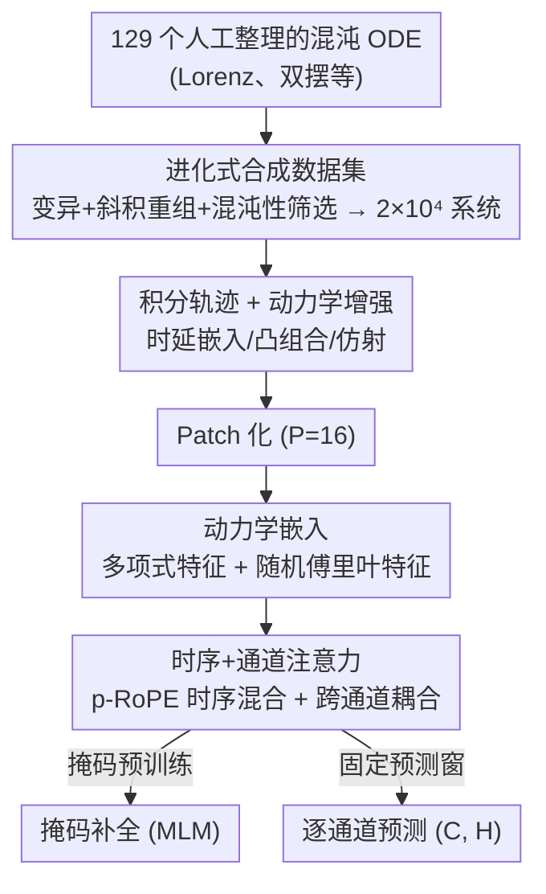

# Panda: A Pretrained Forecast Model for Chaotic Dynamics

**会议**: ICLR 2026  
**OpenReview**: [https://openreview.net/forum?id=DgnsohAUMn](https://openreview.net/forum?id=DgnsohAUMn)  
**代码**: https://github.com/abao1999/panda  
**领域**: 时间序列 / 科学机器学习 / 混沌动力学  
**关键词**: 混沌系统预测, 预训练基座模型, 通道注意力, 合成数据, 涌现能力

## 一句话总结
本文用进化算法"造"出 2 万个全新的混沌常微分方程作为合成训练集，配合一个带通道注意力和动力学嵌入的 patch Transformer（Panda），仅在低维 ODE 上预训练就能零样本预测未见过的混沌系统乃至高维 PDE，并展现出动力系统专属的神经缩放律。

## 研究背景与动机
**领域现状**：用数据驱动方法预测混沌系统（湍流、神经活动、双摆等）一直是科学机器学习（SciML）的难题。现有路线分两类：一类是针对单个系统训练的"本地"专用模型——只学一条轨迹背后的数值传播子，本质是同分布泛化；另一类是时间序列基座模型（Chronos、TimesFM、Time-MOE 等），在海量但缺乏动力学结构的通用时序库上预训练。

**现有痛点**：混沌系统对误差极其敏感，任何微小误差都会随时间指数放大，使长程预测理论上不可能。本地模型换一个系统就得重训，无法泛化到未见过的方程；通用时序基座虽然能零样本上场，但在动力系统上的表现"只和普通时序任务差不多"，因为它们的因果解码器倾向于"鹦鹉学舌"地照抄上下文里的片段，在分布外任务上过度自信、点预测精度差。

**核心矛盾**：动力系统真正需要的是**跨域泛化**——能预测**没见过的新方程**。这要求一个"全局"模型，既要有大量背景动力学知识，又要能对新系统做局部适配。但训练这种模型卡在两件事上：(1) 没有足够大、足够多样、且**确实混沌**的方程数据集；(2) 通用时序架构没有针对动力系统的归纳偏置（强通道耦合、不变测度等）。

**本文目标**：拆成两个子问题——怎么**造**出海量真混沌的训练数据，以及怎么**设计**一个把动力系统理论编码进去的架构。

**切入角度**：作者从动力系统理论出发：(a) Takens 嵌入定理说明对低维观测做时延拷贝就能保留吸引子的拓扑结构，这天然契合 patch 化的时序 token；(b) 系统变量之间是确定性微分方程耦合，不是统计相关，所以需要显式的通道注意力；(c) eDMD / Koopman 算子用多项式特征近似非线性动力学，启发把 patch 升维到多项式+傅里叶特征空间。

**核心 idea**：用进化算法从 129 个已知混沌系统繁殖出 2 万个新混沌 ODE 当合成数据，再用一个动力学感知的 patch Transformer 在纯模拟数据上预训练，让"预测混沌"变成一个可零样本迁移的基座任务。

## 方法详解

### 整体框架
Panda 的工作分两条主线：**数据侧**用进化算法批量发现新混沌系统并积分成轨迹，**模型侧**用一个 encoder-only 的多变量 patch Transformer 在这些轨迹上做掩码预训练 + 短程预测。输入是一段多变量轨迹 $\mathcal{T}\in\mathbb{R}^{C\times T}$，patch 化并升维后经过交替的"时序注意力 + 通道注意力"层，预测头输出固定长度 $H$ 的逐通道预测；同一架构还支持掩码补全（masked completion）这一辅助输出模式。整个 pipeline 从"造数据"到"出预测"自上而下串成一条链：

### 关键设计

**1. 进化式合成混沌数据集：用变异+斜积重组造出 2 万个真·混沌系统**

针对"没有足够大且确实混沌的训练集"这个痛点，作者把生成新方程做成一个进化搜索过程。**奠基种群**是 129 个文献整理的低维混沌 ODE $\dot{x}=f_\theta(x,t)$，参数和初值都被手调到混沌区。**变异**对参数加高斯噪声 $\theta'_a\sim\mathcal{N}(\theta_a,\sigma)$。**重组**用一个非对称的斜积耦合把两个父系统拼起来：

$$\dot{x}=f_a(x,t),\qquad \dot{y}=\kappa_b f_b(y,t)+\kappa_a f_a(x,t)$$

其中 $f_a$ 是驱动、$f_b$ 是响应，尺度因子取逆 RMS 范数 $\kappa=1/\sqrt{\mathbb{E}\|f(x,t)\|^2}$。这种耦合在合适尺度下能**保持混沌性**，因为响应系统要么同步到混沌驱动、要么自己仍然混沌。最关键的是**筛选**：用 5 阶隐式 Runge-Kutta 积分后跑一整套吸引子测试——先剔除收敛到不动点或发散的瞬态系统，再用 chaos 0-1 test 区分准周期 vs 真混沌、近复现测试剔除极限环、功率谱测试剔除只有几个尖峰的轨迹、Rosenstein 估计器保证最大 Lyapunov 指数为正，最后用 KPSS 和 ADF 检验平稳性。这套后验筛选正是它区别于"随机扰动已知方程"或"从固定函数库拼项"的同类工作的地方：别人不检验系统是否真有独特吸引子，Panda 检验。最终得到约 $2\times10^4$ 个新系统，且跨代际不变量（最大 Lyapunov 指数、分形维数）的范围没有缩窄，说明种群足够多样。

**2. 动力学嵌入：用多项式+随机傅里叶特征把 patch 升维成 Koopman 风格的可观测量**

普通 patch 直接线性投影丢失了动力系统的非线性结构。作者把每个 patch token $P\in\mathbb{R}^{C\times P}$ 与**随机多项式特征**和**随机傅里叶特征**拼接后升维到 $d_{model}$。多项式特征对一组随机采样的 $d$-元组指标 $I$ 取连乘 $\Phi_{c,i}(P)=\prod_{j=1}^d P_{c,I_j}$（度数 $d\in\{2,3\}$）；随机傅里叶特征用随机 $W,b\sim\mathcal{N}(0,\sigma^2)$ 算 $F(P)=[\sin(PW+b)\;\cos(PW+b)]$。整体嵌入 $E(P)=[P\;\Phi(P)\;F(P)]$，并令 $P+N_{poly}+N_{rff}=512$。这个设计直接借鉴 eDMD 近似 Koopman 算子和下一代水库计算用多项式特征预测混沌的思路：把非线性动力学"提升"到一个高维空间里，让注意力在更接近线性可观测的坐标里工作。

**3. 时序注意力 + 通道注意力：用跨通道耦合捕捉动力系统的变量间确定性依赖**

混沌系统的变量之间是微分方程耦合，不是统计相关，所以单变量（通道独立）架构会吃亏（5.2 节实验证实）。Panda 在 PatchTST 基础上交替插入两种注意力：**时序注意力**把通道维当 batch、在 $T/P$ 个 patch 上做带 p-RoPE 的自注意力（RoPE 波长 500、$p=75\%$）；**通道注意力**则转置 token 序列、把通道当作一个集合做无位置编码的自注意力 $\text{ChannelAttn}(\mathcal{T}_P)=\text{SelfAttention}(\mathcal{T}_P^\top)$。每个时序层后跟通道层，再接前馈残差、GeLU、RMSNorm。正是这个通道注意力让模型虽然**只在 3 维 ODE 上训练**，却能泛化到任意维度的系统——电路实验里耦合强度越大，Panda 相对 Chronos-SFT 的优势越明显，画出一条清晰的 Pareto 前沿。

**4. 掩码预训练 + encoder-only 固定窗架构：为"预测天气"而非"预测气候"优化短程精度**

作者刻意不用因果解码器（那种会"鹦鹉学舌"照抄上下文、在分布外过度自信），而选 encoder-only、固定预测窗的架构，主打短程逐点精度——在 SciML 里这叫"预测天气"而非"预测气候"。预训练除了直接预测，还加了**掩码语言建模（MLM）式补全**：随机遮住部分 patch 让模型重建，强制它学习动力学连续性。消融显示通道注意力和 MLM 预训练各自都带来显著提升；不过 MLM 与动力学嵌入的交互比较微妙——无 MLM 时动力学嵌入有帮助、有 MLM 时反而略降，且 MLM 会损害自回归 rollout 而动力学嵌入会改善它，所以最终选用带多项式特征的嵌入（PolyEmbed）来兼顾长程预测。

### 损失函数 / 训练策略
模型规模 21M 参数，纯在合成 ODE 轨迹上预训练，训练目标结合固定窗短程预测损失与掩码补全损失。每条轨迹按通道做 instance-normalization；积分时按 4096 个时间点和主导时间尺度标准化积分窗与粒度。评测时用窗口自回归把预测窗外推到训练预测窗的数倍以上。

## 实验关键数据

### 主实验
在 $9.3\times10^3$ 个留出（held-out）混沌系统上做零样本预测，Panda（21M）对比同量级或更大的时序基座模型：

| 任务 / 对比 | 指标 | Panda | 最强基线 | 结论 |
|--------|------|------|----------|------|
| 零样本未见混沌系统 | sMAPE / MAE | 最优 | Chronos-SFT / TimesFM 200M | 跨多种预测窗和误差指标全面领先 |
| 真实实验数据（双摆/线虫/电路） | sMAPE | 优于 Chronos-SFT | Chronos-SFT | 含噪声、缺失、非平稳仍泛化 |
| 零样本 PDE（KS / von Kármán） | 逐点 MAE | 优于 FNO / DeepONet | FNO, DeepONet | 从未见过 PDE 仍能预测火焰锋面合并、涡旋脱落 |

长程分布度量（KL 散度，越低越好，Panda 对最强基线的增益 $\Delta\%$）：

| 预测窗 $L_{pred}$ | Panda KL | Chronos-20M-SFT | $\Delta\%$ |
|------|------|------|------|
| 512 | 3.93 | 4.72 | +16.7% |
| 1024 | 4.72 | 5.09 | +7.3% |
| 2048 | 5.63 | 5.62 | +0.0% |
| 3072 | 6.14 | 5.93 | −3.5% |

谱 Hellinger 距离 $H^2$ 上 Panda 在各窗口稳定领先 10–17%。

### 消融实验

| 配置 | 关键指标 | 说明 |
|------|---------|------|
| Full (PolyEmbed) | 最优长程预测 | 通道注意力 + MLM + 多项式嵌入 |
| w/o 通道注意力 | 显著下降 | 失去变量间耦合建模能力 |
| w/o MLM 预训练 | 显著下降 | 短程精度受损 |
| w/o 动力学嵌入 | rollout 误差上升 | 自回归外推变差 |
| MLM + 动力学嵌入同时开 | 反而略降 | 二者交互复杂，需权衡取舍 |

### 关键发现
- **通道注意力贡献最大**：耦合强度越高优势越大，是真实世界非线性耦合泛化的关键。
- **多样性缩放律**：固定总时间点数、只改"唯一系统数 vs 初值数"，零样本误差随**唯一系统数**增加而单调下降——这与传统按总数据量的缩放律不同，呼应 Pesin 定理（同一吸引子上的额外轨迹边际信息递减，新系统才带来新拓扑信息）。
- **涌现 PDE 能力**：只训练低维 ODE 却能零样本预测高维 PDE，说明跨通道注意力学到的是可迁移的动力学传播子。
- **可解释内部表征**：给模型喂双频正弦，注意力 rollout 的行熵呈现多尺度**非线性共振**结构（单变量消融则没有）；注意力图远离对角线，呈现 Toeplitz / 块 / 选择子等结构，说明它做的不是简单几步数值积分而是全局变换。

## 亮点与洞察
- **"造数据"本身是核心贡献**：进化式生成 + 一整套吸引子测试，保证训练集是**真混沌**而非随便扰动出来的伪样本，这是零样本泛化能成立的根基——数据质量决定了归纳偏置质量。
- **把动力系统理论编译进架构**：Takens 定理→patch、Koopman/eDMD→多项式傅里叶嵌入、确定性耦合→通道注意力，每个组件都有清晰的动力学动机，不是堆 trick。
- **多样性缩放律**很有迁移价值：它提示在科学领域，"见过多少种不同系统"比"见过多少数据点"更决定泛化，给合成数据生成指明方向。
- **涌现 PDE 预测**是最"啊哈"的点：低维 ODE 训练→高维 PDE 零样本，暗示混沌的可预测性可能有跨维度的共性结构。

## 局限与展望
- **长程会回归均值**：和多数靠短程损失训练的 Transformer 时序基座一样，Panda 在足够长的预测窗（$L_{pred}\geq2048$）后点预测会退化、KL 增益转负；Chronos 因为用 tokenize+交叉熵会"照抄"上下文里的不稳定周期轨道，反而在超长程分布度量上不输。
- **只训练低维 ODE**：虽然涌现出 PDE 能力，但训练分布仍局限于低维常微分方程，更高维、更强湍流、随机/带噪动力学的覆盖有限。
- **与 DynaMix 不可直接比**：同期的 DynaMix 用循环专家混合，长程几何捕捉更好，但实验设定和数据结构不同，本文只与 Transformer 类基座正面比较——读者需注意横向结论的边界。
- **改进思路**：把斜积重组扩展到更一般的非线性耦合、引入随机/PDE 系统进训练分布、或用与长程几何对齐的损失（而非纯短程）来缓解均值回归。

## 相关工作与启发
- **vs Chronos / TimesFM / Time-MOE（通用时序基座）**：它们在缺乏动力学结构的通用时序库上训练、且多为单变量因果解码器；Panda 在专门发现的混沌系统上训练、用多变量通道注意力，针对动力系统的强耦合与不变测度做了归纳偏置，零样本精度更高。
- **vs DynaMix（同期工作）**：DynaMix 是基于 Almost-Linear RNN 专家的零样本动力系统重建模型，训练用的奠基池正是本文数据集的种子；Panda 的差异在于更丰富的数据生成（发现新混沌流）和 patch Transformer 架构带来的涌现 PDE 预测能力。
- **vs 随机扰动已知方程 / 固定函数库拼项的数据生成法**：那些方法不检验系统是否有独特吸引子，Panda 用整套吸引子测试做后验筛选，得到的混沌系统更"真"、更多样。
- **vs FNO / DeepONet（PDE 专用算子）**：它们需在目标 PDE 上充分训练，Panda 零样本就能预测 KS 与 von Kármán 涡街中的非线性现象，凸显跨通道注意力的泛化优势。

## 评分
- 新颖性: ⭐⭐⭐⭐⭐ 进化式造混沌数据 + 动力学感知架构 + 涌现 PDE 预测，思路新颖且自洽
- 实验充分度: ⭐⭐⭐⭐⭐ 9300 个留出系统、真实实验数据、PDE、缩放律、注意力可解释性多角度验证
- 写作质量: ⭐⭐⭐⭐ 动力学理论与架构对应清晰，但部分细节散落附录
- 价值: ⭐⭐⭐⭐⭐ 为科学领域的预训练基座提供了"数据多样性比数据量更重要"的实证范式

<!-- RELATED:START -->

## 相关论文

- [\[ICLR 2026\] Quadratic Direct Forecast for Training Multi-Step Time-Series Forecast Models](quadratic_direct_forecast_for_training_multi-step_time-series_forecast_models.md)
- [\[ICLR 2026\] Brain-Semantoks: Learning Semantic Tokens of Brain Dynamics with a Self-Distilled Foundation Model](brain-semantoks_learning_semantic_tokens_of_brain_dynamics_with_a_self-distilled.md)
- [\[ICLR 2026\] CauKer: Classification Time Series Foundation Models Can Be Pretrained on Synthetic Data](cauker_classification_time_series_foundation_models_can_be_pretrained_on_synthet.md)
- [\[ICLR 2026\] Towards Generalizable PDE Dynamics Forecasting via Physics-Guided Invariant Learning](towards_generalizable_pde_dynamics_forecasting_via_physics-guided_invariant_lear.md)
- [\[ICLR 2026\] GTM: A General Time-series Model for Enhanced Representation Learning](gtm_a_general_time-series_model_for_enhanced_representation_learning_of_time-series.md)

<!-- RELATED:END -->
