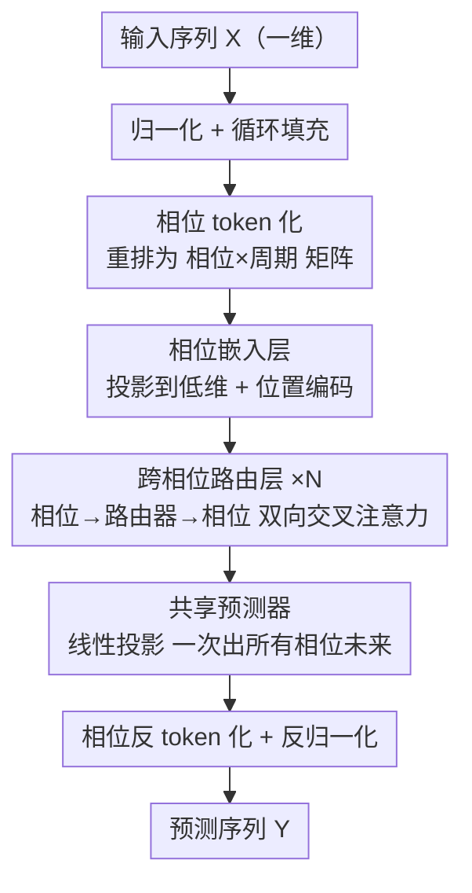

# PhaseFormer: From Patches to Phases for Efficient and Effective Time Series Forecasting

**会议**: ICLR 2026  
**OpenReview**: [https://openreview.net/forum?id=Lk9SqMQzhX](https://openreview.net/forum?id=Lk9SqMQzhX)  
**代码**: https://github.com/neumyor/PhaseFormer_TSL  
**领域**: 时间序列预测  
**关键词**: 周期建模、相位 token、轻量预测、路由注意力、效率-效果权衡

## 一句话总结
针对长序列预测中 patch token 因周期模式漂移而导致参数量/算力暴涨的问题，本文换用"相位（phase）视角"——把跨周期同一偏移位置的值聚成 token，证明它比 patch 更平稳、更低维，并据此设计仅约 1k 参数的 PhaseFormer，在七个基准上达到 SOTA 精度的同时把 FLOPs 削减约 99.99%。

## 研究背景与动机

**领域现状**：周期性是时间序列最核心的归纳偏置。近年主流做法（PatchTST、Crossformer 等）把序列切成与周期对齐的 **patch**，再用 Transformer 在 patch token 之间建模周期内/周期间的相关性，确实把预测精度推到了很高的水平。

**现有痛点**：这些 patch 方法在大规模、复杂数据集（Traffic、Electricity）上很难高效扩展——参数量和计算量都很大。作者第一次明确解释了**为什么 patch 级处理天生低效**：真实场景中周期模式（cycle pattern）受外部因素（新建道路、作息调整等）持续漂移，导致同一段周期的 patch 形态在时间轴上不断变化。为了忠实容纳这种被拉宽的分布，模型被迫构造一个高维表示空间，参数量和算力随之膨胀；而且对训练分布外的样本泛化也差。

**核心矛盾**：patch token 把"一个完整周期内的相邻观测"打包在一起，于是它**继承了整段周期形态的全部变异性**——周期一旦漂移，patch 表示就跟着漂。效果与效率在这种表示下存在本质冲突。

**本文目标**：找到一种既平稳、又低维的 token 表示，让模型用极小的参数量也能既准又快地预测。

**切入角度**：作者提出**相位视角**——不再看"一个周期内长什么样"，而是看"跨连续周期、相同偏移位置（phase）的值如何随周期数演化"。直觉是：一天中"早高峰这个时刻"的交通流，跨周（跨周期）地看是高度稳定的，远比"一整段早高峰曲线的形状"稳定。

**核心 idea**：用 **phase token 代替 patch token** 来刻画周期，把"逐步预测"重写成"逐相位预测"。作者用真实数据验证了相位 token 的两个关键性质（全局平稳 + 低维），并辅以扰动理论证明其在周期漂移下结构不变，从而为极致轻量的建模提供依据。

## 方法详解

### 整体框架

PhaseFormer 采用 channel-independent 范式（逐变量独立处理，省略通道维）。给定输入序列 $X\in\mathbb{R}^{L_{in}}$，目标是预测未来 $Y\in\mathbb{R}^{L_{out}}$。整条 pipeline 的精髓是：**先把一维序列重排成"相位×周期"的二维矩阵**，让每一行成为一个跨周期的 phase token；**再在低维空间里用轻量路由（router）让各相位高效互通信息**；**最后用一个所有相位共享的线性预测器一次性输出所有相位的未来**，最终反变换回一维序列。因为相位空间本身低维平稳，路由器数 $M$ 和隐维 $d$ 都能取很小的固定值，整体参数量被压到约 1k。

### 关键设计

**1. 相位 token 化：把跨周期同偏移的值聚成平稳低维 token**

这是全文的根基，针对的正是"patch 继承整段周期变异性"的痛点。设周期长度为 $L_{phase}$（由频域分析自动估计，全程固定）。为保证输入长度是 $L_{phase}$ 的整数倍，先把序列循环填充到 $P_{in}\cdot L_{phase}$，其中 $P_{in}=\lceil L_{in}/L_{phase}\rceil$；再 reshape 成相位-周期矩阵 $X_{phase}\in\mathbb{R}^{L_{phase}\times P_{in}}$，其中 $X_{phase}[\ell,p]$ 是第 $p$ 个周期里第 $\ell$ 个相位的观测。这样**每一行（一个 phase token）记录的是"同一时刻随周期数的演化"**，而不是"一段周期的形状"。

作者用真实数据给出两条洞察来支撑这个选择。**洞察一（全局平稳 vs 局部平稳）**：t-SNE 显示 patch token 分布随时间持续漂移、只有局部连贯性，而 phase token 形成紧致、长期稳定的簇。用最大均值差异 $\mathrm{MMD}^2(P,Q)=\mathbb{E}_{x,x'\sim P}[k(x,x')]+\mathbb{E}_{y,y'\sim Q}[k(y,y')]-2\,\mathbb{E}_{x\sim P,y\sim Q}[k(x,y)]$（$k$ 为 RBF 核）度量不同周（不同周期）之间的分布差异，相位空间的平均 MMD 远小于 patch 空间——分布更接近、更易跨时间泛化。**洞察二（低维子空间）**：PCA 显示仅 2 个主成分就能解释 phase token 90% 以上方差，而 patch token 需要 11 维以上。作者还用扰动理论给出 Theorem 1：在周期模式变换 $S$ 下，相位 token 化对应的子空间结构**近似不变**（无噪时精确不变），而 patch token 化存在不消失的结构偏移。正是这种"平稳 + 低维"让后续模块可以用极小的 $M$、$d$ 工作。

**2. 跨相位路由层：用少量 router 把 $O(L_{phase}^2)$ 自注意力压成线性**

直接对所有 phase token 做完整成对自注意力代价高。本设计针对"相位空间本就低维"这一性质，引入一组可学习的路由器 $R\in\mathbb{R}^{M\times d}$（$M$ 远小于相位数）作为信息中转站，把交互拆成两步交叉注意力。**相位→路由器聚合**：路由器作 query、相位作 key/value，$Q_r=RW^{agg}_Q,\;K_z=\tilde{Z}W^{agg}_K,\;V_z=\tilde{Z}W^{agg}_V$，经多头注意力得到上下文化的路由器 $H=\mathrm{MHA}(Q_r,K_z,V_z)$，把分散在各相位的信息**选择性压缩**进紧凑的路由器。**路由器→相位分发**：反过来相位作 query、路由器作 key/value，$Q_z=\tilde{Z}W^{dist}_Q,\;K_r=HW^{dist}_K,\;V_r=HW^{dist}_V$，$Z_{attn}=\mathrm{MHA}(Q_z,K_r,V_r)$，把聚合后的跨相位信息再**选择性回灌**到每个相位。两步串起来，每个相位都通过路由器这条"双跳"通路间接关注到其它所有相位，既恢复了相位级分辨率又强制了跨相位一致性。这与 Perceiver / Crossformer 的 router 思路同源，但本文的贡献在于**显式利用相位对齐 token 的低秩结构**——因为相位空间低维，少量路由器就够，从而把自注意力的二次成本降为随序列长度线性。消融证明它比 FullAttention 更准且更省，比 LinearMixing / 直接预测都明显更好。

**3. 相位嵌入 + 共享预测器：低维投影去噪、跨相位共享参数做正则**

嵌入层把每个 phase token $X_{phase}[\ell,:]$ 经线性映射 $f_\theta$（$\theta\in\mathbb{R}^{P_{in}\times d}$）投到 $d$ 维：$Z=f_\theta(X_{phase})\in\mathbb{R}^{L_{phase}\times d}$，在低维空间提取被扰动污染的原始观测里的有效成分；再加可学习相位位置编码 $\tilde{Z}=Z+E_{pos}$ 以区分相位顺序。预测端则是一个所有相位**共享参数**的线性映射 $g_\phi$（$\phi\in\mathbb{R}^{d\times P_{out}}$），$Y_{phase}=g_\phi(Z_{attn})\in\mathbb{R}^{L_{phase}\times P_{out}}$，一次性输出所有相位的多步未来，最后反 token 化 + 反归一化得到 $Y$。共享预测器一方面把可训练参数压到最低，另一方面强制各相位预测一致、起到正则作用、提升泛化——这正是模型只需约 1k 参数的关键之一。

### 复杂度
PhaseFormer 的端到端时间复杂度为 $O\big(N\,((L_{phase}+M)d^2+ML_{phase}d)+d(L_{in}+L_{out})\big)$，其中 $N$ 为路由层数。由于相位空间低维使 $M$、$d$ 可取小的固定值，计算量随输入长度 $L_{in}$ 与预测长度 $L_{out}$ **线性增长**，而非 patch 自注意力的二次增长。

## 实验关键数据

### 主实验
七个长期预测基准（ETTh1/h2、ETTm1/m2、Weather、Electricity、Traffic），输入长度固定 720，结果为预测步长 $\{96,192,336,720\}$ 的平均（MSE / MAE，越低越好）：

| 数据集 | PhaseFormer | PatchTST | Crossformer | TimeBase | SparseTSF | FITS |
|--------|-------------|----------|-------------|----------|-----------|------|
| ETTh1 | **0.403 / 0.415** | 0.420 / 0.439 | 0.517 / 0.512 | 0.404 / 0.416 | 0.406 / 0.418 | 0.419 / 0.435 |
| ETTm1 | **0.346 / 0.374** | 0.354 / 0.383 | 0.390 / 0.417 | 0.356 / 0.380 | 0.362 / 0.383 | 0.359 / 0.382 |
| Electricity | **0.160 / 0.250** | 0.169 / 0.265 | 0.180 / 0.273 | 0.167 / 0.258 | 0.168 / 0.263 | 0.172 / 0.270 |
| Traffic | **0.386 / 0.249** | 0.394 / 0.266 | 0.545 / 0.282 | 0.418 / 0.278 | 0.413 / 0.280 | 0.421 / 0.298 |
| Weather | **0.223 / 0.260** | 0.223 / 0.264 | 0.255 / 0.304 | 0.227 / 0.262 | 0.243 / 0.285 | 0.241 / 0.283 |

PhaseFormer 在几乎所有数据集上取得最优或并列最优，复杂大数据集上提升尤为明显：在最大的 Traffic 上比次优 PatchTST 高 6.3%、比 TimeBase 高 10.4%。唯一例外是 ETTh2（0.346/0.388），略逊于 FITS（0.334/0.382）但仍极具竞争力。效率上，在 Traffic 上 PhaseFormer 相对 PatchTST / Crossformer 实现约 **99.99% 的 FLOPs 削减**，且优于同样轻量的 SparseTSF——既准又省。

### 消融实验
跨相位路由层消融（每格 MSE / MAE / FLOPs(M)）：

| 配置 | Weather | Electricity | Traffic |
|------|---------|-------------|---------|
| PhaseFormer（路由） | **0.1503 / 0.1971** / 3.12 | **0.1290 / 0.2209** / 42.2 | **0.3721 / 0.2475** / 113.4 |
| w/ FullAttention | 0.1527 / 0.2005 / 3.20 | 0.1295 / 0.2217 / 49.0 | 0.3791 / 0.2513 / 131.5 |
| w/ LinearMixing | 0.1700 / 0.2226 / 0.92 | 0.1403 / 0.2334 / 14.1 | 0.3842 / 0.2532 / 37.8 |
| w/o Routing（各相位独立预测） | 0.1907 / 0.2406 / 0.78 | 0.1423 / 0.2365 / 12.0 | 0.3892 / 0.2584 / 32.1 |

### 关键发现
- **路由层是精度核心**：去掉路由（w/o Routing）三个数据集都明显掉点，说明显式跨相位交互对建模周期动态不可或缺；用线性混合（LinearMixing）替代也不如路由。
- **路由比全注意力更优**：PhaseFormer 不仅 FLOPs 比 FullAttention 更低，MSE/MAE 还更好——在低维相位空间里，少量路由器把有效交互"浓缩"得更干净，全注意力反而引入冗余。
- **路由器极少即够**：最佳 $M\in\{4,8\}$，远小于相位数 $L_{phase}=24$，直接印证相位空间的低维本质。
- **相位长度要对准主周期**：Traffic 上 $L_{phase}=24$（频谱主成分）最优（MSE 0.3619），偏离主周期（12/8/28/21）误差递增——选错谐波仍能跑但预测变差，这是主要失效模式。
- **可解释性**：case study 显示相邻相位被分到相似路由器、注意力呈局部相似性；不同相位（如 Phase 5 长期平稳、Phase 9/1 呈相反趋势的 7 天周期）被路由器有效区分。

## 亮点与洞察
- **"换 token 视角"而非"加模块"**：本文最妙的不是网络结构，而是把建模对象从 patch 换成 phase——同一份数据，换个聚合方式，平稳性和维度天差地别。这提醒我们：表示的归纳偏置往往比模型容量更值钱。
- **用真实数据 + 扰动理论双重论证**：t-SNE/MMD/PCA 给经验证据，Theorem 1 给"周期漂移下相位子空间结构不变"的理论保证，把"为什么 phase 比 patch 好"讲透，而不是只甩 SOTA 数字。
- **约 1k 参数达 SOTA**：低维平稳表示 + 共享预测器 + 路由器，三者叠加把参数压到极致，对资源受限场景（边缘/IoT）极有价值。
- **路由器数 ≪ 相位数 的可迁移启示**：当某种 token 表示被证明低维时，"少量 latent bottleneck + 双向交叉注意力"是把二次注意力降为线性的通用 trick，可迁移到其它低秩结构的序列任务。

## 局限与展望
- **依赖明确主周期**：弱周期/无主导周期时，自动估计的相位长度易受噪声或次谐波干扰导致相位错位（作者明确承认的主要失效模式）；多周期下若对齐到次优谐波，预测会变差。作者称此时相位表示会退化为粗尺度下采样、仍有一定鲁棒性，但精度无保证。
- **填充伪影**：循环填充要求输入长度被 $L_{phase}$ 整除，相位长度过大/过小会引入大量 padding，制造边界伪影、损害预测；实践中建议输入长度尽量可被相位长度整除。
- **自己的观察**：channel-independent 假设忽略了变量间依赖，对强空间相关的数据（如多传感器交通网）可能不是最优；相位长度由频域分析"先验固定"，对周期随时间变化（如季节性切换）的序列适应性存疑，可考虑自适应/多相位长度联合建模。

## 相关工作与启发
- **vs PatchTST / Crossformer**: 它们以 patch 为 token，继承整段周期形态的变异性，需高维空间容纳漂移，参数/算力大；本文以 phase 为 token，平稳低维，参数削减 >99.9% 还更准。
- **vs SparseTSF**: 同为 phase-based 思路（重视跨周期相关），但 SparseTSF 在大复杂数据集上精度不足；PhaseFormer 用跨相位路由显式建模相位间交互，在 Traffic/Electricity 上明显更准。
- **vs TimeBase**: TimeBase 融合 patch 与 phase 两种范式；本文纯走 phase 并给出系统的"为什么 phase 行"分析（平稳性 + 低维 + 扰动稳定性），在大数据集上反超 TimeBase 10.4%。
- **vs FITS**: FITS 在频域用约 10k 参数取得强精度；PhaseFormer 在时域用约 1k 参数达到相当甚至更好的整体表现，ETTh2 上仍略逊 FITS。

## 评分
- 新颖性: ⭐⭐⭐⭐⭐ 首次系统论证 patch 低效根因并提出 phase 视角，理论 + 经验双支撑
- 实验充分度: ⭐⭐⭐⭐ 七基准 + 八 baseline + 路由/路由器数/相位长度多维消融，但多为标准长期预测设定
- 写作质量: ⭐⭐⭐⭐⭐ 动机推导清晰，洞察可视化到位，方法与复杂度交代完整
- 价值: ⭐⭐⭐⭐⭐ 约 1k 参数达 SOTA，为真正高效且有效的时序预测提供了新范式

<!-- RELATED:START -->

## 相关论文

- [\[ICLR 2026\] Efficient Autoregressive Inference for Transformer Probabilistic Models](efficient_autoregressive_inference_for_transformer_probabilistic_models.md)
- [\[ICML 2025\] TQNet: Temporal Query Network for Efficient Multivariate Time Series Forecasting](../../ICML2025/time_series/temporal_query_network_for_efficient_multivariate_time_series_forecasting.md)
- [\[ICML 2025\] IMTS is Worth Time × Channel Patches: Visual Masked Autoencoders for Irregular Multivariate Time Series Prediction](../../ICML2025/time_series/imts_is_worth_time_times_channel_patches_visual_masked_autoencoders_for_irregula.md)
- [\[ICML 2026\] U-Cast: A Surprisingly Simple and Efficient Frontier Probabilistic AI Weather Forecasting](../../ICML2026/time_series/u-cast_a_surprisingly_simple_and_efficient_frontier_probabilistic_ai_weather_for.md)
- [\[ICLR 2026\] ResCP: Reservoir Conformal Prediction for Time Series Forecasting](rescp_reservoir_conformal_prediction_for_time_series_forecasting.md)

<!-- RELATED:END -->
