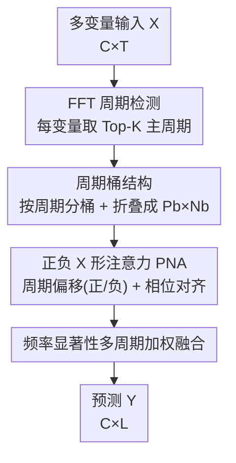

# PHAT: Modeling Period Heterogeneity for Multivariate Time Series Forecasting

**会议**: ICLR 2026  
**OpenReview**: [https://openreview.net/forum?id=lr4RlISR6x](https://openreview.net/forum?id=lr4RlISR6x)  
**代码**: 已开源（论文称源码在 GitHub，仓库地址待确认）  
**领域**: 时间序列预测  
**关键词**: 多变量时序预测、周期异质性、周期桶、正负注意力、频域分析

## 一句话总结
PHAT 指出真实多变量时序里不同变量的周期长度各不相同且会动态变化（周期异质性），它先用 FFT 把变量按主周期分到不同「周期桶」并折叠成相位对齐的二维张量，再用一种带正负分解和周期调制项的「X 形」自注意力建模周期依赖，最后按频率显著性对多个周期分量加权融合，在 14 个真实数据集、18 个 baseline 上拿下约 74% 指标的 SOTA，同时参数量和计算量比 Transformer 类方法低一个数量级以上。

## 研究背景与动机

**领域现状**：周期性是时间序列最重要的内在结构之一，因此近年的多变量时序预测（MTS forecasting）几乎都把「把周期建模好」当成提点的关键。主流做法分三类：改 Transformer 架构去捕捉长程依赖（Autoformer、FEDformer、PatchTST）、做季节-趋势分解后用并行子网络分别建模（DLinear、xPatch），以及借助 FFT 等频域工具显式识别周期（TimesNet、FITS）。

**现有痛点**：这些方法几乎都隐含了一个「单一、静态、共享周期」的假设——把所有变量当成可互换的通道，统一做 pooling 或自适应融合后再建模周期。但作者在 ZafNoo 等数据集上用自相关函数（ACF）+ Bartlett 检验直接可视化发现：同一份数据里三个变量的显著周期长度可以完全不同（如一个按天、一个按周、一个按年）。把这些差异巨大的周期强行塞进统一框架，模型会学到虚假的时间动态。这就是论文反复强调的**周期异质性（period heterogeneity）**。

**核心矛盾**：还有一个被忽视的问题——标准自注意力在 softmax 归一化时会放大正相关、压制负相关，但周期信号天然包含「反相位/互补」的负相关结构（如相位差半个周期的两点往往强负相关），这些负相关恰恰携带了系统动力学的关键信息，却被现有注意力机制丢掉了。

**本文目标**：① 放松单周期假设，让模型能同时处理一份数据里多种异质周期；② 让注意力机制既能建模正相关、又能显式表达负相关的周期依赖。

**核心 idea**：用「周期桶 + 正负 X 形注意力」替代「统一 pooling + 普通自注意力」——先按周期长度把变量分桶隔离、桶内折叠成相位对齐的二维结构，再用一种把周期偏移注意力拆成正/负两路、并用周期距离调制其权重的注意力，忠实地刻画周期趋势。

## 方法详解

### 整体框架
PHAT 输入是过去 $T$ 步的多变量序列 $X \in \mathbb{R}^{C\times T}$，输出未来 $L$ 步 $Y \in \mathbb{R}^{C\times L}$。整条流水线是「检测周期 → 按周期分桶并折叠 → 桶内做正负注意力 → 按频率显著性融合预测」四步串行：先对每个变量做 FFT 取 Top-K 主频换算成离散周期长度；按周期长度把变量分到不同桶，桶内每条序列折叠成 $P_b\times N_b$ 的二维张量（行是同一周期内的相位偏移、列是跨周期的同相位点）；只在桶内做变量交互、桶间用掩码隔开，避免异质周期互相干扰；每个桶内用 PNA（正负 X 形注意力）建模周期依赖；最后对一个变量所属的多个桶的输出，按各周期的频谱幅值做加权融合，得到最终预测。

### 关键设计

**1. 周期桶结构：按周期长度把变量分桶隔离，再折叠成相位对齐的二维张量**

这一设计直接针对「周期异质性」痛点。先对输入做 FFT，保留 Top-K 个显著频率并换算成离散周期长度 $P = \lfloor T/\arg\text{TopK}[|\text{FFT}(X)|] + 0.5\rfloor \in \mathbb{N}^{K\times C}$。然后分两步重构序列：**Bucketing（分桶）**——把 $K\times C$ 个周期去重后得到 $N$ 个不同值，每个周期长度 $P_i$ 建一个桶 $\mathcal{B}_i$，把主周期为 $P_i$ 的变量放进去；由于一个变量可能有多个周期，桶之间并非互斥（同一变量可进多个桶），另外单设一个 Bucket-0 收纳无显著周期的变量。**Folding（折叠）**——对桶 $b$ 内变量 $j$ 的序列，先用线性层对齐到未来窗口 $X_j\to X_j\in\mathbb{R}^{L\times d}$，再按周期长度 $P_b$ 切成 $N_b=\lfloor L/P_b\rfloor$ 个片段（不整除时零填充），unflatten 成 $\bar{X}^{(b)}\in\mathbb{R}^{|\mathcal{B}_b|\times P_b\times N_b}$。这个三维结构的精妙之处在于三个维度各有语义：第一维是周期同质的变量、第二维是同一周期内的相位偏移、第三维是跨周期的同相位点。之后只在桶内做变量交互 $Z^{(b)}=(\bar{X}^{(b)\top}W_i+b_i)$，桶间连接被掩码切断。这样异质周期被物理隔离，每个桶里都是「干净」的单一周期，模型不会再被其他周期的信号干扰。

**2. 正负 X 形注意力（PNA）：把周期偏移注意力拆成正/负两路并用周期距离调制，显式表达反相位依赖**

普通自注意力允许 token 无约束交互、且压制负相关，对周期结构是次优的。PNA 有三个要点。**X 形感受野**：注意力只沿桶张量 $Z^{(b)}\in\mathbb{R}^{P_b\times N_b\times d_h}$ 的行与列分配，形成以目标点为中心的十字（X 形）感受野，从而把「跨周期的相位对齐关系」（period-aligned $\tilde{A}$）和「同周期内的相位偏移关系」（period-offset $A$）显式分开。**正负解耦**：用两套 query/key 分别算正 logit $\zeta=\mu Q_1\times_1 K_1^\top$ 和负 logit $\eta=\mu Q_2\times_1 K_2^\top$（$\mu=d^{-1/2}$），各自 softmax 后融合成 $A=\text{Softmax}(\tilde\zeta)-\Lambda\odot\text{Softmax}(\tilde\eta)$，其中 $\Lambda$ 是 sigmoid 学到的强度滤波，负分支被显式地减去，从而保留反相位的负相关。**周期归纳偏置**：对正/负 logit 各加一个周期调制项——正调制项 $\tilde\zeta[m,n]=\zeta[m,n]-\sum_{s\in\Delta_{m,n}^{(b)}}\text{Softplus}(\zeta[m,s])$ 聚合了所有比 $(m,n)$ 周期距离更近的点，使权重随周期距离单调衰减；负调制项对称地聚合更远的点。周期距离定义为 $\delta_{ij}^b=\min\{(i-j)\bmod B_b,\,(j-i)\bmod B_b\}$。论文给出数学解释（附录 C.2）证明该性质：周期相对距离越大，正相关系数越小、负相关系数越大，正好符合周期信号「半周期处强负相关」的直觉。由于 $A$ 的行和 $\sum_j A[i,j,n]=1-\Lambda<1$ 不严格归一，再注入残差强度 $\Lambda_h$ 的残差路径稳住信息流，并用 Dynamic Tanh 消除数值不稳定。相位对齐注意力 $\tilde{A}=\text{Softmax}(\mu Q_1\times_2 K_1^\top)$ 复用正分支的 Q/K，捕捉同相位跨周期的强相关。

**3. 基于频率显著性的多周期加权融合：让一个变量的多个周期解释按其频谱强度投票**

因为一个变量可能进多个桶（有多个周期），需要把这些桶的输出融合成一条预测。先把桶输出 $\bar{Z}^{(b)}\in\mathbb{R}^{P_b\times N_b\times d}$ 展平、截掉零填充、再线性对齐回桶内原变量数 $\tilde{Z}^{(b)}\in\mathbb{R}^{|\mathcal{B}_b|\times L}$。对第 $c$ 个变量，找出它所属的 $K_c$ 个桶，按权重 $\hat{Y}_c=\sum_{b=1}^{K_c}\alpha_c^{(b)}\tilde{Z}_c^{(b)}$ 融合，其中权重 $\alpha_c^{(b)}=\text{Avg}(\text{Softmax}(|\beta_c^{(b)}|))$ 由该周期对应的频谱幅值 $\beta_c^{(b)}=\text{Extract}(\text{FFT}(X_c^{(b)}))$ 决定。直觉是：哪个周期在频域里能量越强、越显著，它对应的桶解释就越可信，权重就越大。这让模型在多周期共存时自动突出主导周期、抑制次要周期带来的噪声。

### 损失函数 / 训练策略
用 Adam 优化，MSE/MAE 作为评测指标（A100 80GB、PyTorch）。回看窗口 $T$ 当作可调超参并报告最优结果；小数据集（<5000 样本）$T\in\{36,104\}$、预测长度 $L\in\{24,36,48,60\}$，大数据集 $T\in\{96,336,512\}$、$L\in\{96,192,336,720\}$。实验关闭了 "Drop Last" 批采样以保证评测公平。

## 实验关键数据

### 主实验
在 14 个真实数据集（NN5、Exchange、FRED-MD、ETTh1/2、ETTm1/2、AQShunyi、AQWan、ILI、CzeLan、ZafNoo、NASDAQ、NYSE）+ 1 个合成数据集上对比 18 个 baseline。PHAT 在约 **73.95%（71/96）** 的指标上取得 SOTA，84.38% 的指标进前二；在 NYSE 上 MSE 最多提升 23.33%。下表节选部分代表性结果（平均 MSE/MAE）：

| 数据集/horizon | 指标 | PHAT | TimeKAN | xPatch | CycleNet | iTransformer |
|--------|------|------|---------|--------|----------|--------------|
| ETTh-96 | MSE | **0.316** | 0.324 | 0.327 | 0.327 | 0.342 |
| NN5-24 | MSE | **0.681** | 0.769 | 0.853 | 0.754 | 0.727 |
| ILI-24 | MSE | **1.318** | 2.176 | 2.320 | 2.195 | 1.783 |
| NASDAQ-24 | MSE | **0.416** | 0.541 | 0.503 | 0.631 | 0.570 |
| NYSE-24 | MSE | **0.161** | 0.224 | 0.210 | 0.237 | 0.225 |

整体「Top1 命中数」PHAT 为 71，远高于第二名 PDF 的 9 和 TimeKAN 的 6；「Top2 命中数」81，同样领先。可以看到在周期异质性强、预测难度大的金融（NASDAQ/NYSE）和健康（ILI）数据集上优势尤其明显。

### 消融实验

| 配置 | 说明 | 现象 |
|------|------|------|
| Full（PHAT） | 完整模型 | 最优 |
| w/o Bucket | 去掉周期分桶，各变量独立 | 误差显著增大，证明隔离异质周期的必要性 |
| w/o POA | 去掉周期偏移注意力 | 预测性能极差，掉点最猛 |
| w/o PAA | 去掉相位对齐注意力 | 明显变差，弱周期数据（NN5、CzeLan）上尤甚 |
| w/o Attn | 整个自注意力退化为前馈网络 | 大幅退化 |

### 关键发现
- **周期偏移注意力（POA）贡献最大**：去掉后性能「极差」，说明把周期依赖拆成正负两路、并用周期距离调制是 PHAT 提点的核心。
- **分桶是周期异质性的关键**：w/o Bucket 误差显著上升，印证了「把异质周期变量混在一起做交互会增加建模难度」这一动机。
- **相位对齐注意力对弱周期数据更重要**：在 NN5、CzeLan 这类周期性较弱的数据上，跨周期同相位的同步信号是重要补充。
- **超参敏感性**：PNA 层数只需 1-2 层即达最优，加深反而因过拟合掉点；周期数 $K$ 在简单周期数据上 $K=1$ 即够，过多周期反而引入噪声。
- **计算效率突出**：注意力复杂度随检测到的周期长度平方增长（而非全序列长度），ETTm1（L=96）上 PHAT 仅 33.4K 参数、2.9M MACs，比 PatchTST/PDF 等 Transformer 类方法参数少一个数量级以上、MACs/FLOPs 降低超 98%，即便对比轻量的 TimeKAN 参数也再降最多 91.27%，且仍保留 Transformer 风格主干。

## 亮点与洞察
- **「周期异质性」这个问题切得准**：用 ACF + Bartlett 检验把「同一数据里变量周期各不相同」可视化出来，把一个被普遍忽视、却很真实的痛点立住了，动机扎实而非凭空。
- **把负相关请回注意力**：指出 softmax 注意力天然压制负相关、丢掉了周期信号里的反相位信息，并用「正分支减负分支 + 周期距离调制」显式建模，是一个有数学支撑、可迁移到其他带对称/反相位结构信号（如音频、振动）的设计。
- **折叠张量三维语义清晰**：把一维序列折叠成「变量×相位偏移×同相位」的三维结构，让注意力天然对齐到周期网格上，这种「用数据重排把归纳偏置塞进结构」的思路很值得借鉴。
- **效率反直觉地好**：复杂度挂在周期长度而非序列长度上，使得长序列也便宜——这在「Transformer 慢」的刻板印象下是一个亮眼的工程收益。

## 局限与展望
- **依赖 FFT 周期检测的准确性**：周期桶的质量完全取决于 FFT + Top-K 选出的周期是否靠谱，对非平稳、周期漂移剧烈或噪声大的序列，周期估计偏差会直接污染分桶。
- **桶可重叠但管理成本未充分讨论**：一个变量进多个桶在变量数大、周期多时会带来计算与内存开销，论文对极端多周期场景的可扩展性着墨不多。
- **Bucket-0 处理略粗**：无周期变量退化为绝对距离注意力，对「弱周期但非无周期」的边界变量如何归类缺乏更细致的策略。
- **超参 $T$ 调优**：回看窗口当可调超参并报告最优，虽有固定长度对比（附录 D.3），但仍可能高估实际部署表现。
- 可改进方向：把周期检测做成可学习/可微的（替代离散 FFT Top-K），或引入随时间动态更新分桶的机制以应对周期漂移。

## 相关工作与启发
- **vs 统一周期建模（CycleNet / TimesNet / FEDformer）**：它们假设所有变量共享同一（组）周期、统一 pooling 或频域建模；PHAT 放松单周期假设、按变量周期分桶隔离，专门解决周期异质性，这是核心区别与优势。
- **vs 季节-趋势分解类（xPatch / DLinear）**：分解类把序列拆成季节+趋势分量分别建模；PHAT 不做显式分解，而是用周期桶 + 正负注意力直接在折叠张量上建模周期依赖，且显式保留负相关。
- **vs 普通 Transformer 注意力（PatchTST / iTransformer）**：标准注意力压制负相关、无周期归纳偏置；PNA 用正负解耦 + 周期距离调制注入强周期先验，并把复杂度从序列长度降到周期长度量级，精度更高、计算更省。

## 评分
- 新颖性: ⭐⭐⭐⭐⭐ 第一个明确建模周期异质性的方法，周期桶 + 正负 X 形注意力两个设计都新颖且有数学支撑
- 实验充分度: ⭐⭐⭐⭐⭐ 14 真实+1 合成数据集、18 个 baseline、含消融/超参/复杂度全套对比
- 写作质量: ⭐⭐⭐⭐ 动机和方法讲得清楚，但 PNA 公式密度高、部分符号细节需对照附录
- 价值: ⭐⭐⭐⭐⭐ 在精度领先的同时把参数/算力降一个数量级以上，兼具学术新意与实用性

<!-- RELATED:START -->

## 相关论文

- [\[ICLR 2026\] Are Global Dependencies Necessary? Scalable Time Series Forecasting via Local Cross-Variate Modeling](are_global_dependencies_necessary_scalable_time_series_forecasting_via_local_cro.md)
- [\[ICLR 2026\] Towards Robust Real-World Multivariate Time Series Forecasting: A Unified Framework](towards_robust_real-world_multivariate_time_series_forecasting_a_unified_framewo.md)
- [\[ICLR 2026\] CPiRi: Channel Permutation-Invariant Relational Interaction for Multivariate Time Series Forecasting](cpiri_channel_permutation-invariant_relational_interaction_for_multivariate_time_se.md)
- [\[ICLR 2026\] MixLinear: Extreme Low Resource Multivariate Time Series Forecasting with 0.1K Parameters](mixlinear_extreme_low_resource_multivariate_time_series_forecasting_with_01k_par.md)
- [\[ICLR 2026\] Learning Recursive Multi-Scale Representations for Irregular Multivariate Time Series Forecasting](learning_recursive_multi-scale_representations_for_irregular_multivariate_time_s.md)

<!-- RELATED:END -->
