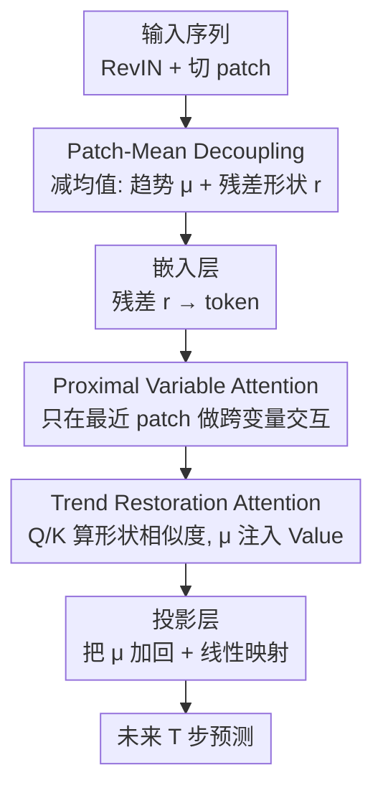

# PMDformer: Patch-Mean Decoupling Information Transformer for Long-term Forecasting

**会议**: ICLR 2026  
**OpenReview**: [https://openreview.net/forum?id=rfJ41gK9Ct](https://openreview.net/forum?id=rfJ41gK9Ct)  
**代码**: https://github.com/aohu1105/PMDformer  
**领域**: 时间序列预测 / Transformer  
**关键词**: 长期时序预测, patch 注意力, 形状相似度, 跨变量建模, 趋势-残差解耦

## 一句话总结
PMDformer 指出 patch 之间真正的"形状相似度"会被各 patch 不同的数值尺度（均值）淹没，于是用"减去每个 patch 均值"把趋势和残差形状显式拆开，再用近端变量注意力（只在最近一个 patch 上做跨变量交互）和趋势复原注意力（把均值注回 Value 通道）把局部形状与全局趋势重新缝合，在 8 个 LTSF 基准上以更稳更准的成绩刷过一众 SOTA。

## 研究背景与动机

**领域现状**：长期时间序列预测（LTSF）目前的主流是 Transformer + patch 的范式——把一维序列切成若干 patch、当成 token 序列喂给注意力，靠 patch 内的局部语义和 patch 间的注意力来捕捉长程依赖（PatchTST、Pathformer、TimeBase 等都是这条路）。其中又分变量独立（VI，每个变量单独建模）和变量相关（VD，建模变量间交互）两派，但 VD 至今没能稳定打过 VI。

**现有痛点**：时间序列不像图像有固定空间结构，它本质是一维曲线，预测的关键在于识别 patch 之间、变量之间的**形状相似度**（比如两段都是相近斜率的缓慢上升）。但时序是非平稳的，不同 patch 的数值尺度（均值、幅度）剧烈漂移。论文 Figure 1 给出了一个扎心的例子：P1 和 P2 形状明明更像，但因为尺度差异，注意力却把更高的权重给了形状不像的 (P1, P3)。也就是说，**尺度差异在冒充形状相似度**，让模型学到错误的相似关系，跨变量建模时这个偏差更严重。

**核心矛盾**：要去掉尺度偏差，自然想到归一化。但现有的 Patch Normalization（如 SAN）用的是 Z-score——减均值再除以标准差。除标准差这一步会把 patch 的原始幅度也抹平，等于**连形状本身一起破坏了**。于是陷入两难：不归一化，尺度偏差污染注意力；做标准归一化，又把要保护的形状信息洗掉了。

**本文目标**：在去掉尺度偏差的同时保住形状结构；并且让被拆掉的全局趋势不至于丢失；还要让跨变量交互只聚焦真正有用的近期相关性。

**切入角度**：作者的观察是——破坏形状的元凶其实只是"除以标准差"那一步。如果只**减均值、不除标准差**，就能把"长程趋势"（编码在各 patch 均值里）和"残差形状"（去均值后的波形）干净地分开，同时原始幅度变化完整保留。

**核心 idea**：用"减 patch 均值"代替"Z-score 归一化"来解耦趋势与形状（PMD），让注意力只看真正的形状相似度；再把解耦掉的均值通过 TRA 注回 Value、并在跨变量交互上只盯最近一个 patch（PVA），从而在尺度无偏的前提下同时建好局部形状和全局趋势。

## 方法详解

### 整体框架

PMDformer 要解决的是"尺度偏差污染形状注意力"这一个核心问题，整条流水线就是围绕"先把趋势剥离出去做纯形状匹配、最后再把趋势缝回来"来组织的。给定长度为 $L$、含 $C$ 个变量的输入序列 $X=\{x_t\in\mathbb{R}^C\}_{t=1}^L$，模型要预测未来 $T$ 步 $\hat{Y}$。整体流向是：输入先过 RevIN 做实例归一化，然后切成 $N=\lfloor L/S\rfloor$ 个不重叠的 patch 并执行 **Patch-Mean Decoupling（PMD）**——把每个 patch 拆成均值（趋势 $\mu$）和去均值残差（形状 $r$）两路；残差经嵌入层变成 token 后，先由 **Proximal Variable Attention（PVA）** 只在最近那一个 patch 上做跨变量交互，再由 **Trend Restoration Attention（TRA）** 沿 patch 轴做时序形状注意力、并把均值 $\mu$ 注回 Value 通道；最后投影层把均值再加回来、线性映射出 $T$ 步预测。

### 关键设计

**1. Patch-Mean Decoupling：只减均值不除方差，把趋势剥离又不毁形状**

这是全文的根。针对的痛点很直接——尺度差异让注意力看不见真形状，而 Z-score 归一化又会因为"除标准差"把形状本身也压扁。PMD 的做法是只做减法：对变量 $i$ 的第 $j$ 个 patch $P_j^i\in\mathbb{R}^S$，先算它的时间均值 $\mu_j^i=\frac{1}{S}\sum_{k=1}^S x_{(j-1)S+k}^i$，再得到去均值残差 $r_j^i=P_j^i-\mu_j^i\mathbf{1}_S$。残差被重新中心化到零均值、原始幅度完整保留，随后只把残差经共享线性投影 $WE$ 加位置编码嵌入成 token：$P_j^i:=r_j^iW_E+b_E+z_{p_j}$；而均值 $\mu$ 被单独存下来当作"趋势分量"留待后面复用。

为什么有效，论文还给了理论支撑：把原始 patch 写成 $\tilde{x}=r+\mu\mathbf{1}$ 时，两 token 的注意力 logit 会展开成"均值×均值""均值×残差交叉项""残差×残差"三部分（式 10），前两项完全由尺度（均值）主导，当均值够大时甚至会盖过真正反映形状的残差项（Proposition 1 给了充分条件）。PMD 把 $\mu\mathbf{1}$ 这一项整体扣掉，等于直接消掉了 logit 里所有依赖均值的污染项，只留下 $r^\top M r$ 这个纯形状相似度。和 SAN 这类"减均值再除方差"的归一化相比，PMD 保住了振幅、维持了内在形状结构，这正是它能让注意力对齐 (P1, P2) 而非 (P1, P3) 的原因。

**2. Proximal Variable Attention：跨变量只盯最近一个 patch，砍掉过时相关性**

这一支针对的是 VD 方法的老毛病：现有跨变量建模（如 iTransformer、ModernTCN）习惯在整段历史窗口上算变量间交互，但变量间的相关性本身是非平稳、随时间演化的（金融市场里资产相关性常在危机时骤升），用整段历史去算，等于把大量过时、弱相关甚至虚假的耦合当成信号，既引入噪声又容易过拟合。PVA 的对策是只在**最近一个（最近端）patch** 上做跨变量自注意力：取所有 $C$ 个变量在第 $N$ 个 patch 上的 token $P_N=\{P_N^1,\dots,P_N^C\}$，对这一组做多头自注意力加 FFN（式 4-5），$\hat{P}_N=\text{LayerNorm}(\text{MHSA}(P_N)+P_N)$，再过 FFN；而历史 patch $\{1,\dots,N-1\}$ 的 token 维持 PMD 原样不动，之后再沿 patch 维拼回完整序列 $P\in\mathbb{R}^{C\times N\times d}$。

这样做有双重好处：一是鲁棒性——只看离预测最近、最具预测力的那段交互，避开历史漂移带来的虚假长程耦合；二是效率——把跨变量注意力的复杂度从 $O(C^2N)$ 降到 $O(C^2)$（变量数多时这很关键，比如 Traffic 有 862 个变量）。参数敏感性实验也佐证了这点：把"最近 $k$ 个 patch"里的 $k$ 从 1 加到 10，MSE 整体随 $k$ 上升、且 $k=1$ 最稳，说明最近端那一个 patch 确实和待预测序列对齐得最好。

**3. Trend Restoration Attention：Q/K 只算形状、把均值注回 Value 通道补回趋势**

PMD 把均值剥掉虽然换来了纯形状匹配，但也顺手抽掉了全局趋势信号，模型有忽略长程依赖的风险。TRA 就是来补这个洞、且要"补趋势又不破坏形状匹配"。它对每个变量独立、沿 patch 轴跑一个参数共享的 Transformer 编码器，关键在于通路分工：Query 和 Key 只作用在形状嵌入上，保证注意力分数 $A=\text{Softmax}(Q^i(K^i)^\top/\sqrt{d})$ 反映的是干净的 patch 间形状相似度（式 6-7）；而**把逐 patch 均值 $\mu^i$ 显式加进 Value 通路** $V^i=P^iW_V+\mu^i$（式 8，广播对齐维度）。这个加法式的趋势注回借鉴了 ResNet 的残差连接思想——让 Q/K 专注细粒度局部形状、V 负责保住全局趋势动态，二者各司其职、互不干扰。

趋势的"复原"还有最后一道工序在投影层：把 TRA 产出的形状 token 在最终线性映射前再把均值加回去 $\hat{Y}^i=(P^i+\mu^i)W_o+b_o$（式 9），确保预测结果在尺度和长程趋势上都和原序列对齐、校准。消融显示这一支不可或缺——把 TRA 换成普通自注意力（丢掉趋势注回）性能明显下降；而且 PVA 必须在 TRA 之前，若先做 TRA 会过早压缩 patch 信息，让后续跨变量建模找不到有意义的依赖（交换顺序也掉点）。

### 损失函数 / 训练策略

输入回看窗口固定 $L=720$，预测长度 $T\in\{96,192,336,720\}$；patch 数 $N$ 按数据集调整，最优 patch size 落在 $\{24,48,72\}$。优化器 Adam，学习率从 $\{2\text{e-}4, 5\text{e-}4, 1\text{e-}3, 1\text{e-}2\}$ 中选，单卡 A100 80GB，PyTorch 实现。

## 实验关键数据

### 主实验

输入窗口 720、在 8 个真实数据集（ECL / Traffic / Weather / Solar / ETTh1 / ETTh2 / ETTm1 / ETTm2）上对比 9 个基线，跨 4 个预测长度取平均。PMDformer 在 8 个数据集里的 7 个上同时拿下最低 MSE 和 MAE（按 1st Count，MSE 第一 32 次、MAE 第一 33 次，远超第二的 TimeBase 7 次 / 4 次）。

| 数据集（Avg） | 指标 | PMDformer | TimeBase(2025) | iTransformer(2024) | PatchTST(2023) |
|--------|------|------|----------|------|------|
| ECL | MSE / MAE | **0.148 / 0.241** | 0.167 / 0.258 | 0.166 / 0.264 | 0.169 / 0.266 |
| Traffic | MSE / MAE | **0.378 / 0.234** | 0.418 / 0.279 | 0.407 / 0.291 | 0.394 / 0.266 |
| Weather | MSE / MAE | **0.217 / 0.251** | 0.219 / 0.263 | 0.233 / 0.273 | 0.224 / 0.264 |
| Solar | MSE / MAE | **0.181 / 0.211** | 0.216 / 0.254 | 0.233 / 0.285 | 0.227 / 0.275 |
| ETTh2 | MSE / MAE | **0.337 / 0.382** | 0.347 / 0.398 | 0.392 / 0.422 | 0.344 / 0.391 |
| ETTm2 | MSE / MAE | **0.246 / 0.304** | 0.253 / 0.317 | 0.279 / 0.338 | 0.251 / 0.319 |

相对提升上，PMDformer 比 TimeBase 平均 MSE 降 5.68%、MAE 降 6.61%；比 TQNet 降 8.62% / 9.96%；比 iTransformer 降 11.44% / 12.38%。作者把优势归因为：TimeBase 的正交 patch 选择为减冗余牺牲了形状相似度；TQNet 的固定周期 query 难应对多样周期；iTransformer 用整段历史的变量 token 交互会过拟合早期弱相关。

### 消融实验

PMD 模块消融（Table 3，五个非平稳基准取平均）验证"只减均值"优于其他归一化：

| 配置 | ETTh2 MSE | Traffic MSE | Solar MSE | 说明 |
|------|---------|---------|---------|------|
| PMDformer（PMD） | **0.337** | **0.378** | **0.181** | 完整，只减均值 |
| w/ stdev（减均值+除方差） | 0.354 | 0.396 | 0.205 | 除方差毁形状，Solar 掉最多 |
| SAN（Scale-Adaptive Norm） | 0.360 | 0.392 | 0.182 | 刚性解耦尺度/残差，泛化更弱 |
| ✗（去掉 PMD） | 0.359 | 0.397 | 0.199 | 尺度偏差污染注意力 |

TRA / PVA 模块消融（Table 4）：

| 配置 | TRA | PVA | ETTh2 MSE | Traffic MSE | Solar MSE |
|------|-----|-----|---------|---------|---------|
| PMDformer | ✓ | Last Token | **0.337** | **0.378** | **0.181** |
| Replace | ✓ | All Token | 0.340 | 0.380 | 0.186 |
| | Self-attn | Last Token | 0.345 | 0.388 | 0.196 |
| Swap Order ⇋ | — | — | 0.342 | 0.379 | 0.188 |
| w/o TRA | ✗ | Last Token | 0.344 | 0.410 | 0.215 |
| w/o PVA | ✓ | ✗ | 0.340 | 0.386 | 0.194 |
| w/o 两者 | ✗ | ✗ | 0.346 | 0.426 | 0.222 |

### 关键发现
- **PMD 是最大功臣**：把"只减均值"换成"减均值+除方差"或换成 SAN 都明显掉点，尤其 Solar 这种强非平稳数据集，验证了"保留振幅/形状"才是关键，而非彻底归一化。
- **趋势注回不可省**：把 TRA 换成普通自注意力（丢掉 $\mu$ 注入 Value）后，Traffic / Solar 掉得最狠（Traffic 0.378→0.410），说明全局趋势必须显式补回。
- **顺序敏感**：PVA 必须先于 TRA；先做 TRA 会过早压缩 patch 信息，让后续跨变量建模失去抓手。
- **超参数**：跨变量只盯 $k=1$ 个最近 patch 最稳，$k$ 增大 MSE 整体上升；patch size 取 $\{24,48,72\}$ 这种中等值最优，过小信息不足、过大 token 太少难捕长程依赖。

## 亮点与洞察
- **"问题出在除标准差"这一刀切得准**：作者没有发明复杂归一化，而是诊断出 Z-score 里"除标准差"才是毁形状的元凶，于是只保留"减均值"。这种"少做一步反而更好"的设计干净利落，且配了 logit 分解的理论说明为什么尺度会污染注意力。
- **趋势-形状的"拆开-缝回"是一条完整闭环**：PMD 拆、TRA 用 Value 通路缝、Projection 再加回，三处协同保证了"既享受纯形状匹配、又不丢全局趋势"，比单纯归一化丢掉趋势的做法更自洽。
- **跨变量"只看最近"既提精度又降复杂度**：把 $O(C^2N)$ 砍到 $O(C^2)$，对 Traffic 这种 862 变量的数据集很实在，而且 $k=1$ 最优这个反直觉结论被参数敏感性实验稳稳支撑——"非平稳下近期相关性最可信"这个洞察可迁移到其他跨变量任务。
- "把被解耦的统计量通过 Value 残差注回注意力"这个 trick 也可借鉴到其他需要解耦后又不想丢信息的场景。

## 局限与展望
- 作者承认的方向：扩展到更高维多变量数据、以及多模态融合（能源/金融/交通等应用）。
- 自己发现的局限：PVA 把跨变量交互硬性限制在最近一个 patch，对那些"长周期变量耦合本身就重要"的场景（如某些季节性强耦合）可能过于激进，论文未讨论这类反例。
- PMD 假定"趋势全编码在 patch 均值里、形状全在残差里"，但 patch 内若同时存在趋势和高频形状，单一均值可能不足以干净分离；对 patch size 的敏感（必须落在中等区间）也暗示这种解耦对切分粒度有依赖。
- 全程固定回看窗口 $L=720$，未报告短回看窗口下 PMD 是否仍稳健。

## 相关工作与启发
- **vs Patch Normalization / SAN**: 它们减均值再除标准差（或自适应学归一化参数），本文只减均值；区别在于是否保留振幅——本文认为除标准差会破坏形状，实验中 SAN 在多数数据集上确实弱于 PMD。
- **vs PatchTST / TimeBase**: 同为 patch-based，PatchTST 用变量独立共享编码器、TimeBase 用正交 patch 减冗余；本文指出后者为减冗余牺牲了形状相似度，PMD 反其道保留形状，平均 MSE 比 TimeBase 低 5.68%。
- **vs iTransformer / ModernTCN（VD 方法）**: 它们在整段历史上算跨变量依赖，易过拟合早期弱相关；本文用 PVA 只聚焦最近 patch，这是 VD 终于能稳定超过 VI 基线的关键。

## 评分
- 新颖性: ⭐⭐⭐⭐ "只减均值不除方差"切口清晰，PVA 的近端聚焦与 TRA 的趋势注回组合自洽，但单个组件都不算颠覆性。
- 实验充分度: ⭐⭐⭐⭐⭐ 8 数据集 × 4 预测长度 × 9 基线，PMD/TRA/PVA 三套消融加顺序、$k$、patch size 敏感性，覆盖很全。
- 写作质量: ⭐⭐⭐⭐ 动机-方法-理论-实验链条完整，Figure 1 的注意力对比很有说服力；个别公式与拼写有小瑕疵。
- 价值: ⭐⭐⭐⭐ 在 LTSF 上稳定 SOTA，PMD 与"近端跨变量注意力"两个洞察可迁移、易复现，对时序社区有实用价值。

<!-- RELATED:START -->

## 相关论文

- [\[AAAI 2026\] CometNet: Contextual Motif-guided Long-term Time Series Forecasting](../../AAAI2026/time_series/cometnet_contextual_motif-guided_long-term_time_series_forecasting.md)
- [\[ICLR 2026\] Routing Channel-Patch Dependencies in Time Series Forecasting with Graph Spectral Decomposition](routing_channel-patch_dependencies_in_time_series_forecasting_with_graph_spectra.md)
- [\[ICLR 2026\] MMPD: Diverse Time Series Forecasting via Multi-Mode Patch Diffusion Loss](mmpd_diverse_time_series_forecasting_via_multi-mode_patch_diffusion_loss.md)
- [\[ICLR 2026\] Efficient Autoregressive Inference for Transformer Probabilistic Models](efficient_autoregressive_inference_for_transformer_probabilistic_models.md)
- [\[ICLR 2026\] Relational Transformer: Toward Zero-Shot Foundation Models for Relational Data](relational_transformer_toward_zero-shot_foundation_models_for_relational_data.md)

<!-- RELATED:END -->
