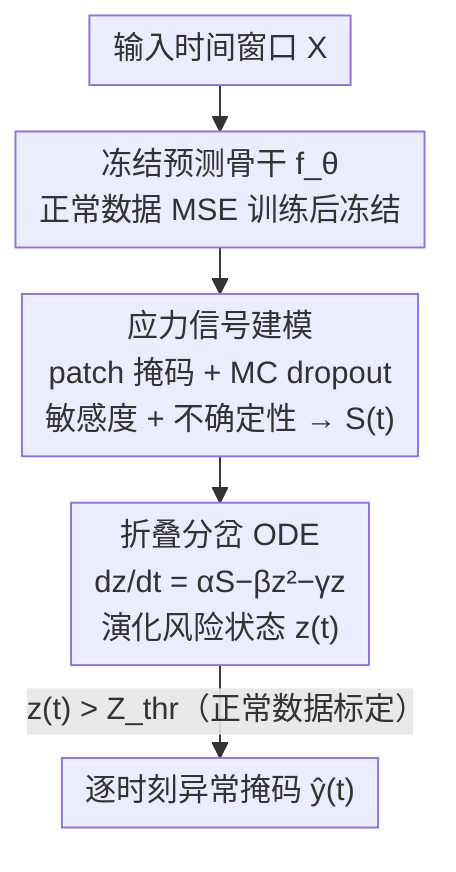

# Point-wise Anomaly Detection via Fold-bifurcation ODE

**会议**: ICLR 2026  
**OpenReview**: [https://openreview.net/forum?id=6dOGGKK0p6](https://openreview.net/forum?id=6dOGGKK0p6)  
**代码**: 待确认  
**领域**: 时间序列异常检测 / 动力系统  
**关键词**: 点级异常检测, 折叠分岔, ODE, 应力信号, 临界转变

## 一句话总结
FOLD 把时间序列异常检测重新表述为「追踪系统离临界转变还有多远」，从一个冻结的预测模型里抽取「敏感度+不确定性」应力信号，注入一个受折叠分岔启发的 ODE 演化出风险状态 $z(t)$，当 $z(t)$ 越过仅在正常数据上标定的阈值就判异常，全程无需异常标签、无需训练检测器，在 40 个 benchmark、对比 34 个 SOTA 时于严格的点级评测下取得最优平均排名。

## 研究背景与动机
**领域现状**：时间序列异常检测目前主流分两大范式——预测式方法（监控预测/重构误差，如 Anomaly Transformer、TranAD）和距离式方法（靠表示学习与嵌入相似度，如 GDN）。它们在常规 benchmark 上都能拿到不错的成绩。

**现有痛点**：这两类方法本质上都只捕捉「突发应力」（sudden stress）——也就是单个时刻上的剧烈偏离。预测式方法盯的是瞬时误差尖峰，距离式方法盯的是嵌入空间里的突变。即便把观测窗口拉长，它们对的仍是「瞬间波动」，而不是「应力如何随时间累积」。

**核心矛盾**：这个缺陷长期被「窗口级评测」掩盖了——只要检测命中落在异常窗口内的任意位置就算对。可一旦换成更严格的「点级评测」（要求每个时刻都精确定位），这些方法的性能就大幅滑坡。很多论文窗口级指标漂亮、点级却崩，根因就是它们没有建模应力的累积过程。而现实世界里大量故障恰恰是应力缓慢累积、把系统推向临界转变后才爆发的。

**本文目标**：用一个统一的动力学框架，同时刻画「缓慢累积」和「短促尖峰」两类异常，并且在严格点级协议下站得住脚，还要做到无标签、无额外训练。

**切入角度**：作者从动力系统里的经典理论——折叠分岔（fold/saddle-node bifurcation）——取灵感。折叠分岔描述的是：外部压力（控制参数 $r$）缓慢增大时，系统的稳定与不稳定平衡点逐渐靠拢，到临界点突然湮灭、系统骤然崩溃。这正好对应「正常→失效」的异常发生过程。

**核心 idea**：把折叠分岔里那个固定的控制参数 $r$，重新解释成从预测模型里抽取的、随时间变化的应力信号 $S(t)$；用一个折叠分岔 ODE 把这些应力积分成风险状态 $z(t)$，$z(t)$ 越过临界阈值即判异常。一句话——用「系统离临界倾覆点有多近」代替「当前误差有多大」来定义异常。

## 方法详解

### 整体框架
FOLD 的输入是一段时间窗口 $X=[x_1,\dots,x_L]\in\mathbb{R}^{L\times d}$，输出是逐时刻的点级异常掩码 $\hat{y}(t)$。整条流水线分三步、跨三个模块：先在正常数据上训练并冻结一个预测模型 $f_\theta$ 当骨干；测试时对窗口做 patch 掩码、配合 MC dropout，从骨干里榨出「敏感度+不确定性」两路信号合成应力 $S(t)$；再把 $S(t)$ 灌进折叠分岔 ODE 演化出风险轨迹 $z(t)$，一旦 $z(t)$ 逃出标定好的稳定盆地就报警。关键点是：检测器本身不含任何可学习参数，$(\alpha,\beta,\gamma)$ 都是按数据统计固定的超参，所以接上预训练基础模型（如 Chronos）就能做到完全 zero-shot。

### 关键设计

**1. 应力信号：把「预测有多脆 + 模型有多慌」合成时变外部压力**

折叠分岔的控制参数本来是个固定常数，FOLD 要把它换成能逐时刻反映系统压力的数据驱动信号，这是整个框架能跑起来的前提。作者把输入窗口切成 $N$ 个 patch $\{P_i\}$，对每个 patch 做两件事。一是**敏感度项**：把 patch $P_i$ 掩码掉得到 $X_{\backslash P_i}$，喂进冻结骨干得到扰动预测 $\hat{Y}_{\backslash i}=f_\theta(X_{\backslash P_i})$，再和原始预测 $\hat{Y}=f_\theta(X)$ 算距离 $D(\hat{Y}_{\backslash i},\hat{Y})$（$D$ 可取 MSE/MAE/余弦）——某个 patch 一被遮挡就让未来预测大变，说明这段局部对系统影响大、更可疑。二是**不确定性项**：用 MC dropout 跑 $T_{MC}$ 次随机前向，量化掩码前后的预测方差差 $\mathrm{Var}(\hat{Y}_{\backslash i})-\mathrm{Var}(\hat{Y})$——方差系统性升高本身就是临近临界转变的早期信号（Scheffer 等复杂系统研究的经典结论）。两者按权重相加得到 patch 级应力分

$$\epsilon_i=\delta\cdot D(\hat{Y}_{\backslash i},\hat{Y})+\lambda\cdot\big(\mathrm{Var}(\hat{Y}_{\backslash i})-\mathrm{Var}(\hat{Y})\big),\quad \delta,\lambda>0$$

再按覆盖某时刻 $t$ 的 patch 集合 $I(t)$ 聚合回时间轴：$S(t)=\frac{1}{|I(t)|}\sum_{i\in I(t)}\epsilon_i$，$S(t)\in\mathbb{R}^d$。这样得到一条和输入同时间、同特征维度的应力信号，充当折叠分岔里「外部压力」的数据驱动替身。两项缺一不可：去掉不确定性会因瞬时波动产生大量误报，去掉敏感度则无法捕捉尖锐偏离而漏检。

**2. 折叠分岔 ODE：让瞬时应力累积成「倾覆点式」状态转变**

光有 $S(t)$ 还只是逐点的瞬时信号，跟旧的误差尖峰没本质区别；要建模「累积→突变」必须靠动力学。折叠分岔的标准式是 $\frac{dz}{dt}=r-z(t)^2$，引入衰减项后变成 $\frac{dz}{dt}=r-z^2-z$。FOLD 把固定的 $r$ 换成时变 $S(t)$，得到核心动力学

$$\frac{dz(t)}{dt}=\alpha S(t)-\beta z(t)^2-\gamma z(t)$$

三个系数各司其职：$\alpha>0$ 控制应力注入强度；$\gamma>0$ 提供韧性，应力消退时把状态拉回稳定；$\beta>0$ 制造非线性升级——靠近倾覆点时累积风险会不成比例地放大。正是这个 $-\beta z^2$ 项让「缓慢累积」与「突发尖峰」能在同一套机制里被统一刻画：高幅应力可瞬间压过阻尼 $\gamma$ 抓到突变（如 NAB），非线性项又能把渐变累积积成倾覆（如 SMAP）。方程逐特征维度计算得到 $z\in\mathbb{R}^{L\times d}$，再聚合成系统级风险 $z_{sys}\in\mathbb{R}^L$。因无闭式解，用自适应 ODE 解算器（如 Runge–Kutta）数值积分，保证检测反映的是模型动力学而非离散化伪影。作者特意选折叠分岔而非 Hopf（振荡）或 pitchfork（对称破缺），因为异常发生是「单调外压下平衡突然湮灭」，正是折叠分岔的本征行为。

**3. 无标签阈值标定与点级判决：用正常数据上的风险峰值画出稳定盆地边界**

既然不训练检测器、也没有异常标签，判异常的阈值只能从正常数据里标定出来。作者在正常训练数据上模拟 Eq.7，因 dropout 带随机性，通过变随机种子生成多条风险轨迹，记录每条的最大值得到正常峰值集合 $M_{train}=\{\max_t z(t)\mid X\in\mathcal{D}^{normal}_{train}\}$。阈值取这个集合的高分位数再乘一个小余量：

$$Z_{thr}=(1+\rho)\cdot\mathrm{Quantile}_p(M_{train}),\quad p\approx0.95\text{–}0.99,\ \rho\approx0.05$$

高分位数抵御正常态里的罕见波动，余量 $\rho$ 体现折叠分岔的精神——系统必须「明显超出」而非「刚触碰」稳定边界才算越界。这个 $Z_{thr}$ 被解释成稳定盆地的经验边界，于是点级判决就是逐时刻看 $z_{sys}(t)$ 是否越界：$\hat{y}(t)=\mathbb{1}\{z_{sys}(t)>Z_{thr}\}$，所有 precision/recall/F1 都在时刻级别上算。这给了点级检测一个有统计依据、完全无标签的判定边界。

### 损失函数 / 训练策略
FOLD 没有「检测器」需要训练。唯一的训练是骨干预测模型 $f_\theta$ 在正常序列上用 MSE 损失学预测（且带 dropout 层以便后续做 MC 估计），训完即冻结。后续应力提取、ODE 演化、阈值标定全是无参数推断；$(\alpha,\beta,\gamma)$ 按数据统计固定而非学习。若骨干换成预训练基础模型（Chronos），连骨干训练都省了，整条管线退化为完全 training-free 的 zero-shot 检测。

## 实验关键数据
评测在 TSB-AD 排行榜上进行，含 40 个精选数据集、共 1070 条时间序列，对比 34 个 SOTA。主指标用阈值无关的 VUS-PR（Volume Under the Surface of PR curve），消除阈值选择带来的偏差，并补充阈值相关的 Point-wise F1，整体替换掉旧工作常用的窗口级评分。

### 主实验
单变量赛道 VUS-PR 平均排名（越小越好，23 个数据集）：

| 方法 | 平均排名 | 说明 |
|------|---------|------|
| **FOLD (Chronos)** | **2.95** | 接基础模型，zero-shot，最佳 |
| FOLD (DLinear) | 3.86 | 轻量骨干，仍居首 |
| TSPulse (FT) | 8.65 | 次优 baseline，差距悬殊 |
| Sub-PCA | 13.39 | 统计方法 |
| MOMENT (FT) | 14.69 | 基础模型 fine-tune |
| Chronos（裸用） | 21.08 | 单纯预测式 |

多变量赛道上 FOLD 同样夺冠，平均排名 3.11，远超 CNN（7.52）等深度基线；在 SWaT、OPPORTUNITY 这类高维强相关系统上靠系统级风险聚合过滤孤立通道噪声、放大同步应力事件，稳定性突出。

### 消融实验
应力信号两项的消融（Point-wise P/R/F1，节选 SMAP）：

| 配置 | SMAP-P | SMAP-R | SMAP-F1 | 说明 |
|------|--------|--------|---------|------|
| FOLD (Full Model) | 0.6820 | 0.7059 | **0.6013** | 完整模型 |
| w/o Uncertainty | 0.1879 | 0.0942 | 0.0655 | 只剩敏感度，对瞬时波动过敏→大量误报，掉到 0.07 |
| w/o Sensitivity | 0.3491 | 0.3532 | 0.2959 | 只剩不确定性，抓不住尖锐偏离→漏检 |
| NRdetector | 0.6372 | 0.1608 | 0.2367 | 对照基线 |

ODE 参数敏感性：对比 $(\alpha{=}1,\beta{=}1,\gamma{=}0.001)$ 与 $(\alpha{=}1,\beta{=}0,\gamma{=}0.001)$，$\beta{=}0$ 时 $z(t)$ 退化成单纯积分器、单调增长；$\beta{=}1$ 引入非线性抑制，风险轨迹在异常区间附近有意义地起落，多数 benchmark 上 F1 更高。

### 关键发现
- **两路应力互补、缺一不可**：去掉不确定性项 SMAP-F1 从 0.60 崩到 0.07（误报暴增），去掉敏感度项掉到 0.30（漏检）；只有联合「局部脆性 + 系统失稳」才稳健。
- **非线性项 $-\beta z^2$ 是灵魂**：它把简单积分器升级成能区分累积/突变的折叠分岔动力学，且不依赖精细调参——说明性能来自机制本身而非超参运气。
- **标定鲁棒性可控**：在 SMAP(S-1) 上做 $\varepsilon$-污染（正常标定窗口被异常替换），$\varepsilon\le3\%$ 时阈值 $Z_{thr}$ 仅偏移约 2%、F1 微降；$\varepsilon$ 升到 5%、10% 时阈值偏移 +18%/+20%、F1 跌到 0.54/0.38，但 0.38 仍显著高于同机器上 NRDetector(0.20)、TranAD(0.008)。
- **与基础模型协同**：FOLD 把 Chronos 的概率输出转成驱动状态转变的外部力，无需额外训练即把单变量排名从 3.86 进一步提到 2.95。

## 亮点与洞察
- **「离临界点多近」替代「误差多大」**：把异常检测从「测量瞬时偏离」重构为「追踪系统逼近倾覆点的程度」，是一个换视角即解锁新能力的漂亮思路——同一套动力学天然统一了渐变与突变两类异常。
- **借折叠分岔的非线性做累积建模**：$-\beta z^2$ 项让风险在临近临界时非线性放大，这正是窗口级方法做不到的「应力累积」，而它只需 3 个固定系数。
- **无参数 + 可插基础模型**：检测端零可学习参数，骨干换成 Chronos 直接 zero-shot，这种「在预训练预测器之上零成本加一层动力学」的范式可迁移到任何已有预测模型的监控场景。
- **不确定性即应力**：把 MC dropout 方差当作「积累的压力」而非单纯置信度，复用了复杂系统里「临界减速、方差升高」的物理直觉，给不确定性一个全新用途。

## 局限与展望
- **依赖骨干预测质量**：整条应力信号都从 $f_\theta$ 榨出，若骨干在某类数据上预测能力差，敏感度/不确定性都会失真，检测随之退化。
- **系数靠数据统计而非学习**：$(\alpha,\beta,\gamma)$ 虽说不需精细调参，但仍是按统计选定，跨域迁移时的最优取值缺乏理论指引；论文也承认 $\beta$ 的取值对轨迹形态影响显著。
- **标定对污染敏感**：$\varepsilon\ge5\%$ 的标定污染会让 F1 断崖式下跌（SMAP 上从 0.60 系列降到 0.54/0.38），现实里若「正常」数据本身夹带异常，阈值会被推高而漏检。
- **改进方向**：可探索把 $(\alpha,\beta,\gamma)$ 做成轻量可学习或按通道自适应、引入对污染更鲁棒的稳健分位数标定、以及把折叠分岔之外的分岔类型用于刻画振荡型异常。

## 相关工作与启发
- **vs 预测式方法（TranAD / Anomaly Transformer）**：它们直接拿预测误差当异常分，只抓瞬时尖峰；FOLD 不直接用误差，而是把误差敏感度+不确定性当应力灌进 ODE 做累积建模，因而在点级评测下不崩。
- **vs 距离式/表示学习（GDN 等）**：它们靠嵌入相似度抓突变；FOLD 不学表示、不训检测器，靠动力系统机制统一突变与渐变，部署成本更低。
- **vs 早预警 / 分岔早期信号（Williamson & Lenton）**：经典早预警靠拟合自回归模型估雅可比特征值、追踪临界减速；FOLD 不监控特征值趋势，而是直接实例化一个由预测应力驱动的折叠分岔机制来做逐点定位，更贴合复杂多变量数据的严格点级检测。

## 评分
- 新颖性: ⭐⭐⭐⭐⭐ 把折叠分岔动力学引入点级异常检测、用应力信号替代控制参数，视角新颖且统一了两类异常
- 实验充分度: ⭐⭐⭐⭐⭐ 40 benchmark、34 baseline、单/多变量双赛道，消融与 ODE 参数/污染鲁棒性都覆盖
- 写作质量: ⭐⭐⭐⭐ 动机与机制讲得清晰，物理直觉与公式结合好；部分表格细节需翻附录
- 价值: ⭐⭐⭐⭐⭐ 无标签、无训练、可插基础模型，工业监控等实际场景落地价值高

<!-- RELATED:START -->

## 相关论文

- [\[ICLR 2026\] Towards Multimodal Time Series Anomaly Detection with Semantic Alignment and Condensed Interaction](towards_multimodal_time_series_anomaly_detection_with_semantic_alignment_and_con.md)
- [\[ICLR 2026\] ICDiffAD: Implicit Conditioning Diffusion Model for Time Series Anomaly Detection](icdiffad_implicit_conditioning_diffusion_model_for_time_series_anomaly_detection.md)
- [\[ICLR 2026\] When Foundation Models Are One-Liners: Limitations and Future Directions for Time Series Anomaly Detection](when_foundation_models_are_one-liners_limitations_and_future_directions_for_time.md)
- [\[ICLR 2026\] EVEREST: A Transformer for Probabilistic Rare-Event Anomaly Detection with Evidential and Tail-Aware Uncertainty](everest_a_transformer_for_probabilistic_rare-event_anomaly_detection_with_eviden.md)
- [\[ICML 2026\] IMPACT: Influence Modeling for Open-Set Time Series Anomaly Detection](../../ICML2026/time_series/impact_influence_modeling_for_open-set_time_series_anomaly_detection.md)

<!-- RELATED:END -->
