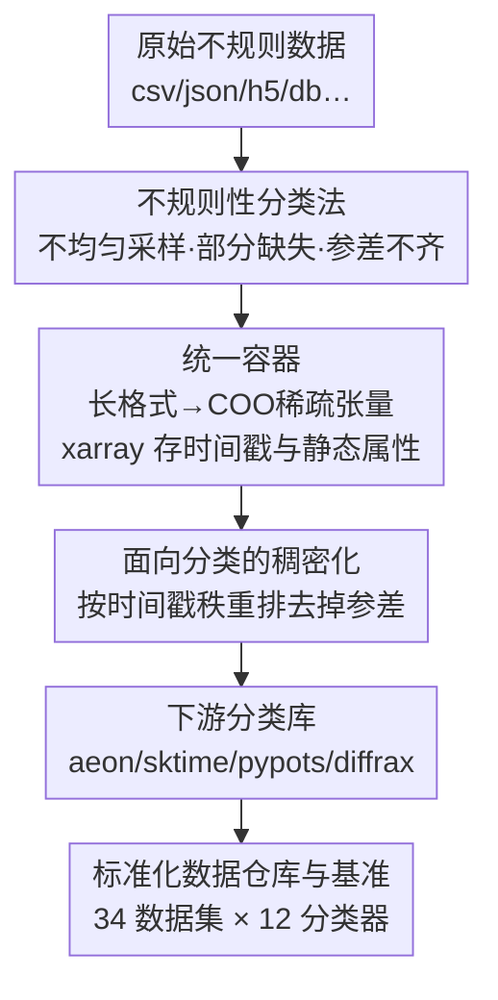

# pyrregular: A Unified Framework for Irregular Time Series, with Classification Benchmarks

**会议**: ICLR 2026  
**OpenReview**: [https://openreview.net/forum?id=qetBM8nLkf](https://openreview.net/forum?id=qetBM8nLkf)  
**代码**: https://github.com/fspinna/pyrregular  
**领域**: 时间序列 / 不规则时间序列 / 分类基准  
**关键词**: 不规则时间序列, 稀疏张量, xarray, 分类基准, 数据互操作

## 一句话总结
本文提出 pyrregular，用一套基于 xarray + 稀疏 COO 张量的统一容器把"不规则时间序列"的三类不规则性（不均匀采样、部分缺失、参差不齐）系统地组织起来，并配套首个标准化的不规则时间序列分类数据仓库（34 个数据集）与跨社区的统一基准（12 个分类器），结论是简单的通用模型 ROCKET 反而在这类数据上整体最强。

## 研究背景与动机
**领域现状**：现实世界的时间序列（移动轨迹、医疗监护、环境监测）几乎都是"不规则"的——不同传感器采样频率不同、记录时长不同、还时不时漏采。处理这类数据的研究分散在多个社区：移动轨迹分析、不规则时间序列（ITS）分类、预测、插补等，每个社区各自有一套工具和库（统计/数据挖掘模型、神经网络、微分方程），互不兼容。

**现有痛点**：这种割裂带来两个直接问题。其一，**没有统一的数据格式**：现有数组结构要么能存变长数据但存不了真实时间戳（numpy masked array、awkward array、ragged tensor），要么是预测用的长格式（`(i, j, t, x)` 元组）但做分类要 pivot 且静态属性难安置，要么像 xarray 支持带时间戳的多维数组却不原生支持稀疏。最主流的不规则时间序列库 pypots 又忽略了"不均匀采样"这一类不规则性、且自成生态无法和 aeon/sktime 交叉比较。其二，**没有标准化基准**：规则时间序列有 UEA/UCR 这种几百个数据集的"bake-off"，而不规则时间序列的基准多局限在单篇论文、数据集很少，且常常是把规则数据"人为丢点"模拟出来的——这会引入对缺失机制的假设，破坏真实数据里和采集过程绑定的"结构性缺失"。

**核心矛盾**：根本原因在于"不规则"本身从未被讲清楚——它其实是多个相互独立的成因叠加，而现有工具只针对其中某一种（比如只处理部分缺失），导致数据格式、方法、基准三者都碎片化，方法的泛化能力始终没在足够广的数据上被验证过。

**本文目标**：(1) 把不规则性讲清楚——给出一个区分各类不规则的分类法；(2) 设计一个能同时表达全部不规则性的统一数组容器；(3) 基于它建首个标准化不规则分类数据仓库和跨社区基准。

**切入角度**：作者观察到，做不规则时间序列时常用的"长格式"（每行 `(i, j, t, x)`）在结构上和稀疏张量的 COO（坐标）表示几乎一模一样——区别仅在于 COO 用离散的整数索引 `k`，而长格式用真实时间戳 `t`，二者之间只差一个 `t↔k` 的映射。

**核心 idea**：用"xarray 存时间戳 + 底层稀疏 COO 张量存观测值"这个组合，做一个跨库兼容层，让所有社区的不规则数据和方法都能塞进同一套容器里被公平比较。

## 方法详解

### 整体框架
pyrregular 要解决的是"把任意来源、任意格式的不规则时间序列，转成一种既省内存、又能表达全部不规则性、还能喂给现有分类库"的统一表示。整条管线分三步走：**preprocessing（预处理）**把原始数据统一成长格式再灌进稀疏 COO 容器；**handling（处理）**让数据能被探索、切片、画图、存取；**converting（转换）**把稀疏容器稠密化成下游分类库能直接吃的张量。中间那个容器是核心——它把 xarray（管时间戳和静态属性）和底层稀疏 COO 张量（管观测值）通过自定义的 backend 和 accessor 缝在一起。

### 关键设计

**1. 不规则性的统一分类法：把"乱"拆成三个相互独立的成因**

现有文献里"不规则"是个含糊的统称，作者第一步先把它形式化拆解。单条信号（signal）只会因两种原因不规则：**不均匀采样**（uneven sampling，存在某个间隔 $t_{k+1}-t_k$ 不等于固定 $\Delta t$）和**部分缺失**（partially observed，本该有的值缺了，标成 NaN）。而当多条信号拼成多元时间序列存进数组时，会冒出第三种纯结构性的不规则——**参差不齐**（raggedness），即因长度/采样/对齐不一致而必须做 padding。参差本身又能进一步分成三个独立子因：**长度参差**（两信号观测数 $\tau_a \neq \tau_b$）、**平移**（一条信号比另一条早开始早结束）、**采样参差**（某处采样间隔 $\Delta t_{a,k} \neq \Delta t_{b,k}$）。作者明确论证这三大成因（及参差的三个子因）相互独立、谁都不蕴含谁——比如轨迹数据时间戳高度不均匀但经纬度共享时间戳（不均匀但不参差），又比如恒定采样里偶然漏一个点（部分缺失但时间戳均匀）。这套分类法的价值在于：只有先承认不规则是多因叠加，才能设计一个同时容纳全部成因的容器，也才能在基准里按不规则类型分层评估模型。

**2. 长格式↔COO 的统一容器：用稀疏张量 + xarray 同时装下时间戳和缺失**

这是框架的核心引擎，对应 preprocessing 与 handling 两步。预处理只要求用户提供一个把自己数据吐成**长格式**（每行 `(i, j, t, x)`：实例 ID、信号 ID、真实时间戳、观测值）的函数。作者抓住长格式和稀疏 COO 表示 `(i, j, k, x)` 几乎同构这一点：唯一差别是 COO 要离散整数索引 $k$，长格式用实数时间戳 $t$。于是建立映射——把全数据集排序去重后的时间戳向量 $t=[t_1,\dots,t_T]$ 映到位置 $k=[1,\dots,T]$，数据读两遍（一遍建映射、一遍增量填 COO）即可完成转换。这样得到稀疏张量 $X \in \dot{\mathbb{R}}^{n \times d \times T}$。COO 表示同时优雅地解决了两类 NaN 的语义区分：**显式存储**的 `(i, j, k, \text{NaN})` 表示"本应有却缺了"的部分缺失，而稠密化时**隐式生成**的 NaN（填充值）表示参差导致的 padding——稀疏张量本身就足以同时表达参差和部分缺失。但 COO 只存离散索引 $k$、存不了真实时间戳，因此作者再用 xarray 来存时间戳和静态属性（如分类标签），并通过自定义 backend + accessor 让 xarray 底层挂一个稀疏 COO 张量。这样既保留 xarray 的全部功能（时间戳范围查询、画图、存读到 HDF5），又只存非空观测，内存高度节省。

**3. 面向分类的稠密化：按时间戳秩重排，把"无关的参差"压掉**

xarray/稀疏容器虽好，但下游监督学习库不直接吃，所以 converting 这步要把它转成稠密张量。难点在于：分类任务里参差通常和标签无关，如果死板地按全局时间戳铺开，会得到一个绝大部分是 NaN 的巨大稠密数组（比如一条 1 月 23 日开始、另一条 1 月 30 日开始，硬铺会给后者塞 7 个前导 NaN）。作者的做法是对每条时间序列**按时间戳索引做稠密秩重排**：对每个 COO 条目 $(i, j, k, x)$ 产出 $(i, j, \text{rank}_i(k), x)$，其中

$$\text{rank}_i(k) = 1 + |\{k' \in [1, T_i] : k' < k\}|.$$

这把每条序列的时间戳索引压成从 1 到自身长度 $T_i$ 的连续序列，整体稠密成 $X' \in \dot{\mathbb{R}}^{n \times d \times \bar{T}}$（$\bar{T} = \max_i T_i$），既保留了部分缺失的真实 NaN 和观测顺序，又把和标签无关的参差降到最小。转换后的 $X'$ 可直接喂给 sktime、aeon、tslearn、pypots、diffrax 等库。复杂度上，这步是每条序列内排序，随序列数线性、随非空观测数对数线性增长，实测 P19 端到端约 3 秒、最大数据集 1 分钟内搞定。

**4. 标准化数据仓库与统一基准：34 个天然不规则数据集 × 12 个跨库分类器**

光有容器不够，作者用它建了首个标准化不规则分类基准。**数据侧**精选 34 个**天然不规则**（绝不人为造缺失）的数据集，覆盖医疗（P12/P19/MIMIC-III）、人体活动（PAM/LPA）、移动轨迹（动物 AN、鸟类 SE、车辆/出租车 TA/VE）等领域，并按前述分类法标注每个数据集属于哪几类不规则（US/PO/UL/SH/RS），还自造了一个不规则版玩具基准 ABF（类别取决于采样时间的偏度）。**模型侧**收 12 个能"原生处理不规则、不靠插补引偏"的分类器，横跨 aeon（BORF、RIFC）、diffrax（NCDE）、pypots（BRITS、GRU-D、RAINDROP、SAITS、TIMESNET）、sktime（LGBM、ROCKET、SVM）、tslearn（DTW-KNN）五个库。所有模型用各库默认超参，目标和 bake-off 一致——找"单一合理配置下泛化最好"的模型，而非给每个数据集调到最优。

## 实验关键数据

### 主实验
用 macro-F1 作为主指标（对类别不平衡稳健），通过临界差异（CD）图对 12 个模型排名（rank 越低越好，统计上打平的用横杠连起来）：

| 模型 | 类型 | 平均 F1 rank | 备注 |
|------|------|--------------|------|
| ROCKET | 规则·核变换 | 3.47 | 最优，且不利用任何不规则信息 |
| BORF | 字典型变换 | 4.87 | 与 LGBM/RIFC/TIMESNET 统计打平 |
| LGBM | 表格·树模型 | 5.07 | 直接在原始 ITS 上训练，速度最快 |
| RIFC | 区间特征 | 5.53 | 大数据集上退化 |
| TIMESNET | 神经·inception | 6.06 | 数据量大时显著变好 |
| RAINDROP | 图神经网络 | 6.41 | 长序列上表现突出（图结构） |
| KNN (DTW) | 距离 | 6.46 | 大数据集上 scalability 差 |
| ... | ... | ... | ... |
| NCDE | 神经微分方程 | 8.56 | 偏低 |
| SVM (LCSS) | 距离核 | 10.44 | 最差 |

最反直觉的结论：**ROCKET 这个为规则时间序列设计、完全不利用不规则信息的简单通用模型，整体最强**；而专门为不规则数据设计的神经网络（GRU-D、NCDE 等）在这种 bake-off 设定下普遍跑不过。作者归因为简单通用模型"高偏差低方差"的归纳偏置在多任务上更鲁棒。综合 F1 与运行时，ROCKET 是性价比最优（训练/推理都快），LGBM 因极快的训练速度成为最佳"快速基线"。

### 分层分析与微调实验

| 分层维度 | 关键发现 |
|----------|----------|
| 数据规模 | KNN/RIFC 在大数据集上变差；LGBM、尤其 TIMESNET 随数据量增多显著变好 |
| 信号维度 | 所有神经网络都随维度升高受益，更适合多元序列 |
| 序列长度 | GRU-D/BRITS 等循环模型在长序列上吃力；ROCKET/RIFC/BORF 区间特征类反而更好；RAINDROP 靠图结构例外地扛住长序列 |
| 不规则类型 | ROCKET/BORF/LGBM 在不均匀采样/不等长/平移/采样参差上稳居前三；唯独**部分缺失**上，专门建模缺失的 SAITS/BRITS 反超它们 |
| 微调后（P12/P19，对比 SOTA 专家模型） | 充分调参后深度模型（MTSFORMER、MUSICNET 等）能反超简单模型；但 ROCKET 微调后反而掉队，而 LGBM 在 P19 上拿到第 4、压过 CONTIFORMER 和 GRU-D；ROCKET/BORF/LGBM 的标准差近乎为 0，极稳定 |

### 关键发现
- **简单通用 > 专用复杂**（在 bake-off 设定下）：ROCKET/BORF/LGBM 三个通用模型整体压制专用神经网络，说明"原生处理不规则"的复杂设计在跨数据集泛化时未必划算。
- **唯一例外是部分缺失**：当缺失有结构化模式时，显式建模缺失（SAITS/BRITS）才真正有价值——这反过来验证了分类法把"部分缺失"单列一类的必要性。
- **存储与内存大幅节省**：稀疏 COO 格式在高度不规则数据集上优势明显，如 TA 从 1.81GB 降到 0.08GB；PA2 的稀疏表示仅 3.93GB，对比最小参差稠密格式的 5.33GB。

## 亮点与洞察
- **"长格式≈稀疏 COO"这一眼看穿**是整个框架的支点：把预测社区惯用的长格式和稀疏张量打通，只用一个 `t↔k` 映射就实现跨库兼容，这种"找到两个已有事物的同构"比发明新结构更优雅。
- **两类 NaN 的语义分离**很巧：显式存储的 NaN = 真实缺失，隐式填充的 NaN = 参差 padding，单凭 COO 是否显式存这一条目就区分了两种含义完全不同的"空"，这是大多数现有格式做不到的。
- **xarray + 稀疏 backend 的组合拳**可迁移：用 xarray 管语义维度（时间戳/静态属性）、底层挂稀疏张量管稀疏数据，这套"语义层 + 存储层分离"的思路对任何高维稀疏带坐标的数据（不止时间序列）都适用。
- **诚实的负面结论**：作者没有为了卖自己的框架去吹某个花哨模型，而是老实报告"简单的 ROCKET 最强、神经网络普遍失利"，这种 bake-off 式的客观基准本身就是贡献。

## 局限与展望
- **只覆盖分类**：框架理论上能支持预测/插补等任务，但本文基准只做了分类，其它任务的有效性未验证。
- **默认超参的 bake-off 设定**：结论"简单模型最强"成立的前提是各模型用默认参数、不逐数据集调优；微调实验已显示充分调参后深度模型能反超，所以"ROCKET 最好"不应被解读为任意场景的最优选择。
- **可信度/可解释性只是一笔带过**：ROCKET 虽强但几乎不可解释、依赖昂贵的模型无关解释方法；高风险场景（医疗）下可能更该选 BORF/LGBM/KNN 这类稳定可解释的模型，但这块没深入。
- **预处理需用户自写函数**：虽然只要吐长格式即可，但对完全不熟悉的数据源，写出正确的增量产行函数仍有门槛。

## 相关工作与启发
- **vs pypots**: pypots 是最主流的不规则时间序列库，但只处理部分缺失、忽略不均匀采样、且自成生态无法跨库比较；pyrregular 用统一容器同时容纳三类不规则，并显式做跨 aeon/sktime/pypots/diffrax 的兼容层。
- **vs UEA/UCR 仓库**: UEA/UCR 是规则时间序列的标准仓库，不规则数据集稀缺且常靠人为丢点模拟；pyrregular 专收 34 个天然不规则数据集，保留真实的结构性缺失。
- **vs 长格式（nixtla/gluonTS）与稠密张量库（numpy masked / awkward / ragged tensor）**: 前者擅长预测但做分类要 pivot、静态变量难安置；后者能存变长但存不了真实时间戳；本文用"COO + xarray"同时拿下时间戳、稀疏、静态属性三件事。

## 评分
- 新颖性: ⭐⭐⭐⭐ 不是发明新模型，但"统一容器 + 分类法 + 标准基准"三位一体地解决了一个长期碎片化的问题，工程与概念贡献都扎实。
- 实验充分度: ⭐⭐⭐⭐⭐ 34 数据集 × 12 模型，按规模/维度/长度/不规则类型多维分层，还有微调对比与复杂度分析，是名副其实的 bake-off。
- 写作质量: ⭐⭐⭐⭐ 分类法形式化清楚、图示到位；个别符号（$T$ 与 $\bar T$）需要对照原文才不混。
- 价值: ⭐⭐⭐⭐⭐ 提供了首个标准化不规则分类基准和可复用的开源框架，对整个社区的"集中化研究"有直接推动作用。

<!-- RELATED:START -->

## 相关论文

- [\[ICLR 2026\] Towards Robust Real-World Multivariate Time Series Forecasting: A Unified Framework](towards_robust_real-world_multivariate_time_series_forecasting_a_unified_framewo.md)
- [\[ICLR 2026\] Delta-XAI: A Unified Framework for Explaining Prediction Changes in Online Time Series Monitoring](delta-xai_a_unified_framework_for_explaining_prediction_changes_in_online_time_s.md)
- [\[ICLR 2026\] A Unified Federated Framework for Trajectory Data Preparation via LLMs](a_unified_federated_framework_for_trajectory_data_preparation_via_llms.md)
- [\[ICLR 2026\] TimeSeriesExamAgent: Creating Time Series Reasoning Benchmarks at Scale](timeseriesexamagent_creating_time_series_reasoning_benchmarks_at_scale.md)
- [\[AAAI 2026\] A Unified Shape-Aware Foundation Model for Time Series Classification](../../AAAI2026/time_series/a_unified_shape-aware_foundation_model_for_time_series_class.md)

<!-- RELATED:END -->
