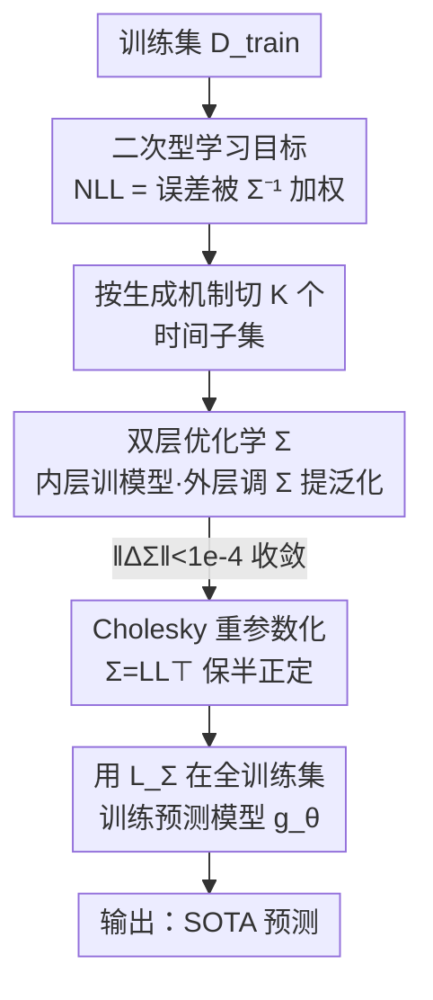

# Quadratic Direct Forecast for Training Multi-Step Time-Series Forecast Models

**会议**: ICLR2026  
**OpenReview**: [https://openreview.net/forum?id=vpO8n9AqEG](https://openreview.net/forum?id=vpO8n9AqEG)  
**代码**: https://github.com/Master-PLC/QDF  
**领域**: 时间序列  
**关键词**: 时序预测、学习目标、标签自相关、异质任务权重、双层优化  

## 一句话总结
针对多步时序预测里 MSE 把每个未来步当成独立、等权任务的缺陷，本文从最大似然推出一个由条件协方差逆矩阵加权的「二次型学习目标」，并用一套双层优化（QDF）把这个加权矩阵当作可学习参数、面向泛化在留出集上学出来，作为即插即用的损失替换 MSE，在 8 个数据集、多种预测模型上稳定刷到 SOTA。

## 研究背景与动机
**领域现状**：深度时序预测的进步基本沿两条轴推进——一是神经网络架构（Transformer 系如 iTransformer / PatchTST / TQNet，线性系如 DLinear / TimeMixer），二是训练用的学习目标。绝大多数工作把精力放在架构上，而学习目标几乎一律默认用均方误差 MSE：直接预测（Direct Forecast, DF）范式一次性输出未来 $T$ 步，再对每一步算 MSE 求和。

**现有痛点**：MSE 把「预测第 $t$ 步」当成一个个互相独立、且权重完全相同的子任务，这带来两个被长期忽略的问题。其一是**标签自相关**：时序数据天然强自相关，即便已经condition 在历史 $X$ 上，未来各步之间仍然相关（论文在 ECL 上做 case study，发现 label 序列的偏相关矩阵超过 61.4% 的非对角元绝对值 > 0.1），MSE 把它们当独立处理，本质上是个有偏目标。其二是**异质任务权重**：不同未来步的预测难度和不确定性差异很大（条件方差随步长明显变化），但 MSE 给所有步一刀切等权，浪费了按难度调权的空间。

**核心矛盾**：从最大似然角度看，真正「无偏」的目标应该是被**条件协方差矩阵的逆** $\bar{\Sigma}$ 加权的二次型——非对角元负责自相关、对角元负责异质权重。而 MSE 等价于假设 $\bar{\Sigma}=I$，等于同时抹掉了这两层信息。已有的改进（FreDF、Time-o1）把标签先变换到某个隐空间再对齐，但它们只能保证**边际去相关**，给不出目标要的**条件去相关**（即对角化 $\bar{\Sigma}$），而且对各分量仍是等权优化，所以两个问题一个都没真正解决。

**本文目标**：把那个被 $\bar{\Sigma}$ 加权的二次型目标真正用起来。这又拆成三个子问题：(1) $\bar{\Sigma}$ 怎么从数据里估出来？(2) 估出来后怎么定义可训练的目标？(3) 它到底能不能提升预测精度？

**切入角度**：$\bar{\Sigma}$ 是未知且难以从「每个 $X$ 只有一条标签序列」里直接估计的。作者的关键转念是——**不去估真实的协方差，而是把 $\Sigma$ 当成一组以「模型泛化」为目标的可学习代理参数**，用双层优化在留出集上学它，让学出来的目标恰好驱动预测模型泛化得好。

**核心 idea**：用一个「面向泛化、双层优化学出来的二次型加权矩阵」替换 MSE 隐含的单位矩阵，一举把标签自相关（非对角）和异质任务权重（对角）都建模进损失里。

## 方法详解

### 整体框架
QDF（Quadratic Direct Forecast）是一个**模型无关的训练算法 / 损失替换方案**：它不改预测模型 $g_\theta$ 的结构，只把训练时的 MSE 换成一个由 $T\times T$ 加权矩阵参数化的二次型目标，并配一套学这个矩阵的流程。整条管线分三段：先把训练集按时间切成 $K$ 个不重叠子集；然后把加权矩阵 $\Sigma$ 当可学习参数，用**双层优化**在这些子集上反复迭代精炼（内层用当前 $\Sigma$ 训模型、外层在留出数据上更新 $\Sigma$ 以提升泛化）；最后拿收敛后的 $\Sigma$ 定义最终损失 $L_\Sigma$，在整个训练集上正常训练预测模型。整个过程只用训练集、不碰验证/测试集，无数据泄漏。

输入：历史序列 $X\in\mathbb{R}^{H\times D}$、训练集 $D_{\text{train}}$；输出：学好的加权矩阵 $\Sigma$ 及对应损失 $L_\Sigma$，进而得到训好的预测模型。

### 关键设计

**1. 二次型学习目标：把 MSE 的「单位矩阵」换成条件协方差逆**

这是全文的理论地基，直接回应「MSE 是有偏目标」这一痛点。论文先用 Theorem 3.1 给出：假设预测误差服从多元高斯，标签序列的负对数似然（去掉常数项）就是一个二次型

$$L_{\bar{\Sigma}}(X,Y;g_\theta)=\|Y-g_\theta(X)\|_{\bar{\Sigma}}^2=(Y-g_\theta(X))^\top \bar{\Sigma}\,(Y-g_\theta(X)),$$

其中 $\Sigma\in\mathbb{R}^{T\times T}$ 是给定 $X$ 时标签序列的条件协方差，$\bar{\Sigma}=\Sigma^{-1}$ 是它的逆。这个式子一眼看出两件事：**非对角元**刻画未来各步之间的条件相关（自相关效应），**对角元**给不同未来步不同的权重（异质任务权重）。而 MSE $L_{\text{mse}}=\|Y-g_\theta(X)\|^2$ 等价于令 $\bar{\Sigma}=I$——非对角全零、对角全等，于是两个信息都被丢掉。把目标从「点对点平方差之和」升级为「被 $\bar{\Sigma}$ 加权的二次型」，就在损失层面同时给了自相关和异质权重一个出口，这是 FreDF / Time-o1 那种「先变换标签再等权对齐」做不到的（它们只做到边际去相关，给不出对角化的 $\bar{\Sigma}$）。

**2. 面向泛化的双层优化：把加权矩阵当可学习参数，而不是去估真协方差**

真实的 $\Sigma$ 未知，且每个 $X$ 只有一条标签序列，根本估不准，这也是当年大家退回 MSE 的根本原因。本文的破局点是**不估真协方差，而学一个让模型泛化最好的代理 $\Sigma$**。形式化成 Definition 3.2 的双层优化：把训练数据切成不重叠的 $D_{\text{in}}=(X^{\text{in}},Y^{\text{in}})$ 与 $D_{\text{out}}=(X^{\text{out}},Y^{\text{out}})$，

$$\min_{\Sigma\succeq 0} L_\Sigma(X^{\text{out}},Y^{\text{out}};g_{\theta^\star})\quad\text{s.t.}\quad \theta^\star=\arg\min_\theta L_\Sigma(X^{\text{in}},Y^{\text{in}};g_\theta).$$

内层用固定的 $\Sigma$ 在 $D_{\text{in}}$ 上把模型 $g_\theta$ 训出来；外层在不相交的留出集 $D_{\text{out}}$ 上评估，并更新 $\Sigma$ 让这个「被它训出来的模型」泛化更好。关键在于：外层对 $\Sigma$ 的梯度是**穿过更新后的 $\theta$ 反传回 $\Sigma$**（而非直接对 $\Sigma$ 求导），这样才真正捕捉到「$\Sigma$ 如何经由 $\theta$ 影响泛化」这条因果链。这套思路在「把 $\Sigma$ 当可学参数」上与 meta-learning（MAML/Reptile）形神相似，但目标不同——meta-learning 求的是对新任务的快速适应，QDF 要的是一个**静态的、专为这一个预测任务建好自相关与异质权重的目标**，因此验证不是在一批新任务上，而是在同任务的留出集上。

**3. Cholesky 重参数化：用无约束优化保住协方差的半正定性**

$\Sigma$ 作为协方差必须半正定（$\Sigma\succeq 0$），直接在带这个约束的空间里做梯度优化很麻烦。本文用 Cholesky 分解 $\Sigma=LL^\top$ 重参数化，其中 $L$ 是下三角、对角为正（用 softplus 激活保证正）。这样把「对 $\Sigma$ 的约束优化」转成「对 $L$ 的无约束优化」，可以直接套标准梯度下降。这是个干净的工程化处理：保证每一步学出来的加权矩阵都是合法协方差，又不引入额外的投影/约束步骤。

**4. 分块迭代精炼的整体工作流：从 $\Sigma=I$ 出发，逐子集稳健地学到收敛再训模型**

有了「怎么更新一次 $\Sigma$」（Algorithm 1 的 atomic update：内层迭代 $N$ 步训 $\theta$，外层一步更新 $\Sigma$），还需要一个稳健的总流程把它用起来（Algorithm 2）。流程是：(i) 初始化 $\Sigma=I_T$（退化成 MSE 作起点），把训练集按时间切成 $K$ 个不重叠子集；(ii) 依次在这 $K$ 个子集上反复套用 Algorithm 1 精炼 $\Sigma$，直到 $\|\Sigma_{n+1}-\Sigma_n\|_F<10^{-4}$ 收敛或达到外层轮数 $N_{\text{out}}$；(iii) 拿收敛的 $\Sigma$ 在整个训练集上用 $L_\Sigma$ 正常训练预测模型，mini-batch 估计即可。**按时间切多子集**这一步是稳健性的关键：让 $\Sigma$ 在不同数据分布（不同时间段）上被更新，避免它过拟合到训练数据的某一段。因为只改损失、不改模型，QDF 天然 model-agnostic，可直接套到 iTransformer、DLinear、TQNet、Fredformer、PDF 等各类直接预测模型上。

### 损失函数 / 训练策略
最终训练目标就是收敛后的二次型 NLL：$L_{\Sigma}(X,Y;g_\theta)=(Y-g_\theta(X))^\top\bar{\Sigma}(Y-g_\theta(X))$，可在 mini-batch 上估计。关键超参为内层更新轮数 $N_{\text{in}}$、外层轮数 $N_{\text{out}}$、子集数 $K$、更新率 $\eta$。多变量情形按论文约定逐变量当成独立单变量来算目标（$D=1$ 推导，多变量分别处理）。

## 实验关键数据

### 主实验
8 个公开数据集（ETTh1/h2/m1/m2、ECL、Weather、PEMS03/08），输入长度固定 96，结果对 $T\in\{96,192,336,720\}$ 取平均。QDF 用表现最好的 TQNet 作预测骨干，与 10 个 SOTA 模型比较（MSE / MAE，越低越好）。

| 数据集 | 指标 | QDF(本文) | TQNet | iTransformer | DLinear |
|--------|------|-----------|-------|--------------|---------|
| ETTm2 | MSE | **0.270** | 0.277 | 0.295 | 0.342 |
| ETTh1 | MSE | **0.431** | 0.449 | 0.452 | 0.456 |
| ECL | MSE | **0.165** | 0.175 | 0.179 | 0.212 |
| Weather | MSE | **0.242** | 0.246 | 0.269 | 0.265 |
| PEMS08 | MSE | **0.120** | 0.139 | 0.149 | 0.249 |

QDF 在所有数据集上一致领先，PEMS08 上 MSE/MAE 各降 0.019。定性上（Fig. 2）DF 抓得住大趋势但常漏掉细节，比如 ETTm2 跟不上持续上升趋势、ECL 漏掉第 150 步附近的周期峰值，QDF 都能跟上。

### 学习目标对比
把不同损失插进同一模型（TQNet / PDF），公平比 QDF vs 其他目标：

| 损失 | 数据集 | MSE | MAE |
|------|--------|-----|-----|
| QDF | ETTm1 | **0.371** | **0.389** |
| Time-o1 | ETTm1 | 0.372 | 0.390 |
| FreDF | ETTm1 | 0.375 | 0.390 |
| DF(MSE) | ETTm1 | 0.376 | 0.391 |
| Soft-DTW | ETTm1 | 0.387 | 0.394 |
| Koopman | ETTm1 | 0.595 | 0.499 |

FreDF / Time-o1 这类纠偏目标确实优于裸 MSE，但因为只做边际去相关、且分量等权，仍逊于 QDF；Soft-DTW、Koopman 在部分数据集上甚至大幅劣化（如 ECL 上 Soft-DTW 飙到 0.623）。

### 消融实验
逐项拆开 QDF 的两个组件（Hetero. = 异质权重 / 学对角元；Auto. = 自相关 / 学非对角元），TQNet 骨干、4 个 horizon 平均：

| 配置 | Hetero. | Auto. | ECL MSE | ETTh1 MSE | 说明 |
|------|---------|-------|---------|-----------|------|
| DF | ✗ | ✗ | 0.175 | 0.449 | 纯 MSE（$\bar\Sigma=I$） |
| QDF† | ✓ | ✗ | 0.166 | 0.443 | 只学对角（异质权重） |
| QDF‡ | ✗ | ✓ | 0.166 | 0.442 | 只学非对角（自相关） |
| QDF | ✓ | ✓ | **0.165** | **0.431** | 完整，两者协同最佳 |

### 关键发现
- 两个组件**各自都能稳定超过 DF**：单开异质权重（QDF†）和单开自相关（QDF‡）都比 MSE 好，且 QDF‡ 常拿次优，说明建模标签自相关收益明显；两者合起来达到最优，呈协同效应。
- **模型无关、普适增益**（Fig. 3）：套到 TQNet/PDF/Fredformer/iTransformer 上一致降误差，ECL 上给 Fredformer、TQNet 分别降 MSE 7.4%、5.9%。
- **与 meta-learning 优化器比**（Table 4，ECL）：MAML / iMAML / MAML++ / Reptile 优化加权矩阵都能超过 DF，但都不如 QDF——因为它们没有显式针对样本外泛化优化 $\Sigma$，QDF 在 $T=720$ 上相对 DF 降 7.37%（MSE）。
- **超参不敏感**（Fig. 4）：内层轮数 $N_{\text{in}}$ 从 0 升到 1 提升显著，之后边际递减，说明一步内层更新基本够用；对 $K$、$\eta$ 在较宽范围内都稳。

## 亮点与洞察
- **把「损失函数设计」重新理论化**：从最大似然一步推出「最优目标 = 条件协方差逆加权的二次型」，并指出 MSE = 假设 $\bar\Sigma=I$、FreDF/Time-o1 = 只做边际去相关，一个统一框架把已有方法都摆到同一坐标系里，动机非常扎实。
- **「不估真协方差，而学面向泛化的代理矩阵」是最巧的一步**：绕开了「单条标签序列估不准协方差」这个死结，用双层优化把不可解的估计问题转成可解的泛化优化问题——这种「把难估的统计量当可学参数、用 holdout 监督」的套路可迁移到很多有偏损失的场景。
- **即插即用、零侵入**：只换损失不改模型，任何直接预测模型都能白嫖增益，落地成本极低，这也是它实用价值高的原因。
- **外层梯度穿过 $\theta$ 反传**这个细节点出了关键：直接对 $\Sigma$ 求导会丢掉「$\Sigma$ 经由训练影响泛化」的因果，必须二阶式地穿过内层最优 $\theta^\star$。

## 局限与展望
- **二次型加权矩阵是 $T\times T$**，长 horizon（如 $T=720$）下矩阵规模和双层优化的二阶反传都会带来额外开销，论文虽在附录讨论复杂度，但超长预测/超多变量下的可扩展性仍是潜在瓶颈。
- **高斯误差假设**：Theorem 3.1 建立在「预测误差服从多元高斯」之上，对重尾、强非平稳或带突变的真实序列，这个假设的稳健性值得进一步检验。
- **多变量按独立单变量处理**：算目标时把每个变量当独立单变量，没有显式建模**变量间**的协方差，对强跨变量相关的数据可能留有改进空间（可把 $\Sigma$ 推广到时间×变量的联合协方差）。
- **学到的 $\Sigma$ 缺少可解释性分析**：若能展示学出来的加权矩阵长什么样（哪些步被加权、自相关结构与 Fig. 1 是否吻合），会让「面向泛化的代理矩阵」更有说服力。

## 相关工作与启发
- **vs MSE / DF**：DF 隐含 $\bar\Sigma=I$，把未来各步当独立等权任务；QDF 学一个非平凡的 $\bar\Sigma$，同时建模自相关（非对角）与异质权重（对角），是 DF 的严格泛化（$\Sigma=I$ 时退化回 DF）。
- **vs FreDF / Time-o1**：两者把标签变换到隐空间再等权对齐，只能做到边际去相关、给不出条件去相关的对角化 $\bar\Sigma$，且各分量等权；QDF 直接在原空间学完整加权矩阵，理论上对齐了 NLL 的最优目标，实验上也更优。
- **vs Soft-DTW / Koopman 等形状/变换类目标**：它们强调形状对齐或变换域对齐但缺少偏差消除的理论保证，在部分数据集上不稳定甚至劣化；QDF 有似然推导支撑，表现一致更稳。
- **vs Meta-learning（MAML/Reptile…）**：同样把权重当可学参数，但 meta-learning 求跨任务快速适应、在新任务上验证；QDF 求同任务下面向样本外泛化的静态目标、在 holdout 上验证，实测优于直接拿 meta-learning 优化器来学 $\Sigma$。

## 评分
- 新颖性: ⭐⭐⭐⭐⭐ 把损失设计重新理论化、并用「学面向泛化的代理协方差」破解不可估难题，角度新且自洽
- 实验充分度: ⭐⭐⭐⭐⭐ 8 数据集 + 10 基线 + 目标对比 + 双因素消融 + 多模型普适性 + meta-learning 对照 + 超参敏感性，覆盖很全
- 写作质量: ⭐⭐⭐⭐ 理论推导清晰、动机层层递进；双层优化的二阶细节对读者门槛略高
- 价值: ⭐⭐⭐⭐⭐ 即插即用、模型无关、稳定提升，对时序预测训练有直接实用价值

<!-- RELATED:START -->

## 相关论文

- [\[ICLR 2026\] Panda: A Pretrained Forecast Model for Chaotic Dynamics](panda_a_pretrained_forecast_model_for_chaotic_dynamics.md)
- [\[ICLR 2026\] DistDF: Time-series Forecasting Needs Joint-distribution Wasserstein Alignment](distdf_time-series_forecasting_needs_joint-distribution_wasserstein_alignment.md)
- [\[ICLR 2026\] Multi-Scale Hypergraph Meets LLMs: Aligning Large Language Models for Time Series Analysis](multi-scale_hypergraph_meets_llms_aligning_large_language_models_for_time_series.md)
- [\[ICML 2026\] Simulation-Augmented Multi-Step Split Conformal Prediction for Aggregated Forecasts](../../ICML2026/time_series/simulation-augmented_multi-step_split_conformal_prediction_for_aggregated_foreca.md)
- [\[ICLR 2026\] MMPD: Diverse Time Series Forecasting via Multi-Mode Patch Diffusion Loss](mmpd_diverse_time_series_forecasting_via_multi-mode_patch_diffusion_loss.md)

<!-- RELATED:END -->
