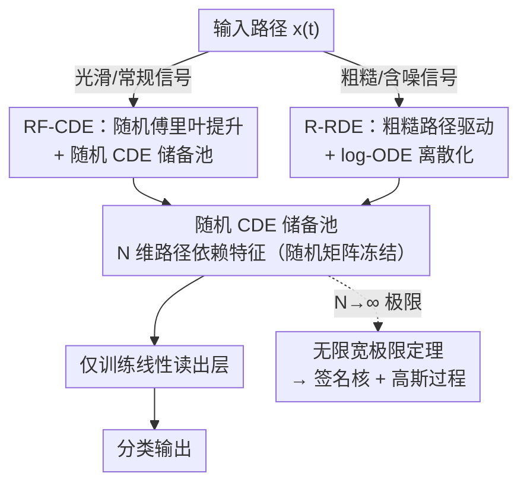

# Random Controlled Differential Equations

**会议**: ICLR 2026  
**OpenReview**: [https://openreview.net/forum?id=kHqt0ZSbKT](https://openreview.net/forum?id=kHqt0ZSbKT)  
**代码**: https://github.com/FrancescoPiatti/RandomSigJax  
**领域**: 时序建模 / 微分方程 / 储备池计算  
**关键词**: 时序分类, 受控微分方程, 储备池计算, 签名核, 随机特征

## 一句话总结
把一大批**随机参数**的受控微分方程（CDE）/粗糙微分方程当作连续时间储备池，只训练最后一层线性读出，就能得到一个快、可扩展、且在无限宽极限下严格收敛到"签名核"的时序分类器——既保留了路径签名方法的归纳偏置，又甩掉了显式签名计算和核矩阵求逆的开销。

## 研究背景与动机

**领域现状**：现代时序学习里有两条互补的主线。一条是**受控微分方程（CDE）**：把序列看成驱动路径 $x:[0,T]\to\mathbb{R}^d$，让隐状态被这条路径"控制"地演化，它正好是残差网络连续深度极限、也是深度状态空间模型（S4、Mamba）的统一视角；Neural CDE 进一步用神经网络参数化向量场、从数据里学。另一条是**路径签名（signature）**：路径的迭代积分序列，能把 CDE 解映射线性化，并诱导出带普适性和稳定性保证的**签名核**。

**现有痛点**：签名/签名核虽然理论漂亮，但在高截断阶数下**计算极其昂贵**——签名特征维度随阶数指数爆炸，签名核要构造并求逆大 Gram 矩阵，样本一多就成为瓶颈。Neural CDE 这类可学方法又要做完整的反向传播训练，代价不低。

**核心矛盾**：表达力强的路径方法（签名核、Neural CDE）训练/推理代价大；而代价小的方法往往缺乏路径数据该有的归纳偏置。换句话说，**"签名级的表达力"和"储备池级的训练效率"之间存在 trade-off**。

**本文目标**：构造一类**为路径数据量身定做的随机特征模型**，要求同时满足三点——(1) 保留 CDE 的连续时间结构；(2) 在无限宽极限下有明确的核/统计极限（不是黑箱随机网络）；(3) 只训练线性读出，训练轻、可扩展。

**切入角度**：作者借用**储备池计算（reservoir computing）**的思想：用一个大的、**随机初始化且不训练**的动力系统当特征提取器，只学最后的线性读出层。关键观察是——如果让这个随机动力系统本身就是一个随机参数的 CDE（Cirone et al. 2023 证明了随机控制 ResNet 的无限宽-深极限恰好是签名核），那么它天然继承签名的归纳偏置，又只需训练读出。

**核心 idea**：**用"随机参数的 CDE / 粗糙 DE 储备池 + 线性读出"代替显式签名计算**，并证明其无限宽极限就是（RBF-提升的 / 粗糙的）签名核，从而把随机特征储备池、连续时间深度架构、路径签名理论三者统一在同一框架下。

## 方法详解

### 整体框架

整篇论文是一个"把签名核做成随机特征储备池"的框架，输入是一条时序路径 $x$，输出是它的分类标签。核心套路始终是：**先（可选地）对路径做一次提升 → 让它驱动一个随机参数的微分方程储备池 → 得到 $N$ 维路径依赖特征 → 只在特征上训练一个线性读出**。储备池里的随机矩阵 $A_i\sim\xi_N$（标准高斯）全程冻结，所以训练成本几乎只来自最后那层线性回归。

在这个骨架上，论文给出两个具体变体，分别对应两类不同正则性的输入信号：

- **RF-CDE**：处理光滑/常规路径。先用随机傅里叶特征（RFF）把信号逐点提升到 RBF 再生核空间，再让提升后的路径驱动随机 CDE。无限宽极限收敛到 **RBF-提升签名核**。
- **R-RDE**：处理粗糙/含噪信号。直接在几何粗糙路径上做文章，用 **log-ODE 离散化**配合 log-signature 抓住高阶时间交互。无限宽极限收敛到**粗糙签名核**。

两条支路最后都汇到同一个理论保证——**无限宽极限定理 + 高斯过程解释**：固定随机储备池 + 训练线性读出 ≈ 用对应签名核做核岭回归，等价于一个以签名核为协方差的高斯过程先验。

### 关键设计

**1. 随机 CDE 储备池 + 线性读出：把签名核"采样"成随机特征**

这是整套方法的地基，针对"显式签名/签名核太贵"的痛点。储备池本身是一个**随机参数的受控微分方程**（R-CDE，源自 Cirone et al. 2023，本文首次实测）：取一批 i.i.d. 高斯随机矩阵 $A_k\sim\xi_N$，让 $N$ 维隐状态在路径驱动下演化

$$\mathrm{d}Z^N_t(x)=\frac{1}{\sqrt{N}}\sum_{i=1}^{m}A_i\,\varphi\!\left(Z^N_t(x)\right)\mathrm{d}x^i_t,\qquad Z^N_0=z_0\in\mathbb{R}^N.$$

它本质是一个随机初始化、同质（homogeneous）的单层 ResNet 在"无限深 + 步长趋零"下的连续时间极限。**为什么这样有效**：Cirone 等证明，当宽度 $N\to\infty$、且 $\varphi=\mathrm{id}$ 时，两条路径特征的期望内积 $\frac1N\mathbb{E}[\langle Z^N_s(x),Z^N_t(y)\rangle]$ 恰好收敛到 $x,y$ 的**签名核** $K^{x,y}_{\mathrm{sig}}(s,t)$。也就是说，随机矩阵把"签名核"以蒙特卡洛方式采样了出来——我们不必显式算签名，只要跑这个随机 DE 拿到 $N$ 维特征，再在上面训一个线性读出就行。所有非线性都在冻结的随机动力学里，可训练参数只有读出层，于是训练复杂度从"核矩阵求逆"降到"线性回归"。

**2. RF-CDE：先做随机傅里叶提升，逼近 RBF-提升签名核**

纯 R-CDE 对应的是"裸"签名核，缺少对局部几何的刻画。实践中 Toth et al.(2025) 的随机傅里叶签名特征（RFSF）表明：**先把信号提升进 RBF 再生核空间，再取签名**，效果显著更好。本设计就把这一招搬进连续时间动力学。

具体地，用随机傅里叶特征映射 $\phi^F_\mu:\mathbb{R}^d\to\mathbb{R}^{2F}$（由 Bochner 定理，采样频率 $\omega_i\sim\mu$，$\phi^F_\mu(x)=\frac{1}{\sqrt F}(e^{i\langle\omega_1,x\rangle},\dots)$，其内积逼近 RBF 核 $\kappa_{\mathrm{RBF}}$）把路径逐点提升为 $X^F_t:=\phi^F_\mu(x_t)$，再让**提升后的路径**驱动随机 CDE：

$$\mathrm{d}Z^{N,F}_t(x)=\frac{1}{\sqrt{N}}\sum_{i=1}^{2F}A_i\,\varphi\!\left(Z^{N,F}_t(x)\right)\mathrm{d}X^{F,i}_t.$$

**为什么有效**：定理 3.2 证明，先令 $N\to\infty$ 再令 $F\to\infty$，特征内积收敛到 **RBF-提升签名核** $K^{x,y}_{\mathrm{Sig\text{-}RBF}}$（即 $\langle\mathrm{Sig}(\phi\circ x),\mathrm{Sig}(\phi\circ y)\rangle$ 的极限）。这给出清晰的归纳偏置解读：RF-CDE 既继承了签名核的表达结构，又保留随机特征储备池的可扩展性。实现上对该方程做欧拉离散，额外加入偏置向量 $b_i\sim\xi_N$ 和尺度参数 $\sigma_A,\sigma_b,\sigma_0$（网格搜索调），从而能处理分段线性路径，不再要求驱动信号光滑。

**3. R-RDE：粗糙路径驱动 + log-ODE 离散化，抓高阶交互**

当信号很粗糙（$p$-variation 的 $p>2$，如分数布朗运动、含噪序列），经典 Riemann–Stieltjes/Young 积分都失效，朴素欧拉离散会**破坏签名的 Chen 乘性结构**。本设计直接在几何粗糙路径上构造储备池。

思路是先定义一个由随机矩阵决定的"线性发展"算子 $\Gamma_A$，把签名增量映成 $\mathrm{End}(\mathbb{R}^N)$ 上的矩阵值粗糙路径 $S^A$（满足线性 CDE $\mathrm{d}S^A_t=S^A_t\circ\mathrm{d}x^A_t$），再让特征路径解粗糙微分方程 $\mathrm{d}Z^N_t(X)=f(Z^N_t)\,\mathrm{d}S^A_t$。离散时用 **log-ODE 方法**：每个时间步 $[t_i,t_{i+1}]$ 用 log-signature $L_i=\log_m(X_{t_i,t_{i+1}})\in\mathcal{L}^m(\mathbb{R}^d)$（自由李代数里的紧凑坐标，去掉了张量代数的冗余）来概括，通过对易子 $B(w)$（李括号的嵌套）推进状态：

$$\widetilde Z^N_{t_{i+1}}=\widetilde Z^N_{t_i}+\Pi_B(X_{t_i,t_{i+1}})\,\varphi(\widetilde Z^N_{t_i}).$$

**为什么有效**：log-ODE 精确保持群/Chen 结构，让离散化忠实于粗糙路径代数，因此能稳定地利用 log-signature 携带的**高阶时间交互信息**——这正是噪声大、靠长程依赖区分类别的任务（如 Hurst 指数识别）所需要的。定理 3.3 用普适极限定理保证解的存在唯一性，定理 3.4 证明其无限宽极限收敛到**粗糙签名核** $K^{X,Y}_{\mathrm{Sig}}$。额外好处：log-ODE 在分块上算 log-signature，能缩短喂给随机 DE 的有效轨迹长度，对超长序列反而有优势。

**4. 无限宽极限定理与高斯过程视角：把三类对象统一起来**

前三个设计各自给出"有限宽、可跑"的模型，本设计是把它们钉在坚实理论上的那颗钉子。三个变体（R-CDE / RF-CDE / R-RDE）都有对应的**无限宽极限定理**，分别收敛到签名核、RBF-提升签名核、粗糙签名核。在此基础上，由标准的核–GP 对应：固定随机储备池 + 训练线性读出，等价于**用对应签名核做核岭回归**，也就是在路径泛函上放了一个以该签名核为协方差的**高斯过程先验** $\mathrm{GP}(0,K_{\mathrm{Sig}})$。这条统一视角的价值在于：它把"随机特征储备池""连续时间深度架构（控制 ResNet 的无限宽-深极限）""路径签名核理论"三套原本独立的语言对齐到同一框架，让模型的归纳偏置变得**可解释、可预测**，而不是又一个黑箱随机网络。

### 损失函数 / 训练策略
储备池（随机矩阵 $A_i,b_i$、初值 $z_0$）全部冻结，唯一可训练的是特征之上的**线性读出层**——分类任务里就是在 $N$ 维随机特征上做线性分类（SVM / 线性回归），等价于核岭回归。需调的超参主要是尺度 $\sigma_A,\sigma_b,\sigma_0$、随机特征数 $F$、签名截断阶 $m$，均用网格搜索。因为没有反向传播穿过动力学，训练复杂度随样本数线性增长。

## 实验关键数据

### 主实验：UEA 多元时序分类（16 个数据集，N=250）

| 模型 | 平均准确率 ↑ | 平均排名 ↓ | 说明 |
|------|------|------|------|
| **RF-CDE（本文）** | **0.741** | 3.062 | 随机特征模型里最强 |
| SigPDE | 0.738 | **2.562** | 非随机特征的核基线（需求 Gram 矩阵） |
| RFSF-DP | 0.726 | 3.406 | Toth 2025 强基线 |
| RFSF-TRP | 0.725 | 3.594 | Toth 2025 强基线 |
| R-RDE（本文） | 0.708 | 4.125 | 在结构丰富数据上偶尔领先 |
| R-CDE | 0.695 | 4.250 | Cirone 2023，本文首次实测 |

RF-CDE 在中等难度任务（Libras、NATOPS）尤其能打；R-RDE 在结构丰富的数据（UWaveGestureLibrary，0.903 最高）上偶尔反超其他随机特征法。

### Hurst 指数识别（合成 fBm，越粗糙越难）

| 设置 | R-CDE | RF-CDE | **R-RDE** | RFSF-DP | RFSF-TRP | NCDE | NRDE |
|------|------|------|------|------|------|------|------|
| V1, N=64 | 0.870 | 0.895 | **0.955** | 0.840 | 0.895 | 0.905 | 0.920 |
| V1, N=100 | 0.900 | 0.945 | 0.950 | 0.890 | 0.910 | 0.895 | 0.945 |
| V2, N=64 | 0.635 | 0.645 | **0.735** | 0.630 | 0.650 | 0.650 | 0.675 |
| V2, N=100 | 0.650 | 0.695 | **0.730** | 0.675 | 0.675 | 0.650 | 0.685 |

V2 做了逐样本标准化（零均值单位方差），逼模型只靠几何特征/长程依赖判别。最难的 V2、N=64 下，R-RDE 对所有基线（含 Neural CDE/RDE）保持明显领先——印证了"粗糙路径变体擅长抓高阶交互"。

### 计算复杂度与鲁棒性
- **复杂度**：所有签名随机特征法随序列长度 $\ell$ **线性**增长，而 SigPDE/RBF/GAK 等核方法是**二次**。R-RDE 因矩阵发展有额外 $O(N^3)$ 项（但与 batch 无关、可预计算），通常最慢；RF-CDE 在速度/精度上最均衡。
- **缺失数据鲁棒性**：随机移除测试轨迹上的时间点后，RF-CDE 随缺失率上升表现**最稳定**。
- **特征数消融**：低预算（64 特征）下 RF-CDE 相对 RFSF/神经基线优势更明显；把特征翻倍到 500 只带来"几个百分点"的温和增益，主要体现在更难的数据集上。

### 关键发现
- **RBF 提升（RF-CDE）和粗糙路径（R-RDE）各管一摊**：前者擅长在连续时间里捕捉局部几何，常规任务更强；后者擅长高阶交互，粗糙/含噪信号更强。这与各自收敛到的核（RBF-提升签名核 vs 粗糙签名核）完全对应。
- 只用几百个随机特征就能与显式签名核（SigPDE）打平甚至超过，且省掉了核矩阵求逆——验证了"随机特征储备池"路线的实用价值。

## 亮点与洞察
- **把"签名核"做成"随机特征储备池"**：这是最漂亮的一步——不显式算签名，而是让随机 CDE 在无限宽极限下"自动"逼近签名核。理论上有定理背书，工程上只训练线性读出，鱼和熊掌兼得。
- **正则性决定变体选择**：根据驱动信号是光滑还是粗糙，分别用 RFF 提升（RF-CDE）或粗糙路径 + log-ODE（R-RDE），把"该用哪种归纳偏置"和"信号的数学性质（$p$-variation）"直接挂钩，这个对应关系很有指导性。
- **log-ODE 保 Chen 结构**这一招可迁移：任何想在粗糙/含噪序列上做特征化、又怕朴素离散破坏代数结构的场景，都可以借鉴用 log-signature + 对易子推进的离散方式。
- **统一视角**把储备池计算、连续深度网络、签名核理论缝到一起，给"随机网络为什么有效"提供了一个路径数据版本的核极限解释。

## 局限与展望
- **储备池随机谱固定**：随机矩阵的谱测度是固定采样的、不学习；作者也把"学习/稀疏化定义储备池的谱测度"列为未来方向，说明当前归纳偏置是被随机性"撞"出来的，未必对每个任务最优。
- **R-RDE 的 $O(N^3)$ 开销**：矩阵发展带来的立方项虽可预计算，但在大特征维度下仍是负担；论文也承认 R-RDE 通常最慢。
- **实验局限于分类**：目前只在时序分类（UEA、Hurst、缺失数据）上验证，预测/生成/在线流式推断尚未展开（作者把"耦合概率头做校准不确定性与流式推断"列为展望）。
- **极限是渐近保证**：定理是 $N\to\infty$（RF-CDE 还需 $F\to\infty$）下的结论，有限宽下与目标核的逼近误差、需要多少特征才够，缺少定量刻画。

## 相关工作与启发
- **vs R-CDE（Cirone et al. 2023）**：R-CDE 是本文储备池的"原型"，对应裸签名核。本文在它前面加 RFF 提升（→RBF-提升签名核）或换成粗糙路径驱动（→粗糙签名核），把单一极限扩展成一个核家族，并首次给出 R-CDE 的实测基线。
- **vs RFSF（Toth et al. 2025）**：RFSF 也用随机傅里叶提升 + 签名，但走的是**离散**签名特征 $\mathrm{Sig}^N(\phi^F_\mu(x))$ 的路线；本文走**连续时间微分方程**路线（随机 CDE），二者无限宽极限是同一个 RBF-提升签名核，但 RF-CDE 在多数 UEA 数据上略胜，且天然处理不规则采样。RFSF 是本文最直接的对标基线。
- **vs SigPDE（Salvi et al. 2021a）**：SigPDE 是精确的（未截断）签名核，需构造并求逆 Gram 矩阵、随样本二次增长；本文用随机特征近似它，换来线性复杂度和免核矩阵，精度基本持平。
- **vs Neural CDE / Neural RDE（Kidger 2020 / Morrill 2021）**：神经版要端到端反向传播学向量场；本文向量场是冻结的随机矩阵、只训练线性读出，训练更轻，在 Hurst 任务上还更准。
- **vs 随机签名（Cuchiero 2021 / Compagnoni 2023 / Biagini 2024）**：同属"随机采样 (log-)signature 坐标"的储备池思路，本文的差异是保持**连续时间 CDE/RDE 结构**并给出对应签名核的精确极限定理。

## 评分
- 新颖性: ⭐⭐⭐⭐⭐ 把随机特征储备池、连续深度网络、签名核三条线统一，并给出 RBF-提升/粗糙两个新极限定理，理论贡献扎实。
- 实验充分度: ⭐⭐⭐⭐ UEA + Hurst + 缺失数据 + 复杂度分析覆盖较全，但仅限分类、缺预测/生成与有限宽逼近误差的定量分析。
- 写作质量: ⭐⭐⭐⭐ 数学背景铺陈清晰、定理陈述规范；但符号与粗糙路径理论门槛较高，对非该方向读者不太友好。
- 价值: ⭐⭐⭐⭐ 给出训练轻、可扩展、有理论保证的签名核替代方案，并开源 JAX 实现 RandomSigJax，实用性强。

<!-- RELATED:START -->

## 相关论文

- [\[ICML 2026\] Learning Manifold and Itô Dynamics with Branched Neural Rough Differential Equations](../../ICML2026/time_series/learning_manifold_and_itô_dynamics_with_branched_neural_rough_differential_equat.md)
- [\[AAAI 2026\] AirDDE: Multifactor Neural Delay Differential Equations for Air Quality Forecasting](../../AAAI2026/time_series/airdde_multifactor_neural_delay_differential_equations_for_air_quality_forecasti.md)
- [\[NeurIPS 2025\] In-Context Learning of Stochastic Differential Equations with Foundation Inference Models](../../NeurIPS2025/time_series/in-context_learning_of_stochastic_differential_equations_with_foundation_inferen.md)
- [\[ICLR 2026\] Delta-XAI: A Unified Framework for Explaining Prediction Changes in Online Time Series Monitoring](delta-xai_a_unified_framework_for_explaining_prediction_changes_in_online_time_s.md)
- [\[ICLR 2026\] pyrregular: A Unified Framework for Irregular Time Series, with Classification Benchmarks](pyrregular_a_unified_framework_for_irregular_time_series_with_classification_ben.md)

<!-- RELATED:END -->
