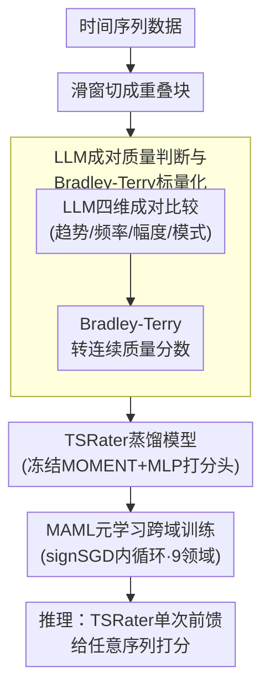

# Rating Quality of Diverse Time Series Data by Meta-learning from LLM Judgment

## 一句话总结

提出TSRating框架，利用LLM从趋势/频率/幅度/模式四个维度对时间序列数据块做成对质量比较，通过Bradley-Terry模型转换为标量质量分数，并以MAML元学习在9个领域22个子集上训练TSRater模型（MOMENT编码器+MLP），实现高效、统一的跨域时间序列数据质量评估。

## 研究背景与动机

**时间序列数据质量的重要性**：无论是微调LLM处理TS任务，还是从头训练TS基础模型，数据质量都是性能的关键瓶颈。实际数据常受缺失值、传感器故障、不规则采样等问题困扰。

**现有方法的领域局限性**：TimeInf将影响函数适配到TS数据，TimeShap将Shapley值扩展到TS——但它们都只在单一领域有效，忽略了真实TS数据跨越医疗、金融、气象、工业等极不相同的领域这一事实。

**计算效率的根本矛盾**：影响函数需要昂贵的Hessian和梯度计算，Shapley值面临指数级组合代价。两类方法在效率与精度之间难以取得平衡，逐域重复计算更加禁止性。

**LLM在文本质量评估中的成功启发**：Qurating、Ask-LLM等工作已验证LLM可以通过prompt准确评估文本质量。LLM在大规模预训练中已获取了丰富的跨域TS知识——能否将此能力迁移到TS质量评估？

**核心科学问题**：LLM是否真正理解TS质量的关键特征？如何有效引导LLM区分高低质量的TS数据？如何将LLM的判断能力高效蒸馏到轻量模型以实现大规模部署？

**研究目标**：构建统一的跨域TS数据质量评估框架，同时解决精度、效率和泛化性三个维度的挑战。

## 方法详解

### 整体框架

TSRating把"让LLM判质量"和"让轻量模型大规模评分"两件事拆成一条流水线：先用滑窗把时间序列切成重叠块，让LLM从趋势、频率、幅度、模式四个维度对块做成对比较，再用Bradley-Terry模型把这些偏好转成连续的质量分数，作为监督信号去蒸馏一个以冻结MOMENT为编码器、MLP为打分头的TSRater；最后用MAML在九个领域上做元学习，让TSRater只需few-shot微调就能迁移到新域。推理阶段彻底甩开LLM，只跑一次TSRater前馈即可给任意时间序列打分。

### 关键设计

**1. LLM成对质量判断与Bradley-Terry标量化：把"哪个更好"变成可监督的连续分数**

LLM不擅长直接给绝对分，但擅长二选一，所以这里对每对块 $\mathbf{B}_i, \mathbf{B}_j$ 从趋势、频率、幅度、模式四维分别做成对比较，并对同一对重复 $M$ 次取置信度 $p_{i \succ j} = \frac{1}{M} \sum_{k=1}^{M} m_{i \succ j}^{(k)}$ 来抵消随机性。为消除"先出现的块更易被选"这类位置偏差，还会交换两块在prompt里的顺序各判一次再取均值；多变量序列则逐通道评判后做通道平均 $s(\mathbf{B}_i) = \frac{1}{D} \sum_{d=1}^{D} s(\mathbf{B}_i^d)$。光有成对偏好还无法训练打分模型，于是用Bradley-Terry假设 $p_{i \succ j} = \sigma(s(\mathbf{B}_i) - s(\mathbf{B}_j))$ 把偏好概率与标量分数之差挂钩，再通过最大似然把整批比较拟合成一组自洽的连续分数：

$$\mathcal{P} = \sum_{(\mathbf{B}_i, \mathbf{B}_j, p_{i \succ j}) \in \mathcal{J}} \left[ p_{i \succ j} \log \sigma(s(\mathbf{B}_i) - s(\mathbf{B}_j)) + (1-p_{i \succ j}) \log \sigma(s(\mathbf{B}_j) - s(\mathbf{B}_i)) \right]$$

这套设计在合成数据上得到验证——趋势、频率、幅度、模式四维的识别准确率分别为94.5%、92.25%、98.75%、95.75%，说明LLM确实抓住了时间序列质量的关键属性，而非随机猜测。

**2. TSRater蒸馏模型：把 $O(n^2)$ 的API调用压成一次前馈**

直接靠LLM给大规模数据打分不现实，成对比较的代价是样本数的平方级API调用，所以TSRating把LLM的判断蒸馏进一个轻量模型。TSRater以约1.09亿参数的时间序列基础模型MOMENT作冻结编码器提取时序特征，再接一个3层MLP（隐藏维度256，配LayerNorm、ReLU与残差连接）输出标量质量分。训练时不重新定义目标，而是让模型的打分之差去复刻LLM的成对偏好，用二元交叉熵对齐：

$$\mathcal{L}_\theta = \mathbb{E}_{(\mathbf{B}_i, \mathbf{B}_j, p_{i \succ j}) \in \mathcal{J}} \left[ -p_{i \succ j} \log \sigma(s_\theta(\mathbf{B}_i) - s_\theta(\mathbf{B}_j)) - (1-p_{i \succ j}) \log \sigma(s_\theta(\mathbf{B}_j) - s_\theta(\mathbf{B}_i)) \right]$$

训练完成后，给任意数据评分只需TSRater单次前馈，把昂贵的LLM判断一次性固化进了可复用的打分器。块级分数还能自下而上聚合成更大粒度：点级分数对覆盖该点的所有块取均值 $s(x_i) = \frac{1}{|B(x)|} \sum_{\mathbf{B}_k \in B(x)} s(\mathbf{B}_k)$，样本级再对所有时间点平均 $s(\mathbf{S}) = \frac{1}{T} \sum_{i=1}^{T} s(x_i)$，于是同一套块级监督可直接服务样本筛选。

**3. MAML元学习跨域训练：让一个打分器适配所有领域**

真实时间序列横跨医疗、金融、气象、工业，逐域单独训打分器既贵又难复用，因此TSRating把"在新域上快速适配"本身当作训练目标。它从Time-300B语料中选取能源、零售、金融、医疗、交通、气象、工业、合成与其他共九个领域的22个子集构成元学习任务，优化的是经过一步内循环更新后在query集上的损失：

$$\min_\theta \sum_{\mathcal{T}_i \sim \mathcal{T}} \mathcal{L}_{\mathcal{T}_i}^{\text{query}} \left( \theta - \alpha \cdot \text{sign}(\nabla_\theta \mathcal{L}_{\mathcal{T}_i}^{\text{support}}(\theta)) \right)$$

这里的关键技巧是内循环用signSGD替代标准梯度下降，只取梯度符号 $\text{sign}(\cdot)$ 做更新——这样元目标对内循环更新的求导不再牵扯二阶导（超梯度），既加速又稳定。最终四个维度的分数各自归一化后聚合成统一质量分。这样训出的TSRater面对未见过的领域只需few-shot微调就能用，而不必为每个新域从零重训。

## 实验设置

- **任务**：长期预测(4数据集)、短期预测(M4的3个子集)、分类(4数据集) — 共11个基准
- **模型**：Linear、CNN、PatchTST，以及扩展的TimeMixer、DLinear、iTransformer等
- **基线**：DataShapley、KNNShapley、DataOob、TimeInf
- **策略**：TSRating选top-50%高质量样本训练，评估测试集性能

## 实验关键数据

### 表1：主实验结果（3任务×3模型×11数据集）

| 模型 | 方法 | 长期预测RMSE(4均) | 短期预测MAPE(3均) | 分类精度(4均) |
|------|------|------------------|------------------|--------------|
| Linear | Random | 0.900 | 1.528 | 0.291 |
| Linear | TimeInf | 0.722 | 1.536 | 0.323 |
| Linear | **TSRating** | **0.740** | **1.366** | **0.344** |
| CNN | Random | 1.085 | 1.550 | 0.449 |
| CNN | TimeInf | 1.077 | 1.503 | 0.455 |
| CNN | **TSRating** | **1.026** | **1.322** | **0.494** |
| PatchTST | Random | 0.366 | 2.725 | 0.408 |
| PatchTST | TimeInf | 0.374 | 2.690 | 0.406 |
| PatchTST | **TSRating** | **0.357** | **2.574** | **0.444** |

TSRating在36个评测case中取得最优/次优的比例显著领先。

### 表2：运行时间对比

| 方法 | 时间(秒) | 备注 |
|------|---------|------|
| DataShapley | 210,000 | 极慢 |
| KNNShapley | 152 | 快但精度差 |
| DataOob | 4,785 | — |
| TimeInf | 4,938 | — |
| **TSRater总计** | **4,687** | 含LLM判断+元训练+微调+推理 |
| — 新数据集推理 | **~200** | 元训练模型可复用 |

关键优势：TSRater的元训练模型可复用，新数据集仅需few-shot微调+推理约200秒。

### 表3：元学习泛化性消融（Electricity数据集）

| 方法 | Linear | CNN | PatchTST | iTransformer | TimeMixer |
|------|--------|-----|----------|-------------|-----------|
| Meta-rater | 1.390 | 1.511 | 0.397 | 0.300 | 0.345 |
| 同域单独训练 | 1.471 | 1.497 | 0.398 | 0.306 | 0.332 |
| 异域单独训练 | 1.556 | 1.602 | 0.418 | 0.310 | 0.382 |

Meta-rater性能匹配甚至超过同域单独训练，远优于异域直接迁移。

## 关键发现

1. **LLM确实能理解TS质量**：合成实验中4个维度的判断准确率在92-99%，真实数据可视化与人类直觉一致。这是首次系统验证。

2. **质量评估可泛化**：Meta-rater在未见过的数据集上仅需few-shot适应即可匹配甚至超过领域专用rater，而异域直接迁移性能显著下降——验证了元学习的必要性。

3. **高质量数据 > 全量数据**：TS基础模型（Time-MoE、Time-LLM、MOMENT）用TSRating选出的top-50%数据微调，MSE低于全量数据微调——质量胜过数量。

4. **数据裁剪验证评估有效性**：按质量分数降序移除样本，TSRating方法下性能下降最快（PatchTST在Traffic上移除top-40%后RMSE增加>0.03，而KNNShapley仅增加0.01-0.02）。

5. **多维度融合优于单维度**：消融实验表明单个维度在不同数据集上表现不稳定（如amplitude在Weather上最优但在Traffic上最差），四维融合在所有数据集上表现一致。

6. **编码器选择不敏感**：MOMENT、Chronos、TimeGPT三种编码器在Weather数据集上产生可比性能，说明TSRater的收益主要来自LLM监督而非编码器。

## 亮点与洞察

- **LLM作为TS质量裁判的首次系统化验证**：将NLP领域中LLM-as-judge范式创新性地迁移到TS领域，核心在于精心设计的4维度prompt覆盖了时间序列分析的基本属性（趋势、频率、幅度、模式）。
- **知识蒸馏范式**：LLM成对判断→Bradley-Terry标量化→MLP蒸馏，将LLM的昂贵判断能力低成本迁移到推理极高效的轻量模型。新数据集推理仅需约200秒。
- **signSGD的巧妙应用**：MAML内循环用signSGD替代标准梯度，只取符号更新，天然跳过了超梯度的二阶导计算，降低了元学习的计算开销。

## 局限性

- LLM判断依赖模型质量——不同LLM（GPT-4o-mini vs Claude vs Gemini）给出的判断存在差异，虽然实验表明差异不大但无法保证一致性
- 4个维度（趋势/频率/幅度/模式）是否完整覆盖了所有TS质量维度存疑——如数据分布偏移、标签噪声等未被纳入
- MOMENT编码器冻结参数——其表示质量本身构成了TSRater的上限
- 评估主要集中在预测和分类，异常检测任务仅在附录中简单涉及
- top-50%选择比例固定——未探索自适应阈值策略

## 相关工作对比

### vs TimeInf (Zhang et al., 2024b)
TimeInf将影响函数适配到TS数据以保持时序依赖，但(1)需要逐域从头计算Hessian和梯度,代价~4938秒；(2)仅在单一域有效,跨域需重新计算；(3)泛化到新域时精度下降显著。TSRating通过元学习预训练实现新域~200秒适应,且跨域精度更稳定。

### vs DataShapley (Ghorbani & Zou, 2019)
DataShapley用合作博弈论评估每个样本贡献,理论公平但(1)计算代价巨大(~210,000秒)；(2)不考虑时序特性；(3)逐数据集重新计算无法复用。TSRating快45倍以上且内置时序理解。

### vs Qurating (Wettig et al., 2024)
Qurating开创了LLM-as-judge的数据质量评估范式，但仅适用于文本数据（写作风格、事实准确性等维度）。TSRating将此范式扩展到TS领域，核心创新在于(1)设计TS特有的4维度prompt；(2)通过Bradley-Terry模型实现成对→标量转换；(3)元学习实现跨域泛化。

## 评分

- **新颖性**: ⭐⭐⭐⭐⭐ — LLM+TS质量评估的首次系统化框架,将NLP中的LLM-as-judge范式创新迁移到TS领域
- **实验充分度**: ⭐⭐⭐⭐⭐ — 11数据集×3任务×多模型+基础模型微调+数据裁剪+多消融(编码器/维度/LLM)
- **写作质量**: ⭐⭐⭐⭐ — 框架描述清晰,验证环节扎实,数学符号规范
- **实用价值**: ⭐⭐⭐⭐ — 对TS数据策展和基础模型微调有直接应用价值,元训练模型可复用降低部署门槛

<!-- RELATED:START -->

## 相关论文

- [\[ICLR 2026\] SciTS: Scientific Time Series Understanding and Generation with LLMs](scits_scientific_time_series_understanding_and_generation_with_llms.md)
- [\[AAAI 2026\] Finding Time Series Anomalies using Granular-ball Vector Data Description](../../AAAI2026/time_series/finding_time_series_anomalies_using_granular-ball_vector_data_description.md)
- [\[ICLR 2026\] SwiftTS: A Swift Selection Framework for Time Series Pre-trained Models via Multi-task Meta-Learning](swiftts_a_swift_selection_framework_for_time_series_pre-trained_models_via_multi.md)
- [\[ICLR 2026\] MMPD: Diverse Time Series Forecasting via Multi-Mode Patch Diffusion Loss](mmpd_diverse_time_series_forecasting_via_multi-mode_patch_diffusion_loss.md)
- [\[ICLR 2026\] AutoDA-Timeseries: Automated Data Augmentation for Time Series](autoda-timeseries_automated_data_augmentation_for_time_series.md)

<!-- RELATED:END -->
