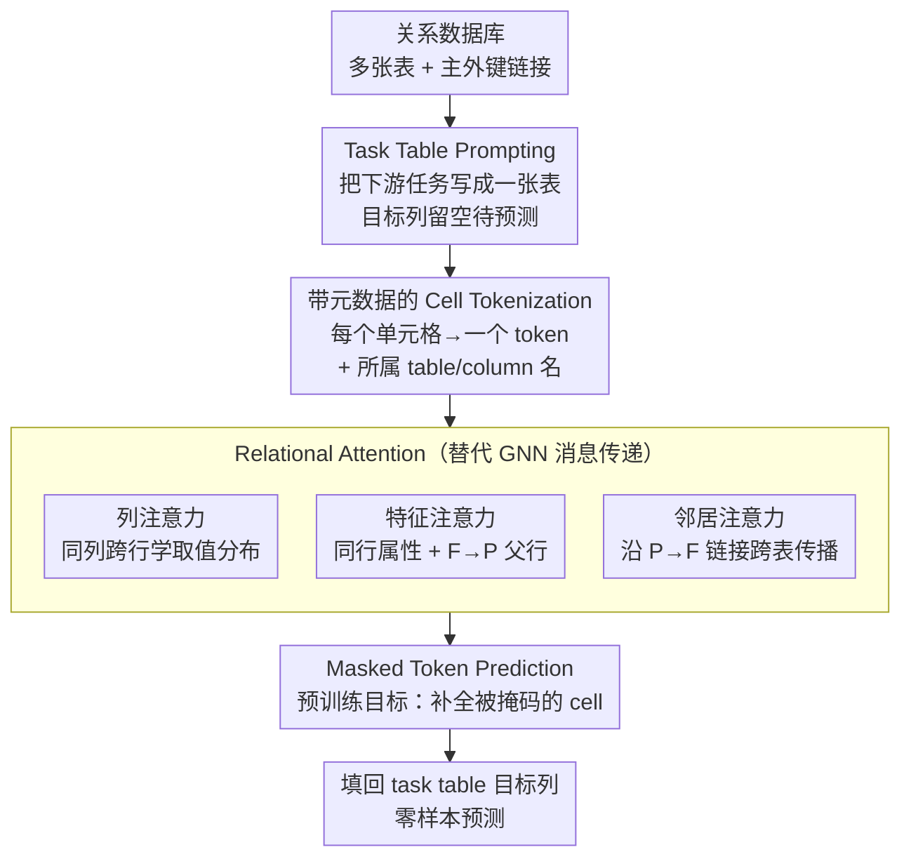

# Relational Transformer: Toward Zero-Shot Foundation Models for Relational Data

**会议**: ICLR 2026  
**arXiv**: [2510.06377](https://arxiv.org/abs/2510.06377)  
**代码**: [snap-stanford/relational-transformer](https://github.com/snap-stanford/relational-transformer)  
**领域**: 关系数据建模 / 基础模型  
**关键词**: 关系数据库, 零样本学习, Transformer, 基础模型, 关系注意力

## 一句话总结
提出 Relational Transformer (RT) 架构，通过 task table prompting、cell tokenization 和 Relational Attention 机制，在多个关系数据库上预训练后可零样本迁移到未见过的数据集和任务，22M 参数模型零样本 AUROC 达到全监督方法的 93%，远超 27B LLM 的 84%。

## 研究背景与动机
预训练 Transformer 在序列建模任务中已能通过零样本提示轻松适应新任务，但关系数据领域至今缺乏能跨数据集和任务迁移的架构。核心挑战在于关系数据的多样性：不同的异构 schema、图结构和函数依赖关系使得设计通用架构极为困难。现有方法通常针对单一数据集训练，无法在未见过的数据库上直接应用。大语言模型虽具备一定泛化能力，但对结构化关系数据的理解不足（27B LLM 仅达 84% AUROC）。本文的核心思路是：像文本领域的 foundation model 一样，为关系数据构建可预训练、可零样本迁移的通用架构。

## 方法详解

### 整体框架
RT 想解决的是：让关系数据库也有一个像 NLP/CV 那样能跨数据集、跨任务零样本迁移的通用骨架。它的输入是一整个关系数据库（多张表 + 主键-外键链接），外加一张用 "task table"（任务表）形式声明的下游任务表，其目标列被留空。RT 先把数据库里每个单元格（cell）连同它所属的表名、列名一起编码成一个 token；再用 Relational Attention（关系注意力）沿列、行、主外键链接三个维度传播信息，并辅以标准自注意力做无约束的全局交互；最后在 task table 那一列空格上做掩码 token 预测、把答案"填回去"。整套流程不接任务特定预测头、不检索 in-context 示例，所以同一个预训练好的模型能直接零样本套到没见过的新数据库的新任务。

### 关键设计

**1. Task Table Prompting：把"要预测什么"也写成一张表**

关系数据的零样本难点在于不同数据库的任务千差万别，传统做法要为每个任务接一个预测头或检索 in-context 示例。RT 借鉴 NLP 的 prompt 思路，把任务本身编码成一张 task table——表里放着待预测实体的 ID 和一列空着的目标列（如客户流失标签），模型要做的就是依据数据库中其余表的上下文，把这列空格"填回去"。注意它和 few-shot 不同：任务行提供的是"in-context 标签"，并不需要显式的子图-标签配对样例。这样一来，用户流失预测、销售额预测等不同任务在形式上被统一成"补全 task table 的目标列"，同一个预训练模型无需微调、无需挑选示例就能切换任务，零样本迁移由此成为可能。

**2. 带元数据的 Cell Tokenization：让结构信息进得了 token**

直接把表格行序列化成文本（XML/JSON/CSV）喂给 LLM 会丢掉"这个值来自哪张表的哪一列"这类结构信息，而这恰恰是关系数据的关键。RT 改为把每个单元格当作一个独立 token，其嵌入由两部分拼成：可训练的、按数据类型（数值/文本/时间）特化的取值编码，加上冻结的语言模型对该单元格所属 table 名、column 名的嵌入。这种 cell 级粒度既让所有下游任务都能统一写成"掩码 token 预测"，也让模型在算注意力时能区分同名不同表的列、感知列的语义类型，是后续 Relational Attention 能按维度组织注意力的前提。

**3. Relational Attention：用三种结构化注意力替代 GNN 的消息传递**

传统 Transformer 在一维序列上算注意力，无法刻画表格的二维结构和跨表链接，这是 RT 最核心的创新。RT 让每个 cell token 沿三种关系模式各做一路注意力：**列注意力**（column attention）在同一列的不同行间计算，用来学习该列的取值分布；**特征注意力**（feature attention）在同一行的各列之间、以及沿 F→P 链接连到的父行之间计算，用来混合同一实体内部及其所属父实体的属性；**邻居注意力**（neighbor attention）沿 P→F 链接向子行传播，用来跨表汇聚关联实体的信号。三者之外再叠加一路标准自注意力做无约束的全局交互。这样信息能在"列内分布—行内/父行属性—跨表邻居"这几个层面充分流动，等价于在 cell 级别完成了 GNN 式的关系建模，却复用了 Transformer 成熟的训练机制。消融显示去掉 Relational Attention 后性能显著下降，印证它是零样本能力的主要来源。

**4. Masked Token Prediction 预训练：用 BERT 式自监督学通用关系表示**

为了让模型在见到新数据库前就具备通用的关系归纳能力，RT 以掩码 token 预测为预训练目标，类似 BERT 的掩码语言建模，只是被掩码和预测的对象换成关系数据的 cell token。正因为设计 2 把任意任务都统一成了 cell token，这个自监督目标能无差别地覆盖预测、补全等各类任务。预训练在多个异构的 RelBench 数据集上联合进行（涵盖客户流失、销售预测等任务），强迫模型从上下文单元格中恢复被遮住的值，从而习得跨 schema 通用的特征表示——这正是它能零样本套到未见数据集的能力底座。

### 训练策略
完整流程分三段递进：先在 RelBench 的多个数据集上联合**预训练**，并用 leave-one-out 策略留出目标数据集，保证评测时数据库是模型没见过的（零样本 AUROC 约为全监督的 90.3%）；随后做**继续预训练（continued pretraining）**，在目标数据集上接着训但仍留出目标任务，让模型熟悉新库分布（升到约 93.1%）；最后在目标任务上**微调**，此时展现出很高的样本效率。整个模型仅 22M 参数，却在零样本下对位 27B 的 LLM，说明匹配数据特性的归纳偏置比单纯堆参数更划算。

## 实验关键数据

### 主实验

| 方法 | 指标 | 零样本结果 | 说明 |
|------|------|-----------|------|
| RT (22M, 零样本) | Binary AUROC | 93% of 全监督 | 单次前向传播 |
| 27B LLM (零样本) | Binary AUROC | 84% of 全监督 | 远大模型仍不及 RT |
| RT (微调) | Binary AUROC | SOTA | 高样本效率 |

### 关键发现
- RT 零样本性能平均达到全监督 AUROC 的 93%，仅需单次前向传播
- 相比 27B 参数的 LLM，22M 参数的 RT 在零样本设置下高出 9 个百分点
- 微调后达到 SOTA，且具有很高的样本效率
- 消融分析表明 RT 的零样本迁移依赖于任务上下文、关系注意力模式和 schema 语义信息的共同作用

### 消融实验

| 配置 | 说明 |
|------|------|
| 无 Relational Attention | 性能显著下降，证明关系注意力的重要性 |
| 无 Task Table Prompting | 无法进行零样本推断 |
| 无 Metadata | cell token 缺乏结构信息，性能下降 |
| 预训练数据集数量 | 更多数据集带来更好的泛化 |

## 亮点与洞察
- **架构设计精妙**: Relational Attention 从列、行、主外键三个维度建模关系，完美契合关系数据库的结构特性
- **效率惊人**: 22M 参数的小模型在零样本设置下远超 27B 的 LLM，说明针对数据特性设计的归纳偏置比暴力扩大参数更有效
- **Task Table Prompting 是关键创新**: 将任务本身也编码为表格形式，使得模型无需额外的任务头或微调即可执行不同任务
- **开启了关系数据的基础模型时代**: 类似于 GPT 之于文本、ViT 之于图像，RT 为关系数据领域提供了第一个有效的基础模型框架

## 局限与展望
- 预训练数据集主要来自 RelBench，领域覆盖有限，尚需更多异构数据源验证泛化性
- 零样本性能虽好但与全监督仍有 ~7% 差距，few-shot 设置有进一步提升空间
- 当前仅在二分类任务上展示零样本结果，回归和多分类任务需要更多探索
- 对极复杂 schema（数十张表、复杂多对多关系）的扩展性有待验证
- 后续工作 PluRel 通过合成数据进一步改进了预训练和架构

## 相关工作与启发
- **与 TabPFN 的区别**: TabPFN 处理单表数据，RT 处理多表关系数据
- **与 LLM 的区别**: LLM 将表格序列化为文本丢失了结构信息，RT 保留了关系结构
- **与 GNN on relational data 的区别**: RT 直接在表格单元格级别建模，通过 Relational Attention 替代 GNN 的消息传递
- **启发**: 为每种数据模态设计匹配的归纳偏置比通用的 LLM 更高效；task prompting 的理念可以推广到其他结构化数据领域

## 评分
- 新颖性: ⭐⭐⭐⭐⭐
- 实验充分度: ⭐⭐⭐⭐
- 写作质量: ⭐⭐⭐⭐⭐
- 价值: ⭐⭐⭐⭐⭐

<!-- RELATED:START -->

## 相关论文

- [\[ICLR 2026\] Zero-shot Forecasting by Simulation Alone](zero-shot_forecasting_by_simulation_alone.md)
- [\[ICLR 2026\] Relational Feature Caching for Accelerating Diffusion Transformers](relational_feature_caching_for_accelerating_diffusion_transformers.md)
- [\[ICLR 2026\] CPiRi: Channel Permutation-Invariant Relational Interaction for Multivariate Time Series Forecasting](cpiri_channel_permutation-invariant_relational_interaction_for_multivariate_time_se.md)
- [\[ICLR 2026\] Efficient Autoregressive Inference for Transformer Probabilistic Models](efficient_autoregressive_inference_for_transformer_probabilistic_models.md)
- [\[ICLR 2026\] GARLIC: Graph Attention-based Relational Learning of Multivariate Time Series in Intensive Care](garlic_graph_attention-based_relational_learning_of_multivariate_time_series_in_.md)

<!-- RELATED:END -->
