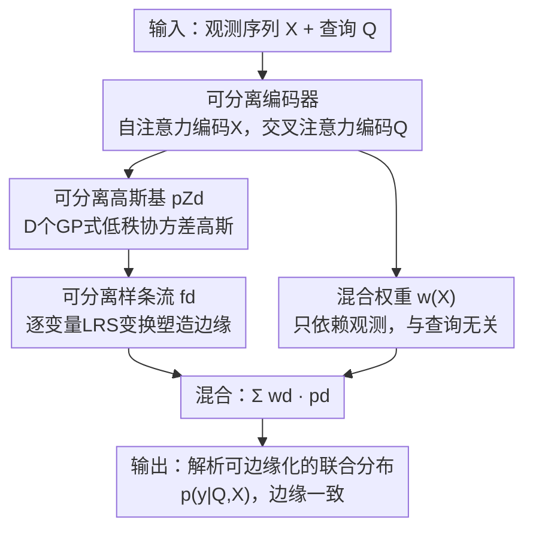

# 通过边缘一致流实现不规则时间序列的可靠概率预测

**会议**: ICLR 2026  
**OpenReview**: [https://openreview.net/forum?id=awWi4hJI7O](https://openreview.net/forum?id=awWi4hJI7O)  
**代码**: https://github.com/yalavarthivk/separable_flows  
**领域**: 概率时间序列预测 / 不规则时间序列 / 归一化流  
**关键词**: 边缘一致性, 不规则时间序列, 归一化流, 高斯过程, 混合模型

## 一句话总结
本文提出 MOSES（Mixtures of Separable Flows），用「多元高斯源分布 + 逐变量可分离样条变换」的混合归一化流来对不规则时间序列做概率预测，让模型天然满足"边缘一致性"——子集查询的预测和从联合分布积分出来的边缘完全自洽，从而在边缘预测上大幅超过此前最强的 ProFITi，同时联合预测仍保持接近 SOTA。

## 研究背景与动机

**领域现状**：不规则采样时间序列（如 ICU 病人的生命体征记录）的概率预测，需要模型能在**任意时间点、任意变量子集**上给出预测分布——查询点数 $K$ 和上下文长度 $N$ 都随样本变化。现有能给出真正联合分布的方法主要是高斯过程回归（GPR）和基于归一化流的 ProFITi。

**现有痛点**：GPR 边缘一致但只能建模高斯分布，表达力受限；ProFITi 用归一化流表达力很强、联合预测很准，但它**违反边缘一致性**——同一上下文下，直接查询单个变量得到的边缘分布，和先预测联合再把其它变量积分掉得到的边缘分布对不上。论文用一个 ICU 例子点破危害：模型单独查询时说血压"90% 概率稳定"，但从生命体征联合分布推断时却只有"60%"，这种自相矛盾在临床决策里是致命的。

**核心矛盾**：表达力（用非可分离的流捕捉复杂依赖）与一致性（要求边缘分布可解析地从联合中分离出来）之间被认为存在一个"虚假的对立"——要么像 GPR 一样一致但只能高斯，要么像 ProFITi 一样灵活但不一致。

**本文目标**：构造一个既保持现代流方法表达力、又**严格满足边缘一致性**的不规则时间序列概率预测模型，并证明一致性不必以明显的性能损失为代价。

**切入角度**：作者把边缘一致性上升为一条**数学必要条件**——根据 Kolmogorov 扩张定理，只有满足联合预测（R1）、置换不变（R2）、边缘一致/投影不变（R3）三条要求，模型才真正定义了一个合法的随机过程。更进一步，由数据处理不等式（DPI），一旦模型一致，联合预测准就能"保证"任意子集的边缘预测也准，一致性反而成了性能护栏。

**核心 idea**：不要让归一化流的非线性变换去捕捉变量间依赖，而是**把依赖关系塞进一个有完整协方差的高斯源分布里，变换只做逐变量的"可分离"塑形**——这样边缘化就退化为对高斯选行选列，天然一致；再用混合（mixture）找回非高斯的表达力。

## 方法详解

### 整体框架
MOSES 要解决的核心问题是：如何让一个表达力强的归一化流，在边缘化（积掉某些变量）时仍然自洽。它的整体思路是把"建模依赖"和"建模边缘形状"两个职责彻底拆开——前者交给一个 $D$ 路混合的多元高斯源分布（依赖藏在协方差里），后者交给作用在每个变量上、互不耦合的样条变换（只塑形边缘）。因为高斯、混合、逐变量单调变换这三种操作各自都边缘一致，组合起来的整个模型就一致。

具体地，编码器把观测 $X$ 和查询 $Q$ 编成嵌入，喂给 $D$ 个"可分离流"分量：每个分量先采一个低秩协方差的多元高斯 $z\sim p_{Z_d}$，再对 $z$ 的每个分量独立施加一个条件样条变换 $\phi$ 得到 $y$；$D$ 个分量按只依赖观测的权重 $w(X)$ 混合，最终给出联合密度 $\hat p(y\mid Q,X)$。由于每一步都可解析边缘化，任意子集查询都能直接得到与联合自洽的边缘分布。

### 关键设计

**1. 把边缘一致性 R3 立为硬约束：从"可有可无"升级成必要条件**

此前工作（包括 ProFITi）只强调联合预测（R1）和置换不变（R2），把边缘一致性当作可选项。本文把它形式化为 R3：对查询 $Q$ 去掉第 $k$ 项得到的子查询 $Q_{-k}$，模型在 $Q_{-k}$ 上的联合预测，必须等于在完整 $Q$ 上的预测把第 $k$ 个变量积分掉，即 $\hat p(y_{-k}\mid Q_{-k},X)=\int_{\mathbb{R}}\hat p(y\mid Q,X)\,dy_k$，并可归纳推广到任意子集。论文证明：满足 R1–R3 的模型恰好通过 Kolmogorov 扩张定理实现了一个定义在索引集 $T=\mathbb{R}\times\{1,\dots,C\}$ 上的合法随机过程，否则模型就是"不自洽"的。一致性不只为数学严谨：由数据处理不等式，$D_{\mathrm{KL}}$ 在边缘化下不增，所以**联合准 + 一致 ⇒ 任意子集边缘也准**，等于给边缘预测上了性能保险。这条原则是后面所有架构取舍的出发点。

**2. 可分离构造：把变量依赖塞进高斯源分布，变换只做逐变量塑形**

ProFITi 的不一致根源在于它用非可分离的流变换来耦合变量，导致边缘无法解析分离。本文反其道而行：用一个"可分离"变换 $f(z\mid Q,X)=\big(\phi(z_1\mid Q_1,X),\dots,\phi(z_K\mid Q_K,X)\big)$，其中每个 $\phi$ 只看自己的查询和共享上下文、不看别的变量（Lemma 3.1）。这样变换本身完全不引入跨变量依赖，所有依赖都来自源分布——一个 GP 式的多元高斯 $\mathcal N(\mu(X,Q),\Sigma(X,Q))$，均值和协方差按 $\mu_k=\tilde\mu(Q_k,X)$、$\Sigma_{k,\ell}=\tilde\Sigma(Q_k,Q_\ell,X)$ 可分离参数化。论文证明：**可分离变换 + 边缘一致的源分布 = 边缘一致的模型**（Lemma 3.1）。高斯边缘化只是选行选列，逐变量单调样条边缘化只是对应分量做变量代换，二者都解析、都一致。这在精神上接近高斯 Copula 过程——把线性依赖结构和单变量边缘形状解耦。

**3. 混合可分离流（MOSES 四件套）：用混合找回非高斯表达力，权重保持查询无关**

单个高斯源分布只能表达线性依赖、边缘也偏简单。MOSES 用 $D$ 个可分离流的混合 $\hat p(y\mid Q,X)=\sum_{d=1}^{D} w_d(X)\,\hat p_d(y\mid Q,X)$ 来提升表达力（Lemma 3.2 保证混合仍满足 R1–R3）。整个模型由四个组件拼成：**① 可分离编码器**，观测经自注意力编成 $h^{\mathrm{OBS}}$，查询经对观测的交叉注意力编成 $h$，再 reshape 成 $D$ 路 query-specific 编码 $h_{d,k}$；**② 可分离高斯基**，用 $h_d$ 线性/二次地参数化 $\mu_d,\Sigma_d$；**③ 可分离样条变换**，每个分量对 $z$ 逐分量施加共享参数的线性有理样条（LRS）$\phi$，同一套 $\theta^{\mathrm{FLOW}}$ 处理任意数量变量；**④ 混合权重**，$w=\mathrm{softmax}(\mathrm{MHA}(\beta,h^{\mathrm{OBS}},h^{\mathrm{OBS}}))$。这里最关键的约束是**权重只能依赖观测 $X$、不能依赖查询 $Q$**——因为若权重随查询的具体子集变化，混合就破坏了边缘一致性（这也是论文承认的一个表达力代价）。

**4. 低秩协方差 + njNLL 训练：让联合似然在大查询规模下可算**

朴素计算多元高斯密度需要对 $K\times K$ 协方差求逆与行列式，$O(K^3)$ 在大查询下不可承受。本文把协方差设计成低秩修正形式 $\Sigma_d=I_K+UU^\top$（即 $\Sigma_{k,l}=\delta_{kl}+(h_{d,k}\theta^{\mathrm{COV}})(h_{d,l}\theta^{\mathrm{COV}})^\top/\sqrt{M'}$），借助 Woodbury 与 Weinstein–Aronszajn 恒等式把复杂度降到 $O(M'^2 K)$，其中秩 $M'$ 与 $K$ 无关，因此 $K\gg M'$ 时可良好扩展；同时 $\Sigma$ 是正定加半正定，恒为正定。训练目标是归一化联合负对数似然 njNLL：$\mathcal L_{\mathrm{njNLL}}(\theta)=\frac{1}{|B|}\sum_{(Q,X,y)\in B}\frac{-1}{|y|}\log\hat p(y\mid Q,X)$，用 $1/|y|$ 归一化以适配变长的目标集合。由于样条定义域受限，均值的平移无法被样条补偿，端到端训练在很大程度上规避了可辨识性问题。

### 损失函数 / 训练策略
训练用 Adam，学习率 0.001，batch size 64；超参搜索覆盖混合分量数 $D\in\{1,3,5,7,10\}$、注意力头数 $\{1,2,4\}$、隐维 $M,F\in\{16,32,64,128\}$。所有模型用 PyTorch 实现，在 RTX 3090 / A40 / GTX 1080 Ti 上训练。

## 实验关键数据

数据集：一个气候数据集 USHCN，三个医疗数据集 PhysioNet'12、MIMIC-III、MIMIC-IV，均为不规则采样、含缺失值。医疗数据观测前 36h、预测后 3 步；USHCN 观测 3 年、预测 3 步。统一训练目标为 njNLL，评测两个指标：njNLL（联合密度，越低越好）与 mNLL（单变量边缘密度，越低越好）。好模型应在两者上都好。

### 主实验

联合 njNLL 对比（越低越好）：

| 数据集 | ProFITi（不一致） | GPR（一致） | GMM（一致） | MOSES（本文） |
|--------|------|------|------|------|
| USHCN | -3.226 | 2.011 | 1.050 | **-3.357** |
| PhysioNet'12 | **-0.647** | 1.367 | 1.063 | -0.491 |
| MIMIC-III | **-0.377** | 3.146 | 1.160 | -0.305 |
| MIMIC-IV | **-1.777** | 2.011 | 1.076 | -1.668 |

边缘 mNLL 对比（训练用 njNLL，评测 mNLL，越低越好）：

| 数据集 | ProFITi（不一致） | GPR（一致） | GMM（一致） | MOSES（本文） |
|--------|------|------|------|------|
| USHCN | -3.324 | 1.235 | 1.042 | **-3.355** |
| PhysioNet'12 | -0.016 | 1.161 | 1.069 | **-0.271** |
| MIMIC-III | 0.408 | 1.341 | 1.124 | **0.163** |
| MIMIC-IV | 0.500 | 1.161 | 1.075 | **-0.634** |

可以看到：在联合 njNLL 上 MOSES 与 ProFITi 互有胜负（USHCN 反超，其余略逊），但**显著超过所有边缘一致的基线**（GPR/GMM/单变量方法）；在边缘 mNLL 上 MOSES 几乎全面领先 ProFITi——ProFITi 因不一致，从 njNLL 到 mNLL 性能明显塌陷（如 MIMIC-IV 从 -1.777 掉到 +0.500），MOSES 则保持稳定（MIMIC-IV 仍是 -0.634）。

### 消融与分析实验

| 配置 | 含义 | 关键发现 |
|------|------|---------|
| MOSES(1) | 单分量 | 表达力不足，无法拟合弯曲分布（图 2） |
| MOSES(4) | 4 分量 | 几个分量就能显著改善，逼近正确分布 |
| GMM | MOSES 去掉流变换 | 边缘一致但表达力差，需极多分量 |
| ProFITi-TF | ProFITi 换用 MOSES 编码器 | MIMIC-III/IV 上 MOSES 反超，说明 ProFITi 优势多来自编码器 |
| MOSES-GraFITi | MOSES 换用 ProFITi 的 GraFITi 编码器 | 联合 njNLL 显著优于 ProFITi，但因编码器不一致，mNLL 反而变差 |

Energy Score / CRPS 对比（表 3）进一步显示：MOSES 的 CRPS（单变量）在 PhysioNet'12、MIMIC-III、MIMIC-IV 上均优于 ProFITi，印证其边缘质量更好。

### 关键发现
- **一致性提供性能护栏**：ProFITi 联合好、边缘崩；MOSES 联合接近、边缘全面领先，验证了 DPI 论点——一致模型的边缘预测不会因边缘化而恶化。
- **混合分量是表达力来源**：MOSES(1) 拟合不了弯曲分布，MOSES(4) 就能；只需少数分量即可达到甚至超过无流的 GMM。
- **ProFITi 的优势主要在编码器**：换上同样编码器后 MOSES 在两个 MIMIC 上反超，说明其概率建模组件并非决定性优势。
- **编码器一致性不可替换**：MOSES-GraFITi 虽然联合更好，但用了不一致的编码器后 mNLL 退化，说明一致性必须贯穿编码器到概率组件。

## 亮点与洞察
- **"依赖归源分布、形状归变换"的解耦**很优雅：把边缘一致性从"难以约束的变换性质"转化为"源分布可解析边缘化"的简单条件，直接绕开了"无法对一般流变换施加一致性约束"的难题。
- **把数学严谨性翻译成可量化收益**：用 Kolmogorov 扩张定理 + 数据处理不等式，把"自洽"这个看似哲学的要求落到"边缘预测有性能保证"，让一致性不再是纯理论装饰。
- **低秩协方差 + Woodbury** 是可复用 trick：任何需要在变长目标上算多元高斯似然的场景，都能用 $\Sigma=I+UU^\top$ 把 $O(K^3)$ 降到 $O(M'^2K)$。
- **混合权重必须查询无关**这一限制本身就是一致性的"代价显式化"，给后续工作明确指出了改进空间。

## 局限与展望
- **可分离约束牺牲联合表达力**：依赖只能通过低秩高斯协方差和混合来表达，无法像非可分离流那样直接用变换捕捉复杂依赖，因此联合 njNLL 上有时不及 ProFITi。
- **混合权重不能依赖查询**：作者明确指出这是 R1–R3 强制的必要条件，让权重随查询时间点自适应或许能改善联合预测，但会破坏一致性，构成根本性 trade-off。
- **边缘一致性目前只验证到单变量边缘**：多变量边缘原则上可算但计算上不可承受（MI 指标也只用单变量边缘的 2-Wasserstein 估计）。
- **展望**：作者计划探索 Copula 模型、概率电路等更灵活但仍保持一致性的架构，核心挑战是把这些方法适配到不规则时间序列设定。

## 相关工作与启发
- **vs ProFITi**：ProFITi 用非可分离三角注意力流，联合表达力强但边缘不一致；MOSES 用可分离流 + GP 源分布，牺牲少量联合表达力换来严格一致与更强边缘预测。
- **vs GPR**：GPR 边缘一致但只能高斯；MOSES 在高斯源分布上叠加样条变换与混合，保留一致性同时获得非高斯表达力。
- **vs GMM**：GMM 可看作 MOSES 去掉流变换，一致但需海量分量才能近似复杂分布；加上流后 MOSES 用少数分量即达更好效果。
- **vs TACTiS / TACTiS-2**：这些 Copula 注意力模型面向规则、全观测数据，其非可分离编码器与 Copula 结构同样缺乏边缘一致性，且难以直接适配不规则序列。

## 评分
- 新颖性: ⭐⭐⭐⭐⭐ 首次把边缘一致性形式化为不规则时序概率预测的必要条件，并给出"依赖归源分布"的可分离流构造
- 实验充分度: ⭐⭐⭐⭐ 四个真实数据集 + 双指标 + 多组消融，但多变量边缘一致性未充分验证
- 写作质量: ⭐⭐⭐⭐⭐ 从随机过程公理到架构设计逻辑链清晰，理论与直觉兼顾
- 价值: ⭐⭐⭐⭐⭐ 医疗等高可靠场景下，自洽的概率预测有直接落地价值

<!-- RELATED:START -->

## 相关论文

- [\[ICLR 2026\] pyrregular: A Unified Framework for Irregular Time Series, with Classification Benchmarks](pyrregular_a_unified_framework_for_irregular_time_series_with_classification_ben.md)
- [\[ICLR 2026\] Learning Recursive Multi-Scale Representations for Irregular Multivariate Time Series Forecasting](learning_recursive_multi-scale_representations_for_irregular_multivariate_time_s.md)
- [\[ICLR 2026\] Delta-XAI: A Unified Framework for Explaining Prediction Changes in Online Time Series Monitoring](delta-xai_a_unified_framework_for_explaining_prediction_changes_in_online_time_s.md)
- [\[ICLR 2026\] When Foundation Models Are One-Liners: Limitations and Future Directions for Time Series Anomaly Detection](when_foundation_models_are_one-liners_limitations_and_future_directions_for_time.md)
- [\[ICLR 2026\] HiVid: LLM-Guided Video Saliency For Content-Aware VOD And Live Streaming](hivid_llm-guided_video_saliency_for_content-aware_vod_and_live_streaming.md)

<!-- RELATED:END -->
