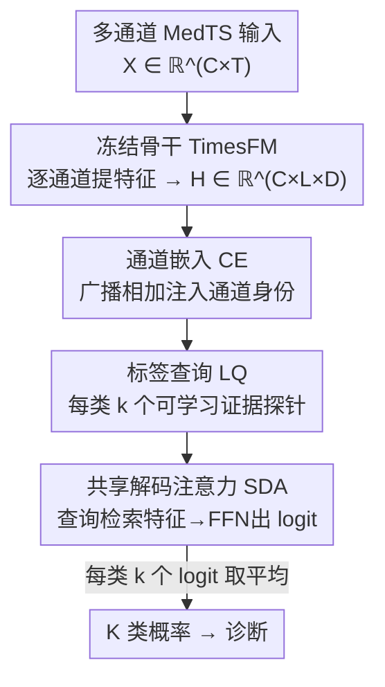

# Repurposing Foundation Model for Generalizable Medical Time Series Classification

**会议**: ICLR 2026  
**OpenReview**: [https://openreview.net/forum?id=wNEzRYiyZM](https://openreview.net/forum?id=wNEzRYiyZM)  
**代码**: https://github.com/DL4mHealth/FORMED  
**领域**: 时间序列 / 医学信号 / 基础模型适配  
**关键词**: 医学时间序列, 基础模型复用, 通道嵌入, 标签查询, 跨数据集泛化

## 一句话总结
FORMED 把一个在通用时间序列上预训练好的预测基础模型（TimesFM）冻住当特征提取器，外接一个由「通道嵌入 + 标签查询 + 共享解码注意力」组成的新分类头，通过在多个 MedTS 数据集上联合训练把医学领域知识沉淀进共享层，从而只用 0.1% 参数就能适配任意通道数 / 序列长度 / 类别数的新医学时序数据集，在 ADFTD 上 F1 绝对提升最高达 35%。

## 研究背景与动机
**领域现状**：医学时间序列（MedTS，如 EEG 脑电、ECG 心电）分类是诊断阿尔茨海默、帕金森、心律失常等疾病的关键。主流做法是为每个数据集 / 任务从头训练一个专用模型（Task-Specific Model, TSM），或在一个固定的预训练骨干上挂适配器 + 任务头做 Task-Specific Adaptation（TSA）。

**现有痛点**：MedTS 数据天然异质——不同数据集通道数（12～33）、采样率、信号长度、诊断类别（二分类到 5 分类）全都不一样，同一数据集内不同病人之间也差异巨大，加上隐私和采集成本导致单个数据集样本少。TSM 必须每个数据集重训、无法共享知识；TSA 虽然冻骨干、只训少量参数，但它的输入适配器和输出头都被「焊死」在初始任务上，换数据集就不能复用，反而容易过拟合，作者的试点实验显示 TSA 相对从头训练的增益经常微弱甚至为负。

**核心矛盾**：现有适配范式把「通用 / 领域不变的表征」和「任务专属的配置」搅在一起——要么完全不共享（TSM），要么共享的部分（骨干）学不到医学领域知识、而能学领域知识的部分（适配器/头）又被绑定到单一任务无法迁移。预测型时序基础模型虽能学到通用时序表征，但它们多是单变量、通道独立设计，且为预测（序列→序列）而非分类（序列→类别）而生，直接拿来分类抓不住跨通道的诊断模式。

**本文目标**：让一个预测型基础模型既能跨数据集复用医学领域知识，又能用极少参数适配任意新配置的 MedTS 数据集，做到「泛化适配」（Generalizable Adaptation, GA）。

**切入角度**：作者提出把「领域不变的表征学习」和「任务专属的适配」在**架构上彻底解耦**——领域知识放进一个跨数据集共享、训完即冻结的注意力层；通道数和类别数这些任务专属信息放进可动态扩容的轻量参数里。

**核心 idea**：用「重定向（repurposing）」代替「重编程（re-programming）」——冻住预测基础模型的骨干，换上一个把「共享领域知识」与「任务专属配置」分离的注意力分类头，让共享头一次训练、终身复用。

## 方法详解

### 整体框架
FORMED 的输入是任意 MedTS 多通道信号 $X \in \mathbb{R}^{C \times T}$（$C$ 通道、$T$ 时间点），输出是 $K$ 类诊断的概率分布。整条流水线分三个阶段：**预训练**已由 TimesFM 在通用时序上完成（与本文无关，直接拿来用）；**重定向（Repurposing）**把骨干冻住、换上新分类头，在一个由 5 个 MedTS 数据集组成的 cohort 上联合训练，目的是把医学领域知识沉淀进分类头里那层共享的注意力；**适配（Adapting）**面对一个全新数据集时，骨干和共享注意力层全部冻结，只新建并训练该数据集专属的通道嵌入和标签查询（约占总参数 0.1%）。

骨干以**通道独立**方式逐通道处理：对每个通道的单变量信号 $f: \mathbb{R}^{T} \to \mathbb{R}^{L \times D}$ 提取出 $L$ 个维度为 $D$ 的 patch token，堆叠成 $H \in \mathbb{R}^{C \times L \times D}$。随后分类头登场：通道嵌入给每个 token 注入「这是哪条通道」的空间拓扑信息，标签查询作为每个类别的「证据探针」，共享解码注意力让查询去所有通道特征里检索证据并出 logit。三个组件中只有共享解码注意力承载跨数据集知识，通道嵌入和标签查询永远是当前数据集专属的。

### 关键设计

**1. 重定向范式：把领域知识与任务配置在架构上解耦**

这一设计直击「TSA 的共享部分学不到医学知识、能学知识的部分又绑死任务」的核心矛盾。作者形式化区分了两个阶段：重定向（Definition 3.1）是把预训练模型的目标改到一类新任务上——冻住骨干 $f$，只训练一个小而可适配的输出网络 $h_\theta$，训练目标是在多个 MedTS 数据集上最小化交叉熵，把领域知识压进共享参数 $\theta$：$\theta^*, \mathcal{E}^*, \mathcal{Q}^* = \arg\min_{\theta,\mathcal{E},\mathcal{Q}} \mathbb{E}_{i,(X_i,y_i)}\big[\mathcal{L}_{CE}(h_\theta|_{Q_i,E_i}(f(X_i)), y_i)\big]$。适配（Definition 3.2）则是把训好的模型（$\theta^*$ 和骨干都冻住）用到新数据集，只为新数据集学新的通道嵌入 $E'$ 和标签查询 $Q'$。与「重编程」的本质区别在于：重编程的输入适配器和任务头都高度专用、换数据集就报废；重定向刻意让承载领域知识的层独立于具体的通道数 $C$、token 长度 $L$、类别数 $K$，因而能跨任务一直复用，这正是泛化性的来源。

**2. 通道嵌入（CE）：用可动态扩容的嵌入解耦「空间拓扑」与「时序特征」**

MedTS 的通道数随数据集变化（EEG 几十导、ECG 12 导），且骨干是通道独立处理的、根本不知道通道之间的空间关系。CE 为每条通道引入一个可学习向量 $E \in \mathbb{R}^{C \times D}$，以广播相加的方式注入到该通道的所有 token 上，得到「通道感知」特征 $\tilde{H}_{c,l,:} = H_{c,l,:} \oplus E_{c,:}$。这样就把「这是哪条导联、它在医学模态里的空间角色」这一信息从通用时序特征里剥离出来单独编码。CE 是任务专属的：面对新数据集（哪怕通道数完全不同）只需按其通道数初始化一组新 CE 来训，骨干和共享层纹丝不动，从架构上支持任意通道配置。

**3. 标签查询（LQ）：把每个诊断类别变成一组可学习的「证据探针」**

为了应对不同任务类别数 $K$ 不一，并给每个类别一个明确的可学习锚点，FORMED 用标签查询 $Q \in \mathbb{R}^{K \times D}$，每一行 $Q_{i,:}$ 代表第 $i$ 类、主动到通道感知特征里去「找支持本类的证据」。关键细节是每个类别用 $k$ 个查询（而非 1 个），即 $Q \in \mathbb{R}^{(K\cdot k)\times D}$，让每类能从多个「视角 / 子模式探测器」捕捉复杂或多样的判别特征；$k$ 是超参，相当于给每类配多少个证据探针。LQ 同样任务专属、随数据集新建并训练，因此换类别数也只是改 $Q$ 的行数。

**4. 共享解码注意力（SDA）：一层跨数据集共享、训完即冻的注意力承载医学领域知识**

SDA 是整个分类头的核心，也是唯一被跨数据集共享、并在适配阶段冻结的部分。它是单层 Transformer 解码器：以全部 $K\cdot k$ 个标签查询为 query，以展平后的通道感知特征 $\text{Flatten}(\tilde{H}) \in \mathbb{R}^{(C\cdot L)\times D}$ 为 key/value，经多头注意力 + 前馈网络产出原始 logit $\hat{y}_{raw} = \text{FFN}(\text{MHA}(Q, \text{Flatten}(\tilde{H}), \text{Flatten}(\tilde{H})))$。由于每类有 $k$ 个 logit，再对这 $k$ 个取平均得到该类最终 logit $\hat{y}_j = \frac{1}{k}\sum_{i=1}^{k}(\hat{y}_{raw})_{(j-1)k+i}$，最后 softmax 出概率。设计精髓在于：SDA 的参数 $\theta$ 与 $C$、$L$、$K\cdot k$ 全都无关，这迫使它去学「特征与类别如何交互」这种**任务无关的通用诊断模式**，而把所有任务专属的伸缩交给 CE 和 LQ。于是 SDA 在 cohort 上训完一次，就能被任何未来数据集直接复用——这是「0.1% 参数即可适配新数据集」的根本原因。

### 损失函数 / 训练策略
两个阶段都用交叉熵损失。重定向阶段在 5 个 MedTS 数据集组成的 cohort 上联合训练 $\theta$、$\mathcal{E}$、$\mathcal{Q}$（cohort 约 34 万样本、9000 万时间点，统一固定 $k=16$）；适配阶段冻结骨干与 SDA，只优化新数据集的 $E'$、$Q'$，可训练参数约占总量 0.1%。所有适配实验跑 5 个随机种子取平均。

## 实验关键数据

### 主实验
在 cohort 内 5 个数据集上做 patient-independent（测试集病人训练时完全没见过）评测，对比 11 个 TSM + 4 个 TSA 共 15 个基线：

| 数据集 | 任务 | FORMED 表现 | 对比基线 |
|--------|------|-------------|----------|
| ADFTD | EEG 神经退行 | F1 绝对提升最高 ~35% | 显著优于全部 TSM/TSA |
| PTB / PTB-XL | ECG 心脏 | 中大型数据集增益 30-40% | SOTA 级 |
| TDBrain | EEG（小、简单） | 与最强 TSM 持平 | 仍明显优于 TSA |

FORMED 在所有数据集所有指标上达到 SOTA 级；增益在中大型数据集上尤其突出，小而饱和的简单任务上则与最强 TSM 打平但稳压 TSA。

### 消融 / 分析实验
out-of-domain 新数据集（ECG200、StandWalkJump）上做适配，并扫描每类查询数 $k$：

| 配置 | 关键发现 | 说明 |
|------|---------|------|
| 适配新数据集 | 仅训 0.1% 参数即超过 TimesFM-TSA | 验证 SDA 复用的领域知识有效 |
| 增大 $k$ | 性能随 $k$ 近似幂律增长 | 适配时算力换性能的可调旋钮 |
| ECG200 | $k \ge 64$ 起超过 TimesFM-TSA | 越大数据集需要越多探针 |
| StandWalkJump | $k \ge 16$ 起超过 TimesFM-TSA | 小任务更早超越 |

### 关键发现
- SDA 承载的共享领域知识是泛化核心：cohort 联合训练让它学到任务无关的特征-类别交互模式，直接转化为对未见病人的鲁棒性（应对 intra-dataset 异质）。
- TSA 普遍跑不过 TSM、更远逊于 FORMED，印证「共享骨干 + 简单专用头」难以有效跨任务迁移知识。
- 适配阶段的 $k$ 提供了「算力 ↔ 精度」的幂律标度旋钮，部署时可按数据规模和算力预算调节。

## 亮点与洞察
- **「重定向」概念本身**：明确把它和 prompting / fine-tuning / re-programming 区分开——核心是让承载领域知识的层与任务配置在架构上独立，从而一次训练终身复用，这套思路可迁移到任何「预测基础模型→分类」的跨任务复用场景。
- **CE/LQ 的动态扩容**：用「按需新建一组小嵌入」优雅地化解了通道数、类别数不固定这个让大多数适配方法头疼的工程难题，且不动骨干一根毫毛。
- **每类多查询 + 平均**：用 $k$ 个证据探针捕捉一个类别的多种子模式再平均，既增强表达力又给出一个干净的标度旋钮，是个可复用的小 trick。

## 局限与展望
- 作者明确把稀疏不规则的 EHR 排除在外，只面向连续高频波形（EEG/ECG），换 tokenization 才能覆盖更广义的医学时间序列。
- 只验证了 TimesFM 一个骨干（因资源所限），其它通道独立 / 预测型基础模型是否同样适合复用尚未充分检验。
- 骨干通道独立提特征、跨通道交互全压在单层 SDA 上，对通道间耦合极强的诊断任务，这层容量是否够、是否会成为瓶颈值得进一步探究。

## 相关工作与启发
- **vs TSM（PatchTST/Medformer 等 11 个）**: 它们每个数据集从头训、不共享知识；FORMED 靠 cohort 联合训练的 SDA 共享领域知识，在中大型数据集大幅领先，小数据集持平。
- **vs TSA / re-programming（TimesFM-TSA 等 4 个）**: 它们冻骨干但把适配器+头绑死单任务、换数据集即报废；FORMED 把共享知识与任务配置解耦，适配新数据集只训 0.1% 参数且性能更优、更抗过拟合。
- **vs UniTS / Time-LLM 等通用时序基础模型**: 它们多为单变量通道独立、为预测设计，直接用于多通道 MedTS 分类需全量微调或 prompt 学习、代价高；FORMED 专门补上「跨通道整合 + 序列→类别」的能力。

## 评分
- 新颖性: ⭐⭐⭐⭐⭐ 「重定向」范式 + CE/LQ/SDA 解耦设计，清晰回答了基础模型跨任务复用的痛点
- 实验充分度: ⭐⭐⭐⭐ 5 内 + 2 外数据集、15 基线、patient-independent、$k$ 标度分析较完整，但仅一个骨干
- 写作质量: ⭐⭐⭐⭐⭐ 范式对比（TSM/TSA/GA）和形式化定义讲得很清楚
- 价值: ⭐⭐⭐⭐⭐ 为医疗场景提供了资源高效、可落地的基础模型复用范式

<!-- RELATED:START -->

## 相关论文

- [\[AAAI 2026\] A Unified Shape-Aware Foundation Model for Time Series Classification](../../AAAI2026/time_series/a_unified_shape-aware_foundation_model_for_time_series_class.md)
- [\[NeurIPS 2025\] MIRA: Medical Time Series Foundation Model for Real-World Health Data](../../NeurIPS2025/time_series/mira_medical_time_series_foundation_model_for_real-world_health_data.md)
- [\[ICLR 2026\] Decentralized Attention Fails Centralized Signals: Rethinking Transformers for Medical Time Series](decentralized_attention_fails_centralized_signals_rethinking_transformers_for_me.md)
- [\[ICLR 2026\] Adapt Data to Model: Adaptive Transformation Optimization for Domain-shared Time Series Foundation Models](adapt_data_to_model_adaptive_transformation_optimization_for_domain-shared_time_.md)
- [\[ICLR 2026\] CauKer: Classification Time Series Foundation Models Can Be Pretrained on Synthetic Data](cauker_classification_time_series_foundation_models_can_be_pretrained_on_synthet.md)

<!-- RELATED:END -->
